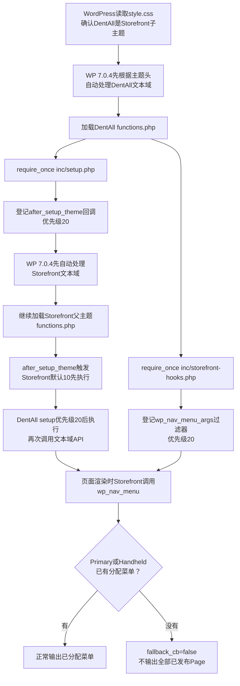

# DentAll 每日复盘 D26：Storefront子主题骨架

## 相关笔记

- 前置笔记：[[Day25-综合验收与批量录入开放]]
- 后续笔记：D27完成后回填
- 同主题决策：`project-docs/DECISIONS.md`中的ADR-T01
- 专题学习入口：[[WordPress实战笔记/WordPress实战笔记索引|WordPress实战笔记索引]]
- 本日学习笔记：[[WordPress实战笔记/Day26-子主题继承与Hook加载机制|Day26-子主题继承与Hook加载机制]]

## 今日三个验收结果

- [x] 现有`dentall`目录成为有效Storefront子主题，父子主题身份、激活状态与最小模块边界可核验。
- [x] 旧Starter阻断模板和遗留样式退出运行链；父主题、WooCommerce与子主题样式按正确顺序且各加载一次。
- [x] 首页、Shop、Cart、My Account及导航位置未分配边界通过Local运行验证，D25 TEST对象与Coming Soon保护状态保持不变。

## 授权与范围

- 用户于2026-08-24明确同意：“复用现有dentall目录转换为Storefront子主题、处理阻断继承的旧Starter模板、保留D25 TEST对象、D26只做骨架与资源加载”。
- 第一版实施仅覆盖主题声明、最小模块加载、旧模板退出继承链、资源加载验证，以及D24已发现的菜单位置未分配时Page回退保护。
- 明确不做：Design Token、页面视觉、组件、交互、图片接入、额外CSS/JS资源、模板定制、后台字段、插件、Staging/Production部署、TEST对象清理。

## 进度真实性检查

- 自然日期：2026-08-24。
- 实际有效工时证据：未记录；本笔记只按落地文件与验证证据判断D26检查点。
- 今天完成或推进的计划检查点：D26 Storefront父子主题边界、正式骨架和资源加载。
- 本日最高验收层级：Local技术验证＋独立Code Review通过。
- 可由用户直接查看、运行或复演的结果：主题目录四个现存文件、Local活动主题身份、四个HTTP页面、样式顺序与导航回退结果。
- 尚未完成的人员、业务、环境或Production验收：Staging未部署/激活；WordPress 7.0.4与Storefront 4.6.2只完成项目代表路径实测；D27四端视觉尚未开始。

## 专注周期记录

| 周期 | 计划 | 实际结果 | 证据/文件 | 用时 |
|---|---|---|---|---:|
| C1 | 复核主题方案与当前实现 | 读取项目规则、Storefront源码、版本和旧主题文件；确认父主题自动加载子主题样式 | `CODEX_WP_WC_RULES.md`、Storefront 4.6.2源码 | 未记录 |
| C2 | 冻结最小骨架 | 记录用户授权、删除阻断继承的四个旧模板并声明`Template: storefront` | `style.css`、ADR-T01 | 未记录 |
| C3 | 建立职责模块 | 主入口只加载主题初始化与Storefront Hook；未创建空资源模块 | `functions.php`、`inc/setup.php`、`inc/storefront-hooks.php` | 未记录 |
| C4 | 处理公开导航回退 | Primary/Handheld未分配菜单时禁用Page fallback；其他位置保持原值 | `inc/storefront-hooks.php`、WP-CLI参数验证 | 未记录 |
| C5 | Local激活与页面冒烟 | 激活DentAll 0.2.0，核对父子身份并验证四个关键页面 | Local WordPress、HTTP响应 | 未记录 |
| C6 | 静态与运行检查 | PHP语法、主题头、禁止项、样式单次加载/顺序、旧标记、错误日志增量通过 | 命令输出与HTTP矩阵 | 未记录 |
| C7 | 独立审查与文档收口 | Code Review Agent复核P0/P1/P2/P3均为0；同步ADR、状态、版本记录和本笔记 | `PROJECT_STATE.md`、`CHANGELOG.md` | 未记录 |

## 实现结果

- `style.css`将主题标识从DentAll Starter 0.1.0更新为DentAll 0.2.0，并声明父主题目录`storefront`。旧Starter的186行独立视觉CSS已移除，D26不预先写D27的Design Token。
- `functions.php`只保留ABSPATH保护和两个职责模块加载，不重复注册Storefront已经提供的WooCommerce支持、菜单位置或通用主题能力。
- `inc/setup.php`保留DentAll显式主题setup入口并再次调用文本域加载API；WordPress 7.0.4已在包含主题`functions.php`前根据主题头自动处理同一文本域，因此当前调用不是首次或唯一入口。`inc/storefront-hooks.php`只处理Primary/Handheld未分配菜单时的Page回退风险。
- `header.php`、`footer.php`、`front-page.php`、`index.php`已删除，因此相应请求继承Storefront模板与Hook。删除的是项目旧Starter覆盖，不是WordPress、WooCommerce或Storefront核心文件。
- 未创建`inc/assets.php`：D26不存在子主题专属附加资源，Storefront已经自动加载子主题`style.css`；空模块或重复enqueue只会增加维护路径，待D27产生真实资源后再按职责建立。

## DentAll子主题如何继承Storefront

### 继承不是PHP类的`extends`

这里的“父主题/子主题继承”不是PHP面向对象继承。DentAll没有写`class DentAll extends Storefront`；WordPress通过主题元数据、文件查找顺序和Hook系统把两套主题组合起来。

可以把Storefront想成一套精装商场：它已经有梁柱、页头、页脚、WooCommerce布局和基础CSS。DentAll像承租后的品牌改造层：没有改造的房间继续使用Storefront；DentAll放入同名模板时，WordPress才优先使用这间“品牌改造房”。真实对应如下：

| 记忆模型 | WordPress真实机制 |
|---|---|
| 产权登记 | DentAll `style.css`中的`Template: storefront`指向父主题目录 |
| 没改造的房间 | 子主题没有对应模板时，WordPress回退到Storefront模板 |
| 同名改造房 | 子主题存在同名模板时，优先使用子主题文件 |
| 两套管理制度共同生效 | 子、父主题的`functions.php`都会加载，不是同名覆盖 |
| 部门排班顺序 | Action/Filter由Hook优先级决定实际执行顺序 |
| 装修图层 | CSS由enqueue顺序、选择器权重和层叠规则共同决定最终效果 |

### 第一层：`style.css`建立父子身份

DentAll主题头中最关键的是：

```css
Theme Name: DentAll
Template: storefront
Version: 0.2.0
```

- `Theme Name`是后台显示名称。
- `Template: storefront`必须精确等于父主题目录名`wp-content/themes/storefront`。写成显示名称、大小写错误或父主题目录不存在，WordPress都不能建立当前父子关系。
- 建立关系后，`get_stylesheet()`返回`dentall`，`get_template()`返回`storefront`，`is_child_theme()`返回`true`。
- `get_stylesheet_directory()`和`get_stylesheet_directory_uri()`指向DentAll子主题；`get_template_directory()`和对应URI函数指向Storefront父主题。开发时必须按“我要子主题资源还是父主题资源”选择，不能机械互换。

父主题仍必须安装在服务器上。Git仓库不跟踪第三方Storefront源码，只跟踪DentAll子主题和版本记录；目标环境若缺少Storefront，DentAll不能独立运行。

### 第二层：PHP模板按“子主题优先、父主题回退”查找

WordPress的`locate_template()`会先检查stylesheet目录，也就是DentAll；找不到时才检查template目录，也就是Storefront：

```text
请求需要某个模板
    ↓
先找 wp-content/themes/dentall/{模板文件}
    ↓ 找不到
再找 wp-content/themes/storefront/{模板文件}
    ↓ 仍找不到
最后才可能使用WordPress兼容模板或返回无匹配结果
```

例如请求首页时：

- 如果DentAll存在`front-page.php`，它会完整覆盖Storefront对应模板。
- 如果DentAll没有`front-page.php`，WordPress继续寻找Storefront的模板层级，不会因为子主题缺文件就报错。
- D26删除旧Starter的`header.php`、`footer.php`、`front-page.php`和`index.php`，目的正是撤掉四个不合适的子主题覆盖，让这些结构回到Storefront继承链。

“子主题优先”不表示应该大量复制父主题模板。复制后该文件就脱离父主题后续更新，Storefront修复不会自动进入副本；因此DentAll优先使用Hook，只有结构无法通过Hook完成时才增加最小模板覆盖。

WooCommerce模板还有一层自己的查找规则。需要`single-product/...`等模板时，WooCommerce通常先让WordPress检查主题中的`woocommerce/{模板}`，仍遵循DentAll优先、Storefront其次，最后才回退到WooCommerce插件的`templates/`。D26没有创建任何WooCommerce模板副本，因此继续使用Storefront与WooCommerce当前基线。

### 第三层：`functions.php`是叠加加载，不是模板覆盖

这是子主题最容易误解的例外：

- 普通同名模板是“子主题文件优先”。
- `functions.php`却是“子主题和父主题都加载”。

WordPress当前实际启动顺序是：先加载DentAll的`functions.php`，再加载Storefront的`functions.php`。所以DentAll不能复制Storefront函数并使用同名函数名，否则可能发生`Cannot redeclare` fatal；正确做法是使用项目唯一前缀，并通过Action、Filter或父主题公开接口扩展。

不过，“谁的文件先加载”不等于“谁的回调先执行”。文件加载只完成函数声明和Hook登记；等某个Hook真正触发时，WordPress再按优先级排序：

| Hook优先级 | 执行规则 |
|---|---|
| 数字较小 | 较早执行，例如10先于20 |
| 数字较大 | 较晚执行，适合在已有结果之后调整 |
| 数字相同 | 通常按注册先后执行，因此仍应避免依赖隐含顺序 |

本项目中，Storefront的主题`setup()`使用默认优先级10，DentAll的`dentall_theme_setup()`使用20。因此即使DentAll `functions.php`先被读取，`after_setup_theme`触发时仍是Storefront先初始化、DentAll后补充。

### 第四层：CSS资源有独立的加载顺序

模板继承不会自动保证父子CSS顺序；要看父主题如何enqueue。Storefront 4.6.2已经明确安排：

1. `wp_enqueue_scripts`优先级10：加载`storefront-style`等父主题资源。
2. 优先级20：加载Storefront的WooCommerce样式。
3. 优先级30：检测`is_child_theme()`，自动加载DentAll的`style.css`，handle为`storefront-child-style`。

因此DentAll没有再写一次`wp_enqueue_style( get_stylesheet_uri() )`。若手工重复加载，同一个子主题CSS可能出现两个handle、两次HTTP请求或不清晰的覆盖顺序。这里的10/20/30只说明Storefront基础、Storefront WooCommerce核心、DentAll子主题三份handle的相对顺序；Storefront集成、WooCommerce扩展和其他插件仍可能更晚加载，不能把子主题CSS称为“全站最后”。

还要注意：CSS“后加载”不保证每条规则一定获胜。最终结果仍受选择器权重、源码顺序、继承和`!important`影响。例如Storefront较高权重的选择器可能压过DentAll后加载的低权重规则。D27以后应通过可维护的选择器和实际浏览器计算样式验证，而不是不断叠加`!important`。

### 四种“优先级”不要混淆

| 名称 | 决定什么 | DentAll当前结果 |
|---|---|---|
| 模板层级 | 使用哪个PHP模板文件 | DentAll有文件则优先，没有则回退Storefront |
| PHP加载顺序 | 哪个`functions.php`先被读取 | DentAll先，Storefront后；两者都加载 |
| Hook优先级 | 已登记回调的实际执行先后 | 数字小先执行；Storefront 10先于DentAll 20 |
| CSS层叠优先级 | 浏览器最终采用哪条样式声明 | 受加载顺序、选择器权重和CSS层叠共同影响 |

父主题升级不会覆盖DentAll文件，这是子主题的核心价值；但父主题Hook、HTML结构或WooCommerce兼容行为发生变化后，DentAll仍可能需要回归测试。“文件没有被覆盖”不等于“升级一定兼容”。

## `inc`下两个文件如何作用到主题

### 先建立整体模型

可以把一次WordPress页面请求想成一栋商场开门：

- `style.css`中的`Template: storefront`像产权登记，告诉WordPress“DentAll是Storefront的子主题”。真实技术事实是WordPress据此得到`stylesheet=dentall`和`template=storefront`，并同时加载子主题与父主题。
- `functions.php`像总机。WordPress在启动活动主题时自动执行它；它不承办具体业务，只把两个电话转给`inc/setup.php`和`inc/storefront-hooks.php`。
- `inc/setup.php`像开门前的基础准备部门，负责DentAll子主题自身的初始化。
- `inc/storefront-hooks.php`像公共导航门卫，Storefront准备输出菜单时，它检查是否要禁止危险的Page回退。

这只是帮助记忆。真实机制不是文件彼此自动寻找，而是`functions.php`用`require_once`加载模块，模块再用WordPress的Action或Filter把回调登记到运行流程中。



### 第一层：`functions.php`为什么能启动两个模块

```php
defined( 'ABSPATH' ) || exit;

require_once __DIR__ . '/inc/setup.php';
require_once __DIR__ . '/inc/storefront-hooks.php';
```

1. WordPress会自动加载活动子主题的`functions.php`，所以不需要从模板里手工调用它。经典子主题场景下，WordPress先加载子主题`functions.php`，再加载父主题`functions.php`；两者是叠加关系，子主题文件不会替换父主题文件。
2. `defined( 'ABSPATH' ) || exit;`表示：只有在WordPress已经启动并定义`ABSPATH`后才继续。别人若直接请求这个PHP文件，程序立即退出。它是最低限度的直接访问保护，不是登录验证或权限系统。
3. `__DIR__`永远表示当前`functions.php`所在的绝对目录，不依赖终端当前目录、URL或服务器工作目录。因此拼出的路径稳定指向DentAll子主题的`inc`目录。
4. `require_once`会立刻执行目标文件，并保证同一请求中只加载一次。这里所谓“执行”主要是声明函数并登记Hook，并不代表两个回调此刻已经运行。
5. 任一`inc`文件丢失都会让`require_once`产生PHP fatal，因此`functions.php`与两个`inc`文件必须原子提交和部署。本轮已通过提交`8bb5d0f`一起进入`main`，但尚未部署Staging。

### 第二层：`inc/setup.php`做了什么

```php
function dentall_theme_setup() {
    load_child_theme_textdomain( 'dentall', get_stylesheet_directory() . '/languages' );
}
add_action( 'after_setup_theme', 'dentall_theme_setup', 20 );
```

这里要区分“登记任务”和“执行任务”：

- `add_action()`只是把`dentall_theme_setup()`登记到`after_setup_theme`，读取文件时不会马上调用函数。
- WordPress 7.0.4对每个活动主题都会先根据主题头调用`WP_Theme::load_textdomain()`，再包含该主题的`functions.php`；加载完子主题和父主题函数文件后触发`after_setup_theme`。
- Storefront把自己的`setup()`登记在默认优先级10，用于注册`primary`、`secondary`、`handheld`菜单位置以及WooCommerce、缩略图、HTML5等主题支持。
- DentAll使用优先级20，所以即使子主题文件先被读取，真正执行时仍是Storefront的10先运行，DentAll的20后运行。文件加载顺序与Hook执行顺序是两套概念，不能混为一谈。

`load_child_theme_textdomain()`显式调用DentAll自己的可翻译文案文本域入口：

- `'dentall'`必须与未来`__( 'Text', 'dentall' )`或`esc_html_e( 'Text', 'dentall' )`中的文本域一致。
- `get_stylesheet_directory()`在子主题中返回DentAll目录；`get_template_directory()`才会返回Storefront父主题目录。
- 当前即使还没有`languages/`翻译文件也不会改变前台内容。更准确地说，WordPress 7.0.4已在加载DentAll `functions.php`之前根据`Text Domain: dentall`自动检查同一`/languages`路径；本回调在当前版本重复调用该API，不是首次或唯一的文本域加载入口。
- 它不是多语言商城功能，也不会切换币种、商品内容或后台语言。

主题头仍声明最低支持WordPress 6.0。是否为较早支持版本保留这次显式调用需要单独核对版本矩阵；本次讲解只纠正时序，不擅自修改已提交主题代码。

这个文件没有再次调用`add_theme_support( 'woocommerce' )`或`register_nav_menus()`，因为Storefront已经完成这些职责。重复注册不仅没有收益，还会让父子主题的所有权变得模糊。

### 第三层：`inc/storefront-hooks.php`如何保护菜单

```php
function dentall_disable_page_menu_fallback( $args ) {
    $controlled_locations = array( 'primary', 'handheld' );

    if (
        isset( $args['theme_location'] )
        && in_array( $args['theme_location'], $controlled_locations, true )
    ) {
        $args['fallback_cb'] = false;
    }

    return $args;
}
add_filter( 'wp_nav_menu_args', 'dentall_disable_page_menu_fallback', 20 );
```

真实调用过程如下：

1. Storefront渲染页头导航时分别调用`wp_nav_menu()`，并传入`theme_location=primary`和`theme_location=handheld`。
2. WordPress在查找菜单前把参数交给`wp_nav_menu_args`过滤器，DentAll的函数因此收到`$args`。
   - Core在调用这个Filter以前已经通过`wp_parse_args()`合并默认参数；这是Core调用位置保证的，不是DentAll优先级20带来的。数字20只控制同一Filter上回调之间的先后。
3. `isset()`先确认参数存在，避免影响没有声明菜单位置的其他调用。
4. `in_array(..., true)`使用严格比较，只允许精确的`primary`或`handheld`命中，不会把相似值误判为受控位置。
5. 命中后把`fallback_cb`设为`false`。WordPress默认值原本是`wp_page_menu`；在位置未分配或找不到菜单对象时，它会列出已发布Page。改为`false`后就不输出Page列表。若location已分配一个存在但无菜单项的菜单，WordPress 7.0.4本来就会直接结束而不走fallback，不能和“未分配位置”混为一谈。
6. 函数必须`return $args`，因为Filter需要把修改后的参数继续交回WordPress；忘记返回会破坏后续菜单处理。

它覆盖三种实际场景：

| 场景 | 结果 |
|---|---|
| Primary/Handheld已分配正式菜单 | 仍正常输出已分配菜单；fallback不会被使用 |
| Primary/Handheld位置未分配或找不到菜单对象 | 输出为空，不再把全部已发布Page临时当导航 |
| Primary/Handheld已分配一个存在但无菜单项的菜单 | WordPress 7.0.4直接结束，不调用Page fallback |
| Secondary或其他`wp_nav_menu()`调用 | 参数保持原样，不扩大本次保护范围 |

这个Filter不会删除Page、修改数据库菜单分配、改变Page的URL/发布状态/robots，也不会替代D31/D32的正式菜单建设。它只在每次页面渲染时修改传给`wp_nav_menu()`的参数，是一个“默认关闭、显式配置后开放”的fail-closed展示保护。

### 为什么拆成两个`inc`文件

- `setup.php`回答“DentAll主题自己要初始化什么”；当前唯一回调在WordPress 7.0.4中重复Core自动文本域处理，不能把它解释为当前版本必需能力。
- `storefront-hooks.php`回答“DentAll要怎样调整Storefront的现有行为”。
- `functions.php`只回答“启动时要加载哪些模块”。

以后出现真实的子主题CSS/JS资源时，可以再建立`inc/assets.php`；出现页面结构调整时，优先放入职责明确的Storefront Hook模块。商品价格、库存、订单、权限等跨主题业务规则仍应进入`dentall-core`，不能因为都使用PHP就塞进主题`inc`目录。

## 测试与验证

- PHP：使用Local Web PHP 8.2.29对`functions.php`、`inc/setup.php`和`inc/storefront-hooks.php`执行`php -l`，全部通过。
- 主题身份：WP-CLI回读`stylesheet=dentall`、`template=storefront`、`is_child_theme()=true`、活动主题DentAll、父主题Storefront、版本0.2.0。
- 页面矩阵：在Local临时关闭Coming Soon后，`/`、`/shop/`、`/cart/`、`/my-account/`均为HTTP 200；每页都有父/子主题标记，Storefront页头/内容/页脚存在，旧`dentall-header`等标记为0。
- 资源顺序：Storefront父样式、WooCommerce样式、DentAll子样式的HTML位置依次递增；父主题与子主题handle、子主题URL各出现1次，旧`dentall-style` handle为0。
- 导航边界：修复前Local在无显式菜单时输出12个Page fallback项；修复后首页`page_item`为0。过滤器参数测试为`primary=false`、`handheld=false`、`secondary='wp_page_menu'`，证明没有扩大到其他位置。
- 日志：正确端口与实际页面验证窗口的`debug.log`字节增量为0。早期错误WP-CLI端口及Review复现可能产生数据库连接Warning，属于命令工具噪音，不作为主题请求回归；不删除历史日志。
- 保护恢复：运行探测只在Local临时把`woocommerce_coming_soon`从`yes`切为`no`，每次均在`finally`路径恢复；最终回读为`yes`，公开页重新出现Coming Soon标记。
- 静态范围：不存在旧四个模板、重复`wp_enqueue_style()`/`wp_enqueue_script()`、行内`style`/`script`或旧Starter类；`git diff --check`通过。项目未安装PHPCS，因此没有伪称执行PHPCS。
- 浏览器/设备：本日没有视觉CSS变化，未执行390/768/1024/1440截图对照；四端视觉从D27 Design Token开始按计划验证。

## Codex Agent 调度与审查

- 今日风险等级：中。
- 风险判断理由：改动跨多个公共主题文件并改变全部前台请求的模板继承链，且Storefront版本未声明测试到当前WordPress 7.0.4，触发独立Code Review门槛。
- 启动的Agent及职责：Code Review Agent先审查Storefront加载顺序、旧覆盖清理、菜单与兼容风险，再对实际差异做P0～P3复核。
- 未启动安全/交易测试Agent的原因：本轮不改价格、库存、购物车业务逻辑、结账、订单、支付、数据迁移、角色或外部集成；按风险使用关键页面运行矩阵即可。
- Review结果：P0=0、P1=0、P2=0、P3=0；结论为“D26 Local通过”，不得外推为Staging/Production或完整前端兼容通过。
- 已关闭问题：旧Starter阻断父主题继承；重复子主题样式加载风险；无显式菜单时全部已发布Page进入Primary/Handheld导航的风险。
- 延期问题及计划：Staging版本与部署矩阵在获得单独部署授权后执行；D27再做四端视觉。
- 剩余风险或未验证项：Storefront 4.6.2上游兼容声明落后于WordPress 7.0.4；当前只有Local代表路径证据，不能外推为Staging/Production全面兼容。两个`inc`文件已与`functions.php`通过提交`8bb5d0f`原子进入`main`，但Staging尚未部署；正式Primary/Handheld菜单留D31/D32完成。

## 决策与范围变化

- 今日决定：ADR-T01从待决策转为已接受；采用Storefront父主题＋DentAll项目子主题，不建立第二套独立WooCommerce外壳。
- 新需求：无。导航fallback保护是关闭D24已验证公开面问题所需的最小Storefront Hook，不新增菜单管理能力或后台入口。
- 预计增加工时：未新增计划外功能；D26仍按原计划检查点收口。
- 是否已确认：是，用户于2026-08-24明确确认实施范围。

## 数据、URL与系统影响

- 数据：没有创建、编辑、发布、删除或迁移商品、文章、Page、媒体、订单或用户；D25及更早TEST对象完整保留。
- URL/SEO：未改变固定链接、Slug、Canonical、robots、Sitemap或重定向。禁用Page fallback只影响未分配Primary/Handheld菜单时的导航展示，不改变Page本身URL或索引状态。
- 性能/缓存：没有增加额外CSS/JS请求、查询、远程调用、Cron或自动加载选项；没有修改缓存配置或执行全站清缓存。主题切换可能使既有页面缓存内容失效，Staging部署时仍须按发布流程处理缓存。
- 支付/物流：未改变支付、税费、购物车规则、库存、运费、单位或承运商配置；只对Cart页面执行只读渲染冒烟。
- 部署：主题与配套文档已通过提交`8bb5d0f`推送至`origin/main`；未进入`deploy/staging`，未部署Staging/Production，也未修改DNS。回滚可重新启用Storefront父主题，并在代码回退时同步核对活动主题选项。

## 问题与风险

- 阻塞：无；独立Review已确认P0/P1/P2/P3均为0。
- 技术债：Storefront 4.6.2与WordPress 7.0.4的上游兼容声明差距需在每次环境升级时保留回归矩阵。
- 需要他人提供：D27视觉规则确认；Staging部署授权另行确认。正式内容、素材与公司Git治理仍按M3独立跟踪。

## 今日复盘

- 完成：父子主题身份、最小模块、继承链、资源顺序、导航回退与Local关键页面验证均已落地。
- 未完成及原因：Staging部署、正式Primary/Handheld菜单和四端视觉不属于本次已授权D26实施范围；后续分别进入部署步骤、D31/D32和D27。
- 实际工时与计划偏差：未记录实际工时，不能比较或声称用满计划时数。
- 今天学到的内容：子主题最重要的不是文件越多越完整，而是父主题职责、项目职责和必要覆盖的边界清楚；一个没有真实资源的“资源模块”也可能是无效抽象。

## 明日启动点

- 明日第一件事：依据已整理设计稿，提取D27颜色、字体、容器和断点候选，先形成确认单，不立即写CSS。
- 需要提前准备：确认哪套效果图作为各断点视觉基线，并保留AI稿之间的不一致清单；产品图与运营素材继续允许固定比例占位，不把未经授权素材固化进主题。

## 可复用核心思想

- 跨平台不变量：继承型前端架构应先明确“平台基线、项目扩展、必要覆盖”三层；覆盖越靠近底层模板，升级与回归成本越高，因此先用扩展点，只有证据证明扩展点不足时才覆盖模板。
- 跨平台不变量：资源加载正确性不仅是“页面上看得到”，还包括依赖顺序、唯一加载、页面条件和回滚路径；重复加载同一CSS会形成难以察觉的优先级与性能问题。
- WooCommerce/WordPress实现：经典子主题通过`Template`头建立父子关系；Storefront会在自身基础与WooCommerce核心样式之后自动加载子主题`style.css`，但其他扩展/插件样式仍可能更晚。是否需要手工enqueue必须以父主题源码和实际HTML为证据，不能机械套用通用教程。
- WooCommerce/WordPress实现：导航fallback是公开面行为，不只是后台菜单便利功能。菜单位置未分配时自动列出Page可能暴露未批准页面，必须分别验证位置未分配、已分配正常菜单，以及已分配但无items的状态。
- Shopify或其他平台对照：Shopify主题同样需要区分基础主题升级边界、项目Section/Snippet/Asset和必要模板覆盖，但其继承与资源机制不同；具体对应方式未在DentAll实测，不能把WordPress子主题规则直接套用。
