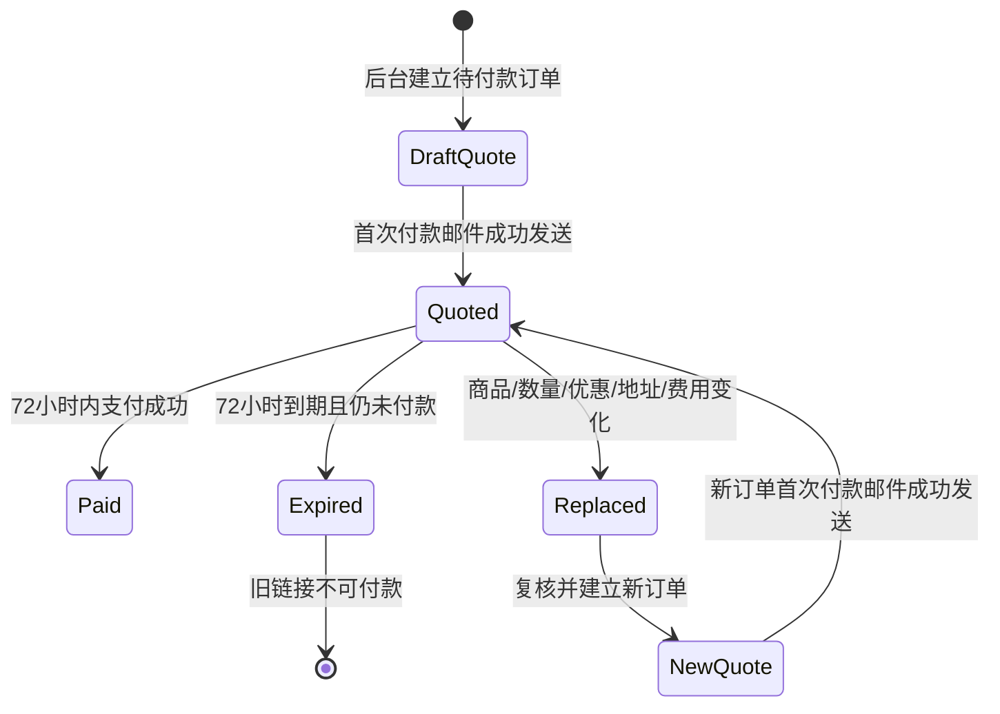

# Day75 人工物流与报价72小时生命周期

> 批次①集成补充（2026-09-22）：首封Customer Invoice现在会在发送前校验正数Shipping与完整地址合同；资料不完整时不发送、不签发、不调度。Shipping服务端白名单为美国、加拿大、澳大利亚；Billing国家不限制并按WooCommerce国家地址字段规则判断州省/邮编必填性。已签发Guest报价因D79邮箱验证归户而改变Customer ID时按既有签名规则取消，Website Manager建立替换报价。

## 相关笔记

- 每日笔记索引：[[README|DentAll每日笔记索引]]。
- 前置交易边界：[[Day72-人工运费邮件报价与购物车收口]]。
- 前置字段合同：[[Day73-报价字段与客户身份合同]]。
- 当日学习笔记：[[WordPress实战笔记/Day75-WooCommerce报价过期与订单生命周期]]。
- 变更与决定：[[../CHANGE_REQUESTS#CR-014：补齐人工报价字段并加入72小时自动失效|CR-014]]、[[../DECISIONS#ADR-040：人工报价订单采用完整地址合同和首次付款邮件起算的72小时生命周期|ADR-040]]。

## 先给结论

DentAll第一版继续采用人工运费报价，不开放自动承运商费率、客户自选免邮或0元Shipping占位。业务人员必须在WooCommerce订单中写入大于0的Shipping line，复核商品、数量、coupon、Billing/Shipping地址、Shipping、Tax、Fee和总额后，才发送付款邮件。

用户已明确授权：“同意实施D73+D75并加入72小时自动失效，按首次成功发送付款邮件起算，重发不续期”。因此报价不是从建单或保存草稿时起算，而是从第一次成功发送付款邮件起连续72小时；再次发送同一订单邮件不能延长截止时间。

进口关税、进口税、清关费用及承运商brokerage/disbursement等进口环节费用不进入DentAll订单总额，由客户在实际产生时直接向海关或承运商支付。卖方是否需要代收Sales Tax、VAT或GST仍须财税负责人确认，系统不能替业务方自动作出法律判断。

## 三个验收结果

- [x] 第一次成功发送付款邮件只写一次起算和到期事实；重复发送不续期，发送失败不启动72小时生命周期，首封实际邮件仍包含原生付款URL。
- [x] 到期取消、重复任务幂等、已结算订单保护、经典`order-pay`与Store API实时守卫均通过纯合同和真实Woo/HTTP验证；未签发草稿拒付但保持`pending`。
- [x] 商品、数量、coupon、Billing/Shipping地址、Shipping、Tax、Fee、币种或总额变化会使已签发旧单不可付款；真实Shipping与行项目meta变更均已取消旧单并清理动作。D76/D78继续验证支付已启动后的真实网关晚到webhook。

## 物流、税费与费用合同

| 项目 | 第一版规则 | 责任方 |
|---|---|---|
| 商品价格、数量、coupon | 来自复核后的订单行项目 | 业务人员复核，WooCommerce计算 |
| Shipping | 人工询价后写入大于0的原生Shipping line | 业务人员 |
| Seller-collected Tax | 只按财税负责人确认的正式口径配置；当前待确认 | 业务/财税负责人确认，开发实施 |
| Fee | 仅记录已确认且应由DentAll收取的订单费用 | 业务人员 |
| Import duties/taxes、customs clearance、carrier brokerage/disbursement | 不纳入DentAll订单总额；客户向海关或承运商直接支付 | 客户 |
| 0元Shipping或免邮占位 | 禁止用于绕过人工报价 | 系统守卫与业务SOP |

“客户承担进口税费”不等于卖方在所有销售地区都无需代收销售税。正式国家范围、含税/未税展示、计税地址、税率来源和申报责任必须在财税确认后另行配置与验证。

## 报价生命周期

生命周期约束：

1. 起点只认第一次成功发送付款邮件；建单、保存、预览、复制链接或邮件发送失败不启动有效期。
2. 同一订单重发邮件不改首次发送时间，也不改到期时间。
3. 自动任务负责及时推进状态；付款请求实时守卫负责在任务延迟时仍阻止过期付款，两者必须幂等。
4. 已付款、已取消或已被替换的订单不能被过期任务重复改写。
5. 对已报价内容的任何实质变化都终止旧报价。业务人员创建新订单并发送新链接，不能修改旧单后继续沿用原付款链接。

## 实现与原生能力边界

WooCommerce原生Hold stock面向通用待付款库存窗口，不能直接表达“后台人工报价订单从首次成功发送付款邮件起算、重发不续期”的合同。当前Local实现在`dentall-core/includes/shipping-quote-lifecycle.php`中使用WooCommerce订单CRUD保存`_dentall_quote_issued_at`、`_dentall_quote_expires_at`、`_dentall_quote_signature`、`_dentall_quote_token`、`_dentall_quote_closed_at`和`_dentall_quote_closed_reason`；`woocommerce_email_sent`只在`customer_invoice`发送调用成功后尝试首次签发，`dentall_expire_shipping_quote`由Action Scheduler执行，经典`wp`与Store API请求读取同一事实实时守卫。

实现还增加不可逆关闭事实：已签发报价一旦离开`pending`/`failed`，即使后来人工改回待付款状态，也不能重新开放原链接。签名包含客户ID、商品/费用和完整地址；生命周期meta、状态、创建来源、订单key及交易字段均读取订单`edit`上下文原始值，避免显示过滤器改变付款资格。标准Woo标量、数组和`WC_Meta_Data`会稳定化，编码失败时立即取消订单且不落签发meta或调度；第三方普通对象的私有属性属于RSK-047/P2兼容边界。无效已签发报价不会再次发送带付款链接的Customer Invoice。未签发草稿在经典付款页和Store API均拒付但保持`pending`，避免预览或探测误取消业务草稿。

## 当前实际证据

- D73基础合同为PHP 59/59、JavaScript 46/46；D75生命周期入口通过PHP语法，实际返回`{"status":"pass","assertions":83}`。覆盖首次成功发送、失败后成功、重发不续期、单次调度、原始值签名、客户ID、对象meta、编码失败取消、边界秒、不可逆关闭、无效邮件抑制、经典/Store API守卫、最高优先级付款状态过滤、展示Filter隔离，以及停用查询、保存失败和读回失败的安全中止。
- 独立Local真实WooCommerce集成为40/40：Customer Invoice首封实际正文含付款URL和72小时/进口费用说明；重发时间与token不变；真实`WC_Meta_Data`值、Shipping、Customer关联、虚拟化及展示Filter对状态、创建来源、订单key和六项生命周期meta的干扰均按原始交易事实处理，并先证明这些Filter确实改变默认`view`读取。
- Action Scheduler真实执行到期动作`#745`并进入`complete`；有效报价动作保持`pending`，已变化订单动作进入`canceled`。CLI末尾的“0 scheduled tasks completed”是该命令的汇总显示，但逐动作日志和最终状态均确认`#745`已完成。
- 权限与终态审计15/15、浏览器四宽/四类付款页通过且Console Error为0，浏览后订单终态4/4；停用路径3/3确认已签发报价和未签发后台候选均取消、专属待执行动作归零。应用日志末段没有PHP Fatal、Parse、Warning、Deprecated、Uncaught或数据库错误。
- 隔离环境禁用自动WP-Cron、外部HTTP和真实网关；本轮证明手动runner与请求时实时守卫有效，不外推目标主机Cron时效、真实扣款或晚到webhook。

## 7个专注周期与当前状态

| 周期 | 工作 | 状态 |
|---|---|---|
| C1 | 对照CR-012与Woo原生Pending/Cancelled/Order Pay边界 | 已完成只读核对 |
| C2 | 冻结正数Shipping、进口费用和72小时起点 | 用户已明确确认 |
| C3 | 保存首次邮件成功发送与到期事实 | 已完成；真实首封/重发与83项合同通过 |
| C4 | 接入单次调度、幂等过期和取消调度 | 已完成；真实Action执行与终态通过 |
| C5 | 接入实时过期付款守卫及旧单替换边界 | 已完成；经典与Store API一致性通过 |
| C6 | 运行时间边界、重发、调度延迟、状态和清理测试 | 已完成；40/40、15/15、4/4、停用3/3及四端浏览器通过 |
| C7 | 独立Code Review、安全/交易复核和文档证据回填 | 已完成；P0/P1=0，RSK-046与RSK-047按P2边界开放 |

## 状态、支付与晚到回调边界

普通Web付款入口应在到期后拒绝旧订单，但“支付请求已经发送给网关”与“WooCommerce后来把订单取消”可能并发。真实网关可能在订单过期或取消后返回晚到webhook；仅靠网页守卫或订单状态不能证明这类回调安全。

因此D75本轮完成的是Local生命周期技术范围。D76必须在目标网关沙盒覆盖成功、取消、失败及延迟回调；D78必须把订单状态、库存、coupon次数、邮件、Guest/Customer和替换订单串成完整回归。晚到webhook未通过前，D75不得被外推为真实支付闭环完成，M6也不得标记完成。

## 数据、权限、安全、URL、缓存与部署影响

- 数据：实现会在订单上保存`_dentall_quote_issued_at`、`_dentall_quote_expires_at`、`_dentall_quote_signature`、`_dentall_quote_token`、`_dentall_quote_closed_at`和`_dentall_quote_closed_reason`，并安排单次动作；全部通过WooCommerce CRUD/兼容API处理，保持HPOS兼容。
- 权限：业务人员继续使用已有订单权限发送付款邮件和维护订单；不新增公开后台入口或角色能力。
- 安全：付款资格必须由服务端读取订单、Shipping、地址和到期事实；前端倒计时或邮件文案不能充当交易守卫。
- URL/SEO：沿用WooCommerce原生`order-pay`，不新增可索引URL、Schema、Canonical或Sitemap条目。
- 缓存：Order Pay不得页面缓存；调度状态和付款资格不得依赖页面缓存结果。
- 性能：已验证的非并发、顺序发送路径每份报价只保留一个单次Action，没有常驻轮询、守护进程或前台定时请求；实时检查只在付款入口、邮件签发和相关订单保存/状态变化时运行。普通后台停用时会一次性查询当前`pending`/`failed`订单并筛出人工报价候选；当前低频B2B场景适合这项同步保护，但未做生产负载测量，非Local仍需观察past-due和队列长度。
- 部署：本轮不改Staging/Production税率、物流、真实邮件或支付配置。普通后台停用会先取消已签发及未签发的后台实体报价候选，逐单验证成功后才清理专属动作；查询、保存或读回失败会阻止停用。WordPress静默停用或插件升级可能绕过停用Hook，发布窗口仍须使用维护模式、停止发信并确认没有在途支付。

## 风险与后续

- WordPress/Action Scheduler任务不是硬实时定时器，低流量或队列拥堵可能延迟执行，所以必须保留请求时实时守卫。
- 首次付款邮件“成功”只表示Woo邮件发送调用成功，不自动证明客户邮箱实际收件；SMTP投递与退信留D77。
- 订单重发不续期可能造成客户只剩很短付款时间；业务人员应创建新报价，而不是延长旧单。
- 两次首次付款邮件若在极短时间内真正并发成功，当前“读取未签发事实后写入”的流程没有跨请求原子锁，可能产生两个token动作并让最后一次写入轻微改变截止时间。当前低频B2B采用单人单次发送、禁重复点击的SOP并观察Scheduled Actions；若实际出现并发发送需求，需单独设计HPOS兼容的每订单原子锁和并发集成测试。
- WordPress静默停用/升级会绕过普通停用Hook；非Local发布必须进入维护窗口并确认没有在途付款。真实网关在代码暂时不可用期间如何处理晚到回调，仍由D76/D78沙盒验证。
- 第三方订单项目meta若保存带私有状态且未提供`JsonSerializable`/`get_data()`的普通对象，当前签名不能观察其私有属性；当前插件栈未发现此形态，引入相关插件前按RSK-047复验或补有界序列化。
- 过期取消会影响库存、coupon、通知和网关回调，必须在D76/D78按当前配置实际验证。
- 正式销售税口径未确认；进口费用排除文案不能替代销售税、VAT或GST判断。

## 可复用核心思想

### 跨平台不变量

有时效的付款链接必须同时定义“何时开始、何时结束、重发是否续期、变更如何替换、调度延迟怎么办、付款已启动时谁最终裁决”。缺少其中任何一项，三天有效期都只是文案。

### WordPress/WooCommerce当前实现

订单保存交易事实，Action Scheduler负责异步推进，`order-pay`服务端守卫负责请求时复核。两条路径读取同一到期事实并保持幂等；Woo订单明细继续负责商品、Shipping、Tax和Fee。

### Shopify或其他平台的对应机制

其他平台可能使用Draft Order、invoice expiration或外部队列，但仍要处理首次发送、重复发送、过期支付和晚到网关回调。具体API、状态机和webhook顺序必须按目标平台重新验证。
