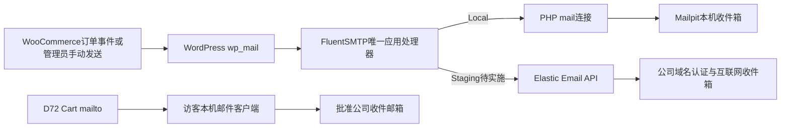

# Day77 FluentSMTP事务邮件Local验证

> 2026-09-22补充：本篇后文保留2026-09-21隔离Local验证与当时Elastic Email候选方案的历史记录。Staging实际已改用公司BossMail专用SMTP主机`s196h.chinaemail.cn:465`和SSL，并从`materials@chinaadsdentallab.com`成功发送到受控QQ邮箱；Cloudways Elastic Email未启用、DNS未修改。当前活动决策以ADR-041和下方补充验收为准，不再照旧清单配置第二条Elastic Email连接。

## 相关笔记

- 每日笔记索引：[[README|DentAll每日笔记索引]]。
- 直接前置：[[Day72-人工运费邮件报价与购物车收口]]。
- 当日学习笔记：[[WordPress实战笔记/Day77-WordPress事务邮件链与可观察性]]。
- 变更与决定：[[../CHANGE_REQUESTS#CR-015：第一版统一使用公司邮箱并由FluentSMTP接入BossMail事务邮件|CR-015]]、[[../DECISIONS#ADR-041：事务邮件采用FluentSMTP单处理器并由BossMail负责第一版外发|ADR-041]]。
- 风险：[[../RISK_REGISTER#RSK-048：事务邮件显示已发送但未送达，或日志泄漏客户资料与付款链接|RSK-048]]。

## 先给结论

用户已确认第一版由批准的公司邮箱统一承担报价收件、WooCommerce管理员通知、From和非管理员邮件Reply-To；非Local邮件服务采用Cloudways Elastic Email付费Add-on、FluentSMTP和公司域名。该邮箱以后可以更换，但四类配置要同步核对；若更换发件域名或服务商，还必须重新验证域名、DNS认证、API Key和真实投递。

本轮没有修改共享Local数据库、Options或配置。用户已在共享Local安装FluentSMTP 2.4.0，只读核对显示插件尚未启用、连接为0、没有fallback或日志表，D72报价邮箱也尚未写入批准值。为避免影响并行工作，本轮从共享Local建立带独立数据库、站点URL和环境标记的副本，在副本安装并启用同版本插件，以Mailpit替代互联网投递。一次共享Local只读审计命令因工具侧括号错误，被WordPress向既有`debug.log`追加了一条Critical记录；没有功能或数据库变化，本轮未擅自改写该日志。

隔离Local结果通过：FluentSMTP记录11条成功、Mailpit精确捕获11封，其中客户邮件7封、管理员通知4封；两封人工订单详情含原生付款链接；无收件人和邮件层无效收件人均跳过；非法Billing Email被WooCommerce CRUD拒绝；重复触发新订单邮件没有重复发送。关闭SMTP端口后新增1条失败日志、Mailpit数量不变且没有fallback。原生付款页返回200，没有跳转Cart或PHP Fatal。

Local证据只关闭应用生成、接管、日志和失败可见性；2026-09-22补充的Staging测试进一步证明BossMail传输与外部收件可用。SPF/DKIM/DMARC原始Header、垃圾箱、回复、失败日志、业务触发和M6仍未完成。

## 授权、范围与三个验收结果

用户于2026-09-21明确同意D77范围，并授权安装FluentSMTP及使用批准公司邮箱。随后用户说明共享Local已安装插件，因此本轮不重复安装共享Local，也不在共享Local直接配置。

- [x] 在隔离Local建立单一FluentSMTP连接，验证客户与管理员代表邮件、付款链接、From、Return-Path和Reply-To。
- [x] 验证无/错收件人、重复新订单去重、关闭SMTP端口后的失败日志与无fallback行为。
- [x] 固化插件、密钥、权限、日志、邮箱更换和后续Staging操作边界；Cloudways、DNS与真实投递明确延期到环境就绪。

## 第一版架构与职责

| 层级 | 第一版职责 | 不承担 |
|---|---|---|
| 批准公司邮箱 | 接收报价与管理员邮件，作为发件身份和非管理员邮件Reply-To | 不提供WordPress发送API |
| WooCommerce | 根据订单与状态生成收件人、主题、正文、付款链接和Headers | 不负责域名认证或互联网信誉 |
| FluentSMTP | 单一接管`wp_mail()`、选择连接、记录成功/失败日志 | 不代替真实收件邮箱，不决定订单状态 |
| Elastic Email Add-on/API | Staging/Production的外部投递服务与域名验证 | 不在Local保存真实密钥，不生成Woo订单邮件 |
| DNS | 提供SPF/DKIM/DMARC等发件身份事实 | 不保证每封一定进入收件箱 |
| Mailpit | Local拦截、查看和统计邮件 | 不证明互联网、垃圾箱或域名声誉 |

## 邮箱角色与原生Reply-To边界

| 邮件或入口 | To | From | Reply-To | Local结果 |
|---|---|---|---|---|
| D72 Cart报价`mailto:` | 批准公司邮箱 | 访客自己的邮件客户端 | 由访客客户端决定 | 不经过WordPress、FluentSMTP或Elastic Email |
| 客户订单详情/付款、处理中、完成、失败、取消 | 订单Billing Email | 批准公司邮箱 | 批准公司邮箱 | 7封，全部符合 |
| 管理员新订单、失败、取消 | 批准公司邮箱 | 批准公司邮箱 | 客户Billing Email | 4封，保留WooCommerce 11原生行为 |

“统一Reply-To”不能理解为强制覆盖所有邮件。WooCommerce 11会让管理员订单通知回复客户Billing Email，这能让业务人员直接回复客户，也避免回复回到同一个公司地址；D77没有增加自定义Header Filter覆盖该原生行为。

## Local配置基线

| 配置 | 隔离Local值 | Staging目标 |
|---|---|---|
| FluentSMTP版本 | 2.4.0 | 部署前再次核验兼容版本 |
| 连接数 | 1 | 1 |
| Provider | `PHP mail()` | `Elastic Email API` |
| 外部密钥 | 无 | 环境秘密`FLUENTMAIL_ELASTICMAIL_API_KEY`或等价受控配置 |
| Fallback | 空 | 第一版保持空，失败必须可见 |
| 邮件日志 | 开启，7天 | 按真实运维/隐私需要采用最短期限 |
| 模拟发送 | 关闭 | 关闭 |
| Woo延迟事务邮件 | 关闭 | 变更前须重新评估测试预期和队列 |
| WordPress `admin_email` | 保持原值 | 不用它偷偷替代报价或订单收件邮箱 |

固定版本ZIP来自WordPress.org官方分发，SHA-256为`ded5a19a40bfbff92e5caf2fe41d236a02892b7cd2252a436e766ed7450d609a`。第三方插件目录继续由项目Git忽略，不把供应商代码复制进本提交。

## 代表邮件矩阵

| 用例 | 触发 | 预期邮件 | 结果 |
|---|---|---:|---|
| 人工发送待付款订单详情×2 | `WC_Email_Customer_Invoice`手动触发 | 客户2 | 2封；都含`order-pay`链接 |
| Pending→Processing→Completed | Woo订单状态变化 | 管理员新订单1；客户处理中1、完成1 | 3封 |
| Pending→Failed | Woo订单状态变化 | 管理员失败1；客户失败1 | 2封 |
| Pending→Processing→Cancelled | Woo订单状态变化 | 管理员新订单1、取消1；客户处理中1、取消1 | 4封 |
| Billing Email为空 | 手动订单详情 | 0 | 记录`no_recipient`跳过 |
| 邮件层返回非法收件地址 | 手动订单详情 | 0 | 记录`no_recipient`跳过 |
| CRUD写入非法Billing Email | `WC_Order::set_billing_email()` | 拒绝写入 | 抛出`order_invalid_billing_email` |
| 已发送新订单通知后重复触发×2 | `WC_Email_New_Order` | 0 | `_new_order_email_sent`去重生效 |
| SMTP端口关闭 | 手动订单详情 | 0 | FluentSMTP新增1条`failed`，Mailpit保持11封 |

## 付款链接验证

代表待付款订单通过WooCommerce CRUD建立，不绑定真实商品ID，不触碰库存；只含明确`TEST`行项目与Shipping。`get_checkout_payment_url()`生成的链接由本机HTTP服务实际请求：

- HTTP状态为200；
- 路径保持`/checkout/order-pay/{id}/`；
- 未跳转到Cart；
- 页面识别为Order Pay；
- 未出现PHP Fatal或WordPress Critical Error；
- 完整订单Key和付款URL未写入版本化结果。

## 权限、隐私与失败边界

- FluentSMTP默认以`manage_options`保护设置与日志；隔离Local确认Website Manager有`manage_woocommerce`但没有`manage_options`。
- 日志表会保存To、From、Subject、Body、Headers、响应和时间。正文可能含客户资料与付款链接，因此不把原始日志、数据库或Mailpit内容提交Git。
- Local日志保留7天只是验证基线；非Local应根据故障排查需要、隐私政策和业务量选择最短可用期限。
- 第一版不设fallback。备用服务会增加密钥、域名认证、成本和排错分支，也可能把主服务故障伪装成成功。
- 本轮首个烟雾测试发现CLI激活后日志表未自动建立；在隔离副本执行插件自身迁移后成功。Staging不照抄内部迁移命令，使用正常后台激活并验证日志表、Cron和首封测试邮件；缺表时先保留日志和插件状态再排查。

## 邮箱以后怎样安全更换

同一已验证公司域名内更换地址时，依次修改并复核：D72报价收件、三类Woo管理员收件、Woo From、Woo非管理员Reply-To、FluentSMTP Sender/映射。随后重发一封客户邮件、一封管理员邮件和一封报价邮件，检查收件与回复目的地。

若更换发件域名或邮件服务，还要重新完成Elastic Email域名验证、SPF、DKIM、DMARC、API Key、From对齐、退信/投诉处理和真实垃圾箱测试。旧订单Billing Email、历史日志与已经发出的邮件不会被改写。

## 实现、文件职责与减法审查

- 新增`project-docs/tests/day77-transactional-email-audit.php`：只在带D77独立标记的`127.0.0.1` Local副本运行，创建6个TEST订单，验证成功、跳过、去重、失败并按标记清理。
- 新增D77结果JSON、项目笔记和实战学习笔记；更新CR、ADR、风险、插件、账户与两份索引。
- 没有修改主题、`dentall-core`、WooCommerce、Storefront或FluentSMTP核心；没有新增运行时PHP函数、CSS、JS、模板、数据库表定义或公共URL。
- 测试脚本保留为单文件，因为环境护栏、夹具、断言和清理共同服务一个可复演审计生命周期；拆成微型文件不会增加独立复用或隔离价值。

## 实际验证

| 证据 | 结果 |
|---|---|
| PHP语法 | D77审计脚本通过`php -l` |
| 插件包 | FluentSMTP 2.4.0，固定ZIP SHA-256匹配 |
| 配置 | 单连接、无fallback、日志7天、模拟关闭、WordPress管理员邮箱保持 |
| 成功矩阵 | FluentSMTP 11条`sent`；Mailpit 11封，客户7、管理员4 |
| Headers | From地址/名称与Return-Path全部匹配；客户Reply-To为公司邮箱，管理员Reply-To为客户Billing Email |
| 链接 | 2封人工订单详情含付款链接；付款页HTTP 200、不回Cart、无Fatal |
| 负向 | 2个`no_recipient`；非法Billing Email被CRUD拒绝；重复新订单通知0增量 |
| SMTP失败 | 关闭端口后新增1条`failed`、0条`sent`，Mailpit仍为11，无fallback |
| 权限 | Website Manager无`manage_options`；管理员设置边界未扩张 |
| 数据恢复 | TEST订单、FluentSMTP日志、Mailpit消息、隔离数据库与进程在终审后清理；共享Local数据库/Options/配置未写入，已单独记录审计命令追加的debug日志 |

机器可读摘要见`project-docs/tests/day77-results.json`。该文件不包含完整公司邮箱、客户资料、订单Key、付款URL、API Key、原始邮件正文或本机数据库。

## 七个专注周期对照

1. C1：盘点共享Local插件状态、版本、现有Woo邮件与D72边界。
2. C2：建立独立数据库/URL/环境标记，验证插件包与单连接配置。
3. C3：建立Woo代表订单和事务邮件矩阵。
4. C4：核对Mailpit消息数量、To/From/Return-Path/Reply-To和付款链接。
5. C5：验证无效收件、重复去重、关闭端口失败与权限。
6. C6：执行独立代码、安全和结果复核，修正测试问题。
7. C7：清理TEST数据与进程，更新文档、状态边界和学习笔记。

## 对数据、URL、SEO、缓存、支付、物流和部署的影响

- 数据：共享Local只存在用户安装的停用插件目录，本轮不写共享数据库、Options或配置；一次错误的只读审计命令向现有`debug.log`追加了工具侧Critical。隔离副本临时创建插件Options、日志表和TEST订单，终审后删除。Staging实施将新增FluentSMTP Options、日志表和Cron。
- URL/SEO：无新公共URL或SEO输出；只验证已有Order Pay端点。完整付款链接不能进入公开文档或缓存。
- 缓存：无前端资源或页面缓存变化；Cart、Checkout、My Account和Order Pay继续动态排除。
- 支付：不启用或调用真实支付网关，不扣库存；仅验证待付款页面可打开。
- 物流/税：TEST订单包含固定TEST Shipping以通过D72付款边界，不建立正式运费或税务政策。
- 部署：本轮不改Cloudways、DNS、Staging或Production。非Local执行前必须先备份、核对单一处理器、保存环境密钥并准备回滚。

## 2026-09-22 Staging补充验收与后续清单

已完成：

1. Staging启用FluentSMTP并建立单一BossMail SMTP连接；主机为`s196h.chinaemail.cn`，端口465，加密为SSL。
2. 发件人为`materials@chinaadsdentallab.com`，显示名称为DentAll；测试邮件已由受控QQ邮箱实际收到。
3. Cloudways Elastic Email Add-on未启用，DNS未修改，未建立fallback。

仍需完成：

1. 复核FluentSMTP日志表、每日清理Cron和最小保留期。
2. 从原始邮件Header核对SPF、DKIM、DMARC和Return-Path对齐。
3. D76/D78使用TEST订单验证客户邮件与管理员通知；D80验证找回密码；D89验证询盘通知。
4. 验证失败日志、垃圾箱和回复路径，随后删除TEST订单及包含付款链接或客户资料的敏感日志。

### 原候选清单（已由BossMail方案取代，仅保留历史）

1. 在企业Cloudways账户开通Elastic Email Add-on并绑定目标Application。
2. 在Elastic Email验证公司发件域名；由DNS管理员添加官方给出的精确SPF/DKIM记录，并按公司政策配置DMARC。
3. 在Staging正常启用FluentSMTP，确认日志表与每日清理Cron存在；只建立一个Elastic Email API连接，不设fallback。
4. 把API Key放入目标环境秘密配置，不粘贴到Git、聊天、截图或文档。
5. 同步报价收件、Woo管理员收件、From与非管理员Reply-To，保持WordPress `admin_email`职责独立。
6. 使用TEST订单分别验证客户和管理员邮件、真实收件箱、垃圾箱、Reply-To、Return-Path、域名对齐、失败日志和清理期限。
7. 验收后删除TEST订单和敏感日志，记录版本、DNS、发送时间、结果与回滚点；再与D76/D78订单/支付/库存流程合成。

参考：[Cloudways Elastic Email Add-on开通与域名验证](https://support.cloudways.com/en/articles/5130879-how-to-activate-the-elastic-email-add-on)、[Cloudways WordPress集成说明](https://support.cloudways.com/en/articles/8966003-how-to-integrate-elastic-email-with-your-wordpress-application)、[FluentSMTP Elastic Email连接说明](https://fluentsmtp.com/docs/configure-elastic-email-in-fluent-smtp/)、[FluentSMTP日志说明](https://fluentsmtp.com/docs/fluentsmtp-email-logs-feature/)、[WooCommerce邮件设置](https://woocommerce.com/document/configuring-woocommerce-settings/emails/)。

## 未关闭事项

- Cloudways Elastic Email Add-on未启用且已不属于当前第一版活动方案；不存在对应API Key配置。
- 公司域名SPF、DKIM、DMARC的当前真实值尚未核验或修改。
- Staging插件启用与真实收件箱已验证；日志表、Cron、垃圾箱、回复和退信仍待验证。
- D73～D76没有当前分支的完成笔记，D77不据此宣称D76、D78、M6或完整订单闭环完成。
- D77源候选已纳入批次①集成分支；中央状态、风险和决策记录在集成收口中统一更新。

## 2026-09-22 批次①部署后复核

- Staging插件清单确认FluentSMTP 2.4.0处于启用状态，只有1个活动邮件连接和1个活动发件人。连接为公司邮箱、`s196h.chinaemail.cn:465`、SSL、SMTP验证开启；凭据继续保存在服务器数据库中且浏览器不回传已保存密码。
- 邮件日志开启并保留14天，邮件模拟关闭。业务触发前日志共7条；不完整订单发信被D73门禁拦截后仍为7条。完整TEST订单`#1579`发出Customer Invoice后，新增主题`Details for order #1579 on DentAll`，收件人为受控QQ邮箱，状态为“已发送”，日志总数为8。
- 当前证据证明公司BossMail连接、既有受控外部收件以及部署后的Customer Invoice已被SMTP接受；仍不证明本次业务邮件已在收件箱/垃圾箱最终呈现，也不覆盖密码重置、回复、退信、SPF/DKIM/DMARC原始Header或跨设备体验。这些继续按D77/D80及上线清单验收。
- Cloudways Elastic Email保持未启用，DNS未修改；当前活动方案继续是FluentSMTP＋公司BossMail，不再把Elastic Email列为本轮待配置项。

## 可复用核心思想

### 跨平台不变量

收件邮箱、应用生成邮件、外发服务、域名身份和送达结果是五个不同问题。有效验收必须同时覆盖正常发送、失败可见、身份对齐、权限、日志隐私和回滚；“后台显示已发送”不能代表收件箱收到。

### WordPress/WooCommerce当前实现

WooCommerce负责订单邮件内容和状态触发，`wp_mail()`提供统一发送接口，FluentSMTP接管接口并记录结果，当前第一版由公司BossMail SMTP负责非Local外发。管理员订单通知的Reply-To由WooCommerce原生指向客户Billing Email；不要为了表面一致而覆盖有业务价值的默认行为。

### Shopify或其他平台的对应机制

其他平台同样需要区分通知模板、发件身份、域名认证、收件箱送达和运维日志，但平台可能托管发送服务并限制底层连接选择。具体的发件地址、回复地址、DNS和日志机制必须查该平台当前官方文档；本项目未实施Shopify邮件能力。
