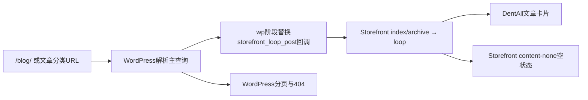

# Day86 博客列表、分类、分页与空状态

## 结论

用户于2026-09-22明确同意按推荐方案实施。DentAll子主题已在独立D86分支完成Posts Page与文章分类归档的最小前台实现：继续使用WordPress主查询和Storefront模板链，只替换循环中的文章卡片、分页和局部样式。隔离Local的四端、分页、空分类、越界404、缺图、长文本、资源隔离及相邻页面回归通过。

本节记录2026-09-22源分支的Local技术完成，不代表本次合成或D86非Local验收。2026-10-06用户已授权D74＋D86整合发布；D85早已随批次①合入主线并在Staging验收，本次候选统一为DentAll 0.46.0/Core 0.6.0，合成验证、推送与部署仍在进行中。当前状态见[[../PROJECT_STATE|项目当前状态]]。

## 相关笔记

- 学习笔记：[[WordPress实战笔记/Day86-文章主查询与归档Hook边界]]
- 学习索引：[[WordPress实战笔记/WordPress实战笔记索引]]
- 每日索引：[[README|DentAll每日笔记索引]]

## 授权与实施范围

- 业务问题：让访客在`/blog/`与文章分类页浏览文章，而不是看到Storefront默认的全文流、后台作者、评论数和标签。
- 使用角色：匿名访客和已登录客户读取；Website Manager继续在原生Post后台维护文章、分类、摘要和特色图。
- 数据规模：第一版按普通内容站文章量设计；本轮用8篇隔离TEST文章验证4条/页的多页边界，不把测试数量写死进运行代码。
- 第一版必须做：Blog标题、日期、分类、摘要、可选16:9特色图、Read article、数字分页、分类描述、空状态、四端响应式。
- 明确不做：自定义查询、AJAX加载、作者公开署名和Schema统一、标签/作者/日期/搜索归档重做、文章详情、分享、相关推荐、图片自动裁切生产流程。

## 最多3项验收结果

- [x] `/blog/`和文章分类继续使用WordPress主查询，列表只输出卡片摘要，不泄露全文、后台作者、评论和标签。
- [x] 390/768/1024/1440px分别形成1/2/3/3列，同一语义DOM覆盖有图、缺图、长标题、长摘要与分页，页面无横向溢出。
- [x] Blog第2页、分类、空分类、越界分页404及Home/Shop/Product/Cart资源隔离与Header H1回归通过。

## 实际实现

### 文件职责

- `app/public/wp-content/themes/dentall/inc/blog.php`：判断Blog归档作用域、条件加载样式、调整Storefront文章循环Hook、输出Posts Page标题、文章卡片和核心分页。
- `app/public/wp-content/themes/dentall/assets/css/blog.css`：Mobile First列表、卡片、图片、分页和空状态样式。
- `app/public/wp-content/themes/dentall/functions.php`：加载Blog职责模块。
- `app/public/wp-content/themes/dentall/inc/storefront-hooks.php`：取消把Posts Page的站点Logo包成H1，改由内容区输出唯一H1。
- `app/public/wp-content/themes/dentall/style.css`：2026-09-22独立源分支版本由`0.42.0`升至`0.42.1`，用于当时资源缓存版本；不作为本次整合版本。

### 关键取舍

1. 不新增`home.php`、`archive.php`或`category.php`。Storefront仍负责模板框架，WordPress仍负责主查询、分页状态与404。
2. 不创建第二个`WP_Query`。这避免分页总数、Canonical、查询参数和主循环状态分裂。
3. 只作用于`is_home()`和`is_category()`；标签、作者、日期、搜索和单篇文章保持原边界，交由后续节点决定。
4. 无特色图时输出诚实的纯文本卡片，不用装饰图冒充正式内容。正式16:9素材仍由业务方提供和确认授权。
5. D87才处理统一公开署名`DentAll Editorial Team`及Yoast作者Schema；D86不输出后台作者，从展示层先避免暴露个人账号。

## 运行链与页面状态

- 正常：4张文章卡片，日期、分类、H2、摘要、Read article。
- 加载：服务端渲染，没有额外异步加载状态。
- 空分类：父主题`content-none.php`输出唯一空状态H1，DentAll CSS只负责宽度和断行。
- 错误：`/blog/page/99/`由WordPress主查询返回404和`error404` body class。
- 缺图：卡片增加`dentall-blog-card--text-only`，不保留空媒体框。
- 长文本：标题、摘要、分类和空状态允许安全断行。
- 售罄/不可购买：不适用于文章列表。

## 验证环境与证据

- 隔离地址：`http://127.0.0.1:18686`，不使用共享Local或Staging数据库。
- 版本：WordPress 7.0.4、WooCommerce 11.0.0、Storefront 4.6.2、PHP 8.2.29、DentAll 0.42.1、DentAll Core 0.2.8。
- TEST数据：8篇文章、4条/页、2个有内容分类、1个空分类；包含有图/缺图、长标题、长摘要和正文哨兵。
- 浏览器矩阵：390×844、768×1024、1024×768、1440×1000。
- 自动验证：四端列数1/2/3/3、每页4张、唯一H1位于main、英文日期、16:9图片、空alt媒体链接仍有文章标题可访问名称、44px分页、Focus、无横向溢出、全文哨兵不出现、禁用元信息不出现。
- 路由验证：`/blog/`、`/blog/page/2/`、有内容分类及第2页、空分类均200；Blog与分类越界分页404。另临时将隔离副本全部9篇发布文章转Draft，Blog全空时为0卡片、原生`Nothing Found`唯一H1，随后9篇精确恢复Publish。
- 回归：Home、Shop、Simple Product和Cart均200，不加载`blog.css`，不带Blog body class，站点Logo不再是H1。
- 静态验证：相关子主题PHP文件在PHP 8.2.29下`php -n -l`通过，`git diff --check`通过，无行内`style/script`、无`WP_Query/query_posts/pre_get_posts`。
- 独立复核：Code Review与Test Review终态均为P0/P1/P2/P3=0；运行副本与工作树5个运行文件SHA-256一致。一次浏览器`networkidle`等待超时后，同一当前源码完整重跑通过，未把超时轮次计为成功证据。

## SEO、缓存和业务影响

| 检查面 | 结论 |
|---|---|
| 数据 | 运行代码不写数据库；8篇TEST文章只存在隔离副本 |
| URL | 沿用`/blog/`、`/blog/page/N/`和`/category/{slug}/`；未改固定链接结构 |
| SEO | 唯一内容H1与分页标题通过；隔离环境强制`noindex,nofollow,noarchive`且无Canonical，Production Canonical/索引策略仍待D92；未新增Schema |
| 缓存 | 新CSS仅在Blog/分类条件加载；历史源分支查询串为`0.42.1`，本次合成使用统一主题版本`0.46.0`并重跑资源隔离 |
| 支付/订单/库存 | 不涉及 |
| 物流/税费 | 不涉及 |
| 部署 | 历史源分支已保存为`1a3198e`；2026-10-06进入最新主线合成，基线已含D85。当前尚未推送或部署本批次，不宣称合成验收通过 |

## 减法审查

- 保留1个职责模块和1个页面级CSS文件，因为PHP生命周期与样式加载职责稳定且可独立测试。
- 没有模板覆盖、JavaScript、插件、依赖、字段、后台入口、自定义查询、AJAX、缓存层或Schema代码。
- 没有为手机/平板/PC复制DOM；只有两个渐进增强断点。
- 初轮测试发现分页CSS误按`ul/li`推断，已改为Storefront真实`.nav-links > .page-numbers`，未增加兼容分支。

## 风险与后续

- 2026-09-22源分支基线较旧，曾未包含D85源提交`5635f65`；该限制不再是当前主线事实。本次从已含D85的`a8897f0`整合，使用主题0.46.0/Core 0.6.0候选并重新验证D85与D86相邻页面，不能沿用旧Core 0.2.8环境证明集成通过。
- 正式3篇文章、摘要、分类、16:9特色图和素材授权仍是内容验收项，不阻塞骨架，但阻塞真实内容视觉验收。
- D87负责单篇文章、统一公开署名、作者Schema、内链、分享基础和长文媒体，不得从D86的列表隐藏策略推断D87已经完成。
- D92前不得依据隔离Local的强制noindex/无Canonical推断Production SEO正确。
- 隔离运行时仅用于测试，收尾时停止HTTP/MySQL；未改变共享Local、Staging或Production。

## Chrome DevTools微调路径

1. 在Elements中选中`.dentall-blog-card`或`.site-main`，临时修改Grid、gap、padding或字号。
2. 先判断共用数值是否应改现有`--dentall-*` Token；仅Blog特殊值才留在`blog.css`。
3. 回到子主题源码修改，不能把DevTools临时规则当交付。
4. 用Responsive模式复验390、768、1024、1440，并同时检查分类、空状态、分页及Home/Shop/Product/Cart资源隔离。

## 可复用核心思想

### 跨平台不变量

列表页应只有一个数据真相、稳定的分页合同和可预测的空/错状态；卡片只展示支持浏览决策的信息，不能把详情内容或后台身份无意暴露到列表。

### WordPress/WooCommerce当前实现

WordPress主查询和模板层级负责URL、分页、状态码与文章集合；Storefront Hook负责循环展示点；DentAll子主题只在已确认页面作用域替换输出并条件加载样式。

### Shopify或其他平台的对应机制

Shopify通常由Blog/Article模板和Liquid分页承载相似职责，但模板名称、分页对象、SEO输出和主题扩展点需按所用主题与官方机制重新验证，不能照搬WordPress Hook。
