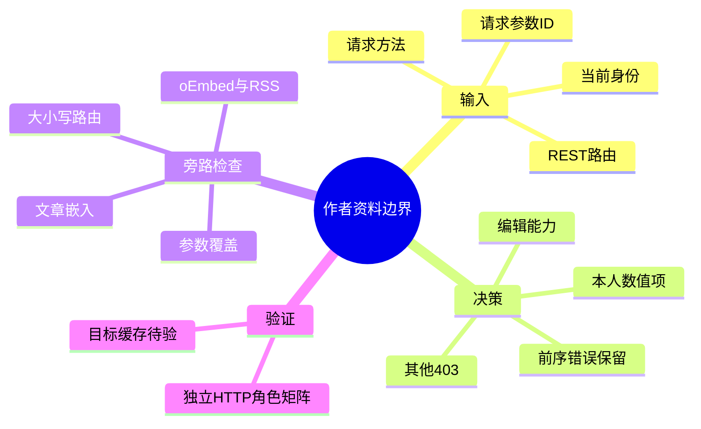
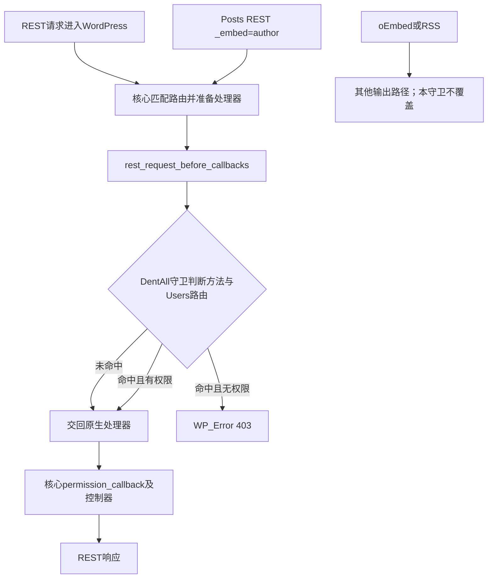

# Day103 WordPress实战：REST权限与作者资料边界

## 相关笔记

- 学习索引：[[WordPress实战笔记索引]]
- 对应项目笔记：[[../Day103-权限与账户暴露审计]]
- 相邻安全检查点：[[../Day104-插件主题更新与安全配置审计]]
- 相邻学习笔记：[[Day104-插件更新与数据库迁移回滚]]
- 后续公开署名与缓存复验：待形成真实笔记后双向回填。

## 今日学习成果

- [x] 能沿真实入口解释 Users REST 列表、数字单项、`/me`、文章 `author` 与 `?_embed=author` 的边界。
- [x] 能指出定向读取守卫为何要同时检查路由、方法、能力、本人 ID 和请求参数 ID；独立审查发现的两处旁路已修复并隔离复测。
- [ ] 能在目标站点核对 oEmbed、Feed、作者归档、缓存与真实编辑客户端；目前仅有隔离站 TEST 证据，个人费曼自测未做。

## 真实项目场景与学习范围

DentAll 的已发表 TEST 文章有后台作者。隔离检查发现，匿名 Users REST 可返回该作者的显示名、slug 与链接；这些是公开资料字段，不是登录凭据或邮箱。收紧 Users REST 之后，oEmbed `author_name`/`author_url` 和 RSS2 `dc:creator` 仍含同一显示名。因此本篇学习的核心是**一个授权边界只覆盖它实际拦截的输出路径**。

本篇范围为 WordPress 原生 `/wp/v2/users` GET/HEAD 集合和数字单项、本人读取、内容人员读取、文章数字作者关联及嵌入。登录暴力防护、写接口、作者归档治理、D104 版本更新和真实站点发布各有独立验收。入口是 `app/public/wp-content/plugins/dentall-core/includes/rest-user-access.php`，挂载于 `rest_request_before_callbacks`，优先级 11。下述运行结论只对应独立隔离 WordPress 7.1、WooCommerce 11.0.0、DentAll Core 0.7.1、PHP 8.2.29。

## 先建立整体模型

**一句话模型：** 文章可以继续指向作者的数字 ID，而公开 Users 资料的读取必须另按身份和用途授权；每个公开输出通道都要单独验证。

记忆宫殿：文章像图书，扉页写一个馆内作者编号；Users REST 像馆员档案柜，读者不应仅凭编号取得后台馆员资料。工作人员凭工作证可读，客户只能读自己的档案。馆外书目摘要和订阅快报则是其他出口，锁上档案柜不会自动改掉它们。这个比喻只帮助记忆：真实机制分别是 WordPress Posts REST 的 `author` 整数及 `_links`、Users REST 的数据响应、当前用户与 capability、oEmbed 和 RSS 输出，不存在物理“档案柜”可一次锁住所有传播副本。

| 记忆对象 | WordPress真实对象 | 不可混淆的边界 |
|---|---|---|
| 作者编号 | Posts REST `author`、`_links.author` | 关联 ID 不等于姓名、slug 或登录凭据。 |
| 档案柜 | 核心 Users REST 集合/数字单项 | 只守这组路由，不自动改 HTML、oEmbed、Feed。 |
| 工作证 | `current_user_can( 'edit_posts' )` 或 `list_users` | 按实际 capability 判断，不仅按角色名称猜权限。 |
| 本人档案 | 当前用户 ID 与请求路径/参数中的 ID | 路径数字和有效请求参数都要指向本人。 |



主干是“先识别真实请求，再按能力和本人身份授权，最后从所有输出通道复查结果”。

## 请求与生命周期调用链



触发条件是 REST 请求在 WordPress 核心分发时到达该 Filter。插件主文件加载模块并注册回调；Filter 收到前序响应、处理器和 `WP_REST_Request`，必须返回响应或 `WP_Error`。本实现先保留前序错误，只处理 GET/HEAD 及 Users 集合/数字项；符合本人或编辑能力时交回原响应，其余返回 403。对文章的 `_embed=author`，隔离站证实内部作者请求再次经过守卫，文章本身仍为 200，嵌入作者只保留错误对象。oEmbed/RSS 属其他输出机制，隔离站实测仍露出 TEST 显示名。

## 核心概念卡与真实代码

| 概念 | 准确定义 | DentAll证据与常见误区 |
|---|---|---|
| 路由与方法 | 本守卫只识别 `/wp/v2/users` 及其数字子项的 GET/HEAD | 正则大小写不敏感；不能假设客户端始终使用小写路径。 |
| 有效 ID | 控制器读取的请求参数可能覆盖 URL 中的 `id` | Customer 的路径与参数互换员工/本人 ID 均在隔离站返回 403。 |
| Capability | 当前用户是否拥有 `edit_posts` 或 `list_users` | Content Editor、Website Manager、Administrator 实测可读；并非只凭角色名放行。 |
| 前序响应 | Filter 链上较早回调的结果 | 前序 `WP_Error` 原样保留；前序非错误响应仍接受本守卫收紧。 |
| 嵌入作者 | 文章响应按 `_links` 内部请求用户资料 | 保留文章 `author=3` 与 `_links`，`_embedded.author` 不含姓名/slug/link。 |

真实代码节选，源自 `app/public/wp-content/plugins/dentall-core/includes/rest-user-access.php`：

```php
if ( ! preg_match( '#^/wp/v2/users(?:/([0-9]+))?/?$#i', $request->get_route(), $matches ) ) {
	return $response;
}

if ( isset( $matches[1] ) ) {
	$current_user_id = get_current_user_id();
	// GET参数可覆盖路由中的id；两个值都必须指向本人。
	if (
		$current_user_id > 0
		&& (int) $matches[1] === $current_user_id
		&& is_numeric( $request['id'] )
		&& (int) $request['id'] === $current_user_id
	) {
		return $response;
	}
}

if ( current_user_can( 'edit_posts' ) || current_user_can( 'list_users' ) ) {
	return $response;
}
```

正则末尾的 `i` 避免大小写路径漏过；路径和有效 `id` 双重相等避免参数覆盖；用 capability 而非硬编码角色名单保留内容编辑权限。代码片段省略了方法检查、前序错误保留和最后的 `WP_Error( ..., array( 'status' => 403 ) )`，应回源文件看完整执行顺序。去掉守卫后，隔离站匿名 Users REST 会回到原生公开作者资料行为；不要为了教学在共享环境临时停用安全模块。

## Hook、职责与安全影响

| 项目 | 当前结论 |
|---|---|
| WordPress Core | 负责 REST 路由匹配、请求身份、原生 permission callback、Posts/Users/oEmbed/RSS 输出；不改核心文件。 |
| `dentall-core` | 主入口加载独立 `rest-user-access.php`；优先级 11 的 `rest_request_before_callbacks` 回调仅收紧站点所需 Users 读边界。 |
| WooCommerce与主题 | 本次不改商品/订单 CRUD、不改 Storefront 或子主题展示；Customer 身份仍来自 WordPress 当前会话。 |
| 输入与权限 | 用方法、路由、路径数字、有效参数 `id` 和 capability 决策；非写请求，无后台动作 Nonce；Cookie + nonce 的真实浏览器路径仍待测，Nonce 不取代 capability。 |
| 数据与输出 | 不写数据库、不更改文章作者 ID、不新增输出字段；拒绝响应由 WordPress REST 编码，PHP 文案经国际化函数。 |
| URL/SEO/缓存 | Users REST 受限读取状态变 403，文章 200 与数字作者链接保持；Title/Meta/Canonical/Schema/robots/sitemap 未直接改写。目标缓存、第三方客户端与索引效果待验，不宣称零性能影响。 |
| 支付、物流、部署 | 无支付、物流、价格、库存、订单改动；只在隔离站验证，目标部署与回滚另验。 |

## 运行证据、动手练习与排错

独立隔离 WordPress 的匿名 HTTP 9/9、角色 REST 15/15、前序 Filter 响应 6/6 通过。访客 Users 集合、数字项、HEAD、大小写路径为 403；匿名 `/me` 为原生 401；Customer 本人数字项和 `/me` 为 200，非本人及 ID 覆盖为 403；编辑三种角色可读。文章 10 原生与 `?_embed=author` 均为 200，作者数字 ID 3 与 `_links` 保留。Batch v1 内层 GET 被 WordPress 核心 schema 返回 400，不能由此推断批量写接口已测。oEmbed 与 RSS2 的 TEST 作者显示名仍公开；这项失败证据直接限制了“已解决”的表述。

| 练习 | 安全边界与预期 |
|---|---|
| 只读观察 | 在隔离站分别请求 Users 集合、数字作者、文章、`?_embed=author`、oEmbed、RSS2；比较状态码与字段，特别区分 `author` 整数和 `author_name`。 |
| 最小改动与回滚 | 仅在独立 TEST 工作树修改守卫的路由判断，复跑访客/Customer/编辑矩阵；用版本控制恢复文件，不更改共享站点或正式用户。 |
| 故障推演 | 若 Customer 可读员工项，先记录原始方法、路由、查询/body `id` 与响应，再查回调是否加载、优先级及 capability；若文章嵌入破裂，再查 `_links` 与嵌入错误对象。 |

| 症状 | 第一项检查 | 原因与最小验证 |
|---|---|---|
| 小写路径被挡，大写路径可读 | `$request->get_route()` 与正则 | 只大小写敏感匹配时会漏过；用两种路径同测。 |
| 路径是本人，却读出员工 | 有效 `$request['id']` | 请求参数可能覆盖路径 ID；互换路径和参数 ID 测 403。 |
| 文章仍出现作者名字 | 输出实际来自哪个机制 | 对比 Users REST、oEmbed、RSS、HTML 与缓存，不能把一个 REST Filter 当全站过滤器。 |
| 编辑器取不到资料 | 当前 capability 和原生核心权限 | 用 TEST 编辑账号测 `edit_posts`、`list_users` 与原生响应，避免放宽访客规则。 |

## 掌握标准与费曼自测

当前仅有项目技术复演，没有用户本人作答，掌握度仍为“初识”。合格答案须包含通俗解释、准确 API/Hook 和 DentAll TEST 证据；以下问题尚未评分。

1. 为什么文章保留 `author=3`，仍可以限制匿名读取作者资料？
2. 记忆宫殿中的“档案柜、工作证、馆外摘要”分别对应哪个真实机制？比喻在哪儿失效？
3. 一次匿名 `/wp/v2/users/3` 从路由匹配到 403，按顺序由哪些对象处理？
4. 代码为何同时比较路径 ID 与 `$request['id']`，且正则必须大小写不敏感？
5. 为什么 `?_embed=author` 的文章 200 不代表嵌入的作者资料也成功？
6. oEmbed/RSS 仍有作者显示名时，应如何界定本次修复范围和下一步治理？
7. 若另一个站点使用不同作者展示策略，哪些授权原则可迁移，哪些 WordPress 细节要重新验证？

## 间隔复习与后续提问

| 节点 | 计划日期 | 状态 | 复查主题 |
|---|---|---|---|
| D+1 | 2026-10-09 | 待复习 | Filter 顺序与前序错误。 |
| D+3 | 2026-10-11 | 待复习 | 路径和请求参数 ID 覆盖。 |
| D+7 | 2026-10-15 | 待复习 | `_embed`、oEmbed、RSS 的不同输出路径。 |
| D+14 | 2026-10-22 | 待复习 | 目标缓存和真实内容验收结论。 |

向 AI 提问时先给 WordPress/WooCommerce/PHP/Core 版本、请求方法与完整路径、角色/capability、最小真实代码、状态码和响应字段，并注明是否经过缓存；要求它先区分“已证事实、源码推断、待验证项”，给出隔离站的最小复现与回滚。不要提供 Cookie、Nonce、真实客户资料或密钥。

## 变种应用到其他项目

| 场景 | 保持不变的原则 | 必须重新查证 |
|---|---|---|
| 另一个 WordPress 主题 | 身份资料最小授权、所有公开出口逐项核对 | WordPress版本、作者内容策略、插件 Filter 与缓存。 |
| 区块主题或无 WooCommerce 站点 | 服务端读权限不依赖主题样式 | Posts/Users REST、区块嵌入和主题公开作者输出。 |
| Shopify或其他平台 | 区分员工身份、内容署名与凭据；按输出通道复验 | 具体 API、内容作者字段、权限、Feed 与缓存机制均待官方资料和实测验证。 |

## 可复用核心思想

### 跨平台不变量

安全边界须按数据来源、请求主体和输出通道定义。修好一个接口只能证明该接口的访问规则，不能推出缓存、嵌入、订阅或 HTML 已同步收紧。

### WordPress/WooCommerce当前实现

本项目在 WordPress 7.1 的 `rest_request_before_callbacks` 对核心 Users REST GET/HEAD 做定向授权，保留本人和 `edit_posts`/`list_users` 访问；`?_embed=author` 会触发内部作者请求，但 oEmbed/RSS 仍需独立治理。WooCommerce 本次不改交易数据。

### Shopify或其他平台的对应机制

同类目标可迁移，API、角色、内容署名、订阅输出与缓存合同不能照搬 WordPress；具体对应机制待验证，未纳入 DentAll 第一版实施范围。
