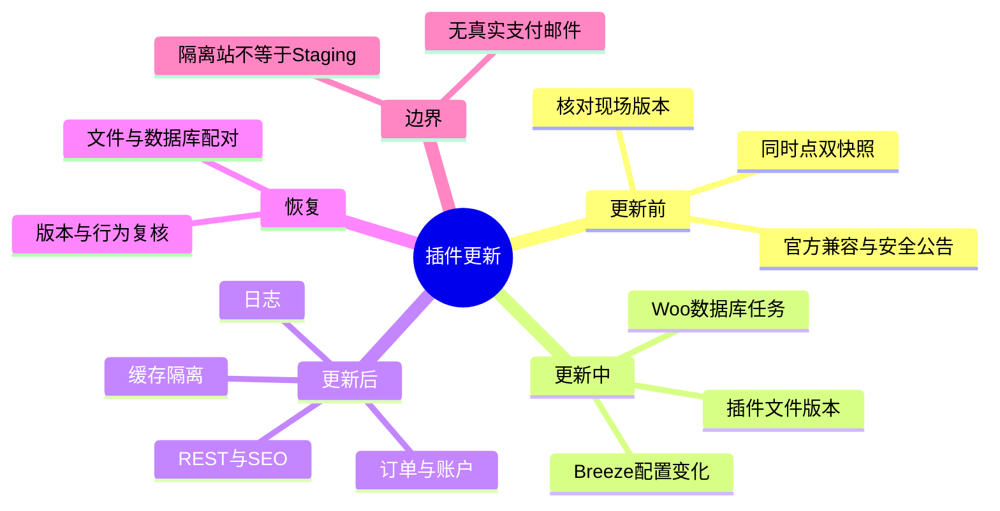
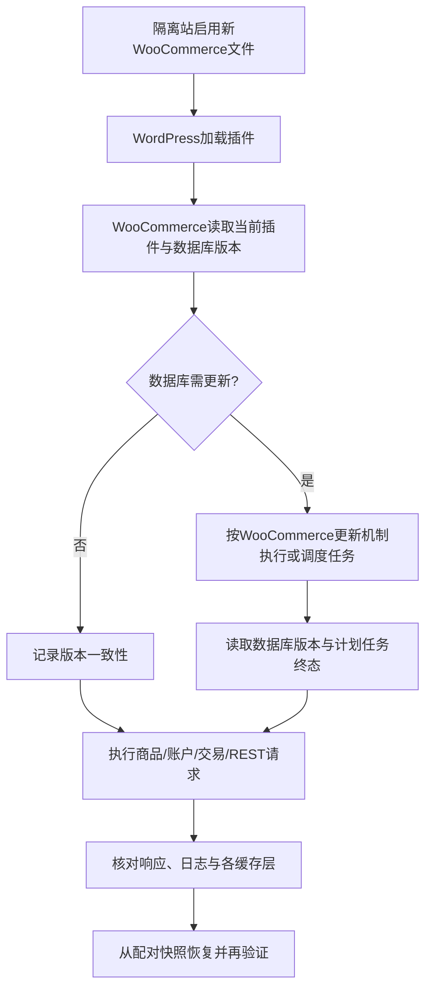

# Day104 WordPress实战：插件更新与数据库迁移回滚

## 相关笔记

- 学习索引：[[WordPress实战笔记索引]]。
- 对应项目笔记：[[../Day104-插件主题更新与安全配置审计]]。
- 前置学习笔记：[[Day103-REST权限与作者资料边界]]；升级后需重新验证站点级权限规则。
- 前置项目检查点：[[../Day103-权限与账户暴露审计]]。
- 后续学习笔记：与 D107 回归包直接相关的篇目形成后再双向回填。

## 今日学习成果

- [x] 本篇已并列记录 WooCommerce 插件文件版本、数据库版本和后台更新任务三个检查点。
- [x] 本篇已记录 TEST 插件升级、数据库迁移、REST/商品/Cart 请求及日志证据；Checkout 与目标环境仍待验。
- [x] 本篇已记录 TEST 文件与数据库配对恢复，以及插件、数据库、TEST 数据和服务终态。

三项勾选只表示本篇已有可复演的项目证据，不表示开发者本人能闭卷复述或独立操作。Checkout 与 Staging 真实组合未验；个人掌握度仍须用后文费曼题和独立练习判断。

## 真实项目场景

### 今天解决了什么问题

Staging 于 2026-10-07 记录 WooCommerce 11.0.0 与 Breeze 2.5.12。官方 WooCommerce 11.2.0 发布说明注明安全修复和数据库更新；Breeze 2.5.13～2.5.15 包含缓存处理安全修复，2.6.x 改动整页缓存设置与配置更新方式。DentAll 已有订单/报价、账户、REST 和多层缓存，升级风险跨越插件文件、持久化数据与响应缓存，因此先在全新 TEST 副本做受控迁移和配对恢复。共享 Staging 尚未升级。

### 学习范围

- 本篇要掌握：版本核对、WooCommerce 数据库更新、Action Scheduler 观察、同一时点备份/恢复、Breeze 缓存分层和验证证据的边界。
- 本篇明确不展开：真实支付执行、正式订单迁移、Production 发布、Cloudways Varnish/对象缓存的等价复演、漏洞利用或第三方核心源码修改。
- 项目真实入口：`app/public/wp-content/plugins/dentall-core/dentall-core.php`、`includes/shipping-quote-lifecycle.php`、`includes/customer-account.php`；隔离站的 WooCommerce 插件与 WordPress `woocommerce_db_version` option；Staging 的 Breeze/Varnish/对象缓存组合。
- 当前验证基线：隔离站 WordPress 7.1、DentAll Core 0.7.1、WooCommerce 插件与数据库版本 11.0.0。2026-10-07 的 Staging 记录为 WordPress 7.1.3、WooCommerce 11.0.0、Breeze 2.5.12；精确活动版本需在发布前现场重读。共享 Local 静态源码显示 Storefront 4.6.2、DentAll 主线 0.47.0、Core 主线 0.7.0，PayPal Payments 4.1.3 Header 声明 `WC tested up to 11.0`、Yoast 28.2 声明 `WC tested up to 10.9`；目录存在不证明插件启用，隔离站未复制 PayPal/Yoast。

## 先建立整体模型

### 一句话模型

插件更新先替换可执行文件，再按插件自身机制迁移持久数据，最后让真实请求穿过缓存和站点扩展点；回滚必须把文件与数据库恢复到同一时点，并证明请求行为回到基线。

### 记忆宫殿或实体比喻

把商城想成一间有账本的仓库：插件 PHP 文件是操作手册，数据库是账本，后台更新任务是把旧账本格式转成新格式的文员，缓存是已经寄出的目录册。只换手册，账本不会自动变成新格式；把旧手册放回来，也不会自动撤销账本上的改写。恢复时要取同一时间封存的手册和账本，再逐一检查目录册是否仍陈旧。

### 比喻对应回真实机制

| 记忆对象 | 真实技术对象 | 不能混淆的边界 |
|---|---|---|
| 操作手册 | WooCommerce/Breeze 插件文件与插件 Header 版本 | 文件版本不能证明数据库迁移完成 |
| 账本 | WordPress 数据库、WooCommerce 表/Options/订单与 HPOS 数据 | 不能用旧 PHP 文件自动“反迁移”新数据库 |
| 转账文员 | WooCommerce 更新任务及 Action Scheduler | “任务已排队”与“已成功执行”不同 |
| 寄出的目录册 | Breeze 文件缓存、Cloudways Varnish、对象缓存及浏览器缓存 | 清一层缓存不能证明其他层已失效 |
| 同时点封存包 | 文件、数据库、上传媒体、配置及版本记录 | 缺一层可能无法复现恢复前站点 |

比喻的边界：WooCommerce 不会像现实文员一样保证任意版本的逆向迁移；可回滚能力必须用真实备份恢复验证。

## 思维导图



主干是“现场基线 → 同时点备份 → 文件更新 → 数据更新 → 请求回归 → 配对恢复”。

## 请求与生命周期调用链



- 触发条件：隔离站把 WooCommerce 插件从 11.0.0 升到 11.2.0 并按官方要求执行数据库更新；在不含 Staging 旧配置的隔离站单独启用 Breeze 2.6.1，观察基础行为。Breeze 2.5.12 原位升级仅能在保存目标配置的受控环境另验。
- 加载入口：WordPress 活动插件列表加载 WooCommerce 与 DentAll Core；后者持续登记报价、账户和 REST 的公开扩展点。
- 输入：插件包、数据库 `woocommerce_db_version`、原有商品/订单与配置、Breeze 设置。
- 输出或副作用：可能有数据库迁移、更新任务、缓存配置文件变化；前台请求结果需另外验证。
- 可观察证据：插件 Header/CLI 版本、数据库版本、更新任务状态、HTTP/REST 响应、错误日志和恢复后的同一检查矩阵。实际结果见对应项目笔记，未执行项不标通过。

## 核心概念卡

| 概念 | 准确定义 | DentAll真实例子 | 常见误区 | 如何验证 |
|---|---|---|---|---|
| 插件版本 | 当前加载的插件文件声明版本 | 隔离站 WooCommerce 11.0.0 起点 | 后台提示“可更新”被当成已更新 | 读插件 Header 或只读 CLI 输出 |
| 数据库版本 | WooCommerce 记录已推进的数据结构/更新批次标识 | 起点 `woocommerce_db_version=11.0.0` | 文件版本相同就推断数据库完成 | 读 option 与更新任务终态 |
| Action Scheduler | 计划/执行 WooCommerce 后台任务的组件 | 数据库更新可能排队执行 | 只看“已排队”就停止监测 | 查任务状态、失败/待处理数与日志 |
| 配对恢复 | 把同一快照点的站点文件与数据库一起还原 | TEST 的 SQL 与站点 ZIP 快照 | 只降回旧 Woo 文件 | 恢复后复核版本、数据与 HTTP |
| 缓存层 | 在不同位置存储响应或对象 | Breeze、Varnish 与对象缓存；TEST 中手工排除空但自动生成 Cart/Checkout/My Account Page ID 排除 | 一次 Purge 或“手工排除空”就代表所有层安全 | 读最终 config、匿名/登录/交易请求与 HIT/MISS/正文对照 |

## 项目实战代码与证据

### 涉及文件

- `app/public/wp-content/plugins/dentall-core/dentall-core.php`：站点级 Core 的真实 Header 与模块加载，演练基线为 0.7.1。
- `app/public/wp-content/plugins/dentall-core/includes/shipping-quote-lifecycle.php`：通过 WooCommerce 订单 API、`before_woocommerce_pay_form` 与订单状态 Hook 接入报价生命周期；Woo 升级后必须回归。
- `app/public/wp-content/plugins/dentall-core/includes/customer-account.php`：账户资料规则与 WooCommerce 国家/地区 API，升级后必须回归。
- 隔离站 WooCommerce 插件 `woocommerce.php` 与 `includes/class-wc-install.php`：第三方源码，仅作只读机制核对，不修改。

### 从入口开始追踪

1. WordPress 从活动插件记录加载 WooCommerce 文件，插件 Header 声明文件版本；`dentall-core` 通过 `require_once` 加载业务模块。
2. WooCommerce 的安装/更新代码读取 `woocommerce_db_version` 并判断是否需要更新；需要时按其更新机制处理任务。**官方 11.2.0 说明明确存在数据库更新，不应省略此步。**
3. DentAll 的报价与账户代码继续调用 WooCommerce 公开 API/Hook；文件可加载不代表这些场景的输入、订单快照或权限行为仍然正确。
4. Breeze 在前台、后台与缓存清除时影响响应和配置；隔离站的结果不覆盖 Cloudways Varnish/对象缓存。
5. 恢复阶段将升级前文件与数据库配对还原，再读取版本与页面行为，不以插件目录恢复作为全部结论。

### 关键真实代码片段

共享 Local 只读核对的 WooCommerce **11.0.0** `includes/class-wc-install.php` 中，数据库更新判断读取独立 option；此片段只说明基线机制，11.2.0 的实际实现仍以升级包与演练输出为准：

```php
$current_db_version = get_option( 'woocommerce_db_version', null );

return ! is_null( $current_db_version ) && version_compare( $current_db_version, array_key_last( self::$db_updates ), '<' );
```

| 代码 | 表面动作 | 实际作用 | 为什么要核对 |
|---|---|---|---|
| `get_option` | 读取一个字符串 | 从 WordPress Options 读取 Woo 的数据库迁移标识 | 它与插件 Header 的 `Version` 不是同一事实 |
| `version_compare` | 比较版本 | 判断当前 DB 是否落后于该版本登记的更新批次 | 仅看文件更新成功无法确认持久层状态 |

### 运行证据与限制

- 已有证据：全新 TEST 隔离站在升级前生成 `db-pre-upgrade.sql`（144,512 B，SHA-256 `B9BC5C38AC5A6527C8ACD551F72C2CB18C72478CB0C3CF84BD8DBB27B36F14D0`）及 `site-pre-upgrade.zip`（48,325,287 B，SHA-256 `D6D2A121A0D5B7DB166F09832FB66F9D2ADE4ABD981E10AF18FCACB50FF6A451`）；Woo 插件和数据库版本均为 11.0.0。核对官方 WooCommerce 11.2.0 包 manifest 后复制 5,488 个文件，WP-CLI 读取插件版本 11.2.0。
- 数据库更新证据：`wp wc update` 执行 13 个回调、退出码 0，`woocommerce_db_version` 从 11.0.0 变为 11.2.0-1；随后发现重复回调、版本动作及 VariationGallery 相关待办。初次 `wp action-scheduler run --group=woocommerce-db-updates` 退出码 1 并提示组不存在，没有执行这些待办。
- 独立只读复核解释：Action Scheduler `HybridStore` 迁移未完成；旧 `PostStore` 动作数 0，旧 taxonomy 无组，新表确有 `group_id=2` 与 15 个 pending。按 [官方 WP-CLI 指南](https://actionscheduler.org/wp-cli/)在 TEST 站运行 `action-scheduler migrate --dry-run` 后正式 `migrate`；旧库迁移 0 项，`DBStore` 生效，再以新 CLI 进程定向运行该组，没有手改数据库。
- 队列结果：动作 ID 6～19、22 全部 `complete`、各 `attempts=1`，有逐条 started/complete 日志；该组 `complete=15/pending=0/failed=0`，VariationGallery 完成标记及 DB 版本实存。CLI 尾部显示运行 0 个动作与持久状态不一致，最终采用状态、次数和逐条日志交叉验证。后置本地 batch watchdog ID 21 生成税分析批处理 ID 24，两项均经定向运行后 `complete`；`wc_pending_batch_processes` 为空、无 failed。ID 20 remote inbox 和 ID 23 次日例行任务未触碰。官方提示按组运行可能改变跨组任务的隐含顺序，本次通过限定已知本地更新任务避免执行无关任务。
- 日志证据：`wp_woocommerce_log` 为 0 行，`uploads/wc-logs` 仅有 `index.html`，没有 Woo updater 日志可审；HTTP PHP error log 按 fatal/error/warning/deprecated/notice 扫描无命中。后来 `wp-content/debug.log` 有 03:10:55 UTC 的 WP-CLI `eval` 转义错误 `Undefined constant id` Fatal，归属于测试命令，不是已证实的 HTTP 产品请求错误；因此不能称“全日志零错误”或“Woo updater 日志证明无错误”。
- Breeze 与 HTTP 证据：官方包校验后 561 个文件复制至 TEST 并激活，WP-CLI 读取 active；TEST 的 `wp-config.php` 被写入 `WP_CACHE=true`，产生 `advanced-cache.php` 和 `breeze-config` 下两个文件，根目录未见新 `.htaccess`。锁到期后，03:14:55 UTC 受控 GET `?page_id=5` 触发 `wp_loaded`，`breeze_upgrade_running` 消失、`breeze_version=2.6.1`，文件与 `WP_CACHE=true` 保持。初轮 pretty URL 因 PHP 内置服务器缺 rewrite 误返首页 HTML，状态码证据已作废；独立测试改用 `?rest_route` 与 plain query 检查 JSON/正文。
- 独立请求结果：匿名 Users 列表、员工数字 ID 2/3 均 403 JSON，匿名 `/me` 401；Posts 与 `?_embed=author` 为 200，`author` 数字 ID 和 `_links` 保留，嵌入作者仅为错误对象。Store Products 200/两款 TEST 商品、Store Cart 200/`no-store`。两独立匿名会话 A、B 分别有 Simple ID 11（$19）和变体 14 Box（$35），购物车未串且均 `no-store`；Shop/商品 200、Cart 页面 `private/no-cache`。商品索引 ID 25～29 定向任务 5/5 complete，组内 pending/failed=0、全队列 failed=0。独立 Chrome CDP 已取 Shop、Simple、Variable、空 Cart × 390/768/1024/1440 共 16/16 张截图与几何，`document`/`body` 均无横向溢出、Runtime 异常 0；只对 390px Shop/Variable/Cart 做了目视，其余截图未逐张目视。
- Breeze 配置证据：`breeze_file_settings` 中 `breeze-enable-html-cache='1'`、basic active=1，advanced 手工 `exclude-urls` 为空；源码从已发布 Woo Cart/Checkout/My Account Page ID 自动形成 URL，与手工排除合并写 config。TEST 的 Page ID 6/7/8 对应 `?page_id=6*`、`7*`、`8*`。该新装默认不能证明 Staging 旧配置迁移或 Varnish 排除有效。
- 配对恢复：升级后另存数据库 dump（191,170 B，SHA-256 `93CF0E5D27CD81060CA748CE368AA4B77F60BD3984CC9C6E6E292CD9CD3E0B53`）及升级后站点证据；仅停止 TEST HTTP PID 25672，核对 TEST datadir、20381 端口与 MySQL PID 26756 后，只重建 `dentall_test` 库、导入原 SQL 并从原 ZIP 解回 `site`。恢复后 Woo 文件与 DB 标识同为 11.0.0、Core 0.7.1、活动插件仅 Core+Woo；Breeze 目录、`advanced-cache.php`、`WP_CACHE`、Breeze DB 选项均无，Product/Variation 与 `TEST-D104` SKU 均 0。TEST MySQL 优雅停，两个 PID 均不运行，20380/20381/20382 均无监听。
- 清理限制：TEST HTTP/MySQL 已停、站点/数据库已配对恢复。只读核对本轮 TEST 根目录位于当前 workspace 且目标及子项无 reparse/junction 后，原生 PowerShell `Remove-Item -LiteralPath <本轮TEST目录> -Recurse -Force` 被自动审批以 `blocked by policy` 拒绝，未发生删除；被 Git 忽略的敏感快照、TEST 凭据和脚本仍在，待获准路径清理。Git 忽略和服务停机都不等于敏感实体已删除。
- 待补证据：完整目标环境缓存与第三方依赖回归仍待另行执行。Checkout 在该 TEST 配置中重定向 Cart，不能称结账或下单通过；新装 2.6.1 不等于 Staging 2.5.12 原位升级，HTTP 结果不覆盖 PayPal/Yoast、Varnish、正式 SEO 输出或交易页缓存。
- 能证明：文件、数据库标识与指定 Woo 更新组的持久任务状态已推进；**不能证明全站回归或目标环境缓存安全**，也不能仅凭快照大小证明可恢复。

## 职责边界

| 层级 | 本主题中负责什么 | 不应该负责什么 |
|---|---|---|
| WordPress Core | 加载活动插件、保存 Options 与站点基础路由 | 不负责推断 Woo 升级后全部业务正确 |
| WooCommerce | 商城 API、订单/商品持久层及自己的数据库迁移 | 不保证旧代码对迁移后数据库可逆兼容 |
| Breeze | 页面缓存及其配置、清除入口 | 不能替代 Varnish/对象缓存的现场验证 |
| Storefront与DentAll子主题 | 商城页面和展示接入 | 不执行 Woo 数据库迁移；主题静态版本不能证明目标已部署 |
| `dentall-core` | 报价、账户、权限等站点级扩展 | 不修改第三方升级代码；必须在新版本回归 |
| 数据库与媒体 | 持有订单、选项、配置和上传资产 | 不进入 Git；恢复时与代码快照配对 |
| Cloudways 缓存层 | 真实 Staging 的代理与对象缓存行为 | 不能由普通隔离站准确代替 |

## 机制详解

| 项目 | 说明 |
|---|---|
| 机制类型 | WordPress 插件加载；WooCommerce 数据库更新；Action Scheduler；Breeze 缓存配置 |
| 名称或入口 | 插件 Header、`woocommerce_db_version`、WooCommerce 数据库更新入口及 Action Scheduler 任务 |
| 注册与执行位置 | WordPress 活动插件加载；WooCommerce 更新代码在其插件生命周期内处理版本差异，实际触发与任务应以目标版本源码/日志核对 |
| 输入 | 当前文件版本、数据库版本、旧数据及环境配置 |
| 返回或副作用 | 文件更新、数据库写入、后台任务、缓存清理/重建；不是单个 Filter 返回值 |
| 影响范围 | 商品、订单、账户、支付/邮件扩展、REST、前台缓存与后台设置 |
| 停止与恢复 | 先停止对旧快照继续写入；从同一时点文件和数据库恢复，再查版本与关键请求 |

## 安全、数据与站点影响

| 检查面 | 本次结论 | 证据或待验证项 |
|---|---|---|
| 输入清洗、Capability、Nonce | 本轮未添加自定义写入口；第三方更新器内部机制以官方包为准 | 不将 CLI 管理权限外推为前台权限通过 |
| 数据库写入 | WooCommerce 11.2.0 官方说明需要 DB update | TEST 迁移任务与配对恢复通过；共享 Staging 未执行 |
| URL与SEO | 预期不主动改链接策略，但插件更新可能影响输出或状态；Yoast 28.2 本地 Header 仅声明测至 Woo 10.9 | 隔离站未复制 Yoast；精确 URL、Title/Meta/Canonical/Schema/robots/sitemap 待目标实配回归，旧测试声明不等于已证实不兼容 |
| 缓存 | Breeze 2.6.1 在 TEST 启用并写入 `WP_CACHE=true`、`advanced-cache.php` 和 `breeze-config`；锁后确认 `breeze_version=2.6.1` 且锁清除；手工排除空但生成 config 有 Cart/Checkout/My Account Page ID 排除；正确路由下 Cart Store API `no-store`、Cart 页面 `private/no-cache`，两匿名会话不串车 | TEST 无旧配置，无法等价复演 Cloudways Varnish、对象缓存、真实排除规则或交易页 HIT/MISS；Checkout 在 TEST 重定向 Cart，未验证实际交易页 |
| 支付、物流与订单 | 现有报价/HPOS/结账扩展依赖 WooCommerce；PayPal Payments 4.1.3 本地 Header 仅声明测至 Woo 11.0 | 隔离站未复制 PayPal；未启用真实付款或发信，需目标实配与 Sandbox 定向回归，旧测试声明不等于已证实不兼容 |
| 部署与回滚 | TEST 双快照已完成配对恢复，Woo 文件/DB 均回 11.0.0、Breeze 与 TEST 商品数据消失；服务已停 | 仅证明 TEST 副本；Staging/Production 的备份、配置与恢复另验。递归清理被自动审批拒绝，忽略目录敏感遗留仍在 |

## 动手练习

### 练习一：只读观察

- 目标：分清插件文件版本与数据库版本。
- 操作：在独立隔离站读取 WooCommerce 插件版本与 `woocommerce_db_version`，并查看数据库更新任务状态。
- 预期：升级前两者为 11.0.0；升级后需分别核实文件、DB 标识和任务终态。
- 实际证据：升级前文件与数据库为 11.0.0；演练升级阶段曾见文件 11.2.0、DB 标识 11.2.0-1，定向 Woo 更新组 15 项完成、0 项 pending/failed，后置本地 batch ID 21/24 完成且待处理清单为空；配对恢复后文件与数据库回到 11.0.0。全站回归仍未完成。

### 练习二：隔离站最小更新与回滚

- 改动：仅在全新 TEST 站把 WooCommerce 官方包从 11.0.0 更新至 11.2.0，执行必要的 Woo 数据库更新，并安装 Breeze 2.6.1 做启用冒烟；没有 Breeze 2.5.12 原位升级证据。
- 风险边界：不接触共享 Local、Staging、Production；不用真实付款、邮件、DNS 或正式订单。
- 验证：记录版本、数据库任务、商品/账户/REST 与缓存请求，检查错误日志和已知旧数据事实。
- 回滚：已用同一升级前时点 SQL 与站点 ZIP 配对还原；版本、活动插件、Breeze 配置、商品/变体与 TEST SKU 均核对回基线，服务进程及端口已停。其他目标环境仍须独立演练。

### 练习三：故障推演

- 症状：更新后插件显示 11.2.0，但订单后台提示数据库更新未完成。
- 第一项检查：只读核对 `woocommerce_db_version`、待处理/失败的更新任务与 WooCommerce 日志。
- 原因：文件、任务与持久层是不同检查点，立即退回旧 PHP 可能增加数据不兼容风险。
- 决策：停止进一步交易写入，按现有备份和官方更新指引判断是继续迁移还是配对恢复，保留日志和错误时间线。

## 常见误区与排错顺序

| 现象或误区 | 可能原因 | 推荐检查顺序 | 最小验证 |
|---|---|---|---|
| 插件界面版本已新，数据库仍旧 | 更新任务尚未执行或失败 | 文件版本 → DB option → Action Scheduler → 日志 | 三者并列记录，不改真实订单 |
| 公共页正常，付款页出现旧内容 | Breeze、Varnish 或对象缓存各层未正确排除；只看“手工排除空”误判最终配置 | 页面响应头/正文 → Breeze 生成 config → 代理规则 → 缓存 Purge | 匿名与登录、真实交易页/占位页分开对照 |
| 回退插件文件后仍有异常 | 数据库已迁移或配置已变 | 停止写入 → 核对双快照 → 配对恢复 → 请求回归 | 恢复后复读版本和旧数据 |
| 隔离测试通过却在 Staging 失败 | PHP、WordPress、插件组合或缓存拓扑不同 | 现场版本 → 活动插件 → 配置/日志 → 最小复现 | 不把 TEST 结果当目标验收 |

## 掌握标准与费曼测试

- [ ] 不看笔记，能在2分钟内讲清“文件、数据库、任务、缓存”之间的因果链。
- [ ] 能指出 WooCommerce 的数据库版本入口和 DentAll 的 Woo 扩展点。
- [ ] 能说明至少一个失败路径、停止条件与配对恢复步骤。
- [ ] 能区分隔离站通过、Staging 通过和 Production 上线许可。

当前掌握度：初识；闭卷自测和隔离演练完成前不提升。

1. 如果 WooCommerce 插件文件显示 11.2.0，但 `woocommerce_db_version` 仍是 11.0.0，你会先查什么？
2. 为什么只复制回旧版 WooCommerce 目录不等于完成回滚？
3. 把仓库、账本、文员、目录册逐项对应到 WordPress/WooCommerce；比喻在哪个边界失效？
4. 从 WordPress 加载插件开始，按顺序解释数据库更新可能怎样被发现、执行和验证。
5. Breeze 本地测试正常，为何不能直接宣布 Cloudways 交易页缓存安全？
6. 哪三项实际证据能让你区分“更新可见”、“迁移完成”和“恢复可用”？
7. 如果迁移任务失败且已有 TEST 订单变更，怎样划定停止、取证与恢复边界？

### 我的费曼答案与纠正

待项目开发者闭卷作答；本文只提供问题与证据路径，不代替实际掌握度。作答时每题需包含通俗解释、准确术语和 DentAll 证据，并标记通过、含糊或答错。当前状态为**尚未评分**，不能写成零分或自测通过。

## 间隔复习记录

| 复习节点 | 计划日期 | 完成 | 暴露的问题 | 修正位置 |
|---|---|---|---|---|
| D+1 | 2026-10-09 | [ ] | 待自测 | 本篇机制详解 |
| D+3 | 2026-10-11 | [ ] | 待自测 | 本篇项目实战代码与证据 |
| D+7 | 2026-10-15 | [ ] | 待自测 | 本篇安全、数据与站点影响 |
| D+14 | 2026-10-22 | [ ] | 待自测 | 本篇可复用核心思想 |

## 收尾总结与后续提问

- 今天已核实：官方目标的 WooCommerce 更新包含数据库更新；当前项目的报价、账户与缓存使单点版本检查不足以支撑发布。
- 尚不能断言：Staging 的 Breeze 2.5.12 原位升级、Varnish/对象缓存、PayPal/Yoast、Checkout 与 TEST 行为一致；TEST 配对恢复不能外推为目标环境已可恢复。
- 下次类似升级先收集：目标环境实际版本/配置、同一时点双快照、变更说明、数据库任务与关键请求基线。

可复制的排错提问方式：

```text
请基于以下实测资料分析 WooCommerce 升级问题，不要假设插件版本等于数据库版本。
环境：WordPress/PHP/WooCommerce/Breeze/主题及活动插件版本；隔离或Staging。
预期与实际：插件版本、woocommerce_db_version、Action Scheduler状态、关键URL与错误日志。
备份：文件/数据库/配置是否来自同一时点，已验证到哪一步。
边界：不得改核心、真实订单、真实支付、SMTP或Production。
请区分已确认事实、推断与待验证项，给出最小只读检查、停止条件、恢复和复验顺序。
```

## 变种应用到其他项目

| 新场景 | 保持不变的原则 | 可能变化的实现 | 必须重新确认 | 最小验证 |
|---|---|---|---|---|
| 另一个 WooCommerce 经典主题 | 文件、DB、任务、缓存分层 | 主题 Hook 与页面模板 | Woo/主题/支付扩展版本 | 商品、订单、Checkout、账户 |
| WordPress 区块主题 | 配对备份与真实回归 | 区块模板及 Cart/Checkout 前端 | 当前 Woo Block 与主题支持 | 四端、订单金额与错误态 |
| 其他电商插件 | 更新不等于迁移完成 | 数据版本标识及后台任务系统 | 官方迁移与恢复文档 | 用 TEST 数据完整往返 |
| Shopify 或托管商城 | 扩展依赖、配置快照和交易回归 | 平台发布、App 更新及数据回退能力 | 官方能力、权限与回退限制，待验证 | 沙盒或受控测试店，待验证 |

变种练习：选择一种平台，先指出哪些数据会被更新任务持久修改，再决定如何取得可恢复快照；不要把 WooCommerce 的 `woocommerce_db_version` 当作其他平台的默认机制。

## 可复用核心思想

### 跨平台不变量

依赖升级是一组状态转换，不是一次文件复制。只有把当前代码、持久数据、异步任务和缓存层分开观察，并通过失败路径与恢复演练，才能解释“更新成功”究竟覆盖了什么。

### WordPress/WooCommerce当前实现

WooCommerce 11.0.0 基线源码通过 `woocommerce_db_version` 识别数据库更新需求；11.2.0 官方说明要求数据库更新。DentAll 的账户和报价模块依赖 WooCommerce 公开 API/Hook，升级后需用代表请求与订单状态验证；Breeze 与 Cloudways 缓存必须分层检查。

### Shopify或其他平台的对应机制

应用、主题、扩展与后台数据的版本一致性同样重要；具体迁移标识、发布回滚、边缘缓存和权限模型不能从 WooCommerce 一一映射，需查目标平台官方资料并实测，待验证。
