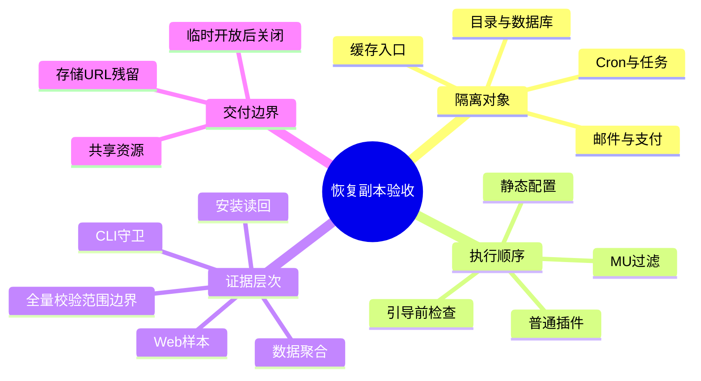
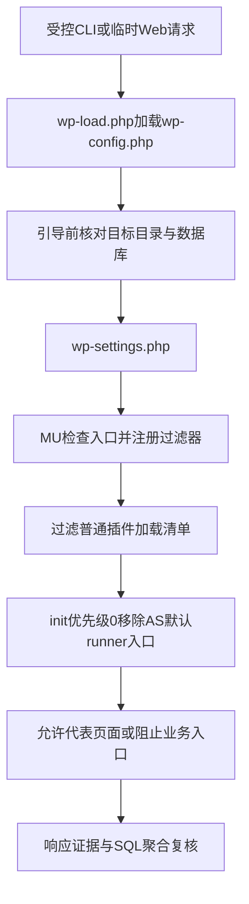

# Day106 WordPress实战：恢复副本隔离与分层验收

## 相关笔记

- 学习索引：[[WordPress实战笔记索引]]
- 对应项目笔记：[[../Day106-恢复副本隔离改造]]
- 前置学习笔记：[[Day105-备份证据链与离线恢复边界]]
- 后续学习笔记：尚未形成；后续恢复或环境开放工作实际发生后再建立双向链接。
- 同主题记录：[[../Day105-Cloudways备份现场核查]]

## 今日学习成果

以下是可自测的学习目标，不代表用户已经掌握。

- [ ] 能解释为什么副本看起来与来源相同，仍要分别检查数据库、外发、任务、缓存和入口。
- [ ] 能沿 `wp-config.php → wp-settings.php → MU → 普通插件 → init` 说明隔离必须发生在什么位置。
- [ ] 能区分静态安装、CLI守卫、网页样本、业务聚合与完整恢复五种证据，不把其中一项替代全部验收。

## 真实项目场景

### 今天解决了什么问题

把既有 `独立恢复目标`（配有专用目录和数据库）改造成受控恢复副本。来源是既有 Staging 应用。用户选择复用同一服务器中的独立应用，目标不是建立虚拟机或实现所有网络出口的防火墙隔离。

2026-10-07 已上传并执行安装器，哈希核对和安装返回 PASS。2026-10-08 先保持访问关闭，通过 SSH 受控启动和数据库聚合复核；用户随后明确授权临时公开网页，完成代表页面与入口检查，再关闭窗口。用户最新确认以本轮选定历史自动备份恢复成功、后台和网页可用、已检查聚合符合预期的证据正式完成D105，取代此前“跳过”决定，无需重复补验。

### 学习范围

- 掌握配置与加载顺序、外部副作用限制、恢复证据分层及最小排错方法。
- 不展开真实支付、邮件投递、下单、后台编辑、完整备份哈希或全天候测试站交付。
- 版本证据：远程 WooCommerce `11.0.0`、Action Scheduler `4.0.0`、DentAll Core `0.6.0`、PHP `8.2`；后台截图显示 WordPress `7.1.3`。本篇不推定未重新读回的主题版本。
- 当前实操状态：临时 Web 窗口已关闭，独立目标请求返回 `503`，来源首页返回 `200`；Cron远程调用顺序、受控模拟拦截及网页窗口后的最终 SQL 比较均已完成。本轮受控恢复运行验收通过，证据已复用完成D105；不宣称逐文件字节一致、全部业务交易已测或常态公开环境交付。

## 先建立整体模型

**一句话模型：** 恢复会带回网站内容，也会带回能发信、付款、跑任务的设置，所以必须在首次执行前限制副作用，再分层验证。

可以把副本理解为“装有原设备的演练室”：复制装修和库存让它外观一致，接电后设备却可能自动工作。关门、断开特定线路和核对库存是三件不同的事。

| 比喻 | 真实对象 | 边界 |
|---|---|---|
| 演练室独立库房 | 目标应用目录及独立数据库 | 同服务器仍共享CPU、内存和服务资源 |
| 关门 | Application Access OFF | 不等于SSH不能执行PHP，也不等于完整出站阻断 |
| 断开特定线路 | 邮件、WP HTTP、支付及任务守卫 | 原始PHP cURL/socket不由WP HTTP过滤器全面覆盖 |
| 接电试机 | 加载 `wp-load.php` 或打开网页 | GET或初始化也可能写 transient、session 等数据 |
| 清点关键库存 | 订单/AS聚合前后比较 | 聚合相同不代表逐字段或全库完全不变 |

## 思维导图



主干是先限定“什么可以执行”，再判断“每项证据能证明到哪里”。

## 请求与生命周期调用链



- Object Cache 等早期 drop-in 可先于 MU 执行，因此先从目标 `wp-content` 移入私有备份，不能等 MU 加载后才处理，也不能清空共享 Redis。
- MU 在普通插件前加载，因而可以过滤目标的活动插件清单，阻止 SMTP、缓存和支付插件在本次请求加载。
- AS 的默认 runner 在 `init` 优先级 `1` 注册工作；目标在优先级 `0` 撤销其入口。只阻止新增排程不足以覆盖已存在的待执行任务。
- 网页入口还受请求方法、路径和参数约束；后台只允许无查询参数的仪表盘及原生登录，不开放完整后台编辑。

## 核心概念卡

| 概念 | 准确含义 | 本次证据或误区 |
|---|---|---|
| 静态检查 | 不执行配置中的PHP，只解析、检查、读回文件 | 安装器用 tokenizer 核对路径、常量与唯一引导位置；`php -l`不证明运行行为 |
| 运行时守卫 | 实际引导后检查已加载文件及Hook状态 | CLI共10项PASS，未主动发信、支付或运行队列 |
| 访问控制与noindex | 前者限制谁能访问，后者提示搜索引擎索引行为 | `noindex`不是密码；用户明确选择临时公开，结束后关闭 |
| URL覆盖 | 常量影响WordPress相应URL读取 | 不能自动迁移菜单中的自定义链接或Yoast已存储索引 |
| 聚合不变量 | 特定统计在两个时间点相同 | 不能扩张为全库无写入或全部备份内容正确 |

## 项目实战代码

### 涉及文件与职责

- `.codex-tmp/d106-isolation/dentall-restore-isolation.php`：本地忽略目录中的真实临时环境守卫，约104行、1个具名函数；远程部署到目标 `wp-content/mu-plugins/`。
- `.codex-tmp/d106-isolation/install-isolation.sh`：一次性安装器，负责目标确认、静态转换、私有备份、文件写入与读回。
- 目标 `wp-config.php`：固定目标URL和环境常量，加入WordPress启动前目标核对；保留回滚副本。

这些文件承担恢复环境的独立生命周期，不进入商品展示子主题或长期业务 `dentall-core`。没有为本次临时演练创建通用后台入口。忽略目录不提供永久版本交付保证；后续若决定常态使用，应重新确定维护归属。

### 从入口开始追踪

1. `wp-config.php` 先核对真实目标路径及数据库，再引导WordPress。
2. MU被自动加载，安装下面的邮件短路过滤器；普通插件随后加载。
3. 调用WordPress邮件API时，过滤器返回失败，避免真实投递，也避免业务误认为发送成功。
4. 移除该过滤器可能恢复邮件链并触发依赖“发送成功”的业务状态变更；不能在公开副本上通过发送真实邮件试验。

### 关键代码片段

以下节选自真实 `.codex-tmp/d106-isolation/dentall-restore-isolation.php`：

```php
// 过滤加载清单，避免触发停用 hooks；邮件返回失败，不能伪造“报价邮件已发送”。
add_filter( 'option_active_plugins', static function ( $plugins ) {
	return array_values( array_diff( $plugins, array(
		'fluent-smtp/fluent-smtp.php', 'breeze/breeze.php', 'object-cache-pro/object-cache-pro.php',
		'woocommerce-paypal-payments/woocommerce-paypal-payments.php',
	) ) );
}, PHP_INT_MAX );
add_filter( 'pre_wp_mail', '__return_false', PHP_INT_MAX );
```

`option_active_plugins` 改变本次读取到的加载名单，不执行插件停用流程；`pre_wp_mail` 返回 `false` 表示发送失败。DentAll报价业务会依赖成功发送事实更新订单，因此返回 `true` 会伪造业务成功。过滤器不是防火墙，也不会删除数据库里原有SMTP凭据。

### 运行证据

| 层次 | 实际结果 | 不能替代 |
|---|---|---|
| 安装 | SCP上传100%；远程SHA-256一致；安装器返回 `INSTALLATION_COMPLETE_ACCESS_MUST_REMAIN_OFF` | 运行时隔离、PHP-FPM执行结果 |
| CLI | BOOT、MAIL、HTTP、PAY、PLUGINS、AS及4种AS_NEW共10项PASS | 真实邮件/支付测试、全网络阻断、网页布局 |
| CLI及Web后数据 | Woo版本与DB版本均11.0.0，HPOS为yes；两笔cancelled订单合计36，最后更新 `2026-10-06 09:19:43`；CLI后和Web/登录/Cron模拟后的最终AS各聚合均与基线一致 | 全库或逐字段无变更、所有业务行为均已验收 |
| Web | 首页200且noindex/no-store、MISS；REST、cart、checkout、account均403；用户登录仪表盘；BK21商品标题、28.99美元价格和图片可见 | 后台编辑、加购、交易、四端布局回归 |
| 媒体 | 样本WebP独立GET200，6656字节 | 全部uploads文件完整性 |
| 窗口关闭 | 用户确认Access OFF，独立目标HEAD503；来源GET200，标题Home-DentAll | 来源全站或交易性能证明 |

AS基线：canceled `1/0/0`、complete `2602/2602/2602`、failed `1/1/1`、pending `12/0/0`（数量/attempts合计/非零claim数），CLI后及最终复核一致，均无in-progress行。complete最后尝试为 `2026-10-06 17:35:14`，failed为 `2026-08-15 07:06:59`，另两类为零时间，前后均相同。历史complete/failed的非零claim不能直接当作当前任务在运行。

## 职责边界

| 对象 | 本次负责什么 | 边界 |
|---|---|---|
| Cloudways | 应用入口开关、独立应用及数据库 | 开关不等于完整网络隔离 |
| WordPress Core | 原生加载、登录、Hook与Cron入口 | 未修改核心文件；状态码要结合响应结束时机解释 |
| WooCommerce / AS | 商品和订单模型、任务生命周期 | 本轮限制交易与执行，未验收正常购买 |
| Storefront与DentAll子主题 | 页面展示及原有资源 | 未改页面样式；截图相似不能证明所有内容一致 |
| DentAll Core | 原有站点业务 | 邮件结果等外部事实可能驱动业务写入，不能伪报成功 |
| 临时MU | 环境守卫 | 不承诺全库只读或任意PHP网络阻断 |
| 数据库与媒体 | 恢复内容 | 代表样本与聚合支撑本轮恢复验收，不宣称全部文件和逐字段一致 |

## Hook与运行机制详解

| 入口 | 作用 | 验证边界 |
|---|---|---|
| `pre_wp_mail` | `false`短路邮件并返回失败 | CLI直接检查过滤结果，无实际投递 |
| `pre_http_request` | 返回预期 `WP_Error` | 仅WordPress HTTP API路径 |
| `woocommerce_available_payment_gateways` | 将可用网关清空 | CLI检查回调注册，未调用真实支付 |
| `rest_pre_dispatch` | REST返回403 | 匿名 `/wp-json/` 已实测 |
| `init`优先级0、AS预过滤器 | 移除默认执行入口，阻止四类新任务排程 | CLI检查挂载状态及返回值，不主动运行队列 |
| `wp`优先级0 | 拦截购物车、结账、账户与订单付款页 | 三个代表页面GET403 |

## 安全、数据与站点影响

- **权限：** 登录仍使用WordPress原生验证；临时守卫缩小允许入口，不能替代原生 capability 和 nonce。后台仪表盘可访问不代表编辑权限验收通过。
- **数据：** 初始化、登录或页面访问可能产生 transient/session 等写入。本次前后SQL仅覆盖指定版本、订单与AS聚合；最终Web窗口、登录及Cron模拟后的统计与基线一致，不扩大为全库无写入。
- **SEO与URL：** 首页有noindex/no-store，但仍发现4个指向来源域名的菜单链接及OG/Schema来源引用。说明常量覆盖不等于存储URL迁移；未因此修改来源站。常态开放前须在目标定向修正并复核。
- **缓存：** 目标缓存drop-in先移出；受测首页MISS。没有清空共享Redis、重启共享服务或宣称所有缓存零影响。
- **支付、邮件、物流：** 本轮不执行真实投递、付款、发货或测试下单；限制相关入口是恢复冒烟边界。
- **部署与回滚：** 原配置和两项drop-in保存于目标Web根目录外的私有备份。回滚前关闭目标入口，按已备份状态恢复并核对；安装失败可能留下MU或备份，不能盲目重跑。关闭Access可以收回Web窗口，但不是卸载守卫。

## 动手练习

### 练习一：只读观察

对照相同4条SELECT的CLI前后截图，逐项比较版本、订单数/金额/更新时间和AS数量/attempts/claim/时间。实际已一致；练习结论只覆盖这些查询，不写“全库未变”。

### 练习二：离线最小验证

本次实际采用无真实凭据的配置字符串测试，检查唯一引导锚点、括号/空格变体、重复常量、未知include及错误DB等12场景，均通过。没有为学习额外修改远程数据库；临时样本即可回收，不把覆盖真实副本当作练习回滚。

### 练习三：故障推演

观察到 `/wp-cron.php` 返回空200时，不能立即判定执行成功或守卫失败。本地WordPress源码中的 `fastcgi_finish_request()` 先于 `DOING_CRON` 和 `wp-load.php`，可能已经结束HTTP响应。随后用户远程静态检查确认第28行调用 `fastcgi_finish_request()`、第42行定义 `DOING_CRON`、第46行加载 `wp-load.php`；顺序与本地相符。

在Application Access已经关闭时，用户通过CLI定义 `DOING_CRON` 后加载目标 `wp-load.php`，输出 `Restore isolation: request blocked.`，未出现探针失败标记 `FAIL:CRON_NOT_BLOCKED`，随后返回提示符。这证明该模拟入口在守卫处退出；之后最终SQL显示所观察的订单和AS统计与基线一致。没有重复请求Cron或主动运行任务队列。

## 常见误区与排错顺序

| 现象 | 检查顺序 | 本次教训 |
|---|---|---|
| 终端粘贴后没有提示符 | 看续行提示、heredoc结束符及命令是否等待stdin | 长粘贴/Tab补全造成截断，改用SCP与哈希检查 |
| SCP认证后提示目录不存在 | 区分SSH真实路径与SFTP可见目录 | SFTP采用 `/applications/...`，不能照搬SSH绝对路径 |
| `wp config list`找不到盐文件 | 检查工作目录、相对require和文件存在性 | 命令会求值配置；不能视为纯静态读取或直接重置盐 |
| 商品外观与来源一致 | 核对目标地址栏、DB和守卫 | 视觉相似是样本恢复证据，不是业务隔离证据 |
| URL常量已改仍跳来源 | 查渲染后的链接及存储/索引数据 | 菜单和SEO引用需独立处理 |

## 掌握标准与费曼测试

本人自测尚未完成，不填写虚构分数或勾选掌握项。

- [ ] 能复述配置、早期drop-in、MU、普通插件与init的顺序。
- [ ] 能说明正常页面、被阻止业务入口及异常状态码的检查方法。
- [ ] 能指出每条验收证据的范围与回滚前置条件。

1. 为什么复制出相同页面还不够，首次执行前需要保护什么？
2. 为什么Object Cache不能等MU加载后再处理？
3. 为什么邮件短路必须返回false，不能为了“测试成功”返回true？
4. 为什么CLI十项PASS、Web200和订单聚合一致是三种证据？
5. 为什么Cron空200需要核对生命周期，不能直接再执行一次任务试试？
6. 为什么改变WP_HOME后，菜单和SEO仍可能引用来源？

我的费曼答案与纠正：尚未自测。每题0～2分，满分12；答案需包含通俗解释、准确机制和本篇证据，存在0分题时不提升掌握度。

## 间隔复习记录

| 节点 | 计划日期 | 完成 | 重点 |
|---|---|---|---|
| D+1 | 2026-10-09 | [ ] | 加载顺序与证据分层 |
| D+3 | 2026-10-11 | [ ] | 邮件结果及任务副作用 |
| D+7 | 2026-10-15 | [ ] | URL存储与状态码排错 |
| D+14 | 2026-10-22 | [ ] | 迁移原则与恢复边界 |

以上为知识复习建议，不增加项目工作日或要求在休息日补进度。

## 收尾总结

本次最值得保留的是执行顺序和证据边界：静态安装、CLI、Web、数据比较应各自给出结论。临时网页窗口已经关闭，Cron远程顺序及模拟拦截已补证，最终SQL聚合与基线一致，本轮受控恢复运行验收通过。用户已确认复用这些实际恢复证据完成D105；未做全量文件校验和真实交易只记范围边界，不增加补做任务。常态开放前的来源URL残留P2继续单独管理。

## 后续如何向AI高效提问

使用“真实环境＋目标＋已执行命令＋脱敏结果＋禁止触碰的范围＋希望的最小检查”。不要提供密码、Cookie、私钥或完整数据库。

```text
目标恢复副本与来源在同一Cloudways服务器，WooCommerce 11.0.0。
CLI守卫检查PASS，Web Cron却返回空200；目标目前已关闭。
请结合实际wp-cron.php调用顺序，区分响应结束与后台执行，
只给不会运行队列或发出外部请求的最小验证，并注明哪些仍属推断。
```

## 变种应用到其他项目

| 场景 | 不变原则 | 必须重新确认 |
|---|---|---|
| 另一个WordPress主题或区块主题 | 隔离放在环境生命周期，页面只作样本 | 实际插件、早期drop-in、任务入口与版本 |
| 另一托管平台 | 分开验证入口、数据权限与外部副作用 | 平台网络控制、目录映射、备份与回滚能力 |
| 其他商城平台 | 复制内容可能同时复制集成与自动化 | 对应环境、任务、凭据及发布机制；本次未验证具体映射 |

变种练习：先列出“首次执行前可能发生的外部副作用”，再找平台原生限制方法和最小观察证据，不直接复制DentAll的目录、域名或Hook。

## 可复用核心思想

- **跨平台不变量：** 环境身份、执行入口、数据边界和外部副作用分别控制；用什么粒度观察，就只对什么粒度作结论。试运行窗口要有明确关闭动作。
- **WordPress/WooCommerce当前实现：** 先处理配置和早期drop-in，再由MU过滤插件、邮件、HTTP和AS入口；用CLI与Web分别验证，并把聚合比较与完整备份校验分开。
- **Shopify或其他平台：** 迁移证据分层和副作用清单，不套用WordPress Hook；具体隔离及恢复机制待验证，本次不扩大实施范围。
