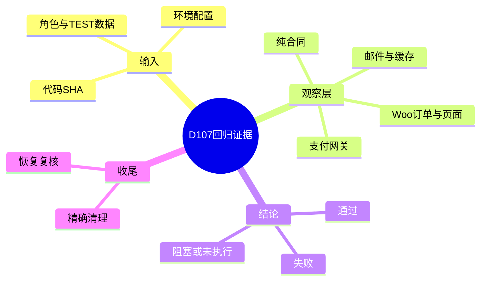
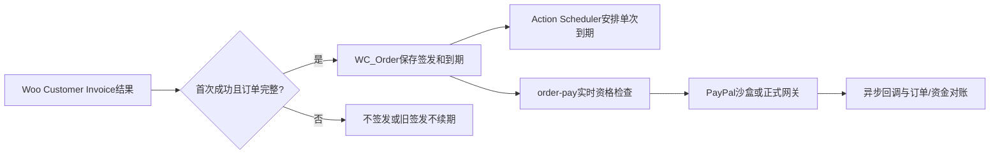

# Day107 WordPress实战：回归证据分层与WooCommerce状态真相

## 相关笔记

- 学习索引：[[WordPress实战笔记索引]]
- 对应项目与执行包：[[../Day107-系统回归准备与执行包]]
- 前置学习：[[Day75-WooCommerce报价过期与订单生命周期]]、[[Day79-WooCommerce账户身份与订单归属]]、[[Day77-WordPress事务邮件链与可观察性]]
- D108及系统回归学习笔记待实际执行后建立；本篇不预写其结果。

## 今日学习成果

- [x] 能解释为什么“纯合同通过”“真实Woo订单正确”“SMTP接受”“网关收款”“目标缓存安全”是五种不同证据。
- [x] 能从首次付款邮件成功回调追到Woo订单meta和Action Scheduler，再指出72小时实时守卫与晚到网关回调的不同责任。
- [x] 能为每条回归结果写出代码SHA、环境、TEST数据、角色/会话、预期/实际与恢复状态。

## 真实项目场景

D74/D86已有主线合成证据，D81/D82与D88还在源分支，D87运行改动未提交。若把各源分支的成功计数相加，就会跳过它们在同一代码和同一配置组合里的冲突。D107因此先建立覆盖和证据结构，在后续合成版本重跑受影响链。本日只运行五个无站点副作用的纯合同，尚未创建订单、发送邮件或访问网关。

## 先建立整体模型

### 一句话模型

每项验收是“同一版本的代码与配置，在指定数据和身份下产生的可观察结果”，并且只能证明观察到的那一层。

### 记忆宫殿与真实机制

把交易想成一条有多个检查点的包裹路线：柜台收件、仓库登记、物流扫描、客户签收各有不同凭据。对应到DentAll，Woo邮件发送结果触发报价签发，WC_Order保存截止与状态，Action Scheduler安排到期处理，页面请求实时守卫拒绝过期付款，PayPal事件才可能证明资金结果；BossMail收件箱才证明外部邮件实际到达。任何一张凭据都不能替下一站签字。

| 类比检查点 | 项目真实机制 | 可证明与不可证明 |
|---|---|---|
| 柜台收件 | Woo `customer_invoice`发送结果 | `success`可触发首次签发；不证明收件箱收到 |
| 仓库登记 | `WC_Order` CRUD/meta中的签发与到期事实 | 可证明站内报价时间/状态；不证明PayPal资金流 |
| 定时扫描 | `dentall_expire_shipping_quote` Action Scheduler任务 | 可证明调度/执行；延迟时仍要靠实时付款守卫 |
| 外部签收 | FluentSMTP、BossMail收件和PayPal网关事件 | SMTP接受≠收件；订单状态≠网关真实成功 |
| 抽检封条 | 源码SHA、环境指纹、夹具manifest和恢复对照 | 防止把旧分支、旧数据或旧缓存的结果移植到新版本 |

## 思维导图



## 请求与生命周期调用链



`D75`纯测试覆盖站内生命周期，但`F→G`必须等真实网关沙盒与独立回调证据。系统回归要分别保存请求状态码、订单事实、计划任务、缓存头、邮件链和网关事件；它们不是单一“测试通过”字段。

## 核心概念卡与项目代码

| 概念 | 实际入口 | 阅读重点 |
|---|---|---|
| 首封成功签发 | `app/public/wp-content/plugins/dentall-core/includes/shipping-quote-lifecycle.php`的`dentall_core_issue_shipping_quote_after_email()` | `! $success`、`customer_invoice`、订单候选/资料/正数Shipping、已签发早退，然后用`WC_Order`保存截止并安排Action |
| 密码底线 | `app/public/wp-content/plugins/dentall-core/includes/customer-account.php`的`validate_password_reset`回调 | 只在Woo真正提交新密码时判长度；`mb_strlen()`要求测试CLI加载`mbstring` |
| 纯合同 | `project-docs/tests/day75-shipping-quote-lifecycle-unit.php`等五个现有入口 | 模拟WordPress/Woo依赖检查分支，不能替代真实浏览器、SMTP、网关或目标缓存 |
| 环境恢复 | [[../Day107-系统回归准备与执行包]]的TEST manifest | 对象ID、类型、标记、原值和最终计数必须逐项对照；不能按旧目录名批量删 |

关键代码节选自当前`main@0d7dc83`，仅展示真实签发边界：

```php
if ( ! $success || 'customer_invoice' !== $email_id ) {
    return;
}
// 实际函数随后还检查WC_Order、候选、状态、资料、运费及是否已签发。
```

不要把这个节选当完整守卫，也不要从本日纯测试推断目标网关已安全处理晚到成功回调。完整实现读取上述源码，付款资格和异步回调仍需在真实沙盒环境验收。

### 本日运行证据与边界

- `php -n project-docs/tests/day72-shipping-quote-php-unit.php`：65/65，exit 0。
- `php -n project-docs/tests/day75-shipping-quote-lifecycle-unit.php`：101/101，exit 0；终端出现预期故障注入文本。
- `php -n project-docs/tests/day79-login-error-unit.php`：16/16，exit 0。
- `php project-docs/tests/day80-password-reset-unit.php`：28/28，exit 0。
- `node project-docs/tests/day72-shipping-quote-unit.mjs`：46/46，exit 0。
- D80首次误用`php -n`导致`mb_strlen()`缺失、exit 1；恢复正常PHP配置后通过。此事说明测试运行时也是证据前置，不说明运行代码有新缺陷。

## 职责边界与站点影响

PHP纯合同只覆盖当前源码分支逻辑；真实Woo测试要检查CRUD、HPOS和Action Scheduler；浏览器检查DOM、角色隔离、四宽与缓存；邮件检查从Woo触发至实际收件；支付检查网关事件、金额、订单、库存、优惠券与退款。D107只整理边界与用例，没有变更数据库、URL/SEO、缓存、邮件、物流、支付或部署。

## 动手练习与排错顺序

1. **只读观察：** 在当前仓库定位`dentall_core_issue_shipping_quote_after_email()`，画出成功与未签发分支，再对照D75纯合同断言。
2. **隔离Local练习：** 待合成版本与新TEST库就绪，先记录源码SHA、配置、对象manifest，再执行一张资料不全报价和一张完整报价；不得在共享Local照做。
3. **故障推演：** 设想首次邮件成功但Action延迟、客户在第72小时发起支付、PayPal回调更晚到。分别标出站内实时守卫、网关回调与资金/订单对账的证据；本日结论均为待测。

排错先问“哪个观察层失败”，再核版本与配置，最后核数据和真实输出。看到旧TEST目录、旧端口、旧成功计数时先检查它所属提交；看到SMTP成功先查真实收件；看到订单`processing`先查网关事件；看到Coming Soon响应先确认是否真的进入付款处理器。

## 掌握标准与费曼自测

能独立解释并用一条脱敏证据行证明以下问题，才算掌握；目前答案待本人自测。

1. 为什么D75的101/101不能关闭RSK-043晚到网关回调？
2. 为什么D81/D82源分支213/213不能算当前主线合成版通过？
3. Action Scheduler任务延迟时，哪个机制仍应拒绝过期付款？
4. `php -n`下D80失败与业务代码失败如何区分？
5. SMTP接受、客户实际收件和PayPal付款各需要哪一层证据？
6. 为什么清理TEST对象要有ID/标记/前后对照，不能按旧目录或前缀直接删除？

间隔复习：完成D108预回归后回看一次；D113网关/订单联测后用真实沙盒证据修订第1、3、5题。未实施前不把推演写成已通过。

## 变种应用到其他项目

在另一WooCommerce主题中，仍按“源码/配置/数据→纯逻辑→真实订单→外部服务→恢复”分层；Hook和邮件插件名称要从该站实际源码核对。在Shopify或其他平台，寻找对应的订单对象、后台任务、支付事件及邮件投递证据，具体接口与幂等语义待官方资料和环境验证。

## 可复用核心思想

### 跨平台不变量

回归测试的可迁移单位是“输入条件、实际观察和失败恢复”，不是单独的通过计数；异步外部系统必须用其自身事实源对账。

### WordPress/WooCommerce当前实现

Woo CRUD、Action Scheduler、WordPress请求、FluentSMTP/BossMail及PayPal各有职责；站内拒付和邮件日志不能代替支付或真实收件结果。

### Shopify或其他平台的对应机制

同样要辨认页面、订单、异步事件、缓存和恢复的边界；准确API和事件关系待目标平台验证，不在DentAll第一版实施Shopify能力。
