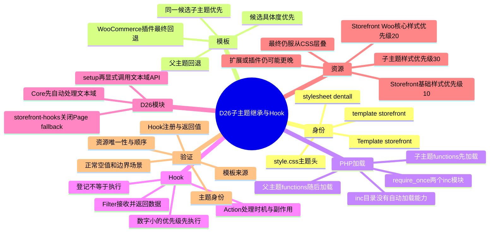
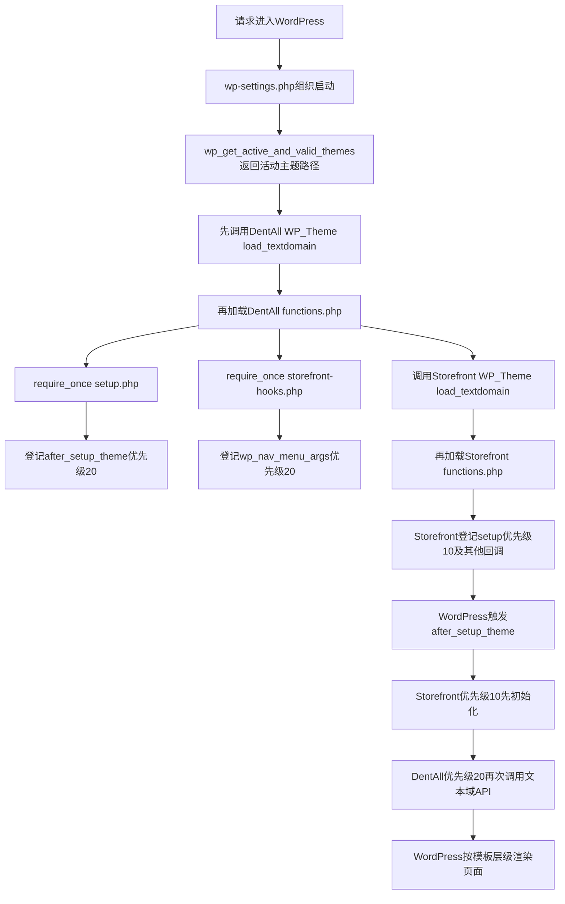
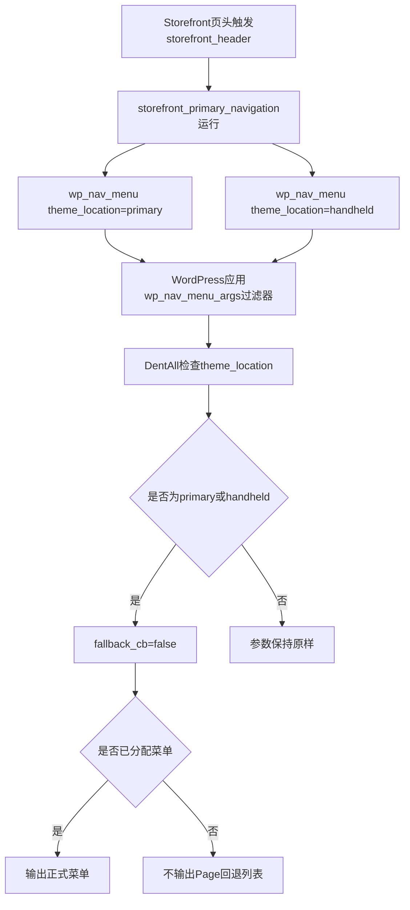

# Day26 WordPress实战：子主题继承与Hook加载机制

## 相关笔记

- 学习索引：[[WordPress实战笔记索引]]
- 对应项目笔记：[[Day26-Storefront子主题骨架]]
- 使用模板：[[WordPress实战学习笔记模板]]
- 前置学习笔记：无，本篇是WordPress实战学习线的第一篇
- 后续学习笔记：D27产生真实Design Token与资源代码后再创建并双向回填

> [!check] 双向链接状态
> [[WordPress实战笔记索引]]已经登记本篇；[[Day26-Storefront子主题骨架]]也已反向链接本篇。这里使用显式Wiki链接，不只依赖Obsidian的Backlinks面板。

## 今日学习成果

- [ ] 能解释经典子主题如何通过`Template: storefront`建立父子关系，并区分模板查找、`functions.php`加载、Hook优先级和CSS层叠四套顺序。
- [ ] 能从DentAll的`functions.php`追到`inc/setup.php`与`inc/storefront-hooks.php`，说明“加载文件、登记回调、触发Hook”分别发生在什么时候。
- [ ] 能独立解释菜单fallback保护的输入、判断、输出、边界和排错方法，并用Local只读命令验证。

勾选条件不是“读完”，而是不看答案也能完成文末费曼测试并给出项目证据。

## 真实项目场景

### Day26解决了什么问题

DentAll原来是一套独立Starter主题，带有自己的`header.php`、`footer.php`、`front-page.php`、`index.php`和整套旧CSS。项目决定以Storefront作为WooCommerce稳定基线后，这些旧文件会继续抢占相应模板位置，使DentAll看似声明了父主题，页面却仍绕开Storefront的结构与Hook。

Day26做了三件最小而关键的事：

1. 在子主题`style.css`声明`Template: storefront`，建立父子身份。
2. 撤掉不合适的旧模板覆盖，恢复Storefront模板、Hook和WooCommerce布局基线。
3. 用两个职责清晰的`inc`模块保留DentAll自己的初始化入口，并阻止Primary/Handheld未分配菜单时自动公开全部已发布Page。

### 本篇学习范围

- 掌握：经典子主题身份、模板查找、父子`functions.php`加载、Action/Filter、优先级、Storefront子样式加载、菜单fallback过滤和模块边界。
- 不展开：D27视觉样式、组件开发、WooCommerce交易逻辑、数据库写入、多语言插件、正式菜单结构和Staging部署。
- 真实入口：[DentAll主题目录](../../../app/public/wp-content/themes/dentall/)。
- 真实代码：`style.css`、`functions.php`、`inc/setup.php`、`inc/storefront-hooks.php`。
- 证据范围：Day26的Local技术验证；不能外推为Staging或Production已通过。

## 先建立整体模型：精装商场记忆宫殿

想象你每天沿固定路线走进一座精装商场。路线上的每个实体对应一个真实WordPress机制。

### 第一站：城市档案局——WordPress Core

档案局先查看商场的产权文件，确认谁是基础建筑、谁是品牌改造层。

真实机制：WordPress读取DentAll的`style.css`主题头。`Template: storefront`让`stylesheet`成为`dentall`，让`template`成为`storefront`，并确认这是子主题。

### 第二站：精装主楼——Storefront父主题

主楼已经提供梁柱、页头、页脚、菜单位置、WooCommerce支持和基础样式。DentAll不需要复制一栋主楼。

真实机制：子主题缺少某个同名模板候选时，WordPress可以使用Storefront文件；Storefront的`functions.php`也会正常加载并注册主题能力。

### 第三站：品牌改造层——DentAll子主题

品牌只改真正需要变化的部分。没有施工图的房间继续使用精装主楼；放入同名施工图后，才优先使用品牌版本。

真实机制：在同一个模板候选名下，WordPress先检查DentAll，再检查Storefront。子主题文件不会在父主题升级时被直接覆盖，但仍要验证父主题结构和Hook是否发生变化。

### 第四站：总机房——`functions.php`

总机自己不装修，也不管理商品。它只接通两个内部部门。

真实机制：WordPress自动加载DentAll的`functions.php`；其中两个`require_once`立即载入`inc/setup.php`和`inc/storefront-hooks.php`。`inc`不是WordPress特殊目录，没有`require_once`就不会自动生效。

### 第五站：开门准备室——`inc/setup.php`

开门准备室保留DentAll自己的主题初始化入口。它不会重复建设主楼已有的电梯和消防系统。

真实机制：WordPress 7.0.4在包含DentAll的`functions.php`以前，已经根据主题头调用`WP_Theme::load_textdomain()`，默认检查DentAll的`/languages`。本文件再通过`add_action()`把`dentall_theme_setup()`登记到`after_setup_theme`优先级20，届时显式重复调用一次`load_child_theme_textdomain()`。所以它在当前版本不是文本域首次或唯一的加载入口；它只是当前代码保留的显式主题setup入口。Storefront已注册菜单与WooCommerce支持，因此DentAll不重复注册这些能力。

### 第六站：导航门卫——`inc/storefront-hooks.php`

门卫只守Primary和Handheld两扇门。门后已经挂好正式指示牌，就照常放行；没有指示牌时，不能临时把商场全部房间名单贴出来。

真实机制：`wp_nav_menu_args`过滤器只把`primary`和`handheld`的`fallback_cb`改为`false`。已分配菜单仍正常输出；位置未分配或找不到菜单对象时，不再回退为全部已发布Page；`secondary`等其他位置保持原参数。WordPress 7.0.4对“已分配但没有菜单项”的location本来就会直接结束，不会走Page fallback，不能把这两种空状态混为一谈。

### 第七站：墙面与装饰——CSS资源

在Storefront三份核心样式这条施工队列里，主楼墙面先施工，WooCommerce核心区域随后施工，DentAll品牌装饰排在这三者后面。但其他扩展和插件仍可能更晚进场。

真实机制：Storefront 4.6.2分别在`wp_enqueue_scripts`优先级10、20、30加载Storefront基础样式、Storefront的WooCommerce核心样式和子主题`style.css`。这只确定三份核心handle之间的enqueue顺序，不代表DentAll是全站最后一份CSS；Storefront集成、WooCommerce扩展或其他插件仍可在更晚优先级加载。浏览器最终结果还受CSS重要性、层叠层、选择器权重、作用域和源码顺序影响。

### 记忆对象与真实机制对照

| 记忆对象 | WordPress真实对象 | 比喻失效的边界 |
|---|---|---|
| 城市档案局 | WordPress Core读取主题头、组织加载与模板查找 | WordPress不会替你判断业务设计是否合理 |
| 精装主楼 | Storefront父主题 | 父主题不是复制进子主题的一份静态代码 |
| 品牌改造层 | DentAll子主题 | 不是PHP类的`extends`，也不会自动继承任意同名函数 |
| 总机房 | `functions.php`及`require_once` | `inc`文件不会因为放进目录就自动加载 |
| 开门准备室 | `after_setup_theme` Action中的DentAll显式setup入口 | 当前WordPress已自动处理主题文本域，不能把本回调说成首次加载 |
| 导航门卫 | `wp_nav_menu_args` Filter | 它不创建菜单、不删除Page，也不修改数据库 |
| 墙面与装饰 | enqueue队列与CSS cascade | 后加载不等于无条件获胜 |

## 思维导图



最重要的主干是：WordPress先确认父子身份并加载两套主题代码，再由模板查找和Hook系统决定每次请求到底使用哪个文件、何时执行哪个回调。

## 请求与生命周期调用链

### 一次正常WordPress请求如何接上DentAll



这里最容易混淆的是：DentAll文件先被读取，但Storefront的`setup()`仍先执行，因为Hook执行看优先级10和20，而不是只看文件读取顺序。

### 页头菜单如何经过DentAll过滤器



## 核心概念卡

| 概念 | 准确定义 | DentAll真实例子 | 常见误区 | 验证方式 |
|---|---|---|---|---|
| `Template`主题头 | 指定经典子主题所依赖的父主题目录名 | `Template: storefront` | 写父主题显示名称，或以为父主题可以不存在 | 回读`get_template()`和`is_child_theme()` |
| Stylesheet | 当前活动主题的样式表/目录身份 | `get_stylesheet()`为`dentall` | 在子主题中把stylesheet当作父主题 | 回读`get_stylesheet_directory()` |
| Template hierarchy | WordPress按请求类型生成由具体到通用的模板候选列表 | 首页、Page、文章会有不同候选 | 以为只要子主题有任意模板，就一定压过父主题更具体的候选 | 用`locate_template()`验证给定候选的子父查找；实际请求另查`template_include` |
| `functions.php`叠加 | 子主题与父主题两份主题函数文件都会加载 | DentAll先加载，Storefront随后加载 | 把它当成普通同名模板覆盖 | 查看`wp-settings.php`与`wp_get_active_and_valid_themes()` |
| `require_once` | 立即包含目标PHP文件，同一请求最多一次；缺失会Fatal | 主入口加载两个`inc`文件 | 以为`inc`目录会被WordPress自动扫描 | 暂不破坏文件；从调用入口追踪即可 |
| Action | 在指定生命周期时机运行回调，通常通过副作用完成工作 | `after_setup_theme`中的DentAll显式setup回调 | 以为`add_action()`当场执行函数，或误以为当前回调首次加载文本域 | 在Hook触发前后检查状态并核对Core自动步骤 |
| Filter | 接收一个值，允许回调修改并把值传回调用链 | `wp_nav_menu_args`修改菜单参数 | 忘记`return`，导致后续拿到错误值 | 对三个位置调用`apply_filters()` |
| Hook优先级 | 同一Hook内数字小的回调先执行 | Storefront 10，DentAll 20 | 与文件加载顺序、模板优先级混为一谈 | `has_action()`或源码检查 |
| `fallback_cb` | `wp_nav_menu()`找不到菜单时调用的后备回调 | Primary/Handheld改为`false` | 以为设为false会删除Page或菜单 | 对比未分配位置、已分配菜单及已分配但无items三种状态 |
| Text domain | 可翻译字符串所属的唯一命名域 | `dentall` | 把文本域登记误认为实现多语言商城，或忽略当前Core已自动加载 | 检查主题头、Core加载时序、翻译函数第二参数与语言文件 |

## 最关键的优先级模型

“谁优先”至少有四种不同问题，必须先问清是哪一种。

| 顺序 | 决定的问题 | D26答案 |
|---|---|---|
| 模板候选顺序 | 当前请求先尝试`front-page.php`、`page.php`还是`index.php` | WordPress按请求类型从更具体到更通用排列 |
| 同一候选的主题顺序 | 同一个候选文件先检查谁 | 先DentAll子主题，再Storefront父主题 |
| PHP文件加载顺序 | 谁的`functions.php`先被读取 | Local WordPress 7.0.4中DentAll先、Storefront后；两者都加载 |
| Hook回调顺序 | Hook触发时谁先执行 | 数字小先执行；Storefront 10先于DentAll 20 |
| CSS层叠顺序 | 浏览器最后采用哪个声明 | enqueue顺序只是因素之一，还要看CSS完整层叠规则 |

> [!important] 一个进阶细节
> WordPress先遍历“模板候选名”，再针对当前候选检查“子主题→父主题”。因此“子主题优先”准确说法是：同一个候选名下子主题优先；它不意味着子主题较通用的`index.php`必然压过父主题更具体的`page.php`。

## 项目实战代码

### 文件一：`style.css`登记主题身份

源文件：[style.css](../../../app/public/wp-content/themes/dentall/style.css)，关键位置为第2～12行。

```css
Theme Name: DentAll
Template: storefront
Version: 0.2.0
Text Domain: dentall
```

- `Theme Name`：WordPress后台显示的子主题名称。
- `Template`：必须匹配`wp-content/themes/storefront`的目录名。
- `Version`：Storefront加载子主题CSS时把它用作资源版本，帮助缓存失效。
- `Text Domain`：与`setup.php`中的`dentall`保持一致；WordPress 7.0.4也会在包含主题`functions.php`前据此自动调用`WP_Theme::load_textdomain()`。

父主题仍必须安装。项目Git不跟踪第三方Storefront源码，所以部署时还要验证目标环境确实存在正确版本的Storefront。

### 文件二：`functions.php`只负责启动模块

源文件：[functions.php](../../../app/public/wp-content/themes/dentall/functions.php)，当前只有6行。

```php
defined( 'ABSPATH' ) || exit;

require_once __DIR__ . '/inc/setup.php';
require_once __DIR__ . '/inc/storefront-hooks.php';
```

逐行理解：

1. `defined( 'ABSPATH' ) || exit;`：确认文件由已经启动的WordPress环境加载。直接访问PHP文件时立即退出。它不是登录认证、Capability或Nonce检查。
2. `__DIR__`：当前`functions.php`所在的服务器绝对目录，不依赖URL和进程当前工作目录。
3. `require_once`：现在就加载文件；同一请求再次遇到时不重复加载。
4. 加载`inc`文件时，PHP会声明函数并执行文件顶层的`add_action()`、`add_filter()`；回调函数本身要等Hook触发才运行。
5. 任一模块漏部署都会让`require_once`Fatal，所以主入口与两个模块必须原子提交、原子部署。

为什么主入口不塞满代码？因为未来查问题时，可以从“主题初始化”或“Storefront行为调整”直接找到责任模块；主入口只保留可一眼审计的加载清单。

### 文件三：`inc/setup.php`登记主题初始化

源文件：[inc/setup.php](../../../app/public/wp-content/themes/dentall/inc/setup.php)，核心为第12～15行。

```php
function dentall_theme_setup() {
	load_child_theme_textdomain( 'dentall', get_stylesheet_directory() . '/languages' );
}
add_action( 'after_setup_theme', 'dentall_theme_setup', 20 );
```

当前WordPress 7.0.4中的完整因果链：

1. WordPress先读取DentAll主题头中的`Text Domain: dentall`，由`WP_Theme::load_textdomain()`自动检查DentAll的`/languages`路径。
2. WordPress随后包含DentAll的`functions.php`，它再加载本文件。
3. PHP声明带项目唯一前缀的`dentall_theme_setup()`，避免与父主题或插件函数重名。
4. `add_action()`把函数登记在`after_setup_theme`，优先级20；此时并未调用函数。
5. WordPress加载完子、父主题函数文件后触发`after_setup_theme`。
6. Storefront的主题和WooCommerce初始化使用默认优先级10，先注册菜单、主题支持与WooCommerce能力。
7. DentAll的20随后运行，再显式调用一次`load_child_theme_textdomain()`。

`get_stylesheet_directory()`在子主题中指向DentAll；若误用`get_template_directory()`，路径会指向Storefront。当前没有正式翻译文件，这段代码不会改变前台内容，也不会自动翻译商品内容、切换币种或实现多语言商城。更重要的是：在WordPress 7.0.4里，它重复Core已经完成的文本域路径登记，并不是首次或唯一入口。主题仍声明最低支持WordPress 6.0；这个显式调用是否需要为较早支持版本保留，必须另做版本验证，本次学习文档不擅自修改已提交主题代码。

### 文件四：`inc/storefront-hooks.php`调整菜单默认行为

源文件：[inc/storefront-hooks.php](../../../app/public/wp-content/themes/dentall/inc/storefront-hooks.php)，核心为第14～26行。

```php
function dentall_disable_page_menu_fallback( $args ) {
	$controlled_locations = array( 'primary', 'handheld' );

	if (
		isset( $args['theme_location'] )
		&& in_array( $args['theme_location'], $controlled_locations, true )
	) {
		$args['fallback_cb'] = false;
	}

	return $args;
}
add_filter( 'wp_nav_menu_args', 'dentall_disable_page_menu_fallback', 20 );
```

逐段理解：

- `$controlled_locations`是白名单，只包含本次确认要保护的两个Storefront菜单位置。
- `isset()`先保证键存在；没有`theme_location`的其他菜单调用不会产生未定义索引问题。
- `in_array(..., true)`启用严格比较，只有完全相同的字符串才命中。
- `fallback_cb=false`关闭WordPress默认的`wp_page_menu`后备回调。
- `return $args`是Filter契约：把处理后的值传回WordPress和后续过滤器。忘记返回会破坏调用链。
- WordPress Core先用`wp_parse_args()`合并默认参数，再调用`wp_nav_menu_args`；所以回调收到完整默认参数是由Core调用位置保证的，与数字20无关。优先级20只决定它相对于同一个Filter上其他回调的执行顺序；当前没有其他DentAll过滤器与它竞争。

三种边界必须一起理解：

| 输入场景 | 过滤后的结果 | 原因 |
|---|---|---|
| `primary`且已有正式菜单 | 正式菜单正常输出 | `fallback_cb`只在找不到菜单时使用 |
| `primary`或`handheld`位置未分配，或找不到菜单对象 | 不输出全部Page列表 | 后备回调已经是`false` |
| location已分配一个存在但无菜单项的菜单 | WordPress 7.0.4直接结束，不调用Page fallback | Core只在没有`theme_location`时才对“空items”走fallback |
| `secondary`或其他位置 | 原参数保持不变 | 不扩大已确认保护范围 |

### 平台与父主题源码证据

以下文件是本地只读核验依据，不属于DentAll自定义代码：

- [WordPress `wp-settings.php`](../../../app/public/wp-settings.php)：第732～749行对每个活动主题先调用`WP_Theme::load_textdomain()`，再包含其`functions.php`，最后触发`after_setup_theme`。
- [WordPress `class-wp-theme.php`](../../../app/public/wp-includes/class-wp-theme.php)：`WP_Theme::load_textdomain()`读取主题头的`TextDomain`和`DomainPath`，未声明`DomainPath`时使用主题`/languages`。
- [WordPress `load.php`](../../../app/public/wp-includes/load.php)：`wp_get_active_and_valid_themes()`先加入stylesheet路径，再加入template路径。
- [WordPress `template.php`](../../../app/public/wp-includes/template.php)：`locate_template()`对每个候选先查子主题路径，再查父主题路径。
- [WordPress `nav-menu-template.php`](../../../app/public/wp-includes/nav-menu-template.php)：`wp_nav_menu()`默认`fallback_cb`是`wp_page_menu`，并在第102行应用`wp_nav_menu_args`。
- [Storefront `class-storefront.php`](../../../app/public/wp-content/themes/storefront/inc/class-storefront.php)：`setup()`登记在`after_setup_theme`默认优先级10；父样式优先级10、子样式优先级30。
- [Storefront WooCommerce集成](../../../app/public/wp-content/themes/storefront/inc/woocommerce/class-storefront-woocommerce.php)：WooCommerce样式优先级20，并注册主题的WooCommerce支持。
- [Storefront模板函数](../../../app/public/wp-content/themes/storefront/inc/storefront-template-functions.php)：分别以`primary`和`handheld`调用`wp_nav_menu()`。
- [WooCommerce模板查找](../../../app/public/wp-content/plugins/woocommerce/includes/wc-core-functions.php)：`wc_locate_template()`先查主题覆盖，最后才用插件默认模板。

这些源码锚点说明一个学习原则：教程只能告诉你常见模式，项目结论必须回到当前安装版本的实际代码和运行结果。

## 为什么拆成两个`inc`文件

`inc`只是项目约定的“被包含模块”目录，不是WordPress自动模块系统。拆分依据是职责，而不是追求文件数量。

| 文件 | 只回答一个问题 | 不应该逐渐塞入什么 |
|---|---|---|
| `functions.php` | 启动时加载哪些主题模块 | 完整页面、长业务函数、行内CSS/JS |
| `inc/setup.php` | DentAll主题自身需要初始化什么 | Storefront页面结构修改、订单和库存业务 |
| `inc/storefront-hooks.php` | DentAll如何调整Storefront行为 | 与主题无关的跨主题业务规则 |

当D27真正出现DentAll独有的CSS/JS资源时，才考虑建立`inc/assets.php`。D26没有真实附加资源，所以不创建空模块，也不重复enqueue Storefront已经自动加载的子主题`style.css`。

## 职责边界

| 层级 | Day26负责什么 | Day26不负责什么 |
|---|---|---|
| WordPress Core | 主题识别、生命周期、模板层级、Hook与菜单API | 不修改核心文件 |
| WooCommerce | 商城模板与业务能力基线 | 不复制插件模板，不直接读写内部表 |
| Storefront父主题 | 页头、页脚、菜单位置、WooCommerce支持、父样式和子样式加载 | 不修改第三方主题源码 |
| DentAll子主题 | 品牌展示层、必要模板/Hook调整、项目样式 | 不承载价格、库存、订单、权限等跨主题规则 |
| `dentall-core` | 与站点长期生命周期一致的跨主题业务规则 | 不放纯视觉覆盖 |
| 数据库 | 保存菜单分配、Page、商品等数据 | 本次Filter不写入数据库 |
| 浏览器 | 解释HTML与CSS并显示最终页面 | 页面看起来正常不等于服务端机制已经验证 |

## Action、Filter与模块加载对照

| 问题 | `after_setup_theme` Action | `wp_nav_menu_args` Filter |
|---|---|---|
| 何时登记 | `setup.php`被`require_once`时 | `storefront-hooks.php`被`require_once`时 |
| 何时执行 | WordPress加载完主题函数文件后 | 每次代码调用`wp_nav_menu()`并处理参数时 |
| 输入 | 当前回调没有参数 | 菜单参数数组`$args` |
| 主要结果 | 再次显式调用DentAll文本域加载API；当前WP 7.0.4已先自动处理 | 修改受控菜单位置的`fallback_cb` |
| 是否必须返回值 | Action回调返回值不会用于改写流程 | 必须返回参数数组 |
| 是否写数据库 | 否 | 否 |
| 当前优先级 | 20 | 20 |

`add_action()`与`add_filter()`在WordPress内部都使用Hook系统，但语义不同：Action表达“到了这个时机，请做一件事”；Filter表达“这里有一个值，请修改后还回来”。看到代码时先判断契约，再判断函数内容。

## 安全、数据与站点影响

| 检查面 | Day26结论 | 学习重点 |
|---|---|---|
| 输入清洗与验证 | 当前两个回调不读取`$_GET`、`$_POST`或REST输入 | 无用户输入不代表以后所有主题函数都不需要验证 |
| Capability | 不适用；没有后台写操作 | 如果未来保存设置，必须单独检查权限 |
| Nonce | 不适用；没有表单或状态变更 | Nonce防CSRF，不能替代Capability |
| 输出转义 | 两个回调都不直接输出HTML | 未来模板输出仍要按文本、属性、URL等上下文转义 |
| 直接访问保护 | 三个PHP入口都有`ABSPATH`保护 | 它只阻止脱离WordPress直接执行，不等于授权系统 |
| 数据库写入 | 无 | 菜单过滤器只修改当前请求内存中的参数 |
| URL与SEO | 不改Slug、Canonical、robots、Sitemap或重定向 | 菜单位置未分配/找不到菜单时减少意外内部链接输出；这是公开导航面变化，但不是索引指令变化 |
| 缓存 | 不新增缓存逻辑 | 部署主题或改变菜单后，页面缓存可能仍需按发布流程刷新 |
| 支付、订单、库存、物流 | 无变更 | Cart只做过只读渲染冒烟，不能推导交易全流程已验证 |
| 部署 | Storefront必须存在；三个PHP文件必须一起部署 | 缺少`inc`文件会Fatal，父主题版本变化要回归 |

## Day26已有运行证据

以下是对应项目笔记中已经完成的D26证据，本篇生成时没有重新修改网站或重复跑交易流程：

| 验证 | 已观察结果 | 能证明什么 | 不能证明什么 |
|---|---|---|---|
| PHP语法 | 三个PHP文件在Local PHP 8.2.29下`php -l`通过 | 当前文件没有PHP语法错误 | 不能证明业务逻辑或所有请求都正确 |
| 主题身份 | `stylesheet=dentall`、`template=storefront`、`is_child_theme=true` | 父子身份成立 | 不能证明每个模板都满足设计 |
| 页面冒烟 | `/`、`/shop/`、`/cart/`、`/my-account/`为HTTP 200 | 代表页面能通过当前继承链渲染 | 不能证明结账、支付、响应式全部通过 |
| 样式顺序 | 父主题、WooCommerce、子主题样式依次出现且各一次 | 当前Storefront会自动且唯一加载子样式 | 不能保证每条DentAll CSS都会覆盖父样式 |
| 菜单边界 | `primary=false`、`handheld=false`、`secondary='wp_page_menu'` | Filter只修改两个白名单位置 | 不能代替正式菜单内容验收 |
| 错误日志窗口 | 正确页面验证窗口增量为0 | 代表路径未新增可见PHP错误 | 不能证明所有环境和所有请求无错误 |

## 动手练习

所有命令只在Local Site Shell中执行，不修改Production。先进入`D:\LocalWP\dentall\app\public`。

### 练习一：只读确认父子身份

```powershell
wp eval 'printf("stylesheet=%s\ntemplate=%s\nchild=%s\n", get_stylesheet(), get_template(), is_child_theme() ? "true" : "false");'
```

预期：

```text
stylesheet=dentall
template=storefront
child=true
```

然后用自己的话解释：为什么`get_stylesheet_directory()`和`get_template_directory()`不能机械互换？

### 练习二：只读观察Hook是否登记

```powershell
wp eval 'printf("setup=%s\nmenu_filter=%s\n", var_export(has_action("after_setup_theme", "dentall_theme_setup"), true), var_export(has_filter("wp_nav_menu_args", "dentall_disable_page_menu_fallback"), true));'
```

注意：在普通WP-CLI `eval`执行时，`after_setup_theme`通常已经触发完毕，但`has_action()`仍能查看回调是否登记以及优先级。目标不是再次触发完整启动流程，而是识别登记状态。

### 练习三：不用改数据库，验证Filter边界

```powershell
wp eval '$cases=array("primary","handheld","secondary"); foreach($cases as $location){$args=apply_filters("wp_nav_menu_args",array("theme_location"=>$location,"fallback_cb"=>"wp_page_menu")); printf("%s=%s\n",$location,var_export($args["fallback_cb"],true));}'
```

预期：

```text
primary=false
handheld=false
secondary='wp_page_menu'
```

### 练习四：观察给定候选数组的子父查找

```powershell
wp eval 'echo locate_template(array("front-page.php","home.php","index.php"));'
```

不要先猜输出。先列出命令中手工给定的三个候选，再解释`locate_template()`为什么返回该路径。这个命令不会读取当前浏览器请求，也不会根据“阅读设置”自动生成候选，因此只能证明“给定数组的查找顺序”，不能证明某个真实页面最终命中了哪个模板。要观察真实请求，应在开发环境通过`template_include`临时诊断或现有调试工具记录最终路径，并在验证后撤掉诊断代码。

## 常见误区与排错顺序

| 现象或误区 | 常见原因 | 推荐检查顺序 | 最小验证 |
|---|---|---|---|
| 后台显示父主题缺失 | `Template`目录名拼错，或目标环境没有Storefront | 主题头→父主题目录→文件权限 | 回读`wp theme list`与目录 |
| 子主题模板改了却没生效 | 改错候选、实际模板来自更具体文件、缓存未刷新 | 请求类型→真实候选列表→运行时最终模板→缓存 | `locate_template()`只验证给定候选；真实请求用`template_include`诊断 |
| 误以为子主题函数覆盖父主题函数 | 把`functions.php`当普通模板 | 看`wp-settings.php`加载→检查同名函数→检查Hook | 确认两份函数文件均加载 |
| `setup.php`里的函数不执行 | 模块未被require、Hook名或时机错误、只登记未触发 | `functions.php`→文件存在→`has_action()`→触发时机 | 查看优先级是否为20 |
| 页面突然Fatal | `require_once`目标漏提交/漏部署，或PHP语法错误 | 错误日志→文件是否存在→`php -l`→部署清单 | 三个文件逐个lint |
| 未分配的菜单位置又显示全部Page | Filter未加载、位置不在白名单、页面缓存仍旧 | Hook登记→`theme_location`→过滤结果→缓存 | 直接`apply_filters()`测试三个位置 |
| 正式菜单也消失 | 菜单没有分配到对应location、菜单不存在或没有菜单项 | 后台分配→`has_nav_menu()`→菜单对象/菜单项→Filter | 区分“未分配”“已分配但无items”和“fallback被关闭” |
| 子主题CSS存在但没覆盖 | 没有enqueue、缓存、选择器权重或规则顺序问题 | Network/HTML→handle→计算样式→权重→缓存 | 确认`storefront-child-style`只出现一次 |
| 翻译没有出现 | 没有语言文件、域名不一致、Locale或路径不匹配 | 当前Locale→字符串域→文件名/路径→加载结果 | 对一个真实可翻译字符串验证 |

排错总原则：先确认“代码有没有进入请求”，再确认“Hook有没有登记和触发”，最后才检查“回调逻辑是否正确”。一上来改CSS或复制模板，通常只会掩盖真正原因。

## 掌握标准

- [ ] 不看笔记，能沿“主题身份→PHP加载→Hook登记→Hook触发→页面输出”讲完一次请求。
- [ ] 能解释为什么子主题`functions.php`不是父主题`functions.php`的替代品。
- [ ] 能解释模板候选具体度与子/父主题查找是两层顺序。
- [ ] 能逐行讲清两个`inc`文件，并指出`inc`目录本身没有魔法。
- [ ] 能说出Action与Filter的返回值契约差异。
- [ ] 能用三个输入证明菜单Filter没有扩大范围。
- [ ] 能区分资源加载顺序与CSS最终获胜规则。
- [ ] 能说明本次对数据、URL/SEO、缓存、交易和部署的真实影响。

当前掌握度：`初识`。完成费曼题且每题至少1分后可改为`能解释`；完成Local练习并能独立排错后再改为`能修改`或`能排错`。

## 费曼测试题（7道）

先合上笔记，把答案讲给“会PHP CRUD、但刚开始系统学习WordPress”的同事。每题必须包含通俗解释、准确术语和DentAll证据。

1. 为什么只写`Template: storefront`还不等于页面已经正确继承Storefront？请从旧Starter模板说明。
2. WordPress寻找一个页面模板时，“模板候选具体度”和“子主题优先”谁先参与？为什么子主题`index.php`不一定压过父主题`page.php`？
3. WordPress 7.0.4在加载DentAll的`functions.php`前还自动做了什么？DentAll和Storefront的`functions.php`谁先加载、是否都加载？为什么Storefront的`setup()`仍可能先于DentAll的`dentall_theme_setup()`执行？
4. `functions.php`中的`ABSPATH`、`__DIR__`和两个`require_once`分别解决什么问题？其中哪一个属于最低限度直接访问保护，哪一个会在漏部署时导致Fatal？
5. 请逐行解释`dentall_disable_page_menu_fallback()`。它为什么既不删除Page，也不会破坏已经分配的正式菜单？
6. 如果Primary位置未分配菜单时重新出现全部Page，你会先收集哪三项证据？为什么不应该第一步就复制Storefront的`header.php`？
7. 把这套方案迁移到另一个父主题或Shopify项目时，哪些原则可以复用，哪些WordPress/Storefront机制必须重新验证？

<details>
<summary>完成口述后再展开参考答案</summary>

### 参考答案一

`Template`只建立父子身份。旧DentAll若仍保留同名模板覆盖，WordPress会在相应候选下优先使用子主题文件，页面仍可能绕开Storefront结构；所以Day26还删除了不合适的`header.php`、`footer.php`、`front-page.php`和`index.php`，并通过页面与HTML标记验证继承链。

### 参考答案二

WordPress先生成由具体到通用的候选列表，再对当前候选调用`locate_template()`，依次检查子主题和父主题。因此它可能先命中父主题更具体的`page.php`，之后才轮得到较通用的`index.php`；“子主题优先”只表示同一候选名下的主题目录顺序。

### 参考答案三

Local WordPress 7.0.4遍历活动主题时，会先对当前主题调用`WP_Theme::load_textdomain()`，再包含该主题的`functions.php`；路径顺序是DentAll子主题后接Storefront父主题，因此两份函数文件都会执行。DentAll的setup回调不是首次文本域加载。文件读取时只登记Hook，`after_setup_theme`触发后按优先级运行：Storefront默认10，DentAll 20，所以Storefront回调先执行。

### 参考答案四

`ABSPATH`确认文件处于已启动WordPress环境，直接请求文件时退出；它不是用户权限。`__DIR__`稳定得到当前文件目录。`require_once`立即加载两个模块并避免同一请求重复包含；目标文件缺失或无法加载会Fatal，所以三个文件必须原子部署。

### 参考答案五

函数接收菜单参数，建立`primary`和`handheld`白名单，先用`isset()`确认位置存在，再以严格`in_array()`判断；命中后只把当前请求参数中的`fallback_cb`设为`false`，最后返回参数。它不调用数据库写API，也不修改Page；已有正式菜单时根本不会使用fallback，所以正式菜单继续输出。

### 参考答案六

先确认模块与Filter是否登记；再检查本次`wp_nav_menu()`的`theme_location`和过滤后的`fallback_cb`；最后检查是否命中页面缓存或部署了旧文件。复制`header.php`会扩大模板覆盖面、切断父主题更新路径，而且没有先证明问题在模板结构。

### 参考答案七

可复用的是最小覆盖、职责分层、扩展点优先、真实源码验证、正常/空/错误边界和可回滚部署。必须重新验证的是父主题目录名、模板候选、Hook名称、资源加载方式、菜单位置和平台发布模型。Shopify没有理由被假设为WordPress经典子主题机制的一一对应物，具体扩展与继承方式应查当前官方机制，当前标记为待验证。

</details>

### 自测评分

每题按以下标准打分：

| 分数 | 标准 |
|---:|---|
| 0 | 无法解释，或只有猜测 |
| 1 | 定义大致正确，但缺少因果、边界或项目证据 |
| 2 | 通俗解释、准确机制、DentAll证据和失败边界都清楚 |

总分：`____ / 14`。

- 12～14：可以进入Local变种练习。
- 8～11：回看得分为1的章节，再重新口述。
- 0～7：先重画思维导图和两张调用链，不急着背函数。
- 任何0分题：暂不提升YAML中的`掌握度`。

## 间隔复习记录

| 复习节点 | 计划日期 | 完成 | 复习方式 | 暴露的问题 |
|---|---|---|---|---|
| D+1 | 2026-08-25 | [ ] | 不看笔记重画生命周期，并答1～4题 | 待记录 |
| D+3 | 2026-08-27 | [ ] | 运行三个只读命令，并答5～7题 | 待记录 |
| D+7 | 2026-08-31 | [ ] | 从一个故障现象独立写排错顺序 | 待记录 |
| D+14 | 2026-09-07 | [ ] | 用另一个父主题做纸面迁移分析 | 待记录 |

## 收尾总结

- 今天真正建立的是一条完整因果链：`Template`确认父子身份，WordPress加载子父两份主题代码，`functions.php`加载职责模块，模块登记Hook，Hook在正确时机修改行为，模板和资源最终形成页面。
- 最容易混淆的是四种顺序：模板候选、子父目录、PHP文件加载、Hook回调优先级；CSS还有自己独立的层叠规则。
- 两个`inc`文件之所以有用，不是因为文件多，而是因为主题自身初始化与父主题行为调整拥有不同职责和排错入口。
- Day26没有增加业务功能或交易逻辑。它先把可维护边界建稳，为D27以后写视觉代码留下清晰入口。
- 下次看到WordPress代码时，先问五件事：谁加载它、何时登记、何时触发、输入输出是什么、如何观察证据。

## 后续如何向AI高效提问

### 高效提问公式

`真实环境 + 明确问题 + 真实入口 + 最小代码 + 预期/实际证据 + 已尝试内容 + 风险边界 + 希望的回答结构`

不要只问：“为什么子主题不生效？”这会迫使AI猜测父主题、模板、Hook、缓存和环境。

### 针对Day26的代码理解提示词

```text
你是我的WordPress实战教练，请只根据我提供的版本、文件和证据分析，并区分“已确认事实、合理推断、待验证项”。

环境：WordPress 7.0.4、WooCommerce 11.0.0、Storefront 4.6.2、DentAll子主题0.2.0，Local。
目标：理解经典子主题继承、functions.php加载与Hook优先级。
真实入口：
- wp-content/themes/dentall/style.css
- wp-content/themes/dentall/functions.php
- wp-content/themes/dentall/inc/setup.php
- wp-content/themes/dentall/inc/storefront-hooks.php
我的当前解释：[先用自己的话填写]
我不确定的点：[填写一个具体问题]
已有证据：[WP-CLI输出、模板路径、Hook优先级或页面现象]

请按以下顺序回答：
1. 先检查我的因果链哪里正确、哪里混淆；
2. 区分模板候选顺序、子父目录顺序、functions.php加载顺序和Hook优先级；
3. 用最小真实代码解释，不虚构项目文件；
4. 给出一个只读验证步骤和预期结果；
5. 说明该验证能证明什么、不能证明什么；
6. 最后给我5道费曼追问题，先不要给答案。

边界：不修改WordPress、WooCommerce或Storefront核心；不写数据库；不触碰Staging/Production。
```

### 针对“代码没生效”的排错提示词

```text
请帮我排查一个WordPress子主题问题，先缩小原因，不要直接建议复制整份父主题模板或大规模重构。

预期：[哪一个页面、Hook或菜单应该怎样]
实际：[浏览器、HTML、日志或WP-CLI观察到了什么]
复现步骤：[最短步骤]
环境与版本：[填写]
实际命中的模板路径：[填写或标记未知]
Hook登记与优先级：[填写has_action/has_filter结果]
最小相关代码：[只贴相关函数]
已尝试：[填写]

请输出：
1. 按概率和风险排序的原因；
2. 每个原因对应的最小只读检查；
3. 只有确认原因后才给最小修复候选；
4. 验证、缓存处理和回滚步骤；
5. 对数据、URL/SEO、缓存、交易和部署的影响。
```

### 判断AI答案是否可靠

- 是否引用了当前项目真实文件或你提供的最小代码，而不是凭空补全架构？
- 是否区分“WordPress通用机制”“Storefront特定行为”和“DentAll项目决定”？
- 是否把Action、Filter、模板层级、CSS层叠混成一个“优先级”？
- 是否先给可观察的验证，再给修改方案？
- 是否说明版本、缓存、数据与回滚边界？
- 涉及当前版本或其他平台时，是否建议核对官方文档/源码，并标明未验证推断？

AI答案不是验收证据。最终仍要回到源码、Hook状态、实际模板路径、HTML、日志和Local复演。

## 变种应用到其他项目

| 新场景 | 可直接迁移的原则 | 必须重新验证的实现 | 最小验证 |
|---|---|---|---|
| 另一个Storefront子主题 | 最小覆盖、模块职责、Hook优先、原子部署 | 项目白名单、菜单与业务目标 | 回读主题身份、Hook和页面矩阵 |
| 使用其他经典父主题 | 同一候选下子主题优先，`functions.php`叠加 | 父主题Hook、菜单位置、是否自动加载子CSS | 读父主题源码并检查最终HTML资源 |
| 完全独立的经典主题 | 请求生命周期、Hook契约与职责边界 | 不再有父主题回退；`template`与`stylesheet`通常相同 | 回读主题身份与模板路径 |
| WordPress区块主题 | 最小覆盖、设计Token集中治理、版本验证 | `theme.json`、区块模板与Site Editor行为 | 按当前WordPress版本核对模板来源 |
| 独立插件实现业务规则 | Action/Filter、前缀、安全与测试原则 | 加载入口从主题变为插件，生命周期应跨主题 | 切换主题后验证规则仍存在 |
| Shopify或其他平台 | 基础平台、项目扩展、必要覆盖三层；升级与回滚边界 | WordPress经典子主题、PHP Hook和Storefront菜单机制不能直接套用 | 查当前官方机制并做独立开发店实验，当前待验证 |

### 变种推理方法

迁移到新项目时，依次回答：

1. 原始业务问题还存在吗？例如“未配置导航时是否会公开不该展示的页面”。
2. 谁是平台基线、谁是项目扩展、谁拥有业务数据？
3. 新平台提供什么扩展点？是否真的需要复制/覆盖模板？
4. 加载、执行、渲染、资源和发布分别有什么顺序？
5. 正常、空、错误、升级和回滚状态怎样验证？

只有第1、2、5项常常是跨平台不变量；具体文件名、Hook和目录通常都需要重查。

## 可复用核心思想

### 跨平台不变量

- 继承型或扩展型架构先分清“平台基线、项目扩展、必要覆盖”。覆盖越接近底层模板，升级与回归成本通常越高。
- 阅读框架代码要拆成“文件何时加载、回调何时登记、Hook何时触发、数据怎样流动、结果如何验证”，不能只逐行翻译语法。
- 空状态是安全和信息架构的一部分。默认回退若会公开未批准内容，应使用白名单和fail-closed边界，同时保留显式配置后的正常路径。
- 模块拆分的价值来自职责和故障定位，不来自文件数量；没有真实职责的空抽象同样增加维护成本。

### WordPress/WooCommerce当前实现

- 经典子主题用`Template`主题头建立父子关系；模板查找先看候选具体度，再在同一候选下查子主题与父主题。
- 子、父主题的`functions.php`都会加载；Hook实际顺序由优先级决定。Action强调时机和副作用，Filter必须返回处理后的值。
- Storefront 4.6.2会在Storefront基础样式与其WooCommerce核心样式之后，以优先级30自动enqueue子主题`style.css`，所以DentAll不重复加载；这只是三份核心handle的相对顺序，不代表子主题CSS在全站最后，且不能机械推广到所有父主题。
- WooCommerce模板覆盖仍应作为扩展点不足后的选择，并记录模板版本与升级回归责任。

### Shopify或其他平台的对应机制

- 可迁移的是基础主题升级边界、项目扩展职责、资源唯一加载、空状态保护和可回滚发布。
- WordPress的`Template`主题头、PHP模板层级、`functions.php`叠加与Hook API不是跨平台通则。
- Shopify或其他平台的具体主题继承、扩展点和发布机制尚未在DentAll验证，必须按当前官方资料与独立环境实验确认，不能假设一一对应。
