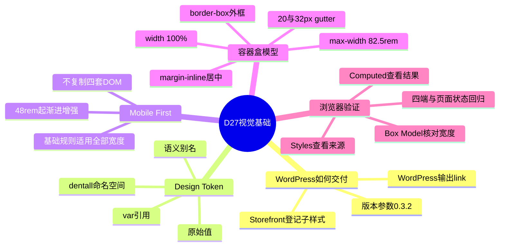
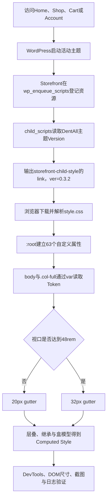

# Day27 WordPress实战：Design Token、CSS自定义属性与Mobile First容器

## 相关笔记

- 学习索引：[[WordPress实战笔记索引]]
- 对应项目笔记：[[Day27-设计证据与Design-Token]]
- 使用模板：[[WordPress实战学习笔记模板]]
- 前置学习笔记：[[Day26-子主题继承与Hook加载机制]]
- 后续学习笔记：[[Day28-基础控件状态与CSS级联]]

> [!check] 双向链接状态
> 本篇已登记到[[WordPress实战笔记索引]]；[[Day27-设计证据与Design-Token]]已反向链接本篇；前置的[[Day26-子主题继承与Hook加载机制]]也已把本篇登记为后续学习笔记。

> [!important] 默认收尾规则
> 本篇是“自Day27起，每个Day在当天收尾时默认生成一篇WordPress实战学习笔记”规则的首次执行。以后项目Day笔记负责交付与证据，学习笔记负责把当天真实工作转化为能解释、能修改、能验证、能排错的知识；D1～D25不自动追溯补写。

## 今日学习成果

- [ ] 能解释CSS自定义属性为什么必须以`--`开头，并区分原始Token、语义Token、`var()`引用和最终CSS属性。
- [ ] 能逐行解释DentAll的`body`、`.col-full`和`@media (min-width: 48rem)`，算出1320px外框、20/32px gutter与可用内容宽的关系。
- [ ] 能用Chrome DevTools判断一个样式应该改Token、公共组件还是局部规则，并在390、768、1024、1440四个验证宽度完成回归。

勾选条件不是“读完笔记”，而是能够合上笔记完成文末费曼测试，并用当前DentAll代码或浏览器证据证明答案。

## 真实项目场景

### Day27解决了什么问题

Day26只建立了Storefront父主题与DentAll子主题的可靠继承边界。到了Day27，如果直接从Header、商品卡或首页某个局部开始写颜色、间距和宽度，后面很容易出现同一种蓝色散落十几次、四个设备复制四套规则、设计稿一变就到处搜索替换的问题。

Day27没有急着做完整页面，而是先完成三层基础：

1. 在现有子主题`style.css`建立63个带`--dentall-*`前缀的Design Token。
2. 只把最小正文排版映射到`body`，避免一次覆盖Storefront和WooCommerce过多公共行为。
3. 用一个Mobile First的`.col-full`规则和一个`min-width`媒体查询，建立1320px外框上限、20px手机gutter和32px宽屏gutter。

这让后续页面共用一套语义化DOM和一套从小到大增强的CSS，而不是为手机、平板竖屏、平板横屏和PC复制四份页面。

### 本篇学习范围

- 掌握：CSS自定义属性、Design Token分层、`var()`、继承与层叠、`rem`、盒模型、逻辑属性、Mobile First媒体查询、Storefront子样式加载和DevTools定位流程。
- 明确不展开：D28标题/链接/按钮/表单/Focus实现，D29商品卡，D31 Header，完整首页、Cart、Account、Checkout与交易逻辑。
- 真实入口：[DentAll `style.css`](../../../app/public/wp-content/themes/dentall/style.css)。
- 平台加载证据：[Storefront `class-storefront.php`](../../../app/public/wp-content/themes/storefront/inc/class-storefront.php)。
- 验证范围：Day27 Local技术验证；不外推为Staging或Production已经部署和验收。

## 先建立整体模型：装修材料库与可伸缩展厅

想象DentAll是一座要持续装修的商城。设计稿不是让每个施工队各自买材料，而是先建一个统一材料库，再规定不同区域如何取用。

### 第一站：原始材料架

架子上只写材料本身，例如“深海军蓝950”“蓝色600”“间距24”。它们不说明一定用在哪里。

真实机制：`--dentall-navy-950`、`--dentall-blue-600`和`--dentall-space-24`是项目约定的原始Token。浏览器只把它们当CSS自定义属性，不知道“品牌”“按钮”或“间距系统”的业务含义。

### 第二站：用途标签台

同一种材料可以贴上“品牌色”“操作色”“正文色”等用途标签。将来只想改变按钮用途时，调整用途标签，不一定改动整批原料。

真实机制：`--dentall-color-action: var(--dentall-blue-600)`是语义Token。原始Token描述“是什么值”，语义Token描述“为什么使用”。这是DentAll的设计系统约定，不是WordPress提供的特殊语法。

### 第三站：总样板墙

材料库放在所有楼层都能看到的总样板墙上，具体房间从这里取值。

真实机制：`:root`在HTML文档中匹配根元素`html`。当前自定义属性默认向后代继承，因此`body`和页面组件可以通过`var(--dentall-...)`读取它们。

### 第四站：基础装修层

商城先统一最基本的正文颜色、字体、字号和行高，不在同一天把按钮、表单、标题和商品卡全部重装。

真实机制：`body`只映射五项正文基线。更具体的Storefront或WooCommerce规则仍可能覆盖某个后代元素，这正是CSS层叠的正常行为。

### 第五站：可伸缩展厅外框

小场地时展厅占满可用宽度；大场地时最多1320px并自动居中。安全通道算在外框之内，不能把通道加到1320px之外。

真实机制：`.col-full`使用`width: 100%`、`max-width`、`margin-inline: auto`、`padding-inline`和`box-sizing: border-box`。因此1320px是border-box外框上限，不是去掉左右gutter后的内容宽。

### 第六站：宽度闸门

所有场地先按小场地规则施工；宽度达到门槛后，只把确实要变化的安全通道加宽。

真实机制：基础规则先给20px gutter，`@media (min-width: 48rem)`只把gutter改成32px。390、768、1024、1440是验证锚点，不代表必须写四个媒体查询。

### 第七站：临时检修台

工程师可以在现场临时换一张标签、量一次外框，但关掉检修台后临时修改会消失。

真实机制：Chrome DevTools可以查看匹配规则、计算值、盒模型和媒体查询，也可以临时修改Token。最终改动仍必须回到子主题源码，并重新做四端及相关WooCommerce页面回归。

### 比喻对应回真实机制

| 记忆对象 | 真实技术对象 | 不能混淆的边界 |
|---|---|---|
| 原始材料架 | 原始Design Token | 浏览器不知道它是品牌规范，只认识自定义属性和值 |
| 用途标签台 | 语义Design Token | 语义来自项目命名，不是WordPress数据库字段 |
| 总样板墙 | `:root` | `:root`不是全局常量仓库；仍参与CSS层叠与继承 |
| 基础装修层 | `body`基础映射 | `body`规则不会无条件压过所有组件规则 |
| 可伸缩展厅 | `.col-full`容器 | 1320px是当前外框上限，不是内部可用内容宽 |
| 安全通道 | `padding-inline` gutter | padding属于盒模型，不等于容器外部margin |
| 宽度闸门 | `@media (min-width: 48rem)` | 四个验收宽度不等于四个断点 |
| 临时检修台 | Chrome DevTools | 临时修改不是源码、Git提交或部署 |

## 思维导图



最重要的主干是：WordPress只负责把子主题CSS交给浏览器；Token、盒模型、媒体查询和最终覆盖结果都由浏览器CSS引擎按层叠规则计算。

## 请求与样式计算调用链



- 触发条件：浏览器请求一个会加载当前活动主题的前台页面。
- WordPress入口：Storefront 4.6.2把`child_scripts()`挂到`wp_enqueue_scripts`优先级30。
- 资源输出：`storefront-child-style`指向DentAll的`style.css`，版本来自主题头`Version: 0.3.2`。
- CSS输入：主题HTML、Storefront/WooCommerce已有样式、DentAll规则、视口宽度和浏览器初始字体设置。
- 输出：浏览器最终计算出的颜色、字体、外框、padding、内容宽和响应式状态。
- 副作用：没有数据库写入；只改变当前页面的视觉计算结果。
- 可观察证据：Network/页面源码中的样式URL，Elements中的匹配规则，Computed中的宽度与字体，以及四端截图和DOM量测。

## 核心概念卡

| 概念 | 准确定义 | DentAll真实例子 | 常见误区 | 如何验证 |
|---|---|---|---|---|
| CSS自定义属性 | 名称以`--`开头、值由CSS层叠管理的运行时属性 | `--dentall-color-text` | 把它与Design Token完全画等号，或当成PHP/Sass编译期变量 | DevTools查看`:root`与Computed中的解析值 |
| `--`前缀 | CSS语法规定自定义属性名必须以两个连字符开头 | `--dentall-space-24` | 以为双短横线只是DentAll命名喜好 | 将名称去掉`--`会不再是合法自定义属性声明 |
| `dentall-`前缀 | 项目命名空间，用于降低与父主题、插件冲突 | `--dentall-color-action` | 以为浏览器理解`dentall`含义 | 搜索项目定义；浏览器只按完整名称匹配 |
| 原始Token | 保存色值、尺寸等基础输入 | `--dentall-blue-600: #0b63d8` | 在组件中直接把所有用途绑定原始色 | 查看语义别名是否隔离用途 |
| 语义Token | 用用途命名并引用原始Token | `--dentall-color-action` | 改一个用途时直接重写共享原始色 | 沿`var()`链查看最终值 |
| `var()` | 把自定义属性值代入普通CSS声明 | `color: var(--dentall-color-text)` | 只定义Token就以为页面会自动改变 | 查看哪些普通属性真正调用了`var()` |
| `:root` | HTML文档根元素的伪类选择器 | 63个Token集中定义处 | 把它当不受层叠影响的全局常量 | 在后代临时重定义同名Token观察局部覆盖 |
| `rem` | 普通属性中相对根元素字号的长度单位 | `82.5rem`在当前16px根字号下为1320px | 把`rem`永远写死为16px换算 | 查看根字号与Computed结果；不同环境重新量测 |
| Mobile First | 先写适用于小屏和所有屏幕的基础规则，再用`min-width`增强 | 20px基础gutter，48rem起32px | 误以为要先画手机或复制手机DOM | 关闭媒体查询后观察基础规则仍完整工作 |
| `border-box` | 声明宽度包含content、padding和border | 1320px外框内含两侧32px padding | 把1320px当内容区，再额外加64px | DevTools Box Model核对outer与content |
| 逻辑属性 | 按inline/block书写方向表达空间 | `margin-inline`、`padding-inline` | 认为它们只是更短的left/right | 切换书写方向属于进阶验证；当前先看左右等值结果 |
| 验证宽度 | 项目要求回归的代表性视口 | 390、768、1024、1440 | 把每个验证宽度都写成CSS断点 | 搜索当前只有一个媒体查询 |

> [!warning] `rem`的两个计算语境
> 普通声明中的`82.5rem`、`1.25rem`和`2rem`相对页面根元素的计算字号；当前根字号为16px，所以分别得到1320、20和32px。媒体查询中的相对长度按浏览器初始字号语境计算，当前`48rem`对应768px，并不应简单理解为“跟随页面里任意`html { font-size: ... }`声明”。若未来改变根字号、浏览器默认字号、缩放策略，或要求无论环境如何都固定1320个CSS像素，必须分别实测容器和媒体门槛，不能只靠`1rem = 16px`心算沿用。

## 项目实战代码

### 涉及文件

- [DentAll `style.css`](../../../app/public/wp-content/themes/dentall/style.css)：当前全部D27运行代码，保存主题版本、63个Token、正文基线、容器和一个媒体查询。
- [Storefront `class-storefront.php`](../../../app/public/wp-content/themes/storefront/inc/class-storefront.php)：父主题在活动子主题存在时登记并加载`storefront-child-style`。
- [[Day27-设计证据与Design-Token]]：保存设计证据口径、四端量测、状态边界和P2延期项，不由本学习笔记重复承担项目状态职责。

### 入口一：主题版本如何进入资源URL

DentAll `style.css`第2～12行的主题头节选：

```css
Theme Name: DentAll
Template: storefront
Version: 0.3.2
Text Domain: dentall
```

Storefront 4.6.2的真实加载代码节选：

```php
public function child_scripts() {
	if ( is_child_theme() ) {
		$child_theme = wp_get_theme( get_stylesheet() );
		wp_enqueue_style( 'storefront-child-style', get_stylesheet_uri(), array(), $child_theme->get( 'Version' ) );
	}
}
```

逐步理解：

1. `is_child_theme()`确认当前活动主题存在父子关系。
2. `get_stylesheet()`在当前环境返回子主题目录身份`dentall`。
3. `wp_get_theme()`读取DentAll主题头。
4. `get_stylesheet_uri()`得到子主题`style.css`的URL。
5. `Version`成为资源版本参数，所以浏览器看到`style.css?ver=0.3.2`。
6. 版本参数有助于区分旧缓存，但不等于所有页面缓存、CDN或代理都会自动立刻失效；正式部署仍要按缓存流程验证。

Day27没有新建`assets.php`或重复调用`wp_enqueue_style()`，因为Storefront已经为子主题提供了真实且唯一的加载入口。

### 入口二：为什么变量都以`--`开头

真实代码节选：

```css
:root {
	--dentall-blue-600: #0b63d8;
	--dentall-color-action: var(--dentall-blue-600);
	--dentall-color-text: var(--dentall-ink-900);
	--dentall-container-max: 82.5rem;
	--dentall-gutter-mobile: 1.25rem;
	--dentall-gutter-wide: 2rem;
}
```

| 代码 | 表面动作 | 浏览器中的真实作用 | 项目设计意图 |
|---|---|---|---|
| `--dentall-blue-600` | 保存蓝色值 | 声明一个自定义属性 | 原始色板只描述值 |
| `--dentall-color-action` | 引用蓝色 | 在计算时解析另一自定义属性 | 组件依赖“操作色”用途，不锁死具体蓝色名 |
| `--dentall-*` | 统一前缀 | 完整属性名参与区分与匹配 | 避免与Storefront、WooCommerce或插件的通用变量重名 |
| `:root` | 集中声明 | 让后代通常可通过继承读取 | 提供项目级默认值；局部仍可按层叠覆盖 |

如果写成`color: var(--dentall-color-tex)`并且没有该变量与fallback，这个`color`声明会在计算值阶段失效。最小排错方法不是立刻增加`!important`，而是先在DevTools查看变量名、定义来源和解析后的Computed值。

### 入口三：正文基线只做最小映射

```css
body {
	color: var(--dentall-color-text);
	font-family: var(--dentall-font-family-sans);
	font-size: var(--dentall-font-size-base);
	font-weight: var(--dentall-font-weight-regular);
	line-height: var(--dentall-line-height-body);
}
```

- `body`是低复杂度的元素选择器，给可继承的正文属性提供基线。
- 后代若有更具体的Storefront/WooCommerce声明，可以得到不同计算值；这不是Token失效，而是CSS层叠结果。
- `font-family`列出`Source Sans Pro`并不会自行发起字体请求。当前字体请求来自Storefront已有加载路径；D27没有新增字体文件、CDN或网络请求。
- 标题、链接、按钮、表单和Focus没有在本段顺手实现，它们属于D28的独立状态与可访问性范围。

### 入口四：1320px为什么是外框宽

```css
.col-full {
	box-sizing: border-box;
	width: 100%;
	max-width: var(--dentall-container-max);
	margin-inline: auto;
	padding-inline: var(--dentall-gutter-mobile);
}
```

逐行理解：

1. `box-sizing: border-box`：`width`和`max-width`包含左右padding与border。
2. `width: 100%`：容器优先占满父级可用宽度。
3. `max-width: 82.5rem`：在当前16px根字号下，外框最多为1320px。
4. `margin-inline: auto`：当外框比可用宽度窄时，把剩余空间平均分到inline方向两侧，实现居中。
5. `padding-inline`：给内容留出左右gutter；因为使用`border-box`，gutter不会加到1320px之外。

可以用一个公式记忆：

```text
外框宽 = min(父级可用宽, 82.5rem)
内容宽 = 外框宽 - 左gutter - 右gutter - border
```

当前没有额外border，因此在无滚动条、默认16px根字号的理想量测下：

| 可用布局宽 | 外框宽 | 单侧gutter | 内容宽 | 说明 |
|---:|---:|---:|---:|---|
| 390px | 390px | 20px | 350px | 基础Mobile First规则 |
| 768px | 768px | 32px | 704px | 达到48rem，宽屏gutter生效 |
| 1024px | 1024px | 32px | 960px | 没有新增断点，沿用同一规则 |
| 1440px | 1320px | 32px | 1256px | 外框封顶并居中，两侧各60px |

真实页面若出现15px经典滚动条，浏览器布局区可能是375、753、1009或1425px，而不是设备栏里显示的完整视口数字。应以`document.documentElement.clientWidth`和元素`getBoundingClientRect()`为准，不能把滚动条差异误判为容器偏移。

### 入口五：Mobile First只覆盖变化的属性

```css
@media (min-width: 48rem) {
	.col-full {
		padding-inline: var(--dentall-gutter-wide);
	}
}
```

- 媒体查询外的`.col-full`是基础层，对手机、平板和PC都成立。
- 达到门槛后只覆盖真正变化的`padding-inline`，其余四项继续继承基础规则。
- 1024和1200没有新的容器变化，所以不创建空媒体查询，也不复制完全相同的规则。
- 390、768、1024、1440是验收宽度。断点来自布局发生变化的需要，不来自“设备有四种”。
- 标准CSS自定义属性依赖元素的层叠上下文，不能直接把`var(--dentall-breakpoint-*)`可靠地放进媒体查询条件；因此当前保留字面量`48rem`，也没有为凑齐Token而声明一个无法在这里消费的断点变量。

## 当前CSS的层级与可维护性

| 层级 | 当前例子 | 适合调整什么 | 不适合放什么 |
|---|---|---|---|
| 原始Token | `--dentall-blue-600` | 品牌基础色值或尺度输入 | 某个按钮的特殊例外 |
| 语义Token | `--dentall-color-action` | 所有“操作”用途的默认映射 | 只在某页面出现一次的偏移 |
| 全局基线 | `body`、`.col-full` | 全站共同排版和外框行为 | 商品卡、Header的独有结构 |
| 组件规则 | D28以后按钮、表单、商品卡 | 一类可复用组件 | 单个页面的一次性补丁 |
| 页面局部规则 | 尚未进入D27 | 有真实页面差异且无法归入组件的最小变化 | 重复全局Token和公共组件 |

判断顺序：先问“这是值变了、用途变了、组件变了，还是只有当前页面变了”，再选择Token、语义别名、组件或局部规则。不要先根据DevTools里最容易点到的选择器修改。

## Chrome DevTools微调与定位流程

### 第一步：确认加载的是哪份CSS

1. 打开目标页面，按`F12`或`Ctrl + Shift + I`。
2. 在Network筛选`CSS`，确认`/themes/dentall/style.css?ver=0.3.2`只加载一次且状态成功。
3. 如果没有加载，先查活动主题、Storefront子样式enqueue和缓存，不要先提高选择器权重。

### 第二步：从元素反查规则

1. 用元素选择器点中`.col-full`或目标文字。
2. 在Styles面板查看规则来源、媒体查询是否命中、声明是否被划线。
3. 点击`style.css?ver=0.3.2:行号`跳到真实来源。
4. 在Computed面板搜索`width`、`max-width`、`padding-inline`、`box-sizing`、`color`或`font-family`。
5. 展开某个Computed值，查看最终由哪条规则贡献。

### 第三步：临时试验

- 想验证全站共同值：临时修改`:root`中的Token。
- 想验证某类组件：临时修改组件规则，而不是原始Token。
- 想确认局部问题：先在该元素规则临时修改，证明原因后再决定源码归属。
- 切换Device Toolbar，依次输入390、768、1024、1440；同时检查横向滚动、长文本、空状态和Focus等适用状态。

刷新页面后DevTools临时修改通常会消失。确认方案后必须回到子主题源码，更新必要的主题版本，再做相关页面和四端回归。

### 第四步：样式未生效时的检查顺序

```text
CSS请求是否成功
→ 规则是否匹配当前元素
→ 媒体查询是否命中
→ var()名称是否存在并解析成功
→ 是否被继承、权重、重要性或后加载规则覆盖
→ 是否看到旧缓存
→ 修改是否写回正确的子主题源码
```

不要把`!important`当第一步。它可能暂时压住现象，却会增加后续状态覆盖和组件维护成本。

## 职责边界

| 层级 | Day27负责什么 | Day27不负责什么 |
|---|---|---|
| WordPress Core | 识别活动主题并输出已登记资源 | 不理解DentAll的Token语义或设计稿 |
| WooCommerce | 提供Shop、Cart、Account等真实动态页面与状态 | 不负责DentAll品牌视觉决策 |
| Storefront父主题 | 提供结构、基础样式和子样式加载入口 | 不直接修改第三方主题源码 |
| DentAll子主题 | 保存项目级Token、正文基线和展示容器 | 不承载价格、库存、订单、权限等跨主题业务规则 |
| `dentall-core` | 当前无D27职责 | 不为纯CSS创建插件模块 |
| 数据库与媒体 | 本轮不写入 | 不把视觉Token伪装成业务数据字段 |
| 浏览器 | 解析CSS、层叠、布局和显示 | 视觉正确不等于交易、SEO或服务端数据已验收 |
| Chrome DevTools | 观察和临时试验 | 不替代源码、Git、部署与回归证据 |

## 安全、数据与站点影响

| 检查面 | Day27结论 | 学习重点 |
|---|---|---|
| 输入清洗与验证 | 不适用；CSS不读取请求输入 | 未来JS、表单或后台设置仍需单独验证输入 |
| Capability | 不适用；没有后台动作 | 视觉代码不能授予或替代权限 |
| Nonce | 不适用；没有状态变更 | Nonce是服务端防CSRF机制，不属于静态CSS |
| 输出转义 | 当前CSS不输出动态HTML | 未来PHP模板仍要按上下文转义 |
| 数据库写入 | 无 | Token存在文件中，不是数据库配置 |
| URL与SEO | 不改Slug、Canonical、robots、Sitemap、Schema或状态码 | 未来若用CSS隐藏可索引内容，仍会形成SEO与可访问性风险 |
| 可访问性 | 只预留Focus与颜色语义Token，D28尚未完成控件状态 | 有Token不等于对比度、键盘和Focus自动合格 |
| 性能 | 仍为一个子主题CSS请求；当前文件4413字节 | 体积和请求数有实测，但不能宣称对真实性能零影响 |
| 缓存 | 主题版本为0.3.2并进入资源URL | 版本参数有助于失效，不替代页面/CDN缓存验证 |
| 支付、物流、订单、库存 | 无变化 | 四页视觉冒烟不能外推交易流程已通过 |
| 部署 | 仅Local已实现和验证 | Staging/Production主题部署仍需单独授权、缓存与回滚流程 |

## Day27已有运行证据

| 验证 | 已观察结果 | 能证明什么 | 不能证明什么 |
|---|---|---|---|
| 静态结构 | 63个Token、25次`var()`引用、缺失引用0、媒体查询1、`!important` 0 | 当前文件内部引用完整、规则克制 | 不能证明所有未来组件都正确 |
| 文件与响应 | 本地文件和实际HTTP响应均为4413字节，SHA-256一致 | 浏览器拿到的是当前0.3.2文件 | 不能证明外部CDN或Production缓存状态 |
| 四页加载 | Home、Shop、Cart、My Account均加载`style.css?ver=0.3.2` | 当前代表页面进入同一子样式路径 | 不能证明所有插件页和Embed |
| 四端DOM | 16/16没有横向溢出、嵌套`.col-full`或重复ID | 当前容器和gutter在已测状态成立 | Cart仅空态，Account仅登录态，不能外推全流程 |
| 1440容器 | 外框1320px，内部内容1256px | “1320px是border-box外框”语义成立 | 不能证明后续组件不会自行越界 |
| 页面与日志 | 当前验证窗口无新增控制台或服务器错误 | 当前路径没有观察到新增错误 | 不能证明所有环境和全部状态无错误 |

## 动手练习

### 练习一：只读观察Token解析链

1. 打开`/shop/`并选择`body`。
2. 在Computed搜索`color`，确认结果来自`var(--dentall-color-text)`。
3. 回到Styles中的`:root`，沿`--dentall-color-text → --dentall-ink-900 → #071b3e`讲出两层Token链。
4. 记录“声明位置、引用位置、最终计算值”三项，不修改源码。

预期：能区分原始值、语义用途和实际CSS属性，而不是把三者都叫“颜色变量”。

### 练习二：DevTools临时调整手机gutter

1. 将视口设为390px。
2. 在`:root`临时把`--dentall-gutter-mobile`从`1.25rem`改为`1.5rem`。
3. 观察`.col-full`左右padding从20px变为24px，外框仍保持当前可用布局宽，内容宽相应减少8px。无滚动条夹具中外框为390px；当前Shop若出现15px经典滚动条，则`clientWidth`与外框可能为375px，两种结果都符合规则。
4. 切到768px，确认宽屏规则仍读取`--dentall-gutter-wide`，不会被手机Token变化影响。
5. 刷新页面恢复，不修改源码。

这个练习证明语义归属和媒体查询覆盖，不代表要把正式gutter改成24px。

### 练习三：手算并核对盒模型

- 视口：1440px，无滚动条。
- 预期外框：`min(1440, 1320) = 1320px`。
- 预期自动margin：`(1440 - 1320) / 2 = 60px`。
- 预期内容宽：`1320 - 32 - 32 = 1256px`。
- 在DevTools Box Model和`getBoundingClientRect()`核对这四个数字。

### 练习四：故障推演

- 假设症状：把`body`写成`color: var(--dentall-color-tex);`后正文颜色没有变。
- 第一项检查：Styles面板中的声明是否无效，以及`:root`是否存在完全同名Token。
- 原因：CSS自定义属性名按完整名称匹配，拼写错误且没有fallback时，普通属性声明无法得到有效计算值。
- 不推荐的动作：增加`!important`。它不能修复不存在的变量名。
- 恢复：改回`--dentall-color-text`并刷新验证。

## 常见误区与排错顺序

| 现象或误区 | 常见原因 | 推荐检查顺序 | 最小验证 |
|---|---|---|---|
| “只定义Token，页面为什么没变” | 没有普通属性通过`var()`消费它 | Token定义→引用位置→Computed | 搜索`var(--dentall-...)` |
| “改了原始蓝色，很多地方一起变了” | 多个语义Token共享同一原始Token | 原始Token→语义别名→组件使用 | 只临时改目标语义别名对比 |
| “1320px容器怎么只有1256px内容” | 把border-box外框与content box混淆 | `box-sizing`→max-width→padding | DevTools Box Model核对 |
| “1440下没从0开始，是否错位” | max-width封顶后auto margin居中 | clientWidth→outer width→左右margin | 计算`(可用宽-1320)/2` |
| “768附近规则没生效” | 实际布局宽、媒体查询状态或浏览器缩放判断错误 | clientWidth→Media状态→Computed | 在767与768附近分别量测 |
| “CSS加载了但属性被划线” | 更高权重、后加载、内联或重要声明获胜 | 来源→重要性→权重→顺序 | 展开Computed属性来源 |
| “把四个验收宽度写成四个断点” | 把测试矩阵当布局变化点 | 逐宽比较真实变化→只保留必要覆盖 | 搜索媒体查询数量 |
| “DevTools改好了，刷新却消失” | 临时修改未写回源码 | Sources/Styles临时状态→真实文件→Git diff | 回到子主题`style.css`确认 |
| “直接改Storefront更快” | 没有遵守父子主题边界 | 规则来源→子主题可覆盖点→父主题升级风险 | 确认修改目标在DentAll目录 |

排错总原则：先确认资源和规则是否进入当前请求，再看变量解析和媒体查询，最后看层叠与缓存；不要一开始就复制模板、增加选择器层级或使用`!important`。

## 掌握标准

- [ ] 能解释`--`是CSS自定义属性语法要求，`dentall-`才是项目命名空间。
- [ ] 能区分原始Token、语义Token和使用Token的普通CSS属性。
- [ ] 能解释WordPress/Storefront只负责加载CSS，浏览器负责解析和层叠。
- [ ] 能逐行讲清`.col-full`五个声明及1320/1256的关系。
- [ ] 能解释为什么一个基础规则加一个媒体查询可以覆盖四端。
- [ ] 能在DevTools找到样式来源、Computed值、盒模型和媒体查询状态。
- [ ] 能判断微调应该落在Token、组件还是局部规则。
- [ ] 能说明本次对数据、URL/SEO、缓存、交易和部署的真实边界。

当前掌握度：`初识`。费曼题每题至少1分后可改为`能解释`；完成DevTools练习并能独立定位一个覆盖问题后再评估`能修改`或`能排错`。

## 费曼测试题（7道）

先合上笔记，假设你要教一位会PHP CRUD、但前端基础薄弱的同事。答案必须包含通俗解释、准确术语和DentAll真实证据。

1. 为什么`--dentall-color-text`必须以两个短横线开头？两个短横线和`dentall-`分别是谁规定的？
2. `--dentall-blue-600`与`--dentall-color-action`有什么区别？只想改变按钮用途而不改变其他蓝色用途时应先考虑改哪一层？
3. 从浏览器请求`/shop/`开始，讲出`Version: 0.3.2`如何变成样式URL，并说明WordPress和浏览器各自负责什么。
4. 逐行解释`.col-full`。为什么1440px视口下外框是1320px、内容是1256px，而不是1384px？
5. 为什么390、768、1024、1440四端只需要一个当前媒体查询？测试宽度和CSS断点有什么区别？
6. 某个Token已经修改但页面没变化时，你会按什么顺序收集至少五项证据？为什么不先加`!important`？
7. 把这套方法迁移到其他WordPress父主题、区块主题或Shopify时，哪些原则不变，哪些加载与配置机制必须重新验证？

<details>
<summary>完成口述后再展开参考答案</summary>

### 参考答案一

CSS语法要求自定义属性名以`--`开头；没有它就不是自定义属性声明。`dentall-`是项目自己选择的命名空间，用于降低与父主题和插件冲突。浏览器只按完整名称匹配，不理解DentAll业务含义。

### 参考答案二

`--dentall-blue-600`描述原始色值，`--dentall-color-action`描述操作用途并引用原始值。只想改变一种用途时先调整语义Token；修改共享原始色可能让所有引用它的语义一起变化。修改前仍要在DevTools确认真实引用链。

### 参考答案三

Storefront的`child_scripts()`确认当前是子主题，用`wp_get_theme(get_stylesheet())`读取DentAll主题头，再把`get_stylesheet_uri()`与主题`Version`交给`wp_enqueue_style()`。WordPress输出`storefront-child-style`链接和`ver=0.3.2`；浏览器下载CSS，再负责Token解析、继承、层叠、媒体查询和布局。

### 参考答案四

`width:100%`先占满可用宽，`max-width:82.5rem`在当前环境把外框封顶1320px，`margin-inline:auto`分配左右60px，`box-sizing:border-box`让左右32px padding包含在1320px内，所以内容是`1320-64=1256px`。若没有`border-box`，padding可能被加到声明宽度之外。

### 参考答案五

Mobile First基础规则适用于全部宽度，达到48rem后只有gutter从20px变为32px；1024和1440的容器逻辑没有新变化，因此无需为设备名复制规则。验证宽度是测试取样点，断点是布局实际需要变化的条件。

### 参考答案六

依次检查CSS请求和版本、规则是否匹配、媒体查询是否命中、变量名和定义是否存在、Computed解析值、是否被更高重要性/权重/后加载规则覆盖，最后查缓存与源码是否写对位置。`!important`不能修复加载失败、拼写错误或错误媒体条件，还会增加后续状态覆盖成本。

### 参考答案七

可迁移的是Token分层、语义命名、Mobile First、最小覆盖、盒模型量测、真实动态状态回归和DevTools证据链。必须重新验证的是父主题是否自动加载子样式、真实DOM选择器、区块主题的`theme.json`/Global Styles机制、平台设置如何输出CSS变量，以及缓存和发布流程。Shopify具体对应机制在DentAll未验证，不能假设与WordPress一一对应。

</details>

### 自测评分

| 分数 | 标准 |
|---:|---|
| 0 | 无法解释，或只会背属性名 |
| 1 | 定义大致正确，但缺少因果、边界或项目证据 |
| 2 | 通俗解释、准确机制、DentAll证据和失败边界都清楚 |

总分：`____ / 14`。

- 12～14：可以进入DevTools变种练习。
- 8～11：回看得分为1的概念卡和代码段，再重新口述。
- 0～7：先重画加载链和盒模型，不急着背Token列表。
- 任何0分题：暂不提升YAML中的`掌握度`。

## 间隔复习记录

| 复习节点 | 计划日期 | 完成 | 复习方式 | 暴露的问题 |
|---|---|---|---|---|
| D+1 | 2026-08-26 | [ ] | 不看笔记解释三层Token，并手算390与1440容器 | 待记录 |
| D+3 | 2026-08-28 | [ ] | 完成DevTools临时gutter练习并答1～4题 | 待记录 |
| D+7 | 2026-09-01 | [ ] | 从一个“规则未生效”症状独立写排错链 | 待记录 |
| D+14 | 2026-09-08 | [ ] | 对另一个主题做纸面迁移，列出必须重查的加载机制 | 待记录 |

## 收尾总结

- 今天真正建立的是一条完整视觉基础链：Storefront加载子样式，`:root`集中保存原始和语义Token，普通规则通过`var()`消费Token，Mobile First基础规则先覆盖所有宽度，媒体查询只增强真实变化，浏览器最终用层叠和盒模型计算结果。
- 最容易混淆的是四组概念：CSS自定义属性与Design Token、外框与内容宽、验证宽度与断点、资源加载顺序与最终层叠结果。
- `--`是CSS语法，`dentall-`是项目命名空间；Token不会自动改变页面，必须被普通CSS属性使用。
- 1320px是当前已冻结的border-box外框语义；在32px gutter下内容宽为1256px。
- 下次微调先在DevTools收集证据，再判断改Token、公共组件还是局部规则，最后回到子主题源码并做四端回归。
- 下一篇学习笔记：[[Day28-基础控件状态与CSS级联]]。

## 后续如何向AI高效提问

### 针对样式理解的提示词

```text
你是我的WordPress与现代CSS实战教练。请只根据我提供的真实环境、DOM、CSS和Computed证据分析，不要假设不存在的框架或构建链。

环境：WordPress 7.0.4、WooCommerce 11.0.0、Storefront 4.6.2、DentAll子主题0.3.2，Local。
页面与视口：[URL，390/768/1024/1440]
目标：[想理解或微调什么]
真实DOM：[最小相关结构]
真实CSS：[Token、基础规则、媒体查询的最小片段]
Computed证据：[属性、最终值、来源]
我的当前解释：[先写自己的理解]

请按以下顺序回答：
1. 区分已确认事实、合理推断和待验证项；
2. 画出Token定义→语义别名→组件属性→Computed值的链；
3. 解释盒模型、继承、媒体查询和层叠分别起什么作用；
4. 判断应改原始Token、语义Token、公共组件还是页面局部规则；
5. 给出DevTools临时试验、源码修改、四端回归和回滚方法；
6. 说明对可访问性、SEO、缓存和WooCommerce动态状态的边界；
7. 最后给我5道费曼追问题，先不要给答案。

边界：不改WordPress、WooCommerce或Storefront核心；不新增框架；不触碰Staging/Production和业务数据。
```

### 针对“CSS没生效”的排错提示词

```text
请帮我排查一个WordPress子主题CSS问题，先缩小原因，不要直接建议增加!important、复制父主题模板或堆高选择器。

预期：[属性和期望值]
实际：[Computed值和页面现象]
页面/视口/状态：[填写]
样式URL和版本：[填写]
匹配规则及是否被划线：[填写]
Token定义与var()引用：[填写]
媒体查询状态：[填写]
已尝试：[填写]

请输出：资源加载→规则匹配→变量解析→媒体查询→层叠权重→缓存的排查顺序；每一步的最小只读检查；确认原因后的最小修改位置；四端与相关WooCommerce状态的验证及回滚。
```

### 判断AI答案是否可靠

- 是否区分“WordPress/Storefront如何加载CSS”和“浏览器如何计算CSS”？
- 是否把Design Token说明为项目组织方法，而不是WordPress专有API？
- 是否区分原始Token、语义Token和组件规则？
- 是否先问真实DOM、样式来源、Computed值和视口，而不是凭截图猜选择器？
- 是否区分1320px外框与1256px内容宽？
- 是否要求四端和真实WooCommerce状态回归，并说明缓存与回滚？

AI答案不是项目证据。最终仍要回到当前源码、真实DOM、Computed Style、Network、日志和Local复演。

## 变种应用到其他项目

| 新场景 | 可直接迁移的原则 | 必须重新验证的实现 | 最小验证 |
|---|---|---|---|
| 另一个Storefront子主题 | Token分层、项目命名空间、Mobile First、盒模型量测 | 品牌值、容器语义、插件样式与状态 | 读取真实子样式、DOM与四端页面 |
| 使用其他经典父主题 | 最小覆盖、语义Token、DevTools证据链 | 父主题是否自动enqueue子样式、handle和加载顺序 | 查看父主题源码与页面`link` |
| WordPress区块主题 | 语义命名、响应式与可访问性原则 | `theme.json`、Global Styles、区块生成变量和模板机制 | 按当前WordPress版本检查最终CSS和编辑器/前台一致性 |
| 独立插件后台界面 | Token命名空间、组件边界、状态验证 | 资源应按后台页面条件加载，不能污染全站前台 | 查看enqueue条件与目标screen |
| 静态站或其他框架 | CSS变量、盒模型和Mobile First仍成立 | 资源入口、组件作用域、构建与部署机制 | 检查最终HTML/CSS bundle和断点 |
| Shopify或其他平台 | 设计Token、动态内容、响应式和真实状态回归 | Theme settings、Liquid/Section与CSS变量的具体关系，当前待验证 | 查当前官方主题机制并在独立开发环境实验 |

迁移时先保留“用途语义、最小覆盖、真实量测和回滚”，再重新寻找目标平台的样式入口；不要把`style.css`主题头、Storefront handle或`.col-full`选择器当成跨平台标准。

## D31后继纠偏记录（不改写Day27历史）

2026-08-27的[[../Day31-PC公告栏与主页头结构|Day31项目笔记]]与[[Day31-四端设计稿还原与组件拆解]]提供了一个真实的Token演进案例：用户在Header搜索按钮与设计稿同屏对照后确认动作蓝偏浅，0.9.0把原始Token`--dentall-blue-600/700`从`#0b63d8/#0756c9`纠偏为`#003a9f/#002f82`，语义Token名称保持不变。

这次变化说明：

1. 设计Token v1是有版本的最佳当前判断，不是永远不可改变的常量。
2. 修改共享原始Token会影响按钮、链接、Focus、Notice等所有消费者，所以D31做了五页×四宽代表回归，而不是只验搜索按钮。
3. 新Normal/Hover对白色为9.97:1/12.15:1，在项目三种浅表面上的最低值为8.91:1/10.85:1；颜色更深没有破坏既有AA门槛。
4. Day27正文里的旧值、0.3.2和当时哈希仍是历史运行证据。学习时应使用“版本＋日期＋消费链”解释差异，不要把旧段落批量替换成0.9.0并伪造历史。

## 可复用核心思想

### 跨平台不变量

- 设计系统的价值不是“变量越多越专业”，而是让原始值、用途语义、组件规则和局部例外各有稳定职责，从而减少连锁修改和隐性覆盖。
- 响应式设计的核心是同一内容结构在空间变化时渐进调整。测试设备可以很多，断点只应出现在布局真正需要变化的位置。
- 容器验收必须同时说明视口、外框、padding、内容宽、滚动条和盒模型；只说“页面宽1320”会制造长期歧义。
- 微调应形成“观察最终结果→追溯规则来源→临时试验→判断正确层级→修改源码→多状态回归”的闭环。

### WordPress/WooCommerce当前实现

- Storefront 4.6.2在当前经典子主题环境中读取DentAll主题版本，并enqueue单个`storefront-child-style`；WordPress负责资源登记和输出，CSS变量与布局由浏览器解释。
- Day27验收时点的DentAll 0.3.2把63个`--dentall-*`Token、最小`body`映射、`.col-full`基础容器和一个48rem媒体查询放在同一`style.css`，没有新增构建链、字体请求、JS或模板覆盖；当前0.9.0与动作蓝演进见上方D31后继记录。
- WooCommerce页面是动态状态容器。公共CSS必须在Shop、Cart、Account以及以后适用的Notice、缺图、售罄、长文本、错误和交易状态中回归，不能只看首页截图。

### Shopify或其他平台的对应机制

- 可迁移的是Token分层、语义命名、Mobile First、状态覆盖、可访问性和基于真实浏览器证据的调试方法。
- WordPress主题头、Storefront的`wp_enqueue_style()`路径、PHP Hook和`.col-full`都不是跨平台通则。
- Shopify的Theme settings、Liquid/Section如何生成或覆盖CSS变量尚未在DentAll实际验证，当前只作为待验证的知识迁移方向，不能写成DentAll实施范围或假设一一对应。
