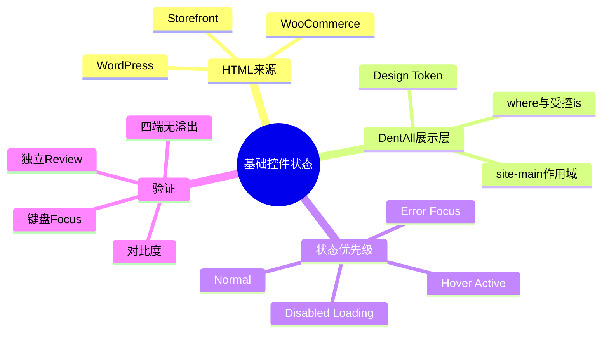
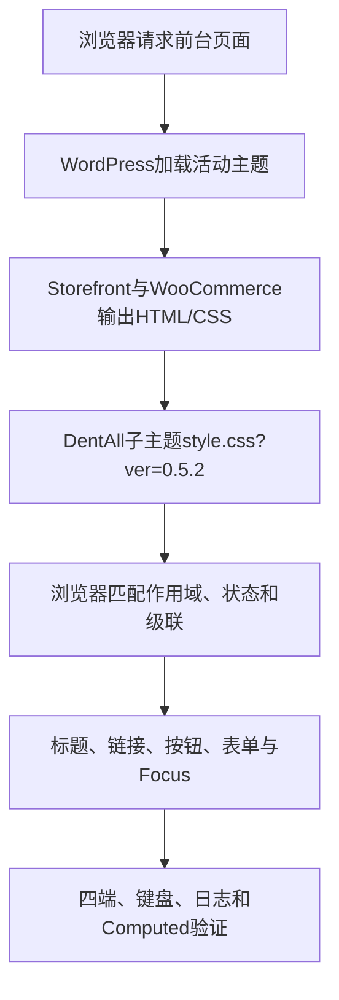

# Day28 WordPress实战：基础控件状态与CSS级联

## 相关笔记

- 学习索引：[[WordPress实战笔记索引]]
- 对应项目笔记：[[../Day28-基础控件与可访问状态|Day28-基础控件与可访问状态]]
- 前置学习笔记：[[Day27-Design-Token与Mobile-First容器]]
- 后续学习笔记：Day29完成后回填

## 今日学习成果

- [x] 能解释WordPress/WooCommerce负责输出真实HTML，子主题CSS只负责展示，不会自动增加校验、Loading或Disabled业务逻辑。
- [x] 能沿`style.css`追踪Token、作用域、状态伪类与父主题规则，判断最终Computed Style由哪条规则获胜。
- [x] 能用静态检查、对比度、真实页面、四端、键盘Focus和独立Review验证最小改动，并说明Local回滚边界。

## 真实项目场景

Day28需要让标题、正文链接、操作按钮、输入控件和键盘Focus形成可复用基线，同时不能提前重做Header、商品卡、通知或交易逻辑。难点不在属性数量，而在Storefront、WooCommerce、Blocks和DentAll规则同时命中时，正常、Hover、Disabled和Error状态必须按正确优先级表现。

### 学习范围

- 掌握：子主题CSS作用域、低权重`:where()`、受控`:is()`、状态优先级、Focus与错误状态、真实页面回归。
- 不展开：JavaScript加载控制、客户端/服务端校验、D29商品卡、D30通知、购物车和结账业务流程。
- 真实入口：`app/public/wp-content/themes/dentall/style.css`与`inc/storefront-hooks.php`。
- 环境边界：只在Local实现和验证；没有部署Staging/Production。

## 先建立整体模型

### 一句话模型

WordPress、WooCommerce和Storefront先输出HTML与父主题样式，DentAll子主题再用受限作用域提供基础视觉，浏览器最终按“重要性→特异性→源码顺序”决定每个状态的计算结果。

### 记忆宫殿

把页面想成商场：WooCommerce提供真实柜台和控件，Storefront给出基础装修，DentAll子主题添加品牌导视；Hover、Disabled、Error像同一柜台上的不同营业牌，规则优先级错误时会同时亮起互相冲突的牌。

| 记忆对象 | 真实技术对象 | 不能混淆的边界 |
|---|---|---|
| 柜台与商品 | WordPress/WooCommerce输出的HTML和业务状态 | CSS不能创造库存、校验或提交结果 |
| 基础装修 | Storefront父主题CSS | 不直接修改第三方主题文件 |
| 品牌导视 | DentAll子主题`style.css` | 只承担展示，不写交易规则 |
| 营业牌 | `:hover`、`:disabled`、`[aria-invalid]`等状态 | 状态存在于DOM后，CSS才负责显示 |

## 思维导图



最重要的主干是：先确认真实状态和作用域，再控制级联，最后读取Computed Style验证，而不是靠增加`!important`碰运气。

## 请求与样式调用链



- 触发条件：访问使用DentAll活动子主题的Local前台页面。
- 输入：父主题/WooCommerce真实DOM、类名、属性和当前交互状态。
- 输出：计算后的视觉，不写数据库、不改变业务动作。
- 可观察证据：样式URL版本、Computed Style、`scrollWidth/clientWidth`、焦点outline和浏览器日志。

## 核心概念卡

| 概念 | 准确定义 | DentAll真实例子 | 常见误区 |
|---|---|---|---|
| 作用域 | 限制规则只影响目标区域 | 大部分控件规则从`.site-main`开始 | 直接全局重写所有`button/input` |
| `:where()` | 参数特异性固定为0的选择器伪类 | 降低辅助状态和组件列表的权重 | 误以为写在后面就一定获胜 |
| `:is()` | 匹配参数列表且取其中最高特异性 | 字段清单只提高到覆盖Storefront输入框所需权重 | 把高权重兼容分支放入列表，连带抬高所有普通分支 |
| `:focus-visible` | 主要在键盘等需要焦点指示时匹配 | 浅色区深蓝outline，深色Header白色outline | 用Hover或阴影代替键盘Focus |
| 视觉错误状态 | 已有错误标记对应的边框和文本表现 | `[aria-invalid="true"]`、`.woocommerce-invalid` | CSS自己判断业务是否有效 |
| Disabled视觉 | 已有禁用语义的不可用表现 | `:disabled`、`.disabled`、`aria-disabled` | 把`aria-disabled`当作自动阻止点击 |

## 项目实战代码

### 涉及文件

- `app/public/wp-content/themes/dentall/style.css`：标题、链接、按钮、表单、错误和Focus展示基线。
- `app/public/wp-content/themes/dentall/inc/storefront-hooks.php`：复用WooCommerce原生`useLabel`输出两处可见排序标签。

### 关键代码片段

源文件：`style.css`。以下精简摘录展示“正常Hover必须排除禁用状态”；真实源码还包含按钮型`input`和Blocks分支：

```css
.site-main :is(
	button,
	.button,
	.added_to_cart,
	.wp-block-button__link
):hover:where(:not(:disabled):not([aria-disabled="true"]):not(.disabled)) {
	border-color: var(--dentall-color-action-hover);
	background-color: var(--dentall-color-action-hover);
}
```

源文件：`style.css`。以下真实片段展示用继承变量只维护一份Focus声明，以及DOM位于Footer、视觉却属于深色Header表面的手机固定栏例外：

```css
.site {
	--dentall-focus-ring-color: var(--dentall-color-focus-on-light);
}

.site .site-header,
.site .site-footer .storefront-handheld-footer-bar {
	--dentall-focus-ring-color: var(--dentall-color-focus-on-dark);
}

.site :where(a:any-link, button, input, select, textarea, summary):focus-visible {
	outline: 3px solid var(--dentall-focus-ring-color);
	outline-offset: 3px;
}
```

这些片段为便于阅读省略同一真实选择器中的少量组件与`tabindex`项；完整事实以源码为准。

### 五个真实排错案例

1. 初版Disabled规则虽然写在Hover之后，但Hover选择器特异性更高，禁用按钮悬停仍变色；修复是把完整Hover条件放进`:where()`并排除禁用状态。
2. 初版错误字段悬停会混入操作蓝边框；修复同样是降低Hover特异性，使后置Error规则稳定获胜。
3. Cart的Block推荐按钮命中Storefront更具体的灰底、零圆角和`border: 0`；修复是在真实Block作用域内完整声明1px实线边框，而不是只改`border-color`。
4. 登录态Header搜索初测仍显示父主题紫色Focus；提高真实结构作用域后，独立Review又发现手机固定栏虽嵌在Footer DOM中却使用深色Header背景，因此增加后置白色Focus例外。
5. 字段列表最初全部放进`:where()`，导致真实Simple数量框仍被Storefront的`input[type="number"]`灰底、无边框规则覆盖；字段列表改为受控`:is()`后，子主题白底、1px边框和6px圆角才真正进入Computed Style。

这证明“源码顺序”只在重要性和特异性相同时决定结果。

390px真实键盘夹具加载Storefront与DentAll 0.5.0样式后，Header链接/搜索和手机固定栏为白色3px outline，正文链接/输入与普通Footer为深蓝3px outline，全部使用3px offset。浏览器连接超时被单独记录为工具限制，没有冒充站点错误。

维护性收口后的DentAll 0.5.2继续保留同一Focus输出，只把四份目标清单合并为一个继承变量规则。最终真实Simple数量框为白底、1px边框、6px圆角和44px高；当前页面没有自然Readonly/Error/Loading状态，最新键盘Tab自动复测又遇到连接超时，因此这些状态只记录静态级联证据，不伪报为真实业务流程通过。

### 为什么“更短”不一定更易维护

- `@custom-selector`能让别名看起来很整齐，但它仍位于CSS Extensions工作草案中，项目又没有PostCSS等预处理链；直接放进运行文件会把几行重复换成浏览器兼容与构建维护成本，DentAll第一版不采用。[CSSWG工作草案](https://drafts.csswg.org/css-extensions/)
- `:is()`不是无成本缩写：整个伪类采用参数中最高的特异性。若把Storefront Block高权重兼容选择器与普通`.button`放进同一个`:is()`，所有普通按钮都会被一起抬高。DentAll只在权重可控的按钮/字段清单中使用`:is()`，Block兼容分支保持为独立逗号分支。[MDN特异性说明](https://developer.mozilla.org/en-US/docs/Web/CSS/Guides/Cascade/Specificity)
- 重复文本本身不是唯一坏味道；更重要的是声明是否重复、状态是否冲突、修改入口是否可预测。最终保留一个运行时CSS、一个Focus目标清单和每种按钮状态一份声明。

## 职责边界

| 层级 | 本主题负责什么 | 不应该负责什么 |
|---|---|---|
| WordPress Core | 活动主题和资源加载 | 不理解DentAll控件视觉 |
| WooCommerce | 商品、表单、Variation和状态语义 | 不由DentAll CSS重写交易事实 |
| Storefront | 基础DOM与父主题样式 | 不直接修改其核心文件 |
| DentAll子主题 | 低权重视觉和响应式基线 | 不实现校验、库存、AJAX和订单逻辑 |
| `dentall-core` | 当前无C4/C5新增职责 | 不为纯CSS创建模块 |
| 浏览器 | 匹配选择器、计算级联和绘制Focus | 页面显示不能证明服务端交易正确 |

## 安全、数据与站点影响

| 检查面 | Day28结论 | 证据或边界 |
|---|---|---|
| 输入、Capability、Nonce | 不适用 | 没有新增提交或后台动作 |
| 数据库 | 无写入 | 只修改主题文件与文档 |
| URL与SEO | 无结构变化 | 不改Slug、Meta、Canonical、Schema、robots或Sitemap |
| 缓存 | 主题版本更新为0.5.2 | 仍为原单个CSS请求；只更新资源缓存键 |
| 性能 | CSS为13168字节，无新请求、查询或脚本 | gzip模拟约3943字节；未做Core Web Vitals前后量测，不宣称提升或零影响 |
| 支付、物流、订单 | 无变化 | 未启用支付或修改交易数据 |
| 部署与回滚 | 仅Local | 回滚当前CSS差异即可；Staging/Production未变 |

## 动手练习

### 练习一：只读观察

在Shop选择一个按钮，依次查看Normal、Hover和Disabled的Computed `background-color`、`opacity`、`cursor`及规则来源；预期Disabled不会因Hover切换为操作Hover色。

### 练习二：Local最小改动

在DevTools临时把`--dentall-radius-md`改为更小值，确认只改变引用该Token的组件形状；刷新恢复，再判断正式调整应修改Token还是局部规则。不要把临时改动当源码交付。

### 练习三：故障推演

- 症状：错误字段鼠标经过后边框变蓝。
- 第一检查：Computed中`border-color`获胜规则及两个选择器的特异性。
- 其次：确认`aria-invalid`或`.woocommerce-invalid`是否真实存在。
- 最小修复：降低一般Hover权重或排除Error，不用`!important`叠加冲突。

## 常见误区与排错顺序

| 现象 | 可能原因 | 检查顺序 | 最小验证 |
|---|---|---|---|
| Disabled仍像可点击 | Hover没有排除禁用状态 | DOM状态→匹配规则→特异性→顺序 | DevTools强制`:hover`看Computed |
| Error悬停混色 | 一般Hover权重高于Error | 错误标记→Hover匹配→边框来源 | 比较Normal/Hover边框来源 |
| Focus颜色不对 | 视觉表面与DOM归属不一致，或父主题规则覆盖 | activeElement→视觉背景→`:focus-visible`→outline来源 | 用Tab进入Header、正文、Footer与手机固定栏 |
| 排序框被拉满 | 全宽规则作用域过宽 | 父容器类→width来源→组件规则 | 确认排序不在`.form-row` |
| CSS改了但页面旧 | 版本、缓存或错误主题 | URL版本→HTTP响应→Computed | 确认`style.css?ver=0.5.2` |

## 掌握标准与费曼测试

- [ ] 能解释为什么`:where()`能降低级联维护成本。
- [ ] 能解释`:is()`为什么会采用列表中的最高特异性，并判断何时应把高权重分支单列。
- [ ] 能区分`:disabled`、`.disabled`和`aria-disabled`的语义与行为边界。
- [ ] 能用键盘验证浅色区与深色Header的Focus。
- [ ] 能说明CSS错误样式为什么不能替代服务端校验。
- [ ] 能从Computed Style定位一次状态覆盖问题并给出最小修复。

当前掌握度：`初识`。本笔记只保留Day28最值得迁移的状态级联知识，不要求背诵全部选择器。

1. 为什么把规则写在文件后面仍可能无法覆盖前面的规则？
2. `aria-disabled="true"`为什么不能自动阻止链接执行？
3. 为什么错误状态既需要程序化标记，也需要稳定的视觉识别？
4. 从页面请求开始，讲出WordPress、Storefront、DentAll子主题和浏览器各自的职责。
5. 把同一控件基线迁移到其他主题或Shopify时，哪些原则不变，哪些选择器和加载机制必须重查？

### 自测评分

每题0～2分，总分`____ / 10`；存在0分题时不提升掌握度。

## 间隔复习记录

| 复习节点 | 计划日期 | 完成 | 练习 |
|---|---|---|---|
| D+1 | 2026-08-26 | [ ] | 口述状态优先级并检查一个Disabled按钮 |
| D+3 | 2026-08-28 | [ ] | 用Computed解释一个Hover/Error覆盖 |
| D+7 | 2026-09-01 | [ ] | 在其他表单上纸面迁移选择器边界 |
| D+14 | 2026-09-08 | [ ] | 复核Focus、错误与平台差异 |

## 收尾总结

- 真正需要记住的不是属性表，而是“真实状态→受限作用域→低权重一般规则→后置特殊状态→Computed验证”的因果链。
- WordPress/WooCommerce输出业务语义，子主题只显示语义；CSS不能补齐缺失的权限、校验或交易逻辑。
- 下一篇直接相关学习笔记：Day29完成后回填。

## 变种应用到其他项目

| 场景 | 保持不变的原则 | 必须重新确认 | 最小验证 |
|---|---|---|---|
| 其他Storefront子主题 | 状态优先级、低权重、真实页面回归 | 品牌Token、插件和DOM状态 | 读取父子CSS与Computed |
| 其他经典主题 | 作用域、Focus、非颜色唯一识别 | 父主题选择器和加载顺序 | 真实表单四端测试 |
| WordPress区块主题 | 状态契约和可访问性 | `theme.json`、Global Styles与区块CSS | 编辑器/前台共同验证 |
| Shopify或其他平台 | Normal/Hover/Focus/Disabled/Error状态模型 | 模板、主题设置、CSS入口和发布机制，待验证 | 独立开发主题中复演 |

## 可复用核心思想

### 跨平台不变量

- 一般交互状态不能覆盖Disabled和Error等更强业务状态；验证必须包含状态组合，而不是逐条孤立查看。
- 键盘Focus、错误和普通链接不能只依赖颜色表达；语义、形状或下划线必须共同提供识别。

### WordPress/WooCommerce当前实现

- DentAll 0.5.2在Storefront子主题`style.css`中用`.site-main`、真实壳层作用域、`:where()`、受控`:is()`和Design Token建立展示基线；WooCommerce继续负责真实控件、Variation、排序和状态类。
- C2通过WooCommerce 11原生`useLabel`输出排序标签，C3～C5只增加CSS展示；没有模板覆盖、JavaScript或数据库行为。

### Shopify或其他平台的对应机制

- 可迁移的是状态契约、语义优先、低耦合级联和真实设备验证。
- Shopify Theme settings、Liquid/Section及主题CSS的具体加载和覆盖机制在DentAll没有实测，必须标记为待验证，不能假设与WordPress一一对应。
