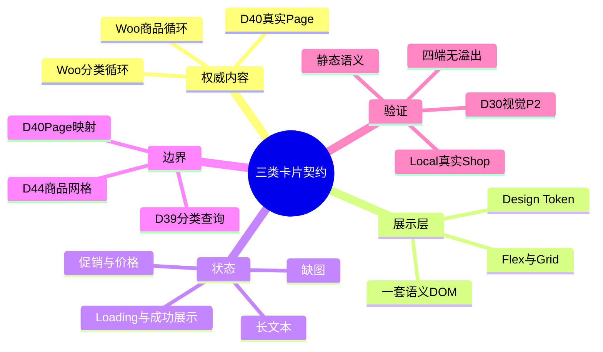
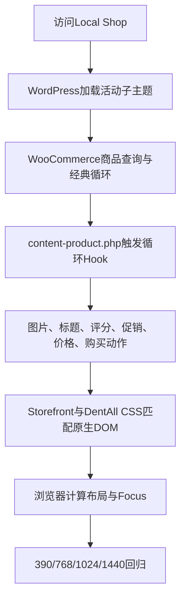

# Day29 WordPress实战：原生循环与卡片展示契约

## 相关笔记

- 学习索引：[[WordPress实战笔记索引]]
- 对应项目笔记：[[../Day29-三类卡片组件契约|Day29-三类卡片组件契约]]
- 前置学习笔记：[[Day28-基础控件状态与CSS级联]]
- 后续学习笔记：[[Day30-响应式栅格与系统状态]]
- 同主题项目边界：[[../Day27-设计证据与Design-Token|Day27-设计证据与Design-Token]]

> [!note] 后续收口
> 本文状态保留Day29结束时“技术收口、视觉接Day30”的历史口径。Day30已完成受控合并、DevTools真实页面排错与第5周前端周验收；最终结论见[[Day30-响应式栅格与系统状态]]及[[../Day30-设计系统v1与系统状态|Day30-设计系统v1与系统状态]]。

## 今日学习成果

- [x] 能解释ProductCard为什么应复用WooCommerce原生循环、格式化价格和购买动作，而不是复制模板或手写交易信息。
- [x] 能区分“卡片内部展示契约”和“页面查询、顺序、空态、网格”的职责，并指出D39、D40、D44各自接手什么。
- [x] 能用非持久化TEST夹具覆盖长文本、缺图和可选内容，同时说清夹具不能证明真实分类、Page或交易流程通过。

## 真实项目场景

Day29需要完成商品卡、分类卡和Solution卡三种可复用展示单元，但正式分类与Solutions内容尚未提供。正确路线不是等待内容，也不是把猜测写进数据库，而是先确认平台真实DOM：ProductCard直接验证Local现有WooCommerce TEST商品，CategoryCard复刻WooCommerce原生分类循环，SolutionCard冻结一套单链接语义结构；真实查询和业务验收分别留到D39与D40。

### 学习范围

- 本篇掌握：WooCommerce经典商品/分类循环、Hook输出顺序、组件内部契约、TEST夹具边界、Mobile First与状态验证。
- 本篇不展开：真实分类查询、Page字段来源、页面级网格、购物车交易成功、D30通知与系统状态。
- 真实入口：`app/public/wp-content/plugins/woocommerce/templates/content-product.php`、`content-product-cat.php`、`app/public/wp-content/themes/dentall/style.css`、`project-docs/tests/fixtures/day29-cards/`。
- 环境边界：只修改Local子主题CSS和版本库文档；未改模板、数据库、Staging或Production。

## 先建立整体模型

### 一句话模型

先让WooCommerce或未来页面查询提供可信内容与语义DOM，再让DentAll子主题按稳定类名负责视觉；夹具只能替代暂缺的展示样本，不能替代业务数据与交易验收。

### 记忆宫殿：商场里的三种货架

把页面想成商场：WooCommerce商品货架已经连接价格和库存系统；分类指示牌有平台规定的牌架，但正式名称与图标稍后上架；Solutions展示台由DentAll设计统一结构，稍后再把真实Page放进去。CSS像装修手册，只规定货架怎样摆放，不负责改价、造库存或发布内容。

| 记忆对象 | 真实技术对象 | 不能混淆的边界 |
|---|---|---|
| 商品货架 | `content-product.php`、循环Hook与`li.product` | CSS不能计算价格、库存或购买资格 |
| 分类指示牌 | `content-product-cat.php`与`li.product-category` | D29夹具不创建或排序`product_cat` |
| Solutions展示台 | `.dentall-solution-card`单链接DOM | D29不决定Page查询、Slug或摘要字段 |
| 装修手册 | DentAll子主题`style.css`和Design Token | 不改WooCommerce、Storefront或WordPress核心 |
| 模拟展品 | `project-docs/tests/fixtures/day29-cards/` | TEST视觉样本不能冒充正式内容或真实流程 |

## 思维导图



主干是：先确认权威输出，再冻结最小展示契约，最后把真实数据接入与页面编排留在各自层级。

## 请求与生命周期调用链



- 触发条件：Local活动主题为DentAll并访问真实Shop。
- 输入数据：WooCommerce产品对象、原生模板Hook、商品图片与可购买状态。
- 输出：原生商品HTML叠加子主题展示；没有数据库副作用。
- 可观察证据：`style.css?ver=0.7.0`、原生按钮/价格DOM、Computed尺寸与横向溢出。
- 夹具支线：直接读取静态HTML只能验证结构与候选状态，不进入WordPress请求生命周期。

## 核心概念卡

| 概念 | 准确定义 | DentAll真实例子 | 常见误区 | 如何验证 |
|---|---|---|---|---|
| 原生循环契约 | 平台模板与Hook维护的稳定输出顺序 | `li.product`中的图片、`h2`、价格和购买动作 | 为了改样式复制整份模板 | 查Woo模板与真实Shop DOM |
| 展示契约 | 内容字段、语义结构和状态的最小约定 | Solution一个链接、`h3`、可选摘要/媒体、CTA文本 | 把页面列数也塞进单卡组件 | 检查组件CSS没有生产网格媒体查询 |
| 非持久化夹具 | 不注册路由、不写数据库的测试文件 | 5 Product、4 Category、4 Solution状态 | 把TEST名称和价格当业务事实 | 检查文件路径、无脚本与无数据库动作 |
| 查询级空态 | 数据源返回0条、失败或加载中的区域状态 | D39/D40/D30分别处理的系统状态 | 用一张“缺图卡”代替整个区域空态 | 在真实查询接入日验证0/1/多条 |
| 页面级网格 | 容器决定列数、间距与响应式编排 | Shop的列数留D44 | 在ProductCard内部固化四端列数 | 检查D29规则只处理卡片内部 |

## 项目实战代码

### 涉及文件

- `app/public/wp-content/themes/dentall/style.css`：三类卡片内部展示，版本0.7.0。
- `project-docs/tests/fixtures/day29-cards/index.html`：非持久化状态DOM。
- `project-docs/tests/fixtures/day29-cards/fixture.css`：只为夹具提供观察用网格，不进入前台。
- `project-docs/笔记/Day29-三类卡片组件契约.md`：字段、DOM、状态与后续工作日边界。

### 从入口开始追踪

1. WooCommerce的`content-product.php`输出`li.product`并触发循环Hook。
2. 图片、标题、评分、促销、价格与购买动作由WooCommerce/Storefront按既有顺序输出。
3. DentAll不复制模板，只用明确排除`.product-category`的选择器适配商品卡。
4. 分类卡复用`li.product-category > a > img + h2`；真实term仍留D39。
5. SolutionCard尚无真实Page查询，只在夹具中验证合法、单链接的HTML；D40再映射真实字段。

### 关键代码片段

源文件：`style.css`。商品卡明确排除分类卡，避免一条公共规则误伤两种原生循环：

```css
.site-main ul.products > li.product:not(.product-category) {
	display: flex;
	flex-direction: column;
	gap: var(--dentall-space-8);
	padding: var(--dentall-space-16);
}
```

同一文件中，价格的`margin-top: auto`利用商品主链接的纵向Flex，把不同长度标题后的价格推到稳定位置；WooCommerce仍然决定价格HTML本身：

```css
.site-main ul.products > li.product:not(.product-category) .price {
	margin: auto 0 var(--dentall-space-12);
	color: var(--dentall-color-heading);
	font-size: var(--dentall-font-size-lg);
	font-weight: var(--dentall-font-weight-bold);
}
```

源文件：`index.html`。Solution正文使用允许包含标题的`div`，DOM顺序与视觉顺序一致；CTA只是同一链接内文本：

```html
<li class="dentall-solution-card">
	<a class="dentall-solution-card__link" href="...">
		<div class="dentall-solution-card__body">
			<h3 class="dentall-solution-card__title">...</h3>
			<span class="dentall-solution-card__cta">...</span>
		</div>
		<span class="dentall-solution-card__media">...</span>
	</a>
</li>
```

### 真实Hook顺序

| 顺序 | Hook | 当前职责 |
|---:|---|---|
| 1 | `woocommerce_before_shop_loop_item` | 打开商品链接 |
| 2 | `woocommerce_before_shop_loop_item_title` | 输出缩略图；Storefront调整促销位置 |
| 3 | `woocommerce_shop_loop_item_title` | 输出`h2.woocommerce-loop-product__title` |
| 4 | `woocommerce_after_shop_loop_item_title` | 评分、促销与格式化价格等可选内容 |
| 5 | `woocommerce_after_shop_loop_item` | 关闭商品链接并输出原生购买动作 |

### 运行证据

- Local真实Shop有2张TEST商品卡：Simple特价`del/ins + Add to cart`与Variable价格区间`Select options`。
- 390、768、1024、1440px均加载`style.css?ver=0.7.0`，文档横向溢出为0，动作高度为44px。
- 对应卡宽约335、210、288、382px；卡片内部图片与动作随可用宽度缩放，没有为四端复制HTML。
- 静态审计覆盖5个Product、4个Category、4个Solution；ID、ARIA目标、Hash链接、图片尺寸/alt和本地资源均通过，0个行内样式、脚本、事件和`!important`。
- 证据不能证明：Category/Solution真实查询、浏览器视觉与键盘Focus、AJAX真实交易成功、页面级网格或正式内容正确；这些分别接D30、D39、D40、D44及后续交易测试。

## 职责边界

| 层级 | 本主题负责什么 | 不应该负责什么 |
|---|---|---|
| WordPress Core | 活动主题、Page/term基础能力与资源加载 | 不修改核心文件 |
| WooCommerce | 产品对象、价格格式、库存/购买语义、商品与分类循环 | 不由CSS重算交易事实 |
| Storefront | 父主题基础DOM表现与经典商品网格 | 不直接修改父主题文件 |
| DentAll子主题 | 三类卡片展示与Design Token | 不承担查询、持久化或订单逻辑 |
| `dentall-core` | 本轮无新增职责 | 不为纯展示新建业务模块 |
| TEST夹具 | 覆盖暂缺的展示样本 | 不发布、不写数据库、不冒充正式数据 |
| 浏览器 | 计算级联、布局、Focus与溢出 | 页面显示不能证明服务端交易正确 |

## 安全、数据与站点影响

| 检查面 | Day29结论 | 证据或边界 |
|---|---|---|
| 输入、Capability、Nonce | 不适用 | 没有新增表单、后台动作或接口 |
| 输出转义 | 运行代码无新增输出 | 夹具是固定TEST文本；D39/D40真实输出仍需按上下文转义 |
| 数据库 | 无写入 | 未创建商品、分类、Page、媒体或配置 |
| URL与SEO | 无站点URL变化 | 不注册路由；夹具不是WordPress页面并声明`noindex` |
| 缓存 | 资源版本升到0.7.0 | 仍只加载原单个子主题CSS请求 |
| 性能 | 无查询、脚本、远程请求或Cron | 未做CWV前后量测，不宣称性能零影响 |
| 支付、物流、订单 | 无变化 | 未修改价格、库存、Cart、Checkout或支付 |
| 部署与回滚 | 仅Local | 回滚子主题CSS与夹具差异即可；未触碰Staging/Production |

## 动手练习

### 练习一：只读追踪原生输出

在Shop选中Simple商品，依次找到主链接、图片、标题、`del/ins`价格和购买动作；再对照上面的Hook顺序，说明哪些内容由WooCommerce决定、哪些只是CSS显示。

### 练习二：DevTools安全微调

在DevTools临时修改卡片的`--dentall-space-16`引用或局部`padding`，观察390与1440px差异；判断它是全局Token、共用组件还是ProductCard局部问题。刷新恢复后再回源码修改，不把DevTools临时值当交付。

### 练习三：故障推演

- 症状：CategoryCard突然继承ProductCard白色边框与大内边距。
- 第一检查：Product选择器是否仍有`:not(.product-category)`。
- 第二检查：真实DOM是否仍包含`.product-category`。
- 最小修复：恢复职责边界或修正真实类名，不用更高权重和`!important`继续覆盖。

## 常见误区与排错顺序

| 现象或误区 | 可能原因 | 推荐检查顺序 | 最小验证 |
|---|---|---|---|
| CSS改价就算实现价格 | 把展示与交易数据混为一谈 | 产品对象→原生价格HTML→CSS | 禁用CSS后价格事实仍应相同 |
| 分类卡被商品卡规则覆盖 | 选择器边界过宽 | DOM类→命中规则→Computed | 检查`:not(.product-category)` |
| 长标题挤出卡片 | Grid/Flex项目默认最小宽度或缺少换行 | 卡宽→`min-width`→`overflow-wrap` | 390/768检查`scrollWidth` |
| Solution有两个焦点 | CTA被做成第二个链接 | DOM嵌套→Tab顺序→Focus | 每卡应只有一个`a` |
| 夹具通过就宣布业务完成 | 混淆静态样本和真实数据 | 数据源→查询→DOM→视觉 | D39/D40用真实0/1/多条复测 |
| 页面卡片太大 | 页面网格仍由Storefront控制 | 容器→列数→卡宽→单卡内部 | 留D30/D44判断，不在单卡硬塞列数 |

## 掌握标准与费曼测试

- [ ] 能在2分钟内讲清“权威数据—原生DOM—子主题CSS—浏览器验证”的因果链。
- [ ] 能指出商品循环的真实模板与五段Hook顺序。
- [ ] 能解释Category/Solution夹具为什么既有价值又不能替代D39/D40。
- [ ] 能用DevTools判断一个问题应改Token、公共组件还是局部规则。
- [ ] 能说明页面级网格与卡片内部布局为什么必须分层。
- [ ] 能说清本次对数据、SEO、缓存、交易和部署的真实影响。

当前掌握度：`初识`。

1. 为什么ProductCard不复制`content-product.php`也能改变外观？
2. `:not(.product-category)`在本项目防止了什么级联风险？
3. 为什么TEST夹具可以验证缺图，却不能证明真实分类空态？
4. 从一次Shop请求开始，WooCommerce、Storefront、DentAll和浏览器各负责什么？
5. 为什么SolutionCard的CTA应是同一链接内文本，而不是第二个链接？
6. 1440px商品图片显得太大时，为什么应先检查页面列数而不是立即缩小所有卡片图片？

### 自测评分

每题0～2分，总分`____ / 12`；存在0分题时不提升掌握度。

## 间隔复习记录

| 复习节点 | 计划日期 | 完成 | 练习 |
|---|---|---|---|
| D+1 | 2026-08-27 | [ ] | 口述商品循环Hook顺序 |
| D+3 | 2026-08-29 | [ ] | 用DevTools定位一条卡片Computed规则 |
| D+7 | 2026-09-02 | [ ] | 纸面拆分组件与页面网格职责 |
| D+14 | 2026-09-09 | [ ] | 用D39/D40真实接入结果修正本笔记 |

## 收尾总结

- 今天真正理解的是：平台已有可信业务输出时，最小展示实现往往是复用原生DOM并限制CSS边界，而不是重建一套组件数据层。
- 仍需练习的是：在真实页面用DevTools把视觉问题归因到Token、组件或页面网格；这会在Day30周验收中实践。
- 下一篇直接相关学习笔记：[[Day30-响应式栅格与系统状态]]。

## 后续如何向AI高效提问

```text
环境：Local WordPress/WooCommerce/Storefront/DentAll版本
目标：调整哪一种卡片、哪个状态、哪些宽度
真实DOM：粘贴最小商品/分类/Solution结构
证据：Computed获胜规则、卡宽、scrollWidth、截图现象
边界：不改核心、不改交易数据、不提前做真实查询

请先判断问题属于Design Token、卡片内部组件还是页面级网格；再给最小DevTools试验、源码修改位置、四端回归与回滚方法。不要用!important，也不要重写WooCommerce模板。
```

## 变种应用到其他项目

| 场景 | 保持不变的原则 | 可能变化的实现 | 必须重新确认 |
|---|---|---|---|
| 其他Storefront子主题 | 复用原生循环、展示与交易分层 | 品牌Token、插件状态与DOM扩展 | Woo/主题版本与模板覆盖 |
| 其他经典WordPress主题 | 权威数据、语义DOM、最小CSS | 父主题选择器、Hook调整与网格 | 主题扩展点和加载顺序 |
| WordPress区块主题 | 状态契约与真实数据优先 | Product Collection Blocks、`theme.json` | 当前Blocks DOM与兼容范围 |
| Shopify或其他平台 | 平台格式化价格、购买语义与展示分层 | Liquid/Section或其他模板机制，待验证 | 官方数据对象、主题接口与发布流程 |

## 可复用核心思想

### 跨平台不变量

- 数据权威、语义结构、单卡布局和页面编排应分层；静态夹具只能替代样本，不能替代查询、交易或业务验收。
- 先保证单卡在任意可用宽度下不破版，再由页面容器决定列数，能显著减少断点耦合。

### WordPress/WooCommerce当前实现

- DentAll 0.7.0复用WooCommerce 11.0.0经典商品/分类循环；子主题CSS只适配原生类名，价格、促销、库存与购买动作继续由WooCommerce决定。
- SolutionCard在非持久化夹具中冻结合法的单链接DOM；真实Page字段、查询、顺序和空态仍留D40。

### Shopify或其他平台的对应机制

- 可迁移的是“平台业务对象为权威、主题负责展示、夹具不冒充真实数据”的边界。
- Shopify的Liquid商品对象、Section schema、产品卡snippet与购买表单具体行为在DentAll未实测，必须标为待验证，不能把WooCommerce Hook名称直接迁移。
