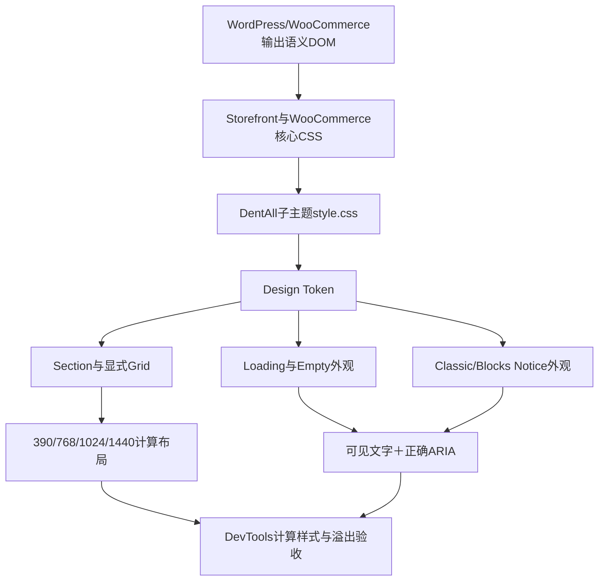

# Day30：响应式栅格与系统状态

## 相关笔记

- 学习索引：[[WordPress实战笔记索引]]
- 对应项目笔记：[[../Day30-设计系统v1与系统状态|Day30-设计系统v1与系统状态]]
- 前置项目笔记：[[../Day29-三类卡片组件契约|Day29-三类卡片组件契约]]
- 直接相关学习笔记：[[Day27-Design-Token与Mobile-First容器]]、[[Day28-基础控件状态与CSS级联]]、[[Day29-原生循环与卡片展示契约]]
- 后续实践：[[../Day31-PC公告栏与主页头结构|Day31-PC公告栏与主页头结构]]（待创建）

> [!note] 证据边界
> D29三类卡片与D30设计系统已受控合并到Local，当前集成版本为0.8.6。本笔记保留0.8.1～0.8.5各次修复落地时的历史证据，不把旧截图或旧哈希改写成0.8.6证据；最终状态以0.8.6源码、HTTP资源核对和开发者真实页面复验反馈为准。本轮已报告的Shop、Cart、输入框Focus、Checkout复合Select和商品Tabs/默认链接问题全部关闭。未逐项触发的星级、价格筛选、支付radio、Checkout错误/Readonly/Autofill及国家切换DOM，不扩大写成已验收。

## 真实项目场景与学习成果

D27已经建立Design Token，D28统一基础控件状态，D29负责卡片内部。D30要补的是三类公共“道路设施”：区段纵向节奏、显式使用的响应式栅格，以及Loading、空数据、通知等系统反馈。它不能接管商品查询、页面排序、卡片内部或WooCommerce交易逻辑。

完成本文后，应能：

1. 解释为何“一套语义DOM＋`auto-fill/minmax()`＋少量媒体查询”能覆盖390、768、1024、1440四端。
2. 区分Loading、Empty、Classic Notice与Blocks Notice的视觉职责及辅助技术播报机制。
3. 用DevTools完成“临时试验→判断修改层级→回写源码→四端回归”，并知道什么不能只凭截图验收。

## 记忆宫殿：商场公共区域

把DentAll前台想成一座商场：

- `:root` Design Token是物业总控室：颜色、间距和圆角从这里提供公共值。
- `.dentall-section`是楼层之间的公共走廊：只控制上下节奏，不决定店铺卖什么。
- `.dentall-grid`是可伸缩展架：根据可用宽度自动摆成1～4列，不改展品内部。
- `.dentall-system-state`是暂停营业告示牌：即使正在加载或没有结果，也要给人明确文字。
- WooCommerce Notice是消防广播：视觉可以统一，但消息内容、严重级别和辅助技术播报必须来自真正发出通知的系统。

技术映射如下：走廊对应CSS布局职责，展架对应Grid算法，告示牌对应状态DOM，广播对应WooCommerce模板或Blocks输出。比喻不能替代事实：CSS本身不会查询商品，也不会自动补上正确ARIA。

## 整体模型



浏览器的真实顺序是：服务端先输出HTML，父主题和WooCommerce样式先加载，子主题CSS再利用级联做最小覆盖。D30没有新增PHP模板、JavaScript状态机或数据库字段。

## 核心机制一：显式使用的响应式栅格

真实代码位于`app/public/wp-content/themes/dentall/style.css`的D30独立区段：

```css
.dentall-grid {
	--dentall-grid-gap: var(--dentall-space-16);
	--dentall-grid-min: 15rem;

	display: grid;
	grid-template-columns: repeat(auto-fill, minmax(min(100%, var(--dentall-grid-min)), 1fr));
	gap: var(--dentall-grid-gap);
	min-width: 0;
}
```

因果关系：

1. `15rem`是每列期望的最小宽度。
2. `min(100%, 15rem)`允许极窄容器退到100%，避免最小列宽把页面撑出视口。
3. `auto-fill`按当前容器能容纳的数量自动生成列。
4. `1fr`把余量均分，而不是硬编码四套DOM或四组固定列宽。
5. 子项`min-width: 0`允许长文本真正收缩；长词再由状态消息的`overflow-wrap: anywhere`处理。

这套Grid只有显式加入`.dentall-grid`时生效。它没有覆盖`ul.products`，因为Shop商品网格属于D44；D29卡片只负责卡片内部。

当`.dentall-grid`用于`ul`时，D30夹具显式保留`role="list"`。这可以规避部分Safari/VoiceOver组合在`list-style: none`时弱化列表语义的风险；正式输出也应保留原生列表语义或显式角色。

## 核心机制二：区段间距与断点

```css
.dentall-section {
	padding-block: var(--dentall-section-space-mobile);
}

@media (min-width: 48rem) {
	.dentall-section {
		padding-block: var(--dentall-section-space-tablet);
	}
}

@media (min-width: 75rem) {
	.dentall-section {
		padding-block: var(--dentall-section-space-desktop);
	}
}
```

这是Mobile First：默认32px，768和1024使用40px，1200px以上使用64px。断点表达“空间足够后增强”，不是为每台设备复制页面。横向容器gutter继续由D27负责；D30不重复设置。

## 核心机制三：Loading与Empty

Loading至少需要可见文字；动画只是辅助。D30夹具使用：

```html
<li class="dentall-system-state"
    role="status"
    aria-live="polite"
    aria-busy="true">
	<span class="dentall-system-state__spinner" aria-hidden="true"></span>
	<h3>Loading products</h3>
	<p class="dentall-system-state__message">...</p>
</li>
```

职责边界：

- CSS负责布局、表面和动画。
- 输出该状态的PHP或JavaScript负责在正确时机添加/移除`aria-busy`，并提供真实文案。
- Spinner设为`aria-hidden="true"`，避免辅助技术重复朗读装饰。
- `prefers-reduced-motion: reduce`时停止旋转，但保留文字与静态形状。
- D30也停止Storefront已有`.loading::after`和`.blockUI::before`动画；没有重新实现其业务状态。

WooCommerce原生无商品结构是两层DOM：

```html
<div class="woocommerce-no-products-found">
	<div class="woocommerce-info" role="status">No products were found...</div>
</div>
```

因此选择器必须落到`.woocommerce-no-products-found > .woocommerce-info`，不能误以为两个类在同一个元素上。D30只改变外观，不复制模板。

## 核心机制四：Classic与Blocks通知

WooCommerce存在两套常见结构：Classic使用`.woocommerce-message`、`.woocommerce-info`、`.woocommerce-error`；Blocks使用`.wc-block-components-notice-banner`、SVG和内容容器。D30把公共视觉映射到语义Token，但保留两套DOM差异。

```css
.site-main :is(
	.dentall-notice--success,
	.woocommerce-message,
	.wc-block-components-notice-banner.is-success
) {
	--dentall-notice-color: var(--dentall-color-success);
	--dentall-notice-surface: var(--dentall-color-surface-success);
}
```

通知不能只靠颜色区分：真实DOM仍要有文字、合适标题或列表。Classic输出可直接使用`role="status"`或`role="alert"`；WooCommerce 11 React `NoticeBanner`的视觉`div`本身没有`role`，而是在组件Effect中调用`wp.a11y.speak`，Success/Warning/Info使用`polite`、Error使用`assertive`。D30静态夹具按真实视觉DOM验证CSS，不能伪造动态播报生命周期。

## DevTools协作练习

以1024px为例：

1. 在Elements中选中`.dentall-grid`，先观察Computed里的`grid-template-columns`、`gap`和元素宽度。
2. 临时把`--dentall-grid-min: 15rem`改为`20rem`，观察3列如何变成2列；这是实验，不保存。
3. 判断归属：品牌全局间距改Token；所有Grid都要变时改公共组件变量；只有某个页面需要不同最小列宽时，在该页面最近的作用域覆盖`--dentall-grid-min`。
4. 撤销DevTools临时值，回到子主题源码做最小修改。
5. 禁用缓存并重载，依次验证390、768、1024、1440；检查列数、`scrollWidth`、长文本、通知链接、Focus和控制台。

不要把DevTools临时样式当成源码。也不要只看截图：截图能看视觉，却不能证明ARIA、重复ID、实际溢出和计算样式。

## 周验收真实页面排错复盘

以下问题统一按“现象→DOM→计算样式→假设→临时试验→规则归属→源码→四端回归”整理。版本号表示该修复首次落地的历史检查点；当前0.8.6继续保留这些规则。

### 已关闭

- [x] Shop顶部与底部的结果数量文字未和排序下拉框垂直对齐（原图5、图6）。
  - DOM：`p.woocommerce-result-count`与`form.woocommerce-ordering`同属`.storefront-sorting`。
  - 排除：结果文字的计算`margin`已经为0，问题不在段落默认外边距。
  - 根因：Storefront浮动只控制左右位置，不能让约53px高的表单与约30px高的文字垂直居中。
  - DevTools证据：父容器临时加入Flex与`align-items: center`后立即恢复；加入`flex-wrap`后390、768、1024、1440四端均无溢出。
  - 级联发现：父容器`gap`与Storefront宽屏`1em`子元素外边距叠加，清除子元素`margin`后间距由单一Token管理。
  - 状态处理：移除已失去职责的clearfix伪元素；空通知wrapper不参与Flex，非空通知wrapper独占一行。
  - 源码：排序修复最初落在子主题0.8.1的D30周验收区段；0.8.2检查点的Local HTTP曾实际返回`style.css?ver=0.8.2`且响应与当时磁盘文件逐字节一致；当前0.8.6原样保留。
  - 减法结果：5个局部规则块、8条声明，共用一套Flex与Token，不为顶部/底部或四个视口复制媒体查询。
  - 边界：真实多页归档的`.woocommerce-pagination`位置留到D44 Shop分页验收，不在本次两商品样本中预实现。

### 已关闭：购物车数量控件

- [x] 购物车数量减号、数量框、加号与删除按钮重叠，删除按钮无法可靠点击（功能性P1，已关闭）。
  - 已完成：DevTools根因定位、三条局部规则回写、Local与受控工作树同步、HTTP资源核对及独立静态复核。
  - 动态证据：2026-08-26开发者反馈真实Cart页面复验通过；本结论按开发者验收反馈记录，不虚构额外截图或自动化日志。

#### 1. 先把它看成“复合控件”，而不是四个普通按钮

真实Cart Blocks DOM可压缩为：

```html
<div class="wc-block-cart-item__quantity">
	<div class="wc-block-components-quantity-selector">
		<input class="wc-block-components-quantity-selector__input" type="number">
		<button class="wc-block-components-quantity-selector__button wc-block-components-quantity-selector__button--minus">−</button>
		<button class="wc-block-components-quantity-selector__button wc-block-components-quantity-selector__button--plus">＋</button>
	</div>
	<button class="wc-block-cart-item__remove-link">删除</button>
</div>
```

可以把它想成一个固定宽107px的“三格文具盒”：左格放减号、中格放数字、右格放加号；垃圾桶是文具盒旁边的独立按钮。WooCommerce给外壳设置`box-sizing: border-box`和两侧各1px边框，因此初始内容区约105px；两个按钮各至少30px、数字输入至少40px，三格的最小需要约为`30 + 40 + 30 = 100px`，只剩约5px余量。

DentAll D28的普通大按钮规则却给每个`button`加入左右各24px的`padding`。这相当于给左右两格各增加48px水平空间需求；实际最终宽度还共同受字形、边框、`box-sizing`和Flex收缩影响，但原本约5px的余量显然无法吸收这个增量。`display: flex`不会让不可再缩的最小尺寸凭空消失，多出来的按钮区域会从默认`overflow: visible`的盒子里伸出去，盖到旁边的删除按钮上。于是问题不只是“不好看”，还会改变鼠标实际命中的按钮，属于功能性P1。

这个比喻对应回真实CSS：外壳是`.wc-block-components-quantity-selector`，三格是两个数量按钮和一个数字输入，旁边的独立按钮是`.wc-block-cart-item__remove-link`。DevTools临时实验当时只能把“可见重叠”定位到子项盒模型超出复合组件固定几何，不能单独证明点击后的WooCommerce React状态、数量与总价更新链正常；这部分后来由开发者真实页面复验补齐。

还有一个容易困惑的点：HTML中`input`写在两个按钮前面，但WooCommerce用Flex的`order`把减号设为1、输入设为2、加号设为3，所以视觉顺序仍是“减号—数字—加号”。DOM书写顺序与Flex视觉顺序可以不同；排查时要同时看元素树和计算布局，不能只按源码行序猜位置。

#### 2. DevTools不是“直接改答案”，而是一次只改变一个变量

本次使用中文DevTools的证据链是：

| 次序 | 在“元素”中选谁 | 在“样式”中临时取消谁 | 页面立即发生什么 | 得出的结论 |
|---:|---|---|---|---|
| 1 | 加号按钮`.wc-block-components-quantity-selector__button--plus` | DentAll通用按钮规则中的`padding` | 加号回到数量控件内，垃圾桶重新露出且不再被覆盖 | 重叠的直接根因是通用大按钮内边距进入了紧凑复合控件 |
| 2 | 数字输入`.wc-block-components-quantity-selector__input` | DentAll通用输入规则中的`border` | 数字周围单独的实线方框消失 | 内框来自普通表单输入规则对复合控件内部输入的误伤 |
| 3 | 外壳`.wc-block-components-quantity-selector` | WooCommerce组件规则中的`border` | 整个数量控件的最外层细框消失 | 这不是重叠根因，而是WooCommerce默认视觉与DentAll期望不一致；经开发者确认后作为视觉取舍移除 |

这三步都只取消一个声明，其价值类似医生做排除试验：如果一次同时关掉`padding`、`border`、`width`和`display`，页面也许会变好，却无法知道哪一项治好了什么。刷新页面后DevTools临时修改会消失，因此它只负责验证假设；可维护的结论必须回写子主题源码。

“样式”与“计算样式”也有不同职责：

- “样式”显示哪些规则参与竞争、来自哪个文件，以及哪些声明被划线覆盖，适合找“谁写了这个值”。
- “计算样式”显示层叠结束后浏览器真正采用的值，适合确认“页面最终用了什么”。
- 元素右侧标出的`inspector-stylesheet`是DevTools临时实验区，不是`style.css`；重载后消失属于正常现象。

#### 3. 为什么DentAll的通用规则会赢

D28的初衷没有错：普通正文按钮需要44px左右的可点击高度、品牌色、圆角和宽松内边距；普通输入也需要统一边框。问题在于Cart Blocks把原生`button`和`input[type="number"]`当作复合组件的内部零件，它们不再是独立的大按钮和表单框。

CSS级联可以记成“先比职位，再比资历”：

1. 先比较`!important`、来源和层叠层；本次没有使用`!important`。
2. 再比较选择器特异性，可写成`(ID, class/属性/伪类, 元素)`。
3. 特异性相同，后加载或后书写的声明获胜。

本次关键竞争为：

| 规则 | 约化特异性 | 结果 |
|---|---:|---|
| Woo数量按钮规则`.wc-block-components-quantity-selector .wc-block-components-quantity-selector__button` | `(0,2,0)` | 原本声明`padding: 0` |
| DentAll通用按钮规则`.site-main :is(...)` | `(0,2,0)` | 与Woo同权重，但子主题样式在后，`padding: 8px 24px`胜出 |
| Woo数量输入规则`.wc-block-components-quantity-selector input.wc-block-components-quantity-selector__input` | `(0,2,1)` | 原本声明`border: 0` |
| DentAll通用输入规则`.site-main :is(...)` | `(0,2,1)` | `:is()`按参数中最高特异性计算；同权重且在后，普通输入边框胜出 |
| DentAll购物车局部覆盖 | `(0,3,0)` | 只多加购物车职责作用域，稳定胜过上述通用规则，无需`!important` |

这里的重点不是“选择器越长越好”，而是只增加一个有业务含义的作用域`.wc-block-cart-item__quantity`。如果为了赢权重不断复制ID、堆十层父级或加`!important`，以后调试会越来越困难。

#### 4. 最终源码为什么恰好只有三条声明

真实源码位于`app/public/wp-content/themes/dentall/style.css`的D30周验收区段：

```css
.site-main .wc-block-cart-item__quantity > .wc-block-components-quantity-selector {
	border: 0;
}

.site-main .wc-block-cart-item__quantity .wc-block-components-quantity-selector__button {
	padding: 0;
}

.site-main .wc-block-cart-item__quantity .wc-block-components-quantity-selector__input {
	border: 0;
}
```

逐条理解：

| 声明 | 修复对象 | 为什么不扩大范围 |
|---|---|---|
| 外壳`border: 0` | 移除经确认不需要的数量控件最外框 | 购物车祖先`.wc-block-cart-item__quantity`排除商品详情页；`>`另外要求数量选择器是该区域的直接子元素 |
| 数量按钮`padding: 0` | 恢复Woo要求的零水平内边距，消除横向溢出；其余DentAll按钮视觉仍保留 | 只有带数量按钮类的减号和加号命中；垃圾桶没有这个类，不会被改 |
| 数字输入`border: 0` | 移除复合组件内部多出来的实线框 | 只命中购物车数量输入，不会取消结账、搜索或普通表单字段的边框 |

空格表示“任意层级后代”，`>`表示“直接子元素”。第一条使用`>`是因为要准确找到外壳；后两条使用后代选择器，是因为要找到外壳内部的零件。三个选择器都先经过`.site-main .wc-block-cart-item__quantity`这道门禁，所以它们属于“购物车局部规则”，不是Design Token，也不是全站公共组件规则。

本次没有改Token，因为`--dentall-space-24`对普通按钮仍然正确；没有改D28通用按钮规则，因为全站大按钮不应为了一个紧凑组件一起变窄；没有写媒体查询，因为数量控件自身在四端遵守同一套几何，断点差异属于周围购物车布局；没有修改WooCommerce核心CSS，因为升级会覆盖且无法受Git可靠管理；没有加`!important`，因为正常特异性已经能解决竞争。

`border: 0`与`border: none`在这里都能让边框不可见；项目选择`border: 0`，表达“这个局部组件的边框宽度归零”。但“取消边框”不等于“可以取消Focus反馈”：键盘聚焦时仍必须有可见的`outline`或`box-shadow`。当前Woo组件的按钮与输入在`:focus`时会设置`outline: none`，并主要通过内嵌的`box-shadow: inset 0 0 1px 1px currentColor`反馈焦点；不能假定DentAll全站`outline`一定获胜。动态复验时应在“计算样式”同时核对`outline`和`box-shadow`，再用眼睛确认焦点确实可见。

#### 5. 静态证据、动态证据与剩余边界

已证明：

- Local与受控工作树的0.8.2 CSS换行归一化后一致；Cart页面响应200，并真实引用`style.css?ver=0.8.2`。
- HTTP取得的CSS与Local磁盘文件逐字节一致，三个局部选择器均存在。
- 独立静态复核确认三条规则能胜过对应核心/通用规则，且不会命中`.wc-block-cart-item__remove-link`、商品详情页或普通数量组件；该复核未新增P0/P1/P2/P3。原功能性P1当时仍待动态证据，现已由开发者复验反馈关闭。
- 这3个规则块、3条声明始于0.8.2；当前0.8.6只保留其局部几何职责，全局链接颜色规则不会改变数量控件与删除按钮的尺寸或顺序。
- 代码量减法审查后只保留3个局部规则块、3条声明；没有新文件、依赖、JavaScript、模板覆盖、`!important`或四套断点复制。

2026-08-26开发者反馈以下真实浏览器复验通过：

1. 加号、减号和垃圾桶都能准确点击，数量与总价随WooCommerce状态正确更新。
2. 数量高于最小值时验证减号可聚焦且Focus清楚；数量到最小值时验证减号Disabled并被Tab顺序跳过，再检查数字输入、加号和删除按钮的Focus。
3. 390、768、1024、1440四端均不重叠、不产生横向溢出；购物车周围布局没有被局部覆盖连带破坏。

仍不能由本次Cart证据外推：Mini Cart若使用不同DOM，不应凭当前选择器推断为已修复，需在其对应验收日查看真实结构。

#### 6. 可迁移的排错口诀

以后遇到“某个小控件被全站样式撑坏”，按以下顺序：

1. **点准零件**：在“元素”面板选中真正溢出的按钮、输入或外壳。
2. **看最终值**：用“计算样式”确认`width`、`min-width`、`padding`、`border`、`display`和`overflow`。
3. **追到来源**：回“样式”面板找到是核心、父主题还是子主题的哪条声明获胜。
4. **一次关一项**：临时取消最可疑声明，观察现象是否立即、可逆地变化。
5. **给结论分类**：区分功能根因、通用规则误伤和纯视觉偏好。
6. **选与职责相等的门禁**：局部复合组件使用局部作用域；来源本身是全站默认契约时，用最低权重全局规则接管；不先加`!important`。
7. **源码与页面闭环**：回写子主题、提升缓存版本、确认HTTP真在加载，然后做交互、Focus和四端回归。

### 已关闭：公共输入框Focus

- [x] Header搜索框与Checkout输入框聚焦后仍显示Storefront紫色Focus（可访问性P1，已关闭）。
  - 已完成：两页真实DOM与获胜规则定位、DevTools单变量实验、公共规则归属判断、0.8.4首次源码回写、Local/受控工作树同步、HTTP资源核对和独立静态复核；当前0.8.6继续保留该规则。
  - 动态证据：2026-08-26开发者确认此前已修复问题均完成390、768、1024、1440真实页面复验，Focus颜色、可见性及四端布局结果通过。

#### 1. 先把Focus框拆成“画框规格”和“油漆颜色”

Focus轮廓并不是一个不可拆分的整体。DentAll原有规则使用简写：

```css
.site :where(
	a:any-link,
	button,
	input,
	select,
	textarea,
	summary,
	[tabindex]:not([tabindex="-1"])
):focus-visible {
	outline: 3px solid var(--dentall-focus-ring-color);
	outline-offset: 3px;
}
```

`outline`简写会展开成至少三个独立长属性：

- `outline-width: 3px`：画框有多粗。
- `outline-style: solid`：画框是实线还是虚线。
- `outline-color: var(...)`：使用哪种颜色。

可以把它想成装修队先规定“做一个3px实线门框”，再从颜色卡领取油漆。Storefront没有拆掉门框，只单独拿一桶紫漆覆盖`outline-color`。因此页面看到的紫色框可能是“DentAll的3px和solid＋Storefront的紫色”，不是整套Focus都来自Storefront。

这就是为什么调试时只取消`outline-color: #7f54b3`很有价值：它只移除紫漆，不会同时破坏宽度、样式和偏移量。

#### 2. 第一层根因：Storefront只覆盖了最终颜色

真实页面中的Storefront Customizer行内规则为：

```css
a:focus,
button:focus,
input:focus,
textarea:focus,
input[type="email"]:focus,
input[type="tel"]:focus,
input[type="url"]:focus,
input[type="password"]:focus,
input[type="search"]:focus {
	outline-color: #7f54b3;
}
```

Header搜索框匹配`input[type="search"]:focus`，Checkout邮箱等字段匹配对应的带类型分支。DevTools强制`:focus`和`:focus-visible`后，右侧“样式”面板明确显示紫色来自`storefront-style-inline-css`，不是浏览器缓存、WooCommerce Blocks颜色Token或DentAll源码中的硬编码。

选择器权重解释了它为什么能盖住DentAll颜色：

| 规则 | 特异性 | 关键原因 |
|---|---:|---|
| DentAll `.site :where(...):focus-visible` | `(0,2,0)` | `.site`和`:focus-visible`各贡献一层；`:where()`内部始终按0计算 |
| Storefront `input[type="search"]:focus` | `(0,2,1)` | 属性选择器和伪类共2层，`input`再贡献1个元素 |
| 最终DentAll `.site input:focus-visible` | `(0,2,1)` | 与带类型的Storefront分支同权重；当前子主题在其后加载，因此获胜 |

`:where()`不是“没有匹配”，而是“匹配但主动不增加权重”。它适合建立容易覆盖的公共基线；当第三方对某个内部零件使用更具体选择器时，再增加一条最小、职责明确的补充规则，而不是把整个公共选择器改成高权重或加入`!important`。

真实HTML加载顺序也已核对：Storefront主样式及其Customizer行内样式先输出，随后才是`storefront-child-style-css`指向的DentAll 0.8.4。因此同为`(0,2,1)`时，后加载的DentAll输入规则稳定接管颜色。这个结论只基于当前锁定的父子主题资源顺序；未来若有更晚加载的扩展样式，仍需重新查看Computed来源。

#### 3. 第二层根因：浅色表面错误领取了白色油漆

DentAll原来还通过继承为“预计是深色”的区域切换Focus颜色：

```css
.site {
	--dentall-focus-ring-color: var(--dentall-color-focus-on-light);
}

.site .site-header,
.site .site-footer .storefront-handheld-footer-bar {
	--dentall-focus-ring-color: var(--dentall-color-focus-on-dark);
}
```

CSS自定义属性会沿DOM祖先向下继承。`.site`先发放浅色背景用的蓝色卡；更靠近搜索框的`.site-header`又发放深色背景用的白色卡，后者离元素更近，所以搜索框最终拿到白色。

问题在于D30真实Header仍是白底，独立复核还确认当前Storefront Customizer把390px手机底栏及其链接/搜索区域也设置为`#fff`。白色Focus画在白色表面上会像“无色”。这是一个提前为未来深色Header预实现状态、却与当前页面事实冲突的例子。

因此第一次实验出现了看似奇怪的结果：

1. Storefront紫色开启时，紫色长属性覆盖白色Token，所以轮廓清楚可见。
2. 临时取消紫色后，DentAll重新使用继承到的白色，白底白框看起来消失。
3. 在选中元素的`element.style`临时写入`--dentall-focus-ring-color: var(--dentall-color-focus-on-light)`后，最近一层变量变成蓝色，轮廓立即可见。

Checkout不在Header里面，因此不能把Header的白色继承原因机械套到Checkout；它确认的是第一层公共Storefront颜色冲突。两个页面共同证明应修公共输入Focus，而Header实验另外证明错误的on-dark上下文也必须删除。

#### 4. DevTools实验为什么分成四步

本次按以下顺序建立因果证据：

| 步骤 | 临时操作 | 观察结果 | 证明什么 |
|---:|---|---|---|
| 1 | 在`:hov`同时强制`:focus`与`:focus-visible` | 搜索框出现紫色 | 问题能稳定复现，且可检查两套焦点规则 |
| 2 | 只取消Storefront的`outline-color: #7f54b3` | Header轮廓看似无色 | 紫色长属性确实获胜；下面还有白色上下文问题 |
| 3 | 在`element.style`临时切回`focus-on-light` | Header轮廓变蓝 | `outline`结构有效，错误在继承到的颜色Token而非宽度或样式 |
| 4 | 恢复Storefront紫色，再新增`.site input:focus-visible`颜色规则 | 紫色仍启用时轮廓变蓝 | 新公共选择器权重足以接管颜色，无需`!important` |

开发者又在Checkout输入框复演同一公共规则并得到预期蓝色结果，说明修复层级应是“公共输入Focus＋真实表面Token”，而不是分别给搜索框、邮箱框和每个Checkout字段写页面补丁。

DevTools中的`element.style`和`inspector-stylesheet`仍只是实验室：它们能证明假设，但刷新会消失，也无法进入Git、Staging或Production。实验通过后必须回到子主题源码，并删除这些临时值再验证真实资源。

#### 5. 最终源码与每一行的职责

子主题0.8.4首次落地、当前0.8.6继续保留：

```css
.site {
	--dentall-focus-ring-color: var(--dentall-color-focus-on-light);
}

.site :where(
	a:any-link,
	button,
	input,
	select,
	textarea,
	summary,
	[tabindex]:not([tabindex="-1"])
):focus-visible {
	outline: 3px solid var(--dentall-focus-ring-color);
	outline-offset: 3px;
}

.site input:focus-visible {
	outline-color: var(--dentall-focus-ring-color);
}
```

职责分工：

- `.site`只给当前浅色站点表面提供默认Focus颜色。
- 公共`:where()`规则仍只维护一份宽度、样式和偏移量，保持低权重、容易被真实组件按需覆盖。
- `.site input:focus-visible`只补足Storefront带类型输入框所需的颜色权重，不重复声明3px、solid或offset。
- Header与手机底栏不再提前领取白色on-dark Token；未来某个组件背景真实改深时，必须把背景与局部Token作为同一组件改动一起实现并回归。

这不是“把所有Focus写两遍”。第二条规则是公共结构，第三条只是第三方级联适配层。若将完整`outline`再复制一次，未来调整宽度时会有两个维护点；只覆盖`outline-color`更符合减法原则。

#### 6. `:focus`与`:focus-visible`不能混为一谈

- `:focus`表示元素当前获得焦点，不区分鼠标、键盘或脚本来源。
- `:focus-visible`表示浏览器根据交互方式和控件类型判断“此时应显示明显焦点提示”。
- 它不是“永远只等于Tab”。Chromium中的可输入文本框即使用鼠标点击也通常匹配`:focus-visible`，而checkbox、radio或普通按钮的鼠标聚焦可能不匹配。

DentAll保留Storefront的`:focus`作为回退，只在`:focus-visible`时统一品牌可见轮廓。这能减少鼠标操作中的无意义装饰，同时保证键盘用户看到位置。但静态CSS不能保证每种浏览器、每类input的启发式完全相同，所以真实复验必须同时使用Tab和鼠标，不能只勾选DevTools伪类就宣布完成。

错误态也要单独看：本次只改变外侧`outline-color`，不会主动删除WooCommerce红色错误`border`或错误文案。最终仍要验证蓝色Focus与红色错误边框能同时被理解，不能让品牌色掩盖业务错误状态。

#### 7. 已证明、待证明与减法审查

已证明：

- Header搜索和Checkout输入的紫色均可追到Storefront `outline-color: #7f54b3`；公共临时规则在两处得到开发者确认的蓝色结果。
- Local与受控工作树的0.8.4 CSS换行归一化后一致，版本号唯一，98对花括号，0个`!important`。
- Cart页面响应200并引用`style.css?ver=0.8.4`；HTTP取得的25281字节与Local磁盘文件逐字节一致，SHA-256为`7B0751DB45A1AF54B12BB2FB0BAFE09ADC3A293D969409E73DECD705299A2EEE`。
- 独立复核确认Header与手机底栏当前均为浅色表面，删除两个on-dark上下文符合真实页面；新规则只改输入轮廓颜色，不改边框、背景、尺寸、值或错误状态。

2026-08-26开发者确认已清除临时实验影响，并在390、768、1024、1440真实页面完成此前修复项复验；本条报告的紫色Focus与四端裁切问题通过，因此P1关闭。错误、Readonly与Autofill等未明确触发的特殊状态不写成已验证，继续归后续完整Checkout表单回归；`Country/Region`与`State`复合Select则由下一节独立关闭。

代码量减法审查：没有新增文件、依赖、模板、JavaScript、断点或`!important`；删除1个同时误作用于Header和手机底栏的on-dark变量规则，新增1个公共input颜色规则且只有1条声明。0.8.6新增的默认链接规则只处理链接，不改变本节input Focus方案。

#### 8. 可迁移判断

以后看到“品牌Focus颜色被主题改回默认色”，不要直接全局搜索紫色并替换：

1. 先拆开`outline`的width、style、color和offset，看具体哪个长属性被覆盖。
2. 再查颜色来自直接声明，还是来自自定义属性继承。
3. 比较`:focus`与`:focus-visible`是否同时成立，并计算`:where()`、属性选择器和元素的真实权重。
4. 核对资源实际加载顺序；同权重只有在来源顺序明确时才能预测结果。
5. 深色Focus Token必须与真实深色背景一起出现，不能为未来页面提前挂在当前浅色组件上。
6. 最终用键盘、鼠标、错误态和四端裁切验证；颜色正确不等于可访问性已经完成。

### 已关闭：Checkout复合Select标签与值错位

- [x] `Country/Region`与`State`的浮动标签和值视觉错位（P1，已关闭）：DevTools因果实验、0.8.5源码回写、静态/HTTP核对及390、768、1024、1440真实页面复验均通过。

#### 1. 先认清它不是一个“普通下拉框”

WooCommerce Blocks输出的Country并不是一个孤立的`select`，而是三个零件组成的复合控件：

```html
<div class="wc-blocks-components-select">
	<div class="wc-blocks-components-select__container">
		<label class="wc-blocks-components-select__label">Country/Region</label>
		<select class="wc-blocks-components-select__select">...</select>
		<svg class="wc-blocks-components-select__expand">...</svg>
	</div>
</div>
```

可以把普通`select`想成一间空房，四周留出相同内边距通常没有问题；Woo Blocks复合Select则像一间带“上层夹层”的房间：标签固定在上方，当前值必须从更靠下的位置开始，右侧还要给箭头留空间。三个零件共同依赖同一套内部几何，不能只看`select`标签就把它当作普通字段。

D28公共表单规则为了统一全站原子字段，包含了`select`：

```css
.site-main :is(/* 其他输入类型 */, select, textarea) {
	padding: var(--dentall-space-8) var(--dentall-space-12);
}
```

它把复合Select原来的非对称内边距改成上/下`8px`、左/右`12px`。结果就像把夹层下方的家具整体抬高：浮动标签与当前值挤到一起。Country和使用相同组件输出的State都会出现同一问题。

#### 2. DevTools怎样建立因果，而不是凭感觉改数值

本次排查依次完成四个单变量实验：

| 步骤 | 操作 | 观察 | 结论 |
|---|---|---|---|
| 1 | 用元素选择器点中`select#billing-country` | DOM显示真实类名为`wc-blocks-components-select__select` | 问题零件与稳定业务类名已确认 |
| 2 | 只取消DentAll公共规则中的`padding` | Country和State的标签与值立即恢复分离 | 根因是公共内边距，不是高度、Grid、字体或React数据 |
| 3 | 恢复公共`padding`，添加Checkout局部内边距 | 正确类名下普通态恢复正常 | 修复应是局部组件例外，不能删除全局表单基线 |
| 4 | 查看盒模型和Woo实际CSS | 公共规则计算为`8/12/8/12`；Woo普通态原值为`16/9/0` | 源码应恢复组件契约，并保留Woo的Focus补偿 |

中途第一版局部规则没有生效，不是权重不够，而是把真实类名：

```text
wc-blocks-components-select__select
```

误写成：

```text
wc-block-components-select__select
```

少掉的`s`会让选择器匹配零个元素。CSS类名像完整门牌号：权重只负责多个正确地址同时竞争时决定谁获胜；地址本身写错时，规则根本没有进入竞争。盒模型仍显示上/下`8px`、左/右`12px`，正是这次拼写错误的反证。

“样式”面板适合查看所有候选声明，“计算样式”和盒模型适合查看最终获胜值。排查“不生效”时应先确认匹配和Computed，再决定是否讨论特异性，不能直接追加`!important`。

#### 3. 为什么最终源码不是临时实验的完全复制

DevTools使用`padding: 16px 8px 0`已经证明方向正确；继续检查Local实际Woo Blocks CSS后发现，它的正式契约更精确：

```css
.wc-blocks-components-select .wc-blocks-components-select__select {
	padding: 16px 9px 0;
}

.wc-blocks-components-select .wc-blocks-components-select__select:focus {
	border-width: 1.5px;
	padding: 16px 8.5px 0;
}
```

Focus时边框从`1px`增加到`1.5px`，左右内边距各减少`0.5px`，总宽度因此基本保持不变。这像门框变厚半毫米时，把室内净空补回半毫米，避免文字在聚焦瞬间横向跳动。

最终子主题只保留一条普通态修复：

```css
.wc-block-checkout select.wc-blocks-components-select__select {
	padding: 16px 9px 0;
}
```

没有复制整段Woo规则，因为`height: 50px`、`width: 100%`、`box-sizing`、箭头和标签定位仍由核心正确提供；现有证据只证明`padding`发生冲突。复制整块第三方CSS会扩大升级维护面，也可能无意接管错误态、深色态或将来新增状态。

#### 4. 特异性为什么要“刚好够用”

| 规则 | 特异性 | 作用 |
|---|---:|---|
| D28公共表单`.site-main :is(..., select, ...)` | `(0,2,1)` | 当前错误的普通态内边距来源 |
| 最终Checkout局部规则 | `(0,2,1)` | 与公共规则同权重，但写在其后，因此只在Checkout普通态获胜 |
| Woo普通态复合Select | `(0,2,0)` | 原始组件基线，被DentAll公共规则盖住 |
| Woo复合Select`:focus` | `(0,3,0)` | 聚焦时仍能胜过最终局部规则，保留`8.5px`补偿 |

`:is()`的特异性取参数列表中最高的那一项，不是只按当前匹配到的`select`分支计算；列表里的`input[type=...]`使D28公共规则最终达到`(0,2,1)`。因此局部规则增加Checkout业务门禁、元素名和真实组件类名，取得同等权重，再依靠明确的源码顺序获胜。

最初候选`.site-main .wc-block-checkout .wc-blocks-components-select__select`虽然也能修普通态，但其`(0,3,0)`会与Woo Focus规则同权重；子主题后加载时可能连Focus补偿一起盖住。最终方案主动降低到“刚好能赢普通态”，让更具体的核心Focus状态继续工作。这也是低权重CSS比一味加权更可维护的原因。

#### 5. 为什么不需要四套媒体查询

本修复只恢复复合控件内部标签和值的固定关系，不改变外部Grid、字段宽度、`50px`高度、`width: 100%`或`box-sizing: border-box`。390、768、1024和1440的差异发生在结账表单的可用列宽，内部“标签在上、值在下”的关系四端一致，因此一条Mobile First公共局部规则比四套断点例外更正确。

四端动态验收使用以下检查框架：

1. Country和State普通态的标签、值与箭头互不重叠。
2. 鼠标Focus和Tab Focus时边框、文字不跳动，蓝色Focus轮廓不裁切。
3. 长国家/州名称不撞右侧箭头，页面不产生横向溢出。
4. 切换一个有州列表的国家，再切换一个会让State变成普通文本框或隐藏的国家，确认局部选择器没有误伤另一种DOM。
5. 可触发错误态时，标签、边框和错误信息仍保持可辨识且可键盘操作。

#### 6. 已证明、待证明与减法审查

已证明：DevTools取消公共`padding`和正确类名局部实验都让当前普通态恢复；Local实际Woo CSS明确给出普通态`16/9/0`与Focus态`16/8.5/0`；0.8.5落地时Local和受控工作树源码换行归一化后一致，99对花括号且0个`!important`；当时Checkout引用`style.css?ver=0.8.5`，HTTP取得的25565字节与Local磁盘逐字节一致，SHA-256均为`3CCD92B9E80FE89FA26332D490EE00AF38C051C3CE0B9820828C0F9B8E1B31D8`。当前0.8.6继续保留这1个规则块、1条声明。

动态验收：2026-08-26开发者确认已修复问题在390、768、1024、1440均通过；因此本次报告的Country/State标签和值错位、四端拥挤及横向布局风险关闭。国家切换后State在`select`与普通文本框之间变化、以及可触发错误态，没有收到单独操作证据，不伪写为已测；它们保留到后续完整Checkout业务流程回归，但不改变本次局部视觉P1已经关闭的结论。

代码量减法审查：没有新增文件、依赖、模板、JavaScript、数据结构、断点或`!important`；只新增1个Checkout局部规则块和1条`padding`声明。没有删除全局表单Token，没有复制Woo整块CSS，也没有为Country与State分别写重复规则。

### 已关闭：商品Tabs与全站默认链接色

- [x] 商品详情页`Additional information`与`Reviews`不再继承Storefront紫色；0.8.6用DentAll语义Token接管全站“默认链接”契约，而不是给Tabs打局部补丁。

#### 1. 商品Tabs只是报警器，真正漏水点在总阀门

把商品页想成一间房：Tabs是墙角出现水迹的位置，Storefront Customizer输出的全局`a { color: #7f54b3; }`才是整栋楼的默认链接总阀门。如果只写`.woocommerce-tabs a`，水迹会暂时消失，但Footer、文章正文或以后出现的裸链接仍可能继续使用紫色。

DevTools选中`Additional information`后，右侧“样式”面板显示获胜规则来自`storefront-style-inline-css`：

```css
a {
	color: #7f54b3;
}
```

这里的“inline”指Storefront在页面`<head>`输出的一张`<style>`作者样式表，不是写在元素上的`style=""`。两者都参与级联，但元素行内样式的优先级机制不同，排错时不能只看到“inline”就误判。

#### 2. 为什么没有把所有紫色一次性全局替换

同一个Storefront Accent在核心和Customizer中承担了多种职责：默认链接、Focus颜色、评分星级、Classic数量按钮、支付radio、价格筛选手柄，以及`.added_to_cart`/`.wc-forward`等状态。它们在DentAll里不应全部领取同一张颜色卡：

| 真实职责 | DentAll应使用的语义 |
|---|---|
| 默认文字链接 | `--dentall-color-action`及其Hover/Active状态 |
| 键盘Focus | `--dentall-color-focus-on-light`或对应表面Focus Token |
| 评分星级 | Rating语义Token |
| 支付、价格筛选、数量等复合控件 | 在真实组件作用域内按交互状态验证 |

因此0.8.6只修“默认链接”这项已确认的公共契约。它没有宣称整个Storefront Accent已经被一个字符串替换完，也没有把未触发的星级、价格筛选、支付radio或Classic按钮Focus写成已验收。

#### 3. 为什么蓝色能覆盖紫色：三道门一起决定

CSS像一场投标，获胜要依次看：

1. **来源与重要性**：两条都是普通作者样式，没有`!important`。
2. **特异性**：Storefront的`a`与DentAll的`a`都是`(0,0,1)`。
3. **源码顺序**：同权重时，后加载的声明获胜。

Storefront在父主题初始化中以`wp_enqueue_scripts`优先级30执行子主题样式加载回调。这个PHP Hook优先级只决定回调何时运行，进而影响最终样式表顺序；它不会给CSS选择器“加30分”。真实页面顺序是父主题样式和Storefront Customizer的`<style>`先出现，随后才是`storefront-child-style-css`指向的DentAll CSS。因此两个同为`a`的规则相遇时，后到的DentAll蓝色获胜。

CSS变量`var(--dentall-color-action)`只是到计算值阶段取颜色，不会增加或降低选择器权重。

#### 4. 最终源码为什么保持最低权重

```css
a {
	color: var(--dentall-color-action);
}

a:where(:hover) {
	color: var(--dentall-color-action-hover);
}

a:where(:active) {
	color: var(--dentall-color-brand-secondary);
}
```

`:where()`内部特异性永远为0，所以三条规则仍都是`(0,0,1)`。它们只负责“没有更具体组件契约时的默认链接色”。Header、Footer、按钮、商品卡和其他组件的类选择器更具体，仍可维护自己的颜色；激活商品Tab的`.woocommerce-tabs ul.tabs li.active a`也更具体，继续保持当前激活态视觉，而非被强行刷蓝。

如果改用更重的`body.woocommerce a:hover`甚至`!important`，短期更容易赢，却会让按钮链接、导航和卡片难以覆盖，未来每个组件都要继续堆权重。

#### 5. DevTools怎样从局部现象决定全局方案

1. 选中真实Tab链接，在“样式”或“计算样式→color”追到`storefront-style-inline-css`。
2. 临时取消Storefront的`color: #7f54b3`，确认元素回到下层颜色，证明根因来自这条默认契约。
3. 临时新增`a { color: var(--dentall-color-action); }`，确认非激活Tabs变蓝；再观察激活Tab仍由更具体规则控制。
4. 抽查Header、Footer、按钮与卡片：若已有更具体组件规则，应保持原样。
5. 判断归属：来源本身是全站默认`a`，所以最终修复也应是低权重全站默认链接，而不是Tabs专用选择器。
6. 回写子主题并提升版本到0.8.6，清除DevTools临时规则，核对HTTP实际加载的新缓存键，再做代表页面和四端回归。

这里有两条可迁移判断。第一，候选选择器必须先确认真实匹配；Checkout把`wc-blocks-components`误写成`wc-block-components`时，地址不存在，特异性再高也不会生效。第二，作用域不是机械地越窄越好，而要与职责相等：Cart和Checkout问题属于局部复合组件；Storefront的`a`问题本身就是全站默认链接契约。

#### 6. 证据、边界与减法审查

开发者在0.8.6真实页面确认商品Tabs和本轮其余已报告问题全部解决。静态复核确认三条链接规则均为最低必要特异性，不会压过Header、Footer、按钮、三类卡片、Cart、Checkout及激活Tab的组件规则。

当前0.8.6整份CSS为102/102对花括号、0个`!important`；Worktree与Local换行归一化后的SHA-256均为`420F3762472A3D1A582D3273AC5586E27A0AAF5DD5B6DDCE3DA2DD593906096B`。Local与HTTP均为25943字节且逐字节一致，代表页面实际加载`style.css?ver=0.8.6`。

本节只新增3个规则块、3条声明，没有新Token、Tabs例外、媒体查询、PHP、JavaScript、模板或依赖。未逐项触发的星级、价格筛选、支付radio、Checkout特殊状态和完整交易流程，分别留给其对应功能日验证，不能从“Tabs已变蓝”外推为全部通过。

## D30独立夹具四端证据

独立夹具加载真实Storefront、WooCommerce和Blocks Notice CSS，再加载当前worktree子主题CSS。下表证明Grid、Section与系统状态，不替代各真实页面排错章节中的交互证据：

| 视口 | 实际内容宽度 | 列数 | Grid gap | Section上下间距 | 横向溢出 |
|---:|---:|---:|---:|---:|---:|
| 390 | 375 | 1 | 16px | 32px | 0 |
| 768 | 753 | 2 | 24px | 40px | 0 |
| 1024 | 1009 | 3 | 24px | 40px | 0 |
| 1440 | 1425 | 4 | 24px | 64px | 0 |

内容宽度比视口少15px来自Windows经典滚动条，不是DentAll布局错误。四端均为重复ID 0、跟踪状态溢出失败 0；列表角色为`list`。状态链接键盘Focus为3px可见轮廓，动作高度44px。文本、状态表面与图标的已测对比度均超过WCAG AA普通文本门槛。

## 排错路径

### 页面横向滚动

1. 比较`document.documentElement.scrollWidth`与`clientWidth`。
2. 找出右边界超过视口的具体元素。
3. 检查Grid子项是否缺`min-width: 0`，长词是否允许换行。
4. 只在问题所属层修改；不要全局加`overflow-x: hidden`掩盖根因。

### 通知颜色没有生效

1. 确认实际是Classic还是Blocks DOM。
2. 在Computed中看规则来源和加载顺序。
3. 检查核心Blocks CSS是否比子主题更晚加载；本夹具按真实依赖加载后验证。
4. 不先加`!important`；先修正作用域或资源顺序。

### 屏幕阅读器没有正确播报

1. Loading/Classic先检查`role`、`aria-live`和`aria-busy`；Blocks则检查`wp.a11y.speak`是否在真实React生命周期触发。
2. 确认装饰Spinner为`aria-hidden`。
3. 确认状态变化是实际DOM更新，而不是只有颜色或伪元素变化。
4. CSS不能补救错误的业务触发时机；回到输出状态的PHP/JavaScript修复。

## 安全、数据与系统边界

- 安全：本次无输入、表单处理、nonce、capability或SQL；未来状态文案仍须按输出上下文转义。
- 数据：夹具不查询或写入WordPress/WooCommerce，不能当正式业务内容。
- URL/SEO：没有路由、Slug、Canonical、Schema、robots或sitemap变更；夹具自带`noindex`且不进入站点导航。
- 缓存：Local与受控工作树当前使用单一0.8.6版本；页面实际引用`style.css?ver=0.8.6`，HTTP CSS与Local磁盘逐字节一致。后续每次源码回写仍需重新核对缓存键。
- 交易：不改变价格、库存、购物车、结账、支付、退款或订单状态。
- 部署：D29/D30 CSS已同步到Local并继续复验；未部署Staging/Production。

## 费曼自测

1. 为什么`minmax(min(100%, 15rem), 1fr)`比单独`minmax(15rem, 1fr)`更不容易产生窄屏溢出？
2. D30为什么不直接给`ul.products`设置四列Grid？
3. Spinner停止动画后，用户为什么仍能理解页面状态？
4. WooCommerce无商品状态为什么需要两层DOM选择器？
5. Classic与Blocks通知哪些部分可以统一，哪些部分必须保留差异？
6. 为什么取消Storefront紫色`outline-color`后Header Focus看似消失，而在元素上切回`focus-on-light`又会变蓝？请同时解释简写/长属性、自定义属性继承和`:where()`特异性。
7. 为什么Checkout复合Select的最终规则要与公共表单规则同权重，却故意低于Woo的`:focus`规则？如果把类名中的`blocks`误写成`block`，继续增加特异性为什么仍然无效？
8. 为什么购物车数量控件要局部恢复`padding: 0`，而不是删除全站普通按钮的内边距？外壳`border: 0`与这个功能根因有什么区别？
9. 为什么PHP Hook优先级30不能直接解释CSS谁赢？请用“来源/重要性→特异性→源码顺序”解释0.8.6默认`a`如何覆盖Storefront紫色，以及激活Tab为何仍可保持自己的颜色。

能够不用看答案解释上述问题，并在Local复现一轮四端检查，才从“初识”升级为“能解释”；能够安全修改并回归，则升级为“能修改”。

## 间隔复习计划

| 节点 | 日期 | 任务 | 状态 |
|---|---|---|---|
| D+1 | 2026-08-27 | 口述Grid公式和三层修改判断 | 待复习 |
| D+3 | 2026-08-29 | 用DevTools临时把1024从3列改2列并撤销 | 待复习 |
| D+7 | 2026-09-02 | 从真实Woo页面辨认Classic/Blocks/Empty结构 | 待复习 |
| D+14 | 2026-09-09 | 不看笔记完成一次溢出排错 | 待复习 |

## 高效向AI提问

可使用：

> 这是WordPress 7.0.4、WooCommerce 11.0.0、Storefront 4.6.2子主题。请基于我贴出的真实DOM和Computed规则，判断问题属于Design Token、公共组件还是页面局部规则；不要修改核心文件、不要先加`!important`，并给出390/768/1024/1440的最小回归矩阵。

AI建议只能生成假设；必须回到真实DOM、资源顺序、计算样式和可复演测试验证。

## 可复用核心思想

- 跨平台不变量：布局组件负责空间分配，内容组件负责内部展示，业务层负责数据与状态触发；三者混在一起会放大返工。
- WordPress/WooCommerce当前实现：服务器模板或Blocks输出语义DOM，父主题/插件提供基线，子主题用低权重、显式作用域和Design Token做最小覆盖。
- 级联排错不变量：先确认选择器确实命中，再比较来源、重要性、特异性和源码顺序；Hook优先级只能间接影响资源顺序，不能替代CSS级联计算。
- Shopify或其他平台：模板语言、通知DOM和扩展点名称会不同，但仍要验证真实输出、资源级联、状态语义和四端溢出；具体对应机制待目标平台官方文档与实站验证。
