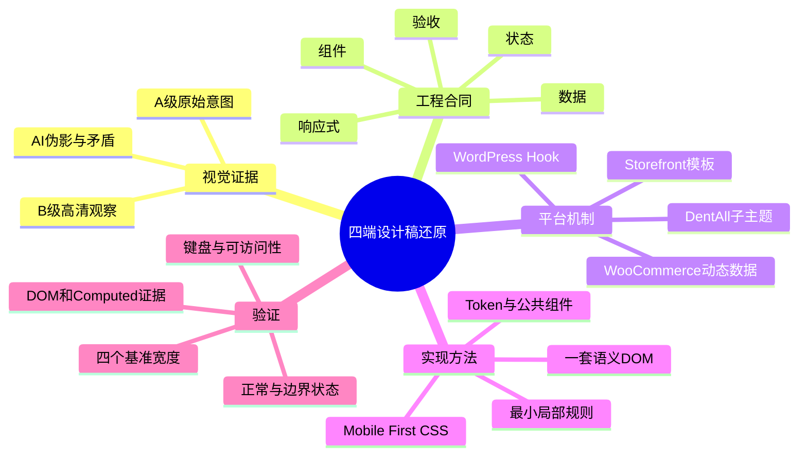
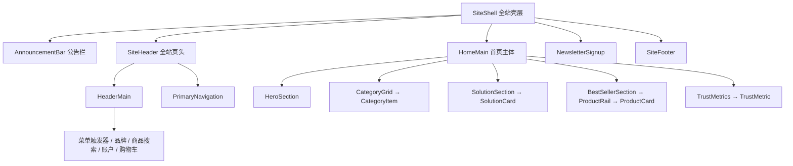
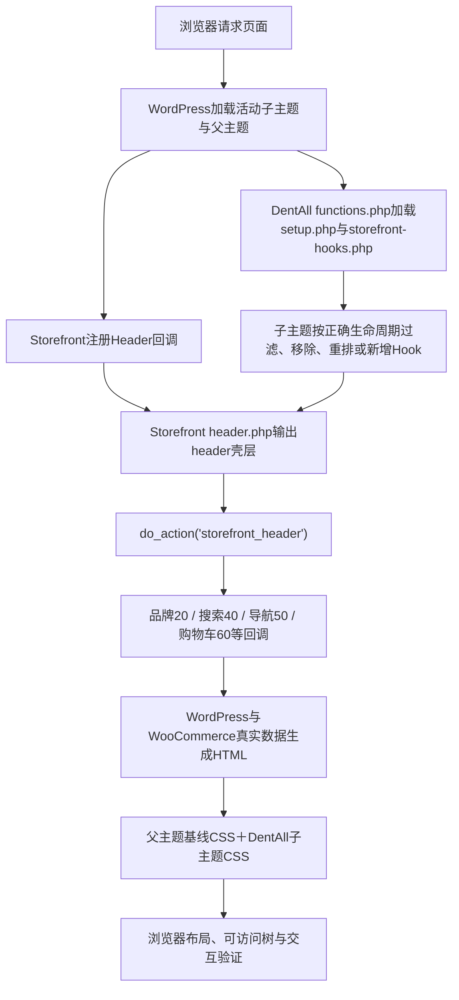

# Day31 WordPress实战：四端设计稿还原与组件拆解

> [!summary] 先记结论
> AI时代真正稀缺的前端能力，不是把一张图快速翻译成很多CSS，而是把不完整、可能自相矛盾的视觉证据，收敛成一套可维护的“组件、数据、状态、响应式和验收合同”。AI可以快速生成语法和候选实现；开发者必须判断什么是真的、谁拥有数据、哪里应该复用、异常状态如何工作，以及浏览器证据是否支持结果。

## 相关笔记

- 学习索引：[[WordPress实战笔记索引]]
- 对应项目笔记：[[../Day31-PC公告栏与主页头结构|Day31-PC公告栏与主页头结构]]
- 前置学习笔记：[[Day30-响应式栅格与系统状态]]
- 前置设计知识：[[Day27-Design-Token与Mobile-First容器]]、[[Day29-原生循环与卡片展示契约]]
- 后续实践：[[Day32-原生菜单与Storefront下拉机制]]

> [!check] 双向链接状态
> 本笔记已链接Day31项目笔记；Day31项目笔记已反向链接本笔记；[[WordPress实战笔记索引]]已登记本笔记；与直接相关的Day29、Day30学习笔记也已显式互链。

## 今日学习成果

- [ ] 我能用自己的话解释：设计稿还原为什么要先建立五份合同，而不是直接量像素、写CSS；待完成费曼自测后勾选。
- [ ] 我能沿真实项目追踪：首页模块怎样映射到Storefront Header Hook、WooCommerce动态数据和DentAll子主题职责；待自行复述调用链后勾选。
- [ ] 我能在Local独立复演本篇已经落地的最小Header改动、完成390/768/1024/1440验证并说明回滚；项目实现已完成，但需本人动手复演后再勾选。

## 真实项目场景

### 今天解决了什么问题

DentAll已经完成D27～D30的Design Token、基础控件、三类卡片、响应式Grid和系统状态。D31开始进入真实页面还原。首页同时有1440、1024、768、390四端图，但它们是AI辅助生成的扁平视觉证据，不包含真实DOM、数据源、交互、错误状态或WordPress生命周期；部分内容还互相矛盾。如果直接照图逐块写CSS，很容易得到四套重复页面、硬编码业务数据和只能在一个宽度成立的“截图工程”。

本篇先用首页建立“证据→合同→DOM→CSS→验证”的整体模型，随后把它应用到D31真实Header：经用户逐项授权，在Local实现三条TEST公告、三个右侧非交互槽位（币种/语言未来插件位置＋Help页面位置）、占位Logo、WooCommerce商品搜索、Account与原生Header Cart，并完成五页×四宽度回归。这样既保留设计拆解方法，也能用实际代码验证哪些判断成立。

### 学习范围

- 本篇要掌握：证据分级、模块边界、四端响应式合同、动态数据与状态、Storefront/WooCommerce输出链、领域CSS拆分、真实代码阅读、视觉验证顺序，以及AI协作方法。
- 本篇明确不展开：D32下拉导航、D33抽屉和手机搜索、D34平板最终收敛、D35 Newsletter接入、D37～D42首页主体、D69 Mini Cart动态状态，以及WPML/WCML实际安装。
- 项目真实入口：`design-assets/references/home/`、`app/public/wp-content/themes/storefront/header.php`、Storefront Header/WooCommerce Hook源码、`app/public/wp-content/themes/dentall/inc/setup.php`、`app/public/wp-content/themes/dentall/inc/storefront-hooks.php`、`app/public/wp-content/themes/dentall/style.css`、`app/public/wp-content/themes/dentall/assets/css/site-shell.css`。
- 验证环境：Local；WordPress 7.0.4、WooCommerce 11.0.0、Storefront 4.6.2、DentAll子主题0.9.0。运行修改只落Local；Staging与Production未改变。

## 先建立整体模型

### 一句话模型

设计稿还原的因果链是：**视觉证据先变成工程合同，工程合同再决定语义DOM和动态数据，CSS只负责同一DOM在不同空间中的布局，最后由真实浏览器和状态矩阵裁决结果。**

### 五份合同

把“看图写页面”升级为工程任务时，至少要产出五份合同：

| 合同 | 回答的问题 | DentAll首页例子 |
|---|---|---|
| 组件合同 | 哪些是页面区段、可复用组件和内部元素 | `ProductCard`复用D29契约；Hero标题不单独造组件 |
| 数据合同 | 内容从哪里来，谁维护，缺失时怎样退化 | 商品来自WooCommerce；正式公告数字必须由业务确认 |
| 状态合同 | 正常之外还会发生什么 | 缺Logo、空购物车、缺图、长标题、售罄、无商品 |
| 响应式合同 | 哪些信息不变，空间不足时怎样重排或折叠 | 同一搜索在手机独占一行，在PC进入Header主行 |
| 验收合同 | 什么证据才算完成 | 四个基准宽度、真实DOM、Focus、溢出、动态状态和截图对照 |

如果缺少其中任何一份，AI仍然能产出“像代码的文本”，但无法保证它是正确、可维护、能上线的前端实现。

### 记忆宫殿：一座四种营业模式的商场

把首页想成同一座商场，而不是四座不同的商场：

| 记忆对象 | 真实技术对象 | 不能混淆的边界 |
|---|---|---|
| 商场总平面 | 页面信息架构与语义区段 | 截图裁切不等于真实页面结构 |
| 独立楼层或店铺 | Header、Hero、分类区、商品区、Footer | 有视觉矩形不代表必须独立组件 |
| 可复用货架 | ProductCard、CategoryItem、SolutionCard | 组件负责展示合同，不拥有全部业务数据 |
| 商品标签与库存牌 | WooCommerce商品、价格、库存和状态 | 不能把截图文字写死为正式数据 |
| 可移动隔断 | CSS Grid、Flex、媒体查询和容器规则 | 响应式不是复制四份HTML |
| 水电与物流管线 | WordPress模板、Hook、WooCommerce API | CSS不能替代服务器输出或交易逻辑 |
| 消防和营业检查 | DevTools、可访问性、四端与状态测试 | “肉眼像”不能证明键盘、错误态和动态数据正确 |

在手机营业模式下，货架会排成一列、入口更紧凑；在PC营业模式下，同一批货架可以并排。商品、库存和安全出口不能因为空间变化而复制或消失。这个比喻的边界是：真实DOM存在阅读顺序、可访问名称、网络请求和服务器生命周期，不能只按物理空间理解。

## 思维导图



最重要的主干是：**截图只提供证据，合同负责消除歧义，平台输出真实内容，CSS负责空间变化，浏览器负责最终裁决。**

## 第一步：先给设计证据分级

### 本项目的证据层级

| 等级 | 文件 | 可以决定 | 不能单独决定 |
|---|---|---|---|
| A | `source-home-desktop-final.png`、`source-home-tablet-portrait-final.png`、`source-home-mobile-final.png` | 宏观结构、模块顺序、三端重排和蓝白视觉方向 | 真实数据、交互、精确CSS值 |
| A | `source-home-three-device-reference.png` | 三端交叉核对，发现增强稿增删错配 | 直接量CSS尺寸 |
| B | `home-desktop-1440.png`、`home-tablet-portrait-768.png`、`home-mobile-390.png` | 放大观察分区、密度和对应目标宽度 | 覆盖A级视觉意图或充当业务需求 |
| B低置信度 | `home-tablet-landscape-1024.png` | 提出1024横屏布局候选 | 冻结断点、字号、间距、总高度和交互 |

四张高清图实际是2×或3×像素输出，例如`home-desktop-1440.png`本身为2880px宽，但目标CSS视口是1440px。不能把图片像素直接当CSS像素。

### 为什么1024必须单独降权

1024图为2048×1536，对应1024×768横屏目标，但它把整张长首页压进一个768px高的画面：Solutions和Best Sellers被并排塞入半屏，商品文字和操作目标异常紧密。它适合提出“横屏也许能更密”的假设，不适合测页面总高度或强制要求所有模块在首屏内出现。

### 已确认的AI伪影

- 768图重复`Equipment`分类，不能据此创建重复分类。
- 768增强图在Logo与搜索之间出现乱码，A级源图没有该内容。
- 768信任区少了`Secure Payments`，其他端又出现，不能据此维护两套数据集合。
- 390热卖区的绿色瓶子图片与`Zirconia Disc`名称错配。
- 公告文案、币种、语言、帮助入口、信任数字、价格、评价数、支付方式和版权年份都不是正式业务事实。

这一步的核心能力是：**把“我看到了”与“系统必须这样做”分开。**

## 第二步：从页面轮廓拆到组件合同

### 首页模块树



虽然证据来自首页图，`AnnouncementBar`、`SiteHeader`、`PrimaryNavigation`、`NewsletterSignup`和`SiteFooter`都属于全站壳层。除非需求明确要求首页特例，后续实现不应写成只对`.home`生效的补丁；否则Shop、商品详情、Cart、Checkout和My Account会继续使用另一套结构。

### 为什么这样拆

一个区域满足下列一项以上，才值得成为组件边界：

1. 有独立语义职责，例如`nav`、搜索表单、Newsletter表单。
2. 有独立数据源或维护角色，例如WooCommerce商品与业务公告不是同一来源。
3. 有自己的状态机，例如购物车会空、非空、更新中或失败。
4. 在四端有独立变化，例如搜索从主行移动到独立行。
5. 会复用或需要独立验证，例如`ProductCard`会出现在首页、归档和相关商品。

反过来，Hero标题、说明和CTA当前只是`HeroCopy`内部元素；为了“组件化”把每个文本节点拆成PHP函数、模板文件或CSS模块，只会增加跳转成本。

### 模块与项目工作日的边界

| 模块 | 计划工作日 | 当前边界 |
|---|---|---|
| AnnouncementBar、PC Header主行 | D31 | Local最小实现与PC主验收已完成；1440 Focus通过，390三个底栏动作与展开后input已取证，折叠态直接Tab及1×1 submit P2转D33；正式内容与部分交易状态另验 |
| PC主导航、下拉与后台菜单 | D32 | 不在D31提前实现 |
| 手机Header与抽屉 | D33 | 静态图只证明入口，不证明交互 |
| 768/1024/1366收敛 | D34 | 1024低置信度，必须浏览器验证 |
| Newsletter与Footer | D35～D36 | 不从手机图直接推断“删除Footer导航” |
| Hero | D37～D38 | 数据字段与图片裁切届时冻结 |
| 分类、Solutions、商品与信任区 | D39～D41 | 分别使用真实数据和状态合同 |
| 首页全链路校准 | D42 | 四端、可访问性、性能与M4验收 |

## 第三步：找出四端不变量和变化量

### 跨四端不变量

- 页面顺序始终是Header → Hero → 分类 → Solutions → Best Sellers → 信任信息 → Newsletter → Footer。
- 搜索、账户和购物车属于全站Header，不是首页专属内容。
- Hero始终有核心标题、说明、主CTA和媒体；空间变化只改变排布和密度。
- 分类、Solutions、商品和信任区都是“同一数据集合的不同排布”，不是四份数据。
- 品牌蓝、深海军蓝、白底、浅蓝区段、圆角卡片和高对比CTA是稳定视觉语言。
- 商品卡必须由WooCommerce真实商品、价格、库存和可购买状态驱动。

### 四端可直接观察事实

| 模块 | 1440 PC | 1024横屏（低可信） | 768竖屏 | 390手机 |
|---|---|---|---|---|
| 公告栏 | 左3条信息；右币种、语言、帮助 | 左3条；右只剩币种 | 只保留居中免邮信息 | 单条免邮信息并带下拉符号 |
| Header主行 | Logo、完整搜索、账户、购物车同排 | 基本保持PC结构 | 汉堡、居中Logo、账户/购物车；搜索另起一行 | 同768但更紧；搜索另起一行 |
| 搜索 | 分类选择器＋文字按钮 | 同PC | 分类选择器＋文字按钮 | 无分类选择器；图标按钮 |
| 主导航 | 完整导航行 | 完整导航行 | 不显示，以汉堡代替 | 不显示，以汉堡代替 |
| Hero | 左文案、右媒体，含3个卖点 | 左右布局 | 文案左上、媒体右下，卖点消失 | 高而窄，文案上方、媒体右下 |
| 分类 | 9项单行 | 9项单行 | 5列×2行，但有重复伪影 | 3列×3行 |
| Solutions | 4卡单行 | 左半区2×2 | 4卡纵向 | 4卡纵向，描述文字被省略 |
| Best Sellers | 5卡可见＋两侧箭头 | 右半区4张极密卡 | 约3张完整卡＋下一张边缘 | 单卡为主、相邻卡边缘、箭头和圆点 |
| Trust Metrics | 5项横排 | 5项横排 | 图中只出现4项 | 5项纵向卡片 |
| Newsletter | 文案左，输入与按钮右 | 同PC | 仍是横向组合 | 文案、输入、按钮纵向 |
| Footer | 5组链接＋品牌社交 | 接近PC | 链接组重排，品牌居中靠下 | 截图只剩品牌、社交、支付和版权 |

### 图能提示、但不能证明的交互

- 汉堡图标只提示“需要移动菜单”，没有证明抽屉方向、遮罩、焦点陷阱、Esc关闭和返回焦点逻辑。
- 箭头与圆点只提示“可能是商品轨道”，没有证明自动播放、循环、拖拽或键盘行为。
- 分类搜索外观没有定义真实选项、查询参数、URL、无结果状态或与WooCommerce搜索的兼容方式。
- 手机Footer不显示导航，不等于可以从DOM删除导航；可能应采用折叠区，也可能只是截图省略，必须另行确认。
- 四个采样宽度不能证明断点一定发生在767/768或1023/1024；断点由内容何时碰撞决定。

## 第四步：把四端变成一套响应式规则

### 原则：一套语义DOM，CSS改变空间关系

四端不是：

```text
desktop-header.php
tablet-landscape-header.php
tablet-portrait-header.php
mobile-header.php
```

而是：

```text
同一套Header语义与动态数据
  ├─ 手机基础布局
  ├─ 768px空间增强
  ├─ 1024px横屏校准
  └─ 1200px以上PC导航与多列增强
```

下面只是讲解“一套DOM＋Grid Area”的抽象伪代码，**不是DentAll当前源码的逐字复制**。D31实际复用Storefront既有DOM与Hook，类名、可见区域和断点以`site-shell.css`为准：

```html
<!-- 教学伪代码：真实实现仍应优先复用Storefront/WooCommerce输出。 -->
<header class="dentall-site-header">
  <div class="dentall-header-main">
    <button class="dentall-menu-trigger" aria-expanded="false">Menu</button>
    <a class="dentall-brand" href="/">DentAll</a>
    <form class="dentall-product-search" role="search">…</form>
    <a class="dentall-account" href="…">Account</a>
    <a class="dentall-cart" href="…">Cart</a>
  </div>
  <nav class="dentall-primary-navigation" aria-label="Primary">…</nav>
</header>
```

```css
/* 教学伪代码：用于解释思路，不能替代当前site-shell.css。 */
.dentall-header-main {
  display: grid;
  grid-template-areas:
    "menu brand account cart"
    "search search search search";
}

@media (min-width: 1200px) {
  .dentall-header-main {
    grid-template-areas: "brand search account cart";
  }
}
```

真实实现时还要检查DOM阅读顺序与视觉顺序是否一致、Tab键顺序是否合理，不能为了视觉重排制造可访问性错位。

### Mobile First不是“先把PC缩小”

推荐推理顺序：

1. 先写最窄宽度仍成立的语义和正常流布局。
2. 在内容开始拥挤、换行失控或触控目标相撞时增加行为断点。
3. 每个断点只回答一个真实问题，例如“搜索何时能回到主行”“四张方案卡何时能并排”。
4. 断点之间必须自然过渡；不能只在390、768、1024、1440四个点看起来正确。

项目素材包给出的候选层级是：基础手机、`>=768px`平板竖屏、`>=1024px`横屏增强、`>=1200px`PC导航与多列。D31实际根据内容碰撞落地了`48rem`、`64rem`和`75rem`三个行为断点：`48rem`显示Header动作与搜索，`64rem`披露三条公告和币种，`75rem`把Header收为单行并显示语言/Help槽。它们仍是当前内容下的实现结果，不是行业固定断点。

这里还有一个应保留到D34的条件性风险：CSS的`48rem`只有在默认16px初始字号下等于768px，而Storefront部分移动行为使用固定768px边界；若用户或浏览器采用非默认初始字号，两套边界可能短暂错位，造成动作入口重复或断档。D31默认环境未出现该问题，但不能因此宣称所有字号设置都通过。

### 模块级响应式合同

| 模块 | 手机基础 | 平板增强 | PC增强 | 不允许变化 |
|---|---|---|---|---|
| Header | D31当前只显示品牌，手机搜索/菜单/动作留D33；适用页面由Storefront Handheld Footer提供动作入口 | `>=48rem`品牌/Account/Cart首行，搜索第二行 | `>=75rem`品牌/搜索/Account/Cart单行；导航仍留D32 | URL、动态账户/购物车真相源 |
| Hero | 文案与媒体在自然流中重排 | 控制媒体比例和文字行长 | 左右双列并扩大留白 | H1、CTA含义和图片替代文本职责 |
| 分类 | 3列起步，标题可换行 | 依据真实长标题增加列数 | 9项可单行 | 分类集合和目标URL |
| Solutions | 单列 | 单列或2列，依内容承载决定 | 4列 | 四张卡的数据身份 |
| ProductRail | 1张主卡＋可发现的后续内容 | 可见约3张 | 可见约5张 | ProductCard字段、售罄/不可购买语义 |
| Trust Metrics | 纵向 | 允许多列 | 横排 | 经业务确认的数据数量与含义 |
| Footer | 纵向或可访问折叠 | 多列重排 | 完整多列 | 链接可发现性和合法信息 |

## 第五步：把像素映射到真实数据和状态

### 首页模块的数据归属

| 视觉模块 | 当前或候选真相源 | D31收口状态 |
|---|---|---|
| AnnouncementBar | `storefront_before_header`扩展点＋业务批准文案 | Local输出三条`[TEST]`；正式环境不输出，占位不能发布 |
| Logo/站点名 | WordPress Custom Logo；缺失时Storefront回退站点标题 | Local且缺Custom Logo时输出透明PNG占位；非Local或有Custom Logo时委托Storefront原生输出 |
| 商品搜索 | Storefront `storefront_product_search()` → WooCommerce商品搜索Widget | 原生GET契约、可见浮动标签和按钮已保留；分类选择器未实现，实际提交未触发 |
| Account | WooCommerce My Account页面URL＋`wc_get_page_permalink( 'myaccount', '' )` | 独立Account动作已输出；游客/登录用户共用同一入口，不提前做下拉 |
| Cart | Storefront Header Cart＋WooCommerce当前会话 | 原生完整Cart回调已移入主行并保留fragment Filter；非空Cart和真实fragment替换留D69 |
| Primary Navigation | WordPress菜单位置与`wp_nav_menu()` | 当前未分配，子主题已关闭Page回退 |
| 分类入口 | WooCommerce `product_cat`术语 | D39接入；截图分类名只是视觉样本 |
| ProductCard | WooCommerce Product对象与原生循环/公开API | 复用D29展示合同，不复制静态卡片 |
| Solutions | ADR-023已确认第一版原生WordPress Page优先 | 不注册Solutions CPT；正式范围、英文标题、Slug、媒体、相关商品和导航仍待业务确认 |
| 公告与信任数字 | 业务方确认的可发布事实 | 当前三条全部带`[TEST]`且只在Local输出，不能直接发布 |
| 币种/语言/帮助 | WooCommerce币种＋未来WPML/WCML/帮助页面 | 当前只有三个非交互槽位；未安装插件、未实现切换或Help链接 |
| Newsletter | D35届时确认表单、同意文本、数据去向与失败处理 | 尚未选型或接入 |
| 社交/支付图标 | 正式账户、官方资源或支付插件真实输出 | 当前素材仅占位，不可上线 |

### 状态矩阵比“正常截图”更接近真实前端

| 模块 | 正常 | 还必须考虑 | 不应伪造的状态 |
|---|---|---|---|
| 品牌 | 正式Logo | 缺Logo时站点名回退、长站点名 | 用AI Logo冒充正式品牌 |
| 搜索 | 可提交商品关键词 | 空输入、长输入、无结果、键盘Focus；若异步才有加载/错误 | 静态图不能证明有搜索建议 |
| 账户 | 登录/未登录入口可理解 | URL不可用时安全退化、可访问名称 | 未确认的会员等级或文案 |
| 购物车 | 空/非空数量与小计 | 更新中、片段刷新失败、长金额格式 | 把截图中的数量和美元符号写死 |
| 分类 | 有图有标题 | 缺图、长标题、少于9项、空集合 | 重复768图里的`Equipment` |
| ProductCard | 可购买商品 | 缺图、长标题、促销、售罄、不可购买、少商品、无商品 | 图片与名称错配、静态假价格 |
| Newsletter | 成功提交 | 空值、格式错、处理中、服务失败、隐私同意 | 未选服务前伪造成功 |

Loading只在真实流程存在等待时出现。服务器同步渲染的区段不需要为了“状态齐全”凭空制造加载动画。

### 占位Logo的生成、透明处理与品牌边界

D31的Logo不是从设计稿里随意截图。用户明确要求“牙齿外围为蓝色、蓝色更深、文字更大”后，项目采用内置图像生成模式输出横版候选：提示词约束深蓝牙齿外轮廓、放大的`DentAll`主文字、扁平无阴影，并先使用便于抠图的纯色背景。随后移除色键、裁切/缩放并导出带透明通道的PNG。

最终`logo-placeholder-v2.png`为1024×240、144221字节、32位ARGB，四个角点Alpha均为0；HTML同时声明1024×240，CSS以最大宽高约束显示，避免图片拉伸和布局跳动。这里有三个不能混淆的层级：

1. 图像生成解决“当前缺正式资产时怎样继续验证结构”，不解决商标设计、授权与品牌验收。
2. 透明通道、宽高声明和显示约束属于前端资产工程；“看起来背景是白色”不能替代Alpha检查。
3. PHP用`wp_get_environment_type()`与`has_custom_logo()`做双闸门：只有Local且没有正式Custom Logo时使用占位；非Local或后台已有Logo就委托Storefront原生品牌输出。

因此该PNG可以支撑D31布局，却不能作为Production正式Logo。视觉Review还把“横向略宽、144221字节偏重”登记为P2。未来替换正式资源时，应优先走WordPress Custom Logo，重新检查比例、体积、`srcset`/响应式图片输出、alt职责、缓存版本与四端清晰度。

## WordPress请求与Header调用链

当前DentAll子主题没有`header.php`或WooCommerce模板覆盖。因此WordPress调用`get_header()`时，会沿模板继承回退到Storefront父主题的`header.php`；这正是“继承父主题骨架、通过公开Hook调整”的起点。



- 触发条件：访问任何使用Storefront全站Header的前台页面。
- 加载入口：父主题`header.php`中的`do_action( 'storefront_header' )`。
- 执行顺序：Action按Hook优先级调用已注册回调；WooCommerce启用时额外注册商品搜索和Header购物车。
- 输入数据：站点名称/Logo、WordPress菜单、WooCommerce页面URL、当前购物车会话等。
- 输出：服务器生成的语义HTML；CSS再决定布局。Hook本身不“画页面”。
- 可观察证据：页面DOM、Hook注册源码、CSS加载顺序、Computed样式、键盘与四端截图。

### Storefront默认Hook顺序（D31的输入基线）

| 优先级 | Storefront回调 | 真实职责 |
|---:|---|---|
| 0 | `storefront_header_container()` | 打开第一层`.col-full` |
| 5 | `storefront_skip_links()` | 输出可访问性跳转链接 |
| 20 | `storefront_site_branding()` | 输出Custom Logo或站点名/描述回退 |
| 30 | `storefront_secondary_navigation()` | 有Secondary菜单时输出 |
| 40 | `storefront_product_search()` | 输出WooCommerce原生商品搜索 |
| 41 | `storefront_header_container_close()` | 关闭第一层`.col-full` |
| 42 | `storefront_primary_navigation_wrapper()` | 打开第二层`.storefront-primary-navigation`容器 |
| 50 | `storefront_primary_navigation()` | 输出Primary与Handheld菜单 |
| 60 | `storefront_header_cart()` | 输出购物车链接和Cart Widget |
| 68 | `storefront_primary_navigation_wrapper_close()` | 关闭第二层导航容器 |

默认情况下购物车位于第二层导航容器，而设计稿希望它和Logo、搜索、Account组成Header主行；同时Storefront没有桌面Account回调。D31因此没有复制整个`header.php`，而是在父主题完成注册后的`after_setup_theme`优先级40执行最小re-hook。

D31实际Hook差异如下：

| Hook/优先级 | D31实际回调 | 作用 |
|---|---|---|
| `storefront_before_header` / 10 | `dentall_announcement_bar()` | 仅Local输出三条TEST公告与三个非交互槽位 |
| `storefront_header` / 20 | `dentall_site_branding()` | 替换父主题品牌回调；Local占位与正式Custom Logo分流 |
| `storefront_header` / 40 | 父主题商品搜索 | 保留WooCommerce原生GET搜索 |
| `storefront_header` / 40 | `dentall_header_account_link()` | 使用WooCommerce My Account页面API输出Account |
| `storefront_header` / 40 | `storefront_header_cart()` | 从默认60重排到主容器；继续使用Storefront原生Cart与fragment契约 |
| `storefront_header` / 41以后 | 父主题容器关闭、导航包装与主导航 | D32继续拥有导航职责 |

同一优先级40的执行顺序来自注册先后：父主题搜索先存在，DentAll随后追加Account与Cart，所以服务器DOM顺序为“搜索→Account→Cart”。最终结构可压缩为：

```text
#masthead
├─ .col-full
│  ├─ skip links
│  ├─ .site-branding（D31 Local占位或Storefront正式品牌）
│  ├─ .secondary-navigation（有菜单才存在）
│  ├─ .site-search
│  ├─ .dentall-header-account
│  └─ #site-header-cart
└─ .storefront-primary-navigation
   └─ .col-full
      └─ .main-navigation
```

## 项目实战代码

> [!important] 当前真实性
> 以下是D31收口后的真实源码节选。Storefront和WooCommerce文件仍然只读；DentAll变更全部位于子主题，没有修改父主题、插件或核心。代码节选只保留理解职责所需的行，完整事实以当前仓库为准。

### 涉及文件

- `app/public/wp-content/themes/storefront/header.php`：触发`storefront_header` Action。
- `app/public/wp-content/themes/storefront/inc/storefront-template-hooks.php`：注册品牌与导航等父主题回调。
- `app/public/wp-content/themes/storefront/inc/woocommerce/storefront-woocommerce-template-hooks.php`：注册商品搜索、Header购物车及Cart fragment。
- `app/public/wp-content/themes/storefront/inc/woocommerce/storefront-woocommerce-template-functions.php`：输出WooCommerce搜索和购物车HTML。
- `app/public/wp-content/themes/dentall/functions.php`：加载DentAll子主题模块。
- `app/public/wp-content/themes/dentall/inc/setup.php`：登记`dentall-site-shell`并声明对`storefront-child-style`的依赖。
- `app/public/wp-content/themes/dentall/inc/storefront-hooks.php`：保存公告、品牌、Account与Header回调编排；不承载CSS。
- `app/public/wp-content/themes/dentall/style.css`：保存全局Design Token；D31主题版本为`0.9.0`。
- `app/public/wp-content/themes/dentall/assets/css/site-shell.css`：保存D31～D36全站壳层组件和行为断点。
- `app/public/wp-content/themes/dentall/assets/images/`：保存Local占位Logo及Account/Cart本地图标。

### 从入口开始追踪

父主题`header.php`的最小入口：

```php
do_action( 'storefront_header' );
```

Storefront父主题注册品牌和导航：

```php
add_action( 'storefront_header', 'storefront_site_branding', 20 );
add_action( 'storefront_header', 'storefront_secondary_navigation', 30 );
add_action( 'storefront_header', 'storefront_primary_navigation', 50 );
```

Storefront的WooCommerce集成注册动态搜索与购物车：

```php
add_action( 'storefront_header', 'storefront_product_search', 40 );
add_action( 'storefront_header', 'storefront_header_cart', 60 );
add_filter( 'woocommerce_add_to_cart_fragments', 'storefront_cart_link_fragment' );
```

DentAll子主题继续通过主入口加载职责模块：

```php
require_once __DIR__ . '/inc/setup.php';
require_once __DIR__ . '/inc/storefront-hooks.php';
```

`inc/setup.php`把壳层CSS建立在基础层之后：

```php
wp_enqueue_style(
	'dentall-site-shell',
	get_stylesheet_directory_uri() . '/assets/css/site-shell.css',
	array( 'storefront-child-style' ),
	$theme->get( 'Version' )
);
```

依赖关系只保证`site-shell.css`晚于DentAll基础样式；当前页面还观察到WooCommerce Brands样式更晚加载，所以不能把壳层样式称为绝对最后一层。

公告与占位品牌都用环境/数据闸门限制：

```php
if ( 'local' !== wp_get_environment_type() ) {
	return;
}

if ( 'local' !== wp_get_environment_type() || has_custom_logo() ) {
	storefront_site_branding();
	return;
}
```

第一段让TEST公告只存在于Local；第二段保证非Local或后台已有Custom Logo时回到Storefront原生品牌输出。占位Logo不是覆盖正式品牌的永久模板。

Header重排的真实入口：

```php
function dentall_configure_storefront_header() {
	remove_action( 'storefront_header', 'storefront_site_branding', 20 );
	add_action( 'storefront_header', 'dentall_site_branding', 20 );
	add_action( 'storefront_header', 'dentall_header_account_link', 40 );

	remove_action( 'storefront_header', 'storefront_header_cart', 60 );
	add_action( 'storefront_header', 'storefront_header_cart', 40 );
}
add_action( 'after_setup_theme', 'dentall_configure_storefront_header', 40 );
```

完整源码还包含`function_exists()`保护；这里为讲解顺序省略。这样做复用原生搜索、Cart HTML和fragment Filter，只改变品牌来源及回调位置。

动作蓝不是写在搜索按钮局部，而是D31经设计证据纠偏后的共享Token：

```css
--dentall-blue-700: #002f82;
--dentall-blue-600: #003a9f;
--dentall-color-action: var(--dentall-blue-600);
--dentall-color-action-hover: var(--dentall-blue-700);
```

因此它影响所有消费动作色语义的组件，必须做全站代表页面回归。D27～D30旧值仍是各自时间点的历史证据，不能反向改写成新值。

### 代码真正说明了什么

| 代码 | 表面动作 | WordPress中的真实作用 | 对D31的启示 |
|---|---|---|---|
| `do_action()` | 触发一个名字 | 按优先级执行所有已注册回调 | Header不是一整块硬编码模板，可通过公开扩展点组装 |
| 优先级20/40/50/60 | 排数字 | 决定服务器HTML输出顺序 | 重排前先查注册时机，不能只改CSS视觉顺序 |
| `storefront_product_search()` | 输出搜索 | 内部使用WooCommerce商品搜索Widget | 优先复用原生搜索语义与参数 |
| `storefront_header_cart()` | 输出购物车 | 使用当前WooCommerce会话并提供Mini Cart容器 | D31不应复制静态金额和数量 |
| 子主题`require_once` | 引入文件 | 把主题初始化与Storefront适配分责 | Header实现进入既有职责模块，不堆回主入口 |
| `wp_enqueue_style()`依赖 | 声明加载前后 | WordPress按handle依赖排序并输出版本键 | 分领域不等于失去基础Token或重复加载CSS |
| `wp_get_environment_type()` | 判断环境 | 限制TEST输出生命周期 | TEST文案和AI Logo不会因主题启用就自动进入非Local |
| `has_custom_logo()` | 检查正式站点身份 | 决定占位与Storefront原生品牌分支 | 占位资源不抢占后台正式Logo |
| `wc_get_page_permalink()` | 取得账户URL | 复用WooCommerce页面绑定 | 不硬编码`/my-account/` |

子主题`functions.php`早于父主题加载；要移除父主题已经注册的Header回调，必须等待父主题注册完成。D31复用项目中既有`after_setup_theme`模式，并以Local DOM确认品牌替换、Account追加和Cart重排实际生效。

### 当前Local运行证据

- 登录态Home、Shop、Simple Product、Cart、My Account在390/768/1024/1440共20格完成真实DOM与布局回归：页面横向溢出0、重复ID 0，动作按钮计算色为`#003a9f`。
- 390下D31 Header三动作隐藏；Storefront Handheld Footer只在父主题实际输出的适用页面作为唯一动作入口。Cart Blocks是明确例外：Storefront `storefront_handheld_footer_bar()`检测到Cart/Checkout Block相关Action已经发生时会直接`return`，不是D31 CSS把底栏隐藏；此项转D33。
- `>=768px`品牌、Account、Cart可见且搜索独立第二行，Handheld Footer隐藏；`>=1200px`品牌、搜索、Account、Cart同排。
- Home公告栏在390/768只显示第一条，在1024显示三条＋`USD $`，在1440显示三条＋`USD $`/`English`/`Help Center`，四端均无横向溢出。
- 搜索表单仍是WooCommerce GET契约，含`name="s"`与隐藏`post_type=product`；按钮和可见浮动标签已确认，分类参数未新增，实际提交没有触发。
- Account链接来自WooCommerce页面API；Header Cart显示真实当前会话输出，但最终矩阵主要覆盖空Cart，未触发Add-to-Cart fragment替换或非空Mini Cart。
- `style.css?ver=0.9.0`与`site-shell.css?ver=0.9.0`均加载；Local HTTP读取两个CSS、透明PNG和两个SVG均为200，响应长度与磁盘一致。
- `site-shell.css`经`.NET ReadAllLines()`与LF分隔符统计均为303个物理行，PowerShell `Get-Content`因不返回末尾空记录显示301条；文件为7334字节、43/43对花括号、0个`!important`，gzip模拟约2069字节，SHA-256为`656330EEC3979A8D07A2BB6D9BAB0CF8AEEA25DF8518D415754B6BAE8768E2FF`。
- 占位Logo为1024×240、144221字节的透明32位PNG；四角Alpha为0。Account/Cart SVG分别253/320字节。
- 新动作蓝对白色的Normal/Hover对比度分别为9.97:1和12.15:1；在项目三种浅色表面上的最低值分别为8.91:1和10.85:1。
- PHP语法、CSS结构、HTTP资源和`git diff --check`通过。当前相对D30新增1个CSS和3个图片请求；没有新JS、模板覆盖、插件、自定义SQL、远程请求、Cron、数据库写入或新增autoload Option。主题版本、Custom Logo、币种与WooCommerce页面绑定仍会通过既有API/Option读取；未做Query Monitor前后基线，不能把查询影响写成0。

390与1440还补做了真实键盘验证：

- 1440的Tab顺序是Search输入 → Search按钮 → Account → Cart；后三个关键动作均显示`#002f82 solid 3px`、offset 3px的可见焦点且未裁切。
- 390的测试序列是`Built with WooCommerce` → `My Account` → `Search`入口，在Search上按Enter展开表单后，再Tab进入Search input → Search submit → Cart。展开表单的矩形为`y=702.23/h=74`，输入为`y=716.23/h=46`；My Account、Search触发器与Cart有3px可见焦点，展开后的input未裁切，不能把结果扩大到submit。
- 如果不先Enter激活Search而直接Tab进仍未展开的input，输入下缘会越界。这不是“任意Tab路径都通过”；虽然当前可用合同是“先激活入口→再进入表单”，折叠状态仍应阻止焦点进入隐藏/越界表单，因此该缺陷明确登记为D33 P2。
- 移动搜索的submit虽然在DOM中可达且具有可访问名称，但仅1×1px、几乎不可见；可达性不等于可见Focus或合格触控目标，因此与手机搜索最终视觉一并登记为D33 P2。
- 页面Console的error/warning为空。浏览器控制工具自身的Statsig网络超时不在站点Console，不能算DentAll页面错误。

这些证据能证明D31结构、资源、主要响应规则、1440完整Focus、390三个底栏动作与展开后input、站点Console基线已经落地；不能把390折叠态直接Tab或1×1 submit的可见Focus写成通过，也不能证明搜索结果正确、Add-to-Cart fragment、非空Mini Cart、非Local分支、正式Custom Logo或WPML/WCML切换已经验收。

## 如何从截图一步步走到可维护代码

### 1. 建立证据清单

记录每张图的来源、目标视口、可信度和已知伪影。不要先量颜色与间距。

### 2. 标记不变量与变化量

先圈出四端都存在的内容身份，再记录它们如何换行、换列、折叠或移动。不存在于某张图的内容先标“省略或待确认”，不能立即删除。

### 3. 画模块树

按语义职责、数据源、状态和复用拆分。把“区段”“组件”“组件内部元素”分开，避免每个矩形一个组件。

### 4. 给每个组件写合同

至少记录：输入数据、输出语义、正常/空/错误/长文本/缺图状态、四端行为、可访问要求、可安全微调的Token。

### 5. 映射平台所有权

逐项判断是WordPress、WooCommerce、Storefront、DentAll子主题、`dentall-core`、媒体库还是业务方负责。能复用原生动态输出时，不把它重写成静态HTML。

### 6. 设计一套语义DOM

先保证阅读顺序、键盘顺序、标题层级、表单标签和链接目的正确，再用Grid/Flex改变视觉位置。CSS视觉重排不能破坏语义顺序。

### 7. Mobile First渐进增强

基础规则解决最窄空间；媒体查询只在内容发生真实碰撞时增强。共用值进入`--dentall-*`Token，共用结构进入小组件，单页差异留在最近的局部规则。

### 8. 按风险顺序实现

先做输出来源和结构，再做布局；先正常流，再做断点；先静态可访问状态，再做复杂交互。Header先于首页Hero，是因为全站壳层影响更多页面。

### 9. 按优先级视觉校准

推荐顺序：

1. 模块是否存在、顺序和信息层级。
2. 容器、Grid/Flex、宽高比和主要尺寸。
3. 四端重排、换行和溢出。
4. 间距与对齐。
5. 字体层级和行长。
6. 图片裁切、缺图与布局稳定。
7. 颜色、阴影、圆角和细节。

先调阴影再修结构，通常是在给错误骨架上色。

### 10. 进行减法审查

删掉未被当前验收需要的预实现状态、重复媒体查询、无收益抽象、死选择器和临时补丁。简单需求若突然新增大量文件、函数或JS，应暂停并重新检查组件边界和原生能力。

## DevTools验证路径

### 元素与Computed

1. 在Elements中选中目标，先确认它由哪个模板或Hook输出。
2. 在Computed中追踪宽度、间距、字体和颜色的获胜规则。
3. 使用Grid/Flex Overlay观察轨道、空隙和对齐，不靠肉眼猜。
4. 临时修改Token或单条规则验证归属；刷新页面应立即还原，不能把DevTools临时值当交付。

### 四端与中间宽度

最低基准是390、768、1024、1440；代表性补充可检查375、414、820、1280、1366。每次记录：

- `scrollWidth`是否大于`clientWidth`。
- Header操作是否碰撞、截断或小于安全触控目标。
- 长标题、长金额、缺图与空数据是否改变布局。
- 键盘Tab顺序、Focus可见性、菜单与轮播控制的可访问名称。
- 页面加载的CSS版本和资源是否为当前源码，避免缓存假象。

### 截图对照

截图对照适合验证宏观结构、密度、对齐和视觉差异；不适合证明DOM语义、数据正确性、键盘操作、加载/错误状态或交易一致性。允许视觉图与真实内容不同，只要差异来自正式数据和已确认状态，而不是实现错误。

## 可访问性如何参与“还原”

- 汉堡必须是可聚焦`button`，具备可理解名称、`aria-expanded`和受控菜单关系；图标本身不是交互语义。
- 商品搜索应有可访问名称；390图使用图标按钮时仍需提供屏幕阅读器名称。
- Account与Cart不能只靠轮廓图标表达；需要文字或可靠的可访问名称。
- 商品轨道若实现为Carousel，必须支持键盘、可理解前后按钮、边界状态，并慎重处理自动播放。
- CSS Grid的视觉位置不能制造与DOM/Tab顺序相反的阅读体验。
- 内容不能只因截图空间不足就从DOM删除；若折叠，仍需可发现、可操作和可理解。

可访问性不是还原结束后的补丁。它会反过来决定DOM、组件边界和交互方案。

## AI时代这项能力为什么更重要

### AI擅长什么

- 快速识别重复视觉模式并给出模块树候选。
- 生成Grid/Flex、媒体查询、语义HTML和测试清单初稿。
- 对比多张图，列出可能的响应式差异。
- 在明确合同下执行小范围代码修改和机械回归。

### 开发者必须掌握什么

| 人的判断 | 为什么不能完全交给AI |
|---|---|
| 证据可信度 | AI图会伪造文本、数据、图标和不连续布局 |
| 组件边界 | 过度拆分与巨大组件都能“运行”，但维护成本完全不同 |
| 数据真相源 | 价格、库存、账户和购物车必须来自平台真实状态 |
| 范围与风险 | 一张图不会告诉AI什么属于D31、什么应延后到D69 |
| 异常状态 | 静态图通常只有理想正常态 |
| 验收裁决 | 最终证据来自源码、浏览器、日志和真实操作，不来自AI自评 |

因此，AI时代的高价值前端更像“设计证据翻译官＋系统边界工程师＋验证负责人”。代码生成速度越快，错误假设扩散得也越快；拆解和验收能力反而更重要。

### 面向AI的高质量输入

```text
环境：WordPress 7.0.4、WooCommerce 11.0.0、Storefront 4.6.2、DentAll子主题0.9.0，Local。
视觉证据：列出A/B级截图；1024为低置信度推导稿；列出已知AI伪影。
真实入口：贴最小Header DOM、Hook注册与现有子主题文件。
目标：只实现已确认工作日的最小组件，不提前实现后续交互。
约束：一套语义DOM、Mobile First、不改核心、不硬编码业务数据、不新增依赖。
状态：列出正常、空、错误、缺图、长文本、售罄/不可购买等适用状态。
验收：390/768/1024/1440、键盘、Focus、溢出、真实数据与资源版本。

请先输出：
1. 已确认事实、推断、待确认项；
2. 模块树与每个组件的数据/状态/响应式合同；
3. 最小文件与Hook方案；
4. 实施前风险和不做事项；
5. 获得授权后才给最小补丁与验证矩阵。
```

如果只把截图发给AI并说“帮我还原”，AI只能自行补齐大量缺失事实；产出的确定语气并不等于那些假设正确。

## 职责边界

| 层级 | 本主题中负责什么 | 不应该负责什么 |
|---|---|---|
| WordPress Core | 主题加载、站点身份、菜单、URL与Hook机制 | 不修改核心文件 |
| WooCommerce | 商品搜索、账户页面、购物车、Product数据与状态 | 不把交易数据复制为静态HTML，不依赖内部表 |
| Storefront父主题 | Header模板、默认Hook和基线DOM/CSS | 不直接修改父主题文件 |
| DentAll子主题 | 展示结构调整、Design Token、响应式和最小Hook适配 | 不承载独立跨主题业务领域或堆放无关功能 |
| `dentall-core` | 与站点长期生命周期一致的跨主题业务规则 | D31纯展示Header不机械塞入插件 |
| 数据库与媒体 | 保存正式站点内容和授权素材 | 不把TEST、占位或AI推测值当正式内容 |
| 浏览器 | 解析HTML/CSS、布局、交互和可访问树 | 视觉显示不能证明服务器数据或业务规则正确 |

## 安全、数据与站点影响

| 检查面 | 本轮结论 | 后续实现注意 |
|---|---|---|
| 输入清洗与验证 | 未新增输入处理器 | 搜索复用WooCommerce原生GET字段；本轮没有分类参数、AJAX或写操作 |
| Capability / Nonce | 不适用 | Header浏览无需后台动作；若以后有写操作，Nonce不能替代Capability |
| 输出转义 | 新增公告、Logo与Account输出 | 文本使用国际化＋`esc_html*()`，属性用`esc_attr*()`，URL用`esc_url()`；动态币种来自WooCommerce API |
| 数据库写入 | 0 | 占位Logo是主题文件，未写媒体库、Option或业务数据 |
| URL与SEO | 未改路由或SEO输出 | Home和Account链接分别复用`home_url()`与`wc_get_page_permalink( 'myaccount', '' )`；搜索继续原生参数，没有新增语言/币种/Help URL |
| 缓存与性能 | PC最多新增1个CSS＋PNG＋2个SVG请求 | 主题版本`0.9.0`作为CSS缓存键；Header全站加载，Cart个性化状态不能被公共缓存固化；没有前后量测，不宣称“零影响”或提速 |
| 支付、物流与订单 | 不适用 | 公告承诺、支付图标不能从AI图采信；不改变交易逻辑 |
| 插件与多语言 | 只预留非交互槽位 | WPML/WCML未安装、未启用；后续替换需重新验证URL、SEO、缓存、金额和键盘交互 |
| 部署与回滚 | 已在Local实施，未部署 | 回滚范围是`0.9.0`子主题最小差异与新增资源；不碰父主题、核心、Staging或Production |

## 常见误区与排错顺序

| 误区或现象 | 根因 | 推荐检查顺序 | 最小验证 |
|---|---|---|---|
| 四端分别写四套HTML | 把截图当页面模板，而非同一信息架构的状态 | 不变量 → 数据身份 → DOM → CSS重排 | 改一条商品名，确认四端只存在一个数据源 |
| 使用大量绝对定位“画”页面 | 忽略正常流、长文本和动态高度 | DOM流 → Grid/Flex → 媒体比例 → 局部定位 | 将标题扩为两倍长度观察是否重叠 |
| 1440像，390溢出 | 从PC缩小，没有Mobile First | `scrollWidth` → 最宽子项 → `min-width`/Grid轨道 → 媒体 | 在390定位超出右边界的具体元素 |
| 看到1024就切完整PC导航 | 把低置信度推导稿当断点需求 | 证据等级 → 内容碰撞 → 触控尺寸 → 真实浏览器 | 在820～1199连续缩放观察何处真正放不下 |
| 用`overflow-x: hidden`消除横滚 | 掩盖真实超宽元素 | 找超宽元素 → 修其最小宽度/换行/轨道 | 临时取消hidden，定位右边界来源 |
| 一上来加`!important` | 没查真实DOM、匹配和级联 | 选择器命中 → 来源 → 重要性 → 特异性 → 顺序 | 在Computed追踪获胜规则 |
| Header数字与价格写死 | 把图当数据源 | 模块所有者 → Woo API → 当前会话 → 缓存片段 | 改变真实购物车后观察Header是否同步 |
| 手机图没Footer导航就删除 | 把截图省略当产品决策 | A级意图 → 信息架构 → SEO/可访问性 → 业务确认 | 禁用CSS后检查DOM中是否仍可发现链接 |
| 每个矩形都建组件/文件 | 组件边界只按视觉框 | 职责 → 数据 → 状态 → 复用 → 独立测试 | 删除该抽象，判断是否损失真实边界 |

## 动手练习

### 练习一：只读观察（本轮已完成）

- 目标：从四端图提取不变量、变化量和伪影。
- 操作：逐模块横向比较1440、1024、768、390，并用A级源图和`design-assets/README.md`校正。
- 预期：能把每项标成“可观察事实 / 合理推断 / 待确认 / 明确伪影”。
- 实际证据：已识别768重复分类与乱码、768缺少一项信任数据、390商品图文错配、1024异常压缩等问题。

### 练习二：Local复演最小改动（项目已落地；个人练习待做）

- 改动：在DevTools临时调整Header Grid Area或动作色Token，观察一套DOM和共享语义Token如何影响四端；随后对照`style.css`与`site-shell.css`指出正式归属，但本人练习不直接保存源码。
- 风险边界：仅Local；不修改核心、数据库、真实支付或Production。
- 验证：390/768/1024/1440均无横向溢出；能解释为何小屏动作留D33、平板搜索另起一行、PC收为单行；刷新页面后临时改动消失。
- 回滚：刷新页面即可回滚个人DevTools试验。项目正式实现已在D31按授权落地；若以后继续改源码，仍需新的范围证据、定向回滚和四端回归。

### 练习三：故障推演

- 假设症状：账户文案变长、购物车金额增大后，1024 Header把搜索挤出容器。
- 可能原因：固定列宽、Grid子项缺少`min-width: 0`、操作区不允许换行、过早启用PC布局。
- 第一项检查：在Elements和Grid Overlay中找出实际超宽列及其最小内容宽度。
- 为什么先查它：先确认哪个元素制造约束，才能判断应改Token、公共Header组件还是断点；直接隐藏溢出只会掩盖根因。

## 掌握标准

- [ ] 不看笔记，能在2分钟内讲清“证据→五份合同→DOM→CSS→验收”。
- [ ] 能指出首页每个模块的数据所有者和Day边界。
- [ ] 能解释为什么1024图不能直接决定断点与尺寸。
- [ ] 能沿`header.php`、`storefront_header`和回调优先级追踪当前Header输出。
- [ ] 能在Local证明一套DOM覆盖390/768/1024/1440，并处理至少一个长文本或缺失状态。
- [ ] 能说明本主题对数据、URL、SEO、缓存、交易与部署的影响。

当前掌握度：**初识**。项目代码已由Agent在Local实现并验证，不等于用户已经掌握；完成费曼自测可升级为“能解释”，本人能独立复演、验证并说明回滚后才可升级为“能修改”。

## 费曼测试题

先合上笔记，用“通俗解释＋准确术语＋DentAll证据”回答：

1. 为什么四张首页图不是四套页面？请用商场比喻和“一套语义DOM＋Mobile First CSS”各解释一次。
2. 五份合同分别解决什么风险？如果没有数据合同，Header最容易出现什么具体错误？
3. 为什么`ProductCard`应该复用组件，而Hero标题不一定要拆成独立组件？
4. 从浏览器请求开始，按顺序讲出Storefront如何通过`storefront_header`输出品牌、搜索、导航和购物车；DentAll子主题应在哪一层介入？
5. 1024图能告诉我们什么、不能告诉我们什么？为什么不能按文件名直接把1024设为完整PC断点？
6. 手机图没有Footer链接列时，为什么不能直接删除？你会收集哪三项证据再决定折叠、保留还是隐藏？
7. 如果AI生成的页面在1440很像，但购物车数量写死、390溢出、Tab顺序混乱，你会按什么顺序修正？

### 我的费曼答案与纠正

待复习时填写。每题标记`通过`、`含糊`或`答错`；若不能同时说明DentAll真实文件或图中证据，不算通过。

### 自测评分

| 分数 | 标准 |
|---:|---|
| 0 | 只能复述“响应式、组件化”等词，无法解释因果 |
| 1 | 能说明原则，但说不清项目证据、平台责任或验证方法 |
| 2 | 能用通俗语言解释，并准确对应到四端图、Hook、数据和验证路径 |

总分：尚未自测 / 14。存在0分题时不提升掌握度。

## 间隔复习记录

| 复习节点 | 计划日期 | 完成 | 复习任务 | 修正位置 |
|---|---|---|---|---|
| D+1 | 2026-08-28 | [ ] | 不看笔记画出首页模块树和五份合同 | —（复习后记录） |
| D+3 | 2026-08-30 | [ ] | 对四端图各写3条事实与1条推断 | —（复习后记录） |
| D+7 | 2026-09-03 | [ ] | 从`header.php`口述完整Hook输出链 | —（复习后记录） |
| D+14 | 2026-09-10 | [ ] | 用新页面截图独立完成一次模块与状态拆解 | —（复习后记录） |

## 收尾总结

- 我今天真正理解了：设计还原不是“临摹像素”，而是先把视觉证据转成系统合同，再用真实Hook、数据、CSS职责和浏览器证据校正。D31已经把这条链落到了公告、品牌、搜索、Account和Cart主行。
- 我仍然容易混淆：静态位置占位与真实功能实现。当前`USD $`、`English`、`Help Center`只冻结位置，WPML/WCML、切换状态和Help路由都没有实现。
- 下次遇到类似问题，我会先检查：证据等级、跨端不变量、数据所有者、环境闸门和异常状态，再判断应修改Token、基础层、壳层组件还是局部规则。
- 下一篇直接相关学习笔记：D32 PC二级导航规则；真实工作完成后创建并双向回填。

## 变种应用到其他项目

| 新场景 | 保持不变的原则 | 可能变化的实现 | 必须重新确认 | 最小验证 |
|---|---|---|---|---|
| 另一个Storefront子主题 | 五份合同、一套DOM、公开Hook、四端验证 | 品牌、菜单、Hook重排和Token | Storefront/Woo版本、现有定制 | 源码Hook＋真实DOM＋四端 |
| 其他经典WordPress主题 | 数据/状态/响应式与验收合同 | 父主题Hook、模板和CSS级联 | 主题扩展点、Woo兼容 | 查父主题源码并做Local代表页 |
| WordPress区块主题 | 语义、数据归属与状态不变 | Site Editor、模板部件、`theme.json`、区块机制 | 当前版本和模板优先级 | 导出模板＋前台DOM验证 |
| 静态前端或React商城 | 组件合同和状态矩阵不变 | 路由、数据请求、渲染与缓存 | 后端API和身份/购物车模型 | 网络、状态与端到端测试 |
| Shopify | 视觉证据→合同→验证不变 | Liquid section/block、theme settings、cart接口等，具体待验证 | 官方主题架构、权限、发布与购物车机制 | 官方文档＋开发主题实测 |

## 可复用核心思想

### 跨平台不变量

- 设计稿是证据，不是数据源、交互规范或验收结论。
- 前端还原的核心产物是组件、数据、状态、响应式和验收五份合同；代码只是这些合同的实现。
- 四端应共享内容身份和语义结构，通过布局、密度、折叠与导航方式渐进变化。
- AI输出是高速度假设；最终真相来自业务确认、平台源码、真实数据和浏览器验证。

### WordPress/WooCommerce当前实现

- Storefront在`header.php`触发`storefront_header`，父主题与WooCommerce集成按优先级输出品牌、搜索、导航和购物车。
- DentAll 0.9.0已经在子主题中复用公开Hook与WooCommerce API：Local TEST公告挂到`storefront_before_header`，Local占位Logo受环境和Custom Logo双闸门保护，Account使用`wc_get_page_permalink( 'myaccount', '' )`，原生Header Cart从优先级60重排到40并保留fragment契约。
- `style.css`承担Token与基础层，`site-shell.css`承担D31～D36壳层；高内聚/低耦合的拆分依据是职责、依赖、变更频率和加载生命周期，不是按行数或设备机械拆文件。
- D31已完成范围内结构、四端布局安全、1440完整Focus、390三个底栏动作与展开后input、Console、静态/HTTP和对比度证据；390折叠态直接Tab越界与1×1 submit可见Focus不足转D33 P2，真实搜索提交、Add-to-Cart fragment、非空Mini Cart、非Local/正式Custom Logo与WPML/WCML仍明确未验。

### Shopify或其他平台的对应机制

- Shopify可能以Liquid section/block和theme settings组织相同职责，其他前端可能使用组件框架与API；具体名称和生命周期会变。
- 不变的是先确认数据所有者、状态、语义、空间变化和验收证据。Shopify具体Header、搜索、账户、Cart与发布机制本轮未实际验证，标记为**待验证**，不自动扩大DentAll第一版范围。
