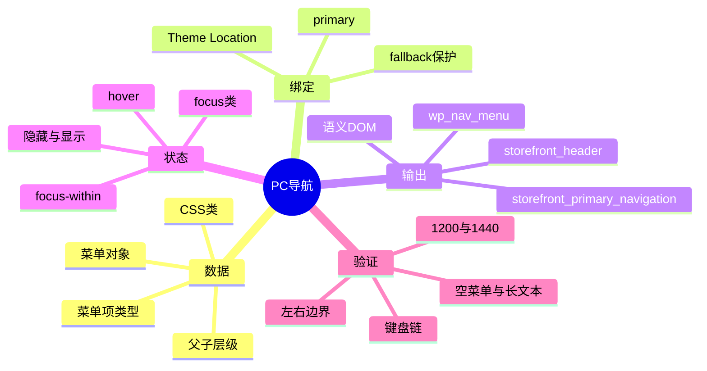
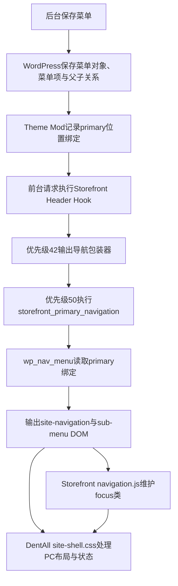

# Day32 WordPress实战：原生菜单与Storefront下拉机制

> [!summary] 先记结论
> WordPress导航不是一排写死的链接，而是一条完整链路：后台菜单树保存内容和层级，Theme Location把树插入主题槽位，Storefront用`wp_nav_menu()`生成语义DOM，父主题脚本维护键盘焦点状态，子主题CSS只负责视觉和响应式。D32复用这条链，因而只改CSS和缓存版本，也能让非技术人员继续在后台维护菜单。

## 相关笔记

- 学习索引：[[WordPress实战笔记索引]]
- 对应项目笔记：[[../Day32-PC主导航与一级下拉|Day32-PC主导航与一级下拉]]
- 前置学习笔记：[[Day31-四端设计稿还原与组件拆解]]
- 后续实践：D33手机抽屉与小屏Focus管理；笔记完成后显式互链

> [!check] 双向链接状态
> 本笔记链接D32项目笔记；D32项目笔记反向链接本笔记；[[WordPress实战笔记索引]]登记本笔记；Day31学习笔记链接本笔记。

## 今日学习成果

- [ ] 我能解释菜单项、菜单树、Theme Location和前台DOM为什么是四个不同概念；完成费曼自测后勾选。
- [ ] 我能从`storefront_header` Hook追到`wp_nav_menu()`和`.focus`状态，并说明D32为什么不需要新PHP或JavaScript；完成源码复演后勾选。
- [ ] 我能在Local独立创建一个TEST菜单、绑定Primary、形成一级子项，并用鼠标与键盘验证显示、关闭和边界；本人复演后勾选。

## 真实项目场景与范围

D31已经完成公告、品牌、搜索、Account和Cart主行，但导航仍使用父主题原始外观。D32要满足两个同时存在的要求：

1. Website Manager以后可以从WordPress后台维护菜单内容、顺序和层级；
2. PC端要接近设计稿，包含蓝色`Shop by Categories`入口和一级下拉，同时不提前实现手机抽屉或Mega Menu。

最终选择是“原生菜单数据＋Storefront公开输出＋子主题最小CSS”。用户在Local创建并保存TEST菜单，代码不拥有菜单文案和URL。

## 整体模型：商场导视系统

把导航想成商场的导视系统：

| 记忆宫殿中的实体 | WordPress真实概念 |
|---|---|
| 导视牌目录 | 一个Nav Menu对象 |
| 每张目的地卡片 | 一个菜单项；可指向Page、分类、产品分类或自定义URL |
| 卡片的缩进 | 父子关系；本轮只使用一级子项 |
| 墙上的“主入口”卡槽 | Theme Location `primary` |
| 安装工人 | Storefront的`storefront_primary_navigation()`与`wp_nav_menu()` |
| 访客走近时亮起的牌 | Hover、键盘Focus及父`li.focus`状态 |
| DentAll视觉规范 | 子主题`site-shell.css` |

比喻对应的技术事实是：菜单数据与主题位置分开保存。同一菜单树可以被绑定到一个位置；主题只请求位置，不应硬编码某个菜单ID。换主题时，Theme Location名称和DOM可能变化，但菜单数据仍由WordPress管理。

## 思维导图



## 请求生命周期与调用链



实际父主题Hook位置在：

- `storefront-template-hooks.php`：`storefront_primary_navigation_wrapper`为优先级42，`storefront_primary_navigation`为50，关闭包装器为68；
- `storefront-template-functions.php`：`storefront_primary_navigation()`内部调用`wp_nav_menu()`读取`primary`；
- `navigation.js`：焦点进入Header菜单链接时给父`li`添加`.focus`，离开当前菜单组时移除其他`.focus`。

## 核心概念卡

### 1. Menu与Theme Location不是一回事

- Menu保存链接树；`TEST D32 PC Navigation`就是一棵树。
- Theme Location是主题声明的槽位；本轮使用`primary`。
- 后台“显示位置”把两者绑定。前端调用位置而不是菜单名称，所以未来可以换一棵树而不用改模板。

### 2. 顶级项由缩进决定

在`外观 → 菜单`右侧结构中，项目位于最左侧就是顶级项；向右缩进一级就是上一顶级项的子项。它不是在“页面”面板中单独创建的内容类型。

### 3. 不同菜单项类型拥有不同真相源

- Page菜单项由Page对象维护URL；
- 产品分类菜单项由WooCommerce的`product_cat`术语维护URL；
- 自定义链接由菜单项自身保存URL，适合TEST骨架或外部地址，但需要手动治理链接变化。

D32让三个分类子项使用原生产品分类，让其URL不依赖手写；其他尚无正式页面的入口暂用明确的TEST自定义链接。

### 4. `fallback_cb=false`是空菜单保护

WordPress默认可能在未绑定菜单时回退为页面列表。DentAll子主题已有Filter将Primary与Handheld的`fallback_cb`设为`false`，避免正式站点因误解绑而把全部页面暴露成导航。CSS还进一步把留白放在真实`.primary-navigation`上，使空位置不会留下PC空白带。

### 5. Hover不等于键盘可用

鼠标用`:hover`，Storefront脚本为键盘路径添加`.focus`，现代浏览器还提供`:focus-within`。D32把三个入口合并为同一显示合同：

```css
/* 项目代码节选，完整规则见site-shell.css。 */
.menu > li:hover > .sub-menu,
.menu > li.focus > .sub-menu,
.menu > li:focus-within > .sub-menu {
	opacity: 1;
	visibility: visible;
	pointer-events: auto;
}
```

这里没有复制父主题JavaScript。若只写`:hover`，Tab进入子项时菜单可能不可见；若只写`.focus`，又会把CSS过度绑定到单一脚本实现。

### 6. 隐藏状态需要同时考虑视觉与点击

D32隐藏下拉时同时使用`opacity:0`、`visibility:hidden`和`pointer-events:none`：

- `opacity`负责视觉过渡所需状态；
- `visibility`阻止隐藏内容被视觉命中；
- `pointer-events`明确阻止鼠标点击。

键盘是否可达仍由DOM顺序和父主题Focus机制验证，不能只看计算样式。

## 项目真实代码与入口

### 文件职责

| 文件 | 负责什么 | D32是否修改 |
|---|---|---|
| `app/public/wp-content/themes/storefront/inc/storefront-template-hooks.php` | 把导航包装器和输出函数挂到Header | 否，只读父主题源码 |
| `app/public/wp-content/themes/storefront/inc/storefront-template-functions.php` | 使用`wp_nav_menu()`输出Primary与Handheld DOM | 否，只读父主题源码 |
| `app/public/wp-content/themes/storefront/assets/js/navigation.js` | Toggle、键盘`.focus`及触屏阻断逻辑 | 否，继续复用 |
| `app/public/wp-content/themes/dentall/inc/storefront-hooks.php` | 既有菜单fallback保护和D31 Header编排 | 否，D32无需PHP |
| `app/public/wp-content/themes/dentall/assets/css/site-shell.css` | PC显示条件、布局、分类按钮、下拉与状态 | 是 |
| `app/public/wp-content/themes/dentall/style.css` | 主题元数据与缓存版本 | 是，版本升至0.10.0 |

### 入口追踪方法

1. 在后台查看`外观 → 菜单 → 管理位置`，确认Primary绑定的菜单。
2. 前台DevTools检查`#site-navigation`，确认`.primary-navigation`、`ul.menu`、`.menu-item-has-children`和`.sub-menu`。
3. 在父主题Hook文件搜索`storefront_primary_navigation`，确认输出优先级。
4. 在函数文件追到`wp_nav_menu( 'theme_location' => 'primary' )`。
5. 在`navigation.js`搜索`classList.add( 'focus' )`，确认键盘状态来源。
6. 在子主题CSS检查1200px媒体查询及计算样式，不修改父主题源码。

## WordPress后台保存的安全与数据边界

本轮没有自定义保存端点。WordPress核心后台负责登录、权限、Nonce、字段清洗和菜单持久化；用户以有菜单管理权限的账号操作。若未来自建菜单同步工具，仍必须单独实现Capability、Nonce、输入校验、URL清洗、审计与回滚，不能因为原生后台安全就假设自定义端点也安全。

菜单变更会写入Local数据库：菜单对象、菜单项Post/Meta、层级与Theme Location绑定。它不会自动修改目标Page、产品分类、商品或订单。删除菜单项只删除导航引用，不等于删除目标内容。

## URL、SEO、缓存和交易影响

- URL/SEO：导航会形成内部链接并影响抓取路径；D32的重复`/shop/`和`/`仅为TEST，不冻结正式信息架构。正式替换时要检查404、301、Canonical、当前项和Sitemap边界。
- 缓存：菜单保存后页面缓存可能保留旧HTML；本轮Local没有生产缓存。CSS改变通过主题`0.10.0`更新查询参数。
- 性能：复用既有CSS请求，没有新JS、远程请求或查询代码；CSS增加4927字节，未测量前不能宣称零影响。
- 交易：菜单只改变入口，不改变商品、价格、库存、购物车、结账、支付或订单数据。

## 四端与异常状态

| 状态 | D32结果 | 后续 |
|---|---|---|
| 390/768/1024/1199 | PC导航隐藏，无横向溢出 | D33/D34实现对应导航方式 |
| 1200/1440 | 9个顶级项显示，按钮留白与无分隔线符合设计证据 | 持续回归 |
| 键盘进入子项 | 父项保持打开，子项有3px可见Focus | 已通过 |
| 离开菜单组 | 下拉关闭 | 已通过 |
| 右侧下拉 | 向左展开且不越界 | 已通过 |
| 空Primary | 不回退页面列表，不留下16px空带 | 已静态复核 |
| 长无空格文本 | 允许收缩与折行 | 已静态复核 |
| Loading/Error | 菜单随PHP同步输出，无独立异步状态；失败走页面错误或空输出 | 不制造假Loading |
| 缺图/售罄/不可购买 | 导航不输出商品媒体或交易状态 | 不适用，留商品页面验收 |
| 真实触屏 | 未在物理设备验证首击/次击 | D33/D34 |
| 正式当前项 | 重复TEST URL不适合作证据 | 正式URL后复验 |

## 用DevTools安全微调

1. 在Elements选中`.storefront-primary-navigation`，查看Computed中的`border-*`，确认设计稿要求的分隔线为0。
2. 选中`.primary-navigation`，临时调整`padding-block`观察分类按钮上下留白；最终应回到`--dentall-space-8`或对应源码规则修改。
3. 用`:hov`强制父`li:hover`，检查下拉位置、阴影和左右边界。
4. 不依赖强制状态完成键盘验收；关闭强制状态后真实按Tab、Shift+Tab复演。
5. 修改完成后回到子主题源码，刷新`ver`并复验1200/1440及关联页面；DevTools临时值不算交付。

## 常见误区与排错顺序

### 误区1：页面列表里没有TEST，就无法创建菜单项

页面面板只列Page。TEST如果是自定义入口，应使用“自定义链接”；如果是产品分类，应展开“产品类别”。菜单项类型不等于Page。

### 误区2：下拉不显示就立刻写JavaScript

先检查：是否真的形成父子缩进、父`li`是否有`menu-item-has-children`、`.sub-menu`是否存在、父主题CSS是否覆盖`display/visibility`、键盘时是否出现`.focus`。D32问题由CSS级联解决，不需要新增脚本。

### 误区3：用`:nth-last-child()`判断下拉方向

菜单顺序由后台可编辑，基于“倒数第几个”的规则会随运营排序失效。D32使用业务类`dentall-menu-categories`作为左侧特殊入口，其余下拉统一向左展开；若未来分类项允许移动，仍要重新验证左右边界。

### 误区4：用边框制造层次

设计稿证据优先。D32最终导航靠白色空间和蓝色分类按钮分层，边线计算值为0；不应为了“看起来像区域”自行增加分隔线。

### 排错顺序

1. 后台菜单树和Primary绑定；
2. 前台DOM是否输出正确层级；
3. 父主题默认宽度和定位是否覆盖子主题；
4. 计算样式、媒体查询与选择器权重；
5. 真实Hover、Tab、Shift+Tab；
6. 390～1440溢出和五个代表页面；
7. 最后才考虑是否真的缺少脚本或模板能力。

## 动手练习

1. 在Local复制一个TEST菜单，不绑定任何位置，观察它不会出现在Primary；再绑定后刷新验证。完成后恢复原绑定。
2. 新建一个很长的TEST自定义链接文字，观察1200与1440的折行边界；不要保存到正式菜单。
3. 用键盘从分类父项进入全部子项，再离开，记录父`li`的`.focus`变化。
4. 暂时在DevTools取消`.primary-navigation`的8px上下内边距，对比设计稿后恢复；说明为什么这不是按钮自身的`margin`。

## 掌握标准

- 能解释菜单数据、Theme Location、`wp_nav_menu()`、DOM和CSS的职责边界；
- 能不改父主题，在子主题中定位并修正级联问题；
- 能用后台创建父子结构，并用键盘、边界、空菜单和长文本验证；
- 能说明菜单变化对内部链接、缓存和发布流程的影响；
- 能区分D32已验证的PC路径与D33/D34尚未验证的移动/触屏路径。

## 费曼自测

请由学习者自行回答，不能由Agent代填：

1. 为什么菜单名和Primary位置不是同一个东西？
2. 一个菜单项怎样从顶级项变成子项，数据库和前台DOM分别发生什么变化？
3. `fallback_cb=false`解决什么风险？CSS为何还要处理空包装器？
4. 为什么D32同时使用`:hover`、`.focus`和`:focus-within`？
5. 为什么右侧下拉不能用“倒数第几个菜单项”决定展开方向？
6. 重复TEST URL为什么会让当前项高亮不可信？
7. 如果手机导航在D33启用，为什么还必须同步恢复Skip Link？

## 间隔复习

| 日期 | 复习任务 | 状态 |
|---|---|---|
| 2026-08-28（D+1） | 不看笔记画出后台保存到前台显示的调用链 | 待完成 |
| 2026-08-30（D+3） | 在Local复演父子菜单与键盘链 | 待完成 |
| 2026-09-03（D+7） | 解释空菜单、长文本、左右边界三个异常状态 | 待完成 |
| 2026-09-10（D+14） | 对照D33/D34说明PC与移动导航的共同DOM和不同状态 | 待完成 |

## 收尾总结

D32的关键不是写出一个蓝色按钮，而是让四层职责保持清晰：WordPress管理链接树，Theme Location决定放置位置，Storefront输出并维护基础交互状态，DentAll子主题负责设计与响应式。这样后续业务方替换菜单内容时不需要改代码，D33/D34也能在同一语义结构上渐进增强。

## 向AI提问的高效模板

```text
请基于以下真实环境排查WordPress菜单问题：
- WordPress / WooCommerce / 父主题 / 子主题版本：
- 绑定的Theme Location：
- 菜单项类型与父子结构：
- 前台实际DOM片段：
- 计算样式与媒体查询：
- 鼠标、键盘、触屏分别出现的现象：
- 已验证页面与宽度：
只提出最小修复；不得修改核心文件，并说明URL、SEO、缓存和回滚影响。
```

## 其他项目的变种

- 经典WordPress主题：寻找`register_nav_menus()`、`wp_nav_menu()`、Hook或模板入口，再决定用子主题CSS、Hook还是最小模板覆盖。
- 区块主题：菜单可能由Navigation Block和Site Editor管理，具体保存结构与输出机制需按实际版本验证，不能照搬经典主题类名。
- Headless/React商城：CMS仍应拥有导航数据，前端通过API渲染；还要额外处理请求失败、缓存失效、路由预取和客户端Focus状态。

## 可复用核心思想

### 跨平台不变量

- 导航是“内容树＋显示位置＋渲染组件＋交互状态”，不是一串写死链接。
- 后台可编辑顺序意味着前端规则不能依赖脆弱的位置编号；稳定业务语义比`:nth-child()`更可靠。
- 视觉正确和可操作性必须分别取证：截图证明空间与颜色，真实键盘/触屏证明状态路径。

### WordPress/WooCommerce当前实现

- `wp_nav_menu()`读取Theme Location，Storefront负责DOM与`.focus`机制，DentAll只在子主题CSS中渐进增强。
- 原生Page/产品分类菜单项能跟随对象URL；自定义链接由运营自行维护，正式发布前必须复核目标与SEO状态。
- 本轮没有自定义保存逻辑；原生后台的权限和Nonce保护不能自动迁移到未来自建工具。

### Shopify或其他平台

- Shopify也存在后台导航数据与主题渲染的职责分离，但具体菜单对象、Liquid访问方式、层级限制、市场URL和发布行为本轮未查验，统一标记为待验证。
- 迁移项目时保留验收方法：结构、边界、键盘/触屏、正式URL和缓存；不要迁移WordPress专属Hook或类名。
