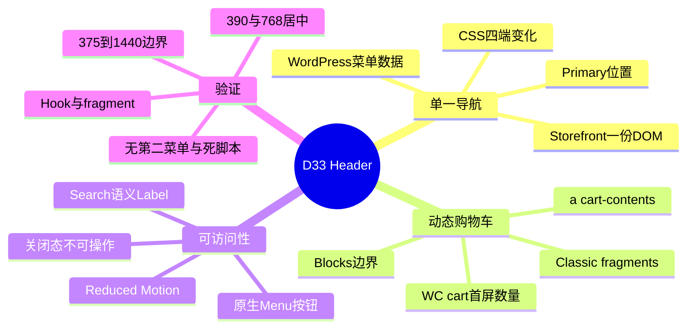
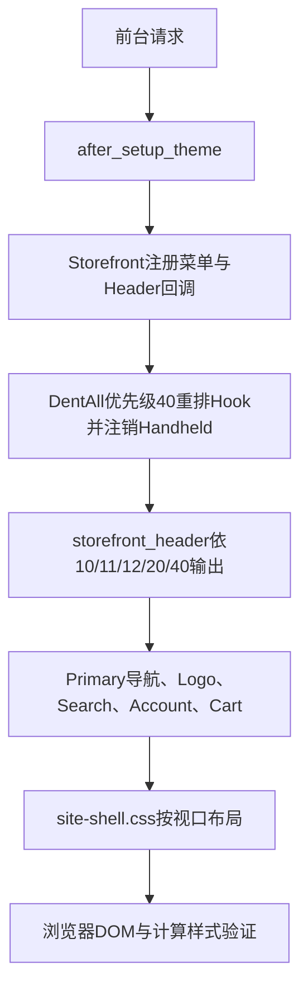
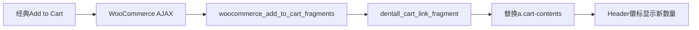

# Day33 WordPress实战：单一导航DOM与购物车Fragment

> [!summary] 先记结论
> 响应式Header不需要复制四套HTML：WordPress只保存一棵Primary菜单，Storefront输出一套语义DOM和切换状态，DentAll用Hook调整它在Header中的顺序，再用Mobile First CSS改变手机、平板和PC的布局。购物车数字也不能写死，它要从`WC()->cart`生成首屏，并通过fragment更新经典加购路径；Cart Blocks是另一套状态事件，必须单独验收。

## 相关笔记

- 学习索引：[[WordPress实战笔记索引]]
- 对应项目笔记：[[../Day33-手机与平板竖屏Header|Day33-手机与平板竖屏Header]]
- 前置学习笔记：[[Day32-原生菜单与Storefront下拉机制]]
- 同主题知识：[[Day31-四端设计稿还原与组件拆解]]
- 后续学习笔记：[[Day34-CSS断点级联与可访问状态]]
- 后续商品搜索请求：[[Day47-WooCommerce商品搜索请求与模板复用]]

> [!check] 双向链接状态
> 本笔记链接D33项目笔记；D33项目笔记反向链接本笔记；[[WordPress实战笔记索引]]登记本笔记；D32学习笔记链接本笔记。

## 今日学习成果

- [ ] 我能解释为什么“同一菜单数据”和“同一前台DOM”不是同一件事，以及为什么D33还要注销Handheld位置。
- [ ] 我能从`after_setup_theme`、`storefront_header`和`woocommerce_add_to_cart_fragments`追踪Header菜单与购物车数量的输出顺序。
- [ ] 我能在Local验证一棵Primary菜单、动态数量、经典fragment、关闭态键盘边界及四端无溢出，并说清Cart Blocks没有被当前证据覆盖的部分。

## 真实项目场景

### 今天解决了什么问题

D32已经在PC显示Primary菜单，但手机仍依赖Storefront Handheld Footer，Header的Logo、Account、Cart和搜索也没有按手机/平板设计稿形成整体关系。D33需要在“不新增JavaScript、只做Local、一级子项常显”的边界内，让手机和平板竖屏复用同一棵Primary菜单DOM，同时让购物车徽标显示真实数量。

### 学习范围

- 本篇要掌握：Theme Location与DOM数量、Hook优先级、经典fragment、Mobile First状态、可访问Label。
- 本篇明确不展开：Cart Blocks事件桥接、焦点陷阱、模态抽屉、二级以上手风琴、搜索结果算法。
- 项目真实入口：`inc/storefront-hooks.php`、`inc/setup.php`、`assets/css/site-shell.css`。
- 验证环境：Local的WordPress 7.0.4、WooCommerce 11.0.0、Storefront 4.6.2和DentAll 0.11.10。

## 先建立整体模型

### 一句话模型

后台保存一棵导航树，主题在生命周期内把它放进一个Header插槽，CSS根据视口改变同一结构的布局；购物车则从服务端Session生成真实初值，再由与当前交互体系匹配的前端事件刷新。

### 记忆宫殿：商场总导视牌与电子计数器

把Header想成商场入口：中央只有一块总导视牌，手机把它折叠到按钮后，PC把它横向展开；不能为了不同门宽复制四块内容可能不一致的牌。购物车徽标像入口电子计数器，开门时先从仓库系统读取，顾客加货后还要收到正确事件才会刷新。

### 比喻对应回真实机制

| 记忆对象 | 真实技术对象 | 不能混淆的边界 |
|---|---|---|
| 总导视牌内容 | WordPress Nav Menu term及菜单项 | 数据只有一棵不自动保证前台只输出一份DOM |
| 安装插槽 | Primary Theme Location | Handheld是另一个插槽，误绑定可能再输出一棵树 |
| 折叠/展开机构 | Storefront `navigation.js`与`.toggled` | D33复用原生状态，不新增模态行为 |
| 不同门宽的排版 | Mobile First CSS与媒体查询 | CSS改变表现，不复制业务内容 |
| 电子计数器初值 | `WC()->cart->get_cart_contents_count()` | 它是当前请求/Session的服务端事实 |
| 加货通知线 | 经典WooCommerce fragments | Cart Blocks Store API是另一条通知线，不自动等价 |

## 思维导图



最重要的主干是：先保证结构和状态源只有一个真相，再用布局和事件适配不同端。

## 请求与生命周期调用链



购物车经典刷新链：



- 触发条件：前台主题请求；经典AJAX加购时另触发fragment Filter。
- 加载入口：子主题`functions.php`加载`setup.php`与`storefront-hooks.php`。
- 执行顺序：父主题先注册默认行为，子主题在更晚优先级移除并重新挂载。
- 输入数据：WordPress Primary菜单位置、WooCommerce当前Cart Session。
- 输出或副作用：Header HTML、CSS/父主题脚本队列；不写数据库。
- 可观察证据：Hook优先级、菜单位置、HTML数量、fragment键、徽标值、HTTP资源。

## 核心概念卡

| 概念 | 准确定义 | DentAll真实例子 | 常见误区 | 如何验证 |
|---|---|---|---|---|
| Theme Location | 主题声明的菜单显示插槽 | `primary`绑定term 25 | 把菜单名当成位置 | `get_registered_nav_menus()`与`get_nav_menu_locations()` |
| 单一DOM | 页面只输出一个承担该职责的结构 | `#site-navigation`数量为1 | 只保存一棵菜单就以为DOM必然唯一 | 查询页面ID、Handheld类与菜单包装器 |
| Hook优先级 | 同一Action内回调执行先后 | 导航10/11/12，Cart 40 | 只调用`remove_action()`却不匹配优先级/时机 | 运行时检查Hook回调 |
| Fragment | AJAX响应中用于局部替换的HTML映射 | `a.cart-contents` | 误以为所有Blocks事件都会触发经典fragment | 检查响应键并实测触发路径 |
| Fragment存储键 | 浏览器保存经典fragment HTML的命名空间 | 固定追加`_dentall_header_v1` | 改了服务端DOM却继续恢复旧缓存 | 在旧缓存会话刷新并检查本地化参数 |
| 可访问名称 | 辅助技术识别控件的语义文本 | 搜索`Search for:` Label | 用placeholder完全替代Label | Accessibility Tree与裁剪尺寸 |

## 项目实战代码

### 涉及文件

- `app/public/wp-content/themes/dentall/inc/storefront-hooks.php`：Header输出、Hook顺序、Cart链接与fragment。
- `app/public/wp-content/themes/dentall/inc/setup.php`：全站壳层样式及死脚本dequeue。
- `app/public/wp-content/themes/dentall/assets/css/site-shell.css`：一套DOM的Mobile First布局与状态。
- `app/public/wp-content/themes/dentall/style.css`：主题元数据和CSS缓存版本。

### 从入口开始追踪

1. `functions.php`加载两个职责明确的inc文件。
2. Storefront先在`after_setup_theme`注册菜单位置与Header回调。
3. `dentall_configure_storefront_shell()`在优先级40注销Handheld，并把Primary包装器/导航/关闭包装器重挂到Header 10/11/12。
4. Search仍由父主题原生回调输出；DentAll在40输出Account与Cart。
5. `site-shell.css`把同一DOM在手机/平板变为两行Grid，在PC恢复横向导航。

### 关键代码片段一：只保留Primary插槽

源文件：`inc/storefront-hooks.php`。

```php
unregister_nav_menu( 'handheld' );

remove_action( 'storefront_header', 'storefront_primary_navigation_wrapper', 42 );
remove_action( 'storefront_header', 'storefront_primary_navigation', 50 );
remove_action( 'storefront_header', 'storefront_primary_navigation_wrapper_close', 68 );

add_action( 'storefront_header', 'storefront_primary_navigation_wrapper', 10 );
add_action( 'storefront_header', 'storefront_primary_navigation', 11 );
add_action( 'storefront_header', 'storefront_primary_navigation_wrapper_close', 12 );
```

真实作用不是“创建一个新菜单”，而是关闭不需要的第二插槽，并改变父主题同一输出回调的位置。

### 关键代码片段二：数量来自真实Cart

源文件：`inc/storefront-hooks.php`。

```php
$item_count = WC()->cart->get_cart_contents_count();

<span class="dentall-cart-count" aria-hidden="true">
	<?php echo esc_html( $item_count ); ?>
</span>
```

数量输出使用HTML上下文转义；可访问名称另用国际化单复数文本生成，徽标不重复朗读。

### 关键代码片段三：经典fragment保持同一替换目标

```php
function dentall_cart_link_fragment( $fragments ) {
	ob_start();
	dentall_cart_link();
	$fragments['a.cart-contents'] = ob_get_clean();

	return $fragments;
}
```

Filter必须返回完整数组，不能只返回新HTML。选择器与页面上的链接一致，经典AJAX才能替换正确节点。

### 关键代码片段四：迁移旧浏览器fragment

```php
function dentall_cart_fragment_name( $fragment_name ) {
	return $fragment_name . '_dentall_header_v1';
}
```

这里使用固定“标记结构版本”而不是主题版本号。若每次CSS微调都改变存储键，会制造不必要的刷新和废弃键；只有fragment HTML契约变化时才升级后缀。

### 关键代码片段五：Reduced Motion

```css
@media (prefers-reduced-motion: reduce) {
	.storefront-primary-navigation .primary-navigation {
		transition: none;
	}
}
```

它只取消视觉过渡，不删除`.toggled`控制的可见性和可操作状态。

### 运行证据

- PHP lint、CSS 102/102对花括号、0个`!important`、`git diff --check`通过。
- 390/768的实际Logo中心偏差0，375/390/414/768/1024/1440无横溢出。
- 页面`#site-navigation=1`、Handheld导航/底栏为0；运行时菜单映射仅Primary term 25。
- 空Cart输出0；内存态12件输出12；fragment只返回自定义Header链接和Mini Cart，不返回Footer fragment。
- Home与Shop实际下发的`fragment_name`以`_dentall_header_v1`结尾；WooCommerce只按该精确键读写`sessionStorage`。仅有D31旧键时会进入`No fragment`分支并请求一次新fragment，旧HTML不能再覆盖新徽标。
- HTTP加载`site-shell.css?ver=0.11.10`，文件字节数与SHA-256和磁盘一致；Handheld Footer脚本为0。
- 这些证据不能证明真实物理触屏，也不能证明Cart Block同页Store API变更会自动刷新经典Header。

## 职责边界

| 层级 | 本主题中负责什么 | 不应该负责什么 |
|---|---|---|
| WordPress Core | 保存菜单树、菜单位置API、Hook系统 | 不修改核心文件 |
| WooCommerce | Cart Session、数量API、经典fragment | 不绕过API读取内部Session或表 |
| Storefront父主题 | Header Hook、Primary DOM、原生切换脚本、Mini Cart | 不直接改父主题文件 |
| DentAll子主题 | 重排公开Hook、最小Cart展示结构、响应式CSS | 不承载订单/库存核心规则 |
| `dentall-core` | 本主题无新增职责 | 不放纯Header展示代码 |
| 数据库 | 保留既有Primary菜单绑定 | D33不写菜单或商品数据 |
| 浏览器 | 布局、切换状态、fragment替换 | 不把静态HTML当成所有运行事件证据 |

## Hook、API与资源机制详解

| 机制 | 名称/入口 | 时机 | 输入/输出 | 本次边界 |
|---|---|---|---|---|
| Action | `after_setup_theme` | 父主题默认注册后，DentAll优先级40 | 重排回调、注销菜单位置 | 必须晚于父主题才能移除成功 |
| Action | `storefront_header` | 前台Header渲染 | 输出导航、品牌、Search、Account、Cart | 输出顺序也影响DOM与键盘顺序 |
| Filter | `woocommerce_add_to_cart_fragments` | 经典AJAX加购响应 | 输入并返回fragment数组 | 不等同Cart Blocks Store事件 |
| Filter | `woocommerce_cart_fragment_name` | 本地化经典fragment参数 | 返回D33固定版本存储键 | HTML契约变化时才升级后缀 |
| Enqueue | `wp_enqueue_scripts` | 父主题20后，DentAll 40 | 加载壳层CSS、dequeue死脚本 | 只移除已无DOM消费者的资源 |
| API | `WC()->cart->get_cart_contents_count()` | Cart已初始化的前台请求 | 返回商品数量总和 | 不是订单数量或商品行数 |

## 安全、数据与站点影响

| 检查面 | 本次结论 | 证据或待验证项 |
|---|---|---|
| 输入清洗与验证 | 无新增用户输入处理 | Search由WooCommerce原生表单负责 |
| Capability/Nonce | 前台只读输出，不适用 | 没有后台动作或持久化操作 |
| 输出转义 | URL、属性、文本按上下文转义 | `esc_url`、`esc_attr`、`esc_html` |
| 国际化 | Cart与数量单复数可翻译 | `__()`、`_n()`、`esc_html_e()` |
| 数据库写入 | 无 | CLI动态数量测试只在内存态 |
| URL与SEO | 无URL/SEO字段变化 | TEST菜单URL仍按D32治理 |
| 缓存 | 主题版本升至0.11.10；fragment使用D33新存储键 | CSS查询参数刷新；旧片段不再覆盖新DOM；未测量性能变化 |
| 支付、物流与订单 | 无变化 | 只读Cart数量，不改交易数据 |
| 部署与回滚 | 仅Local | 回滚4个运行文件即可；非Local未部署 |

## 动手练习

### 练习一：只读观察一棵菜单

- 目标：区分菜单数据、位置和DOM。
- 操作：读取`get_registered_nav_menus()`、`get_nav_menu_locations()`，再数页面`#site-navigation`。
- 预期：注册Primary/Secondary，映射只有Primary term 25，DOM数量1。
- 实际证据：D33运行时符合预期，Handheld为0。

### 练习二：Local内存态数量

- 改动：在WP-CLI当前进程把Cart数量设为代表值12，只渲染`dentall_cart_link()`并立即结束。
- 风险边界：不保存商品、Session、订单或数据库。
- 验证：徽标为12，`aria-label`使用复数。
- 回滚：进程结束即消失；再次以空Session读取应为0。

### 练习三：故障推演

- 假设症状：Cart Block页把数量从1改成2，但Header仍显示1。
- 可能原因：Blocks走Store API事件，经典`wc_fragment_refresh`没有触发。
- 第一项检查：同时记录Network中的Store API请求、DOM事件和fragment请求。
- 为什么先查它：先确认状态源和通知链，再决定是否需要最小JS桥接；不能用CSS修复数据同步。

## 常见误区与排错顺序

| 现象或误区 | 可能原因 | 推荐检查顺序 | 最小验证方法 |
|---|---|---|---|
| Logo轨道居中但图片仍偏 | 链接或图片自身没有占满/自动外边距 | 1. 测图片矩形；2. 测品牌轨道；3. 查margin | 比较图片中心与`clientWidth/2` |
| 页面出现两套菜单 | Primary与Handheld都绑定或都输出 | 1. 查位置映射；2. 数DOM；3. 查Hook | `get_nav_menu_locations()`＋DOM计数 |
| 关闭面板仍可Tab进入 | 只设opacity，未取消可见/交互 | 1. 查visibility；2. pointer-events；3.真实Tab | 关闭态计算样式和键盘链 |
| 徽标首屏正确但改数量不刷新 | 交互使用另一套状态事件 | 1. 区分Classic/Blocks；2. 查网络；3. 查事件 | 分别实测经典加购和Cart Block改量 |
| 去掉可见Label后无可访问名称 | 同时删除语义Label，只剩placeholder | 1. 查HTML Label；2. Accessibility Tree | 确认Label裁剪而非删除 |

## 掌握标准

- [ ] 不看笔记，能在2分钟内讲清“菜单数据→位置→DOM→CSS状态”的因果链。
- [ ] 能指出`after_setup_theme`、`storefront_header`和fragment Filter的真实入口。
- [ ] 能解释为什么注销Handheld位置与移除Footer脚本不会创建新菜单。
- [ ] 能区分服务端Cart初值、经典fragment和Cart Blocks Store事件。
- [ ] 能在Local测量Logo真实几何中心并验证关闭态不可操作。
- [ ] 能说明本轮对数据、URL、SEO、缓存、交易和部署的真实影响。

当前掌握度：初识，待本人完成费曼自测与复演。

## 费曼测试题

1. 为什么WordPress后台只有一棵菜单数据，前台仍可能输出两棵DOM？
2. `after_setup_theme`优先级40为什么能注销Storefront先注册的Handheld位置？如果顺序反过来会怎样？
3. 为什么D33移动菜单可以不新增JavaScript？哪些行为仍明确没有实现？
4. `WC()->cart->get_cart_contents_count()`、`woocommerce_add_to_cart_fragments`和Cart Blocks Store API各负责哪一段？
5. 为什么placeholder不能取代搜索Label？本轮怎样满足“看不到Search for:”和可访问性两项要求？
6. Logo品牌轨道中心与实际图片中心为什么可能不同？你会收集哪三个矩形数据？
7. 若把实现迁移到其他主题或Shopify，哪些原则能保留，哪些Hook/事件必须重新查证？

### 我的费曼答案与纠正

待学习者本人作答。每题按`通过`、`含糊`或`答错`记录，并回到对应章节纠正，不能由Agent代填。

### 自测评分

| 分数 | 标准 |
|---:|---|
| 0 | 无法解释，或只能猜术语 |
| 1 | 能说定义，但说不清因果、边界和证据 |
| 2 | 能用通俗语言解释，并准确对应技术机制与项目证据 |

总分：尚未自测 / 14；存在0分题时不提升掌握度。

## 间隔复习记录

| 复习节点 | 计划日期 | 完成 | 暴露的问题 | 修正位置 |
|---|---|---|---|---|
| D+1 | 2026-08-28 | [ ] | 复习后记录 | 复习后记录 |
| D+3 | 2026-08-30 | [ ] | 复习后记录 | 复习后记录 |
| D+7 | 2026-09-03 | [ ] | 复习后记录 | 复习后记录 |
| D+14 | 2026-09-10 | [ ] | 复习后记录 | 复习后记录 |

## 收尾总结

- 我今天真正理解了：响应式不是复制页面，而是把数据、DOM、状态和布局分层后复用。
- 我仍然容易混淆：经典fragment与Cart Blocks事件都在更新购物车，但不是同一条通知链。
- 下次遇到类似问题，我会先检查：真实DOM数量、Hook顺序、状态数据源、触发事件和可观察证据。
- 下一篇直接相关学习笔记：[[Day34-CSS断点级联与可访问状态]]。

## 后续如何向AI高效提问

```text
请基于以下真实WordPress/WooCommerce环境排查Header状态同步：
- WordPress / WooCommerce / 父主题 / 子主题版本：
- 页面使用Classic模板还是Cart/Checkout Block：
- Header Cart的服务端输出函数：
- 当前注册的fragment、Store API请求与浏览器事件：
- 预期数量、实际数量和最短复现步骤：
- DOM中菜单、Cart和重复入口数量：
- Local/Staging/Production边界：
请先区分首屏状态、经典fragment和Blocks事件，再给最小验证；未经确认不要新增依赖或改核心。
```

## 变种应用到其他项目

| 新场景 | 保持不变的原则 | 可能变化的实现 | 必须重新确认 | 最小验证 |
|---|---|---|---|---|
| 另一个Storefront子主题 | 单一DOM、公开Hook、真实Cart状态 | 已注册回调和CSS基线 | Storefront/Woo版本 | Hook与fragment运行时检查 |
| 其他经典WordPress主题 | 数据、位置、DOM、布局分层 | Header Hook和切换脚本 | 主题公开扩展点 | 一棵菜单与键盘链 |
| WordPress区块主题 | 单一内容源与状态源 | Navigation Block、模板部件、Interactivity API | 当前核心与块版本 | 编辑器保存与前台DOM |
| Headless商城 | 服务端初值和客户端状态必须一致 | REST/GraphQL、前端Store和路由 | 缓存与认证边界 | SSR hydration和事件测试 |
| Shopify或其他平台 | 单一菜单数据、真实购物车状态、几何/交互分层验收 | Liquid、Cart API、Section或主题事件 | 官方事件与发布模型，待验证 | 首屏、加购、改量、跨页刷新 |

## 可复用核心思想

### 跨平台不变量

- 响应式系统先统一内容源和语义结构，再让布局随视口改变；复制DOM会制造顺序、可访问性和维护分叉。
- 动态徽标的验收必须同时标注状态来源、初始渲染和刷新事件；“数字不是写死的”不等于“所有交互都实时同步”。
- 可见文案、placeholder和可访问名称是不同职责，视觉精简不能以丢失语义为代价。

### WordPress/WooCommerce当前实现

- WordPress菜单数据通过Primary Theme Location交给Storefront，DentAll在`after_setup_theme`重排公开Hook并注销Handheld位置；同一DOM用Mobile First CSS适配四端。
- WooCommerce首屏数量来自`WC()->cart`，经典AJAX通过`woocommerce_add_to_cart_fragments`替换`a.cart-contents`；Cart Blocks事件桥接明确留待D69。
- 本轮验证环境是Local的WordPress 7.0.4、WooCommerce 11.0.0、Storefront 4.6.2和DentAll 0.11.10，不把版本相关行为外推为所有站点事实。

### Shopify或其他平台的对应机制

- 其他平台同样需要“菜单内容源→主题渲染→响应式布局”和“购物车状态源→组件订阅→局部刷新”的链路；平台API、事件名、缓存和发布方式必须重新验证。
- Shopify Cart API、Section Rendering、主题事件及Navigation数据的具体对应关系本轮未实际验证，标记为待验证，不进入DentAll第一版实施范围。
