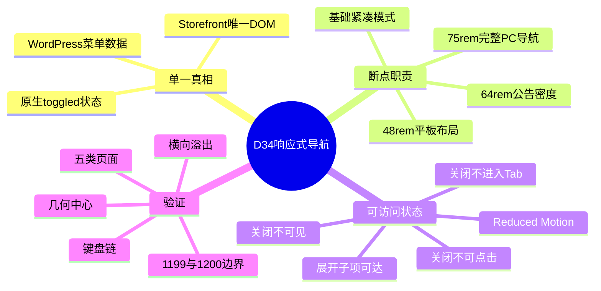
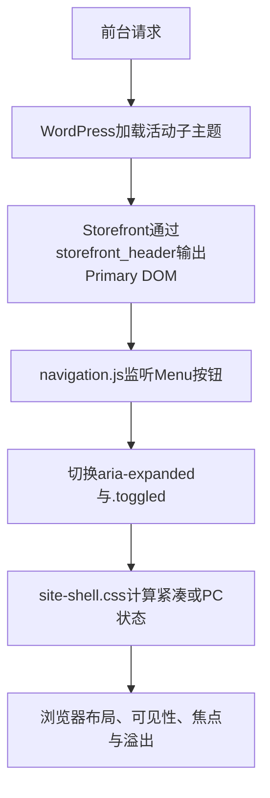

# Day34 WordPress实战：CSS断点级联与可访问状态

> [!summary] 先记结论
> 响应式断点不是“在某个数字换一张页面”，而是让同一语义DOM在内容需要时改变布局与交互模式。D34保留WordPress/Storefront输出的一棵Primary导航，只让紧凑Header持续到1199px，并在1200px切换PC导航；同时必须保证关闭态的每个后代都不可聚焦、不可点击，Reduced Motion也要覆盖实际发生动画的每一层。

## 相关笔记

- 学习索引：[[WordPress实战笔记索引]]
- 对应项目笔记：[[../Day34-平板横屏Header与断点收敛|Day34-平板横屏Header与断点收敛]]
- 前置学习笔记：[[Day33-单一导航DOM与购物车Fragment]]
- 同主题知识：[[Day32-原生菜单与Storefront下拉机制]]、[[Day31-四端设计稿还原与组件拆解]]
- 后续学习笔记：[[Day35-Storefront页脚Hook与菜单数据契约]]
- M4验收学习笔记：[[Day42-首页整链路验收与证据分层]]

> [!check] 双向链接状态
> 本笔记链接D34项目笔记；D34项目笔记反向链接本笔记；[[WordPress实战笔记索引]]登记本笔记；D33与D35学习笔记均与本笔记显式互链。

## 今日学习成果

- [ ] 我能解释为什么1024～1199的正确修复是收拢媒体查询职责，而不是复制一套“平板横屏导航”。
- [ ] 我能沿祖先面板、子菜单和链接追踪`visibility`、`opacity`、`pointer-events`与Tab顺序的差异。
- [ ] 我能在Local用边界宽度、计算样式、键盘链和HTTP资源证据验证断点，并说清真实设备仍需补什么。

## 真实项目场景

### 今天解决了什么问题

D33已经让手机与768px平板竖屏复用紧凑Header，D32则规定1200px开始显示完整PC导航。但D34盘点发现：原CSS在1024px先隐藏紧凑导航包装器，直到1200px才重新显示PC导航，因此1024～1199可能没有可用Primary入口。目标不是设计另一套横屏HTML，而是让既有紧凑模式连续覆盖到1199px。

### 学习范围

- 本篇要掌握：内容驱动断点、CSS级联、可访问关闭态、Reduced Motion、全站公共组件验证。
- 本篇明确不展开：新导航JavaScript、模态抽屉、Mega Menu、搜索结果、Cart Blocks状态桥接、Footer实现。
- 项目真实入口：`app/public/wp-content/themes/dentall/assets/css/site-shell.css`与`style.css`。
- 验证环境：仅Local；Staging和Production未部署。

## 先建立整体模型

### 一句话模型

WordPress与Storefront先输出同一棵菜单和同一开闭状态，DentAll再让CSS按视口决定它是紧凑面板还是横向导航；任何后代都不能越过祖先的关闭状态重新变成可交互对象。

### 记忆宫殿：商场入口的一扇伸缩门

把Primary导航想成商场唯一入口：窄门宽时把同一扇门折叠成按钮，门厅足够宽时把它完全展开。1024～1199不是再造第二扇门，而是让折叠门继续工作。门关闭时，门后每个小隔间也必须锁住；只把大厅灯关掉，却让隔间门仍可打开，就像`opacity:0`但链接仍可聚焦。

### 比喻对应回真实机制

| 记忆对象 | 真实技术对象 | 不能混淆的边界 |
|---|---|---|
| 唯一伸缩门 | `#site-navigation`唯一DOM | 不为四端复制四份菜单 |
| 门宽标记 | `48rem`、`64rem`、`75rem`媒体查询 | 断点是模式边界，不是设备型号清单 |
| 折叠开关 | Storefront Menu按钮与`.toggled` | D34没有新增JavaScript |
| 大厅灯 | `opacity` | 透明不代表不可聚焦或不可点击 |
| 门锁 | `visibility`与`pointer-events` | 仍需用真实Tab验证键盘顺序 |
| 减速开关 | `prefers-reduced-motion` | 要覆盖所有真实过渡，不只外层面板 |

## 思维导图



最重要的主干是：结构和状态源保持唯一，断点只改变表现；可见性、指针和键盘状态必须一起闭合。

## 请求与生命周期调用链



- 触发条件：Home、Shop、商品、Cart或Account等前台请求。
- 加载入口：子主题`functions.php`加载现有setup模块，后者enqueue `site-shell.css`。
- 执行顺序：WordPress/Storefront输出DOM与脚本；DentAll子主题CSS在父主题样式之后级联。
- 输入数据：当前Primary菜单、视口宽度、`.toggled`状态和用户Reduced Motion偏好。
- 输出或副作用：只改变布局与前端交互状态；不写数据库。
- 可观察证据：DOM数量、媒体查询命中、计算样式、`aria-expanded`、活动焦点、HTTP CSS哈希。

## 核心概念卡

| 概念 | 准确定义 | DentAll真实例子 | 常见误区 | 如何验证 |
|---|---|---|---|---|
| 内容驱动断点 | 内容或交互模式需要改变的阈值 | `75rem`开始完整9项PC导航 | 按“平板/电脑”名称机械切换 | 1199/1200边界与长文本溢出 |
| 级联职责 | 每个规则层只覆盖它负责的差异 | `64rem`只增加公告密度 | 一个断点顺手改Logo、导航、Account所有状态 | 阅读媒体块并查计算样式 |
| 可访问关闭态 | 隐藏内容不应可见、可点或进入键盘顺序 | 面板与子菜单均hidden/none | 只用`opacity:0` | DOM快照、Tab链与计算样式 |
| `.toggled` | Storefront原生导航展开类 | `<1200px`恢复面板和子菜单 | 把它当成模态Dialog状态 | 查看按钮`aria-expanded`与类名 |
| Reduced Motion | 尊重用户减少非必要动效的媒体特性 | 关闭面板、内层菜单与汉堡伪元素过渡 | 只给最外层`transition:none` | 强制偏好后读全部动画节点 |
| 缓存版本 | 让浏览器请求新的静态资源URL | 子主题`0.12.0`作为CSS版本参数 | 每个组件自造随机版本 | HTML资源URL与HTTP哈希 |

## 项目实战代码

### 涉及文件

- `app/public/wp-content/themes/dentall/assets/css/site-shell.css`：Header断点、导航开闭与Reduced Motion。
- `app/public/wp-content/themes/dentall/style.css`：主题元数据与CSS缓存版本。
- `app/public/wp-content/themes/dentall/inc/setup.php`：既有资源enqueue入口，本轮未修改。
- `app/public/wp-content/themes/dentall/inc/storefront-hooks.php`：既有Header DOM/Hook入口，本轮未修改。

### 从入口开始追踪

1. WordPress读取活动子主题元数据和`functions.php`。
2. 现有setup模块enqueue `site-shell.css`，版本来自子主题`style.css`。
3. Storefront在`storefront_header`输出一份Primary导航和原生Menu按钮。
4. `<1200px`时按钮驱动`.toggled`；`>=1200px`时CSS隐藏按钮并静态显示导航。
5. 浏览器把媒体查询、父主题规则和子主题规则级联为最终状态。

### 关键代码片段一：紧凑布局连续到1199

源文件：`assets/css/site-shell.css`。

```css
@media (min-width: 48rem) and (max-width: 74.999rem) {
	.site-header > .col-full {
		grid-template-areas:
			"navigation brand actions"
			"search search search";
		grid-template-columns: minmax(0, 1fr) minmax(0, 13.75rem) minmax(0, 1fr);
	}
}
```

两个等宽外侧轨道让中间品牌按可用视口几何居中；上限与`75rem`桌面增强相邻，避免中间空窗。

### 关键代码片段二：桌面模式只在1200开始

```css
@media (min-width: 75rem) {
	.site-header .storefront-primary-navigation .menu-toggle {
		display: none;
	}

	.storefront-primary-navigation .primary-navigation {
		position: static;
		opacity: 1;
		visibility: visible;
		pointer-events: auto;
	}
}
```

这里同时完成交互模式切换：不是只改变排列，还把按钮模式换成常显横向导航。

### 关键代码片段三：子菜单不能越过关闭态

```css
.storefront-primary-navigation .main-navigation ul.menu > li > .sub-menu {
	opacity: 1;
	visibility: hidden;
	pointer-events: none;
}

@media (max-width: 74.999rem) {
	.storefront-primary-navigation .main-navigation.toggled ul.menu > li > .sub-menu {
		visibility: visible;
		pointer-events: auto;
	}
}
```

子菜单只有在紧凑导航确实展开时才恢复交互；桌面媒体块随后重新定义下拉的Hover/Focus状态。

### 关键代码片段四：沿动画链关闭过渡

```css
@media (prefers-reduced-motion: reduce) {
	.storefront-primary-navigation .primary-navigation,
	.storefront-primary-navigation .primary-navigation ul.nav-menu,
	.site-header .storefront-primary-navigation .menu-toggle::before,
	.site-header .storefront-primary-navigation .menu-toggle::after,
	.site-header .storefront-primary-navigation .menu-toggle span::before {
		transition: none;
	}
}
```

它覆盖外层面板、Storefront内层菜单和Menu图标三条线，状态开闭本身仍保留。

### 运行证据

- 1199为紧凑菜单，1200为完整9项PC导航；390～1440只有一个`#site-navigation`且无横向溢出。
- 390/768/1024键盘Enter开关均得到`aria-expanded false→true→false`并把焦点留在Menu；390关闭后Tab进入Logo、Shift+Tab返回Menu，未进入隐藏菜单。
- 390/768/1024/1199的Logo中心与视口中心一致；1024紧凑菜单链接最小高度44px。
- Storefront与DentAll真实CSS自动化夹具在强制Reduced Motion后，把外层面板、内层菜单和三条Menu伪元素全部计算为`transition:none`、`0s`。
- 最新0.12.0的Home、Shop、Simple Product、Cart、My Account在390/768/1024/1440共20/20跨页回归通过；每组唯一导航、Header入口和横向溢出均符合预期。
- CSS为779行、20045字节、103/103花括号、0个`!important`；HTTP资源与磁盘SHA-256一致。
- Skip Link在390px已实际聚焦并激活到`#site-navigation`；Chrome原生片段跳转后焦点落回`BODY`，同构夹具确认下一次Tab进入Menu。该证据与20/20跨页结果仍不能替代真实手机/平板触摸、方向切换和设备级Reduced Motion观察。

## 职责边界

| 层级 | 本主题中负责什么 | 不应该负责什么 |
|---|---|---|
| WordPress Core | 主题加载、菜单数据、Hook与enqueue机制 | 不修改核心文件 |
| WooCommerce | Search、Account/Cart相关原生页面和状态 | D34不改价格、库存或交易流程 |
| Storefront父主题 | Primary DOM、Menu按钮、`navigation.js`与基础CSS | 不直接改父主题文件 |
| DentAll子主题 | 公开Hook上的现有Header结构和响应式CSS | 不复制菜单DOM或实现业务数据层 |
| `dentall-core` | 本轮无新增职责 | 不放纯展示断点规则 |
| 数据库 | 保留既有Primary绑定和TEST菜单 | D34不写任何对象或设置 |
| 浏览器 | 媒体查询、级联、布局、焦点和交互 | 模拟视口不等于物理触摸设备 |

## CSS、Hook与资源机制详解

| 机制 | 名称/入口 | 输入/输出 | 本次边界 |
|---|---|---|---|
| Media Query | `48rem～74.999rem` | 紧凑Header网格 | 连续覆盖768～1199 |
| Media Query | `64rem` | 公告栏密度 | 不改变导航模式 |
| Media Query | `75rem` | 完整PC Header与导航 | 当前根字号16px时为1200px |
| State Class | `.main-navigation.toggled` | 恢复紧凑面板和子菜单 | 由Storefront原生JS控制 |
| User Preference | `prefers-reduced-motion` | 取消非必要过渡 | 不删除可见性状态 |
| Enqueue | 既有`wp_enqueue_scripts`入口 | 下发`site-shell.css?ver=0.12.0` | 本轮未新增请求 |

## 安全、数据与站点影响

| 检查面 | 本次结论 | 证据或待验证项 |
|---|---|---|
| 输入清洗/Capability/Nonce | 不适用 | 无输入处理、后台动作或持久化 |
| 输出转义 | 本轮未改PHP输出 | D33既有Header函数保持不变 |
| 数据库写入 | 无 | 只改子主题静态文件和文档 |
| URL与SEO | 无URL或SEO输出变化 | TEST菜单目标仍待业务内容节点 |
| 缓存 | CSS查询版本升至0.12.0 | HTTP资源与磁盘一致 |
| 性能 | 请求数不变，CSS相对D33增加425字节 | 未测量前后性能，不宣称零影响 |
| 支付、物流与订单 | 无变化 | 不触碰交易逻辑 |
| 部署与回滚 | 仅Local | 回滚两个子主题文件；非Local未部署 |

## 动手练习

### 练习一：只读观察断点

- 目标：区分“断点命中”和“元素最终状态”。
- 操作：在1199和1200分别查看`matchMedia('(min-width:75rem)')`、Menu按钮和Primary面板计算样式。
- 预期：1199为false/按钮可见/面板关闭；1200为true/按钮隐藏/面板常显。
- 实际证据：Local符合预期，两个宽度均无横向溢出。

### 练习二：Local最小改动

- 改动：只扩展紧凑媒体块上限并把桌面专属声明移入`75rem`。
- 风险边界：不改菜单数据、Hook、JS、模板、插件、Staging或Production。
- 验证：边界宽度、键盘开关、跨页公共Header、HTTP资源与静态审计。
- 回滚：把上限与桌面专属声明恢复至D33版本，并把主题版本还原为0.11.10。

### 练习三：故障推演

- 假设症状：菜单看不见，但Tab仍会停在某个子项。
- 可能原因：祖先只用了`opacity:0`，或后代重新声明`visibility:visible`。
- 第一项检查：读取当前活动焦点、面板和子菜单的`visibility`、`pointer-events`及DOM快照。
- 为什么先查它：先确认状态链是否闭合，再决定是否需要改CSS；不要用JavaScript绕过可解释的级联问题。

## 常见误区与排错顺序

| 现象或误区 | 可能原因 | 推荐检查顺序 | 最小验证方法 |
|---|---|---|---|
| 1024没有导航入口 | 前一媒体块提前隐藏，后一媒体块尚未开启PC导航 | 1. 列断点；2. 查包装器；3. 查按钮/面板 | 1024与1199计算样式 |
| Logo“看着居中”但有偏差 | 按`innerWidth`忽略滚动条或只测Grid轨道 | 1. 测图片矩形；2. 用`clientWidth/2`；3. 查两侧轨道 | 中心差值应为0 |
| 透明菜单仍可Tab | `opacity`不控制Tab；子项覆盖`visibility` | 1. 面板；2. 子菜单；3. 链接；4.真实Tab | 关闭后Tab应进入Logo |
| Reduced Motion仍有动画 | 父主题在内层或伪元素另设transition | 1. 搜索全部transition；2. 查级联；3.强制偏好 | 每个动画节点为none |
| 1200导航溢出 | 9项文本、分类按钮、gap和容器共同超限 | 1. 算容器；2. 测项目；3.查长文本 | 1200、1366、1440无scroll溢出 |

## 掌握标准

- [ ] 不看笔记，能在2分钟内讲清“菜单数据→唯一DOM→原生状态→媒体查询→最终交互”的链路。
- [ ] 能指出`48rem`、`64rem`与`75rem`各自职责，避免重复覆盖。
- [ ] 能解释`opacity`、`visibility`、`pointer-events`和Tab顺序的不同。
- [ ] 能用1199/1200而非只用1024/1440验证边界。
- [ ] 能说明桌面模拟已证明什么、真实触屏仍缺什么。
- [ ] 能说清本轮对数据、URL、SEO、缓存、交易和部署的影响。

当前掌握度：初识，待本人完成费曼自测与实体设备复演。

## 费曼测试题

1. 为什么“1024平板横屏”不等于必须在1024显示PC横向导航？
2. 从WordPress菜单数据开始，按顺序说明Storefront和DentAll各负责哪一层。
3. 为什么`opacity:0`不能单独构成可访问的关闭态？
4. `.toggled`为什么可以继续复用父主题脚本，而不需要D34新增JavaScript？
5. `prefers-reduced-motion`应该沿哪些真实节点检查？取消transition会不会自动关闭菜单？
6. 为什么必须同时测1199和1200？只测1024/1440会漏掉什么？
7. 把方案迁移到另一主题或Shopify时，哪些原则不变，哪些类名、模板和事件必须重新验证？

### 我的费曼答案与纠正

待学习者本人作答。每题按`通过`、`含糊`或`答错`记录，并回到对应章节纠正，不能由Agent代填。

### 自测评分

| 分数 | 标准 |
|---:|---|
| 0 | 无法解释，或只能猜术语 |
| 1 | 能说定义，但说不清因果、边界和证据 |
| 2 | 能用通俗语言解释，并准确对应技术机制与项目证据 |

总分：尚未自测 / 14；存在0分题时不提升掌握度。

## 间隔复习记录

| 复习节点 | 计划日期 | 完成 | 暴露的问题 | 修正位置 |
|---|---|---|---|---|
| D+1 | 2026-08-29 | [ ] | 复习后记录 | 复习后记录 |
| D+3 | 2026-08-31 | [ ] | 复习后记录 | 复习后记录 |
| D+7 | 2026-09-04 | [ ] | 复习后记录 | 复习后记录 |
| D+14 | 2026-09-11 | [ ] | 复习后记录 | 复习后记录 |

## 收尾总结

- 我今天真正理解了：断点是同一结构的模式边界，CSS级联需要清晰分层，关闭态必须沿整个后代树闭合。
- 我仍然容易混淆：元素不可见、不可点击和不可进入Tab顺序不是同一个CSS属性能够保证的三件事；用户已确认实体设备验收通过，但设备型号与浏览器版本没有被补写为虚构证据。
- 下次遇到类似问题，我会先检查：唯一DOM、相邻断点、最终计算样式、真实键盘链和边界宽度。
- 下一篇直接相关学习笔记：[[Day35-Storefront页脚Hook与菜单数据契约]]。

## 后续如何向AI高效提问

```text
请基于以下真实WordPress主题与浏览器证据排查响应式导航，不要先新增JS或复制DOM：
- WordPress / WooCommerce / 父主题 / 子主题版本：
- 菜单数据、Theme Location与页面DOM数量：
- 当前媒体查询及相邻边界宽度：
- Menu按钮aria-expanded、状态类和活动焦点：
- 面板、子菜单和链接的visibility/opacity/pointer-events：
- 横向溢出、长文本和Reduced Motion证据：
- Local/Staging/Production边界：
请先区分已确认事实、级联推断和待实体设备验证项，再给最小修复与回滚。
```

## 变种应用到其他项目

| 新场景 | 保持不变的原则 | 可能变化的实现 | 必须重新确认 | 最小验证 |
|---|---|---|---|---|
| 另一个Storefront子主题 | 单一DOM、原生状态、内容驱动断点 | 现有菜单项、Token和Header Hook | Storefront/Woo版本 | 边界＋键盘链 |
| 其他经典WordPress主题 | 数据/DOM/状态/表现分层 | 主题菜单脚本和公开Hook | 主题扩展点、ARIA契约 | 一棵菜单与关闭态 |
| WordPress区块主题 | 单一内容源和可访问状态 | Navigation Block、模板部件、Interactivity API | 当前核心与块版本 | 编辑器保存＋前台交互 |
| Headless商城 | 状态源唯一、断点与交互契约 | React/Vue组件、客户端Router与Store | SSR、hydration和菜单API | 首屏＋键盘＋边界 |
| Shopify或其他平台 | 单一导航源、内容驱动断点、状态闭合 | Liquid、Section、主题JS与平台导航对象 | 官方主题架构和发布模型，待验证 | 预览主题四端复验 |

## 可复用核心思想

### 跨平台不变量

- 响应式系统应保持一套语义结构，用相邻且无空窗的断点改变布局和交互模式。
- 隐藏状态必须同时处理视觉、指针和键盘；后代覆盖祖先状态是常见的可访问性陷阱。
- 设计证据冲突时，要记录证据等级、业务确认和浏览器结果，不能默默选择最顺眼的一张图。

### WordPress/WooCommerce当前实现

- Storefront负责Primary导航DOM与`.toggled`状态，DentAll子主题通过后加载的Mobile First CSS把紧凑模式延续到1199，并在`75rem`切换PC导航。
- 本轮只改展示层CSS和缓存版本，不改WordPress菜单数据、WooCommerce状态、PHP Hook、模板或脚本。
- 当前证据来自Local的指定版本，不能把Storefront类名、默认根字号和脚本行为外推为所有WordPress主题事实。

### Shopify或其他平台的对应机制

- 可迁移的是单一导航内容源、相邻断点、状态闭合和四端验收方法；具体模板、事件和发布预览机制必须重查。
- Shopify Navigation、Theme Sections和主题菜单事件的具体对应关系本轮未实际验证，标记为待验证，不进入DentAll第一版实施范围。
