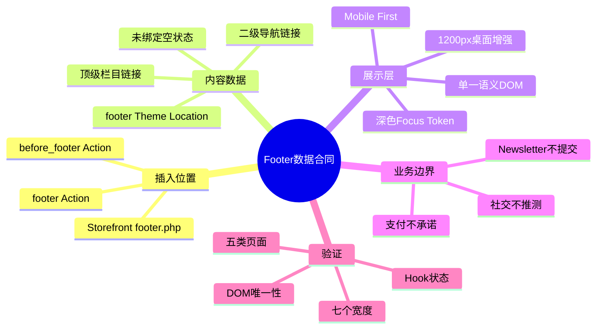
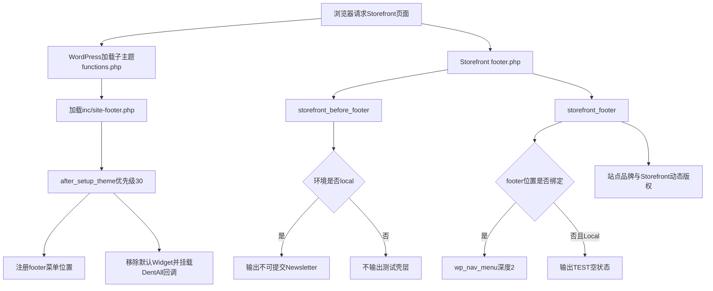

# Day35 WordPress实战：Storefront页脚Hook与菜单数据契约

> [!summary] 先记结论
> 一个可维护的WordPress页脚不是把五列链接写进模板，而是先找父主题公开Hook，再让一个Theme Location提供两级菜单数据，最后由子主题输出一棵语义DOM并用Mobile First CSS重排。数据未绑定时应有诚实空状态；真实Newsletter没有服务、合规和数据链之前，只能是明确不可提交的视觉壳层。

## 相关笔记

- 学习索引：[[WordPress实战笔记索引]]
- 对应项目笔记：[[../Day35-PC页脚与Newsletter测试壳层|Day35-PC页脚与Newsletter测试壳层]]
- 前置学习笔记：[[Day34-CSS断点级联与可访问状态]]
- 同主题知识：[[Day26-子主题继承与Hook加载机制]]、[[Day32-原生菜单与Storefront下拉机制]]
- 后续学习笔记：[[Day36-菜单数据绑定与静态响应式重排]]

> [!check] 双向链接状态
> 本笔记链接D35项目笔记；D35项目笔记反向链接本笔记；[[WordPress实战笔记索引]]登记本笔记；D34与D36学习笔记均与本笔记显式互链。

## 今日学习成果

- [ ] 我能解释Storefront `footer.php`、Action Hook、DentAll回调与最终HTML的执行顺序。
- [ ] 我能说明为什么Footer栏目应来自一个两级Theme Location，而不是硬编码五套列表或回退输出全部Page。
- [ ] 我能在Local验证“不可提交Newsletter”没有表单、字段名、端点或持久化，并说明真实接入为什么需要重新确认。

## 真实项目场景

### 今天解决了什么问题

DentAll设计证据在1440px展示蓝色Newsletter横条、深色五列Footer、品牌、社交和支付标志，但正式栏目URL、社交账号、支付方式和Newsletter服务均未冻结。D35必须先建立可维护的PC骨架，又不能把视觉样本当成业务事实。因此实现选择公开Hook、一个两级Footer菜单合同、Local不可提交预览和缺少事实时不渲染。

### 学习范围

- 本篇要掌握：父主题Hook接管、Theme Location与菜单DOM、条件输出、不可提交状态、父子主题CSS级联。
- 本篇明确不展开：正式菜单内容、Newsletter服务商/API、Double Opt-in、社交菜单、支付网关、D36手机/平板最终交互。
- 项目真实入口：`functions.php`、`inc/site-footer.php`、Storefront `footer.php`、`assets/css/site-shell.css`。
- 验证环境：仅Local；Staging/Production未部署，匿名请求受WooCommerce Coming Soon模板接管。

## 先建立整体模型

### 一句话模型

父主题决定“页脚哪里可以插入内容”，WordPress菜单决定“有哪些链接与层级”，DentAll子主题决定“怎样安全输出和响应式排列”；第三方Newsletter服务尚不存在时，展示层不能假装拥有数据处理能力。

### 记忆宫殿：商场大厅、导视牌与会员柜台

把Storefront `footer.php`想成商场大厅，Action Hook是预留展位；WordPress Footer菜单是物业维护的导视牌数据；DentAll回调是把导视牌安装到展位的施工队。Newsletter像会员办理柜台：只有外观样板、没有后台系统和隐私流程时，柜台必须挂“演示、暂停办理”，不能把访客资料收进纸箱里。

### 比喻对应回真实机制

| 记忆对象 | 真实技术对象 | 不能混淆的边界 |
|---|---|---|
| 商场大厅 | Storefront `footer.php` | 不修改父主题文件 |
| 预留展位 | `storefront_before_footer`、`storefront_footer` | Action提供位置，不保存菜单数据 |
| 导视牌数据 | WordPress Theme Location与Nav Menu term/items | 注册位置不等于已绑定内容 |
| 施工队 | `dentall_render_*()`回调 | 只输出展示，不替业务方决定URL |
| 暂停办理柜台 | disabled输入/按钮且无`form` | 视觉壳层不等于订阅服务 |
| 物业默认广告牌 | Storefront Widgets与`Built with WooCommerce` | 可在正确时机移除，不覆盖整座大厅 |

## 思维导图



最重要的主干是：先冻结“位置—数据—输出”的职责链，再给未知业务事实设置空状态与启用门槛。

## 请求与生命周期调用链



- 触发条件：任何使用Storefront标准Footer的前台请求。
- 加载入口：子主题`functions.php`的`require_once`。
- 执行顺序：模块加载注册回调→`after_setup_theme`配置→父主题模板触发Action→回调输出。
- 输入数据：环境类型、站点名、首页URL、Footer Theme Location与菜单项。
- 输出或副作用：转义后的HTML；没有数据库写入、远程请求或邮箱数据。
- 可观察证据：Hook状态、登录态DOM、计算样式、HTTP CSS哈希、跨页/宽度结果。

## 核心概念卡

| 概念 | 准确定义 | DentAll真实例子 | 常见误区 | 如何验证 |
|---|---|---|---|---|
| Action Hook | 在执行点调用已注册回调，不以返回值替换原值 | `storefront_footer` | 把Action当模板文件 | 查父主题`do_action()`与`has_action()` |
| Theme Location | 主题声明的菜单插槽，管理员可绑定某个菜单term | `footer` | 注册后以为内容自动存在 | `get_registered_nav_menus()`与`has_nav_menu()` |
| `fallback_cb` | 未找到菜单时是否调用回退函数 | `false` | 让Footer意外列出所有Page | 空绑定时检查DOM |
| `depth` | Walker允许输出的菜单层数 | `2` | 把无限层级交给CSS补救 | 绑定代表菜单后查DOM深度 |
| 环境条件 | 按`WP_ENVIRONMENT_TYPE`限制测试输出 | Local Newsletter | 把环境判断当部署权限 | Local与非Local分别验证 |
| 不可提交状态 | UI没有可用提交路径且明确告知状态 | 无`form`、disabled控件 | 只把按钮变灰但仍有端点 | 源码、DOM与网络/持久化检查 |

## 项目实战代码

### 涉及文件

- `app/public/wp-content/themes/dentall/functions.php`：只加载Footer模块。
- `app/public/wp-content/themes/dentall/inc/site-footer.php`：菜单、Hook、Newsletter与Footer输出。
- `app/public/wp-content/themes/dentall/assets/css/site-shell.css`：壳层Mobile First与桌面布局。
- `app/public/wp-content/themes/storefront/footer.php`：只读确认父主题Action位置，本轮未修改。

### 从入口开始追踪

1. WordPress先加载子主题`functions.php`，模块定义3个回调并登记`after_setup_theme`。
2. 优先级30时注册`footer`菜单，移除默认Footer Widgets，挂载Newsletter与Footer回调。
3. Storefront `footer.php`先触发`storefront_before_footer`，Local才输出Newsletter预览。
4. 进入`<footer>`后触发`storefront_footer`，DentAll输出菜单/空状态与品牌，Storefront随后输出动态版权。
5. 浏览器按基础单列规则布局；当前根字号下`75rem`开始PC双列与五列菜单增强。

### 关键代码片段一：公开Hook上的最小接管

源文件：`inc/site-footer.php`。

```php
register_nav_menu( 'footer', __( 'Footer navigation', 'dentall' ) );

remove_action( 'storefront_footer', 'storefront_footer_widgets', 10 );
add_action( 'storefront_before_footer', 'dentall_render_newsletter_preview', 10 );
add_action( 'storefront_footer', 'dentall_render_site_footer', 10 );
add_filter( 'storefront_credit_link', '__return_false' );
```

它没有复制`footer.php`，只替换当前设计合同不需要的默认四列Widget，并保留Storefront Footer生命周期。

### 关键代码片段二：不可提交不是“假表单”

```php
if ( 'local' !== wp_get_environment_type() ) {
	return;
}
```

真实HTML随后只有禁用Email输入和`type="button"`禁用按钮，没有`form`、`name`或提交端点。环境判断控制输出范围，禁用属性控制交互，显式`[TEST]`文案控制用户预期；三层缺一不可。

### 关键代码片段三：两级菜单与安全空状态

```php
wp_nav_menu(
	array(
		'theme_location' => 'footer',
		'depth'          => 2,
		'fallback_cb'    => false,
	)
);
```

实际函数还提供语义`nav`容器、可访问名称、稳定类名与ID。未绑定时Local显示TEST提示，非Local保持安静；不会泄漏全部Page或制造`#`链接。

### 关键代码片段四：clearfix与Grid的真实排错

```css
.dentall-newsletter__inner::before,
.dentall-newsletter__inner::after {
	content: none;
}
```

Storefront给`.col-full`加入clearfix伪元素。容器切换为Grid后，伪元素会成为匿名Grid项目，把真实文案和控件推到错误格子。1440截图发现错位后，只在Newsletter Grid边界取消这两个伪元素，不全局破坏父主题clearfix。

### 运行证据

- Local只读PHP状态：`footer_registered=true`、`footer_assigned=false`、默认Footer Widget Hook不存在、自定义两个输出Hook均为优先级10。
- Local CLI启动提示当前配置无法加载`php_imagick.dll`，但WordPress只读启动与Hook检查成功；该环境告警不是Footer模块行为。
- 登录态DOM：Newsletter=1、Footer=1、表单=0、禁用控件=2、Footer菜单=0、Local空状态=1、`Built with WooCommerce`不存在。
- 390～1440七个宽度横向溢出均为0；1199单列、1200双列边界连续。
- 390下Home、Shop、Product、Cart、Account五页均有唯一Newsletter/Footer、0表单、2禁用控件、0溢出。
- `site-shell.css?ver=0.13.2`的HTTP和磁盘字节/哈希一致；PHP lint与`git diff --check`通过。
- 独立Code Review与视觉复核均为P0/P1/P2/P3=0；视觉专项未独立覆盖全部宽度逐档截图或未绑定菜单的填充态。独立测试另发现一个环境P2：匿名Local由WooCommerce Coming Soon模板接管，其独立模板仍带默认LinkedIn、Instagram和Facebook链接。它不是本模块输出，需在开放匿名预发布页前经单独授权处理。
- 这些证据不能证明正式五列内容、真实Newsletter投递、社交账号或支付方式，因为对应数据/服务尚未存在。

## 职责边界

| 层级 | 本主题中负责什么 | 不应该负责什么 |
|---|---|---|
| WordPress Core | 主题生命周期、菜单位置/绑定、环境类型、转义API | 不修改核心文件 |
| WooCommerce | 当前页面、Coming Soon可见性及未来支付事实来源 | 不因视觉样本伪造网关 |
| Storefront父主题 | Footer模板、Action、默认Widget/Credit与版权 | 不直接改父主题文件 |
| DentAll子主题 | Footer语义DOM、条件输出、全站壳层CSS | 不存邮箱或承载跨主题营销业务 |
| `dentall-core` | 本轮无新增职责 | 不放纯主题展示结构 |
| 数据库 | D36才由用户绑定菜单；D35不写入 | 不把TEST状态当正式内容 |
| 浏览器 | 级联、Grid、换行、Focus与溢出 | 不能证明服务端投递成功 |

## Hook、API与模板机制详解

| 机制 | 名称/入口 | 当前职责 | 移除或回滚 |
|---|---|---|---|
| Action | `after_setup_theme`优先级30 | 注册菜单并配置Footer Hook | 移除模块加载或回调 |
| Action | `storefront_before_footer`优先级10 | Local Newsletter预览 | `remove_action()`对应回调 |
| Action | `storefront_footer`优先级10 | Footer菜单/品牌 | `remove_action()`对应回调 |
| Filter | `storefront_credit_link` | 关闭供应商推广链接 | 移除`__return_false`过滤器 |
| API | `register_nav_menu()` | 声明一个Footer位置 | 删除注册后后台位置消失 |
| API | `wp_nav_menu()` | 输出深度2且无回退的菜单 | 未绑定时返回空输出 |
| API | `wp_get_environment_type()` | 把TEST Newsletter限制在Local | 非Local不输出预览 |

`remove_action()`必须在父主题默认Hook已经登记之后执行；本项目在所有主题函数文件加载完成后的`after_setup_theme`优先级30执行，独立审查确认时序可用。

## 安全、数据与站点影响

| 检查面 | 本次结论 | 证据或待验证项 |
|---|---|---|
| 输入清洗与验证 | 不适用 | disabled控件不产生请求 |
| Capability | 不适用 | 无后台动作或数据修改 |
| Nonce | 不适用 | 无提交；Nonce不能替代Capability |
| 输出转义 | 已按上下文处理 | `esc_html_e`、`esc_attr`、`esc_url` |
| 数据库写入 | 无 | 未创建菜单term、Option或邮箱记录 |
| URL与SEO | 无猜测业务链接 | D36正式绑定将形成全站内部链接，需排除404/TEST/Draft |
| 缓存 | 版本升至0.13.2 | HTTP资源与磁盘哈希一致 |
| 匿名Coming Soon页面 | 不属于Day35 Footer组件 | 默认社交链接仍在，登记为环境P2；最晚在匿名Staging或Production预发布页开放前单独处理 |
| 性能 | 请求数不变，CSS增加4503字节 | 未测前后性能，不宣称零影响 |
| 支付、物流与订单 | 无变化 | 支付品牌不输出 |
| 部署与回滚 | 仅Local | Staging/Production未变；模块加载与CSS可回滚 |

## 动手练习

### 练习一：只读观察

- 目标：从父主题模板追到DentAll回调。
- 操作：查Storefront `footer.php`的两个Action，再查`has_action()`与登录态DOM。
- 预期：Newsletter位于`.site-footer`之前，Footer主体位于父主题`.col-full`内。
- 实际证据：Local符合预期；没有子主题模板覆盖。

### 练习二：Local最小改动

- 改动：临时在DevTools调整`.dentall-newsletter__inner`的列宽和gap，观察1200/1440；确定后回源码。
- 风险边界：不创建菜单、不填真实邮箱、不改父主题、不保存DevTools临时声明。
- 验证：1199/1200、长文案、0溢出、HTTP版本与跨页Footer。
- 回滚：恢复`site-shell.css`和0.13.2前的主题版本。

### 练习三：故障推演

- 假设症状：明明定义了两列，文案却跑到右上、输入框跑到左下。
- 可能原因：容器的`::before`/`::after`也成为Grid项目。
- 第一项检查：DevTools Grid overlay与`children`/伪元素计算样式。
- 最小修复：只在该Grid容器取消clearfix伪元素，不全局删除父主题兼容规则。

## 常见误区与排错顺序

| 现象或误区 | 可能原因 | 推荐检查顺序 | 最小验证 |
|---|---|---|---|
| 未绑定却出现所有页面 | 默认菜单回退仍启用 | `has_nav_menu`→`fallback_cb`→DOM | 应只有TEST空状态 |
| Newsletter按钮灰了但仍能提交 | 仍有`form`/端点或脚本监听 | DOM→Network→服务端/数据库 | 0 form、0 name、0请求 |
| Grid项目顺序异常 | clearfix伪元素参与布局 | Grid overlay→`::before/after` | 真实子元素同一行 |
| Footer文字变深看不清 | 父主题Customiser选择器权重更高 | Styles→Computed→资源顺序 | 品牌计算为白色 |
| 手机为还原截图删掉链接 | 把截图裁剪当内容事实 | 需求文档→数据合同→DOM | 一棵菜单、内容不删除 |
| 显示支付Logo就算完成 | 网关/账户未确认 | Woo设置→插件→账户→品牌规范 | 未确认时0输出 |

## 掌握标准

- [ ] 能画出`functions.php → after_setup_theme → Storefront footer.php → Action → DentAll回调`。
- [ ] 能解释注册Theme Location、绑定菜单与输出菜单是三个不同步骤。
- [ ] 能说明`depth => 2`和`fallback_cb => false`各自防什么问题。
- [ ] 能证明测试壳层没有提交能力，而不只凭按钮颜色判断。
- [ ] 能用计算样式定位父主题Customiser和clearfix对新布局的影响。
- [ ] 能说清正式Footer链接、Newsletter、社交和支付的业务责任与最晚确认节点。

当前掌握度：初识，待本人完成费曼自测与D36后台绑定复演。

## 费曼测试题

1. 为什么D35不覆盖Storefront `footer.php`，仍能改变页脚内容？
2. 注册`footer`位置后，为什么页面仍显示“not assigned”？谁负责绑定？
3. `fallback_cb => false`对SEO和内容真实性有什么价值？
4. 为什么disabled按钮仍不足以证明Newsletter安全？还要检查哪些层？
5. 1440两列错位为什么与PHP输出顺序无关，最终如何定位到伪元素？
6. 为什么不能照设计图直接输出PayPal、Visa和社交平台图标？
7. 若迁移到其他主题或Shopify，哪些责任边界不变，哪些Hook/对象必须重查？

### 我的费曼答案与纠正

待学习者本人作答。每题按`通过`、`含糊`或`答错`记录，并回到对应章节纠正，不能由Agent代填。

### 自测评分

| 分数 | 标准 |
|---:|---|
| 0 | 无法解释，或只能猜术语 |
| 1 | 能说定义，但说不清调用链、数据和边界 |
| 2 | 能用通俗语言解释，并准确对应真实代码与证据 |

总分：尚未自测 / 14；存在0分题时不提升掌握度。

## 间隔复习记录

| 复习节点 | 计划日期 | 完成 | 暴露的问题 | 修正位置 |
|---|---|---|---|---|
| D+1 | 2026-08-29 | [ ] | 复习后记录 | 复习后记录 |
| D+3 | 2026-08-31 | [ ] | 复习后记录 | 复习后记录 |
| D+7 | 2026-09-04 | [ ] | 复习后记录 | 复习后记录 |
| D+14 | 2026-09-11 | [ ] | 复习后记录 | 复习后记录 |

## 收尾总结

- 我今天真正理解了：父主题Hook、菜单数据和子主题DOM是三层职责，未知业务事实需要条件输出而不是视觉填空。
- 我仍需复演：D36绑定真实代表菜单后，顶级/二级数据如何进入五列Grid以及手机/平板如何重排。
- 下次遇到类似问题，我会先查：模板扩展点、数据源、空状态、提交链、父主题级联和边界宽度。
- 下一篇直接相关学习笔记：D36 Footer绑定与四端收口笔记，完成后回填。

## 后续如何向AI高效提问

```text
请基于以下真实WordPress主题与Footer证据排查，不要先覆盖模板或硬编码链接：
- WordPress / WooCommerce / 父主题 / 子主题版本：
- 父主题footer.php中的Action与默认回调：
- Theme Location注册、绑定菜单term、菜单层级和真实URL：
- 当前wp_nav_menu参数、空状态与DOM：
- Newsletter是否有form/name/端点/服务商/数据落点：
- 390/768/1024/1199/1200/1440计算样式与溢出：
- Local/Staging/Production边界：
请先区分模板位置、数据合同、展示样式和真实服务，再给最小修复、验证与回滚。
```

## 变种应用到其他项目

| 新场景 | 保持不变的原则 | 可能变化的实现 | 必须重新确认 | 最小验证 |
|---|---|---|---|---|
| 另一个Storefront子主题 | Hook优先、菜单数据独立、无回退泄漏 | 类名、Token、菜单数量 | Storefront版本与已有Widget | 空/有菜单两态 |
| 其他经典WordPress主题 | 不改父主题、单一数据源 | Footer Action或模板部件 | 主题公开扩展点 | 父子主题升级回归 |
| WordPress区块主题 | 数据/结构/服务分层 | Navigation Block与模板部件 | Site Editor保存模型 | 编辑器与前台一致 |
| Headless商城 | 菜单API、提交链和状态真实 | SSR组件、CMS GraphQL/REST | 缓存、鉴权、CORS | 空数据＋错误态 |
| Shopify或其他平台 | 正式URL/账户驱动条件输出 | Liquid菜单、Section、App Embed | 官方主题与应用机制，待验证 | 预览主题四端＋提交链 |

## 可复用核心思想

### 跨平台不变量

- 页面插入位置、内容数据和外部服务是三种不同职责；可分别开发和验收，但不能互相冒充完成。
- 全站导航链接会放大SEO与业务错误，未知URL应保持空状态并设置发布门槛。
- 任何“收集邮箱”的功能都必须能回答数据去向、同意、退订、滥用防护、失败恢复和责任人。

### WordPress/WooCommerce当前实现

- DentAll通过Storefront Action插入结构，用一个WordPress Theme Location提供两级菜单，用`fallback_cb => false`保护未绑定状态。
- Local Newsletter依赖环境类型、禁用原生控件和无提交HTML三层边界；没有插件、API或数据库行为。
- 父主题Customiser和clearfix仍参与级联与布局，子主题验证必须读取最终计算样式，不能只读自己的CSS。

### Shopify或其他平台的对应机制

- 可迁移的是“扩展点—导航数据—主题呈现—营销服务”的分层与条件输出原则。
- Shopify Navigation、Theme Sections、App Embed和Email应用的具体对象与发布方式本轮未验证，标记为待验证，不进入DentAll第一版实施范围。
