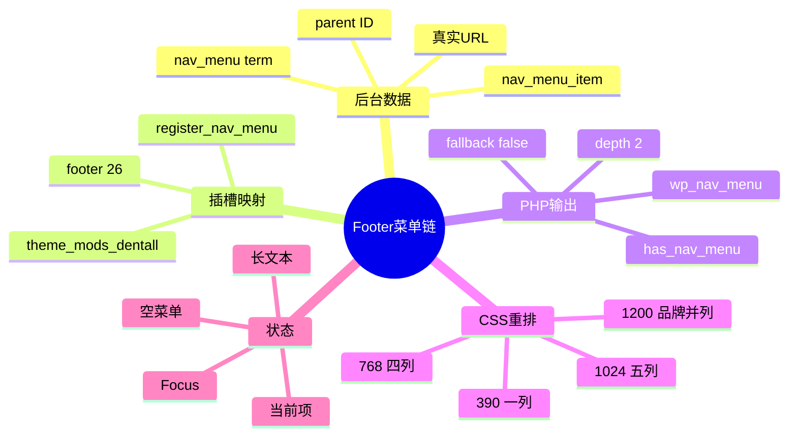
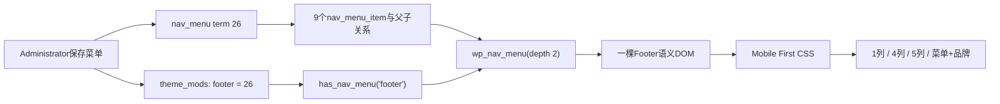

# Day36 WordPress实战：菜单数据绑定与静态响应式重排

> [!summary] 先记结论
> WordPress菜单不是模板里的几组链接，而是“菜单term＋菜单项树＋Theme Location映射”。主题只声明插槽并输出一棵DOM；CSS再根据可用宽度重排。D36用5个顶级项和4个二级项证明这条链在四端成立，同时保留Administrator权限边界、TEST内容边界和无JavaScript边界。

## 相关笔记

- 学习索引：[[WordPress实战笔记索引]]
- 对应项目笔记：[[../Day36-手机与平板页脚和后台菜单绑定|Day36-手机与平板页脚和后台菜单绑定]]
- 前置学习笔记：[[Day35-Storefront页脚Hook与菜单数据契约]]
- 同主题知识：[[Day32-原生菜单与Storefront下拉机制]]、[[Day34-CSS断点级联与可访问状态]]
- 后续学习笔记：[[Day37-Homepage-Hook与响应式Hero]]
- M4验收学习笔记：[[Day42-首页整链路验收与证据分层]]

> [!check] 双向链接状态
> 本笔记与D36项目笔记、D35/D37学习笔记及[[WordPress实战笔记索引]]显式互链；D36项目笔记也反向链接本笔记。

## 今日学习成果

- [ ] 我能从后台一次“保存菜单”解释到数据库对象、Theme Location、`has_nav_menu()`和最终HTML。
- [ ] 我能说明为什么同一棵DOM可以在390/768/1024/1440重排，而不需要复制四套Footer。
- [ ] 我能判断什么时候静态重排足够，什么时候Accordion会引入新的交互、安全和可访问性合同。

## 真实项目场景

D35已经提供`footer`插槽、深度2输出、空状态和Local Newsletter壳层，但没有菜单数据。D36由Administrator创建term ID 26并绑定到Footer，CSS只补平板和桌面断点。真实问题不是“如何画五列”，而是如何保证：

1. 后台数据不会覆盖Primary或把未知页面带入Footer。
2. 一棵菜单DOM在四端始终完整可见，长标签不会溢出。
3. 当前项、Focus与hover有可辨认状态，但不新增Accordion JS。

## 记忆宫殿：商场楼层导览牌

把站点想成一座商场：

- 菜单term是一块“导览牌方案”，例如TEST Footer方案。
- `nav_menu_item`是牌上的每个店名和箭头；父ID决定栏目与子链接。
- Theme Location是墙上预留的安装位，`footer => 26`表示把26号导览牌装到页脚墙面。
- `wp_nav_menu()`是安装工，把数据树转换为`nav > ul > li > a`。
- CSS Grid是现场排版：窄墙一列、平板四列、横屏五列、PC再给品牌留一列。

真实技术映射：导览牌不是墙，菜单数据不是模板；更换菜单不需要改PHP，更换列数也不需要改数据库。

## 思维导图



## 保存到输出的调用链



若Footer未绑定，`has_nav_menu()`为false；Local输出诚实TEST空状态，非Local保持安静。`fallback_cb => false`阻止WordPress把全部Page当替代菜单。

## 项目实战代码

### Theme Location只负责绑定

来自`inc/site-footer.php`：

```php
register_nav_menu( 'footer', __( 'Footer navigation', 'dentall' ) );
```

这行只声明插槽，不创建栏目，也不写业务URL。D36的`footer => 26`是后台保存的数据，而不是PHP常量。

### 一棵两级DOM

```php
wp_nav_menu(
    array(
        'theme_location'  => 'footer',
        'menu_class'      => 'dentall-footer-menu',
        'depth'           => 2,
        'fallback_cb'     => false,
    )
);
```

`depth => 2`限制输出深度；它不能替代后台内容审核。若后台错误建立第三层，该层不会输出，但数据问题仍应在后台修正。

### Mobile First静态重排

来自`assets/css/site-shell.css`的职责节选：

```css
.dentall-footer-menu {
    display: grid;
    gap: var(--dentall-space-32);
}

@media (min-width: 48rem) {
    .dentall-footer-menu {
        grid-template-columns: repeat(4, minmax(0, 1fr));
    }
}

@media (min-width: 64rem) {
    .dentall-footer-menu {
        grid-template-columns: repeat(5, minmax(0, 1fr));
    }
}
```

基础层没有写“一列”，因为Grid默认只有一个隐式列；768和1024只添加真正发生变化的规则。

## 为什么768用四列、1024用五列

- 768内容宽度约689px；四列扣除3个24px gap后，每列约154px，长英文可以自然换行。
- 如果强制五列，每列会更窄，长栏目高度和可读性都会恶化。
- 1024内容宽度约945px；五列扣除4个24px gap后，每列约170px，已足以承载代表长标签。
- 1200起Footer主区再分出240px品牌列；菜单仍保持五列，不创建“第六个菜单栏目”。

断点来自内容和证据，不是设备型号列表。浏览器初始字号变化时，`rem`断点还会随用户设置变化，这是可访问性收益。

## 为什么本日不做Accordion

Accordion不是“再加几行CSS”。合格实现至少需要：

- 顶级真实链接之外的独立展开按钮，或明确改变信息架构。
- `aria-expanded`、`aria-controls`、唯一ID和按钮可访问名称。
- Enter/Space、Tab顺序、关闭时隐藏链接不可聚焦。
- 跨断点状态重置、无JS回退、Reduced Motion及多个栏目同时展开规则。

现有390设计证据没有开/关状态；项目又要求手机内容完整。因此静态重排是本次证据和维护成本下的最小正确方案。

## 状态与可访问性

| 状态 | 当前实现 | 验证点 |
|---|---|---|
| 未绑定 | Local TEST提示，非Local安静 | 不回退全部Page |
| 有子项 | 顶级真实链接＋二级列表 | 深度最多2 |
| 无子项 | 顶级链接仍可访问 | 不制造空按钮 |
| 长文本 | `min-width: 0`＋`overflow-wrap: anywhere` | 无横向溢出 |
| 当前项 | 2px下划线＋白色 | 非纯颜色信号 |
| 普通项 | 无常驻下划线 | 与当前项可区分 |
| 键盘Focus | 深色区域3px白色Focus | 不被裁切或隐藏 |

## 数据、权限、SEO与缓存边界

### 数据

- 菜单term和菜单项是WordPress内容数据，不随Git部署。
- `theme_mods_dentall`保存主题位置映射；切换主题或环境时必须重新核对。
- D36只写Local TEST菜单，不修改Page、Product或订单。

### 权限

`wp-admin/nav-menus.php`要求`edit_theme_options`。本次由Administrator操作；Website Manager有意不具备该能力。若未来业务要求其维护菜单，必须重新设计最小权限，而不是为了方便直接开放全部主题设置。

### URL与SEO

Footer会在全站形成内部链接，因此错误URL会被放大。Local TEST菜单只能使用已验证目标；正式发布前必须替换TEST标签、确认状态码、Canonical、索引状态和业务承诺。

### 缓存

- 保存菜单可能受页面/对象缓存影响；Local先刷新验证。
- CSS修改通过主题0.14.1刷新`site-shell.css`版本参数。
- 菜单数据和CSS代码是两种部署对象，不能只发布Git就假定目标环境菜单已存在。

## 可复演排错练习

### 现象：桌面有五列，平板仍是一列

1. Elements确认页面存在`#dentall-footer-menu`且5个顶级`li`都在同一`ul`。
2. Computed查看`grid-template-columns`，判断48rem媒体查询是否命中。
3. Network确认加载的是`site-shell.css?ver=0.14.1`，排除旧缓存。
4. 若CSS命中但列数不对，检查父容器宽度、其他高权重规则和浏览器初始字号。
5. 不要先复制第二套平板HTML；那会制造数据、Focus和当前项同步问题。

### 现象：当前项和普通项看起来一样

1. 检查WordPress是否输出`current-menu-item`或`current-menu-ancestor`。
2. 检查普通链接是否被父主题加了常驻下划线。
3. 比较最终`text-decoration-line`和`text-decoration-thickness`，不要只读子主题源码。
4. 调整最小同域选择器后复测hover、当前项与键盘Focus。

## 费曼自测

1. `register_nav_menu()`、菜单term和Theme Location各自保存什么？
2. 为什么`fallback_cb => false`是内容安全边界？
3. `depth => 2`能否阻止管理员在后台创建第三层数据？为什么？
4. 为什么390不隐藏Footer链接，也不直接把顶级链接改成Accordion开关？
5. 768四列、1024五列的判断依据是什么？
6. 为什么普通链接下划线会削弱当前项状态？应从哪里确认最终样式？
7. 为什么菜单数据不会自动随Git进入Staging？

## 掌握度与复习

| 时间 | 目标 | 结果 |
|---|---|---|
| 当天 | 能画出菜单保存到前台输出的链路 | 待自测 |
| 1天后 | 不看笔记解释term、item、location区别 | 待复习 |
| 1周后 | 在另一个主题判断Hook、菜单与CSS边界 | 待复习 |
| 1个月后 | 能设计正式菜单迁移、权限和回滚SOP | 待复习 |

## 高效向AI提问

```text
请只读检查这个WordPress主题的Footer菜单链：
1. Theme Location在哪里注册、后台绑定保存在哪里；
2. 未绑定时是否会回退全部Page；
3. 一棵DOM在390/768/1024/1440如何重排；
4. 当前项、长文本、Focus和空状态如何验证；
5. 区分代码部署与菜单数据迁移，不要默认安装插件或新增JS。
请给出文件、Hook、数据对象、风险和最小回滚步骤。
```

## 其他项目的变种

| 场景 | 不变原则 | 可能变化 | 需重新验证 |
|---|---|---|---|
| 其他经典主题 | 数据树与模板输出分离 | Hook名称、父主题级联 | 主题升级与空状态 |
| WordPress区块主题 | 单一导航数据源 | Navigation Block、模板部件 | Site Editor保存模型 |
| Headless商城 | 菜单API与组件分离 | REST/GraphQL、SSR缓存 | 鉴权、缓存失效、错误态 |
| Shopify | 菜单数据与Theme呈现分离 | Navigation、Liquid Section | 具体权限和发布机制，待验证 |

## 可复用核心思想

### 跨平台不变量

- 导航系统至少包含数据树、展示插槽、响应式布局和发布权限四层；改变一层不应迫使复制其他层。
- 没有交互证据时，保持内容完整的静态重排优于制造隐藏状态和额外JS生命周期。
- 全站内部链接必须以真实目标、状态码和回滚路径为发布门槛。

### WordPress/WooCommerce当前实现

- WordPress用`nav_menu`term、`nav_menu_item`和`theme_mods`位置映射组成菜单数据链；Storefront Hook提供Footer插入位置。
- DentAll用`has_nav_menu()`、`wp_nav_menu(depth=2)`和`fallback_cb=false`输出单一DOM，再用48/64/75rem CSS渐进增强。
- Administrator负责本次原生菜单绑定；Website Manager能力不扩大。

### Shopify或其他平台的对应机制

- 可迁移的是“导航数据—模板插槽—响应式呈现—发布权限—缓存失效”的因果链。
- Shopify具体菜单对象、主题编辑器权限和发布行为本日未验证，标记为待验证，不作为DentAll实现事实。
