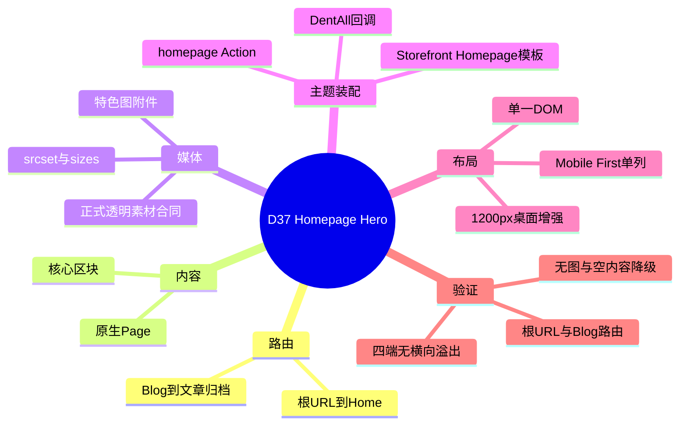
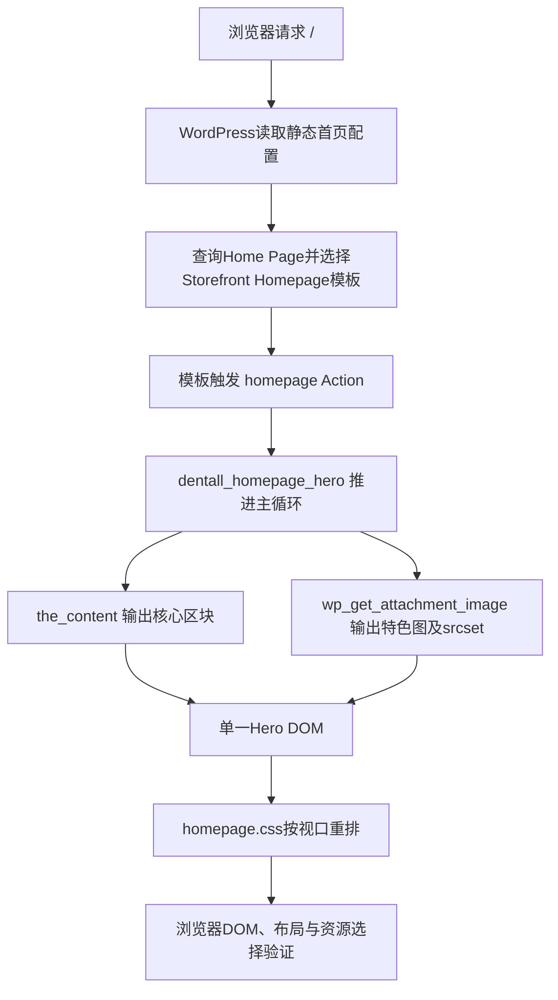

# Day37 WordPress实战：Homepage Hook与响应式Hero

> [!summary] 先记结论
> WordPress先用Reading设置决定“哪个Page响应根URL”，Storefront的Homepage模板再通过`homepage` Action组装页面，DentAll回调最后把Page的核心区块和特色图输出为Hero。路由、内容、媒体和布局是四个不同职责；把它们拆开，才能既让后台可编辑，又让一套DOM安全适配四端。

## 相关笔记

- 学习索引：[[WordPress实战笔记索引]]
- 对应项目笔记：[[../Day37-PC首页Hero与原生首页路由|Day37-PC首页Hero与原生首页路由]]
- 前置学习笔记：[[Day36-菜单数据绑定与静态响应式重排]]
- 同主题知识：[[Day26-子主题继承与Hook加载机制]]、[[Day27-Design-Token与Mobile-First容器]]、[[Day31-四端设计稿还原与组件拆解]]
- 后续学习笔记：[[Day38-Grid叠层与响应式图片sizes]]
- M4验收学习笔记：[[Day42-首页整链路验收与证据分层]]

> [!check] 双向链接状态
> 本学习笔记已链接D37项目笔记和D36学习笔记；D37项目笔记、D36学习笔记与[[WordPress实战笔记索引]]也回链本笔记。

## 今日学习成果

- [ ] 我能解释Reading设置、Page模板和`homepage` Action为什么是三层机制，而不是同一个“首页开关”。
- [ ] 我能从`functions.php`追到`dentall_homepage_hero()`，说明主循环、核心区块、特色图和条件资源怎样连接。
- [ ] 我能用浏览器证据判断`srcset`选中768×512是否正常，并区分响应式选图、CSS缩放和素材裁切。

## 真实项目场景

### 今天解决了什么问题

DentAll已经完成全局Header与Footer，但根URL仍需要一个可由后台维护、又能接近PC设计稿的Hero。现有素材只有3:2实色占位图，不能把它误当正式Banner，也不能为四个视口复制四套页面。D37因此选择WordPress原生Page核心区块承载文字、特色图承载媒体、Storefront Homepage Hook承载输出顺序，再由Mobile First CSS控制同一DOM的布局。

### 学习范围

- 本篇要掌握：静态首页路由、Storefront Homepage Action、WordPress主循环、条件enqueue、响应式图片和Hero降级边界。
- 本篇明确不展开：正式营销文案、素材授权、图片生成、分类/Solutions/商品区、D38最终移动视觉、Staging/Production部署。
- 项目真实入口：`app/public/wp-content/themes/dentall/functions.php`、`inc/homepage.php`、`assets/css/homepage.css`、后台`设置 → 阅读`。
- 验证范围：Local登录态，根URL、`/blog/`与390/768/1024/1440px；不把当前证据外推为正式内容或生产验收。

## 先建立整体模型

### 一句话模型

Reading设置先把请求导向正确的内容对象，模板和Hook决定组件装配顺序，WordPress媒体API决定图片候选，CSS只负责把已输出的语义结构排成适合当前视口的样子。

### 记忆宫殿：商场入口展台

把网站想成一座商场：

- `设置 → 阅读`是入口总机，决定正门`/`接到Home，资讯入口`/blog/`接到文章列表。
- Storefront的Homepage模板是展厅，`homepage` Action是展厅里的装配轨道。
- DentAll回调是展台安装队，沿WordPress主循环取到当前Home Page。
- 核心区块是可编辑说明牌，特色图附件是独立产品展品。
- `srcset`像仓库提供同一展品的多种运输尺寸，浏览器按视口和像素密度选合适的一箱。
- CSS是现场陈列规则：窄屏上下摆，宽屏才把前景图放到右侧。

### 比喻对应回真实机制

| 记忆对象 | 真实技术对象 | 不能混淆的边界 |
|---|---|---|
| 入口总机 | `show_on_front`、Home Page与Posts Page的Reading配置 | 路由绑定不负责Hero样式 |
| 展厅与装配轨道 | `template-homepage.php`与`do_action( 'homepage' )` | Hook不是内容数据库，也不是CSS布局 |
| 安装队 | `dentall_homepage_hero()` | 回调必须推进主循环，不能假设父主题仍会调用`the_post()` |
| 说明牌 | Home Page的`post_content`与核心区块 | TEST文案不是正式业务文案 |
| 产品展品 | Page特色图附件 | 附件原图、浏览器派生图和CSS显示尺寸不是同一个尺寸 |
| 陈列规则 | `homepage.css` | CSS不能把烘焙进图片的实色背景可靠变成透明前景 |

## 思维导图



最重要的主干是：先让请求找到正确Page，再让Hook输出正确语义，最后才由媒体API和CSS处理性能与布局。

## 请求与生命周期调用链



- 触发条件：请求使用`template-homepage.php`的Page。
- 加载入口：子主题`functions.php`加载`inc/homepage.php`。
- 执行顺序：`after_setup_theme`替换父主题Homepage回调；`wp_enqueue_scripts`条件加载样式；模板触发`homepage` Action。
- 输入数据：当前Page的原始正文与特色图附件ID。
- 输出副作用：仅生成前台HTML和条件资源；主题代码不写数据库。
- 可观察证据：根URL的Hero DOM、`/blog/`文章列表、图片`currentSrc`和四端几何尺寸。

## 核心概念卡

| 概念 | 准确定义 | DentAll真实例子 | 常见误区 | 如何验证 |
|---|---|---|---|---|
| 静态首页 | WordPress把指定Page作为站点根请求的内容对象 | Home响应`/`，Blog作为Posts Page响应`/blog/` | 创建名为Home的Page就会自动成为根首页 | 检查Reading并实际访问两个URL |
| Action | 在生命周期特定位置执行注册回调的扩展点 | `homepage`执行`dentall_homepage_hero` | 把Action当成必须返回HTML的Filter | 查看注册和页面DOM |
| 主循环 | WordPress遍历当前查询结果并建立全局Post上下文 | `while ( have_posts() ) { the_post(); }` | 移除父回调后仍假设有人推进循环 | 删除或跳过`the_post()`会使内容上下文失真 |
| 响应式图片 | 同一附件输出多个候选，由浏览器结合`sizes`选择资源 | 1440px的1×浏览器选择768×512候选 | 看到768宽就认为原图被裁剪 | 对比附件原图、`srcset`与`currentSrc` |
| Art direction | 不同视口使用不同构图，而不只是不同像素尺寸 | 当前尚未实施移动专图 | 四个验收端必然要四张图片 | 先用同一主图四端验证，失败再评估`picture` |

## 项目实战代码

### 涉及文件

- `app/public/wp-content/themes/dentall/functions.php`：加载职责独立的Homepage模块。
- `app/public/wp-content/themes/dentall/inc/homepage.php`：替换Storefront默认首页区块、条件加载资源并输出Hero。
- `app/public/wp-content/themes/dentall/assets/css/homepage.css`：Mobile First布局和1200px桌面增强。
- `app/public/wp-content/themes/dentall/style.css`：提供Design Token并把主题版本更新为0.15.3。

### 从入口开始追踪

1. `functions.php`使用`require_once`加载Homepage模块。
2. 模块在`after_setup_theme`优先级100移除父主题默认Homepage内容和商品区块，再注册DentAll Hero。
3. 页面请求命中Homepage模板时，`wp_enqueue_scripts`回调卸载已无用途的父主题Homepage脚本，并加载`homepage.css`。
4. Storefront模板触发`homepage` Action后，DentAll回调推进主循环，读取正文和特色图。
5. 内容和图片都没有时跳过空Hero；只有一侧时增加状态类让CSS自然降级。

### 关键代码片段

源文件：`inc/homepage.php`，节选自真实实现。

```php
remove_action( 'homepage', 'storefront_homepage_content', 10 );
add_action( 'homepage', 'dentall_homepage_hero', 10 );

function dentall_homepage_hero() {
	while ( have_posts() ) {
		the_post();
		$image_id    = get_post_thumbnail_id();
		$has_content = '' !== trim( (string) get_post_field( 'post_content', get_the_ID(), 'raw' ) );
		// 后续按内容和媒体状态输出同一个Hero结构。
	}
}
```

响应式图片的真实最小片段：

```php
$image_html = wp_get_attachment_image(
	$image_id,
	'full',
	false,
	array(
		'loading'       => 'eager',
		'decoding'      => 'async',
		'fetchpriority' => 'high',
		'sizes'         => '(min-width: 1320px) 768px, (min-width: 1200px) calc(63vw - 40px), (min-width: 768px) 768px, calc(100vw - 40px)',
	)
);
```

| 代码 | 表面动作 | WordPress中的真实作用 | 为什么这样写 |
|---|---|---|---|
| `remove_action()` | 删除回调 | 阻止Storefront示例首页内容和商品区自动输出 | 未验收区块不能提前进入首页 |
| `the_post()` | 前进一条记录 | 建立`the_content()`等模板标签依赖的当前Post上下文 | 新回调接管父回调后必须自己推进循环 |
| `get_post_field(..., 'raw')` | 读取原始正文 | 判断数据库中的编辑内容是否实际存在 | 不用渲染后HTML反推数据状态 |
| `wp_get_attachment_image()` | 生成`img` | 保留尺寸、alt、`srcset`和WordPress派生图能力 | 比手拼URL或CSS背景更适合内容型Hero |
| `is_page_template()` | 判断模板 | 只在Homepage请求加载专用CSS | 避免Shop等页面承担无用资源 |

### 运行证据

- 后台：`设置 → 阅读`已保存Homepage=`Home`、Posts page=`Blog`。
- 根URL：标题`Home - Dentall`，主内容包含单一H1、三项列表、按钮与特色图。
- `/blog/`：标题`Blog - Dentall`，输出文章条目`世界，您好！`。
- 四端：390/768/1024/1440px均无横向溢出；1440px Hero为1425×352px，390px选择416×277派生图。
- 静态验证：全部子主题PHP语法检查与`git diff --check`通过；Homepage CSS无`!important`和`object-fit: cover`。
- 证据不能证明：正式素材授权、正式文案、匿名Coming Soon后页面、Staging/Production、D38最终移动视觉或真实业务转化。

## 职责边界

| 层级 | 本主题中负责什么 | 不应该负责什么 |
|---|---|---|
| WordPress Core | Reading路由、Page查询、核心区块、特色图与响应式派生图 | 不修改核心文件，不决定DentAll视觉 |
| WooCommerce | 保持商城环境和Storefront兼容基线 | D37不查询商品、不改变交易数据 |
| Storefront父主题 | 提供Homepage模板和公开Action | 不直接修改父主题文件 |
| DentAll子主题 | 替换展示回调、输出Hero、条件加载CSS | 不保存正式业务事实或跨主题交易规则 |
| `dentall-core` | 本日无职责 | 不把纯展示Hero塞入站点业务插件 |
| 数据库与媒体 | 保存Reading选项、Page正文和附件 | TEST文案与Local占位图不升级为正式内容 |
| 浏览器 | 选择`srcset`候选并执行CSS布局 | 看到派生图尺寸不等于原件被裁剪 |

## Hook、API与模板机制详解

| 项目 | 说明 |
|---|---|
| 机制类型 | Action、Template、Enqueue、Image API |
| 名称或入口 | `homepage`、`after_setup_theme`、`wp_enqueue_scripts`、`wp_get_attachment_image()` |
| 注册位置 | `inc/homepage.php` |
| 关键优先级 | `after_setup_theme`为100，确保父主题注册完成后再移除；资源回调为50，便于卸载父脚本 |
| 回调输入 | 当前主查询、Home正文、特色图附件ID、当前Page模板 |
| 返回内容 | Action回调直接输出HTML，不用返回过滤值 |
| 副作用 | 前台HTML与CSS请求变化；不自动写数据库 |
| 影响范围 | 只影响使用Storefront Homepage模板的前台Page |
| 移除或回滚 | 从`functions.php`移除模块加载并恢复父主题回调，或回退本轮文件；Reading设置需单独按后台值回滚 |

## 安全、数据与站点影响

| 检查面 | 本次结论 | 证据或待验证项 |
|---|---|---|
| 输入清洗与验证 | 主题不接收新表单输入 | 只读取已有Page与附件 |
| Capability | 代码路径不执行后台写入；Reading/Page/媒体操作由Administrator原生权限控制 | 未扩大Website Manager权限 |
| Nonce | 不适用 | 没有自定义写操作或请求端点 |
| 输出转义 | Section类名使用`esc_attr()`；图片标记由WordPress图片API生成；正文经`the_content()`管线输出 | 不手拼附件HTML或URL |
| 数据库写入 | 主题代码无写入；Reading绑定和Page内容由用户在原生后台保存 | 未自动创建Page、附件或选项 |
| URL与SEO | 根URL与`/blog/`职责明确；未改Slug、Canonical、robots或Sitemap策略 | 正式SEO输出仍按后续节点审计 |
| 缓存 | 主题版本0.15.3更新CSS查询键；未配置页面缓存 | 非Local缓存尚未验证 |
| 支付、物流与订单 | 无影响 | 未触碰WooCommerce交易流程 |
| 部署与回滚 | 仅Local；Staging/Production未部署 | 回滚子主题文件和Reading设置是两条独立路径 |

## 动手练习

### 练习一：只读观察

- 目标：区分上传原图、候选图和实际显示尺寸。
- 操作：在DevTools选择Hero `img`，比较`src`、`srcset`、`currentSrc`、`naturalWidth`和元素盒尺寸。
- 预期：1440px的1×浏览器可以选择768×512候选，但附件原件仍为1536×1024，元素显示为右侧媒体框尺寸。
- 实际证据：本轮1440px选中768×512，390px选中416×277，没有发生CSS `cover`裁切。

### 练习二：Local最小改动

- 改动：在DevTools临时调整`--dentall-space-32`或Hero内容`gap`，观察390/768/1024布局。
- 风险边界：只做浏览器临时试验，不修改核心、数据库、正式素材或Production。
- 验证：检查标题、列表、按钮、图片和Footer均可见且`scrollWidth === clientWidth`。
- 回滚：刷新页面即可丢弃DevTools临时规则；确认后才回到`homepage.css`修改最小Token或局部规则。

### 练习三：故障推演

- 假设症状：根URL仍显示最新文章，而`/home/`才显示Hero。
- 可能原因：Reading未选择静态首页，或Home/Blog绑定颠倒。
- 第一项检查：后台`设置 → 阅读`的Homepage与Posts page，而不是先改CSS或模板。
- 为什么先查它：CSS只能改变已路由页面的外观，不能把根请求切换到另一个Page。

## 常见误区与排错顺序

| 现象或误区 | 可能原因 | 推荐检查顺序 | 最小验证方法 |
|---|---|---|---|
| 根URL没有Hero | Reading未绑定、模板不对、模块未加载或Hook未触发 | 1. Reading；2. Page模板；3. 页面源码/CSS；4. Hook注册 | 分别访问`/`与`/home/` |
| 列表文字逐字竖排 | Grid匿名文本、列宽被挤压或父主题clearfix成为Grid子项 | 1. DOM；2. Grid tracks；3. 伪元素；4. 列表marker | DevTools查看grid overlay与元素宽度 |
| 图片显示768×512就认为被裁剪 | 浏览器通过`srcset`选择派生图 | 1. `currentSrc`；2. `naturalWidth`；3. 附件原图；4. `object-fit` | 对比媒体库附件与元素属性 |
| 图片边缘与Hero底色不无缝 | 源图已经烘焙实色背景 | 1. 查看源图Alpha；2. 对比背景色；3. 检查CSS裁切 | 在图像查看器确认透明通道 |
| 四端需要四套HTML | 把验收视口误当内容模型 | 1. 先用单一DOM；2. Mobile First；3. 验证构图；4. 必要时才做Art direction | 关闭CSS后检查语义顺序仍合理 |

## 掌握标准

- [ ] 不看笔记，能在2分钟内讲清“Reading → 模板 → Hook → DOM → 图片候选 → CSS”的链路。
- [ ] 能指出`functions.php`、`inc/homepage.php`和`homepage.css`各自职责。
- [ ] 能解释为什么移除父回调后DentAll回调必须调用`the_post()`。
- [ ] 能区分无图、无内容、正式素材不合格和路由未绑定四类问题。
- [ ] 能在Local用DevTools完成只读验证并说清文件与Reading设置的独立回滚。
- [ ] 能说明本次对URL、SEO、缓存、支付、物流和部署的实际影响。

当前掌握度：初识，待费曼自测。

## 费曼测试题

1. 不使用专业术语，你会怎样解释“创建Home页面”为什么不等于“根URL已经是Home”？
2. 商场入口展台比喻里的总机、轨道、安装队、说明牌和展品分别对应什么？这个比喻在哪些地方会失效？
3. 从请求`/`开始，按顺序讲出Reading、主查询、模板、Action、DentAll回调、图片API和CSS谁先谁后。
4. 为什么`remove_action( 'homepage', 'storefront_homepage_content', 10 )`之后不能只调用`the_content()`而忽略`the_post()`？
5. 浏览器显示768×512图片时，如何用三项证据证明原件没有被裁剪或替换？
6. 如果把实现迁移到区块主题或Shopify，哪些原则能保留，哪些Hook、模板和字段必须重新验证？

### 我的费曼答案与纠正

尚未自测。每题后续标记`通过`、`含糊`或`答错`；存在0分题前不提升掌握度。

### 自测评分

总分：尚未自测 / 12。

## 间隔复习记录

| 复习节点 | 计划日期 | 完成 | 暴露的问题 | 修正位置 |
|---|---|---|---|---|
| D+1 | 2026-08-29 | [ ] | — | — |
| D+3 | 2026-08-31 | [ ] | — | — |
| D+7 | 2026-09-04 | [ ] | — | — |
| D+14 | 2026-09-11 | [ ] | — | — |

## 收尾总结

- 我今天真正理解了：首页不是一张模板图，而是路由、内容对象、Hook装配、媒体候选和CSS布局组成的调用链。
- 我仍然容易混淆：浏览器候选图尺寸、图片元素盒尺寸与上传原图尺寸，需要继续用DevTools复演。
- 下次遇到类似问题，我会先查路由和模板，再查Hook/DOM，最后查CSS和素材，而不是从视觉症状直接改样式。
- 下一篇直接相关学习笔记：D38 Hero四端精调笔记创建后双向回填。

## 后续如何向AI高效提问

```text
环境：WordPress 7.0.4、Storefront 4.6.2、DentAll子主题0.15.3、Local。
目标：排查Homepage Hero在某个视口的路由、DOM、响应式图片或CSS问题。
真实入口：inc/homepage.php、homepage.css、设置 → 阅读。
证据：给出URL、视口、DOM片段、currentSrc、元素盒尺寸和已观察的Hook/资源。
边界：不改核心、不写数据库、不生成正式内容、不碰Production。
请先区分已确认事实、推断和待验证项，再给最小只读检查、最小修复与回滚步骤。
```

## 变种应用到其他项目

| 新场景 | 保持不变的原则 | 可能变化的实现 | 必须重新确认 | 最小验证 |
|---|---|---|---|---|
| 另一个Storefront子主题 | 路由、内容、媒体、布局分责 | 回调函数、样式Token和内容结构 | Storefront版本与既有Hook优先级 | 真实Page与四端请求 |
| 其他经典主题 | 单一语义DOM与附件API优先 | Homepage模板和公开Hook名称 | 主题模板层级、enqueue顺序 | 源码＋Local页面 |
| WordPress区块主题 | 内容与媒体合同不变 | Site Editor、区块模板与`theme.json` | 当前版本的模板查找和区块绑定 | 复制站点上的最小模板实验 |
| 独立插件 | 只在跨主题生命周期稳定时承载逻辑 | 加载入口和样式归属 | 是否真有跨主题业务价值 | 切换主题后的行为测试 |
| Shopify或其他平台 | 一份语义内容、独立媒体对象、响应式候选和Art direction判定 | Section、Liquid、媒体选择器和发布流程，待验证 | 官方主题架构、字段与图片CDN行为 | 官方资料＋测试主题实验 |

## 可复用核心思想

### 跨平台不变量

先分清“请求到哪个内容”“内容包含什么”“媒体提供哪些候选”“当前视口怎样布局”。四者混在一张Banner或四套DOM里，会让内容维护、性能、可访问性和响应式返工同时变难。

### WordPress/WooCommerce当前实现

DentAll在Local用Reading静态首页、Storefront `homepage` Action、WordPress主循环与`wp_get_attachment_image()`组成Hero链路；CSS采用Mobile First单一DOM，1200px起渐进增强。D37不查询WooCommerce商品，也不修改交易或持久化业务规则。

### Shopify或其他平台的对应机制

可迁移的是内容/媒体/布局分责、响应式候选和“先验证同一构图，再决定是否需要移动Art direction”的判断。Shopify Section、Liquid和图片CDN的具体对应关系本日未实测，标记为待验证，不进入DentAll第一版实施范围。
