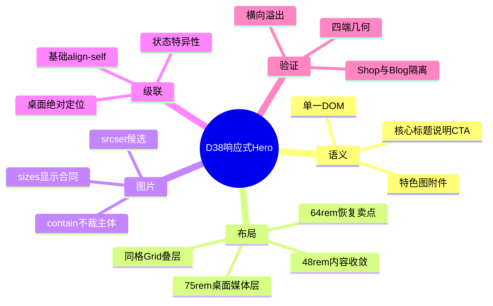
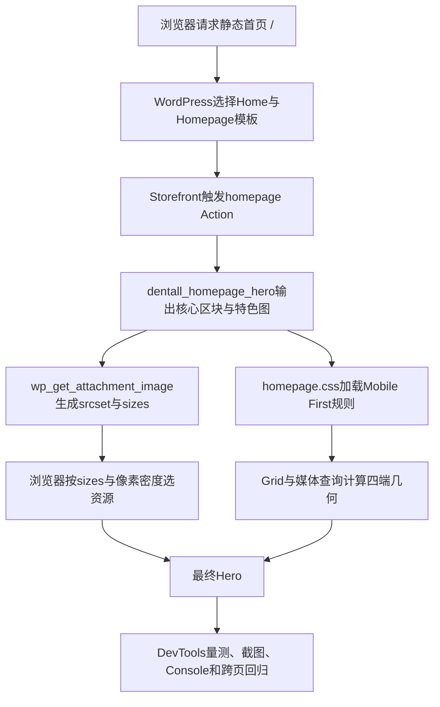

# Day38 WordPress实战：Grid叠层与响应式图片sizes

> [!summary] 先记结论
> 同一Hero DOM可以用CSS Grid把内容与媒体放进同一格，再通过48、64、75rem三个内容断点渐进改变宽度、卖点和定位；WordPress负责输出`srcset`候选，主题的`sizes`必须诚实描述CSS实际显示宽度。基础层属性会继续参与宽屏级联，改变定位模型时必须复查对齐和尺寸，否则移动端的一条`align-self`也可能让桌面图片越过Hero。

## 相关笔记

- 学习索引：[[WordPress实战笔记索引]]
- 对应项目笔记：[[../Day38-手机与平板首页Hero精调|Day38-手机与平板首页Hero精调]]
- 前置学习笔记：[[Day37-Homepage-Hook与响应式Hero]]
- 同主题知识：[[Day27-Design-Token与Mobile-First容器]]、[[Day31-四端设计稿还原与组件拆解]]、[[Day34-CSS断点级联与可访问状态]]
- 后续学习笔记：[[Day39-菜单驱动的分类查询与Flex换行]]

> [!check] 双向链接状态
> 本学习笔记已链接D38项目笔记和D37学习笔记；D38项目笔记、D37学习笔记与[[WordPress实战笔记索引]]也回链本笔记。

## 今日学习成果

- [ ] 我能解释为什么内容和图片放入同一Grid Area仍是一套DOM，以及`z-index`、Grid轨道和自然高度怎样配合。
- [ ] 我能从CSS实际媒体宽度推导`sizes`，并说明它与`srcset`、设备像素密度和`currentSrc`的关系。
- [ ] 我能用DevTools从“图片越过Hero”追到跨断点级联，并在Local完成最小修复、四端回归和回滚说明。

## 真实项目场景

### 今天解决了什么问题

D37在1200px以下采用安全上下堆叠，390/768/1024的Hero分别约731、845、885px，核心内容下面还有188px三项卖点和完整媒体行，明显比冻结意图更高。D38需要在不增加字段、不复制DOM、不生成素材的前提下，把文字和媒体压回同一Hero，并执行用户确认的“390/768隐藏辅助卖点，1024/1440显示”。

### 学习范围

- 本篇要掌握：同格Grid叠层、Mobile First断点级联、内容驱动高度、`srcset`/`sizes`合同、状态选择器特异性和浏览器几何验证。
- 本篇明确不展开：正式文案与素材授权、Art Direction专图、D39～D41区块、Staging/Production部署、交易流程。
- 项目真实入口：`app/public/wp-content/themes/dentall/assets/css/homepage.css`、`inc/homepage.php`、`style.css`和登录态Local首页。
- 验证版本与环境：WordPress 7.0.4、WooCommerce 11.0.0、Storefront 4.6.2、PHP 8.2.29、DentAll 0.16.0，仅Local。

## 先建立整体模型

### 一句话模型

HTML先提供稳定语义，CSS按内容需要改变同一组元素的空间关系，`sizes`再把最终显示宽度告诉浏览器，使布局合同和图片下载合同保持一致。

### 记忆宫殿：橱窗中的说明牌与展品

把Hero想成一个会伸缩的商店橱窗：

- 核心区块是左侧说明牌，特色图是右下展品，两者仍在同一个橱窗里。
- Grid Area是共同展台；`z-index`决定说明牌在展品前面。
- 48、64、75rem是三道可伸缩隔断，不是四台设备的专用房间。
- `srcset`是仓库可供选择的多种展品包装，`sizes`是现场管理员报给仓库的展位宽度。
- 级联像施工交接单：早期写下的“展品靠底”不会在桌面自动消失，若桌面改成绝对定位就必须明确重新指定高度和对齐。

### 比喻对应回真实机制

| 记忆对象 | 真实技术对象 | 不能混淆的边界 |
|---|---|---|
| 同一橱窗 | 单一`.dentall-home-hero__inner`语义DOM | 叠层不等于复制手机/PC页面 |
| 共同展台 | `grid-area: 1 / 1` | Grid位置不改变源码顺序和屏幕阅读顺序 |
| 三道隔断 | `48rem`、`64rem`、`75rem`媒体查询 | 断点来自内容，不是设备品牌型号 |
| 仓库包装 | WordPress `srcset`宽度候选 | 候选像素宽不等于CSS显示宽 |
| 展位申报 | HTML`sizes`属性 | `sizes`不裁图，也不强制浏览器选某一张 |

> [!warning] 准确性检查
> `display:none`不只是视觉隐藏，也会把卖点从辅助技术可访问树移除。本项目已明确把三项定义为辅助卖点并取得产品决定；若它们成为购买必需信息，就不能继续沿用。

## 思维导图



主干是：同一语义DOM先由CSS完成内容驱动的空间变化，再由准确`sizes`帮助浏览器选择资源，最后用真实四端几何验证级联结果。

## 请求与生命周期调用链



- 触发条件：请求命中Storefront Homepage模板。
- 加载入口：`dentall_enqueue_homepage_assets()`在`wp_enqueue_scripts`中条件加载`homepage.css`。
- 执行顺序：PHP先输出语义和响应式图片属性，浏览器再解析CSS、选择图片候选并完成布局。
- 输入数据：Home的`post_content`、特色图附件和当前视口。
- 输出或副作用：前台HTML、CSS布局与图片请求；不写数据库。
- 可观察证据：卖点计算`display`、Hero/媒体矩形、`currentSrc`、样式表URL和`scrollWidth/clientWidth`。

## 核心概念卡

| 概念 | 准确定义 | DentAll真实例子 | 常见误区 | 如何验证 |
|---|---|---|---|---|
| Grid叠层 | 多个Grid Item占据同一Grid Area并按层叠顺序呈现 | 内容与媒体均为`grid-area:1/1` | 认为叠层必须绝对定位或复制DOM | Elements查看Grid Area与元素数量 |
| Mobile First | 基础规则服务窄内容，较宽条件只增加差异 | 基础隐藏列表，64rem恢复三列 | 为390/768/1024/1440各写一整套CSS | 查看规则增量与命中媒体查询 |
| `srcset` | 同一图片资源的候选URL及宽度描述 | WordPress派生416、768等候选 | 把候选宽度当实际显示宽 | 查看HTML与`currentSrc` |
| `sizes` | 在各媒体条件下预告图片CSS槽位宽 | 平板约`calc(56vw - 36px)` | 写成整屏宽，期待CSS自动纠正 | 对比媒体框宽与sizes计算 |
| 特异性 | 选择器权重与源码顺序共同决定最终声明 | 缺图状态需压过48/64rem普通内容宽 | 只把状态规则写在前面就认为永久有效 | Computed查看被覆盖声明 |

## 项目实战代码

### 涉及文件

- `app/public/wp-content/themes/dentall/assets/css/homepage.css`：同格叠层、状态和三个渐进断点。
- `app/public/wp-content/themes/dentall/inc/homepage.php`：WordPress响应式图片输出及`sizes`。
- `app/public/wp-content/themes/dentall/style.css`：主题0.16.0缓存版本。

### 从入口开始追踪

1. `functions.php`继续加载`inc/homepage.php`，D38没有新增入口。
2. Homepage模板命中时，现有enqueue回调加载`homepage.css?ver=0.16.0`。
3. `dentall_homepage_hero()`用`wp_get_attachment_image()`输出特色图候选与新的`sizes`。
4. 基础CSS让内容与媒体共享Grid Area；48rem收窄内容，64rem恢复卖点，75rem切换桌面媒体层。
5. 若移除64rem规则，1024卖点会继续隐藏；若删除桌面`block-size:100%`，当前占位图会按512px固有高度越过352px Hero。

### 关键代码片段

源自`homepage.css`，展示同一DOM的基础层与卖点断点：

```css
.page-template-template-homepage .dentall-home-hero__content,
.dentall-home-hero__media {
	grid-area: 1 / 1;
}

.dentall-home-hero__content > ul {
	display: none;
}

@media (min-width: 64rem) {
	.dentall-home-hero__content > ul {
		display: grid;
		grid-template-columns: repeat(3, minmax(0, 1fr));
	}
}
```

源自`inc/homepage.php`，展示图片槽位合同：

```php
'sizes' => '(min-width: 1320px) 768px, (min-width: 1200px) calc(63vw - 40px), (min-width: 768px) calc(56vw - 36px), calc(56vw - 22px)',
```

| 代码 | 表面动作 | WordPress/浏览器中的真实作用 | 为什么这样写 |
|---|---|---|---|
| `grid-area:1/1` | 两元素坐标相同 | 保留源码中的一套语义节点 | 避免设备专用DOM |
| `display:none` | 小屏不画列表 | 同时从布局与可访问树移除辅助卖点 | 执行已确认产品取舍 |
| `repeat(3,minmax(0,1fr))` | 三等列 | 允许长词换行且不反向撑破Grid | 1024/1440均需三列 |
| `sizes`条件串 | 描述图片槽位 | 浏览器结合`srcset`和DPR选候选 | 避免把平板误报成768px整宽 |

### 运行证据

- 命令与页面：Local PHP 8.2.29 lint、HTTP HEAD、登录态`/`四端DevTools、`/shop/`与`/blog/`资源隔离。
- 正常结果：四端Hero约320/320/333/352px；390/768列表`none`，1024/1440为三列；均无横向溢出。
- 失败结果：首轮1440媒体为768×512px并覆盖Newsletter；原因是基础层`align-self:end`进入绝对定位桌面层。
- 修复证据：桌面显式`align-self:stretch; block-size:100%`后媒体和Hero均为352px，`overlapNewsletter=false`。
- 精度边界：当前`sizes`与实测媒体槽误差约0%～5%；1283～1319px窄区间可能让DPR 1多选1024px候选，属于Code Review P3，不影响布局、清晰度或SEO，只有取得冷缓存传输收益证据后才值得增加表达式复杂度。
- 证据不能证明：当前3:2实色TEST图不能证明正式透明素材的主体比例、无缝效果、授权和Production清晰度。

## 职责边界

| 层级 | 本主题中负责什么 | 不应该负责什么 |
|---|---|---|
| WordPress Core | Page内容、附件元数据、图片候选HTML | 不修改核心文件，不决定DentAll四端几何 |
| WooCommerce | 提供Storefront运行环境和商城页面 | 本轮不承担Hero内容或交易状态 |
| Storefront父主题 | Homepage模板与公共Hook | 不直接修改父主题样式/模板 |
| DentAll子主题 | 条件输出、页面专用CSS、媒体槽位合同 | 不承载价格、库存或跨主题业务规则 |
| `dentall-core` | 本轮不参与 | 不把纯展示CSS塞入业务插件 |
| 数据库与媒体 | 保存Home内容与特色图附件 | 不把TEST文案/实色图当正式内容或授权 |
| 浏览器 | 计算媒体查询、Grid、图片候选与几何 | 不把视觉状态当服务端数据事实 |

## Hook、API与CSS机制详解

| 项目 | 说明 |
|---|---|
| 机制类型 | Enqueue＋WordPress Image API＋CSS Grid/Media Query |
| 名称或入口 | `dentall_enqueue_homepage_assets()`、`wp_get_attachment_image()`、`homepage.css` |
| 注册位置 | `inc/homepage.php`中的`wp_enqueue_scripts`，优先级50 |
| 输入 | 当前Page模板、附件ID、图片属性和视口 |
| 返回/输出 | Enqueue无业务返回；图片API返回转义后的`img`HTML |
| 副作用 | 只在Homepage增加一个已有CSS请求并发起所选图片请求 |
| 影响范围 | 前台Storefront Homepage模板；Shop和Blog不加载 |
| 移除方式 | 回滚三个D38运行文件；不改父主题或数据库 |

## 安全、数据与站点影响

| 检查面 | 本次结论 | 证据或待验证项 |
|---|---|---|
| 输入清洗与验证 | 不新增输入 | 只读Page与附件ID |
| Capability/Nonce | 不适用 | 无后台动作、表单或写请求 |
| 输出转义 | 沿用D37边界 | 图片由WordPress API输出；类名转义不变 |
| 数据库写入 | 无 | 未修改Home、附件或Options |
| URL与SEO | URL/Canonical/Schema/H1结构不变 | 小屏隐藏辅助卖点是产品决定，不是SEO策略 |
| 缓存 | 主题版本升至0.16.0 | 浏览器实际加载新查询版本；服务器缓存配置未改 |
| 支付、物流与订单 | 不适用 | 无交易代码 |
| 部署与回滚 | 仅Local | Staging/Production未部署；源码回滚即可 |

## 动手练习

### 练习一：只读观察

- 目标：判断当前视口为什么显示或隐藏三项卖点。
- 操作：在DevTools选中Hero直系`ul`，查看Computed `display`和命中的64rem规则。
- 预期：390/768为`none`，1024/1440为`grid`。
- 实际证据：D38四端浏览器量测与截图符合预期。

### 练习二：Local最小改动

- 改动：在DevTools临时把媒体宽从56%改为52%，观察内容和图片安全区；不保存到后台。
- 风险边界：仅Local临时样式，不改核心、数据、支付或Production。
- 验证：量测媒体框、标题/CTA交叠和横向溢出，再关闭DevTools恢复。
- 回滚：刷新页面即可；若决定采用，回源码并同步重算`sizes`。

### 练习三：故障推演

- 假设症状：1440图片再次越过Hero压住Newsletter。
- 可能原因：基础层对齐泄漏、桌面媒体没有确定高度、缓存仍是旧CSS。
- 第一项检查：同时量测Hero与媒体`getBoundingClientRect()`，再查媒体Computed `align-self`和`block-size`。
- 为什么先查它：先证明是几何/级联问题，避免误改图片文件或Newsletter。

## 常见误区与排错顺序

| 现象或误区 | 可能原因 | 推荐检查顺序 | 最小验证方法 |
|---|---|---|---|
| 平板下载的图过大 | `sizes`仍写整屏或旧布局宽 | 1.量媒体框；2.算sizes；3.看`currentSrc` | 对比Computed宽与属性 |
| 缺图后内容仍半宽 | 状态规则被后置媒体查询覆盖 | 1.查类名；2.查Computed被划线声明；3.比较特异性 | 不改数据库，静态/Computed复核 |
| 桌面图片覆盖下一区块 | 基础`align-self`进入绝对定位层 | 1.量Hero/媒体底边；2.查定位和高度；3.复核级联 | 媒体底边应等于Hero底边 |
| 为四端复制HTML | 把截图宽度误当内容模型 | 1.查DOM数量；2.查断点差异；3.收敛共用结构 | Hero应只有一个语义实例 |

## 掌握标准

- [ ] 不看笔记，能在2分钟内讲清“DOM—Grid—断点—sizes—浏览器选图”因果链。
- [ ] 能指出`homepage.css`和`homepage.php`中的真实入口。
- [ ] 能区分WordPress附件候选、CSS显示尺寸与素材Art Direction。
- [ ] 能说明正常路径、桌面溢出失败路径和缺图级联路径。
- [ ] 能在Local完成四端几何与非首页资源隔离验证。
- [ ] 能说明本次对数据、URL/SEO、缓存、交易和部署的影响。

当前掌握度：初识，待费曼自测。

## 费曼测试题

1. 不使用专业术语，怎样向同事解释为什么同一Hero可以同时适配手机、平板和PC？
2. `grid-area:1/1`会不会改变HTML源码顺序或屏幕阅读顺序？`z-index`实际改变了什么？
3. 浏览器拿到`srcset`和`sizes`后怎样选择图片？为什么不能保证每次都选你预测的那个候选？
4. 56%媒体宽在移动和宽屏gutter下，为什么分别近似扣22px与36px？
5. 为什么基础层`align-self:end`能影响75rem后的绝对定位媒体？本次如何用证据定位和修复？
6. 缺图状态规则为什么会被后写的50%/54%普通规则覆盖？有哪两种最小修法？
7. 如果迁移到其他主题或Shopify，哪些原则不变，哪些Hook、媒体API和发布机制必须重新验证？

### 我的费曼答案与纠正

待自测。逐题标记`通过`、`含糊`或`答错`，并链接回本篇对应章节。

### 自测评分

| 分数 | 标准 |
|---:|---|
| 0 | 无法解释，或只能猜术语 |
| 1 | 能说定义，但说不清因果、边界和证据 |
| 2 | 能用通俗语言解释，并准确对应技术机制与项目证据 |

总分：尚未自测 / 14；存在0分题时不提升掌握度。

## 间隔复习记录

| 复习节点 | 计划日期 | 完成 | 暴露的问题 | 修正位置 |
|---|---|---|---|---|
| D+1 | 2026-08-30 | [ ] | 复习后记录 | 复习后记录 |
| D+3 | 2026-09-01 | [ ] | 复习后记录 | 复习后记录 |
| D+7 | 2026-09-05 | [ ] | 复习后记录 | 复习后记录 |
| D+14 | 2026-09-12 | [ ] | 复习后记录 | 复习后记录 |

## 收尾总结

- 我今天真正理解了：响应式布局和响应式图片是两个相互依赖、但职责不同的合同。
- 我仍然容易混淆：图片候选像素宽、`naturalWidth`、CSS显示宽和设备像素密度。
- 下次遇到类似问题，我会先检查：DOM是否唯一、Grid/定位几何、Computed级联、`sizes`和`currentSrc`。
- 下一篇直接相关学习笔记：[[Day39-菜单驱动的分类查询与Flex换行]]。

## 后续如何向AI高效提问

### 可复制提示词

```text
这是一个WordPress响应式Hero排错任务。

环境：[WordPress/WooCommerce/PHP/父主题/子主题版本，Local或Staging]
真实入口：[模板、Hook、PHP和CSS文件]
当前DOM：[只贴Hero最小结构]
目标视口：[390/768/1024/1440]
预期：[内容、卖点、媒体的显示规则]
实测：[Hero/内容/媒体矩形，scrollWidth/clientWidth，currentSrc]
当前sizes：[完整属性]
风险边界：[不改核心、不写数据库、不生成素材、不碰Production]

请先区分：HTML语义、CSS布局、响应式图片选择和素材构图；再按证据解释级联，给出最小修复、四端验证和回滚。不要为四端复制DOM，也不要用cover掩盖素材问题。
```

> [!warning] AI验证边界
> AI对断点、候选图或其他平台的推断不是验收证据；必须回到真实源码、Computed样式、HTTP资源和Local四端页面核实。

## 变种应用到其他项目

| 新场景 | 保持不变的原则 | 可能变化的实现 | 必须重新确认 | 最小验证 |
|---|---|---|---|---|
| 另一个Storefront子主题 | 单一DOM、内容断点、真实sizes | Token、Hook优先级和素材比例 | 主题/插件版本、已有覆盖 | 四端DOM/几何/资源 |
| 其他经典WordPress主题 | 语义与展示分责 | Homepage模板与扩展点 | 主题模板层级和enqueue | 代表页面及非目标页隔离 |
| WordPress区块主题 | 同一内容模型与响应式媒体 | Block模板、`theme.json`、区块样式 | 当前核心版本和编辑器输出 | 前后台一致性与四端 |
| 独立插件 | 资源按页面加载 | 插件生命周期和样式作用域 | 是否应跨主题存在 | 启停、冲突、回滚 |
| Shopify或其他平台 | 内容、媒体与布局合同分层 | Section、Liquid/组件和CDN图片API，待验证 | 官方字段、发布和资源选择机制 | 平台真实预览与网络证据 |

### 变种练习

迁移前先回答：原问题是否仍存在；哪些原则可直接迁移；哪些WordPress Hook/API必须替换；最少需要查证哪些官方资料；如何避免把外观相似误当实现相同。

## 可复用核心思想

### 跨平台不变量

- 一套语义DOM、内容驱动断点和逐层增强比按设备复制页面更稳定；视口只是验收锚点。
- 布局槽位与图片候选选择必须用同一组事实描述，不能让`sizes`停留在旧版布局。
- 级联是完整因果链的一部分；切换Grid、Flex或绝对定位时，要审计从基础层继承的对齐、尺寸和溢出属性。

### WordPress/WooCommerce当前实现

- WordPress 7.0.4通过`wp_get_attachment_image()`提供附件尺寸、Alt、`srcset`和`sizes`；DentAll 0.16.0只在Storefront Homepage模板加载页面CSS。
- WooCommerce交易模型本轮不参与；Storefront只提供Homepage模板和Action装配点，子主题不修改父主题核心。

### Shopify或其他平台的对应机制

- 可迁移的是“可编辑语义内容＋平台媒体候选＋组件级响应式布局＋真实网络验证”；Shopify的Section字段、Liquid图片过滤器、CDN候选和发布机制本日未验证，标记为待验证，不自动进入DentAll实施范围。
