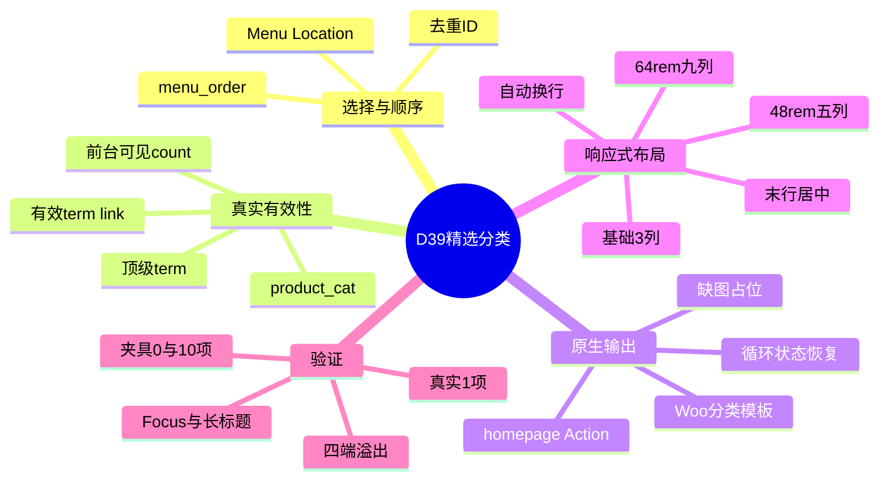
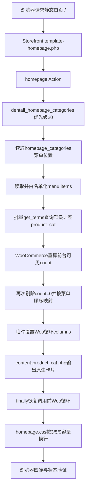

# Day39 WordPress实战：菜单驱动的分类查询与Flex换行

> [!summary] 先记结论
> 首页精选分类不是“把全部分类自动倒出来”，而是把原生菜单当作选择与排序清单，再回到真实`product_cat`验证顶级、前台可见数量和链接，最后交给WooCommerce原生分类模板输出。CSS只规定每行3/5/9个的容量，`flex-wrap`按实际总数继续换行；9是桌面行容量，不是数据上限。复用Woo模板时还要精确恢复全局循环，否则今天的分类区会污染明天的商品区。

## 相关笔记

- 学习索引：[[WordPress实战笔记索引]]
- 对应项目笔记：[[../Day39-首页精选分类入口与自适应换行|Day39-首页精选分类入口与自适应换行]]
- 前置学习笔记：[[Day38-Grid叠层与响应式图片sizes]]
- 卡片契约前置：[[Day29-原生循环与卡片展示契约]]
- 同主题知识：[[Day32-原生菜单与Storefront下拉机制]]、[[Day36-菜单数据绑定与静态响应式重排]]
- 后续学习笔记：[[Day40-菜单驱动的Page映射与原生摘要]]

> [!check] 双向链接状态
> 本学习笔记链接D39项目笔记和D38学习笔记；D39项目笔记、D38学习笔记与[[WordPress实战笔记索引]]也回链本笔记。

## 今日学习成果

- [ ] 我能解释为什么菜单只负责“选择和顺序”，分类名称、URL、图片和可见状态必须回到`product_cat`。
- [ ] 我能沿`homepage` Action追踪菜单位置、菜单项、term查询、Woo可见count、原生模板和循环状态恢复。
- [ ] 我能用同一DOM验证0/1/9/10项在390/768/1024/1440自动换行，并说明何时应改数据、组件或局部布局。

## 真实项目场景

### 今天解决了什么问题

D29已经冻结CategoryCard内部结构，但当时没有正式分类数据，页面级查询、顺序、空态和网格故意留到D39。业务方未来可能选1个、9个或更多分类，开发时又不能猜正式分类树。因此D39需要一个不硬编码ID、名称和总数量的入口，同时保证菜单里的自定义链接、子分类、空分类、重复项或失效链接不会变成首页卡片。

### 学习范围

- 本篇要掌握：Menu Location、菜单项与term的职责、`get_terms()`过滤、WooCommerce前台可见count、原生分类模板、请求级循环状态、Flex换行和末行居中。
- 本篇明确不展开：正式分类命名/图片授权、批量分类治理、筛选导航、D40 Solutions、D44 Shop网格、Staging/Production部署和交易流程。
- 项目真实入口：`app/public/wp-content/themes/dentall/inc/homepage.php`、`assets/css/homepage.css`、`style.css`、`外观 → 菜单`和Local登录态首页。
- 验证版本与环境：WordPress 7.0.4、WooCommerce 11.0.0、Storefront 4.6.2、PHP 8.2.29、DentAll 0.17.0，仅Local。

## 先建立整体模型

### 一句话模型

运营清单先说“展示谁、谁在前”，系统数据再证明“对象是否仍真实可见”，模板负责安全输出，布局只根据最终条目数安排空间。

### 记忆宫殿：商场橱窗的选品单

把首页分类区想成商场橱窗：

- 菜单是店长的选品单，只写要摆哪些品类和先后顺序。
- `product_cat`是仓库主档，保存真实名称、图片、链接和商品数量。
- WooCommerce可见性规则是营业前安检：只含隐藏或按设置不可见商品的分类，不能因为仓库原始计数非0就进入橱窗。
- `content-product-cat.php`是统一陈列工，负责按平台规范放链接、图片和标题。
- `$GLOBALS['woocommerce_loop']`是陈列工的当前排位表；借用后必须还原。
- Flex货架按当前门店宽度每排容纳3、5或9张卡，多出的继续下一排，最后一排放中间。

### 比喻对应回真实机制

| 记忆对象 | 真实技术对象 | 不能混淆的边界 |
|---|---|---|
| 店长选品单 | WordPress Menu Location与menu item顺序 | 菜单自定义标题/URL不替代term事实 |
| 仓库主档 | `product_cat`的`WP_Term`、term meta和归档URL | 当前TEST分类不等于正式业务分类 |
| 营业安检 | WooCommerce对前台可见商品的term count重算 | WordPress初次`hide_empty`不一定是最终访客可见结果 |
| 统一陈列工 | `content-product_cat.php`及其Hooks | 复用模板不等于复制或覆盖第三方文件 |
| 排位表 | `$GLOBALS['woocommerce_loop']` | 请求级全局状态必须精确恢复 |
| 可换行货架 | `display:flex`、`flex-wrap`和`flex-basis` | 每行容量不等于总条目上限 |

> [!warning] 准确性检查
> “菜单像选品单”不代表菜单是独立业务数据库。删除、隐藏或改名分类后，首页仍必须根据真实term重新验证；反过来，未加入专用菜单的有效分类也不会自动出现。

## 思维导图



最重要的主干是：菜单候选必须经过真实term和前台可见性二次验证，最终条目才交给模板与Flex；数据合同和布局合同不能互相代替。

## 请求与生命周期调用链



- 触发条件：请求命中Storefront Homepage模板且至少有一个有效精选分类。
- 加载入口：`functions.php`加载`inc/homepage.php`，`after_setup_theme`注册位置和Homepage回调。
- 执行顺序：菜单候选→批量term→Woo可见count→菜单顺序→原生模板→循环恢复→CSS布局。
- 输入数据：菜单位置绑定、菜单项目、`product_cat`、商品可见性设置和视口宽度。
- 输出或副作用：只读查询与首页HTML/图片请求；不写数据库。
- 可观察证据：menu ID、term ID/count、输出项数、`columns-*`、链接、占位图、Flex几何和全局循环恢复值。

## 核心概念卡

| 概念 | 准确定义 | DentAll真实例子 | 常见误区 | 如何验证 |
|---|---|---|---|---|
| Menu Location | 主题注册的语义化菜单槽位 | `homepage_categories`绑定menu ID 27 | 把菜单名或ID硬编码进模板 | `get_nav_menu_locations()` |
| Menu Item | 指向Page、term或自定义URL的排序记录 | 当前唯一项目指向term ID 18 | 直接信任自定义标题、URL和层级 | 检查`type/object/object_id` |
| `product_cat` | WooCommerce商品分类taxonomy中的term | `TEST D12 Products`，parent 0，count 2 | 新建重复CPT或静态数组 | `get_term()`/`get_terms()` |
| `hide_empty` | WordPress查询阶段过滤count为0的term | D39查询参数为true | 认为它已覆盖Woo后续可见性重算 | 模拟Woo把返回count改为0 |
| `pad_counts` | 将子级对象计数向父级汇总 | 父分类有子级商品时仍可判非空 | 把它理解成显示子分类 | 查看最终parent和count |
| Woo循环状态 | 原生循环模板使用的请求级全局属性 | `columns`、`loop` | 用`wc_reset_loop()`抹掉调用方状态 | 设置哨兵值后渲染并比较 |
| Flex换行 | 项目按基准宽度与可用空间分行 | 390/768/1024为3/5/9容量 | 把9写成查询总数或复制四套DOM | 1/4/8/9/10项四端几何 |

## 项目实战代码

> [!important] 代码真实性
> 以下片段均来自DentAll当前源码，只摘录理解所需的最小部分；完整安全边界以文件现状为准。

### 涉及文件

- `app/public/wp-content/themes/dentall/inc/homepage.php`：菜单位置、候选过滤、原生模板输出和Woo循环隔离。
- `app/public/wp-content/themes/dentall/assets/css/homepage.css`：Homepage分类区域与3/5/9 Flex布局。
- `app/public/wp-content/themes/dentall/style.css`：D29 CategoryCard内部视觉和0.17.0缓存版本。
- `project-docs/tests/fixtures/day39-home-categories/index.html`：不写数据库的10项真实DOM/CSS验证夹具。

### 从入口开始追踪

1. `dentall_configure_homepage()`注册`Homepage categories`并把分类回调挂到`homepage`优先级20。
2. `dentall_get_homepage_categories()`取得当前位置菜单，只接受`taxonomy/product_cat`并去重ID。
3. `get_terms()`一次批量查询；WooCommerce过滤器可能在WordPress完成`hide_empty`后重新计算可见count。
4. 代码再次排除`count=0`，再按菜单ID数组恢复运营顺序并预检term link。
5. `dentall_homepage_categories()`临时设置循环列数，调用Woo原生模板，最终精确恢复调用前全局。
6. 浏览器加载既有`homepage.css`，Flex按实际条目数与容器宽度换行。
7. 若移除二次count过滤，只含目录隐藏/按设置隐藏售罄商品的分类可能出现空归档入口；若不恢复循环，后续商品区的`first/last`和列数可能错乱。

### 关键代码片段

源自`inc/homepage.php`，展示WordPress初筛后的Woo可见count二次过滤：

```php
$categories = get_terms(
	array(
		'taxonomy'   => 'product_cat',
		'include'    => $category_ids,
		'parent'     => 0,
		'hide_empty' => true,
		'pad_counts' => true,
	)
);

$categories = wp_list_filter( $categories, array( 'count' => 0 ), 'NOT' );
```

源自同一文件，展示调用方循环状态隔离：

```php
$had_woocommerce_loop      = array_key_exists( 'woocommerce_loop', $GLOBALS );
$previous_woocommerce_loop = $had_woocommerce_loop ? $GLOBALS['woocommerce_loop'] : null;

wc_set_loop_prop( 'columns', min( 9, count( $categories ) ) );

try {
	// 输出WooCommerce原生分类循环。
} finally {
	if ( $had_woocommerce_loop ) {
		$GLOBALS['woocommerce_loop'] = $previous_woocommerce_loop;
	} else {
		unset( $GLOBALS['woocommerce_loop'] );
	}
}
```

源自`homepage.css`，展示条目总数与行容量分离：

```css
.page-template-template-homepage .dentall-home-categories ul.products {
	display: flex;
	flex-wrap: wrap;
	justify-content: center;
	gap: var(--dentall-space-24) var(--dentall-space-16);
}

.page-template-template-homepage .site-main .dentall-home-categories ul.products > li.product-category {
	flex: 0 0 calc(33.333333% - var(--dentall-space-16));
}
```

48rem只把`flex-basis`改为约20%，64rem改为约11.111%；没有给PHP总数加9项截断。

### 运行证据

- 后台路径：`外观 → 菜单`；用户把`TEST D39 Homepage Categories`绑定到`Homepage categories`。
- 真实数据：menu ID 27、term ID 18、parent 0、count 2、thumbnail 0。
- 正常结果：真实PHP输出1个section/1个li/占位图/count标记/正确URL，首页局部隐藏count。
- 失败边界：临时取消菜单位置时输出0字节；强制term link为空时0项；模拟Woo可见count变0时0项和0字节。
- 循环证据：调用前有哨兵数组时完整还原；原先没有全局时渲染后仍不存在。
- 布局证据：24/24数量×四端矩阵通过；末行中心偏差最大0.008px，页面/列表溢出0，长标题无右溢出，Focus 3px实线/offset 3px。
- 证据不能证明：当前TEST名称、图片、商品归属、排序和分类URL适合正式业务，也不能证明Staging/Production缓存或CWV。

## 职责边界

| 层级 | 本主题中负责什么 | 不应该负责什么 |
|---|---|---|
| WordPress Core | Menu Location、菜单后台、term API、Capability与Nonce | 不修改核心，不把菜单项目当term本身 |
| WooCommerce | `product_cat`、前台可见count、分类模板、占位图和循环API | 不直接读写内部表，不复制第三方模板 |
| Storefront父主题 | Homepage模板、Action和基础Woo样式 | 不直接修改父主题文件 |
| DentAll子主题 | Homepage组合、局部过滤、语义区块与响应式布局 | 不承载跨主题价格/库存/订单业务规则 |
| `dentall-core` | 本轮不参与 | 不把纯Homepage展示代码塞入站点业务插件 |
| 数据库与媒体 | 保存菜单、term、分类图和商品归属 | 不把TEST值或未授权图片当正式内容 |
| 浏览器 | 计算Flex、换行、Focus、图片和溢出 | 不把视觉空态当作服务端term不存在 |

## Hook、API与模板机制详解

| 项目 | 说明 |
|---|---|
| 机制类型 | Theme support/Menu Location＋Action＋Term API＋Woo Template＋CSS Flex |
| 名称或入口 | `after_setup_theme`、`homepage`、`get_nav_menu_locations()`、`wp_get_nav_menu_items()`、`get_terms()`、`content-product_cat.php` |
| 注册位置 | `inc/homepage.php`；Homepage分类回调优先级20，Hero为10 |
| 回调输入 | 当前菜单位置、菜单项目、product_cat和Woo可见性设置 |
| 必须返回内容 | helper返回有序`WP_Term[]`；Action回调直接输出或静默返回 |
| 副作用 | 前台只读查询、HTML与分类图片请求；临时修改后恢复Woo循环全局 |
| 影响范围 | Storefront Homepage模板；count隐藏仅限`.dentall-home-categories` |
| 移除或覆盖方式 | 回滚D39运行文件或在后台取消位置绑定；不删分类、不改核心 |

## 安全、数据与站点影响

| 检查面 | 本次结论 | 证据或待验证项 |
|---|---|---|
| 输入清洗与验证 | 菜单对象ID使用`absint`，类型/object/顶级/count/link均验证 | 自定义链接、重复项、空位置和空link被排除 |
| Capability | 新代码无写请求；菜单保存沿用核心`edit_theme_options` | Website Manager未获此能力 |
| Nonce | 新代码不处理表单；原生菜单后台由WordPress核心处理 | Nonce不能替代Capability，本轮未自建保存端点 |
| 输出转义 | 区域固定属性、翻译标题与Woo原生模板输出 | 链接先预检，模板再按上下文转义 |
| 数据库写入 | 代码无；用户通过原生后台保存菜单绑定 | 当前menu ID 27只属于Local TEST配置 |
| URL与SEO | 不创建/改写路由；首页新增现有分类内部链接 | 正式上线前审核TEST URL、Canonical与分类内容质量 |
| 缓存 | 主题升至0.17.0刷新Homepage CSS查询版本 | 未改页面/对象缓存；查询结果受核心缓存影响 |
| 支付、物流与订单 | 不适用 | 无交易代码或数据变化 |
| 部署与回滚 | 仅Local；源码＋菜单位置可分别回滚 | Staging/Production未验证 |

## 动手练习

### 练习一：只读观察

- 目标：证明首页顺序来自菜单，但卡片文本和URL来自term。
- 操作：在菜单后台只读查看项目顺序，再用PHP/DevTools查看`object_id`、卡片标题和href。
- 预期：menu ID 27指向term 18，标题与URL匹配真实term。
- 实际证据：`TEST D12 Products`与`/product-category/test-d12-products/`一致。

### 练习二：Local最小改动

- 改动：只在非持久化夹具中把10个`li`临时删到8个，观察四端末行。
- 风险边界：不新增真实分类、不改数据库、不碰Staging/Production。
- 验证：390为3＋3＋2，768为5＋3，1024/1440为8，末行居中且无溢出。
- 回滚：关闭临时浏览器修改或恢复夹具文件；业务菜单不受影响。

### 练习三：故障推演

- 假设症状：首页出现一个可点击但访客归档为空的分类。
- 可能原因：分类只含目录隐藏商品、启用隐藏售罄后可见count变0、页面缓存陈旧或菜单仍选中失效项。
- 第一项检查：读取最终返回term的`count`和Woo目录可见性设置，再检查真实分类归档。
- 为什么先查它：先区分数据可见性与CSS显示问题，避免误改Flex或图片。

## 常见误区与排错顺序

| 现象或误区 | 可能原因 | 推荐检查顺序 | 最小验证方法 |
|---|---|---|---|
| 认为`hide_empty`已彻底安全 | Woo在其后按可见性把count重算为0 | 1.看最终count；2.看可见性设置；3.看归档 | `get_terms`后再次过滤count |
| 拖动菜单但页面顺序不变 | 菜单位置绑错、缓存或代码按查询顺序输出 | 1.查location/menu ID；2.查item顺序；3.查映射数组 | 输出ID序列，不改数据库 |
| 10项只显示9项 | 把桌面列数误写成查询`number`/切片 | 1.查PHP总数；2.查DOM项数；3.查Flex行 | DOM应有10个li，视觉9＋1 |
| 最后一行被拉成巨卡 | 使用`flex-grow:1`或Grid自动拉伸 | 1.查flex简写；2.查basis；3.查justify | 1项保持标准卡宽且中心偏差近0 |
| 后续商品区first/last错乱 | 本区块重置或遗留Woo循环全局 | 1.设哨兵；2.渲染；3.比较全局 | 两种调用前状态均精确恢复 |
| count在所有页面都消失 | 选择器未限定Homepage分类区 | 1.查Computed来源；2.查选择器作用域 | 规则必须以`.dentall-home-categories`开头 |

## 掌握标准

- [ ] 不看笔记，能在2分钟内讲清“菜单候选→term事实→可见count→模板→Flex”的因果链。
- [ ] 能指出Menu Location、`product_cat`和Woo分类模板的真实入口。
- [ ] 能解释WordPress `hide_empty`与WooCommerce最终前台可见count的先后关系。
- [ ] 能说明0项、失效link和隐藏商品分类的失败路径。
- [ ] 能在Local验证1/9/10项、四端末行、Focus与无溢出。
- [ ] 能说明数据、URL/SEO、缓存、权限、交易和部署影响。

当前掌握度：初识，待费曼自测。

## 费曼测试题

1. 不用专业术语，怎样解释为什么首页不能直接显示全部分类，也不能把9个名称写死在PHP里？
2. 菜单项目、`WP_Term`和分类归档URL分别是什么对象；哪一个是内容事实来源？
3. 从浏览器请求首页开始，按顺序讲出`homepage` Action到分类卡HTML的调用链。
4. 为什么`hide_empty=true`后还要再排除`count=0`？WooCommerce在哪个业务维度改变了“空”的含义？
5. 为什么临时调用WooCommerce分类模板会影响`first/last`，D39怎样保证不污染后续循环？
6. 10个分类在390/768/1024为何分别是3＋3＋3＋1、5＋5、9＋1？哪一部分决定总数，哪一部分决定行容量？
7. 迁移到其他主题或Shopify时，哪些原则不变，哪些Hook、数据对象、模板和发布能力必须重新验证？

### 我的费曼答案与纠正

待自测。逐题标记`通过`、`含糊`或`答错`，并链接回本篇对应章节；不能只复述函数名。

### 自测评分

| 分数 | 标准 |
|---:|---|
| 0 | 无法解释，或只能猜术语 |
| 1 | 能说定义，但说不清因果、边界和证据 |
| 2 | 能用通俗语言解释，并准确对应技术机制与项目证据 |

总分：尚未自测 / 14；存在0分题时不提升掌握度。

## 间隔复习记录

| 复习节点 | 计划日期 | 完成 | 暴露的问题 | 修正位置 |
|---|---|---|---|---|
| D+1 | 2026-08-30 | [ ] | 复习后记录 | 复习后记录 |
| D+3 | 2026-09-01 | [ ] | 复习后记录 | 复习后记录 |
| D+7 | 2026-09-05 | [ ] | 复习后记录 | 复习后记录 |
| D+14 | 2026-09-12 | [ ] | 复习后记录 | 复习后记录 |

## 收尾总结

- 我今天真正理解了：运营选择、业务对象有效性、模板输出和响应式布局是四个独立但串联的合同。
- 我仍然容易混淆：WordPress原始term count、WooCommerce前台可见count和浏览器里是否看见卡片。
- 下次遇到类似问题，我会先检查：数据位置绑定、候选类型、最终count/link、输出DOM、循环全局和Flex几何。
- 下一篇直接相关学习笔记：D40真实工作完成后创建并双向链接。

## 后续如何向AI高效提问

### 可复制提示词

```text
这是一个WordPress/WooCommerce精选分类入口排错任务。

环境：[WordPress/WooCommerce/PHP/父主题/子主题版本，Local或Staging]
页面入口：[Homepage模板与Action]
菜单位置：[location key、绑定menu ID、菜单项type/object/object_id顺序]
分类事实：[term ID、parent、最终count、thumbnail、term link]
可见性设置：[目录可见性、隐藏售罄等]
预期数量与视口：[0/1/9/10项，390/768/1024/1440]
实际DOM与几何：[li数量、columns类、行分组、scrollWidth/clientWidth]
循环上下文：[调用前后woocommerce_loop]
风险边界：[不改核心、不写Production、不新增正式分类]

请按“菜单候选→term查询→Woo可见性→链接/模板→循环状态→CSS布局”顺序排查，区分事实、推断和待验证项，给出最小修复、只读负向测试和回滚。
```

> [!warning] AI验证边界
> AI生成的Hook、平台映射或可见性结论不是项目证据。版本相关行为优先核对当前WooCommerce源码，并用Local真实对象与不持久化负向过滤复演。

## 变种应用到其他项目

| 新场景 | 保持不变的原则 | 可能变化的实现 | 必须重新确认 | 最小验证 |
|---|---|---|---|---|
| 另一个Storefront子主题 | 选择/事实分离、批量查询、循环恢复 | Token、菜单位置、Homepage优先级 | Woo/Storefront版本和已有回调 | 0/1/多项及后续循环 |
| 其他经典WordPress主题 | 真实term与布局职责不变 | 主题Hook、模板包装和CSS冲突 | 主题扩展点与菜单权限 | 目标页和非目标页隔离 |
| WordPress区块主题 | 精选对象清单与有效性不变 | Navigation/Query块、Block模板、`theme.json` | 当前核心和Woo Blocks能力 | 编辑器/前台一致性 |
| 独立插件 | 数据验证与缓存边界不变 | 独立生命周期、短代码/块或REST | 是否确需跨主题复用 | 启停、权限、查询和回滚 |
| Shopify或其他平台 | 精选清单＋真实分类/集合对象＋响应式组件 | 导航、Section字段、模板和CDN机制，待验证 | 官方选择器、权限、URL和发布模型 | 平台真实预览与多数量 |

### 变种练习

迁移前先回答：原业务问题是否仍存在；哪些选择/有效性/布局原则能直接迁移；哪些WordPress Hook、taxonomy和Woo循环必须替换；最少查证哪些官方机制；如何避免把名称相似误当对象相同。

## 可复用核心思想

### 跨平台不变量

- 运营层负责“选谁和排序”，业务数据层负责“对象是谁且是否有效”，展示层负责“怎样输出和排布”；混在一起会导致硬编码、失效链接或无法安全维护。
- 每行容量、总数据量和最后一行对齐是三个不同决定。响应式组件应允许总量变化，并用0/1/满行/多一项验证边界。
- 平台提供的初筛不一定是最终业务可见性；必须理解过滤器先后顺序，并用访客最终结果定义“非空”。
- 借用全局或共享上下文时要遵守“保存—临时修改—finally恢复”合同，为后续模块保留可组合性。

### WordPress/WooCommerce当前实现

- WordPress Menu Location保存精选term引用和顺序；WooCommerce `product_cat`、可见count、term link和`content-product_cat.php`提供真实分类输出。
- DentAll 0.17.0在子主题Homepage职责内批量过滤并映射term，以Woo循环API输出原生卡片，再用已有页面CSS完成3/5/9 Flex换行。
- 原生菜单后台承担Capability/Nonce，前台代码只读；Website Manager权限、交易数据、URL结构和非Local部署均未扩大。

### Shopify或其他平台的对应机制

- 可迁移目标是“可配置精选清单＋平台真实Collection/Category对象＋可变数量响应式布局＋公开结果验证”。Shopify导航、Collection选择器、Section schema、URL和发布机制本日未实际验证，均标记为待验证，不自动进入DentAll实施范围。
