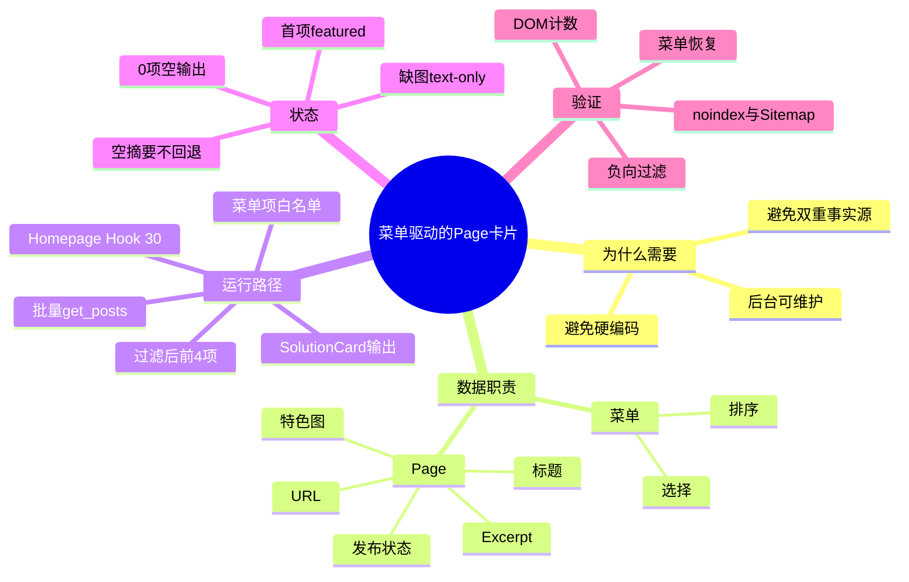
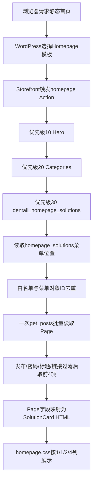

# Day40 WordPress实战：菜单驱动的Page映射与原生摘要

## 相关笔记

- 学习索引：[[WordPress实战笔记索引]]
- 对应项目笔记：[[../Day40-首页方案Page映射与四端区域|Day40-首页方案Page映射与四端区域]]
- 前置学习笔记：[[Day39-菜单驱动的分类查询与Flex换行]]
- 卡片合同学习笔记：[[Day29-原生循环与卡片展示契约]]
- 后续学习笔记：[[Day41-累计销量查询与首页展示边界]]
- 同主题项目笔记：[[../Day29-三类卡片组件契约|Day29-三类卡片组件契约]]

> [!check] 双向链接已完成
> 本笔记已链接Day40项目笔记；Day40项目笔记已反向链接本笔记；[[WordPress实战笔记索引]]也登记本笔记。

## 今日学习成果

- [x] 我能解释为什么“菜单选择与排序”不能替代Page标题、URL、摘要、图片和发布状态这些内容事实。
- [x] 我能从Storefront `homepage` Hook追踪到菜单位置、Page批量查询、过滤和SolutionCard HTML输出。
- [x] 我能在Local用0/1/4/4+、草稿、密码、重复、空摘要和缺图状态验证，并说清菜单解绑与TEST数据清理的回滚边界。

## 真实项目场景

### 今天解决了什么问题

DentAll首页设计需要4张“Shop by Solution”卡片，但正式Solution内容尚未冻结。如果把标题、链接、图片和文案写死在模板里，运营改名或换图就必须改代码；如果让菜单自定义标题与URL成为事实，又会形成第二套内容数据。D40采用“菜单只引用Page ID并排序，Page本身保存事实”的模型，并用明确noindex的Local TEST Page验证骨架。

### 学习范围

- 本篇要掌握：菜单位置与菜单项对象、Page原生Excerpt支持、批量读取与有效项过滤、Storefront Homepage Action、特色图API、输出转义、noindex TEST边界。
- 本篇明确不展开：正式Solution业务内容、`/solutions/`总览页、ACF/CPT、页面模板覆盖、D41商品查询、多语言和多币种。
- 项目中的真实入口：`app/public/wp-content/themes/dentall/inc/setup.php`、`app/public/wp-content/themes/dentall/inc/homepage.php`、Storefront `homepage` Action、后台`外观 → 菜单`与Page编辑页。
- 验证版本与环境：WordPress 7.0.4、WooCommerce 11.0.0、Yoast SEO Free 28.2、Storefront 4.6.2、PHP 8.2.29、DentAll 0.18.0，仅Local。

## 先建立整体模型

### 一句话模型

菜单保存“选谁和顺序”，Page保存“它是谁和展示什么”；前台先把菜单引用过滤成有效Page，再从Page API统一输出卡片。

### 记忆宫殿或实体比喻

把首页想成商场橱窗。橱窗经理手里有一张陈列清单，只写商品档案编号和排列顺序；档案室才保存正式名称、介绍、图片、营业状态和入口地址。经理不能在清单上随手写一个别名和假地址来覆盖档案。保安先剔除未营业、上锁、重复或档案损坏的对象，剩下的前4个才进入橱窗。

### 比喻对应回真实机制

| 记忆对象 | 真实技术对象 | 不能混淆的边界 |
|---|---|---|
| 橱窗陈列清单 | 绑定到`homepage_solutions`的原生导航菜单 | 菜单只保存Page引用和顺序，不是第二份Page内容 |
| 档案编号 | 菜单项的`object_id` | 只有`post_type/page`才被接受 |
| 档案室 | WordPress `wp_posts`中的Page及核心API | 代码不直接写表，也不依赖菜单自定义标题/URL |
| 保安检查 | `post_status`、密码、去重、标题和固定链接过滤 | 先过滤有效项，再应用4项上限 |
| 橱窗卡片 | D29 SolutionCard语义DOM | 只负责展示，不反向成为内容真相源 |

> [!warning] 准确性检查
> WordPress菜单并不会自动执行上述业务过滤；过滤规则来自DentAll子主题。Page Excerpt也不会自动生成或保存，D40只是为Page启用核心支持并读取人工填写的`post_excerpt`。

## 思维导图



最重要的主干是：菜单ID只决定候选集合，Page API决定最终事实，过滤后的有效结果才进入展示上限。

## 请求与生命周期调用链



- 触发条件：当前请求使用Storefront Homepage模板，并执行`homepage` Action。
- 加载入口：子主题`functions.php`加载`inc/homepage.php`，其设置回调注册菜单位置、移除未验收父主题区块并添加D40回调。
- 执行顺序：Hero 10 → Categories 20 → Solutions 30。
- 输入数据：菜单位置绑定、菜单项对象ID、Page发布状态、标题、固定链接、原始Excerpt与特色图ID。
- 输出或副作用：前台输出最多4张卡；前台请求不写数据库。D40配置阶段只在Local创建4个TEST Page和1个菜单。
- 可观察证据：返回Page ID顺序、渲染DOM计数、CSS资源版本、Yoast robots与Page Sitemap。

## 核心概念卡

| 概念 | 准确定义 | DentAll真实例子 | 常见误区 | 如何验证 |
|---|---|---|---|---|
| Menu Location | 主题注册的逻辑菜单槽位，后台把某个菜单绑定到该槽位 | `homepage_solutions`绑定menu ID 28 | 把位置ID、菜单term ID和菜单项ID混为一谈 | `get_nav_menu_locations()`与后台显示位置对照 |
| 菜单对象引用 | `post_type`菜单项通过`object/object_id`指向真实内容对象 | 只接受`post_type/page` | 使用菜单的自定义标题和URL作为Page事实 | 临时修改菜单对象标签/URL，输出仍取Page值 |
| Post Type Support | 为内容类型启用核心编辑能力 | `add_post_type_support( 'page', 'excerpt' )` | 以为启用后会自动生成摘要 | 检查`post_type_supports()`及空`post_excerpt` |
| 原生Excerpt | `WP_Post::post_excerpt`中的人工摘要 | Page 110为空且前台不输出摘要 | 用正文自动截断冒充已审核简介 | 检查原始字段与最终DOM |
| `post__in`排序 | 查询指定ID集合，并可按输入顺序返回 | 菜单顺序106→108→110→112 | 只设`post__in`却忘记`orderby=post__in` | 比较查询结果ID顺序 |
| 有效项上限 | 在所有过滤完成后截取最大输出量 | 混合候选最终取前4个有效Page | 查询前切前4个，让坏项占名额 | 用草稿、重复、非Page穿插复演 |
| Featured Image API | 核心根据附件和尺寸生成响应式`img` | `wp_get_attachment_image( ..., 'medium_large' )` | 手写uploads路径或漏宽高/srcset | 审计`img`的尺寸、`srcset`和`sizes` |

## 项目实战代码

> [!important] 代码真实性
> 下列片段来自D40当前仓库，只保留理解所需上下文。

### 涉及文件

- `app/public/wp-content/themes/dentall/inc/setup.php`：为Page启用核心Excerpt支持。
- `app/public/wp-content/themes/dentall/inc/homepage.php`：注册菜单位置、查询有效Page并输出Homepage Solutions。
- `app/public/wp-content/themes/dentall/assets/css/homepage.css`：仅Homepage加载的1/1/2/4列与区域规则。
- `app/public/wp-content/themes/dentall/style.css`：D29 SolutionCard内部合同与0.18.0缓存版本。
- `project-docs/tests/fixtures/day40-home-solutions/index.html`：非运行时、noindex的四卡复演夹具。

### 从入口开始追踪

1. 入口在哪里：`dentall_register_homepage_menu_locations()`注册位置，`dentall_configure_homepage_sections()`把回调挂到Storefront `homepage`。
2. 为什么此时加载：主题设置完成后菜单位置才稳定；Homepage Action只在父主题首页模板的对应生命周期执行。
3. 调用了哪个API或Hook：`register_nav_menu()`、`get_nav_menu_locations()`、`wp_get_nav_menu_items()`、`get_posts()`、`get_permalink()`与`wp_get_attachment_image()`。
4. 最终影响哪个页面：仅使用Homepage模板的首页；`homepage.css`也只在该模板条件下入队。
5. 如果移除位置绑定：`dentall_get_homepage_solutions()`返回空数组，整个区域0输出，不会回退为所有Page。

### 关键代码片段

`inc/setup.php`启用核心Page摘要：

```php
add_post_type_support( 'page', 'excerpt' );
```

`inc/homepage.php`的查询约束节选：

```php
$pages = get_posts(
	array(
		'post_type'        => 'page',
		'post_status'      => 'publish',
		'post__in'         => $page_ids,
		'orderby'          => 'post__in',
		'posts_per_page'   => count( $page_ids ),
		'has_password'     => false,
		'suppress_filters' => false,
	)
);
```

过滤后才应用4项上限：

```php
$solutions[] = $page;

if ( 4 === count( $solutions ) ) {
	break;
}
```

读取人工摘要而不回退正文：

```php
$summary = trim(
	wp_strip_all_tags(
		strip_shortcodes( (string) get_post_field( 'post_excerpt', $solution_id, 'raw' ) ),
		true
	)
);
```

| 代码 | 表面动作 | WordPress中的真实作用 | 为什么这样写 |
|---|---|---|---|
| `register_nav_menu()` | 增加后台显示位置 | 建立主题与菜单配置的稳定契约 | 不硬编码某个menu term ID |
| `post_type/page`白名单 | 过滤菜单项 | 阻止自定义链接或其他对象进入数据链 | 菜单编辑器允许混合类型 |
| `orderby => post__in` | 维持ID顺序 | 让结果遵循后台菜单顺序 | 数据库默认顺序不等于菜单顺序 |
| `suppress_filters => false` | 允许标准查询过滤器生效 | 保留当前站点语言/可见性扩展边界 | 第一版未安装多语言，但不主动绕开过滤器 |
| `esc_html()`/`esc_url()` | 输出转义 | 按文本和URL上下文安全输出 | 清洗不能替代最终上下文转义 |

### 运行证据

- 使用的命令、页面或后台路径：Local WordPress启动脚本、PHP DOM审计、`外观 → 菜单`、Page编辑与Yoast robots呈现、`/page-sitemap.xml`。
- 正常结果：menu ID 28返回106、108、110、112；DOM含4卡、4单链接、3摘要、3图片、1 featured、1 text-only和4个装饰箭头。
- 失败或边界结果：未绑定位置0字节；1项自动featured；草稿、密码、重复和非Page被跳过；4+只取过滤后的前4项；菜单别名和自定义URL不覆盖Page事实。
- 证据能证明：当前Local数据链、过滤顺序、转义后DOM、noindex/Sitemap边界和静态响应式合同按预期工作。
- 证据不能证明：正式Solution内容与素材已批准、Production性能、真实登录态首页四宽视觉/Focus已经重新截图通过。Chrome控制链路超时形成的P3转D42。

## 职责边界

| 层级 | 本主题中负责什么 | 不应该负责什么 |
|---|---|---|
| WordPress Core | Page、菜单、Excerpt支持、固定链接和特色图API | 不修改核心文件；不替DentAll决定业务过滤 |
| WooCommerce | 提供商城环境与Homepage上下文 | D40不把Solution重复建成Product或直接写Woo表 |
| Storefront父主题 | 提供Homepage模板和`homepage` Action | 不直接修改父主题文件 |
| DentAll子主题 | 注册展示入口、过滤Page、输出/转义卡片和响应式CSS | 不承载支付、订单或跨主题核心业务规则 |
| `dentall-core` | 本轮无职责 | 不为纯首页展示逻辑增加插件模块 |
| 数据库与媒体 | 保存Page、菜单关系、Excerpt、特色图和Yoast元数据 | 不把TEST标题、Slug或图片当正式内容 |
| 浏览器 | 呈现真实DOM、CSS、Focus和图片候选 | 不用视觉结果替代服务端发布/noindex事实 |

## Hook、API或模板机制详解

| 项目 | 说明 |
|---|---|
| 机制类型 | Action＋WordPress Menu/Post/Image API＋条件Enqueue |
| 名称或入口 | Storefront `homepage`；DentAll回调`dentall_homepage_solutions` |
| 注册位置 | `app/public/wp-content/themes/dentall/inc/homepage.php` |
| 默认优先级或查找顺序 | DentAll明确使用30；Hero为10，Categories为20 |
| 回调输入 | Action不传业务对象；回调自行读取当前菜单位置与Page数据 |
| 必须返回内容 | Action回调不通过返回值修改页面；有有效项时直接输出已转义HTML，0项直接返回 |
| 副作用 | 前台请求只读取并输出；不持久化数据 |
| 影响范围 | 仅前台Homepage模板；后台增加菜单位置和Page Excerpt编辑能力 |
| 移除或覆盖方式 | 取消位置绑定可令区域空输出；源码可用`remove_action( 'homepage', ..., 30 )`，必须匹配回调和优先级 |

## 安全、数据与站点影响

| 检查面 | 本次结论 | 证据或待验证项 |
|---|---|---|
| 输入清洗与验证 | 菜单对象类型白名单、`absint()` ID、查询发布/密码约束、标题/URL有效性检查 | 0/1/混合候选测试 |
| Capability | 前台只读无需用户Capability；Page内容权限沿用核心；菜单由具备`edit_theme_options`的Administrator维护 | Website Manager有Page能力但无菜单配置能力 |
| Nonce | 前台只读回调不适用；后台保存由WordPress/Yoast原生界面负责 | 没有自定义后台动作 |
| 输出转义 | 文本`esc_html()`、类名`esc_attr()`、URL`esc_url()`；图片标记来自核心API | 运行时DOM及Code Review |
| 数据库写入 | 实施阶段Local用WordPress/Yoast核心API创建4个TEST Page、1个菜单并设置noindex；前台渲染无写入 | ID和菜单记录见项目笔记 |
| URL与SEO | 4个Local TEST URL noindex且不进Page Sitemap；没有`/solutions/`或`View all` | robots presentation与HTTP Sitemap |
| 缓存 | 子主题0.18.0刷新既有CSS查询版本；未改页面/对象缓存策略 | HTTP资源版本 |
| 支付、物流与订单 | 不适用，无影响 | 未接触Woo交易API或数据 |
| 部署与回滚 | 仅Local；解绑菜单立即空输出，TEST数据按ID清理，源码按最小差异回滚 | Staging/Production未改 |

## 动手练习

### 练习一：只读观察

- 目标：证明菜单顺序和Page事实是两层数据。
- 操作：读取`get_nav_menu_locations()`、`wp_get_nav_menu_items()`和`dentall_get_homepage_solutions()`结果，比较菜单项标题/URL与Page标题/固定链接。
- 预期：最终卡片使用Page事实，顺序与菜单对象ID一致。
- 实际证据：临时把首个菜单项对象改为`MENU OVERRIDE`和无效域名，最终HTML两者均未出现。

### 练习二：Local最小改动

- 改动：把一个明确TEST Page的手工Excerpt暂时清空，再刷新首页输出。
- 风险边界：仅Local；不修改正式Page、核心、支付或Production数据。
- 验证：该卡摘要节点消失，但标题、链接和其他卡不变，正文内容不得进入摘要。
- 回滚：恢复原Excerpt；若用于自动测试，应记录旧值并在`finally`或测试结束后精确恢复。

### 练习三：故障推演

- 假设症状：首页Solutions整区突然消失。
- 可能原因：菜单位置未绑定、菜单只有无效类型、Page变为草稿/密码保护、主题回调未加载或Homepage模板条件不成立。
- 第一项检查：读取`get_nav_menu_locations()['homepage_solutions']`及有效Page数量。
- 为什么先查它：0项设计上就是0输出；先区分“数据为空”与“HTML/CSS隐藏”，避免盲目改样式。

## 常见误区与排错顺序

| 现象或误区 | 可能原因 | 推荐检查顺序 | 最小验证方法 |
|---|---|---|---|
| 菜单有4项但前台少于4张卡 | 存在草稿、密码、重复、非Page、空标题或失效链接 | 1. 菜单对象类型/ID；2. Page状态/密码；3. 标题与固定链接 | 输出候选ID与有效结果ID，不先改CSS |
| 修改菜单标签却没改变卡片标题 | D40故意以Page为事实源 | 1. 查Page标题；2. 查菜单对象ID；3. 对照合同 | 直接读取`get_the_title( object_id )` |
| 空Excerpt出现正文片段 | 错误使用`get_the_excerpt()`或正文回退 | 1. 查`post_excerpt`；2. 查渲染函数；3. 查插件过滤器 | Page 110正文非空、Excerpt为空的负向测试 |
| 图片没有`srcset`或宽高 | 手写`img`或附件元数据缺失 | 1. 查是否调用核心图片API；2. 查附件元数据；3. 查最终DOM | 审计`width/height/srcset/sizes` |
| 区块看似没显示 | 0项正确空输出，或当前页不是Homepage模板 | 1. 查有效结果；2. 查Hook；3. 查模板条件；4. 最后查CSS | 捕获回调输出字节数 |
| TEST Page出现在Sitemap | noindex保存/Indexable未刷新或缓存 | 1. 查Yoast meta；2. 查presentation；3. 请求Sitemap；4. 查缓存 | 搜索具体Slug而非目测整页 |

## 掌握标准

- [ ] 不看笔记，能在2分钟内讲清整体因果链。
- [x] 能指出项目中的真实入口文件、Hook或模板。
- [x] 能区分WordPress核心、父主题、子主题、插件和WooCommerce的职责。
- [x] 能说明正常路径、至少一个失败路径及检查顺序。
- [x] 能在Local完成最小验证，并说清回滚方法。
- [x] 能判断该知识影响数据、URL、SEO、缓存、支付、物流或部署的哪些部分。

当前掌握度：初识；待完成闭卷费曼自测后再升级。

## 费曼测试题（7道）

1. 不使用专业术语，怎样解释“菜单只选择排序、Page保存事实”，它解决了什么维护问题？
2. 橱窗清单、档案编号、档案室、保安和卡片分别对应哪些WordPress对象？比喻在哪些边界会失效？
3. 从浏览器请求首页开始，按顺序讲出Storefront Action、菜单读取、`get_posts()`、有效项过滤和HTML输出。
4. 为什么必须使用`orderby => post__in`，并且在过滤标题/链接后才判断4项上限？删除其中一项会出现什么现象？
5. `add_post_type_support( 'page', 'excerpt' )`与`get_the_excerpt()`有什么不同？D40为什么读取原始`post_excerpt`？
6. 首页整区不见时，先收集哪三项证据？为什么不先加`display:block !important`？
7. 把目标迁移到另一个经典主题、区块主题或Shopify时，哪些原则不变，哪些平台实现必须重新验证？

### 我的费曼答案与纠正

待自测。每题标记`通过`、`含糊`或`答错`，暴露的问题回链到“整体模型”“调用链”“核心概念卡”或“安全、数据与站点影响”，不只记录“已复习”。

### 自测评分

| 分数 | 标准 |
|---:|---|
| 0 | 无法解释，或只能猜术语 |
| 1 | 能说定义，但说不清因果、边界和证据 |
| 2 | 能用通俗语言解释，并准确对应技术机制与项目证据 |

总分：尚未自测 / 14；存在0分题时不提升掌握度。

## 间隔复习记录

| 复习节点 | 计划日期 | 完成 | 暴露的问题 | 修正位置 |
|---|---|---|---|---|
| D+1 | 2026-09-01 | [ ] | 复习后记录 | 复习后记录 |
| D+3 | 2026-09-03 | [ ] | 复习后记录 | 复习后记录 |
| D+7 | 2026-09-07 | [ ] | 复习后记录 | 复习后记录 |
| D+14 | 2026-09-14 | [ ] | 复习后记录 | 复习后记录 |

## 收尾总结

- 我今天真正理解了：原生菜单适合作为运营选择器，但内容事实必须回到被引用对象；过滤顺序和空状态同样属于数据合同。
- 我仍然容易混淆：`post__in`指定集合与`orderby=post__in`保持顺序是两个独立参数；noindex元数据与Sitemap实际输出也必须分别验证。
- 下次遇到类似问题，我会先检查：入口是否触发、选择器是否绑定、候选是否被过滤，再检查DOM和CSS。
- 下一篇直接相关学习笔记：[[Day41-累计销量查询与首页展示边界]]。

## 后续如何向AI高效提问

### 提问公式

`真实环境 + 菜单位置与对象类型 + Page字段合同 + 已观察ID/DOM + 已做负向测试 + URL/SEO边界 + 希望的最小方案`

### 提问前准备

- WordPress、WooCommerce、父/子主题、PHP和SEO插件版本。
- 当前是Local、Staging还是Production，页面是否使用Homepage模板。
- 菜单位置、菜单term ID、菜单项类型/object ID和有效Page状态。
- 最小真实代码、实际返回ID、最终DOM与错误日志。
- 是否允许数据写入、是否涉及正式URL、索引、缓存或部署。
- 删除Cookie、密码、私钥、支付密钥与真实客户资料。

### 可复制的代码理解提示词

```text
你是我的WordPress实战教练。请基于下面的真实环境解释“菜单选择Page并输出首页卡片”的数据链，不要假设不存在的插件、字段或URL。

环境：[WordPress/WooCommerce/PHP/父主题/子主题版本，Local或Staging]
目标：[菜单只选择排序，Page保存标题、URL、Excerpt、特色图和发布状态]
真实入口：[菜单位置、Homepage Hook、函数和文件路径]
最小代码：[注册位置、查询参数、过滤与输出片段]
已观察证据：[候选ID、有效ID、DOM、robots/Sitemap]
我的当前理解：[先写自己的解释]

请按顺序回答：
1. 用实体比喻建立模型并逐项对应真实对象；
2. 画出请求、菜单、查询、过滤和输出顺序；
3. 解释为何要类型白名单、去重、post__in排序和过滤后限量；
4. 区分已确认事实、推断和待验证项；
5. 给出Local最小正向/负向验证与精确回滚；
6. 出5道费曼题，先不给答案。

边界：[不改核心、不建新CPT/ACF、不碰Production、不推断正式URL]
```

### 可复制的排错提示词

```text
这是一个WordPress首页菜单映射Page的排错问题。请先缩小原因，不直接建议重构。

预期：[输出几张卡、顺序和字段来源]
实际：[整区消失/顺序错误/字段错误/缺图破版/SEO异常]
复现步骤：[最短步骤]
环境与版本：[填写真实值]
菜单位置与候选ID：[填写真实值]
相关Hook和函数：[填写真实值]
Page状态、Excerpt、特色图与robots证据：[填写真实值]
已排除或已尝试：[填写真实值]
风险边界：[不改正式URL、索引、Production或交易数据]

请输出：按概率和风险排序的原因、每项最小只读检查、确认后的最小修复、验证与回滚。把服务端数据、HTML和CSS证据分开。
```

> [!warning] AI验证边界
> AI生成的Hook、查询参数、SEO或平台映射不是项目证据。必须回到当前版本源码、真实Page/菜单和可复演测试；浏览器控制失败时应记录证据缺口，不能用静态推断冒充真实页验收。

## 变种应用到其他项目

| 新场景 | 保持不变的原则 | 可能变化的实现 | 必须重新确认 | 最小验证 |
|---|---|---|---|---|
| 另一个Storefront子主题 | 选择/事实分离、过滤后限量、诚实缺省 | 菜单位置、Hook优先级、卡片Token | Storefront/WP版本和已有回调 | 0/1/4/混合候选＋真实DOM |
| 使用其他经典主题的WordPress商城 | Page仍是事实源 | Homepage Hook或模板入口不同 | 主题扩展点、资源加载与兼容性 | 不改父主题的最小Action/Filter验证 |
| WordPress区块主题 | 内容事实与选择合同不变 | Navigation/Query区块、Block Template、`theme.json` | 当前核心版本、可过滤能力与编辑权限 | Site Editor预览＋前台HTML/SEO |
| 独立插件中的相似功能 | 输入白名单、输出转义、有效项限量 | 插件加载、Shortcode/Block/REST入口 | 是否应跨主题存在及停用行为 | 插件停用后无残留输出/错误 |
| Shopify或其他平台 | 运营集合引用真实内容对象，不复制事实 | Navigation、Metaobject、Collection或Theme Section，均待验证 | 官方权限、发布、URL、SEO和缓存模型 | 官方资料＋开发店代表对象，待验证 |

### 变种练习

选择“WordPress区块主题”，先不写代码：

1. 原业务问题仍存在：编辑需要选择、排序真实内容对象，同时避免双重事实源。
2. 可直接迁移：类型白名单、过滤后限量、缺字段诚实降级。
3. 必须替换：Storefront `homepage` Action、当前子主题DOM入口和经典主题CSS加载条件。
4. 最小查证：目标WordPress版本的Navigation/Query Block扩展点、模板锁定、角色权限和前台序列化结果。
5. 防止伪对应：先画对象、权限、发布和输出合同，再决定区块、模式或自定义Block；不能只因后台外观相似就认为机制相同。

## 可复用核心思想

### 跨平台不变量

选择器只应保存稳定引用和顺序，内容对象才保存标题、链接、状态、图片与文案。所有上限必须施加在有效结果上；缺省状态要暴露真实缺失，不能用自动猜测制造看似完整但不可治理的内容。

### WordPress/WooCommerce当前实现

DentAll在Local以主题菜单位置保存Page引用，通过WordPress Post API批量读取并过滤，再在Storefront `homepage`优先级30输出D29 SolutionCard。Page核心Excerpt承载人工摘要，特色图使用核心响应式图片API，CSS保持Homepage条件加载与单一DOM；版本和证据仅适用于上述Local矩阵。

### Shopify或其他平台的对应机制

可能的对应对象包括Shopify Navigation、Metaobject、Collection和Theme Section，但哪一种能同时满足引用、排序、权限、发布、SEO与主题编辑体验尚未验证。必须查官方资料并在开发店实验；本对照只用于知识迁移，不授权DentAll接入Shopify或改变第一版范围。
