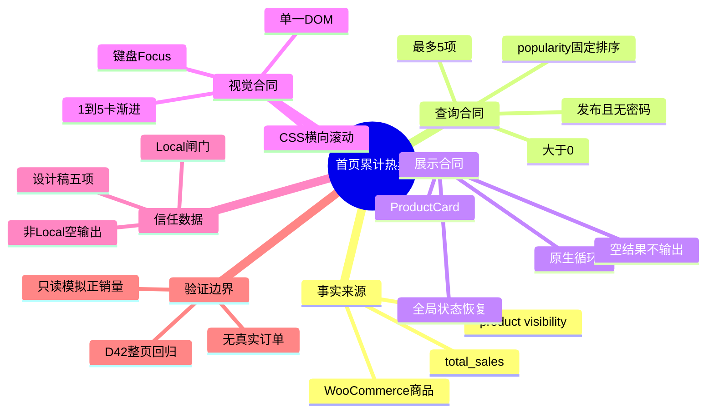
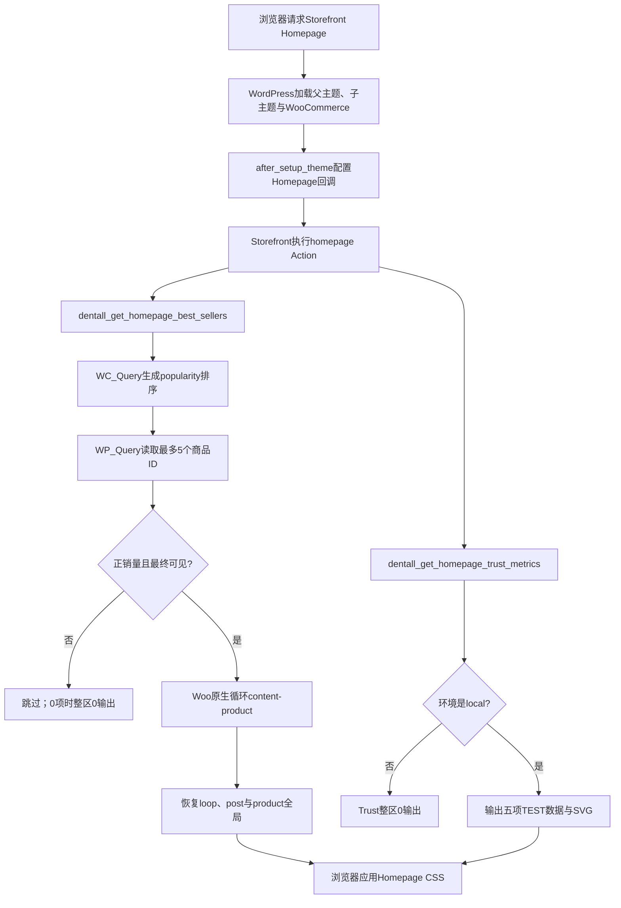

# Day41 WordPress实战：累计销量查询与首页展示边界

## 相关笔记

- 学习索引：[[WordPress实战笔记索引]]
- 对应项目笔记：[[../Day41-首页累计热卖与信任指标条|Day41-首页累计热卖与信任指标条]]
- 前置学习笔记：[[Day40-菜单驱动的Page映射与原生摘要]]
- 商品循环学习笔记：[[Day29-原生循环与卡片展示契约]]
- 后续学习笔记：[[Day42-首页整链路验收与证据分层]]

> [!check] 双向链接已完成
> 本学习笔记链接Day41项目笔记；Day41项目笔记反向链接本笔记；[[WordPress实战笔记索引]]也登记本笔记。Day40项目与学习笔记均会回填D41链接。

## 今日学习成果

- [ ] 我能用自己的话解释：为什么“按累计销量取前5”不仅是一个排序参数，还包含可见性、0数据、缓存和事实边界。
- [ ] 我能沿真实代码追踪：Storefront Homepage Hook如何进入WooCommerce popularity排序，再进入原生ProductCard并恢复全局循环。
- [ ] 我能在Local安全修改、验证并回滚：不写订单或销量，用只读审计验证URL隔离、Filter恢复、空输出与四端横向浏览。

## 真实项目场景

### 今天解决了什么问题

DentAll首页设计稿在Solutions后展示5张Best Sellers卡片和一条五项Trust信息带。商品卡不能复制设计稿中的价格、库存或购买按钮，因为这些事实已经由WooCommerce商品维护；排行榜也不能在无销量时随便用“精选”商品填满。与此同时，设计稿中的`10,000+`、`99.5%`和“Secure Payments”等营销陈述尚无业务证明，却需要先还原视觉。因此D41必须同时建立两个不同合同：真实累计销量驱动的商品区，以及严格限制在Local的信任数据预览。

### 学习范围

- 本篇要掌握：WooCommerce popularity排序、商品可见性、空数据降级、原生循环全局恢复、Filter生命周期、Local事实闸门和CSS横向浏览。
- 本篇明确不展开：真实订单创建、销量回填状态机、正式Trust事实审批、支付启用、Newsletter提交、整页缓存配置与非Local部署。
- 项目中的真实入口：`app/public/wp-content/themes/dentall/inc/homepage.php`、`assets/css/homepage.css`、`assets/images/trust-icons.svg`、Storefront `homepage` Action。
- 验证版本与环境：WordPress 7.0.4、WooCommerce 11.0.0、Storefront 4.6.2、DentAll 0.19.0，仅Local；项目站点PHP基线为8.2.29，本轮WP-CLI审计进程使用PHP 8.2.9nts。

## 先建立整体模型

### 一句话模型

WooCommerce保存商品与累计销量事实，首页只在请求时筛选“能展示且确有销量”的前5项并交给原生卡片渲染；未经证明的营销数字则必须被环境闸门挡在正式站之外。

### 记忆宫殿：仓库排行榜与样板间

把首页想成一个牙科用品仓库的展示厅：

- 仓库后台的电子计分板记录每件商品的累计出库分数，对应WooCommerce维护的`total_sales`与lookup table。
- 门口保安检查商品是否营业、是否上锁、是否被藏出目录、以及全局规则是否隐藏缺货，对应发布状态、密码和product visibility。
- 陈列员只把通过检查且分数大于0的前5件商品搬上架，对应Best Sellers查询与5项上限。
- 每个商品仍使用原来的商品档案卡，对应WooCommerce原生ProductCard，而不是首页复制标题、价格或购买规则。
- 旁边的“企业实力”样板牌还没有证明材料，所以只能放在Local样板间，不能搬到正式营业厅，对应`wp_get_environment_type()`闸门。

### 比喻对应回真实机制

| 记忆对象 | 真实技术对象 | 不能混淆的边界 |
|---|---|---|
| 电子计分板 | `wc_product_meta_lookup.total_sales`及`WC_Product::get_total_sales()` | D41只读，不直接改表或商品meta |
| 门口保安 | `publish`、`has_password`、`product_visibility`与`is_visible()` | 可见不等于有销量；销量高也不能绕过目录隐藏 |
| 前5个货架位 | `posts_per_page => 5`及正销量过滤 | 上限是最多5，不承诺任何时候都有5项 |
| 原商品档案卡 | `content-product.php`和WooCommerce循环API | 首页不复制价格、库存、图片或购买动作事实 |
| Local样板间 | `wp_get_environment_type() === 'local'` | 视觉还原不等于业务陈述获准发布 |
| 临时布展钩子 | `posts_clauses` popularity Filter | 使用结束后只移除自己新增的回调，不能清掉他人状态 |

> [!warning] 准确性检查
> “累计出库”只是记忆比喻。真实`total_sales`由WooCommerce订单与商品数据机制维护；哪些订单状态、退款和扩展会怎样影响数值，本轮没有制造真实订单验证，不能从比喻直接推断。

## 思维导图



最重要的主干是：先确认事实和筛选合同，再复用平台展示；Local视觉预览不能反向变成正式业务事实。

## 请求与生命周期调用链



- 触发条件：页面使用Storefront `template-homepage.php`并执行`homepage` Action。
- 加载入口：子主题`functions.php`加载`inc/homepage.php`，`after_setup_theme`优先级100重排父主题回调。
- 执行顺序：Hero 10、Categories 20、Solutions 30、Best Sellers 40、Trust 50。
- 输入数据：WooCommerce商品、可见性设置、累计销量、Shop Page状态；Trust为代码中的Local TEST数组。
- 输出或副作用：输出HTML和一个SVG资源引用；无订单、商品、Option或URL写入。
- 可观察证据：WP-CLI审计、SQL片段、DOM计数、全局对象比较、四端几何和键盘滚动。

## 核心概念卡

| 概念 | 准确定义 | DentAll真实例子 | 常见误区 | 如何验证 |
|---|---|---|---|---|
| popularity排序 | WooCommerce目录排序合同之一，本版本用lookup table的累计销量降序并以product ID降序稳定并列 | `get_catalog_ordering_args( 'popularity', 'DESC' )` | 把URL中的`orderby`直接传给首页查询 | 捕获SQL并确认`total_sales DESC` |
| 商品可见性 | 商品是否允许在当前前台上下文出现的规则集合 | 排除`exclude-from-catalog`，按全局设置排除缺货，再调用`is_visible()` | 只检查`publish`就认为可展示 | 隐藏目录商品/缺货设置负向测试 |
| 诚实空状态 | 没有满足数据合同的对象时，不伪造结果或显示空壳 | Local真实销量0时Best Sellers不输出section | 用最新商品、精选商品或假销量自动补位 | 对比返回数组数量和输出字节 |
| 查询Filter生命周期 | 临时加入的全局Filter只在目标查询期间存在，并精确恢复原状态 | popularity回调只在本函数新增时移除 | 调用Woo的“大扫除”函数，误删调用前回调 | 预先注册同一回调，调用后仍为priority 10 |
| Woo循环全局 | 原生模板通过`$post`、`$product`及`woocommerce_loop`读取当前卡片上下文 | 每项调用`setup_postdata()`和`content-product` | 循环结束后只`wp_reset_postdata()`，遗漏`$product`或loop属性 | 调用前后逐项比较是否存在和值相同 |
| 环境闸门 | 未经批准的数据或功能只在明确环境类型运行 | Trust函数非Local返回空数组 | 用CSS隐藏正式站中的不实数据 | 模拟非Local并比较数组/输出均为0 |
| 组件内横滑 | 溢出只发生在商品或信息列表内部，页面本身不横向滚动 | 390商品轨道、768 Trust轨道 | 为每个断点复制DOM或引入无必要轮播库 | 比较组件`scrollWidth`与文档宽度 |

## 项目实战代码

> [!important] 代码真实性
> 下列片段均节选自DentAll当前仓库，只省略与主题无关的上下文；完整事实以源文件为准。

### 涉及文件

- `app/public/wp-content/themes/dentall/inc/homepage.php`：Homepage Hook、真实商品查询、原生循环、Trust Local数据与语义HTML。
- `app/public/wp-content/themes/dentall/assets/css/homepage.css`：Best Sellers轨道、Trust信息带及四端渐进规则，仅Homepage模板加载。
- `app/public/wp-content/themes/dentall/assets/images/trust-icons.svg`：五个装饰性线性图标符号。
- `app/public/wp-content/themes/dentall/style.css`：公共Token、ProductCard与Focus合同；D41只升级版本到0.19.0。
- `project-docs/tests/day41-home-products-trust-audit.php`：Local-only、无写入的查询与状态恢复审计。
- `project-docs/tests/fixtures/day41-home-products-trust/index.html`：非持久化四端视觉夹具。

### 从入口开始追踪

1. 入口在`dentall_configure_homepage()`，它先移除Storefront尚未验收的示例商品区块，再注册D41优先级40/50回调。
2. `after_setup_theme`优先级100确保父主题已注册回调，子主题再按明确顺序调整。
3. Best Sellers调用WooCommerce排序API和WordPress查询API；Trust只读取环境类型与Local数组。
4. 结果只影响Storefront Homepage模板；Shop、分类、搜索和其他页面不加载`homepage.css`。
5. 移除D41两条`add_action()`后，两个区域立即停止输出，Hero、Categories、Solutions、Newsletter与Footer保持原职责。

### 关键代码片段一：固定入口和顺序

源文件：`inc/homepage.php`。

```php
add_action( 'homepage', 'dentall_homepage_hero', 10 );
add_action( 'homepage', 'dentall_homepage_categories', 20 );
add_action( 'homepage', 'dentall_homepage_solutions', 30 );
add_action( 'homepage', 'dentall_homepage_best_sellers', 40 );
add_action( 'homepage', 'dentall_homepage_trust_metrics', 50 );
```

顺序是页面信息架构合同，不是“函数碰巧写在文件中的先后”。Storefront调用Action时按priority执行。

### 关键代码片段二：复用Woo排序并精确恢复Filter

源文件：`inc/homepage.php`。

```php
$catalog_query         = WC()->query;
$popularity_callback   = array( $catalog_query, 'order_by_popularity_post_clauses' );
$had_popularity_filter = 10 === has_filter( 'posts_clauses', $popularity_callback );
$ordering_args         = $catalog_query->get_catalog_ordering_args( 'popularity', 'DESC' );

try {
	$product_query = new WP_Query( $query_args );
	$product_ids   = $product_query->posts;
} finally {
	if ( ! $had_popularity_filter ) {
		remove_filter( 'posts_clauses', $popularity_callback, 10 );
	}
}
```

| 代码 | 表面动作 | WordPress/WooCommerce中的真实作用 | 为什么这样写 |
|---|---|---|---|
| 显式传`popularity` | 选择一种排序 | 避免读取当前URL的目录排序参数 | 首页排行榜合同固定，不受访客查询串控制 |
| `has_filter()` | 看回调是否存在 | 区分“调用前已有”和“本函数新增” | 防止清理时破坏别的查询上下文 |
| `finally` | 无论成功失败都执行 | 查询抛错时仍恢复全局Filter | 恢复不是仅成功路径的附加动作 |
| `remove_filter(..., 10)` | 删除具体回调 | 只移除本次默认priority 10注册 | 不调用会同时删price/rating的广泛清理 |

### 关键代码片段三：Trust事实闸门

源文件：`inc/homepage.php`。

```php
function dentall_get_homepage_trust_metrics() {
	if ( 'local' !== wp_get_environment_type() ) {
		return array();
	}

	return array(
		// 五项设计稿TEST数据。
	);
}
```

这里的安全点不是“正式站再用CSS隐藏”，而是非Local根本不返回数据、也不输出DOM。CSS只能控制视觉，不能成为业务真实性或保密边界。

### 关键代码片段四：一套DOM的四端横滑

源文件：`assets/css/homepage.css`。

```css
.page-template-template-homepage .dentall-home-best-sellers ul.products {
	display: grid;
	grid-auto-columns: 86%;
	grid-auto-flow: column;
	overflow-x: auto;
	scroll-snap-type: inline mandatory;
}

@media (min-width: 48rem) {
	.page-template-template-homepage .dentall-home-best-sellers ul.products {
		grid-auto-columns: calc((100% - (2 * var(--dentall-space-16))) / 3);
	}
}
```

1024与1200以上继续把容量增强到4和5。改变的是同一列表的轨道宽度，不是复制四套商品HTML，也没有用JS假轮播接管原生链接和按钮。

### 运行证据

- 使用命令：PHP lint；Local WP-CLI执行`project-docs/tests/day41-home-products-trust-audit.php`；Playwright真实Chrome加载代表夹具。
- 正常结果：只读模拟得到2个正销量商品、1个Best Sellers section、2张原生卡；Trust为5项/5个SVG引用。
- 真实空结果：Local现有两个TEST商品`total_sales=0`，真实首页Best Sellers整区缺席。
- 失败或边界结果：`?orderby=price`没有改变SQL；`rating_filter=5`没有进入tax query；预存popularity Filter调用后仍在priority 10。
- 四端结果：文档宽度等于390/768/1024/1440；商品卡宽301/224/228/238px，完整容量1/3/4/5。
- 键盘结果：768 Trust列表获得`solid 3px`Focus，连续方向键使`scrollLeft`到170px并露出第五项。
- 证据能证明：代码路径、查询边界、输出数量、全局恢复、代表DOM/CSS几何和键盘滚动。
- 证据不能证明：真实订单状态如何更新销量、退款口径、正式数据量性能、整页缓存失效、非Local部署或Trust陈述真实性。

## 职责边界

| 层级 | 本主题中负责什么 | 不应该负责什么 |
|---|---|---|
| WordPress Core | 生命周期、Action/Filter、`WP_Query`、转义、环境类型、模板全局 | 不修改核心文件，不把环境名当唯一部署安全措施 |
| WooCommerce | 商品对象、可见性、目录排序、lookup table、原生ProductCard与Shop链接 | D41不绕过API直接改销量、库存、订单或内部表 |
| Storefront父主题 | Homepage模板、`homepage` Action与Woo模板继承入口 | 不直接改父主题文件或重新复制整个模板 |
| DentAll子主题 | 首页选择、顺序、展示、局部CSS、Local Trust闸门与状态恢复 | 不承载正式支付承诺、订单规则或跨主题数据真相 |
| `dentall-core` | 本轮无职责 | 不因“逻辑看起来重要”就把纯Homepage展示塞进插件 |
| 数据库/订单系统 | 保存真实商品、可见性、销量与交易事实 | 测试夹具不写表，也不把模拟值当正式数据 |
| 业务方 | 审批Trust陈述、正式商品和发布边界 | 不应通过手改技术meta操控排行榜 |

## Hook、API或模板机制详解

| 项目 | 说明 |
|---|---|
| 机制类型 | Storefront Action＋WooCommerce目录排序Filter＋WordPress查询＋Woo原生模板部件 |
| 名称或入口 | `homepage`、`get_catalog_ordering_args()`、`posts_clauses`、`content-product` |
| 注册位置 | `app/public/wp-content/themes/dentall/inc/homepage.php` |
| 默认优先级或顺序 | Best Sellers 40、Trust 50；popularity `posts_clauses`默认priority 10 |
| 回调输入 | Homepage Action不传业务对象；函数读取Woo查询实例、设置和商品事实 |
| 返回/输出 | Getter返回`WC_Product[]`；render函数输出HTML或0字节 |
| 副作用 | 临时加入排序Filter并精确恢复；模板期间临时切换循环全局并恢复；无持久化写入 |
| 影响范围 | 仅Storefront Homepage模板；`homepage.css`按模板条件加载 |
| 移除方式 | 用相同callback与priority移除D41 Action；再删除无引用CSS/SVG，避免孤立资源 |

### 为什么不直接用Storefront原来的Best Selling区块

Storefront自带`storefront_best_selling_products`能够快速输出区块，但D41还需要明确的0销量边界、5项上限、D29 ProductCard布局、固定信息架构顺序、URL排序隔离、精确循环恢复和设计稿横滑合同。复用Woo排序与模板、保留最小自定义包装，比直接保留父主题默认标题/布局或复制SQL更符合当前职责。

### 为什么没有使用短代码Transient

WooCommerce某些短代码/区块路径可能带缓存策略，但D41不能只凭“有缓存”就认为正确。累计销量变化与商品文章缓存的失效时点不是同一事实；在没有真实订单和整页缓存验证前，先关闭该查询对象缓存，换取结果诚实。上线前必须用代表商品量和真实缓存栈测量，再决定是否增加可精确失效的缓存，而不是把“无缓存”写成永久方案。

## 安全、数据与站点影响

| 检查面 | 当前结论 | 验证边界 |
|---|---|---|
| 输入清洗与验证 | 不接受用户选择的orderby；商品ID来自受限查询并经`wc_get_product()`/类型检查 | URL负向审计通过 |
| Capability | 前台只读无需用户capability；没有自定义后台动作 | 未新增编辑入口 |
| Nonce | 无状态变更，不适用 | nonce不能替代未来后台动作的capability |
| 输出转义 | 文本`esc_html()`、URL`esc_url()`、属性`esc_attr_e()`；Woo模板沿平台合同 | DOM与Code Review通过 |
| 数据库写入 | 0；没有订单、销量、商品或Option更新 | 审计脚本仅Filter模拟Getter |
| HPOS | D41不查询订单表，也不依赖订单`post/postmeta`结构 | 真实订单销量生命周期仍待单独验 |
| URL/SEO | 无新路由、Canonical、Schema、robots或Sitemap；仅可能链接既有Shop/Product | Trust不进非Local |
| 缓存 | 排名查询关闭对象结果缓存；全页缓存行为未验证 | 不宣称实时或零性能影响 |
| 支付/物流 | 无配置或流程变更 | “Secure Payments”只是Local TEST文案 |
| 部署 | 仅Local | Staging/Production未部署或验证 |

## 动手练习

### 练习一：只读观察真实空状态

- 目标：区分“函数没有运行”和“运行后真实0项”。
- 操作：在Local WP-CLI分别调用`has_action( 'homepage', 'dentall_homepage_best_sellers' )`、`dentall_get_homepage_best_sellers()`和渲染函数的输出缓冲。
- 预期：Hook为40，Getter数量为0，section标记出现0次。
- 禁止：不要直接修改`total_sales`，不要创建订单只为截图。

### 练习二：验证URL不能改排行榜

- 目标：理解“固定函数参数”与“访客查询串”的隔离。
- 操作：临时设置`$_GET['orderby']='price'`和`rating_filter=5`，捕获目标`WP_Query`的SQL与tax query，随后精确恢复`$_GET`。
- 预期：SQL仍含`total_sales DESC`，tax query不含评分条件。
- 回滚：在`finally`恢复原`$_GET`并移除捕获Filter。

### 练习三：DevTools微调而不污染职责

- 改动：只在DevTools临时把390商品`grid-auto-columns`从`86%`改为`80%`，观察下一卡提示、标题换行和按钮宽度。
- 判断：该数值属于Homepage商品轨道，不应进入ProductCard公共规则或全局Section Token。
- 验证：恢复86%，检查390文档无水平溢出、卡片内部状态未改变。
- 回滚：刷新页面即可丢弃DevTools临时值；正式修改必须回到`homepage.css`。

### 练习四：故障推演

- 假设症状：Trust在768只能看到4项，键盘无法访问第五项。
- 第一项检查：列表是否真的`scrollWidth > clientWidth`，以及是否能获得焦点。
- 第二项检查：全局`[tabindex]:focus-visible`是否给出3px焦点，方向键后`scrollLeft`是否变化。
- 为什么不先加JS：原生滚动区已经能承担键盘滚动；先验证DOM、Focus和浏览器行为，避免新增控制器、状态和事件清理成本。

## 常见误区与排错顺序

| 现象或误区 | 可能原因 | 推荐检查顺序 | 最小验证方法 |
|---|---|---|---|
| Best Sellers整区不见 | 真实销量0、Woo未加载、全部被可见性过滤或Hook未注册 | 1. Hook；2. Getter数量；3. `total_sales`；4. visibility；5. DOM | 捕获Getter和输出字节，不先改CSS |
| 排名看起来按价格 | 当前查询被URL/第三方Filter污染，或错误用了目录主查询 | 1. SQL orderby；2. 调用参数；3. Filter列表；4. URL | 捕获目标SQL查`total_sales DESC` |
| 调用后后续商品查询异常 | popularity/price/rating Filter没有精确恢复 | 1. 调用前Filter；2. finally；3. priority；4. 后续SQL | 预注册回调，调用后比较priority |
| 有5个ID却少于5张卡 | 商品对象失效或最终`is_visible()`拒绝 | 1. ID；2. `wc_get_product()`；3. total sales；4. visibility | 逐项打印类型/销量/可见性，不补假卡 |
| 卡片价格或按钮错误 | ProductCard数据/类型状态，不一定是D41轨道 | 1. 商品后台；2. Woo对象；3. 原生Shop卡；4. Homepage CSS | 对比同一商品在Shop与首页DOM |
| Trust正式站出现 | 环境类型配置错误或闸门被绕过 | 1. `wp_get_environment_type()`；2. Getter；3. HTML；4. 缓存 | 非Local环境断言数组和输出均0 |
| 768第五项看不到 | 横向溢出正常但容器不可聚焦/未滚动 | 1. client/scroll width；2. tabindex；3. Focus；4. ArrowRight | 焦点后比较`scrollLeft` |
| 页面整体横向滚动 | 子轨道宽度、浮动清除或卡片宽度规则泄漏 | 1. 文档宽；2. 轨道宽；3. 卡宽；4. clearfix伪元素 | 四宽断言document client=scroll |

## 掌握标准

- [ ] 不看笔记，能在5分钟内讲清“销量事实→可见性→固定排序→前5→原生卡→空输出”的因果链。
- [x] 能指出项目中的真实入口、Hook、Getter、排序API、模板和CSS文件。
- [x] 能区分WooCommerce维护的商品事实、Storefront模板入口和DentAll展示职责。
- [x] 能说明正常、空数据、依赖缺失、预存Filter和键盘横滑五种路径。
- [x] 能在Local运行只读审计，并说明为什么模拟销量不是正式订单证据。
- [x] 能判断本主题对数据、URL、SEO、缓存、支付、物流和部署的影响。

当前掌握度：初识；待完成费曼自测后再升级。

## 费曼测试题（7道）

1. 不用“meta”“lookup table”等术语，怎样向业务解释为什么销量为0时首页不应该自动换成“最新商品”？
2. 仓库计分板、保安、货架、商品档案卡和Local样板牌分别对应哪些真实对象？比喻在哪些地方不能继续外推？
3. 从浏览器请求Homepage开始，按顺序讲出Storefront Action、Woo排序Filter、`WP_Query`、`WC_Product`、原生模板和全局恢复。
4. 为什么显式传`popularity`仍需要检查并清理`posts_clauses`？为什么不能无条件调用`remove_ordering_args()`？
5. `post_status=publish`、排除`exclude-from-catalog`、`get_total_sales() >= 1`和`is_visible()`各解决哪一层问题？删除其中一层可能出现什么结果？
6. 768 Trust为什么可以不用JavaScript实现第五项键盘访问？哪些数值证据能证明“组件横滑而页面不横滑”？
7. 如果迁移到另一个经典主题、区块主题或Shopify，哪些事实/空状态原则不变，哪些Hook、排序和缓存机制必须重新验证？

### 我的费曼答案与纠正

待自测。每题标记`通过`、`含糊`或`答错`；暴露的问题回链到“整体模型”“调用链”“核心概念卡”或“安全、数据与站点影响”，不能只写“已复习”。

### 自测评分

| 分数 | 标准 |
|---:|---|
| 0 | 无法解释，或只能猜术语 |
| 1 | 能说定义，但说不清因果、边界和证据 |
| 2 | 能用通俗语言解释，并准确对应项目机制与证据 |

总分：尚未自测 / 14；存在0分题时不提升掌握度。

## 间隔复习记录

| 复习节点 | 计划日期 | 完成 | 暴露的问题 | 修正位置 |
|---|---|---|---|---|
| D+1 | 2026-09-01 | [ ] | 复习后记录 | 复习后记录 |
| D+3 | 2026-09-03 | [ ] | 复习后记录 | 复习后记录 |
| D+7 | 2026-09-07 | [ ] | 复习后记录 | 复习后记录 |
| D+14 | 2026-09-14 | [ ] | 复习后记录 | 复习后记录 |

## 收尾总结

- 我今天真正理解了：一个“热卖区”不是5张卡片，而是事实来源、可见性、稳定排序、诚实空状态、模板复用、状态恢复和缓存边界组成的一条链。
- 我仍然容易混淆：查询结果“不做长期缓存”不等于页面永远实时；整页缓存、对象缓存和Woo销量维护是不同层次，必须分别验证。
- 下次遇到类似问题，我会先检查：当前对象是否真实、排序是否固定、全局Filter是否恢复、空状态是否诚实，再看DOM和CSS。
- 下一篇直接相关学习笔记：[[Day42-首页整链路验收与证据分层]]。

## 后续如何向AI高效提问

### 提问公式

`真实环境与版本 + 排行榜事实口径 + 可见性/上限/空状态 + 当前Hook和查询代码 + 捕获SQL/DOM/几何证据 + 缓存/写入边界 + 希望的最小修复`

### 提问前准备

- WordPress、WooCommerce、父/子主题、PHP和缓存插件/主机版本。
- 当前是Local、Staging还是Production，是否经过Coming Soon或整页缓存。
- 真实商品数量、正销量数量、目录可见性、缺货隐藏设置和Shop Page状态。
- 目标SQL、Filter列表、Getter结果、最终DOM及四端`clientWidth/scrollWidth`。
- 是否允许创建受控TEST订单，是否有精确清理/恢复方案；没有授权就只做只读模拟。
- 删除Cookie、密码、密钥、订单客户信息和真实业务机密。

### 可复制的代码理解提示词

```text
你是我的WordPress/WooCommerce实战教练。请基于下面的真实环境解释“按累计销量输出首页前N个商品”的完整数据链，不要虚构插件、字段、订单状态或缓存行为。

环境：[WordPress/WooCommerce/PHP/父主题/子主题/Local或Staging]
业务合同：[累计销量口径、可见性、最大数量、0项行为]
真实入口：[Homepage Hook、函数、文件]
查询片段：[get_catalog_ordering_args、WP_Query、过滤条件]
模板片段：[Woo循环与全局恢复]
已观察证据：[SQL、商品数量、DOM、clientWidth/scrollWidth、Focus]
允许的写入：[无/受控TEST订单及清理方案]
未验证：[订单状态、退款、缓存、非Local等]

请按顺序回答：
1. 用实体比喻建立模型，并逐项映射真实机制；
2. 画出请求、排序Filter、查询、商品对象、模板和恢复顺序；
3. 区分已确认事实、合理推断与必须实验的项目；
4. 检查全局Filter、循环状态、URL参数、空状态和缓存风险；
5. 给出只读正向/负向测试、真实数据测试的授权闸门与精确回滚；
6. 出7道费曼题，先不要给答案。
```

### 可复制的排错提示词

```text
这是WooCommerce首页热卖区的排错问题。请先缩小原因，不直接建议换插件、复制模板或改数据库。

预期：[排序、数量、可见性、空状态]
实际：[整区消失/顺序错误/卡片少/按钮错误/页面横向滚动]
环境与版本：[真实值]
当前Hook与priority：[真实值]
Getter商品ID/销量/visibility：[脱敏真实值]
捕获SQL与Filter前后状态：[真实值]
DOM与四端几何：[真实值]
缓存层：[无/对象/页面/CDN，未知要写未知]
允许写入：[通常为无]

请输出：按概率和风险排序的原因、每项最小只读检查、确认后的最小修复、验证与回滚。把数据、PHP全局状态、HTML和CSS证据分开。
```

> [!warning] AI验证边界
> AI给出的Woo订单状态、销量更新、HPOS、缓存或Shopify映射不是项目证据。必须回到当前版本源码、官方资料或可复演Local实验；没有真实订单授权时，不得用写数据库或制造订单来“证明”结论。

## 变种应用到其他项目

| 新场景 | 保持不变的原则 | 可能变化的实现 | 必须重新确认 | 最小验证 |
|---|---|---|---|---|
| 另一个Storefront子主题 | 事实源、可见性、空状态、模板复用和精确恢复 | Hook priority、卡片Token、轨道容量 | Woo/Storefront版本与已有回调 | 0/1/N项＋Filter前后＋四宽DOM |
| 其他经典WordPress主题 | 商品事实仍在Woo | Homepage模板入口和容器DOM | 主题扩展点、资源条件加载、Woo兼容声明 | 不改父主题的最小Action/模板验证 |
| WordPress区块主题 | 不复制商品事实、不伪造排行 | Query/Product Collection Block、Block Template或扩展Filter | 当前区块API、可排序字段、编辑权限和缓存 | Site Editor预览＋前台SQL/DOM |
| 独立插件中的排行榜 | 查询合同与空状态不变 | Shortcode/Block/REST、独立缓存和停用行为 | 是否跨主题、缓存失效、权限与故障隔离 | 插件停用0残留＋代表数据性能 |
| Shopify或其他平台 | 官方商品事实、诚实空状态、营销事实审批 | Collection、Theme Section和排序能力均待验证 | 官方销量定义、退款口径、主题API、缓存与发布权限 | 官方资料＋开发店代表对象，待验证 |

### 变种练习

选择“WordPress区块主题”，先不写代码：

1. 原业务问题仍是按真实累计销量展示有限商品，并在0项时诚实降级。
2. 可迁移的是事实/展示分离、可见性、上限、空状态、营销事实闸门和可复演证据。
3. 必须替换的是Storefront `homepage` Action、经典循环模板和当前CSS选择器。
4. 最小查证是目标WordPress/WooCommerce版本中Product Collection或Query Block支持的排序、过滤、缓存与扩展点。
5. 不因编辑器里能选“Best selling”就推断SQL、退款口径、权限和前台缓存与经典主题完全相同。

## 可复用核心思想

### 跨平台不变量

动态排行榜的核心不是UI，而是“事实定义→有效对象→稳定排序→数量上限→诚实空状态→缓存失效→可验证输出”。未经证明的营销数字必须与技术预览分离，发布审批不能由CSS或环境惯例代替。

### WordPress/WooCommerce当前实现

DentAll在WooCommerce 11.0.0中复用`WC_Query` popularity排序、product visibility、`WC_Product`和原生`content-product`模板，通过Storefront `homepage`优先级40输出最多5项，并在`finally`中精确恢复Filter和循环全局。Trust五项由Local环境闸门控制，CSS只负责同一语义DOM的四端排布。

### Shopify或其他平台的对应机制

可能存在Collection、Theme Section或平台推荐排序等对应能力，但销量定义、退款影响、可见性、缓存、编辑权限和主题扩展点不能凭名称类比，均须按官方资料和开发环境重新验证。本对照只用于知识迁移，不扩大DentAll第一版范围。
