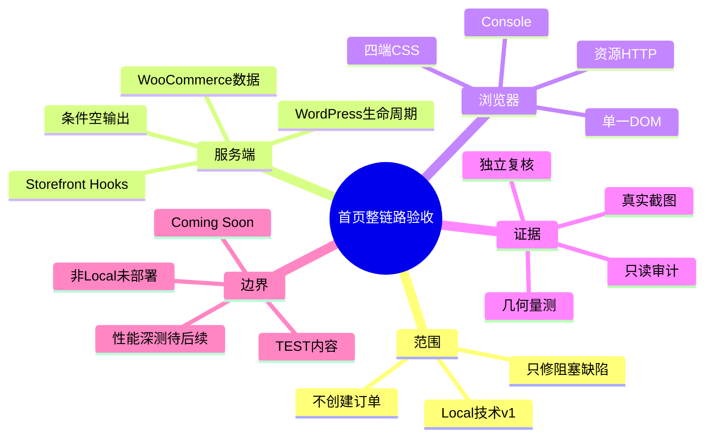
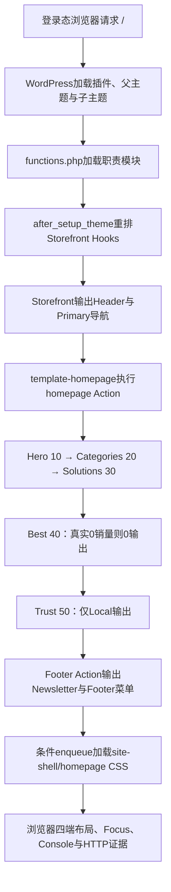

# Day42 WordPress实战：首页整链路验收与证据分层

## 相关笔记

- 学习索引：[[WordPress实战笔记索引]]
- 对应项目笔记：[[../Day42-首页全链路校准与M4技术验收|Day42-首页全链路校准与M4技术验收]]
- 前置学习笔记：[[Day41-累计销量查询与首页展示边界]]
- Header学习笔记：[[Day34-CSS断点级联与可访问状态]]
- Footer学习笔记：[[Day36-菜单数据绑定与静态响应式重排]]
- Homepage入口学习笔记：[[Day37-Homepage-Hook与响应式Hero]]
- 后续学习笔记：D43依据商品归档真实梳理生成

> [!check] 双向链接已完成
> 本学习笔记链接Day42项目笔记；Day42项目笔记反向链接本笔记；[[WordPress实战笔记索引]]登记本笔记。Day41项目与学习笔记也回填D42链接。

## 今日学习成果

- [ ] 我能用自己的话解释：为什么集成验收必须同时看页面、数据合同、资源、Console、代码边界和未验证项。
- [ ] 我能沿真实代码追踪：Storefront Header/Footer/Homepage Hook如何组合成一次Homepage响应，并由条件CSS在四端渐进呈现。
- [ ] 我能在Local安全验证并回滚：不创建订单或修改数据库，用登录态截图、几何、只读审计和文件基线判断是否真的需要改代码。

## 真实项目场景

### 今天解决了什么问题

D31～D41分别完成Header、Footer、Hero、分类、Solutions、Best Sellers和Trust，但“每个区块单独通过”不能自动证明整页通过。D42必须确认它们在同一个登录态真实Homepage中按正确顺序相邻、在四个关键宽度没有相互覆盖或造成页面溢出，并且动态数据仍遵守诚实空状态。同时，WooCommerce Coming Soon让匿名请求看不到真实商城，所以验收必须明确登录态与匿名模板的证据边界。

### 学习范围

- 本篇要掌握：集成验收层次、登录态页面与匿名模板边界、Hook组合、条件资源、四端几何、Console/HTTP/只读审计交叉验证，以及“无代码改动”的工程判断。
- 本篇明确不展开：真实订单和退款口径、Core Web Vitals正式性能测试、缓存/CDN配置、Staging/Production部署、正式内容和营销事实审批。
- 项目中的真实入口：`app/public/wp-content/themes/dentall/functions.php`、`inc/storefront-hooks.php`、`inc/site-footer.php`、`inc/homepage.php`、`assets/css/site-shell.css`、`assets/css/homepage.css`。
- 验证版本与环境：WordPress 7.0.4、WooCommerce 11.0.0、Storefront 4.6.2、DentAll 0.19.0，仅Local；站点PHP基线8.2.29，WP-CLI进程PHP 8.2.9。

## 先建立整体模型

### 一句话模型

整链路验收要从真实请求开始，把“谁输出HTML、谁提供数据、谁控制样式、浏览器实际怎样呈现、哪些事实仍未证明”逐层对齐；只有多层证据互相支持，才能把局部通过升级为里程碑通过。

### 记忆宫殿：剧院总彩排

把Homepage想成一场正式演出前的总彩排：

- 舞台监督按照出场表叫演员上场，对应Storefront的Action与priority。
- 各演员只负责自己的段落，对应Header、Homepage区块和Footer模块职责。
- 道具仓提供真实商品、Page、菜单与图片，对应WordPress/WooCommerce数据源。
- 灯光师根据舞台宽度调整布局，对应Mobile First CSS断点。
- 场务逐项检查走位、麦克风、出口和故障记录，对应截图、几何、键盘、Console、HTTP与审计。
- 样板牌上的未证实宣传只能留在排练厅，对应Local-only Trust与TEST内容。

### 比喻对应回真实机制

| 记忆对象 | 真实技术对象 | 不能混淆的边界 |
|---|---|---|
| 出场表 | Storefront/WordPress Action及priority | PHP文件书写顺序不等于Hook执行顺序 |
| 演员段落 | `storefront-hooks.php`、`site-footer.php`、`homepage.php`职责 | 不把多个生命周期重新堆进一个入口文件 |
| 道具仓 | 菜单、Page、`product_cat`、`WC_Product`、媒体 | TEST内容能验证骨架，但不是正式事实 |
| 灯光调度 | `site-shell.css`与`homepage.css`断点 | 不是为每个宽度复制一套DOM |
| 总彩排清单 | 视觉、DOM、几何、Console、HTTP、PHP与只读数据审计 | 单张截图不能证明查询、安全或副作用 |
| 排练厅门禁 | 登录态Local和`wp_get_environment_type()` | Local通过不等于匿名模板或非Local通过 |

> [!warning] 准确性检查
> “彩排”不是生产流量仿真。D42证明Local技术骨架，不证明正式素材、真实交易、缓存/CDN、邮件、支付、物流或Production性能。

## 思维导图



最重要的主干是：同一个真实请求必须同时通过服务端合同、浏览器表现和副作用边界，才可以判定集成通过。

## 请求与生命周期调用链



- 触发条件：登录态请求Local静态首页，Storefront命中Homepage模板。
- 加载入口：子主题`functions.php`按职责加载setup、Storefront、Footer与Homepage模块。
- 执行顺序：父主题/子主题Hook组合后，Header→Homepage priority 10～50→Footer。
- 输入数据：WordPress Reading设置、原生菜单、Page、产品分类、Woo商品与环境类型。
- 输出或副作用：服务器端HTML、条件CSS和图片/SVG请求；D42无持久化写入。
- 可观察证据：DOM快照、四端截图、`clientWidth/scrollWidth`、Console、HTTP状态、PHP lint、WP-CLI审计。

## 核心概念卡

| 概念 | 准确定义 | DentAll真实例子 | 常见误区 | 如何验证 |
|---|---|---|---|---|
| 集成证据 | 多个已实现单元在同一真实请求中协同工作的证据 | D37～D41区块与Newsletter/Footer同页出现 | 把各自夹具通过直接相加成整页通过 | 登录态整页截图＋DOM＋几何 |
| 证据分层 | 不同证据回答不同问题，不能互相冒充 | 截图看布局，审计看查询/恢复，HTTP看资源 | 用截图证明数据库没有写入 | 为每个断言选对应证据 |
| 诚实空输出 | 数据不满足合同时不制造内容 | 真实销量0使Best Sellers整区缺席 | 误判为“区块坏了”，用假数据补齐 | Getter数量＋DOM section计数 |
| 页面级溢出 | 文档横向滚动范围超过可视内容宽度 | 四端`scrollWidth === clientWidth` | 把组件内受控横滑当页面溢出 | 同时量文档和目标组件 |
| Local技术里程碑 | 指定版本/环境内的工程骨架验收 | M4 Local技术v1 | 等同正式内容、部署和生产上线 | 明确“通过/未通过”清单 |
| 无改动决策 | 证据没有发现阻塞缺陷时保持运行实现不变 | Day42主题仍为0.19.0 | 为了显示工作量强行改CSS/版本号 | 缺陷列表＋减法审查 |

## 项目实战代码

> [!important] 代码真实性
> 下列片段来自当前DentAll仓库。D42没有新增运行代码；学习重点是读懂既有组合入口和为什么“验证通过后不改”更准确。

### 涉及文件

- `app/public/wp-content/themes/dentall/functions.php`：只加载职责模块，不堆业务实现。
- `app/public/wp-content/themes/dentall/inc/storefront-hooks.php`：Header、导航、资源条件加载和Storefront Hook调整。
- `app/public/wp-content/themes/dentall/inc/site-footer.php`：Footer菜单与Local禁用Newsletter。
- `app/public/wp-content/themes/dentall/inc/homepage.php`：Hero、Categories、Solutions、Best与Trust的Homepage顺序和数据合同。
- `app/public/wp-content/themes/dentall/assets/css/site-shell.css`：Header/Footer四端壳层。
- `app/public/wp-content/themes/dentall/assets/css/homepage.css`：只在Homepage使用的叶子布局。
- `project-docs/tests/day41-home-products-trust-audit.php`：无订单/销量写入的Local只读审计。

### 从入口开始追踪

1. `functions.php`首先加载setup，再加载Storefront、Footer和Homepage模块。
2. `after_setup_theme`确保父主题先建立默认行为，子主题再移除未验收输出并挂载自己的公开扩展点。
3. Storefront Homepage模板执行`homepage` Action，DentAll按10～50 priority输出相邻区块。
4. `wp_enqueue_scripts`只在需要的页面加载`site-shell.css`与`homepage.css`，浏览器再按宽度应用同一DOM的渐进规则。
5. 如果移除Homepage模块，首页区块消失但Header/Footer仍存在；如果移除Footer模块，Homepage数据区不应被影响。这正是职责边界可测试的价值。

### 关键代码片段一：入口保持薄

源文件：`functions.php`。

```php
require_once get_stylesheet_directory() . '/inc/setup.php';
require_once get_stylesheet_directory() . '/inc/storefront-hooks.php';
require_once get_stylesheet_directory() . '/inc/site-footer.php';
require_once get_stylesheet_directory() . '/inc/homepage.php';
```

入口只表达依赖方向；实现留在职责模块。Day42不新建`day42.php`，因为“验收”不是新的前台运行职责。

### 关键代码片段二：信息架构由Hook priority表达

源文件：`inc/homepage.php`。

```php
add_action( 'homepage', 'dentall_homepage_hero', 10 );
add_action( 'homepage', 'dentall_homepage_categories', 20 );
add_action( 'homepage', 'dentall_homepage_solutions', 30 );
add_action( 'homepage', 'dentall_homepage_best_sellers', 40 );
add_action( 'homepage', 'dentall_homepage_trust_metrics', 50 );
```

| 代码 | 表面动作 | WordPress中的真实作用 | 为什么这样写 |
|---|---|---|---|
| `add_action()` | 注册回调 | 把输出接入Storefront Homepage生命周期 | 不复制父主题完整模板 |
| priority 10～50 | 排序数字 | 冻结区块信息架构顺序 | 文件行号或CSS视觉顺序不能替代服务端顺序 |
| 独立回调 | 每区一个入口 | 允许空数据单独0输出与定向测试 | 避免一个巨型函数共享隐式状态 |

### 关键代码片段三：诚实空状态

源文件：`inc/homepage.php`。

```php
$products = dentall_get_homepage_best_sellers();

if ( empty( $products ) ) {
	return;
}
```

真实Local销量为0时没有Best Sellers标题或空壳。整页截图中“看不到”与审计Getter 0互相支持，才能判断这是正确降级而不是CSS隐藏或Hook失效。

### 运行证据

- 页面：登录态`http://dentall.local/`，390/768/1024/1440。
- 正常结果：Header、Hero、1个分类、4个Solutions、5项Trust、禁用Newsletter和Footer按合同出现。
- 边界结果：Best Sellers真实0销量整区缺席；390/768为紧凑Header，1024仍保持紧凑，1440切完整PC导航。
- 几何：四端文档`scrollWidth === clientWidth`；390/768/1024因垂直滚动条分别为375/753/1009px内容宽，1440为1440px。
- Console/HTTP：0个warning/error；7项主题资源HTTP 200。
- 服务端：5个主题PHP文件lint通过；D41只读审计15/15通过。
- 证据能证明：当前Local登录态整页结构、响应式边界、资源可达、既有查询合同和0持久化测试路径。
- 证据不能证明：正式内容、匿名Coming Soon、真实订单/退款、缓存/CDN、Core Web Vitals、Staging或Production。

## 职责边界

| 层级 | 本主题中负责什么 | 不应该负责什么 |
|---|---|---|
| WordPress Core | 请求生命周期、主题加载、Action、菜单/Page与转义API | 不修改核心文件 |
| WooCommerce | 商品/销量事实、可见性、原生卡片与Coming Soon模板 | 不用截图反推订单或直接改内部表 |
| Storefront父主题 | Header/Footer/Homepage扩展点与模板骨架 | 不直接改父主题文件 |
| DentAll子主题 | 选择区块、顺序、局部展示、响应式与Local预览边界 | 不承担正式业务事实或交易规则 |
| `dentall-core` | 本轮无新职责 | 不把纯展示验收塞进插件 |
| 数据库与媒体 | 保存真实菜单、Page、分类、商品和图片 | D42不写入，不把TEST素材当正式素材 |
| 浏览器 | 解析HTML/CSS、展示、Focus、Console与资源请求 | 不证明数据库没有写入或非Local已部署 |

## Hook、API或模板机制详解

| 项目 | 说明 |
|---|---|
| 机制类型 | Action＋父主题公开扩展点＋条件enqueue＋WooCommerce原生模板 |
| 名称或入口 | `after_setup_theme`、`homepage`、Storefront Header/Footer Actions、`wp_enqueue_scripts` |
| 注册位置 | `inc/storefront-hooks.php`、`inc/site-footer.php`、`inc/homepage.php` |
| 默认优先级或顺序 | Homepage 10/20/30/40/50；Header/Footer按Storefront既有Action再做最小重排 |
| 回调输入 | 多数前台Action不直接传业务对象；回调从WordPress/Woo API读取当前事实 |
| 返回/输出 | Action回调输出HTML或在空状态直接返回；Filter仍必须返回过滤值 |
| 副作用 | 前台只读查询、HTML与资源请求；D42无持久化副作用 |
| 影响范围 | Local登录态真实Homepage；壳层CSS还影响其他Storefront页面 |
| 移除方式 | 用相同callback/priority移除Hook；按依赖顺序移除无引用CSS/资源，不改核心 |

## 安全、数据与站点影响

| 检查面 | 本次结论 | 证据或待验证项 |
|---|---|---|
| 输入清洗与验证 | D42无新输入；既有菜单/Page/商品函数保持各自验证合同 | D39～D41审计与源码复核 |
| Capability | 前台只读不新增后台动作 | 无新增角色/入口 |
| Nonce | 无状态变更，不适用 | 未来后台写入仍需capability＋nonce |
| 输出转义 | 无新输出；既有PHP继续按文本/URL/属性上下文转义 | PHP/Code Review基线 |
| 数据库写入 | 0 | 不创建订单、不改销量、不改Option |
| URL与SEO | 0变更 | TEST Page仍noindex；正式URL未冻结 |
| 缓存 | 0配置变更 | 查询耗时、整页缓存与CDN留D97/上线前 |
| 支付、物流与订单 | 0变更 | Trust支付文字只限Local TEST |
| 部署与回滚 | 仅Local；运行代码0改动 | 文档提交可独立回退；非Local未部署 |

## 动手练习

### 练习一：只读观察

- 目标：判断Best Sellers缺席是正确空状态还是实现失效。
- 操作：先查Homepage Hook priority，再运行D41只读审计，最后在登录态DOM检查section数量。
- 预期：Hook为40、Getter真实基线0、section为0。
- 实际证据：15/15 PASS且真实整页无Best Sellers空壳。

### 练习二：Local最小改动判断

- 改动：不修改源码；只在DevTools临时调一个Homepage局部间距，观察四端后刷新恢复。
- 风险边界：仅Local；不修改核心、数据库、真实支付或Production。
- 验证：如果没有可复现P0/P1/P2，正式源码保持不变。
- 回滚：刷新即撤销DevTools临时值；Day42无需Git代码回滚。

### 练习三：故障推演

- 假设症状：1440出现完整PC导航，但1024也错误出现PC导航并挤压搜索。
- 可能原因：`min-width: 75rem`断点被更低宽度规则覆盖，或紧凑/PC可见性选择器泄漏。
- 第一项检查：分别在1199和1200读取相同DOM元素的computed display，而不是先改HTML。
- 为什么先查它：Header本来就是单一DOM，症状更可能来自CSS级联；复制第二套导航会扩大问题。

## 常见误区与排错顺序

| 现象或误区 | 可能原因 | 推荐检查顺序 | 最小验证方法 |
|---|---|---|---|
| 匿名首页看不到DentAll区块 | Woo Coming Soon接管匿名请求 | 1. 登录状态；2. 页面模板；3. DOM；4. Hook | 对比登录态根URL和匿名响应，不先改主题 |
| 区块缺席就判为Bug | 真实空状态或环境闸门 | 1. Getter；2. Hook；3. 环境；4. DOM；5. CSS | 输出数量与section计数交叉验证 |
| 单张1440截图就判四端完成 | 断点、溢出和小屏状态未验证 | 1. 390；2. 768；3. 1024；4. 1440；5. 边界 | 每档截图＋文档几何 |
| Console为0就判性能通过 | Console不测查询耗时、缓存或LCP | 1. 资源；2. 查询；3. 页面缓存；4. CWV | 分层记录能证明/不能证明 |
| 为了交付强行改版本号 | 没有运行缺陷却追求可见diff | 1. 缺陷等级；2. 证据；3. 最小修复；4. 减法 | 0阻塞缺陷时保留原实现 |
| 工具超时就判页面失败 | 浏览器控制链与页面执行是不同故障域 | 1. 已落盘证据；2. 页面Console；3. HTTP；4. 重试范围 | 把工具错误与站点错误分开登记 |

## 掌握标准

- [ ] 不看笔记，能在5分钟内讲清“真实请求→Hook组合→数据/空状态→CSS→浏览器证据→里程碑边界”。
- [x] 能指出项目中的真实入口、Homepage priority、Header/Footer模块和条件CSS。
- [x] 能区分WordPress、WooCommerce、Storefront、DentAll子主题、数据库和浏览器证据职责。
- [x] 能说明正常、空数据、匿名Coming Soon、工具超时和非Local未部署路径。
- [x] 能在Local完成截图、几何、Console、HTTP、PHP和只读审计，并说明为什么不创建订单。
- [x] 能判断对数据、URL、SEO、缓存、支付、物流和部署的实际影响。

当前掌握度：初识；待完成费曼自测后再升级。

## 费曼测试题（7道）

1. 不用专业术语，怎样解释“每个区块单测通过”为什么仍不能直接宣布首页里程碑完成？
2. 剧院比喻中的舞台监督、演员、道具仓、灯光、场务和排练厅门禁分别对应哪些真实对象？
3. 从登录态请求`/`开始，按顺序说出父主题、子主题模块、Homepage Action、Footer与CSS怎样参与最终页面。
4. 为什么真实销量0导致Best Sellers缺席是通过证据，而不是缺陷？你需要哪三层证据证明？
5. 截图、DOM、几何、Console、HTTP、PHP lint和WP-CLI审计各能证明什么、不能证明什么？
6. 为什么D42没有修改一行运行代码仍可以算完成实施？什么情况下必须改？
7. 迁移到区块主题或Shopify时，哪些验收原则保持不变，哪些Hook、模板、预览和性能工具必须重新验证？

### 我的费曼答案与纠正

待自测。每题标记`通过`、`含糊`或`答错`；把知识缺口回链到“整体模型”“调用链”“核心概念卡”或“安全、数据与站点影响”。

### 自测评分

| 分数 | 标准 |
|---:|---|
| 0 | 无法解释，或只能猜术语 |
| 1 | 能说定义，但说不清因果、边界和证据 |
| 2 | 能用通俗语言解释，并准确对应项目机制与证据 |

总分：尚未自测 / 14；存在0分题时不提升掌握度。

## 间隔复习记录

| 复习节点 | 计划日期 | 完成 | 暴露的问题 | 修正位置 |
|---|---|---|---|---|
| D+1 | 2026-09-01 | [ ] | 复习后记录 | 复习后记录 |
| D+3 | 2026-09-03 | [ ] | 复习后记录 | 复习后记录 |
| D+7 | 2026-09-07 | [ ] | 复习后记录 | 复习后记录 |
| D+14 | 2026-09-14 | [ ] | 复习后记录 | 复习后记录 |

## 收尾总结

- 我今天真正理解了：集成验收不是继续写代码，而是用正确证据把多个职责层连成可验证因果链。
- 我仍然容易混淆：Local资源全部200、Console为0并不等于生产性能或缓存已通过。
- 下次遇到类似问题，我会先检查：验收口径、真实请求环境和缺席内容的数据合同，再检查DOM/CSS，而不是先改样式。
- 下一篇直接相关学习笔记：D43完成商品归档信息架构真实梳理后回填Wiki链接。

## 后续如何向AI高效提问

### 提问公式

`真实环境与登录状态 + 里程碑口径 + 页面/Hook入口 + 四端与状态矩阵 + 已有截图/几何/Console/HTTP/审计 + 禁止写入边界 + 希望的缺陷分级`

### 提问前准备

- WordPress、WooCommerce、父/子主题、PHP和缓存环境版本。
- 请求是登录态、匿名、Preview、Staging还是Production，当前命中哪个模板。
- 预期区块顺序、真实数据数量、空状态和环境闸门。
- 390/768/1024/1440截图、文档/组件几何、Console、失败资源和服务端审计。
- 是否允许创建测试订单、改商品状态或写数据库；不允许时明确只读。
- 删除Cookie、密码、密钥、订单客户信息和其他敏感数据。

### 可复制的代码理解提示词

```text
你是我的WordPress/WooCommerce集成验收教练。请基于真实环境和代码，把多个已完成组件如何组成一个页面讲清楚，不要把截图、模拟数据或匿名模板当成更强的证据。

环境：[版本、Local/Staging、登录态/匿名]
里程碑口径：[技术v1/正式内容/生产]
真实入口：[模板、Action、priority、enqueue]
区块与数据合同：[顺序、数量、空状态、环境闸门]
四端证据：[截图、client/scroll width、键盘]
服务端证据：[PHP lint、WP-CLI审计、资源HTTP]
允许的写入：[无/精确范围]
未验证：[订单、缓存、CWV、非Local等]

请输出：
1. 请求与生命周期调用链；
2. 每类证据能证明和不能证明什么；
3. 按P0/P1/P2/P3列出缺口；
4. 只为阻塞缺陷给出最小修复；
5. 数据、SEO、缓存、支付、物流和部署影响；
6. 7道费曼题，先不给答案。
```

### 可复制的排错提示词

```text
这是一个WordPress整页集成问题。请先区分页面Bug、真实空状态、环境模板差异和测试工具故障，不直接建议重构或安装插件。

预期：[区块顺序与状态]
实际：[哪个视口/登录状态/页面异常]
模板与Hook：[真实值]
数据数量与环境类型：[真实值]
DOM/几何/Console/HTTP：[真实证据]
服务端审计：[命令与结果]
已排除：[真实值]
风险边界：[不写数据库/不改URL/不碰Production等]

请按证据强度排序原因，给每项最小只读检查；只有确认P0/P1或阻塞P2后再给最小修复、验证和回滚。
```

> [!warning] AI验证边界
> AI对浏览器表现、Woo交易、缓存或平台映射的解释不是项目证据。必须用当前版本源码、真实页面、官方资料或可复演实验核实；工具连接超时也不能自动归因成页面故障。

## 变种应用到其他项目

| 新场景 | 保持不变的原则 | 可能变化的实现 | 必须重新确认 | 最小验证 |
|---|---|---|---|---|
| 另一个Storefront子主题 | 真实请求、Hook顺序、状态矩阵、四端和副作用边界 | 品牌模块、菜单、断点与数据 | 版本、已启用插件、缓存与内容 | 登录/匿名＋四端＋只读审计 |
| 其他经典WordPress主题 | 证据分层、诚实空状态、最小修复 | Header/Footer/Home入口与模板Hook | 主题公开扩展点和Woo兼容 | 不改父主题的整页冒烟 |
| WordPress区块主题 | 同一里程碑仍需页面/数据/资源/权限证据 | Site Editor、`theme.json`、Block Template和Interactivity API | 当前区块API、编辑权限和缓存 | Preview/前台双路径＋四端 |
| 独立插件中的页面模块 | 输入/输出/副作用与停用回滚 | Shortcode、Block、REST和资源队列 | 跨主题必要性、故障隔离和卸载 | 启停前后0残留＋代表状态 |
| Shopify或其他平台 | 技术预览不等于正式发布，仍需四端/状态/性能证据 | Theme Preview、Section、Liquid/JSON Template等均待验证 | 官方发布、数据、权限、缓存和分析模型 | 开发店＋官方资料，待验证 |

### 变种练习

选择“WordPress区块主题”，先不写代码：

1. 原问题仍是多个区块在同一真实页面和多视口能否协同工作。
2. 不变的是验收口径、真实数据/空状态、证据分层、缺陷等级和副作用边界。
3. Storefront `homepage` Action与经典模板必须替换，不能照抄。
4. 最小查证是目标版本的Block Template、Site Editor预览、样式级联、前端资源和Woo商品区块合同。
5. 只有Preview截图而没有真实前台、数据和资源证据时，不能宣称里程碑完成。

## 可复用核心思想

### 跨平台不变量

集成验收的稳定结构是“明确口径→真实环境→职责调用链→正常/边界状态→多端表现→数据与副作用→缺陷分级→可回滚结论”。证据必须与断言匹配，无法证明的事项要保留为边界而不是用推断填空。

### WordPress/WooCommerce当前实现

DentAll通过Storefront公开Action组合Header、Homepage与Footer，WordPress原生菜单/Page和WooCommerce商品API提供事实，子主题以条件enqueue和Mobile First CSS控制同一DOM。D42用登录态真实页、四端几何、Console/HTTP、PHP lint与WP-CLI只读审计完成Local技术v1，并因无阻塞缺陷保持0.19.0不变。

### Shopify或其他平台的对应机制

Theme Preview、Section、商品集合和发布通道可能承担相近职责，但具体数据口径、扩展点、资源管线、缓存和权限均须按官方机制重新验证。本篇只迁移验收方法，不声称与WordPress Hook一一对应，也不授权DentAll实施Shopify。
