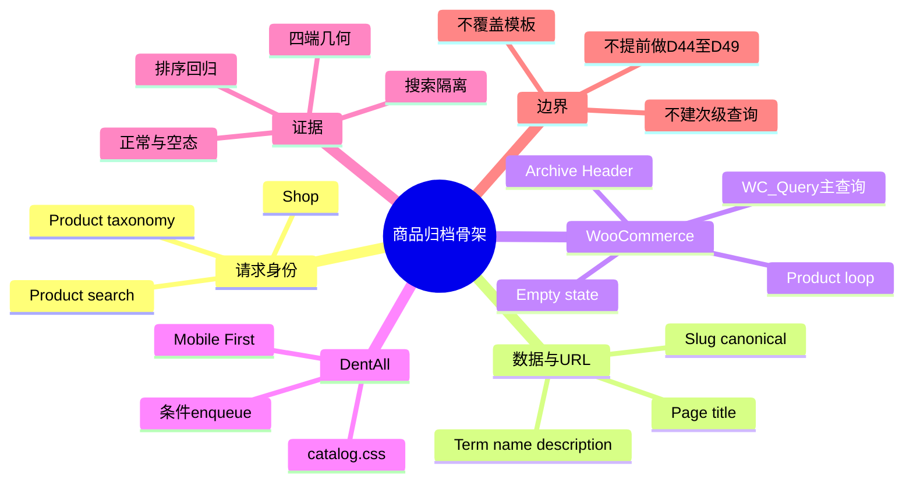
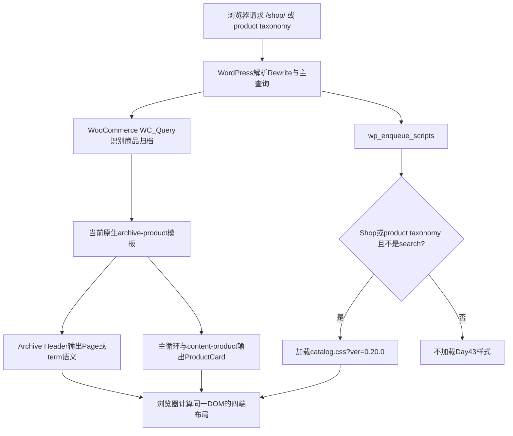

# Day43 WordPress实战：WooCommerce归档主查询与条件资源

## 相关笔记

- 学习索引：[[WordPress实战笔记索引]]
- 对应项目笔记：[[../Day43-商品归档信息架构与PC骨架|Day43-商品归档信息架构与PC骨架]]
- 前置学习笔记：[[Day42-首页整链路验收与证据分层]]
- 后续学习笔记：[[Day44-CSS-Grid与WooCommerce每页数量解耦]]
- 同主题知识：[[Day29-原生循环与卡片展示契约]]、[[Day39-菜单驱动的分类查询与Flex换行]]

> [!check] 双向链接状态
> 本笔记已链接Day43项目笔记；Day43项目笔记已反向链接本笔记；[[WordPress实战笔记索引]]已登记本笔记。

## 今日学习成果

- [x] 我能用自己的话解释Shop标题、slug/URL、WooCommerce主查询、归档模板与ProductCard分别负责什么。
- [x] 我能沿真实请求追踪到`wp_enqueue_scripts`、WooCommerce条件标签、Archive Header、商品循环和条件CSS。
- [x] 我能在Local安全修改、验证并回滚一个只影响Shop与商品taxonomy的展示资源，同时证明商品搜索没有被提前纳入。

## 真实项目场景

### 今天解决了什么问题

DentAll从首页进入W8商品归档开发。D43需要先建立一个可靠骨架：Shop和商品分类怎样使用原生标题/描述、谁拥有商品查询、卡片从哪里输出、`/shop/`怎样保持稳定，以及归档CSS怎样只在正确请求加载。如果此时直接复制模板或新建查询，D44网格、D45排序、D46分页和D49筛选会形成两套状态来源，后续更难维护。

### 学习范围

- 本篇要掌握：Shop Page数据与URL解耦、WooCommerce商品归档主查询、原生模板/循环职责、条件enqueue、条件标签交叉和CSS级联边界。
- 本篇明确不展开：网格列数、排序内部定制、分页、商品搜索样式、筛选、正式分类内容、支付和生产缓存。
- 项目真实入口：`app/public/wp-content/themes/dentall/inc/setup.php`中的`dentall_enqueue_catalog_assets()`、`assets/css/catalog.css`、Local `/shop/`和商品分类URL。
- 验证版本与环境：Local；WordPress 7.0.4、WooCommerce 11.0.0、Storefront 4.6.2、DentAll 0.20.0；Staging/Production未同步。

## 先建立整体模型

### 一句话模型

一次商品归档请求先由WordPress解析URL，再由WooCommerce接管主查询和归档模板，Page或term提供招牌文字，原生循环输出商品卡，DentAll最后只为匹配的请求加载展示CSS。

### 记忆宫殿：商场导购系统

把归档页想成商场的一层商品区：入口地址是楼层编号，门楣写着公开名称，导购系统生成当天商品清单，货架规范决定每件商品怎样陈列，装修班只处理颜色和间距。把门楣从“商店”换成`Products`不需要改楼层编号；装修班也不应该重新决定库存里有哪些商品。

### 比喻对应回真实机制

| 记忆对象 | 真实技术对象 | 不能混淆的边界 |
|---|---|---|
| 楼层编号 | Shop Page slug与URL `/shop/` | 公开标题改变不等于URL必须改变 |
| 门楣 | Shop Page标题或taxonomy term名称/描述 | 它提供归档语义，不拥有商品查询 |
| 导购清单 | WordPress主查询＋`WC_Query`归档约束 | 不由CSS或第二个`WP_Query`替代 |
| 货架规范 | WooCommerce归档模板、loop与`content-product.php` | ProductCard不是筛选/分页引擎 |
| 装修班 | DentAll子主题`catalog.css` | 只控制表现，不写商品数据 |
| 当日开放区域 | `is_shop()`、`is_product_taxonomy()`与`is_search()` | 条件可能交叉，必须用真实请求验证 |

> [!warning] 准确性检查
> 比喻不表示WooCommerce只有一个PHP文件，也不表示所有主题都走完全相同的模板优先级。DentAll当前没有`woocommerce.php`或子主题模板覆盖，运行证据才支持“当前复用原生模板”这一结论。

## 思维导图



最重要的主干是：URL解析和内容数据确定“这是哪个归档”，WooCommerce主查询确定“有哪些商品”，主题模板与CSS才确定“怎样呈现”。

## 请求与生命周期调用链



- 触发条件：前台请求命中Shop或商品taxonomy，且不是搜索请求。
- 加载入口：WordPress `wp_enqueue_scripts`；DentAll回调优先级45，依赖优先级40登记的`dentall-site-shell`。
- 执行顺序：WordPress解析请求→WooCommerce调整商品主查询/选择归档输出→主题Hook输出Header和Loop；资源队列为匹配请求登记CSS→浏览器应用级联。
- 输入数据：Shop Page标题/slug、taxonomy term、WooCommerce主查询参数、商品状态和主题版本。
- 输出或副作用：服务器端HTML与一个条件CSS请求；Day43另有一次明确授权的Local Shop Page标题写入。
- 可观察证据：H1、标题、Canonical、商品数量、排序/空态、CSS请求、四端computed style、页面宽度和Console。

## 核心概念卡

| 概念 | 准确定义 | DentAll真实例子 | 常见误区 | 如何验证 |
|---|---|---|---|---|
| Shop Page | WooCommerce设置中绑定为商店归档语义来源的WordPress Page | ID 7，标题`Products`、slug `shop` | 把它当普通Page模板，或认为改标题必改URL | `wp post get`、`wp post url`、前台H1/Canonical |
| 主查询 | WordPress为当前请求建立的全局查询，WooCommerce在商品归档阶段施加商品规则 | `/shop/`当前返回2件商品 | 为改布局重新建`WP_Query` | 检查模板循环、排序后URL与结果数量 |
| Archive Header | 归档标题及可选描述的语义区域 | Shop H1 `Products`；taxonomy显示term名称/描述 | 把Hero图片、筛选和商品列表全塞进Header | DOM与Hook/模板源码 |
| 条件enqueue | 只在满足请求条件时登记资源 | Shop/taxonomy加载`catalog.css`，搜索不加载 | 只判断`is_shop()`就认为搜索一定排除 | 在三类真实URL读取stylesheet列表 |
| 条件标签交叉 | 多个Conditional Tag可能同时为真 | 商品搜索实测`is_shop()`路径可命中 | 把条件标签想成互斥枚举 | 真实请求矩阵，不靠函数名猜测 |
| CSS特异性 | 多个匹配规则决定最终声明的优先关系 | `body.woocommerce`压过Storefront的归档标题规则 | 立即使用`!important`或依赖侧栏类 | DevTools Computed与Matched Rules |

## 项目实战代码

> [!important] 代码真实性
> 下面片段来自Day43完成后的真实`app/public/wp-content/themes/dentall/inc/setup.php`，未改写函数逻辑。

### 涉及文件

- `app/public/wp-content/themes/dentall/inc/setup.php`：主题能力与按生命周期登记的样式资源。
- `app/public/wp-content/themes/dentall/assets/css/catalog.css`：Shop和商品taxonomy共用的归档展示叶子层。
- `app/public/wp-content/themes/dentall/style.css`：子主题元数据、Design Token与基础层；0.20.0作为资源缓存键。
- WooCommerce 11.0.0原生归档/循环源码：只读核对主查询和模板合同，未修改。

### 从入口开始追踪

1. WordPress加载子主题`functions.php`，它引入`inc/setup.php`。
2. `setup.php`把`dentall_enqueue_catalog_assets()`注册到`wp_enqueue_scripts`优先级45。
3. 回调先确认WooCommerce条件函数可用，再排除搜索，然后只接受Shop或商品taxonomy。
4. 命中时登记`dentall-catalog`，依赖`dentall-site-shell`并使用主题版本生成缓存键。
5. WooCommerce仍以主查询和原生归档模板输出商品；CSS只改变已有Header与列表周边节奏。
6. 如果删除该回调，商品和排序仍应存在，只会失去DentAll归档CSS；这证明展示层没有接管数据层。

### 关键代码片段

源文件：`app/public/wp-content/themes/dentall/inc/setup.php`。用途：把D43样式限制在已验收请求。

```php
function dentall_enqueue_catalog_assets() {
	if (
		! function_exists( 'is_shop' )
		|| ! function_exists( 'is_product_taxonomy' )
		|| is_search()
		|| ( ! is_shop() && ! is_product_taxonomy() )
	) {
		return;
	}

	$theme = wp_get_theme( get_stylesheet() );

	wp_enqueue_style(
		'dentall-catalog',
		get_stylesheet_directory_uri() . '/assets/css/catalog.css',
		array( 'dentall-site-shell' ),
		$theme->get( 'Version' )
	);
}
add_action( 'wp_enqueue_scripts', 'dentall_enqueue_catalog_assets', 45 );
```

| 代码 | 表面动作 | WordPress中的真实作用 | 为什么这样写 |
|---|---|---|---|
| `function_exists()` | 检查函数 | WooCommerce不可用时安全退出 | 子主题不应因插件停用造成前台Fatal |
| `is_search()` | 排除搜索 | 处理条件标签实际交叉 | D47尚未验收，避免责任泄漏 |
| 两个否定条件 | 接受Shop或taxonomy | 建立共用归档请求集合 | 不把商品详情、Cart或普通Page纳入 |
| `wp_get_theme()` | 读取活动子主题元数据 | 获取0.20.0资源版本 | 统一缓存失效，不散落硬编码版本 |
| 依赖`dentall-site-shell` | 声明顺序 | 使全站Token/壳层先加载 | 比仅靠注册先后更清晰 |
| priority 45 | 晚于壳层40 | 保持基础→壳层→叶子层的覆盖顺序 | 不用`!important`抢级联 |

### 运行证据

- 页面与命令：Local `/shop/`、两个`product-category`归档、`/?s=TEST&post_type=product`、WP-CLI Page/Option读取、PHP lint和CSS静态检查。
- 正常结果：Shop H1 `Products`、Canonical `/shop/`、2件商品、上下两组原生排序/结果信息，CSS 200。
- 边界结果：空taxonomy显示0商品和原生`role="status"`；商品搜索有2件商品但`catalog.css`不存在于资源列表。
- 响应式结果：390/768/1024/1440无页面级横向溢出，Header高度160/192/192/224px。
- 证据能证明：当前Local版本、登录态请求与代表数据下，资源条件、模板复用、URL和页面表现符合Day43合同。
- 证据不能证明：正式分类内容、超过12件商品后的分页、筛选、真实缓存/CDN、匿名Coming Soon、Staging/Production或其他主题兼容性。

## 职责边界

| 层级 | 本主题中负责什么 | 不应该负责什么 |
|---|---|---|
| WordPress Core | 解析Rewrite、建立主查询、加载主题与资源队列 | 不修改核心文件，不把Page标题和slug强绑定 |
| WooCommerce | 识别商品归档、约束主查询、输出Archive Header、Loop、排序与空态 | 不由子主题绕过API直接读写内部表 |
| Storefront父主题 | 提供Woo兼容布局、Hook与默认CSS | 不直接修改父主题文件，也不把其布局类当稳定业务API |
| DentAll子主题 | 条件加载归档叶子CSS、品牌化现有语义DOM | 不建立第二个商品查询，不承载支付/库存规则 |
| `dentall-core` | 本轮无新增职责 | 不为纯展示方便塞入站点业务插件 |
| 数据库与媒体 | 保存Shop Page标题/slug、term和商品事实 | 不把既有TEST分类或商品当正式内容 |
| 浏览器 | 解析HTML/CSS、应用断点并暴露Computed/Console/Network证据 | 不证明数据库未写入或非Local已部署 |

## Hook、API与模板机制详解

| 项目 | 说明 |
|---|---|
| 机制类型 | Action＋Conditional Tags＋Enqueue＋WooCommerce Template/主查询 |
| 名称或入口 | `wp_enqueue_scripts`、`is_shop()`、`is_product_taxonomy()`、`is_search()`、当前Woo原生商品归档模板 |
| 注册位置 | `app/public/wp-content/themes/dentall/inc/setup.php` |
| 优先级/查找顺序 | Site Shell优先级40；Catalog优先级45且声明前者为依赖；当前没有子主题Woo模板覆盖 |
| 回调输入 | Action不传业务对象；回调读取当前主请求条件与活动主题版本 |
| 返回内容 | Action无过滤返回值；不匹配时直接`return`，匹配时登记stylesheet |
| 副作用 | 匹配页面新增一个CSS网络请求；不修改商品查询或数据库 |
| 影响范围 | 前台Shop与商品taxonomy；搜索、商品详情、Cart、普通Page不在D43范围 |
| 移除方式 | 移除同名Action或删除模块代码并同步删除CSS/回退版本；不修改Woo/Storefront核心 |

### 为什么不用模板覆盖

当前HTML已经包含单一Archive Header、语义H1、描述、排序、结果计数、`ul.products`和原生空态。Day43只需改变标题区与列表周边节奏；复制`archive-product.php`会让未来WooCommerce升级差异和Hook缺失风险永久进入子主题，因此没有实际收益。

### 为什么不用第二个查询

排序、分页、库存可见性、目录隐藏、taxonomy和搜索都已经围绕主查询工作。再建一个`WP_Query`会让页面上的结果计数、排序参数、Canonical和分页可能与实际商品列表分裂。布局问题应留在CSS，查询数量问题在D44/D46各自确认。

## 安全、数据与站点影响

| 检查面 | 本次结论 | 证据或待验证项 |
|---|---|---|
| 输入清洗与验证 | 前台无新输入；条件函数读取当前请求 | D43没有表单、REST或AJAX |
| Capability | enqueue不涉及权限；Shop标题写入由本地管理员命令完成 | 目标环境仍应由Administrator维护Shop设置/标题 |
| Nonce | 前台只读不适用；nonce不能替代capability | 无新增后台动作 |
| 输出转义 | 没有新PHP HTML输出；原生模板继续负责上下文转义 | CSS只匹配已有DOM |
| 数据库写入 | 有且仅Local一条Page标题更新 | ID 7标题`Products`、slug `shop`、URL不变 |
| URL与SEO | URL/Canonical不变；H1、Title、面包屑文字变化 | Staging同步后需重测SEO输出 |
| 缓存 | 未改配置；CSS URL版本变为0.20.0 | 生产缓存命中、清理和CWV未测 |
| 支付、物流与订单 | 不适用，0变更 | 不因商品归档外观推断交易能力完成 |
| 部署与回滚 | 仅Local；代码与Page标题是两层部署事实 | 源码回退＋Page标题回退后重跑代表页面 |

## 动手练习

### 练习一：只读观察

- 目标：证明Shop和taxonomy使用同一展示骨架，但标题数据来源不同。
- 操作：分别打开`/shop/`和`/product-category/test-d12-products/`，检查`main > header > h1`、stylesheet和商品循环。
- 预期：DOM骨架与`catalog.css`相同；H1分别来自Shop Page和term。
- 实际证据：Shop为`Products`，分类为`TEST D12 Products`，两者均有2件商品且无横向溢出。

### 练习二：Local最小改动

- 改动：只通过WordPress API把Shop标题由`商店`改为`Products`，不传`post_name`。
- 风险边界：仅Local；不修改核心、商品、订单、真实支付或Production数据。
- 验证：读取`post_title`、`post_name`、`post_status`和`wp post url`，再检查前台H1、Title与Canonical。
- 回滚：`wp post update 7 --post_title='商店'`；回滚后再次验证slug和URL。

### 练习三：故障推演

- 假设症状：商品搜索页也出现浅蓝Archive Header样式。
- 可能原因：商品搜索同时满足了`is_shop()`路径，enqueue条件把标签当成互斥值。
- 第一项检查：读取搜索页实际加载的stylesheet，再对同一请求记录三个条件标签结果。
- 为什么先查它：如果资源根本不应加载，先修服务器端条件比写更多搜索页CSS覆盖更小、更可维护。

## 常见误区与排错顺序

| 现象或误区 | 可能原因 | 推荐检查顺序 | 最小验证方法 |
|---|---|---|---|
| 改了Shop标题后URL也被改 | 更新时同时传了slug，或固定链接/重写另有变更 | 1. Page ID绑定；2. `post_name`；3. permalink；4. redirect | `wp post get 7`＋`wp post url 7` |
| 标题区CSS加载却不生效 | Storefront规则特异性更高或加载顺序错误 | 1. Network；2. Matched Rules；3. specificity；4. dependency | DevTools查看Computed padding/text-align来源 |
| 为解决级联直接加`!important` | 没有找到稳定作用域或依赖顺序 | 1. 选择器；2. DOM稳定类；3. enqueue依赖；4. 断点 | 用`body.woocommerce`最小增强后复测 |
| 启用侧栏后样式消失 | 选择器依赖`.storefront-full-width-content` | 1. body类；2. Header语义类；3. 布局类变化 | 源码检查选择器不包含侧栏布局类 |
| 搜索意外加载归档CSS | `is_shop()`与搜索条件交叉 | 1. URL；2. Query vars；3. 条件标签；4. stylesheet | 搜索页资源列表中`catalog.css`应为0 |
| 排序数量与列表不一致 | 自建查询没有跟主查询同步 | 1. 是否有次级`WP_Query`；2. Loop；3. result count；4. URL参数 | `rg`查询Hook并切换`price-desc`复演 |
| 空分类显示空白 | 原生空态Hook被覆盖、CSS隐藏或模板缺失 | 1. 商品数；2. DOM `role=status`；3. CSS；4. 模板 | 打开代表空term并检查文本/role |

## 掌握标准

- [ ] 不看笔记，能在2分钟内讲清“URL→主查询→归档模板→商品循环→条件CSS”的因果链。
- [x] 能指出`inc/setup.php`、`catalog.css`和当前Woo原生归档入口。
- [x] 能区分WordPress Core、WooCommerce、Storefront、DentAll子主题、数据库与浏览器职责。
- [x] 能说明正常归档、空分类、商品搜索交叉和CSS特异性两个失败路径。
- [x] 能在Local验证Shop标题/URL、条件资源、四端布局并说清双层回滚。
- [x] 能判断本次对数据、URL、SEO、缓存、支付、物流和部署的实际影响。

当前掌握度：初识；真实实施与验证已完成，待合上笔记完成费曼自测后再升级。

## 费曼测试题（7道）

1. 不使用专业术语，怎样解释把Shop标题改成`Products`却保持`/shop/`不变？
2. 商场比喻中的楼层编号、门楣、导购清单、货架规范和装修班分别对应哪些真实对象？比喻在哪个边界失效？
3. 从浏览器请求`/shop/`开始，按顺序讲出WordPress、WooCommerce、Storefront、DentAll PHP与CSS怎样生成最终页面。
4. 为什么D43坚持使用主查询和原生循环？如果新建第二个`WP_Query`，排序、结果数、分页和SEO可能怎样分裂？
5. 为什么商品搜索可能命中`is_shop()`路径？只写`is_shop() || is_product_taxonomy()`会造成什么实测后果？
6. `body.woocommerce .woocommerce-products-header`解决了什么级联和侧栏问题？为什么不首选`!important`？
7. 把这一骨架迁移到区块主题或Shopify时，哪些职责不变，哪些模板、条件、路由与缓存机制必须重新验证？

### 我的费曼答案与纠正

待自测。每题标记`通过`、`含糊`或`答错`；把暴露的问题链接回“整体模型”“调用链”“核心概念卡”或“常见误区与排错顺序”。

### 自测评分

| 分数 | 标准 |
|---:|---|
| 0 | 无法解释，或只能猜术语 |
| 1 | 能说定义，但说不清因果、边界和证据 |
| 2 | 能用通俗语言解释，并准确对应技术机制与DentAll证据 |

总分：尚未自测 / 14；存在0分题时不提升掌握度。

## 间隔复习记录

| 复习节点 | 计划日期 | 完成 | 暴露的问题 | 修正位置 |
|---|---|---|---|---|
| D+1 | 2026-09-02 | [ ] | 复习后记录 | 复习后记录 |
| D+3 | 2026-09-04 | [ ] | 复习后记录 | 复习后记录 |
| D+7 | 2026-09-08 | [ ] | 复习后记录 | 复习后记录 |
| D+14 | 2026-09-15 | [ ] | 复习后记录 | 复习后记录 |

## 收尾总结

- 我今天真正理解了：商品归档不是一张静态页面，而是请求身份、内容数据、Woo主查询、模板循环、资源条件和浏览器级联共同完成的结果。
- 我仍然容易混淆：名称相似的Conditional Tag不是互斥枚举，必须用真实请求验证组合。
- 下次遇到类似问题，我会先检查：请求类型、主查询所有权和实际资源列表，再决定是数据、模板、enqueue还是CSS问题。
- 下一篇直接相关学习笔记：[[Day44-CSS-Grid与WooCommerce每页数量解耦]]。

## 后续如何向AI高效提问

### 提问公式

`真实请求URL + 版本/主题 + 主查询与模板现状 + 条件标签结果 + 资源列表 + DOM/Computed证据 + 不可触碰边界 + 期望的最小修复`

### 提问前准备

- WordPress、WooCommerce、父/子主题和PHP版本，以及Local/Staging/Production。
- 请求是Shop、taxonomy、搜索、分页还是筛选组合；是否登录、是否被Coming Soon接管。
- 当前H1、Canonical、Query vars、商品数、排序URL、模板覆盖和stylesheet列表。
- 浏览器Matched Rules、Computed、横向几何和Console；服务端PHP lint与错误日志时间。
- 是否允许写Page、term、商品或Option；删除Cookie、密码、密钥和真实客户资料。

### 可复制的代码理解提示词

```text
你是我的WooCommerce归档机制教练。请基于以下真实环境和代码解释，不要假设模板、插件或数据。

环境：[WordPress/WooCommerce/父子主题/PHP版本与Local或Staging]
请求：[Shop、taxonomy、搜索、分页或筛选URL]
真实入口：[主查询Hook、模板、enqueue函数]
最小代码：[粘贴真实片段]
观察证据：[H1、Canonical、商品数、资源、Computed、Console]
当前理解：[我认为谁负责什么]

请输出：
1. 用实体比喻建立整体模型并准确映射；
2. 画出URL到主查询、模板、循环和CSS的调用链；
3. 区分Page/term数据、URL、查询、模板与表现职责；
4. 指出条件标签可能交叉的地方；
5. 给出Local最小验证、影响与回滚；
6. 最后出5道费曼题，先不给答案。

边界：[不改核心/不建次级查询/不碰Production/其他]
```

### 可复制的排错提示词

```text
这是一个WooCommerce商品归档排错问题。请先按证据缩小到URL、主查询、模板、enqueue或CSS层，不直接建议复制模板、写第二个查询或安装插件。

预期：[应该出现的标题、商品、排序、样式]
实际：[具体差异]
复现URL与状态：[真实值]
版本与模板覆盖：[真实值]
条件标签/Query vars：[真实值]
DOM、Computed、Network、Console：[真实证据]
已尝试：[真实值]
风险边界：[数据、URL、SEO、缓存、交易、部署]

请输出：事实与推断、按概率/风险排序的原因、每项最小只读检查、确认后的最小修复、四端/空态/搜索回归和双层回滚。
```

> [!warning] AI验证边界
> Conditional Tag、模板优先级和Woo查询行为会随请求、主题和版本变化。AI解释只能作为排查候选；以当前版本源码、真实URL、WP-CLI和浏览器证据为准。

## 变种应用到其他项目

| 新场景 | 保持不变的原则 | 可能变化的实现 | 必须重新确认 | 最小验证 |
|---|---|---|---|---|
| 另一个Storefront子主题 | 主查询唯一、URL/标题解耦、条件资源与代表状态 | Token、标题高度、内容和侧栏 | 主题/Woo版本、插件、每页数量 | Shop＋taxonomy＋search＋empty四端 |
| 其他经典WordPress主题 | 查询、模板、样式职责分离 | 主题Hook、容器类、排序位置和模板优先级 | `woocommerce.php`、Woo支持与覆盖 | 模板路径＋排序/分页回归 |
| WordPress区块主题 | 内容来源、查询所有权、URL和状态合同 | Block Template、Query Loop、`theme.json`与资源加载 | 当前Woo Blocks/主题版本与编辑权限 | Site Editor预览＋真实前台请求 |
| 独立插件中的相似能力 | 跨主题业务规则才进插件，停用可回退 | Query Hook、Block或REST入口 | 是否真有跨主题生命周期 | 启停前后查询、URL和残留数据 |
| Shopify或其他平台 | 集合数据、商品集合、卡片、URL、状态与资源仍需分责 | Collection、Liquid/JSON Template、Section、Filter和资源管线，待验证 | 官方路由、SEO、分页、缓存和发布模型 | 开发店代表集合＋官方资料，待验证 |

### 变种练习

选择“WordPress区块主题”，不写代码先回答：

1. 商品归档仍然需要一个明确的查询所有者和稳定URL。
2. 标题/描述、商品集合、卡片和CSS仍应分责。
3. Storefront经典Hook和DOM类不能照搬，需替换为目标Block Template与样式机制。
4. 最小查证包括当前Woo Blocks模板、Query上下文、资源加载与编辑器/前台一致性。
5. 只有编辑器截图而没有真实前台排序、空态和URL证据时，不能宣称迁移完成。

## 可复用核心思想

### 跨平台不变量

归档型页面的可靠骨架来自五份清晰合同：请求与URL识别、标题/描述数据来源、结果查询所有权、条目卡片输出、按页面加载的展示资源。改其中一层时，必须证明其他层没有被无意改变。

### WordPress/WooCommerce当前实现

DentAll在Local以WordPress主查询和WooCommerce 11.0.0归档机制保存商品集合、排序与空态，Storefront 4.6.2提供当前原生输出，子主题0.20.0通过`wp_enqueue_scripts`和真实条件组合只加载`catalog.css`。Shop Page标题与slug分别验证，避免把内容编辑扩散成URL变更。

### Shopify或其他平台的对应机制

集合标题/描述、集合商品源、商品卡、集合URL和主题资源在其他平台仍存在相同职责，但Shopify的Collection、Liquid/JSON Template、Filter、分页、SEO和缓存行为尚未在DentAll验证，全部标记为“待验证”。本篇只迁移职责划分与证据方法，不授权接入Shopify。
