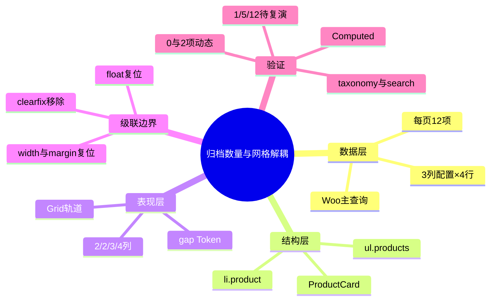
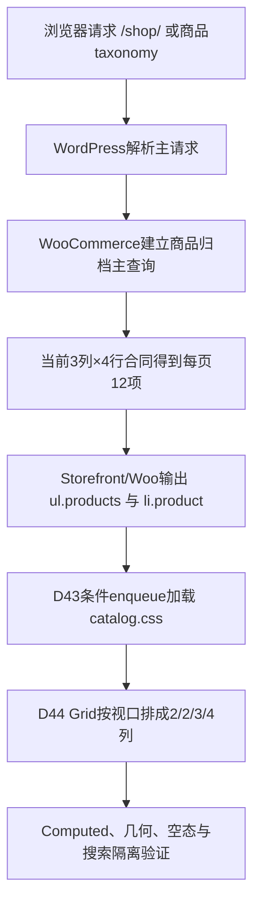

# Day44 WordPress实战：CSS Grid与WooCommerce每页数量解耦

## 相关笔记

- 学习索引：[[WordPress实战笔记索引]]
- 对应项目笔记：[[../Day44-商品网格响应式|Day44-商品网格响应式]]
- 前置学习笔记：[[Day43-WooCommerce归档主查询与条件资源]]
- 后续学习笔记：[[Day45-WooCommerce排序Hook与参数URL]]
- 同主题知识：[[Day29-原生循环与卡片展示契约]]、[[Day27-Design-Token与Mobile-First容器]]

> [!check] 双向链接状态
> 本笔记链接Day44项目笔记；Day44项目笔记反向链接本笔记；[[WordPress实战笔记索引]]已登记本笔记。

## 今日学习成果

- [x] 我能解释为什么WooCommerce“每页12项”和CSS“2/2/3/4列”必须是两份合同。
- [x] 我能沿真实代码追踪主查询、`ul.products`、Storefront浮动样式、DentAll条件CSS和浏览器Computed结果。
- [x] 我能在Local用最小CSS切换Grid，验证父主题级联、四端轨道、空态/搜索隔离，并只回滚Day44而保留D43骨架。

## 真实项目场景

### 今天解决了什么问题

D43已经让Shop与商品taxonomy复用WooCommerce主查询、原生循环和D29 ProductCard，但Storefront仍按传统浮动布局显示商品。D44需要把同一DOM在390/768/1024/1440呈现为2/2/3/4列，同时继续每页查询12项。如果直接把WooCommerce循环列数从3改成4，Storefront当前“列×行”的默认公式可能把每页数量从12扩大为16；如果只加`display:grid`而不解除父主题宽度、margin和clearfix，卡片又不会真正填满Grid轨道。

### 学习范围

- 本篇要掌握：查询数量与视觉列数分层、CSS Grid自动放置、父主题浮动级联清理、Mobile First断点、部分行/空态与证据分层。
- 本篇明确不展开：排序控件、分页实现、搜索样式、筛选侧栏、ProductCard内部改造、正式商品内容和非Local部署。
- 项目真实入口：`app/public/wp-content/themes/dentall/inc/setup.php`、`assets/css/catalog.css`、`style.css`、Local `/shop/`与商品taxonomy。
- 验证版本与环境：Local；WordPress 7.0.4、WooCommerce 11.0.0、Storefront 4.6.2、DentAll 0.21.0；Staging/Production未同步。

## 先建立整体模型

### 一句话模型

WooCommerce主查询决定这一页拿哪12件商品，原生循环把它们输出为同一列DOM，DentAll CSS只决定这些DOM在当前视口排成几列；改变货架外观不应重写进货清单。

### 记忆宫殿：仓库拣货与门店货架

把商品归档想成“仓库先拣货、门店再摆货”。仓库按订单一次拣12箱，货车把12箱送到门店；手机门店每排放2箱，横屏平板每排放3箱，PC每排放4箱。每排能放几箱只改变货架的行数，不应该让仓库突然多拣4箱。Storefront旧浮动宽度像旧货架上固定的托盘尺寸，改用新Grid货架时必须先解除这些固定尺寸和清场标记。

### 比喻对应回真实机制

| 记忆对象 | 真实技术对象 | 不能混淆的边界 |
|---|---|---|
| 仓库拣货单 | WooCommerce主查询与posts per page | 决定结果数量，不由CSS修改 |
| 12箱商品 | 原生循环输出的`li.product`集合 | DOM数量来自查询，不来自Grid列数 |
| 门店货架 | `ul.products { display:grid }` | 只决定视觉轨道与自动放置 |
| 旧托盘尺寸 | Storefront的float、百分比width、margin | Grid容器不会自动删除子项旧宽度 |
| 清场标记 | `ul.products::before/::after` clearfix | 生成内容可能成为Grid Item，应明确移除 |
| 不同门店宽度 | 390/768/1024/1440视口与断点 | 视口不等于内容容器宽度 |

> [!warning] 准确性检查
> 比喻不表示WooCommerce永远固定12项，也不表示所有主题都用Storefront的“列×行”默认公式。DentAll当前12项来自当前版本与配置；换主题、插件或分页设置后必须重新读取真实查询合同。

## 思维导图



最重要的主干是：先证明商品数量没有变，再证明同一批DOM只在CSS层改变排列。

## 请求与生命周期调用链



- 触发条件：非搜索的Shop或商品taxonomy请求。
- 加载入口：`wp_enqueue_scripts`优先级45中的`dentall_enqueue_catalog_assets()`。
- 执行顺序：主请求与查询先确定商品集合，模板再输出DOM，浏览器最后执行CSS级联与布局。
- 输入数据：当前可见商品、Woo目录列/行配置、父主题DOM/样式和视口宽度。
- 输出或副作用：只改变商品列表视觉排列和静态资源版本；不写数据库、不改变查询。
- 可观察证据：`catalog.css?ver=0.21.0`、Computed Grid轨道、卡片矩形、商品数量、`scrollWidth/clientWidth`和搜索页资源列表。

## 核心概念卡

| 概念 | 准确定义 | DentAll真实例子 | 常见误区 | 如何验证 |
|---|---|---|---|---|
| 每页数量 | 主查询一次返回并用于分页的一页结果上限 | 当前3×4=12 | 把PC 4列理解为16项 | 读取配置、源码与查询覆盖 |
| 视觉列数 | CSS容器在当前宽度建立的轨道数 | 2/2/3/4 | 用PHP按设备改查询 | Computed `grid-template-columns` |
| Grid自动放置 | 按DOM顺序把Grid Item放入可用格子 | 真实2项占前两格 | 让部分行卡片拉伸填满 | 比较轨道宽与卡片矩形 |
| `minmax(0,1fr)` | 允许等分轨道收缩到0而不被长内容最小尺寸撑破 | 390两列各159.5px | 只写`1fr`就忽略长词风险 | 长标题/窄宽与溢出验证 |
| clearfix | 浮动布局时代通过伪元素清除浮动的技巧 | Storefront `ul.products::before/after` | 认为换Grid后它一定无害 | 查看伪元素`content`和轨道 |
| 条件资源 | 只在匹配请求加载CSS | 搜索不加载`catalog.css` | 只看Body类判断作用域 | 检查enqueue条件和stylesheet |

## 项目实战代码

> [!important] 代码真实性
> 以下片段来自Day44当前仓库，只保留理解职责所需的最小范围。

### 涉及文件

- `app/public/wp-content/themes/dentall/inc/setup.php`：D43建立的Shop/taxonomy条件资源入口；Day44未修改。
- `app/public/wp-content/themes/dentall/assets/css/catalog.css`：归档标题、节奏和Day44响应式Grid。
- `app/public/wp-content/themes/dentall/style.css`：主题版本0.21.0，为条件CSS提供缓存键。

### 从入口开始追踪

1. `wp_enqueue_scripts`在前台资源阶段调用`dentall_enqueue_catalog_assets()`。
2. 回调排除搜索，并只接受Shop或商品taxonomy，因此D47搜索页不会加载Day44规则。
3. WooCommerce/Storefront已经输出`.site-main > ul.products > li.product`；Day44不复制模板。
4. 浏览器先应用Storefront传统商品列表样式，再由更具体的DentAll规则建立Grid并解除浮动残留。
5. 删除Day44段会恢复D43标题骨架和父主题商品布局；删除整个文件则会错误回滚D43。

### 关键代码片段一：建立Grid并解除父主题残留

源文件：`assets/css/catalog.css`第46～62行。

```css
body.woocommerce.archive .site-main > ul.products {
	display: grid;
	grid-template-columns: repeat(2, minmax(0, 1fr));
	gap: var(--dentall-space-16);
}

body.woocommerce.archive .site-main > ul.products::before,
body.woocommerce.archive .site-main > ul.products::after {
	content: none;
}

body.woocommerce.archive .site-main > ul.products > li.product {
	float: none;
	width: auto;
	min-width: 0;
	margin: 0;
}
```

| 代码 | 表面动作 | 真实作用 | 为什么这样写 |
|---|---|---|---|
| `display:grid` | 切换布局模型 | 让列表建立显式二维轨道 | 不改DOM或查询 |
| `repeat(2,minmax(0,1fr))` | 两个等宽轨道 | 小屏稳定两列并允许内容收缩 | 防止长内容撑破轨道 |
| `content:none` | 取消伪元素生成内容 | clearfix不参与Grid放置 | 解除父主题历史布局机制 |
| `float:none;width:auto` | 清除旧定位和宽度 | 让Grid Item服从轨道 | 只改容器不足以覆盖子项宽度 |
| `min-width:0` | 允许项目收缩 | 降低长标题/控件溢出风险 | Grid/Flex项目常见安全基线 |
| `margin:0` | 清除列间旧margin | gap成为唯一列间距真相源 | 避免间距叠加 |

### 关键代码片段二：Mobile First渐进增强

源文件：`assets/css/catalog.css`第64～90行节选。

```css
@media (min-width: 48rem) {
	body.woocommerce.archive .site-main > ul.products {
		gap: var(--dentall-space-24);
	}
}

@media (min-width: 64rem) {
	body.woocommerce.archive .site-main > ul.products {
		grid-template-columns: repeat(3, minmax(0, 1fr));
	}
}

@media (min-width: 75rem) {
	body.woocommerce.archive .site-main > ul.products {
		grid-template-columns: repeat(4, minmax(0, 1fr));
	}
}
```

基础规则就是手机规则；48rem只改变间距，64rem才改变为3列，75rem改变为4列。这样只有一个DOM和一条从小到大的覆盖链，没有为四端复制四份页面。

### 运行证据

- 页面：Local `/shop/`、`/product-category/test-d12-products/`、`/product-category/test/`、`/?s=TEST&post_type=product`。
- 四端正常结果：390为159.5px×2/16px，768为332.5px×2/24px，1024为299px×3/24px，1440为296px×4/24px。
- 边界结果：320仍为2列/16px且页面无横向溢出；空taxonomy没有商品Grid；搜索不加载本文件。
- 数量证据：独立只读WP-CLI确认列3、行4，Woo公式仍为12项/页；主题/插件没有归档数量覆盖。
- 证据能证明：真实2项的四端级联、轨道、部分行、taxonomy复用、空态和搜索隔离。
- 证据不能证明：真实1/5/12项页面、D29状态与本Grid动态整合、生产缓存/CWV、最终Console和独立CSS HTTP读取。

## 职责边界

| 层级 | 本主题中负责什么 | 不应该负责什么 |
|---|---|---|
| WordPress Core | 请求、主查询生命周期和资源Hook | 不修改核心文件 |
| WooCommerce | 商品归档查询、循环、空态和目录行列配置 | 不让CSS写商品或订单数据 |
| Storefront父主题 | 当前模板DOM与传统商品列表基线 | 不直接修改父主题CSS |
| DentAll子主题 | 条件加载并用CSS实现品牌网格 | 不建立第二查询或承载跨主题业务规则 |
| `dentall-core` | 本主题没有新增职责 | 不接收纯展示网格 |
| 数据库与媒体 | 提供真实商品/分类事实 | 不为截图擅自创建持久TEST商品 |
| 浏览器 | 计算级联、轨道、几何与溢出 | 不把Computed当作12项查询的唯一证据 |

## Hook、API或模板机制详解

| 项目 | 说明 |
|---|---|
| 机制类型 | Enqueue＋WooCommerce主查询/原生模板＋CSS Cascade/Grid |
| 名称或入口 | `wp_enqueue_scripts`、`dentall_enqueue_catalog_assets()`、`ul.products` |
| 注册位置 | `inc/setup.php`优先级45；Day44规则在`catalog.css` |
| 回调输入 | 当前请求的Woo条件标签与主题版本 |
| 必须返回内容 | Action回调无过滤返回值；不匹配请求直接结束 |
| 副作用 | 匹配请求增加/沿用一个CSS资源；Day44只改变该资源内容与版本 |
| 影响范围 | Local Shop与商品taxonomy前台；搜索显式排除 |
| 移除方式 | 只删除Day44网格段并把版本退回0.20.0；保留D43条件enqueue与标题规则 |

## 安全、数据与站点影响

| 检查面 | 本次结论 | 证据或待验证项 |
|---|---|---|
| 输入清洗与验证 | 不适用 | 没有新输入或PHP处理 |
| Capability | 不适用 | 没有后台动作 |
| Nonce | 不适用 | 没有状态变更请求 |
| 输出转义 | 不适用 | 没有新增HTML/PHP输出 |
| 数据库写入 | 无 | CSS-only，独立Agent均未写配置/DB |
| URL与SEO | 0变更 | Title、Canonical、robots、Schema未改 |
| 缓存 | 资源键0.20.0→0.21.0 | 生产缓存/CDN尚未测 |
| 支付、物流与订单 | 0变更 | 仍保持项目既有边界 |
| 部署与回滚 | 仅Local | 非Local须部署D43+D44完整基线后复测 |

## 动手练习

### 练习一：只读观察

- 目标：区分查询数量、DOM类和视觉列数。
- 操作：打开`/shop/`，记录商品数量与`ul.products`类；在Computed中看`display`和`grid-template-columns`；再读取Woo目录列/行配置。
- 预期：DOM可保留`columns-3`，1024却计算3列、1440计算4列；查询仍为12项/页。
- 实际证据：当前真实2项四端与独立WP-CLI配置证据相互一致。

### 练习二：Local最小改动

- 改动：在DevTools临时把64rem规则的3列改为2列，观察1024轨道；确认后不要保存临时修改。
- 风险边界：仅Local临时试验，不修改核心、查询、数据库、支付或Production。
- 验证：比较Computed轨道、卡片宽度与`scrollWidth/clientWidth`，再回到子主题源码恢复确认值。
- 回滚：撤销DevTools临时规则；源码回滚只移除Day44段并恢复0.20.0。

### 练习三：故障推演

- 假设症状：设置Grid后卡片仍只有轨道宽度的三分之二。
- 可能原因：Storefront百分比`width`或margin仍命中`li.product`。
- 第一项检查：先看卡片Computed `width/float/margin`与Matched Rules。
- 为什么先查它：容器轨道正确而项目仍变窄，故障更可能在Grid Item自身级联，不应先改查询或模板。

## 常见误区与排错顺序

| 现象或误区 | 可能原因 | 推荐检查顺序 | 最小验证方法 |
|---|---|---|---|
| PC改4列后每页变16项 | 修改了Woo循环列数，行数仍为4 | 1. 配置；2. Query Filter；3. 分页数量；4. CSS | 恢复查询合同，只在CSS改轨道 |
| Grid中出现空白首格 | clearfix生成内容成为Grid Item | 1. 伪元素content；2. DOM子项；3. 轨道 | 将列表伪元素设为`content:none` |
| 卡片没有填满轨道 | 父主题width/margin/float仍生效 | 1. Item Computed；2. 特异性；3. Grid轨道 | 最小复位直接子项 |
| 长标题导致横向滚动 | Grid Item默认最小内容尺寸或长词 | 1. 页面scrollWidth；2. item min-width；3. 文本换行 | `min-width:0`＋代表长标题 |
| 搜索页意外套用归档Grid | 条件标签交叉或资源范围过宽 | 1. stylesheet；2. enqueue条件；3. Body类 | 搜索页应无`catalog.css` |
| 2项看起来正确就宣称满12项通过 | 证据覆盖不足 | 1. 数据数量；2. 行数；3. 特殊状态 | 明确记录未验证，不造数据补截图 |

## 掌握标准

- [x] 能在2分钟内讲清“查询12项”和“视觉2/2/3/4列”的因果链。
- [x] 能指出`setup.php`、`catalog.css`、Woo主查询和Storefront DOM的职责。
- [x] 能解释为什么要清理width/margin/float与clearfix。
- [x] 能说明正常路径、搜索隔离、空态和满页未验证边界。
- [x] 能在Local完成Computed验证并说清局部回滚。
- [x] 能说明数据、URL、SEO、缓存、支付、物流和部署影响。

当前掌握度：初识，待独立费曼复述后再提升。

## 费曼测试题（7道）

1. 不使用专业术语，怎样解释“每页12项”和“PC每行4项”为什么不冲突？
2. 仓库与货架比喻分别对应哪些真实对象；换主题后哪里会失效？
3. 从请求`/shop/`开始，按顺序讲出查询、模板、DOM、enqueue、级联和浏览器布局。
4. 为什么只写`display:grid`可能仍失败？逐行解释五个复位声明。
5. `columns-3`类、每页12项、Computed 4列分别属于哪一层？
6. 如果搜索页突然变成4列，你会先收集哪三项证据，为什么？
7. 迁移到其他主题或Shopify时，哪些原则可复用，哪些机制必须重查？

### 我的费曼答案与纠正

尚未进行首次闭卷自测。完成后按“通过/含糊/答错”标记，并把查询数量、父主题级联或证据边界方面的知识缺口回链到本篇对应章节。

### 自测评分

总分：尚未评分 / 14；存在0分题时不提升掌握度。

## 间隔复习记录

| 复习节点 | 计划日期 | 完成 | 暴露的问题 | 修正位置 |
|---|---|---|---|---|
| D+1 | 2026-09-02 | [ ] | 复习后记录 | 本篇对应章节 |
| D+3 | 2026-09-04 | [ ] | 复习后记录 | 本篇对应章节 |
| D+7 | 2026-09-08 | [ ] | 复习后记录 | 本篇对应章节 |
| D+14 | 2026-09-15 | [ ] | 复习后记录 | 本篇对应章节 |

## 收尾总结

- 我今天真正理解了：查询数量、DOM条目和视觉轨道可以各自变化，但必须用跨层证据证明没有互相污染。
- 我仍然容易混淆：Woo循环的`columns-3`类看起来像视觉事实，实际上在DentAll 0.21.0中只是查询/父主题历史合同的一部分。
- 下次遇到类似问题，我会先检查：真实查询数量、DOM结构、父主题Matched Rules、Computed轨道和代表状态，再决定改配置、模板还是CSS。
- 下一篇直接相关学习笔记：[[Day45-WooCommerce排序Hook与参数URL]]。

## 后续如何向AI高效提问

### 提问公式

`真实Woo版本/主题 + 每页数量来源 + 目标四端列数 + 原生DOM/父主题规则 + Computed几何 + 已覆盖状态 + 不可触碰边界 + 最小修复目标`

### 可复制的排错提示词

```text
这是一个WooCommerce商品归档网格排错问题。请先区分主查询每页数量、循环DOM、父主题布局和子主题CSS，不直接建议复制模板或改核心。

环境：[WordPress/WooCommerce/父子主题版本与Local或Staging]
数量合同：[目录列、行、posts_per_page和相关Filter]
目标：[各视口列数与gap]
实际：[Computed轨道、卡片width/float/margin、scrollWidth]
DOM：[ul.products与li.product关键类]
资源范围：[哪些URL加载网格CSS]
状态证据：[0/1/N项、长标题、缺图、售罄、搜索]
风险边界：[不写数据/不改URL/不碰支付与Production]

请输出：事实与推断、最可能的级联原因、最小只读检查、确认后的最小CSS修复、四端与数量回归、局部回滚。
```

> [!warning] AI验证边界
> AI不能从“4列”自动推断WooCommerce当前每页数量，也不能从2件商品截图证明满12项。版本相关公式、主题选择器和条件标签必须以当前源码、配置、真实页面与浏览器Computed交叉验证。

## 变种应用到其他项目

| 新场景 | 保持不变的原则 | 可能变化的实现 | 必须重新确认 | 最小验证 |
|---|---|---|---|---|
| 另一个Storefront子主题 | 查询数量与视觉列数分离 | Token、断点和选择器特异性 | Storefront/Woo版本与覆盖 | 0/1/满页＋四端Computed |
| 其他经典WordPress主题 | 数据、DOM与布局分责 | Flex/Grid、父主题class与模板 | 主题是否支持Woo、现有覆盖 | 主查询＋模板路径＋Matched Rules |
| WordPress区块主题 | 分页数量和视觉轨道仍独立 | Product Collection Block、`theme.json`、Block CSS | 当前Woo Blocks版本与编辑权限 | 编辑器/前台同页数量和四端 |
| 独立插件中的相似功能 | 跨主题业务规则才进入插件 | Query Filter、Block或REST | 是否真需跨主题生命周期 | 插件启停前后数量/URL/残留 |
| Shopify或其他平台 | 集合分页与主题列数分离 | Collection、Liquid/JSON Template和主题Grid，待验证 | 官方分页上限、路由、缓存、发布模型 | 开发店代表集合＋官方资料，待验证 |

### 变种练习

迁移到另一个经典主题时，先回答：业务仍需要稳定的每页数量吗；父主题用Float、Flex还是Grid；商品卡DOM和clearfix是否相同；哪些断点来自品牌证据；怎样用0/1/满页与搜索/分页证明没有跨层污染。不要先复制DentAll选择器。

## 可复用核心思想

### 跨平台不变量

列表页至少有四层：查询决定“拿哪些、拿多少”，模板决定“输出什么结构”，组件决定“每项内部怎样表达”，布局决定“当前视口怎样排列”。任何层的变化都应以其他三层不变的证据为护栏；部分行、空态和满页是数量与布局交界处的关键测试。

### WordPress/WooCommerce当前实现

DentAll在Local保留WooCommerce 11.0.0/Storefront 4.6.2的3列×4行主查询合同与原生`ul.products`，子主题0.21.0通过D43条件enqueue只在Shop/taxonomy加载Grid CSS。`minmax(0,1fr)`、直接子项复位和clearfix移除解决表现层问题，不注册查询Filter、不复制模板、不修改父主题。

### Shopify或其他平台的对应机制

Shopify或其他平台也需要区分Collection分页大小和主题Grid列数，但具体Liquid/JSON Template、Section设置、分页限制、筛选与缓存机制在DentAll尚未验证，均为“待验证”。可直接迁移的是分层模型、证据矩阵和局部回滚思想，不是Woo类名、WordPress Hook或Storefront断点。
