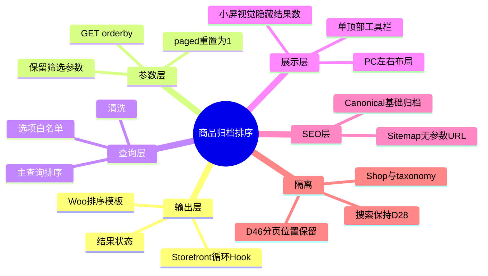
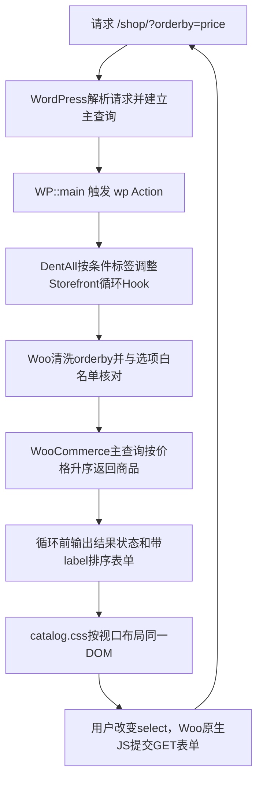

# Day45 WordPress实战：WooCommerce排序Hook与参数URL

## 相关笔记

- 学习索引：[[WordPress实战笔记索引]]
- 对应项目笔记：[[../Day45-商品排序与结果信息|Day45-商品排序与结果信息]]
- 前置学习笔记：[[Day44-CSS-Grid与WooCommerce每页数量解耦]]
- 后续学习笔记：[[Day46-WooCommerce分页链接与Canonical边界]]
- 同主题知识：[[Day28-原生控件与状态级联]]、[[Day43-WooCommerce归档主查询与条件资源]]

> [!check] 双向链接状态
> 本笔记链接Day45项目笔记；Day45项目笔记反向链接本笔记；前置Day44学习笔记已回链；[[WordPress实战笔记索引]]已登记本笔记。

## 学习目标与边界

完成本篇后，应能解释：

1. WooCommerce排序表单、URL参数、主查询和结果反馈怎样组成一条完整链路。
2. 为什么请求类型判断要等主查询完成，以及怎样只收敛Shop/taxonomy而不破坏商品搜索。
3. 为什么视觉隐藏结果数不等于从辅助技术树删除，怎样用同一DOM完成移动端与PC差异。
4. 排序GET为什么不使用Nonce，仍需要哪些清洗、白名单、转义与SEO验证。

本篇不展开分页实现、搜索页样式、筛选侧栏、每页数量、ProductCard内部、正式商品事实、正销量/正评分造数或非Local部署。

项目真实入口：

- `app/public/wp-content/themes/dentall/inc/storefront-hooks.php`
- `app/public/wp-content/themes/dentall/assets/css/catalog.css`
- `app/public/wp-content/plugins/woocommerce/includes/wc-template-functions.php`
- `app/public/wp-content/plugins/woocommerce/templates/loop/orderby.php`
- `app/public/wp-content/plugins/woocommerce/assets/js/frontend/woocommerce.js`

验证环境：Local WordPress 7.0.4、WooCommerce 11.0.0、Storefront 4.6.2、Yoast SEO 28.2、DentAll 0.22.0。

## 先建立整体模型

### 一句话模型

排序控件只是“用户选择并把白名单参数写进URL”的入口；WooCommerce主查询才真正改变商品顺序，结果状态负责反馈，Canonical负责避免参数页被当成新的主内容页。

### 记忆宫殿：图书馆目录台

把商品归档想成图书馆：

- 分类书架是基础归档URL。
- 目录台下拉框是排序表单。
- 填写“按价格升序”的查询单是`?orderby=price`。
- 馆员核对允许的排序方式后重新排出书目，是WooCommerce主查询。
- “显示2个结果”播报器是`role="status"`结果数。
- 馆藏正式入口牌仍指向基础书架，是Canonical基础URL。
- 一楼与二楼各摆一个目录台是重复工具栏；DentAll在Shop/taxonomy只保留顶部一台，底部空间留给下一日分页。

### 比喻对应回真实机制

| 记忆对象 | 真实技术对象 | 边界 |
|---|---|---|
| 书架入口 | `/shop/`或商品taxonomy基础URL | 不因排序变成新内容模型 |
| 查询单 | GET `orderby`及既有筛选参数 | 必须清洗、验证并允许复制链接 |
| 馆员白名单 | WooCommerce排序选项数组 | 非法值回退，不直接进入任意SQL |
| 重新排书目 | WooCommerce归档主查询 | CSS和下拉框本身不会改查询 |
| 播报器 | `.woocommerce-result-count[role=status]` | 可视觉隐藏，但不能无理由删除 |
| 正式入口牌 | Canonical | DentAll实测参数页回基础归档 |

> [!warning] 准确性检查
> Canonical是否回基础URL取决于当前WordPress、WooCommerce、SEO插件和站点配置，不能从GET表单本身推断。DentAll结论来自当前Local真实输出；换插件、版本或路由后必须重测。

## 思维导图



## 请求与生命周期调用链



关键顺序：

1. `WP::main()`先解析查询、处理404并注册全局状态。
2. `wp` Action触发时，`is_search()`、`is_shop()`和`is_product_taxonomy()`已经可用。
3. Storefront/WooCommerce已注册循环Hook，但模板尚未执行，所以此时移除/重挂有效。
4. WooCommerce读取`$_GET['orderby']`，先`wp_unslash()`与`wc_clean()`，再检查允许的选项键。
5. 模板输出GET表单、唯一label/id、`paged=1`和需要保留的查询字段。
6. Woo前端脚本监听`.woocommerce-ordering select.orderby`的`change`并提交最近表单。

## 核心概念卡

| 概念 | 准确定义 | DentAll真实例子 | 常见误区 | 验证 |
|---|---|---|---|---|
| Action Hook | 在指定生命周期执行回调，不返回替换值 | `wp`、循环前/后Hook | 只看优先级，不看请求阶段 | 读注册点与调用链 |
| 条件标签 | 基于已解析主请求判断页面类型 | `is_shop()`、`is_product_taxonomy()` | 在主查询前使用并相信结果 | 在`wp`或更晚验证 |
| GET排序 | 把可分享的读取条件编码进URL | `?orderby=price-desc` | 认为GET天然安全或需要写操作Nonce | 清洗＋白名单＋只读语义 |
| 参数保留 | 提交排序时保留其他有效查询条件 | `min_price`、`max_price`隐藏字段 | 新表单提交后丢掉筛选 | 查隐藏字段与提交URL |
| 结果状态 | 向用户/辅助技术说明当前结果数量 | `role="status"` | 小屏不显示就直接`display:none` | DOM、可访问树与Computed |
| Canonical | 指定参数页面首选索引URL | 排序URL回`/shop/` | 把Canonical当重定向 | 查HTML输出与状态码 |
| Hook去重 | 移除重复输出而保留必要生命周期位置 | 底部去排序/结果，留分页 | 删除整个after-loop wrapper或分页 | Hook优先级模拟＋DOM |

## 项目实战代码

> [!important] 代码真实性
> 以下片段来自Day45当前仓库，只保留理解职责所需的最小范围；行号以后续编辑器显示为准。

### 片段一：等主查询完成后收敛Hook

```php
function dentall_enable_catalog_ordering_labels() {
	if ( ! function_exists( 'woocommerce_catalog_ordering' ) ) {
		return;
	}

	remove_action( 'woocommerce_before_shop_loop', 'woocommerce_catalog_ordering', 10 );
	remove_action( 'woocommerce_after_shop_loop', 'woocommerce_catalog_ordering', 10 );
	add_action( 'woocommerce_before_shop_loop', 'dentall_catalog_ordering_with_label', 10 );

	if ( ! is_search() && ( is_shop() || is_product_taxonomy() ) ) {
		remove_action( 'woocommerce_after_shop_loop', 'woocommerce_result_count', 20 );
		return;
	}

	add_action( 'woocommerce_after_shop_loop', 'dentall_catalog_ordering_with_label', 10 );
}
add_action( 'wp', 'dentall_enable_catalog_ordering_labels' );
```

逐段理解：

- 函数存在检查让WooCommerce未加载时安全退出。
- 先移除父主题/插件既有无标签排序，再重挂项目已有带可见标签回调。
- Shop/taxonomy只移除循环后的结果数；函数返回意味着不重挂底部排序。
- 没有移除`woocommerce_pagination`，所以D46分页位置仍在。
- 显式`! is_search()`保护商品搜索，因为条件标签与Woo循环场景可能交叉。

### 片段二：让WooCommerce继续拥有表单

DentAll回调只调用：

```php
woocommerce_catalog_ordering(
	array(
		'useLabel' => true,
	)
);
```

WooCommerce 11.0.0随后负责：

- 输出Default、Popularity、Average rating、Latest、Price low-to-high、Price high-to-low六个当前可用选项。
- 用`wp_unique_id()`产生唯一select ID，并输出对应`label for`。
- 输出`method="get"`、`paged=1`，用`wc_query_string_form_fields()`保留未排除的GET字段。
- 对选项值/名称、隐藏字段名和值按HTML上下文转义。
- 读取时清洗`orderby`并与允许选项键比较；非法值回退到第一个有效选项。

项目没有复制`templates/loop/orderby.php`，因此Woo升级时不承担一份额外模板同步债。

### 片段三：同一结果状态的响应式呈现

```css
.woocommerce-products-header + .storefront-sorting > .woocommerce-result-count {
	position: absolute;
	width: 1px;
	height: 1px;
	margin: -1px;
	overflow: hidden;
	clip: rect(0 0 0 0);
	clip-path: inset(50%);
	white-space: nowrap;
}

@media (min-width: 75rem) {
	.woocommerce-products-header + .storefront-sorting > .woocommerce-result-count {
		position: static;
		order: -1;
		width: auto;
		height: auto;
		margin: 0;
		margin-inline-end: auto;
		overflow: visible;
		clip: auto;
		clip-path: none;
		white-space: normal;
	}
}
```

小屏规则是“视觉隐藏”，不是`display:none`；PC断点必须逐项恢复position、尺寸、margin、overflow、clip和white-space，否则看似恢复的文本仍可能只有1px或被裁掉。

## 职责边界

| 层级 | 负责什么 | 不负责什么 |
|---|---|---|
| WordPress Core | 请求解析、主查询生命周期、条件标签与Hook系统 | 不修改核心文件 |
| WooCommerce | 排序选项、GET表单、清洗白名单、主查询、结果数与分页 | 不由子主题复制其完整模板 |
| Storefront | 在循环前后注册排序、结果与分页输出位置 | 不直接修改父主题文件 |
| DentAll子主题 | 调整Hook组合、请求作用域和品牌响应式呈现 | 不建立第二查询或写交易数据 |
| Yoast/SEO输出链 | 当前环境生成Canonical、robots等 | 不从视觉CSS推断SEO结果 |
| 数据库 | 提供商品价格、销量、评分和配置 | 不为截图擅自造订单/评分 |
| 浏览器 | 原生select交互、表单提交、CSS计算与可访问状态 | 不决定服务器端商品顺序 |

## Hook、参数与模板机制详解

| 项目 | 当前实现 |
|---|---|
| 入口Action | `wp` |
| 循环前输出 | DentAll带label排序优先级10；Woo结果数优先级20 |
| 循环后输出 | Shop/taxonomy只保留Woo分页优先级30；搜索保留D28排序/结果 |
| 表单方式 | GET |
| 主要参数 | `orderby`；另有`paged=1`与既有查询字段 |
| 输入处理 | `wp_unslash()`＋`wc_clean()`＋选项键白名单 |
| 输出处理 | Woo模板按属性、文本、隐藏值上下文转义 |
| 自动提交 | Woo已有`woocommerce.js`监听select change |
| 空态 | `woocommerce_products_will_display()`为假时排序/结果函数直接返回 |
| 移除方式 | 恢复原Hook注册、删除D45 CSS段并退回0.21.0；保留D43/D44 |

## 安全、数据、SEO与缓存

### 为什么这里没有Capability与Nonce

排序是公开目录的读取请求，任何访客都可以改变查看顺序；它不修改用户账户、商品、订单、库存或站点配置。因此不需要登录Capability，也不应把Nonce放进可分享、可缓存的公共排序URL。

这不等于“GET不需要安全处理”。真实安全边界是：

- 输入先去斜杠、清洗，再与允许的排序键白名单比较。
- 查询由WooCommerce公开机制生成，不把原始参数拼进SQL。
- 输出选项、ID、文本和隐藏字段按HTML上下文转义。
- 非法值安全回退，不能触发任意排序表达式。

### 数据与SEO

- 排序改变本次读取顺序，不写数据库。
- `paged=1`避免用户在后页切换排序后落在可能不存在的页码。
- 既有`min_price/max_price`等参数随表单保留，避免排序动作无意清空筛选状态。
- DentAll当前排序参数Canonical回基础Shop/taxonomy，Sitemap没有参数URL；这是实际输出证据，不是GET的天然属性。
- 没有变更Title、robots、Schema、slug、状态码、内部链接或每页数量。

### 缓存

排序参数会产生不同响应内容，缓存层必须正确区分或按既定策略处理查询字符串。Day45只把主题静态资源版本升至0.22.0；Local未验证Staging/Production页面缓存、CDN和参数缓存规则，因此不能宣称生产缓存已安全。

## 真实验证证据

- Shop仅1个排序表单、1个结果状态；6选项、唯一label/id、GET、`paged=1`正确。
- 当前Simple为24.99、Variable为39.99；`price`得到`[44,46]`，`price-desc`得到`[46,44]`。
- 非法排序安全回退默认顺序，无PHP错误。
- 五宽320/390/768/1024/1440均无横向溢出，select高44px；Grid保持2/2/3/4列。
- 小于1200px结果数为1×1视觉裁剪但DOM/文本/`role=status`保留；1440恢复可见并位于左侧。
- 空taxonomy不输出排序/结果；商品搜索保留D28上下输出且不加载`catalog.css`。
- Shop与taxonomy参数页Canonical回基础归档；Sitemap无`orderby=`。
- 销量、评分均为0，因此Popularity/Rating只验证安全执行与选项存在，不能证明有区分度的真实顺序。

## 动手练习

### 练习一：只读追踪一个排序请求

- 打开`/shop/?orderby=price-desc`。
- 在Network确认文档请求是GET；在Elements确认select选中`price-desc`、label/id唯一、`paged=1`存在。
- 对照商品价格顺序和Canonical基础URL。
- 禁止为了制造顺序修改商品价格或订单数据。

### 练习二：DevTools安全微调

- 在320px临时把排序select的`max-width`取消，观察是否产生溢出。
- 在1440px临时删除结果数的`clip-path:none`或`width:auto`，观察恢复不完整的表现。
- 判断应改`catalog.css`局部规则而不是全局控件Token；关闭DevTools临时改动后回源码复测五宽。

### 练习三：Hook故障推演

症状：Shop只有顶部工具栏，但商品搜索也只剩顶部一组。

排查顺序：

1. 确认Hook调整回调运行在哪个生命周期。
2. 记录`is_search()`、`is_shop()`、`is_product_taxonomy()`真实组合。
3. 比较循环前后Hook回调和优先级。
4. 用真实搜索URL验证CSS是否隔离。

最小修复应是收紧请求条件，不是为搜索复制模板或再写一套查询。

## 常见误区与排错顺序

| 现象 | 常见原因 | 第一项检查 | 最小修复方向 |
|---|---|---|---|
| 改select后商品顺序不变 | 表单未提交或参数被缓存吞掉 | Network URL与选中值 | 先查原生脚本/缓存，不重写查询 |
| 切换排序后筛选丢失 | 隐藏查询字段未保留 | 表单hidden inputs | 复用Woo模板字段机制 |
| 非法参数产生异常 | 绕过选项白名单自写SQL/order | 输入处理与查询Filter | 回到Woo公开排序API |
| 手机看不见结果数且读屏也无状态 | 使用`display:none`或删除DOM | DOM、role与可访问树 | 视觉隐藏并保留状态 |
| PC结果数仍只有1px | 恢复属性不完整 | Computed width/clip/position | 成组恢复视觉隐藏属性 |
| 商品搜索工具栏被误删 | 条件标签交叉或Hook过早 | 生命周期＋`is_search()` | 在`wp`后显式排除搜索 |
| 参数页进入Sitemap | SEO/生成器策略变化 | Sitemap和Canonical实际输出 | 独立评估索引/缓存策略 |
| 价格排序通过就宣称Popularity通过 | 测试数据无销量/评分差异 | 真实数据基线 | 明确证据边界，不造数据 |

## 掌握标准

- [x] 能从`wp` Action讲到循环Hook、Woo模板、GET提交和主查询。
- [x] 能解释`useLabel`、唯一ID、`paged=1`和查询字段保留。
- [x] 能解释为什么公共只读GET没有Capability/Nonce但仍要清洗白名单。
- [x] 能区分视觉隐藏、DOM保留与PC属性恢复。
- [x] 能说明Shop/taxonomy与商品搜索为什么需要显式隔离。
- [x] 能用顺序、URL、Canonical和空态四类证据验收排序。

当前掌握度：初识，待独立费曼复述后再提升。

## 费曼测试题（7道）

1. 不使用术语，怎样解释“下拉框不是排序本身”？
2. 为什么`after_setup_theme`太早判断Shop/搜索，而`wp`阶段更可靠？
3. 从`?orderby=price-desc`开始，按顺序讲出清洗、白名单、查询、模板和反馈。
4. 为什么公共GET排序不需要Nonce；缺少Nonce不等于缺少哪些安全步骤？
5. `paged=1`和保留`min_price/max_price`分别防止什么用户体验错误？
6. 小屏结果数不占视觉空间时，为什么还要保留`role="status"`？
7. 若Popularity顺序看不出差异，你能证明什么、不能证明什么，怎样避免越权造证据？

### 我的费曼答案与纠正

尚未进行首次闭卷自测。完成后按“通过/含糊/答错”记录，并把生命周期、GET安全或SEO证据方面的缺口回链到对应章节。

### 自测评分

总分：尚未评分 / 14；存在0分题时不提升掌握度。

## 间隔复习记录

| 复习节点 | 计划日期 | 完成 | 暴露的问题 | 修正位置 |
|---|---|---|---|---|
| D+1 | 2026-09-03 | [ ] | 复习后记录 | 本篇对应章节 |
| D+3 | 2026-09-05 | [ ] | 复习后记录 | 本篇对应章节 |
| D+7 | 2026-09-09 | [ ] | 复习后记录 | 本篇对应章节 |
| D+14 | 2026-09-16 | [ ] | 复习后记录 | 本篇对应章节 |

## 收尾总结

- 今天真正理解了：排序是URL、输入验证、主查询、输出状态和SEO共同组成的合同，不是一个下拉框样式。
- 最容易混淆的是：去掉重复工具栏与删除结果反馈/分页位置不是同一件事。
- 下次遇到类似问题，先画真实请求生命周期和Hook表，再检查参数白名单、查询顺序、DOM数量、可访问状态与Canonical，最后才调CSS。
- 下一篇直接相关学习笔记：[[Day46-WooCommerce分页链接与Canonical边界]]。

## 后续如何向AI高效提问

可复制提示词：

```text
这是一个WooCommerce商品归档排序问题。请先区分URL参数、输入白名单、主查询、循环Hook、可访问结果状态和Canonical，不建议复制核心模板或新建WP_Query。

环境：[WordPress/WooCommerce/父子主题/SEO插件版本]
页面：[Shop、taxonomy、搜索]
参数：[orderby及需保留的筛选参数]
Hook：[循环前后回调和优先级]
实际：[表单数量、选中值、商品顺序、role=status、Canonical]
视口：[320/390/768/1024/1440]
边界：[不写商品/订单/销量，不改每页数量/分页/搜索]

请输出：事实与推断、生命周期问题、最小Hook/CSS修复、URL与SEO验证、空态/搜索回归和局部回滚。
```

> [!warning] AI验证边界
> AI不能从下拉选项存在推断查询顺序正确，也不能从价格排序外推销量/评分排序。Hook注册、当前Woo源码、真实数据差异、浏览器URL和Canonical必须交叉验证。

## 变种应用到其他项目

| 场景 | 保持不变的原则 | 可能变化的机制 | 必须重查 | 最小验证 |
|---|---|---|---|---|
| 另一个Storefront子主题 | 复用公开Hook和原生表单 | Hook优先级、父主题wrapper | 版本与第三方Filter | Shop/taxonomy/search矩阵 |
| 其他经典WordPress主题 | 参数、查询、反馈分层 | 模板位置和主题Action | Woo兼容声明与覆盖 | GET、顺序、空态、Canonical |
| WordPress区块主题 | 公共排序仍需白名单与状态 | Product Collection Block/Interactivity API | 当前Woo Blocks版本 | 编辑器与前台真实交互 |
| Headless WooCommerce | URL状态和服务端白名单不变 | REST/GraphQL与客户端路由 | 缓存键、Canonical所有权 | API顺序＋客户端URL＋SSR SEO |
| Shopify或其他平台 | 集合排序、URL、反馈和索引职责仍分离 | Collection sort、Liquid/JSON、Section状态，待验证 | 官方参数、Canonical和主题发布模型 | 开发店代表集合＋官方资料，待验证 |

## 可复用核心思想

### 跨平台不变量

可维护的列表排序必须同时回答五个问题：用户选了什么、URL如何表达、服务器允许什么、结果如何反馈、搜索引擎把哪个URL视为主版本。只修其中一个表象，常会造成筛选丢失、重复索引、不可访问或查询被重写。

### WordPress/WooCommerce当前实现

DentAll利用`wp`阶段可靠条件标签调整Storefront循环Hook，继续让WooCommerce拥有`orderby`清洗/白名单、GET模板、自动提交和主查询；子主题只决定Shop/taxonomy输出一组工具栏及其Mobile First呈现。结果状态在小屏视觉隐藏但仍留在DOM，底部分页Hook完整保留。

### Shopify或其他平台的对应机制

Shopify或其他平台也会有集合排序键、URL状态、主题控件、服务端/平台查询、可访问反馈与Canonical，但具体参数名、Liquid/JSON模板、Section状态、缓存和索引策略在DentAll尚未验证，均为“待验证”。可以迁移的是五问模型、白名单、状态保留与真实URL证据，不是WooCommerce Hook或类名。
