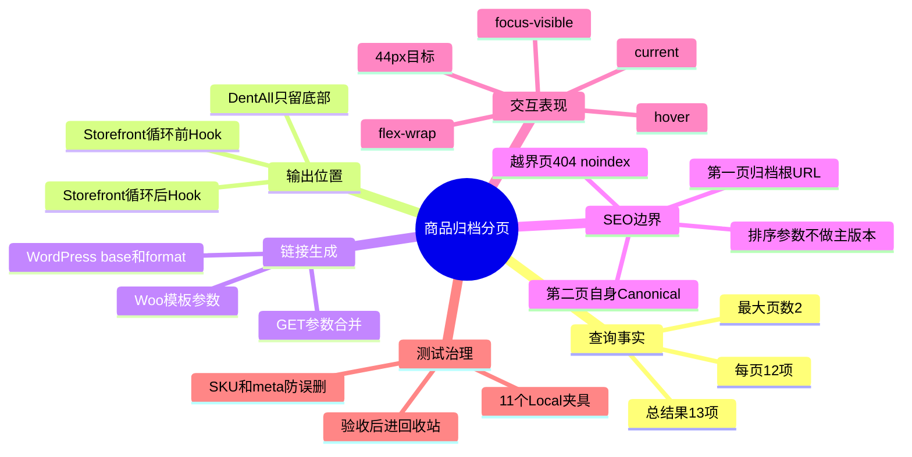
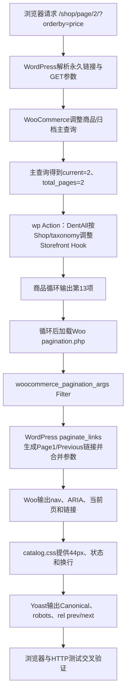

# Day46 WordPress实战：WooCommerce分页链接与Canonical边界

## 相关笔记

- 学习索引：[[WordPress实战笔记索引]]
- 对应项目笔记：[[../Day46-商品归档分页与URL归一化|Day46-商品归档分页与URL归一化]]
- 前置学习笔记：[[Day45-WooCommerce排序Hook与参数URL]]
- 前置项目笔记：[[../Day45-商品排序与结果信息]]
- URL与SEO事实：[[../../URL_SEO_MAP|URL与SEO映射]]
- 后续学习笔记：[[Day47-WooCommerce商品搜索请求与模板复用]]

## 今日学习成果

- [x] 我能解释主查询、Woo分页模板、WordPress `paginate_links()`、Storefront Hook和Yoast输出各自负责什么。
- [x] 我能从第二页Previous链接追到`base`/`format`，解释为什么错误组合会生成可避免的`/page/1/`跳转。
- [x] 我能在Local用真实12/1两页、参数URL、404、五宽与可逆TEST数据验证分页，并在验收后恢复发布基线。

## 真实项目场景

### 今天解决了什么问题

DentAll的WooCommerce配置一直是3列×4行，即每页12项。D43～D45只有2个发布商品，因此Storefront在循环前后注册的分页不会输出，页面看起来没有问题。Day46用11个临时商品把总数提高到13后，隐藏结构才显现：同一页会出现上下两组分页，第二页的Page 1链接还会先进入`/shop/page/1/`再301到`/shop/`。今天的核心不是“画几个蓝色按钮”，而是让查询、Hook、链接、SEO和清理边界成为一个可验证合同。

### 学习范围

- 本篇掌握：经典WooCommerce商品归档分页、Storefront循环Hook、`woocommerce_pagination_args`、`paginate_links()`、第一页归一化、参数保持、Canonical/robots/404和可逆夹具。
- 本篇不展开：D47搜索页正式样式、AJAX/无限滚动、筛选插件、Block Product Collection、真实Production缓存和抓取日志。
- 项目真实入口：`app/public/wp-content/themes/dentall/inc/storefront-hooks.php`、`assets/css/catalog.css`、Woo模板`templates/loop/pagination.php`和WordPress核心`wp-includes/general-template.php`。
- 验证版本与环境：仅Local；WordPress 7.0.4、WooCommerce 11.0.0、Storefront 4.6.2、Yoast 28.2、PHP 8.2.29、DentAll 0.23.0。

## 先建立整体模型

### 一句话模型

主查询先决定“有多少页”，主题和WooCommerce决定“在哪里输出”，WordPress决定“每个链接长什么样”，SEO层再声明“哪一个URL是主版本”；任何一层错误都会让表面可点击的分页产生重复或断路。

### 记忆宫殿：火车站换乘大厅

把商品归档想成火车站：

- 商品主查询是列车编组表，决定每趟装12件货、总共几趟。
- Storefront Hook是站内候车区，决定顶部和底部各摆不摆导向牌。
- WooCommerce分页模板是统一制式的牌架，读取总页数和当前页。
- WordPress `paginate_links()`是制牌员，根据站点永久链接规则印出第1、2、3页地址。
- `orderby`等GET参数是旅客随身的换乘条件，翻页时不能丢。
- Canonical是总调度公布的官方班次入口，不是把旅客实际送走的重定向。
- 404是“没有这趟车”的真实响应，不能伪装成空白200。
- TEST商品是临时加挂的试验车厢，验收后回到可恢复的侧线，而不是混入正式货运。

### 比喻对应回真实机制

| 记忆对象 | 真实技术对象 | 不能混淆的边界 |
|---|---|---|
| 列车编组表 | WooCommerce主查询、`posts_per_page=12`、`max_num_pages` | CSS列数不会改变每页查询数量 |
| 候车区 | `woocommerce_before_shop_loop` / `woocommerce_after_shop_loop` | Hook位置不生成链接内容 |
| 牌架 | `templates/loop/pagination.php` | 模板只组织参数和导航容器，不决定商品数据 |
| 制牌员 | WordPress `paginate_links()` | `base`与`format`组合错误时也会忠实生成错误形式 |
| 换乘条件 | `orderby`等查询字符串 | 参数保留不等于参数页应成为Canonical |
| 官方班次入口 | Canonical | Canonical不是301，也不改变浏览器当前URL |
| 不存在班次 | 真实HTTP 404＋`noindex` | 空分类是有效200内容，不等于越界页404 |
| 临时车厢 | 有明确ID/SKU/meta的Local TEST商品 | 测试事实不能冻结为正式业务内容 |

> [!warning] 准确性检查
> WooCommerce、WordPress和SEO插件的具体输出会随版本、主题、永久链接和插件Filter变化。这里的Page 2、Canonical、robots和301结论来自DentAll当前Local实测，不能仅凭比喻或函数名外推。

## 思维导图



最重要的主干是：先证明服务器端页数与URL正确，再决定Hook和CSS；不能从视觉按钮倒推查询或SEO已经正确。

## 请求与生命周期调用链



- 触发条件：非搜索的Shop或商品taxonomy，且总页数大于1。
- 加载入口：WordPress主请求完成后触发`wp`，随后WooCommerce归档模板执行循环Hook。
- 输入数据：主查询总结果/当前页/总页数、当前永久链接、GET参数和当前主题Hook注册。
- 输出副作用：只改变前台分页Hook组合、参数数组和CSS；不写商品或查询配置。
- 可观察证据：DOM中分页数量、链接href、HTTP状态、Canonical/robots/rel、Computed尺寸和数据库商品状态。

## 核心概念卡

| 概念 | 准确定义 | DentAll真实例子 | 常见误区 | 如何验证 |
|---|---|---|---|---|
| `max_num_pages` | 主查询按总结果和每页数量计算的最大页数 | 13项÷12项得到2页 | 认为4列视觉等于16项/页 | 查Woo配置、结果数和第二页数量 |
| Pagination Hook | 父主题/插件选择分页模板执行位置的Action | Storefront在循环前后各注册一次 | 以为隐藏CSS就是移除重复语义 | 查Hook回调与DOM nav数量 |
| `base` | `paginate_links()`构造链接时的URL骨架 | WordPress默认归档根URL加`%_%` | 直接把`/page/%#%/`当成通用base | 比较Page 1实际href与301 |
| `format` | 替换`%_%`时使用的分页部分 | `page/%#%/`或Plain的`?paged=%#%` | 只验证Pretty Permalink | 用核心算法验证Plain边界 |
| Page 1归一化 | 分页内部链接直接回归档根URL | Page 2 Previous为`/shop/` | 认为服务器301存在就无需修内链 | 读href并做不跟随跳转HTTP检查 |
| Canonical | 页面声明的首选索引URL | 排序后的Page 2仍Canonical到无参数Page 2 | 把Canonical当浏览器重定向 | 查HTML link与HTTP状态 |
| 空态/越界 | 有效集合0项与不存在页码是两种状态 | 空taxonomy 200；`/shop/page/3/` 404 | 所有“没有商品”都返回200 | 比较body class、robots、Canonical和状态码 |

## 项目实战代码

> [!important] 代码真实性
> 以下片段来自DentAll 0.23.0当前运行文件，仅保留理解分页职责所需的最小范围。

### 涉及文件

- `app/public/wp-content/themes/dentall/inc/storefront-hooks.php`：归档Hook组合与分页参数作用域。
- `app/public/wp-content/themes/dentall/assets/css/catalog.css`：归档工具栏、分页和Grid展示。
- `app/public/wp-content/plugins/woocommerce/templates/loop/pagination.php`：WooCommerce 11.0.0分页模板参数入口，只读参考，未覆盖。
- `app/public/wp-includes/general-template.php`：WordPress 7.0.4 `paginate_links()`真实实现，只读参考，未修改。

### 从入口开始追踪

1. WordPress解析`/shop/page/2/`并建立商品归档主查询。
2. `wp` Action到来时，`is_shop()`、`is_product_taxonomy()`和`is_search()`已经可靠。
3. DentAll移除Storefront循环前的分页，但保留循环后的原生分页位置。
4. Woo模板读取Loop的`current_page`和`total_pages`；只有总页数大于1才输出。
5. `woocommerce_pagination_args`进入DentAll过滤器，调整窗口、名称并把base/format交回WordPress默认值。
6. `paginate_links()`根据当前永久链接结构生成链接，并合并当前URL中的有效GET参数。
7. Yoast独立输出Canonical、robots和`rel=prev/next`；浏览器CSS只负责表现。

### 关键代码片段一：请求作用域和页码参数

来源：`inc/storefront-hooks.php`

```php
function dentall_catalog_pagination_args( $args ) {
	if (
		! function_exists( 'is_shop' )
		|| ! function_exists( 'is_product_taxonomy' )
		|| is_search()
		|| ( ! is_shop() && ! is_product_taxonomy() )
	) {
		return $args;
	}

	$args['end_size']  = 1;
	$args['mid_size']  = 2;
	$args['prev_text'] = esc_html__( 'Previous', 'dentall' );
	$args['next_text'] = esc_html__( 'Next', 'dentall' );

	unset( $args['base'], $args['format'] );

	return $args;
}
```

| 代码 | 表面动作 | WordPress中的真实作用 | 为什么这样写 |
|---|---|---|---|
| 显式排除`is_search()` | 搜索直接返回原参数 | 防止Shop条件交叉时误接D47范围 | 搜索当前有独立工具栏与SEO合同 |
| `end_size=1` | 首尾各保留1页 | 控制大页数下链接密度 | 防止窄屏无限延长 |
| `mid_size=2` | 当前页左右各保留2页 | 提供附近跳转上下文 | 比只留当前页更可导航 |
| `esc_html__()` | 翻译并转义文字 | 文案不散落硬编码且适合HTML文本上下文 | 当前第一版英语，仍保留i18n边界 |
| `unset(base,format)` | 删除Woo模板传入的两个键 | `wp_parse_args()`恢复WordPress默认永久链接算法 | Page 1直达根URL，并避免复制Pretty/Plain规则 |

### 关键代码片段二：同一语义DOM的分页目标

来源：`assets/css/catalog.css`

```css
.site-main > ul.products + .storefront-sorting .woocommerce-pagination > ul.page-numbers {
	display: flex;
	flex-wrap: wrap;
	justify-content: center;
	gap: var(--dentall-space-4);
}

.site-main > ul.products + .storefront-sorting .woocommerce-pagination > ul.page-numbers > li > :where(a, span) {
	display: inline-flex;
	align-items: center;
	justify-content: center;
	min-width: 2.75rem;
	min-height: 2.75rem;
}
```

选择器刻意锚定商品循环后的Storefront wrapper，避免影响顶部工具栏、商品搜索和站点其他分页。同一`nav > ul > li`在所有视口存在，CSS只渐进改变可用空间，不复制手机/平板/PC DOM。

### 运行证据

- 页面：`/shop/`、`/shop/page/2/`、排序参数第二页、正常/空taxonomy、搜索和越界Page 3。
- 正常：13项形成12/1；Shop/taxonomy均只有一个底部分页；Page 2 Canonical自身。
- 参数：`orderby=price`随Previous/Page 1保留；切换排序自动回Page 1。
- 失败/边界：Page 3真实HTTP 404、`noindex, follow`且无Canonical；空taxonomy为有效200空态且无分页。
- 证据能证明：当前Local版本、数据规模和永久链接配置下的运行合同。
- 证据不能证明：132项真实DOM、多行hover截图、非Local缓存、未来主题/插件版本或真实搜索D47方案。

## 职责边界

| 层级 | 本主题中负责什么 | 不应该负责什么 |
|---|---|---|
| WordPress Core | 请求解析、`get_pagenum_link()`、`paginate_links()`、404和回收站API | 不修改核心文件，不让主题复制全部永久链接算法 |
| WooCommerce | 商品归档主查询、Loop属性、分页模板、每页数量和参数Filter | 不由CSS决定查询总量，不直接读写订单内部表 |
| Storefront父主题 | 注册循环前后分页输出位置 | 不直接修改父主题文件 |
| DentAll子主题 | 选择唯一输出位置、限定请求范围、调整窗口与视觉状态 | 不创建第二商品查询，不承载跨主题交易规则 |
| Yoast/SEO链 | 当前环境输出Canonical、robots和rel关系 | 不从CSS或分页可点击性推断SEO正确 |
| 数据库与商品 | 为真实页数提供可查询对象 | TEST对象不升级为正式内容，不永久删除越权对象 |
| 浏览器 | 展示DOM、Computed、Focus、URL导航 | 不替代服务器HTTP状态和数据库事实 |

## Hook、API或模板机制详解

| 项目 | 说明 |
|---|---|
| 机制类型 | Action＋Filter＋Woo Template＋WordPress URL API |
| Action入口 | `wp`、`woocommerce_before_shop_loop`、`woocommerce_after_shop_loop` |
| Filter入口 | `woocommerce_pagination_args` |
| 当前注册优先级 | DentAll分页参数默认10；Storefront顶部分页回调为循环前30 |
| Filter输入 | Woo传给`paginate_links()`的参数数组 |
| 必须返回 | 修改后的参数数组；非目标请求原样返回 |
| 副作用 | 只影响当前前台分页输出，不写数据库 |
| 影响范围 | 登录/匿名均适用的Shop与商品taxonomy；商品搜索排除 |
| 移除方式 | 删除DentAll Filter与顶部`remove_action()`，CSS退回D45基线并恢复主题版本；无需数据库迁移 |

### 为什么`unset`比手写永久链接规则更小

WordPress核心已经处理：

- Pretty与Plain Permalink。
- 是否使用`index.php`。
- 是否保留结尾斜杠。
- Page 1省略分页片段。
- 当前查询字符串解析与合并。

如果子主题自己拼`/page/%#%/`，就必须重新承担全部分支和站点在子目录、无尾斜杠、Plain Permalink时的正确性。删除Woo传入的特定base/format键，让`wp_parse_args()`恢复核心默认，反而是更小、更可维护的实现。

## 安全、数据与站点影响

| 检查面 | 本次结论 | 证据或待验证项 |
|---|---|---|
| 输入清洗与验证 | 不新增自定义用户输入；排序参数仍由Woo原生清洗/白名单处理 | D45已有源码与动态证据 |
| Capability | 公共读取分页不需要登录能力；创建/清理夹具由受控Local CLI执行 | 不把公共GET误加管理员权限 |
| Nonce | 公共读取分页不适用；Nonce不能替代写操作身份边界 | 未新增前台写操作 |
| 输出转义 | Previous/Next用`esc_html__()`；链接由WordPress核心转义 | 当前代码与DOM验证 |
| 数据库写入 | 临时创建11个Simple商品并最终移入回收站 | Woo CRUD创建；ID/SKU/meta全核对后`wp_trash_post()` |
| URL与SEO | Page 1根URL、Page 2自身Canonical、参数保持、越界404 | Local通过；非Local待部署前复核 |
| 缓存 | 仅静态主题版本升至0.23.0 | 未验证CDN/生产查询串缓存 |
| 支付、物流与订单 | 无影响 | 没有创建订单、支付、运费或库存交易 |
| 部署与回滚 | 仅Local、未提交Git、未部署 | 回滚为3个运行文件退回D45；Trash商品当前可恢复 |

## 动手练习

### 练习一：只读观察一条Page 1链接

- 目标：区分“服务器最终301正确”和“内部链接一开始就正确”。
- 操作：打开Page 2，读取Previous/Page 1的`href`；再用不跟随重定向的HTTP请求检查旧`/page/1/`。
- 预期：分页href直接是归档根URL；手工访问`/page/1/`仍301到根URL。
- 实际证据：Shop、taxonomy及`orderby=price`均直达目标；旧路径301归一化。

### 练习二：Local最小参数改动

- 改动：临时改变`mid_size`，用只读合成总页数11查看链接窗口；不要创建132个商品。
- 风险边界：只改Local参数；不改主查询、永久链接或Production。
- 验证：第1、6、11页分别比较首尾、邻近窗口和省略号。
- 回滚：恢复`mid_size=2`并重跑Filter输出。

### 练习三：故障推演

- 假设症状：Page 2能返回，但Previous先进入`/page/1/`再301。
- 可能原因：传给`paginate_links()`的`base`没有`%_%`占位，而`format`为空。
- 第一项检查：查看最终href和Woo模板传入的base/format，不先改Canonical或服务器Rewrite。
- 为什么先查它：症状发生在HTML链接生成层；Canonical与Rewrite只说明主版本和兜底归一化，不能修正生成源头。

## 常见误区与排错顺序

| 现象或误区 | 可能原因 | 推荐检查顺序 | 最小验证方法 |
|---|---|---|---|
| 只有2个商品时认为分页完成 | 总页数为1，分页模板早退 | 1. 每页数；2. 总结果；3. DOM | 用可逆夹具形成12/1 |
| 上下两组分页 | Storefront在循环前后都注册回调 | 1. Hook表；2. 回调优先级；3. DOM数量 | 只移除目标位置，不用CSS隐藏 |
| Page 1多一次301 | base/format组合绕过核心Page 1分支 | 1. href；2. Filter参数；3. HTTP | 恢复核心默认base/format |
| 排序翻页后丢参数 | 自拼URL或错误`add_args` | 1. 当前URL；2. href；3.核心参数合并 | `orderby=price`实页翻页 |
| 排序Page 2 Canonical回Page 1 | SEO插件/自定义Canonical策略错误 | 1. 当前页；2. Canonical；3. rel | 比较无参数同页与根URL |
| 空分类返回404 | 把有效空集合误判为不存在路由 | 1. taxonomy是否存在；2. HTTP；3.空态 | 与越界Page 3对照 |
| 当前页只用颜色表示 | 缺少`aria-current`、形状或文本状态 | 1. DOM；2.可访问树；3.Computed | 检查`aria-current=page`与实心背景 |
| 窄屏分页溢出 | 固定单行或链接密度过高 | 1.页码窗口；2.flex-wrap；3.目标尺寸 | 320几何＋11页合成窗口 |

## 掌握标准

- [x] 能在2分钟内讲清“查询—Hook—模板—链接—SEO—CSS”主链。
- [x] 能指出项目真实入口和父主题/核心只读源码位置。
- [x] 能区分Page 1根URL、`/page/1/`兜底301和Canonical。
- [x] 能解释空taxonomy 200与越界页404的差异。
- [x] 能说明为什么公共分页没有Nonce，但测试数据写入必须有精确范围和清理闸门。
- [x] 能在Local重演12/1、参数保持、Focus和可逆清理。

当前掌握度：初识；真实实现与验收已完成，待独立闭卷费曼复述后再提升为“能解释”。

## 费曼测试题（7道）

1. 不使用专业术语，你怎样解释“页面能点到第一页”仍不等于分页链接正确？
2. 火车站比喻中的编组表、候车区、牌架、制牌员和官方入口分别对应什么；比喻在哪里失效？
3. 从`/shop/page/2/?orderby=price`开始，按顺序讲出主查询、Hook、模板、Filter、核心链接生成与SEO输出。
4. 为什么Woo传入`/page/%#%/`式base会让Page 1变成`/page/1/`；`%_%`在核心算法中有什么作用？
5. 为什么公共分页不需要Nonce；为什么创建和清理TEST商品仍必须限制对象并可回滚？
6. 空分类和越界页都没有商品，为什么一个应是有效空态、另一个应是404？
7. 迁移到另一个经典主题、区块主题或Shopify时，哪些原则不变，哪些实现必须重新查证？

### 我的费曼答案与纠正

尚未进行首次闭卷自测。第一次复习时逐题标记“通过/含糊/答错”；若无法解释`base`/`format`、Page 1与Canonical的区别，回到“核心概念卡”和“为什么unset更小”两节修正，不只记录“看过”。

### 自测评分

总分：尚未评分 / 14；存在0分题时不提升掌握度。

## 间隔复习记录

| 复习节点 | 计划日期 | 完成 | 暴露的问题 | 修正位置 |
|---|---|---|---|---|
| D+1 | 2026-09-03 | [ ] | 复习后记录 | 本篇对应章节 |
| D+3 | 2026-09-05 | [ ] | 复习后记录 | 本篇对应章节 |
| D+7 | 2026-09-09 | [ ] | 复习后记录 | 本篇对应章节 |
| D+14 | 2026-09-16 | [ ] | 复习后记录 | 本篇对应章节 |

## 收尾总结

- 我今天真正理解了：分页正确性来自服务器查询、链接生成、SEO和交互的共同合同，CSS只是最后一层。
- 我仍然容易混淆：服务器会把`/page/1/` 301归一化，并不代表内部生成这个链接是最优结果。
- 下次遇到类似问题，我会先收集：总结果/每页数、Hook回调表、最终href和HTTP/Canonical，再调页码窗口与CSS。
- 下一篇直接相关学习笔记：[[Day47-WooCommerce商品搜索请求与模板复用]]。

## 后续如何向AI高效提问

### 提问公式

`真实版本与永久链接 + 主查询数量 + 当前/目标URL + Hook与分页参数 + Canonical/robots/状态码 + DOM/Computed证据 + 数据与部署边界`

### 可复制的分页排错提示词

```text
这是一个WordPress/WooCommerce商品归档分页问题。请先区分主查询、主题Hook、Woo模板、WordPress paginate_links、SEO插件和CSS，不要直接建议复制模板或写第二个WP_Query。

环境：[WordPress/WooCommerce/父子主题/SEO插件/PHP版本]
永久链接：[Pretty/Plain、尾斜杠、子目录情况]
页面：[Shop/taxonomy/search]
数据：[总结果、每页数、当前页、总页数]
实际链接：[Previous/Page1/Page2 href]
SEO证据：[HTTP状态、Canonical、robots、rel prev/next]
参数：[orderby/筛选参数是否保留]
前端证据：[nav数量、aria-current、44px、Focus、横溢出]
边界：[仅Local、不改主查询、不改核心、不永久删除TEST数据]

请输出：事实与推断、调用链、最可能根因、最小公开API修复、Pretty/Plain与参数回归矩阵、数据清理和回滚步骤。
```

> [!warning] AI验证边界
> AI生成的base/format字符串不能替代当前WordPress核心源码和实页href。不得在提示词中提交Cookie、密码、私钥、真实客户数据或支付密钥；测试商品也必须明确标记并登记清理范围。

## 变种应用到其他项目

| 新场景 | 保持不变的原则 | 可能变化的实现 | 必须重新确认 | 最小验证 |
|---|---|---|---|---|
| 另一个Storefront子主题 | 主查询、唯一导航、Page 1归一化、SEO与触控边界 | 已有插件Filter、主题版本和样式Token | 回调名/优先级、永久链接、SEO插件 | 12/1＋参数＋404矩阵 |
| 其他经典WordPress主题 | 不复制查询、链接与视觉职责分层 | 循环Hook和wrapper DOM | 主题Woo兼容层、分页输出位置 | Hook表＋实页href＋四宽 |
| WordPress区块主题 | Page 1、参数、Canonical和边界状态不变 | Query Pagination/Product Collection Block | 当前Woo Blocks与Interactivity API | 编辑器/前台、SSR URL和SEO |
| Headless WooCommerce | 服务端总页数、URL状态和SEO合同不变 | REST/GraphQL游标、客户端路由、SSR | API分页语义、缓存键、Canonical所有权 | API边界＋直接URL＋SSR HTML |
| Shopify或其他平台 | 集合分页、主URL、404、触控和测试清理不变 | Liquid `paginate`、Section、平台路由，待验证 | 官方限制、Canonical、主题发布流程 | 开发店代表集合＋官方资料，待验证 |

### 变种练习

选择“其他经典WordPress主题”，先不写代码：

1. 列出该主题在Woo循环前后注册的回调和优先级。
2. 证明它是否已有唯一分页，避免机械复制DentAll的`remove_action()`。
3. 记录当前Pretty/Plain、尾斜杠、SEO插件和参数URL。
4. 只在Local用可逆数据形成两页，比较Page 1/2/越界状态。
5. 最后才决定使用Hook、Filter、模板覆盖或零代码配置；选择最小可维护方案。

## 可复用核心思想

### 跨平台不变量

列表分页必须同时保持六个不变量：结果集合正确、页边界正确、状态参数不丢、第一页只有一个主入口、越界明确失败、交互在窄屏和键盘下可用。重定向和Canonical是兜底/索引信号，不能替代干净的内部链接。

### WordPress/WooCommerce当前实现

DentAll让WooCommerce拥有商品主查询和分页模板，让WordPress核心拥有永久链接算法，让Yoast拥有当前SEO输出；子主题通过`wp`阶段的Storefront Hook调整与`woocommerce_pagination_args`做最小组合。删除特定base/format键比复制核心分支更稳健；测试夹具通过Woo CRUD、唯一SKU/meta和可逆Trash形成证据链。

### Shopify或其他平台的对应机制

Shopify等平台也有集合查询、分页/游标、URL参数、Canonical、404和主题交互层，但具体Liquid对象、页码限制、Section刷新、缓存与Canonical行为在DentAll没有实测，均为待验证。迁移时保留六个不变量和可逆测试方法，重新查平台路由与主题扩展点，不能照搬WordPress Hook、`paged`或Woo DOM。
