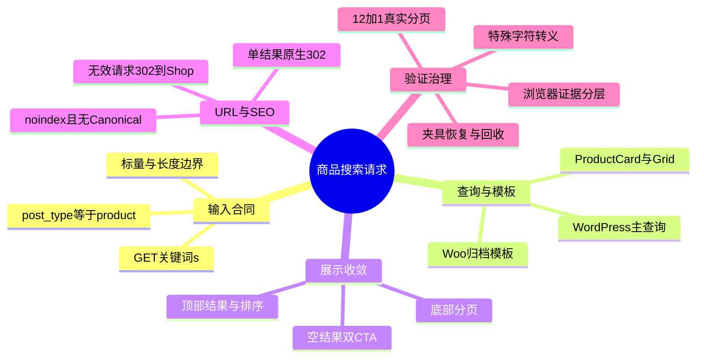
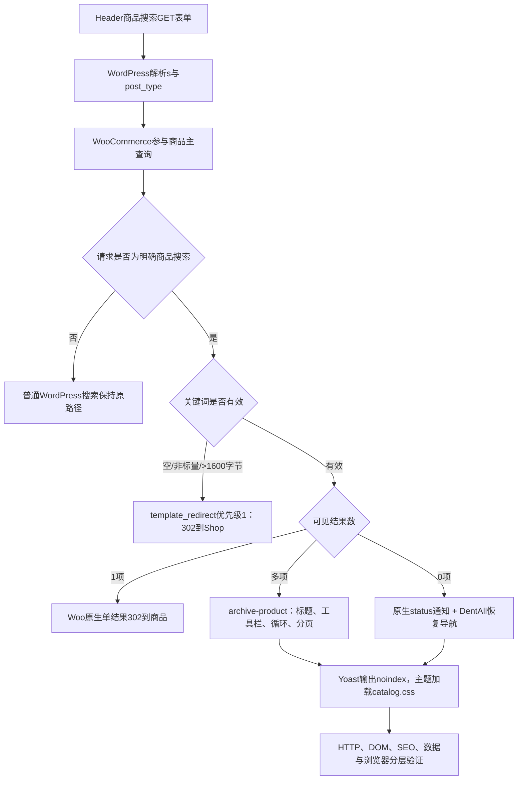

# Day47 WordPress实战：WooCommerce商品搜索请求与模板复用

## 相关笔记

- 学习索引：[[WordPress实战笔记索引]]
- 对应项目笔记：[[../Day47-商品搜索结果与边界状态|Day47-商品搜索结果与边界状态]]
- 前置学习笔记：[[Day46-WooCommerce分页链接与Canonical边界]]
- Header请求来源：[[Day33-单一导航DOM与购物车Fragment]]
- 前置项目笔记：[[../Day46-商品归档分页与URL归一化]]
- URL与SEO事实：[[../../URL_SEO_MAP|URL与SEO映射]]
- 后续学习笔记：[[Day48-WooCommerce分类描述与SEO模板边界]]

## 今日学习成果

- [x] 我能解释Header的GET表单、WordPress主查询、WooCommerce归档模板、Storefront Hook和Yoast各自负责哪一段搜索链路。
- [x] 我能沿`template_redirect`、`wp`、`wp_enqueue_scripts`和`woocommerce_no_products_found`追踪无效输入、结果工具栏、资源加载和空结果恢复入口。
- [x] 我能在Local用可逆商品夹具验证单/多/零结果、12/1分页、排序、SEO与数据清理，并区分HTTP/DOM、有结果页四宽实测和仍缺少的空结果浏览器证据。

## 真实项目场景

### 今天解决了什么问题

D33已经让Header输出可访问的WooCommerce商品搜索表单，但D43～D46刻意把搜索排除在商品归档样式和Hook之外。结果是同一个WooCommerce归档模板在搜索请求下仍有上下两组工具栏，不加载`catalog.css`；空关键词还可能退化成“显示全部商品”。Day47没有重写搜索引擎，而是先确认请求身份，再让商品搜索共享已验证的目录展示层，同时为无效输入与零结果建立不同的恢复路径。

### 学习范围

- 本篇掌握：商品搜索GET合同、主查询条件、生命周期时序、原生归档模板复用、单结果跳转、无效输入302、空结果Hook、排序分页参数、搜索SEO和可逆夹具。
- 本篇不展开：SKU/属性/分类搜索、模糊匹配、AJAX联想、外部搜索服务、筛选、分析埋点、查询前限流和Production缓存。
- 项目真实入口：`inc/setup.php`、`inc/storefront-hooks.php`、`assets/css/catalog.css`、WooCommerce `archive-product.php`与`loop/no-products-found.php`。
- 验证版本与环境：仅Local；WordPress 7.0.4、WooCommerce 11.0.0、Storefront 4.6.2、Yoast 28.2、PHP 8.2.29、DentAll 0.24.0。

## 先建立整体模型

### 一句话模型

搜索表单只负责把意图写进URL，主查询决定结果，Woo模板把结果变成稳定DOM，主题只在确认请求身份后调整展示和边界，SEO层最后决定这些URL是否应被索引。

### 记忆宫殿：医院分诊台

把商品搜索想成医院分诊：

- Header表单是挂号单，写明关键词和“商品科”。
- WordPress主查询是分诊系统，决定命中几条记录和多少页。
- `is_search()`、`is_post_type_archive( 'product' )`与`post_type=product`是三项身份核对，防止普通内容搜索走错科室。
- WooCommerce归档模板是同一间诊室，Shop、分类和商品搜索复用同一套检查设备。
- Storefront Hook是候诊区动线，决定结果数、排序和分页放在哪。
- `template_redirect`是入口处的导诊：空白或畸形挂号单暂时送去Shop，而有效单结果继续由Woo送到具体商品。
- Yoast robots是病历可见性规则：页面可以被访问，但搜索结果不进入公共索引。

### 比喻对应回真实机制

| 记忆对象 | 真实技术对象 | 不能混淆的边界 |
|---|---|---|
| 挂号单 | `method=get`，`s`与隐藏`post_type=product` | 表单只描述请求，不决定结果算法 |
| 分诊系统 | WordPress/WooCommerce主查询 | CSS列数不改变查询数量或相关性 |
| 三项身份核对 | 条件标签与严格`post_type`比较 | `is_search()`单独成立也可能是文章/Page搜索 |
| 诊室 | Woo `archive-product.php`及循环模板 | 复用模板不等于修改第三方模板 |
| 候诊动线 | Storefront/Woo Hook组合 | Hook位置不负责数据库搜索 |
| 导诊 | `template_redirect`上的302 | 302不是Canonical，也不是永久迁移 |
| 可见性规则 | Yoast `noindex, follow` | noindex不阻止用户访问或服务器查询 |

> [!warning] 准确性检查
> 比喻不能替代加载时序。条件标签只有在主查询建立后才可靠；`template_redirect`已经晚于主查询，所以它能改HTTP响应，却不能省掉前面已执行的查询。

## 思维导图



最重要的主干是：先证明请求和主查询身份，再复用原生模板；不能从页面长得像商品列表反推请求边界、跳转和SEO已经正确。

## 请求与生命周期调用链



- 触发条件：带有效`post_type=product`的WordPress搜索请求。
- 加载入口：Header GET提交后建立主查询；主题在`template_redirect`、`wp`与`wp_enqueue_scripts`阶段分别处理响应、Hook和资源。
- 执行顺序：主查询先建立；优先级1处理无效请求；Woo优先级10保留单结果跳转；模板阶段输出结果或空态。
- 输入数据：`$_GET['s']`、查询变量、可见商品结果数、排序与分页参数。
- 输出或副作用：可能产生302；否则只调整当前请求的Hook、CSS资源和空态HTML。无持久化写入。
- 可观察证据：HTTP状态与`X-Redirect-By`、`$wp_query`、DOM数量/链接、Head robots/Canonical、Sitemap和商品状态。

## 核心概念卡

| 概念 | 准确定义 | DentAll真实例子 | 常见误区 | 如何验证 |
|---|---|---|---|---|
| 商品搜索身份 | 搜索条件与商品归档条件同时成立，且`post_type`严格为字符串`product` | `?s=TEST&post_type=product` | 只看`is_shop()`或body class | 输出三个条件和普通搜索对照 |
| 有效零结果 | 请求本身合法，但主查询命中0项 | `NO-DAY47-MATCH`返回200空态 | 与空关键词混为一谈并全部跳转 | 对照HTTP、关键词与`found_posts` |
| 无效搜索 | 关键词缺失、仅含Unicode空白、非标量或超过约定字节边界 | `s[]=x`、NBSP和1601字节302 | 用404或Canonical处理输入错误 | 不跟随跳转检查状态与目标 |
| 单结果跳转 | Woo对唯一可见商品的原生导航优化 | `Fixed`跳到具体商品 | 自定义302覆盖Woo默认行为 | 检查目标和`X-Redirect-By` |
| Hook收敛 | 在父主题已注册回调后移除重复位置 | 顶部一组工具栏、底部一组分页 | 用CSS隐藏重复语义 | 查Action表与真实DOM数量 |
| 搜索SEO | 可访问页面明确不进入索引 | `noindex, follow`、无Canonical | 把搜索Canonical到Shop | 检查Head和Sitemap |

## 项目实战代码

> [!important] 代码真实性
> 以下片段来自DentAll 0.24.0当前源码，只省略与理解无关的后续跳转部分。

### 涉及文件

- `app/public/wp-content/themes/dentall/inc/setup.php`：识别目标请求并条件加载既有目录CSS。
- `app/public/wp-content/themes/dentall/inc/storefront-hooks.php`：无效输入302、工具栏/分页Hook和空态恢复导航。
- `app/public/wp-content/themes/dentall/assets/css/catalog.css`：共享归档布局、长词和空态CTA。
- `project-docs/tests/day47-product-search-audit.php`：CLI只读渲染真实Woo模板并解析DOM/SEO合同。

### 从入口开始追踪

1. 入口是Storefront/WooCommerce输出的`woocommerce-product-search` GET表单。
2. WordPress读取`s`和`post_type`建立主查询，Woo把商品搜索视为Product Archive。
3. `template_redirect`优先级1只拦截无效关键词；有效请求继续交给Woo原生单结果逻辑或归档模板。
4. `wp`阶段调整已注册Hook，`wp_enqueue_scripts`阶段条件加载CSS，Woo空结果Action追加恢复导航。
5. 移除D47代码后，无效搜索可能显示全部商品，搜索不加载目录CSS，工具栏恢复上下重复，空结果失去两个恢复链接。

### 关键代码片段

源文件`inc/storefront-hooks.php`，无效关键词判断：

```php
$raw_search_value = isset( $_GET['s'] ) ? $_GET['s'] : get_query_var( 's' );
$is_invalid       = ! is_string( $raw_search_value );

if ( ! $is_invalid ) {
	$search_value = wp_unslash( $raw_search_value );
	$is_blank      = '' === $search_value || 1 === preg_match( '/^[\p{Z}\s]*$/u', $search_value );
	$is_invalid    = $is_blank
		|| strlen( $raw_search_value ) > 1600
		|| strlen( $search_value ) > 1600;
}
```

| 代码 | 表面动作 | WordPress中的真实作用 | 为什么这样写 |
|---|---|---|---|
| `wp_unslash()` | 去除请求转义斜杠 | 得到用户实际提交的可读关键词 | WordPress请求数据可能被加斜杠 |
| `is_string()` | 拒绝数组 | 防止异常参数进入字符串验证与跳转判断 | URL可提交`s[]=x` |
| `preg_match( '/^[\p{Z}\s]*$/u', ... )` | 识别纯空白 | 同时覆盖ASCII空白、NBSP和全角空格 | `trim()`默认不能覆盖全部Unicode分隔符 |
| 两次`strlen()` | 比较加斜杠前后字节长度 | 对齐`WP_Query`实际1600字节保护并覆盖其他调用上下文 | 801个撇号加斜杠后会从801字节变成1602字节 |
| `wp_safe_redirect()` | 302到Shop | 校验目标主机并输出临时跳转 | 不把无效请求误写为永久迁移 |

### 运行证据

- 命令：WP-CLI `eval-file project-docs/tests/day47-product-search-audit.php`，以及不跟随跳转的本机HTTP请求。
- 正常结果：`TEST`在夹具阶段为13项/12+1页，最终基线为2项；排序与Header表单保留`s`、`post_type`。
- 失败/边界：空、ASCII/Unicode空白、数组、1601个ASCII字节和801个撇号均302；1600个ASCII字节与800个撇号均200；字面`%aa`和仅`<b></b>`保持合法非空；零结果保留原生状态并输出2个链接；普通搜索隔离。
- 证据能证明：当前Local版本、主题Hook、真实Woo模板、当前数据和SEO插件下的服务端合同。
- 证据不能证明：登录态真实空结果CTA最终四宽视觉、键盘Focus、Console与截图，匿名Coming Soon后的商城DOM、非Local缓存/CDN、未来Woo/Storefront/Yoast版本或搜索质量。有结果页四宽2/2/3/4列、0横溢出、44px和唯一工具栏已由真实浏览器补证。

## 职责边界

| 层级 | 本主题中负责什么 | 不应该负责什么 |
|---|---|---|
| WordPress Core | 解析GET、建立主查询、条件标签、请求生命周期和安全跳转API | 不修改核心文件 |
| WooCommerce | 商品搜索主查询、归档/空结果模板、单结果跳转、Shop URL与分页 | 不绕过CRUD/API或依赖内部表 |
| Storefront父主题 | Header搜索表单与循环Hook位置 | 不直接修改父主题文件 |
| DentAll子主题 | 精确作用域、展示Hook、条件CSS、空态恢复入口与输入边界 | 不承载外部搜索引擎或交易规则 |
| `dentall-core` | 本轮无职责 | 不为主题展示规则新增模块 |
| 数据库 | 提供商品与可见性事实；夹具只可逆恢复/回收 | 不把TEST SKU或名称当正式内容 |
| 浏览器 | 验证布局、Focus、溢出与Console | 不用外观推断HTTP、查询或SEO事实 |

## Hook、API与模板机制详解

| 机制 | 名称/入口 | 时序与输入 | 输出/副作用 | 影响范围 |
|---|---|---|---|---|
| Action | `template_redirect`优先级1 | 主查询后，读取已识别请求与GET关键词 | 无效商品搜索302 | 前台目标请求 |
| Action | `wp`默认优先级10 | 主查询后，父主题Hook已注册 | 移除重复分页/结果并保留顶部排序 | Shop、taxonomy、商品搜索 |
| Filter | `woocommerce_pagination_args` | Woo分页模板传入参数数组 | 返回页码窗口和WordPress默认base/format | 目标商品列表 |
| Action | `woocommerce_no_products_found`优先级20 | Woo先输出原生空通知 | 追加独立恢复`nav` | 仅商品搜索零结果 |
| Enqueue | `wp_enqueue_scripts`优先级45 | 条件标签可用 | 加载既有`catalog.css?ver=0.24.0` | Shop、taxonomy、商品搜索 |
| Template | Woo `archive-product.php` | 根据主查询循环或空态 | 输出H1、Breadcrumb、工具栏、Grid或空结果 | 不做模板覆盖 |

## 安全、数据与站点影响

| 检查面 | 本次结论 | 证据或待验证项 |
|---|---|---|
| 输入验证 | 标量、Unicode空白与加斜杠前后1600字节边界均检查 | 空/ASCII空白/NBSP/全角空格/数组、ASCII 1600/1601、撇号800/801、`%aa`与HTML词实测 |
| Capability | 公共只读搜索不适用 | 没有后台或持久化动作 |
| Nonce | 公共GET搜索不适用 | nonce不能用于证明公共搜索授权 |
| 输出转义 | URL、属性和文字分别使用`esc_url()`、`esc_attr_e()`、`esc_html_e()`；查询词由核心/Woo模板输出 | 特殊字符DOM无注入节点 |
| 数据库写入 | 运行功能无写入；测试只恢复/回收既有Local夹具 | 最终11项Trash、2项publish |
| URL与SEO | 无效输入302；有效搜索noindex、无Canonical/rel、不进Sitemap | 非Local缓存与Web服务器414待验 |
| 缓存 | 主题0.24.0刷新静态资源版本；搜索新增一个既有CSS请求 | 未测试CDN或页面缓存查询键 |
| 支付、物流与订单 | 无影响 | 未进入交易流程 |
| 部署与回滚 | 仅Local；回滚4个主题文件即可，夹具已恢复Trash | 未提交Git或部署非Local |

## 动手练习

### 练习一：只读观察

- 目标：区分普通搜索与商品搜索。
- 操作：分别运行`?s=TEST`与`?s=TEST&post_type=product`，检查条件标签、模板、CSS和循环数量。
- 预期：只有后者是Product Archive并加载`catalog.css`。
- 实际证据：普通搜索`post_type=any`且0 Woo工具栏；商品搜索为2项、1排序/结果、Product Archive。

### 练习二：Local最小改动

- 改动：在隔离分支临时把1600上限改为100，并用99/100/101字节验证边界；完成后还原源码。
- 风险边界：仅Local，不提交，不改变Production或持久化数据。
- 验证：不跟随跳转读取HTTP状态、Location和`X-Redirect-By`。
- 回滚：恢复常量值并重跑空、100、101与有效单结果。

### 练习三：故障推演

- 假设症状：普通文章搜索突然加载商品Grid并出现两个CTA。
- 可能原因：目标谓词只检查了`is_search()`，遗漏Product Archive和严格`post_type`。
- 第一项检查：在同一请求记录三个条件标签及`get_query_var( 'post_type' )`的类型和值。
- 为什么先查它：先确认作用域比调CSS或模板更快，也能阻止错误Hook继续扩散。

## 常见误区与排错顺序

| 现象或误区 | 可能原因 | 推荐检查顺序 | 最小验证方法 |
|---|---|---|---|
| 空搜索显示全部商品 | 核心把关键词还原为空查询 | 1. 原始GET类型；2. 清洗值；3. Redirect Hook时序 | 空/空格/数组请求不跟随跳转 |
| 普通搜索被商品样式污染 | 条件只写`is_search()`或`is_shop()`交叉命中 | 1. 条件标签；2. `post_type`；3. enqueue与Hook | 普通/商品搜索对照审计 |
| Page 2丢失搜索词 | 分页base/format或GET参数合并错误 | 1. 主查询；2. 最终href；3. HTTP状态 | 真实13项的Page 1/2链接 |
| 无结果重复朗读按钮 | CTA被塞进`role=status` | 1. DOM父子关系；2. role数量；3.键盘顺序 | DOM解析状态通知与nav分离 |
| 以为noindex等于无查询 | 混淆抓取/索引与服务器执行 | 1. HTTP；2.查询；3. Head robots | 合法零结果仍200并执行主查询 |
| 本机1601跳转、线上却414 | Web服务器先拦截URL长度 | 1.服务器状态；2.PHP是否到达；3.CDN日志 | 非Local代表请求另验 |

## 掌握标准

- [ ] 不看笔记，能在2分钟内讲清表单、主查询、模板、Hook、Redirect与SEO的因果链。
- [x] 能指出项目中的真实入口文件、Hook和Woo模板。
- [x] 能区分核心、Woo、父主题、子主题、SEO插件和浏览器的职责。
- [x] 能说明多结果、单结果、零结果与无效输入四条路径。
- [x] 能在Local复演只读审计并说明夹具回滚方法。
- [x] 能判断本主题影响URL、SEO与缓存，但不触碰支付、物流或订单。

当前掌握度：初识，待脱离笔记完成费曼自测后评估“能解释”。

## 费曼测试题（7道）

1. 为什么Header里有`post_type=product`仍不足以单独证明当前页面是商品搜索？
2. `is_search()`、`is_post_type_archive( 'product' )`和严格查询变量分别排除了什么误命中？
3. 从提交空格关键词开始，按真实生命周期说明为什么DentAll的优先级1先于Woo单结果跳转。
4. 有效零结果与无效搜索为什么一个保留200、另一个使用302？
5. 为什么两个恢复链接必须放在`role=status`外面，又为什么不用JavaScript `history.back()`？
6. `noindex, follow`、无Canonical、302和404分别解决什么问题，为什么不能互相替代？
7. 如果迁移到另一个主题或平台，哪些搜索合同可以保留，哪些Hook、模板和URL必须重新验证？

### 我的费曼答案与纠正

待首次复习时完成。当前7题均标记“含糊/未作答”，不得据此把掌握度提升为“能解释”。

### 自测评分

总分：待填写 / 14；存在未作答题，掌握度保持“初识”。

## 间隔复习记录

| 复习节点 | 计划日期 | 完成 | 暴露的问题 | 修正位置 |
|---|---|---|---|---|
| D+1 | 2026-09-04 | [ ] | 待填写 | 待填写 |
| D+3 | 2026-09-06 | [ ] | 待填写 | 待填写 |
| D+7 | 2026-09-10 | [ ] | 待填写 | 待填写 |
| D+14 | 2026-09-17 | [ ] | 待填写 | 待填写 |

## 收尾总结

- 我今天真正理解了：搜索正确性来自请求身份、主查询、模板、Hook、跳转与SEO共同协作，不是换一套结果页HTML。
- 我仍然容易混淆：`template_redirect`能改变响应，但发生在查询之后；它不是查询前性能保护。
- 下次遇到类似问题，我会先检查：原始GET、条件标签、主查询结果与最终HTTP，再看DOM、CSS和SEO。
- 下一篇直接相关学习笔记：[[Day48-WooCommerce分类描述与SEO模板边界]]。

## 后续如何向AI高效提问

### 提问公式

`版本与环境 + 搜索URL和原始GET + 条件标签/主查询 + 最小Hook代码 + HTTP/DOM/SEO证据 + 数据与部署边界 + 希望的最小修复`

示例：

```text
这是Local的WordPress 7.0.4 / WooCommerce 11.0.0商品搜索问题。
URL：/?s=...&post_type=product
预期：只处理明确商品搜索，保留Woo单结果跳转和noindex。
实际：请粘贴HTTP状态、条件标签、found_posts、最终DOM数量和Head输出。
边界：不改核心、不建第二查询、不装插件、不写正式数据、不部署非Local。
请先区分请求识别、主查询、Hook输出、SEO和缓存，再给最小验证与回滚。
```

> [!warning] AI验证边界
> 版本相关Hook与SEO结论必须回到当前源码和Local实验。浏览器工具失败时要记录证据缺口，不能用CLI DOM或CSS源码冒充真实视口截图；Day47空结果缺口已在Day48实施前用真实四端、Focus、Console与截图关闭。

## 变种应用到其他项目

| 新场景 | 保持不变的原则 | 可能变化的实现 | 必须重新确认 | 最小验证 |
|---|---|---|---|---|
| 另一个Storefront子主题 | 请求/结果/SEO分层 | 品牌Token与已有Hook组合 | Woo、Storefront、Yoast版本 | 单/多/零/非法矩阵 |
| 其他经典WordPress主题 | 精确商品搜索谓词与原生查询优先 | Header表单、模板和Action位置 | 主题是否支持Woo、是否覆盖模板 | 条件标签、DOM和资源 |
| WordPress区块主题 | 不复制查询、边界输入可恢复 | Product Collection/Search区块与模板部件 | 区块版本和查询继承 | 编辑器与前台双侧 |
| 独立搜索插件 | 搜索结果仍需状态、URL和索引合同 | REST/AJAX、索引服务和独立生命周期 | 权限、凭据、同步、故障回退 | 索引一致性与停用回滚 |
| Shopify或其他平台 | 区分商品搜索/全站搜索、合法零结果/非法输入 | Liquid模板、平台路由和Search API，待验证 | 官方参数、分页、robots与发布模型 | 平台官方文档加沙盒实验 |

## 可复用核心思想

### 跨平台不变量

搜索需要同时定义“谁能进入、输入是否合法、结果如何呈现、参数怎样延续、失败去哪里、是否被索引”。多结果、单结果、零结果和无效输入是四条不同业务路径；访问控制、重定向、Canonical和robots也必须各守职责。

### WordPress/WooCommerce当前实现

DentAll用Header GET表单传递`s`与`post_type=product`，用主查询和条件标签确认身份，复用Woo经典归档模板与Storefront Hook，再在`template_redirect`、`wp_enqueue_scripts`、`wp`和空结果Action上做最小扩展。验证只代表当前Local版本和配置；有结果与空结果页均已完成390/768/1024/1440真实浏览器终验，空结果Focus、Console与截图证据在Day48实施前补齐。

### Shopify或其他平台的对应机制

Shopify等平台通常也有商品搜索路由、模板、分页和索引策略，但具体参数、搜索字段、推荐/纠错、Canonical与主题发布机制均待官方资料和沙盒验证。能直接迁移的是请求状态机、边界测试、可逆夹具和证据分层，不是WordPress Hook或Woo URL。
