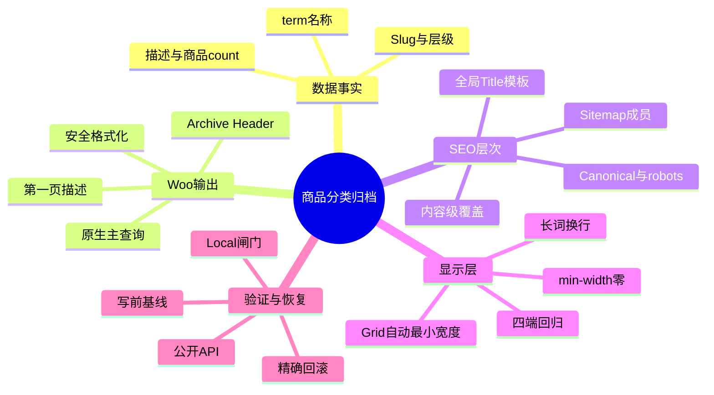
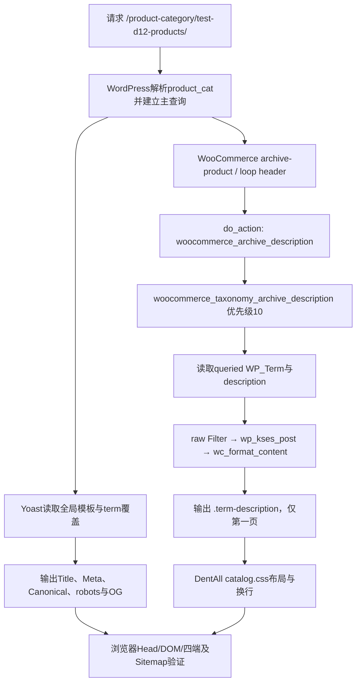

# Day48 WordPress实战：WooCommerce分类描述与SEO模板边界

## 相关笔记

- 学习索引：[[WordPress实战笔记索引]]
- 对应项目笔记：[[../Day48-商品分类内容与W8列表回归|Day48-商品分类内容与W8列表回归]]
- 前置学习笔记：[[Day47-WooCommerce商品搜索请求与模板复用]]
- 前置项目笔记：[[../Day47-商品搜索结果与边界状态|Day47-商品搜索结果与边界状态]]
- URL与SEO事实：[[../../URL_SEO_MAP|URL与SEO映射]]
- 后续学习笔记：[[Day49-WooCommerce属性查询表与商品级筛选]]

## 今日学习成果

- [x] 我能解释taxonomy term、WooCommerce归档描述Hook、Yoast全局模板与内容级覆盖分别保存或输出什么。
- [x] 我能沿商品分类请求追踪到`loop/header.php`、`woocommerce_archive_description`和`woocommerce_taxonomy_archive_description()`，并说明为什么描述只在第一页输出。
- [x] 我能在Local用基线、闸门和公开API临时改写分类，验证Head与四端布局后精确恢复，并解释Grid长词裁切的真实原因。

证据边界：DentAll 0.25.0已完成临时长内容#18与空分类#24的390/768/1024/1440验证，并在恢复后读回#18数据和Head；Day48收尾时缺少的恢复态Shop、有结果商品搜索与短内容#18四端证据，已在D49任何配置写入前用12张截图补齐并关闭原P2。该补证没有恢复#120～#130，也不改变Day48功能和数据恢复结论。

## 真实项目场景

### 今天解决了什么问题

D43～D47已经完成商品列表、Grid、排序、分页和搜索，但分类归档仍缺少“内容从哪里来、第一页如何展示、SEO默认值与内容级值谁覆盖谁、空分类怎么办”的闭环。Day48没有替业务方创建正式分类，而是用既有TEST分类#18做可逆实验：临时加入长标题、多段描述、链接和Yoast覆盖，观察真实请求，再恢复数据。这个实验还发现连续长词会利用CSS Grid item的默认自动最小宽度撑大轨道，证明“页面没有水平滚动条”并不足以说明内容没有被裁切。

### 学习范围

- 本篇要掌握：`product_cat` term数据、原生描述输出、第一页边界、Yoast全局/内容级SEO层次、CSS Grid自动最小尺寸、可逆测试与恢复。
- 本篇明确不展开：正式分类树、业务文案、D49筛选属性、品牌实现、缓存/CDN、Production抓取和多语言。
- 项目真实入口：`app/public/wp-content/plugins/woocommerce/templates/loop/header.php`、`includes/wc-template-hooks.php`、`includes/wc-template-functions.php`、`app/public/wp-content/themes/dentall/assets/css/catalog.css`、Local分类#18。
- 验证版本与环境：仅Local；WordPress 7.0.4、WooCommerce 11.0.0、Storefront 4.6.2、Yoast SEO 28.2、DentAll 0.25.0、PHP 8.2；非Local未同步。

## 先建立整体模型

### 一句话模型

分类term提供事实，WooCommerce在正确归档生命周期把事实安全输出，Yoast把默认SEO模板与重要分类覆盖合成Head，子主题只解决展示布局；任何一层都不能代替其他层。

### 记忆宫殿：商场楼层导览牌

把商品分类页想成商场的楼层入口：物业档案记录楼层名、内部编号和介绍；入口的导览牌决定介绍显示在哪里；宣传部门有一套所有楼层共用的标题格式，也可给重点楼层单独写广告标题；店铺Grid则负责把商品卡排成几列。若介绍里有一串不会断行的超长编号，导览牌必须允许自身收缩和断词，不能只把商场外墙的溢出藏起来。

### 比喻对应回真实机制

| 记忆对象 | 真实技术对象 | 不能混淆的边界 |
|---|---|---|
| 物业档案 | `WP_Term`：name、slug、parent、description、count | term数据不负责HTML布局或SEO Head |
| 楼层入口 | `/product-category/{slug}/`与主查询 | URL存在不等于内容已达索引门槛 |
| 导览牌位置 | Woo `loop/header.php`与`woocommerce_archive_description` | Hook位置不保存描述 |
| 排版员 | `wc_format_content( wp_kses_post() )` | 格式化与白名单清洗不能替代录入事实审核 |
| 公共宣传格式 | Yoast `wpseo_titles`中的taxonomy模板 | 全局模板不是每个term的独立文案 |
| 重点楼层海报 | Yoast taxonomy term覆盖 | 内容级覆盖不能改变Slug或Canonical路由事实 |
| 商品货架 | CSS Grid与ProductCard | 视觉列数不改变Woo主查询每页数量 |

> [!warning] 准确性检查
> 这个比喻不表示WordPress把所有数据放在一张表，也不表示Yoast是WooCommerce的一部分。term、term taxonomy、term meta、Option、查询、模板和CSS在系统中有不同生命周期；以当前源码和Local输出为准。

## 思维导图



最重要的主干是：先分清数据、输出、SEO和布局四层，再分别收集证据，不能用某一层的“看起来正确”推断整页正确。

## 请求与生命周期调用链



- 触发条件：当前请求是存在的商品taxonomy归档；描述函数还要求`paged`为0。
- 加载入口：WooCommerce归档模板/模板函数输出`woocommerce_archive_description`。
- 执行顺序：主查询确定term → Archive Header Action → 描述清洗/格式化 → Yoast生成Head → 浏览器加载DentAll CSS。
- 输入数据：`WP_Term`字段、当前页码、Yoast全局Option与term覆盖、当前主题样式。
- 输出或副作用：普通请求只输出HTML/Head；Day48测试阶段另有受控的term与Option写入，最终除两个获批全局模板外均恢复。
- 可观察证据：唯一H1、`.term-description`段落/链接、Head、Canonical、robots、Sitemap URL、Grid列和`scrollWidth`。

## 核心概念卡

| 概念 | 准确定义 | DentAll真实例子 | 常见误区 | 如何验证 |
|---|---|---|---|---|
| Taxonomy term | 分类法中的一个术语对象 | `product_cat` #18 | 把分类当成独立Page或自建CPT | `wp term get product_cat 18`与term link |
| 全局SEO模板 | 为某内容类型提供默认动态标题格式 | `%%term_title%% %%page%% %%sep%% %%sitename%%` | 认为修改它会改term名称或Slug | 读`wpseo_titles`并对比实际Head |
| 内容级覆盖 | 某个term对全局默认值的局部覆盖 | 临时`[TEST D48] Category SEO...` | 认为删除覆盖会删除全局模板 | 检查`wpseo_taxonomy_meta`条目 |
| 第一页描述 | Woo仅在`paged=0`输出taxonomy说明 | #18根归档有描述；分页不重复 | 用CSS隐藏分页描述，留下重复HTML | 查源码条件并用真实多页复验 |
| Grid item自动最小宽度 | Grid item默认不愿缩得小于内容最小宽度 | 长token撑大390px Header轨道 | 只给`body`设`overflow-x:hidden` | 对比元素rect、scrollWidth与截图 |
| 有效空分类 | term存在但当前0件可显示商品 | #24返回200和原生状态 | 把空集合当404或自动删除 | 对照term存在性、HTTP和DOM |

## 项目实战代码

### 涉及文件

- `app/public/wp-content/plugins/woocommerce/templates/loop/header.php`：原生Archive Header与描述Action位置；只读，不修改。
- `app/public/wp-content/plugins/woocommerce/includes/wc-template-hooks.php`：把taxonomy描述函数挂到Action优先级10；只读，不修改。
- `app/public/wp-content/plugins/woocommerce/includes/wc-template-functions.php`：描述第一页条件、安全清洗与格式化；只读，不修改。
- `app/public/wp-content/themes/dentall/assets/css/catalog.css`：DentAll归档Header、描述和Grid显示层。
- `app/public/wp-content/themes/dentall/style.css`：主题版本，驱动目录CSS缓存参数更新。

### 从入口开始追踪

1. WordPress根据URL解析出`product_cat`查询，并让WooCommerce接管商品归档输出。
2. Woo归档Header输出唯一H1，然后触发`woocommerce_archive_description`。
3. 优先级10的`woocommerce_taxonomy_archive_description()`读取当前term；只在第一页且描述非空时输出。
4. Yoast独立读取taxonomy全局模板与内容级条目，生成浏览器Title、OG Title、Meta、Canonical和robots。
5. DentAll只对已输出的标题与描述做容器尺寸、换行和响应式布局，不复制term或SEO数据。

### 关键代码片段

以下为WooCommerce 11.0.0当前源码的最小节选；父主题/插件核心没有修改：

```php
if ( is_product_taxonomy() && 0 === absint( get_query_var( 'paged' ) ) ) {
    $term = get_queried_object();

    if ( $term && ! empty( $term->description ) ) {
        $term_description = apply_filters(
            'woocommerce_taxonomy_archive_description_raw',
            $term->description,
            $term
        );

        echo '<div class="term-description">'
            . wc_format_content( wp_kses_post( $term_description ) )
            . '</div>';
    }
}
```

DentAll 0.25.0真实CSS节选：

```css
.woocommerce-products-header__title {
    min-width: 0;
}

.term-description,
.page-description {
    min-width: 0;
    overflow-wrap: anywhere;
}
```

| 代码 | 表面动作 | 真实作用 | 为什么这样写 |
|---|---|---|---|
| `get_query_var( 'paged' )` | 读取页码 | 阻止分类描述在后续分页重复 | 内容导语属于归档入口，不应每页重复 |
| `wp_kses_post()` | 清洗HTML | 只允许文章内容场景的安全标签/属性 | term描述是可编辑输入，输出必须受控 |
| `wc_format_content()` | 格式化文本 | 对换行应用Woo内容格式 | 不依赖WordPress会被过滤的手写`<p>`存储 |
| `min-width: 0` | 允许Grid item收缩 | 覆盖Grid item默认自动最小宽度 | 真正消除轨道被长内容撑大的原因 |
| `overflow-wrap:anywhere` | 允许任意断词 | 连续长token可在可用宽内换行 | 比隐藏水平溢出更保真、更可访问 |

### 运行证据

- 页面/命令：#18正常/临时状态、#24空分类、Shop、商品搜索；WP-CLI term/Option/审计；390/768/1024/1440浏览器；PHP/CSS/Git静态检查。
- 正常结果：临时#18输出1个H1、2段描述、1个安全链接、2卡和1组工具栏；四端2/2/3/4列，无水平溢出。
- 失败或边界结果：修复前390px长token使Grid轨道约704px并裁切；修复后描述`scrollWidth`回到285px。空#24保持200原生空态。当前2商品的`/shop/page/2/`为404。
- SEO结果：全局Title/Social Title去掉`Archives`；内容级临时覆盖生效；恢复后#18无Meta Description覆盖，Canonical/robots/URL不变。
- 证据能证明：当前Local版本、当前经典归档模板和当前Yoast配置下的数据—输出—Head—CSS合同。
- 证据不能证明：正式分类文案质量、非Local缓存/抓取、未来Woo/Yoast版本、真实多页分类描述或其他主题行为。

## 职责边界

| 层级 | 本主题中负责什么 | 不应该负责什么 |
|---|---|---|
| WordPress Core | taxonomy数据模型、term API、查询与Option API | 不修改核心文件，不把描述当SEO Meta Description |
| WooCommerce | 商品taxonomy、归档模板、描述Action、主查询和空态 | 不绕过API直接写内部表，不让视觉列数控制查询数量 |
| Storefront父主题 | 提供主题结构和Woo兼容展示 | 不直接修改父主题文件 |
| DentAll子主题 | Archive Header/Grid的最小抗溢出与响应式样式 | 不保存分类事实、不复制Woo模板或SEO系统 |
| `dentall-core` | 本主题无新增职责 | 不为一次分类配置增加插件模块 |
| Yoast | 全局taxonomy SEO模板、内容级覆盖与Head/Sitemap输出 | 不替业务方确认分类内容或URL迁移 |
| 数据库 | 保存term与两个获批全局模板 | 不保留临时TEST覆盖或推测正式内容 |
| 浏览器 | 验证实际DOM、Computed、Focus、Head和视觉 | 不把截图当数据库恢复或Sitemap事实的唯一证据 |

## Hook、API与模板机制详解

| 项目 | 说明 |
|---|---|
| 机制类型 | WooCommerce Action＋Template；WordPress term/Option API；Yoast taxonomy meta API；CSS Grid |
| 名称或入口 | `woocommerce_archive_description`、`woocommerce_taxonomy_archive_description()`、`wp_update_term()`、`WPSEO_Taxonomy_Meta::set_values()` |
| 注册位置 | Woo `includes/wc-template-hooks.php`；Action由`templates/loop/header.php`触发 |
| 默认优先级 | taxonomy描述与Shop Page描述均为10；函数内部条件决定谁真正输出 |
| 回调输入 | 当前查询、`WP_Term`、description；raw Filter另收到term对象 |
| 必须返回内容 | Action回调直接输出；raw Filter必须返回描述字符串 |
| 副作用 | 普通前台请求无写入；term/Yoast配置操作会持久化，必须有权限与恢复流程 |
| 影响范围 | 商品taxonomy第一页及Yoast商品分类Head；CSS只限Woo归档Header |
| 移除或覆盖方式 | 优先使用公开Hook/API；本项目无需移除原生描述回调或覆盖模板 |

## 安全、数据与站点影响

| 检查面 | 本次结论 | 证据或待验证项 |
|---|---|---|
| 输入清洗与验证 | 临时值带TEST标识；写前核对环境、term与基线 | `wp_update_term()`与Yoast公开类；无直接SQL |
| Capability | 自动化脚本只由本地管理员CLI执行 | 正式后台操作仍要求管理员/获批Website Manager权限 |
| Nonce | CLI不适用 | 若自建后台表单则必须与Capability同时检查，但本轮没有后台入口 |
| 输出转义 | Woo用`wp_kses_post()`清洗并格式化描述 | 链接协议/属性仍应在代表内容中验证 |
| 数据库写入 | 有；#18临时值已恢复，两个全局模板按授权保留 | `wpseo_taxonomy_meta`最终严格为`[]` |
| URL与SEO | Slug/Canonical/robots/Sitemap成员不变；Title文字改进 | 非Local配置重放与缓存抓取待验 |
| 缓存 | 主题0.25.0刷新CSS版本参数 | CDN/页面缓存未验 |
| 支付、物流与订单 | 不适用，无影响 | 未创建订单或修改价格/库存 |
| 部署与回滚 | 仅Local；代码可回退3条CSS/版本，配置需反向写两个Option键 | Git不携带数据库配置 |

## 动手练习

### 练习一：只读观察

- 目标：判断分类描述是存储缺失、Hook没运行还是CSS隐藏。
- 操作：依次读term description、当前`paged`、Action注册、最终`.term-description`数量和Computed样式。
- 预期：根归档有非空描述时只输出一个容器，分页页不输出。
- 实际证据：#18临时根页为1容器/2段；源码明确只允许`paged=0`。

### 练习二：Local最小改动

- 改动：在明确TEST term上临时写多段描述与Yoast覆盖，验证后恢复；显示层只增加3条CSS声明。
- 风险边界：仅Local；先保存完整基线；不改Slug、层级、商品归属、正式内容、核心文件或非Local。
- 验证：term/Option读回、Head、四端、空分类、菜单、Sitemap、恢复后hash。
- 回滚：把#18原字段与Yoast defaults写回；全局模板若撤销则恢复两个精确旧值；代码撤回3条声明与版本号。

### 练习三：故障推演

- 假设症状：手机没有水平滚动条，但分类标题右侧被截掉。
- 可能原因：祖先隐藏溢出，而Grid item仍受长词的自动最小宽度约束。
- 第一项检查：同时比较页面、Header、H1和描述的`clientWidth`、`scrollWidth`与bounding rect，并看截图。
- 为什么先查它：页面级宽度相等只能证明滚动被抑制，不能证明内部内容没有越过可见边界。

## 常见误区与排错顺序

| 现象或误区 | 可能原因 | 推荐检查顺序 | 最小验证方法 |
|---|---|---|---|
| 分类描述不显示 | 描述为空、后续分页、Hook被移除或CSS隐藏 | 1.term；2.paged；3.Hook；4.DOM；5.CSS | 根分类与分页对照 |
| 保存`<p>`后段落标签消失 | WordPress term字段清洗过滤块级标签 | 1.数据库读回；2.前台格式化；3.白名单 | 改用换行并观察`wc_format_content()`输出 |
| Title仍有`Archives` | 改错taxonomy键、缓存或内容级覆盖 | 1.实际Head；2.term覆盖；3.全局键；4.缓存 | 对照`title-tax-product_cat`与OG |
| 取消内容级Title后整页无标题 | 把term覆盖与全局默认误当同一层 | 1.taxonomy meta；2.global template；3.Head | 删除覆盖后应回退模板 |
| 页面无横滚却文字被裁 | 祖先隐藏溢出＋Grid自动最小宽度 | 1.截图；2.item rect；3.min-width；4.long token | 临时`min-width:0`验证因果 |
| 空分类被误判404 | term存在但结果集合为0 | 1.term；2.HTTP；3.query；4.DOM | 与不存在term/越界页对照 |
| Git部署后SEO模板没变 | Yoast值在数据库Option，不在主题文件 | 1.目标环境Option；2.Head；3.缓存 | 按变更记录重放两键 |

## 掌握标准

- [ ] 不看笔记，能在2分钟内讲清term→主查询→Woo描述→Yoast Head→CSS的因果链。
- [x] 能指出Woo三个真实入口、DentAll CSS和Yoast两层配置。
- [x] 能区分WordPress、WooCommerce、Storefront、子主题、Yoast、数据库与浏览器职责。
- [x] 能说明正常分类、空分类、分页描述、SEO覆盖和Grid长词五种边界。
- [x] 能在Local用公开API完成基线、临时写入、验证与恢复。
- [x] 能判断本次对数据、URL、SEO、缓存、交易和部署的实际影响。

当前掌握度：初识；已完成真实修改与排错，待闭卷费曼自测后评估“能解释/能修改”。

## 费曼测试题（7道）

1. 不使用专业术语，你会怎样解释“分类名称、页面描述、SEO描述”为什么不是同一个字段？
2. 商场导览牌比喻中的物业档案、公共宣传格式、重点海报和货架分别对应什么；比喻在哪些数据库细节上失效？
3. 从商品分类URL开始，按顺序讲出WordPress主查询、Woo Header Action、描述函数、Yoast和子主题CSS如何协作。
4. 为什么WooCommerce先`wp_kses_post()`再`wc_format_content()`；为什么直接把`<p>`存进term描述不一定原样保留？
5. 为什么`overflow-x:hidden`不能修复长token裁切，而`min-width:0`与`overflow-wrap:anywhere`分别解决哪一部分？
6. 为什么存在但0商品的分类应是200空态，而当前不存在的`/shop/page/2/`应是404？
7. 把同一目标迁移到区块主题或Shopify时，哪些原则不变，哪些具体机制必须重新验证？

### 我的费曼答案与纠正

待首次复习时完成。当前7题均标记“含糊/未作答”；若无法区分全局模板、内容级覆盖和Canonical，回到“核心概念卡”和“安全、数据与站点影响”修正。

### 自测评分

总分：待填写 / 14；存在未作答题，掌握度保持“初识”。

## 间隔复习记录

| 复习节点 | 计划日期 | 完成 | 暴露的问题 | 修正位置 |
|---|---|---|---|---|
| D+1 | 2026-09-04 | [ ] | 待填写 | 待填写 |
| D+3 | 2026-09-06 | [ ] | 待填写 | 待填写 |
| D+7 | 2026-09-10 | [ ] | 待填写 | 待填写 |
| D+14 | 2026-09-17 | [ ] | 待填写 | 待填写 |

## 收尾总结

- 我今天真正理解了：分类归档正确性来自数据、查询、模板、SEO和CSS各守职责，并通过同一真实请求汇合。
- 我仍然容易混淆：Yoast全局模板变更会影响同taxonomy所有term，而内容级覆盖只影响一个term；二者都不改变Slug。
- 下次遇到类似问题，我会先检查：term原值与请求页码，再看Woo Hook/DOM、Yoast两层配置，最后看Grid item的Computed尺寸。
- 下一篇直接相关学习笔记：[[Day49-WooCommerce属性查询表与商品级筛选]]。
- 验收边界：0.25.0恢复态Shop、有结果搜索与短内容分类四端矩阵已在D49配置前补齐；W8可按当前2商品与Local环境表述为视觉证据闭环，但正式内容、非Local缓存/抓取和未来版本仍需单独验收。

## 后续如何向AI高效提问

### 提问公式

`环境版本 + taxonomy/term与URL + 全局及内容级SEO值 + Woo Hook/模板 + DOM/Head/Computed证据 + 可逆边界 + 期望的最小修复`

```text
这是Local的WordPress/WooCommerce商品分类问题。
term与URL：[taxonomy、term ID、slug、paged]
数据基线：[名称、描述、parent、count、term meta]
SEO两层：[Yoast全局模板、内容级覆盖、实际Head]
页面证据：[H1、term-description、Canonical、robots、Grid/overflow]
边界：不改核心、不直接SQL、不改Slug/正式数据、不部署非Local。
请先区分数据、Woo输出、SEO和CSS，再给最小验证、修复与恢复步骤。
```

> [!warning] AI验证边界
> AI不能仅凭字段名断言当前版本的输出顺序或Yoast存储结构。版本相关结论要回到当前源码、Option/term实际读回和Local页面；截图也不能单独证明数据已恢复。

## 变种应用到其他项目

| 新场景 | 保持不变的原则 | 可能变化的实现 | 必须重新确认 | 最小验证 |
|---|---|---|---|---|
| 另一个Storefront子主题 | term事实、原生查询、SEO分层、长词回归 | Design Token与Header布局 | Woo/Storefront/Yoast版本和已有覆盖 | 正常/空/长词/Head四端 |
| 其他经典WordPress主题 | 不改核心、优先Hook与API | Archive Header DOM和CSS作用域 | 主题是否移除Woo Action | Hook表、DOM、Canonical |
| WordPress区块主题 | 数据/展示/SEO职责仍分开 | Product Catalog模板、Term Description区块、`theme.json` | 当前区块兼容层和模板来源 | 编辑器/前台/分页对照 |
| 独立插件 | 持久配置必须可审计/回滚 | Settings API或部署配置 | 生命周期、权限、停用行为 | 权限、Option、停用恢复 |
| Shopify或其他平台 | 集合内容、全局SEO默认与页面覆盖分层 | Collection字段、Liquid/JSON模板、平台SEO，待验证 | URL、分页描述、robots、发布模型 | 官方文档＋沙盒集合 |

## 可复用核心思想

### 跨平台不变量

集合页要同时管理“集合事实、展示位置、默认SEO、页面级覆盖、空集合与分页”。临时修改任何持久数据前都先保存可比较基线，限制对象和环境，写后验证，最后用独立读回证明恢复；视觉上隐藏溢出不能代替修复内容尺寸约束。

### WordPress/WooCommerce当前实现

DentAll使用WordPress原生`product_cat` term和API，WooCommerce 11.0.0在`woocommerce_archive_description`优先级10输出第一页描述，Yoast 28.2以`wpseo_titles`和taxonomy meta形成默认/覆盖两层，子主题0.25.0只用3条局部CSS声明修复Grid长内容。结论只代表当前Local版本和经典模板链。

### Shopify或其他平台的对应机制

Shopify等平台通常也有Collection数据、主题模板和页面SEO字段，但具体存储、默认Title拼装、分页描述、Canonical和发布回滚机制均待官方资料与沙盒验证。可直接迁移的是职责分层、内容门槛、四端长词测试和可逆变更流程，不能迁移Woo Hook、WordPress Option或Yoast类名。
