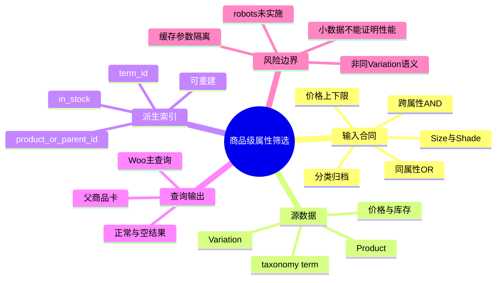
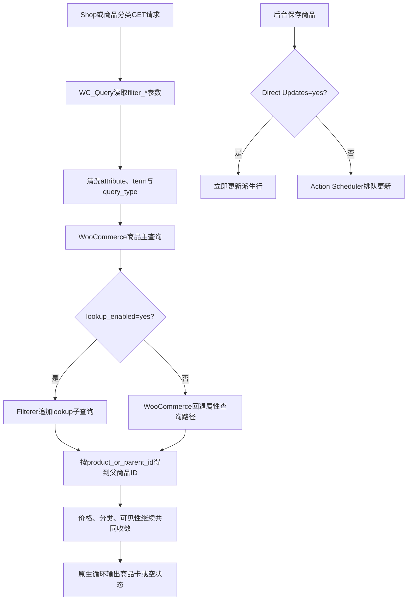

# Day49 WordPress实战：WooCommerce属性查询表与商品级筛选

## 相关笔记

- 学习索引：[[WordPress实战笔记索引]]
- 对应项目笔记：[[../Day49-商品筛选合同与属性查询表]]
- 前置学习笔记：[[Day48-WooCommerce分类描述与SEO模板边界]]
- 同主题知识：[[Day45-WooCommerce排序Hook与参数URL]]、[[Day46-WooCommerce分页链接与Canonical边界]]、[[Day47-WooCommerce商品搜索请求与模板复用]]
- 后续学习笔记：[[Day50-WooCommerce链接式筛选与参数治理]]

## 今日学习成果

- [x] 我能解释业务商品/Variation数据与可重建属性lookup之间的主从关系。
- [x] 我能沿WooCommerce 11.0.0源码追踪`filter_size`从GET参数到主查询SQL的路径。
- [x] 我能在Local重建、启用、验证和回滚lookup，并准确说明父商品级组合与缺货term边界。

## 真实项目场景

### 今天解决了什么问题

D50将开始做筛选界面。如果先画复选框，后决定字段、AND/OR、Variation组合、缺货、URL和SEO，界面一完成就可能需要重做。Day49因此先用已有TEST商品冻结查询合同，并启用WooCommerce自己的属性查询表；目标不是“写一个筛选器”，而是证明原生查询能稳定回答已经约定的问题。

### 学习范围

- 本篇掌握：GET属性参数解析、lookup表职责、父商品级匹配、Direct Updates、缺货条件和可复演验证。
- 本篇不展开：D50/D51 UI、品牌、评分、严格同Variation查询、Production缓存和大数据性能。
- 真实入口：`includes/class-wc-query.php`、`src/Internal/ProductAttributesLookup/Filterer.php`、`LookupDataStore.php`及`wp wc palt`命令。
- 验证范围：仅Local当前版本；2个父商品、3个Variation、7行lookup。

## 先建立整体模型

### 一句话模型

商品与Variation是货品档案，属性lookup是从档案生成的快速索引；请求先把GET参数清洗成term，再用索引找父商品，最后仍由WooCommerce主查询输出商品集合。

### 记忆宫殿：商场导购台

把商场想成有四个位置：

1. 仓库档案室保存每个商品、型号、价格和库存，它是业务真相。
2. 导购台有一份按Size/Shade整理的快速索引，它只帮助找货，可以重新打印。
3. 顾客递来筛选纸条，写着Size、Shade和价格。
4. 导购先查索引得到“哪些商品系列符合”，再让货架系统显示父商品卡。

### 比喻对应回真实机制

| 记忆对象 | 真实技术对象 | 不能混淆的边界 |
|---|---|---|
| 仓库档案 | WooCommerce Product、Variation、taxonomy term和价格/库存数据 | 是源数据；不能为修复索引而猜值 |
| 导购索引 | `wp_wc_product_attributes_lookup` | 是派生表，可重建，不是第二份商品真相 |
| 筛选纸条 | `filter_size`、`filter_shade`、`min_price`等GET参数 | 参数需清洗、白名单与SEO合同 |
| 商品系列编号 | `product_or_parent_id` | 属性查询返回父商品，不自动等于某个Variation |
| 当场重印索引卡 | Direct Updates | 表示保存后同步路径，不证明大批量一定更快 |

> [!warning] 比喻边界
> 导购可以口头理解“Large＋Medium必须是同一个现货型号”，但Woo原生商品级查询只核对同一父商品是否分别拥有两个term。真实SQL语义必须优先于人的直觉。

## 思维导图



主干是：先冻结输入含义，再让主查询使用可重建索引；不能从UI外观倒推数据语义。

## 请求与生命周期调用链



- 触发条件：Shop或商品分类请求含有效`filter_{attribute}`；或后台保存相关商品。
- 加载入口：WooCommerce引导后由`WC_Query`和Product Attributes Lookup内部服务参与。
- 输入数据：GET term slug、Global Attribute、Product/Variation关系、价格和缺货设置。
- 输出或副作用：前台主查询SQL增加约束；商品保存时更新lookup派生行。
- 可观察证据：主查询结果ID、SQL表名、`wp wc palt info`、Option值和7行派生数据。

## 核心概念卡

| 概念 | 准确定义 | DentAll真实例子 | 常见误区 | 如何验证 |
|---|---|---|---|---|
| Global Attribute | 注册成`pa_*` taxonomy、可跨商品复用的规格维度 | `pa_size`、`pa_shade` | 商品有文字规格就等于全局属性 | `wc_get_attribute_taxonomies()`和商品CRUD |
| Lookup表 | 从商品/Variation与term关系生成的查询加速派生表 | 7行对应#44/#46 | 手改lookup即可修复商品数据 | 从头重建并与CRUD源数据比对 |
| `product_or_parent_id` | 将Variation属性行归并到父商品结果的标识 | #51～#53都归到#46 | 查询直接返回可购买Variation | 查看SQL与结果ID |
| 同属性OR | 选择同一维度任一term即可命中 | Small或Large返回#46一次 | 多值默认一定OR | 显式传`query_type_size=or` |
| 跨属性AND | 不同维度各自都要满足 | Large＋Medium返回#46 | 代表存在同一Variation | 对照Variation实际组合 |
| Direct Updates | 商品变化时直接执行lookup更新回调 | 当前Option为yes | 等于数据库优化或性能保证 | 看`LookupDataStore::maybe_schedule_update()` |

## 项目实战代码

> [!important] 代码真实性
> Day49没有新增项目运行代码。以下是当前仓库内WooCommerce 11.0.0真实源码的最小节选，只用于理解已启用机制；第三方核心文件未修改。

### 涉及文件

- `app/public/wp-content/plugins/woocommerce/includes/class-wc-query.php`：把`filter_*` GET参数解析成属性term与AND/OR模式。
- `app/public/wp-content/plugins/woocommerce/src/Internal/ProductAttributesLookup/Filterer.php`：启用时把lookup条件追加到商品主查询SQL。
- `app/public/wp-content/plugins/woocommerce/src/Internal/ProductAttributesLookup/LookupDataStore.php`：决定商品变化时立即更新还是排队。
- `project-docs/DATA_DICTIONARY.md`：DentAll字段与父商品语义合同。
- `project-docs/URL_SEO_MAP.md`：参数、Canonical、robots和缓存边界。

### 从入口开始追踪

1. 请求进入WordPress并被识别为Shop或商品分类。
2. `WC_Query::get_layered_nav_chosen_attributes()`遍历GET，只接收`filter_`开头且值为字符串的参数。
3. Woo清洗attribute名、term slug和`query_type_*`，拒绝不存在的taxonomy/attribute。
4. 商品主查询的`posts_clauses`阶段调用Filterer。
5. lookup启用时，Filterer以term ID和`product_or_parent_id`生成子查询；价格仍由价格lookup处理。
6. 原生Woo循环输出匹配父商品或空结果。

### 关键代码片段一：参数解析

源文件：`includes/class-wc-query.php`。

```php
if ( 0 === strpos( $key, 'filter_' ) ) {
    $attribute    = wc_sanitize_taxonomy_name( str_replace( 'filter_', '', $key ) );
    $taxonomy     = wc_attribute_taxonomy_name( $attribute );
    $filter_terms = ! empty( $value ) ? explode( ',', wc_clean( wp_unslash( $value ) ) ) : array();
}
```

这段先限定参数前缀，再把输入还原、清洗、拆分并映射到`pa_*` taxonomy。GET读取不需要nonce，因为它不修改数据；但这不表示可以跳过清洗或允许任意参数进入缓存键。

### 关键代码片段二：启用与缺货条件

源文件：`src/Internal/ProductAttributesLookup/Filterer.php`。

```php
public function filtering_via_lookup_table_is_active() {
    return 'yes' === get_option( 'woocommerce_attribute_lookup_enabled' );
}

$hide_out_of_stock = apply_filters(
    'woocommerce_product_attributes_filterer_hide_out_of_stock',
    'yes' === get_option( 'woocommerce_hide_out_of_stock_items' )
);
$in_stock_clause = $hide_out_of_stock ? ' AND in_stock = 1' : '';
```

DentAll当前hide out of stock为`no`，所以#52的Medium行即使`in_stock=0`也不会被这段SQL排除。

### 关键代码片段三：Direct Updates

源文件：`src/Internal/ProductAttributesLookup/LookupDataStore.php`。

```php
if ( get_option( 'woocommerce_attribute_lookup_direct_updates' ) === 'yes' ) {
    $this->run_update_callback( $product_id, $action );
    return;
}
```

关闭时后续代码交给Woo队列调度；开启时直接运行回调。它改变更新时机，不改变Product/Variation谁是源数据。

### 运行证据

- `wp wc palt info`：enabled，7行、2父商品、最高ID 46。
- Option：enabled/direct/optimized=`yes/yes/no`，hide out of stock=`no`。
- Size、Shade和组合请求的SQL包含`wp_wc_product_attributes_lookup`。
- 价格请求的SQL包含`wp_wc_product_meta_lookup`。
- `Large + Medium`返回#46；无效term和反向价格返回0。
- 证据不能证明：真实目录性能、Production缓存、保存/CSV后的实际同步时延或严格同Variation可购性。

## 职责边界

| 层级 | 本主题中负责什么 | 不应该负责什么 |
|---|---|---|
| WordPress Core | 请求、主查询、taxonomy基础和Option API | 不修改核心文件 |
| WooCommerce | Product/Variation、属性参数、价格与属性lookup、商品循环 | 不把派生表当业务真相源 |
| Storefront | 输出原生归档结构与商品卡位置 | 不决定筛选字段或库存语义 |
| DentAll子主题 | 后续D50/D51的显示与响应式状态 | D49不提前承载查询数据逻辑 |
| `dentall-core` | 本轮无职责 | 不因存在站点插件就塞入通用筛选功能 |
| 数据库 | 保存源数据、Option与派生lookup | 不直接手改商品内部表或lookup行 |
| 浏览器 | 显示单结果/空态、URL与Console | 不能仅凭一张截图证明SQL或数据未变 |

## Hook、API或模板机制详解

| 项目 | 说明 |
|---|---|
| 机制类型 | GET解析＋WP_Query `posts_clauses`＋Woo内部数据服务＋WP-CLI |
| 名称或入口 | `WC_Query::get_layered_nav_chosen_attributes()`、`Filterer::filter_by_attribute_post_clauses()`、`wp wc palt` |
| 输入 | attribute/term/query_type、当前主查询、属性源数据、缺货Option |
| 返回 | Filterer返回加入lookup约束后的SQL clauses |
| 副作用 | 前台请求本身只读；重建/启用与Direct设置写Local数据库 |
| 影响范围 | Shop与商品taxonomy商品主查询；D49不新增搜索页UI |
| 回滚 | `wp wc palt disable`并把Direct恢复`no`；源商品无需改变 |

## 安全、数据与站点影响

| 检查面 | 本次结论 | 证据或待验证项 |
|---|---|---|
| 输入清洗与验证 | Woo使用`wp_unslash()`、`wc_clean()`、taxonomy/attribute存在性和term slug映射 | 已读当前源码；D50 UI仍须只生成白名单参数 |
| Capability | 前台筛选只读，不需要登录能力；设置操作由管理员级CLI执行 | 仅Local授权范围 |
| Nonce | GET筛选不写数据，不使用nonce；nonce不能替代后台权限 | 本轮没有自定义后台动作 |
| 输出转义 | 由现有Woo/主题模板承担 | D49未新增输出 |
| 数据库写入 | 重建派生表，更新enable/direct Option；optimized写入值未变化 | 商品CRUD快照与Trash读回一致 |
| URL与SEO | 参数与Canonical目标冻结；robots实现尚缺 | D50前置P3 |
| 缓存 | 只冻结参数隔离要求，没有改缓存 | Production/CDN未验 |
| 支付、物流与订单 | 不适用，无变更 | 未触发交易流程 |
| 部署与回滚 | 仅Local；数据库配置不随Git自动部署 | 非Local需重新确认、重建和验证 |

## 动手练习

### 练习一：只读观察

- 目标：确认lookup行能从源数据解释。
- 操作：用Woo CRUD列出#44/#46与#51～#53属性，再读取7行lookup。
- 预期：#44一行Package Quantity；#46的三个Variation各有Size/Shade两行。
- 实际：1＋3×2=7行，#52两行为`in_stock=0`。

### 练习二：Local最小改动

- 改动：完整重建并启用lookup，Direct改为yes，Optimized保持no。
- 风险边界：只改Local派生表与设置；不改商品、核心或非Local。
- 验证：`palt info`、Option回读、11个主查询、CRUD与Trash快照。
- 回滚：禁用lookup并将Direct恢复no。

### 练习三：故障推演

- 假设症状：选择Size后所有商品消失。
- 可能原因：表启用但未完整生成、term slug错误、商品未使用Global Attribute、缓存复用错误结果。
- 第一项检查：`wp wc palt info`与源商品属性是否对应。
- 为什么先查：先区分“索引数据不存在”与“UI/样式看不到”，避免直接改模板。

## 常见误区与排错顺序

| 现象或误区 | 可能原因 | 推荐检查顺序 | 最小验证方法 |
|---|---|---|---|
| 启用lookup后0结果 | 空表或派生行过期 | 1.源商品；2.palt info；3.行；4.SQL | 从头重建后重跑一个term |
| Large＋Medium命中但无法购买 | 父商品级匹配，不存在同Variation组合 | 1.冻结合同；2.Variations；3.SQL | 对照#51～#53组合 |
| 缺货Medium仍出现 | hide out of stock=no | 1.Option；2.lookup `in_stock`；3.SQL | 检查是否出现`AND in_stock=1` |
| 无效term回退全量 | 自定义解析忽略失败条件 | 1.GET；2.WC解析；3.主查询 | 无效slug必须0结果 |
| Canonical正确就认为SEO完成 | robots仍可能index | 1.Head robots；2.Canonical；3.Sitemap；4.内链 | 分别读两个标签 |
| Direct=yes就宣称更快 | 没有规模与保存耗时测量 | 1.数据量；2.保存路径；3.队列；4.基准 | D53真实小批量对比 |

## 掌握标准

- [ ] 不看笔记，能在2分钟内讲清源数据→lookup→主查询→父商品结果。
- [x] 能指出当前Woo源码入口和三个设置。
- [x] 能区分Product/Variation、term、lookup和浏览器商品卡。
- [x] 能说明无效term、缺货term及缺失Variation组合三个边界。
- [x] 能在Local重建、验证并说清回滚方法。
- [x] 能判断数据、URL、SEO、缓存和部署影响。

当前掌握度：初识；已完成真实配置和源码追踪，待费曼自测后评估“能解释/能修改”。

## 费曼测试题（7道）

1. 不使用数据库术语，怎样解释商品档案与属性lookup为什么不能互换？
2. 商场导购台比喻中的档案室、索引卡、筛选纸条和商品系列号分别对应什么；比喻在哪里失效？
3. 从`filter_size=small-98-mm`开始，按顺序说出清洗、term映射、SQL约束和商品卡输出。
4. 为什么#46没有Large＋Medium Variation却仍命中；这与“可购买组合”有什么区别？
5. `hide_out_of_stock_items=no`怎样改变#52 Medium行的查询作用？
6. Direct Updates与Optimized Updates分别是什么问题，为什么D49一个开、一个关？
7. 如果迁移到另一个平台，哪些筛选合同不变，哪些WooCommerce机制必须重新查证？

### 我的费曼答案与纠正

待首次复习时完成。当前7题均标记“含糊/未作答”；若不能解释`product_or_parent_id`或把Canonical当作noindex，回到调用链和SEO表修正。

### 自测评分

总分：待填写 / 14；存在未作答题，掌握度保持“初识”。

## 间隔复习记录

| 复习节点 | 计划日期 | 完成 | 暴露的问题 | 修正位置 |
|---|---|---|---|---|
| D+1 | 2026-09-04 | [ ] | 待填写 | 待填写 |
| D+3 | 2026-09-06 | [ ] | 待填写 | 待填写 |
| D+7 | 2026-09-10 | [ ] | 待填写 | 待填写 |
| D+14 | 2026-09-17 | [ ] | 待填写 | 待填写 |

## 收尾总结

- 我今天真正理解了：lookup是可重建的查询索引，筛选结果的业务含义由字段、AND/OR、父商品/Variation和缺货合同共同决定。
- 我仍然容易混淆：跨属性AND只保证同一父商品分别拥有term，不保证同一可购买Variation同时满足。
- 下次遇到类似问题，我会先检查：源商品与term，再看lookup状态和行，随后看主SQL，最后才看UI与缓存。
- 下一篇直接相关学习笔记：[[Day50-WooCommerce链接式筛选与参数治理]]。

## 后续如何向AI高效提问

### 提问公式

`Woo/WordPress版本 + 页面类型与完整参数 + 商品/Variation源数据 + lookup状态与行 + 缺货设置 + 主查询结果/SQL + SEO与缓存边界 + 禁止改动范围`

```text
这是WooCommerce商品筛选问题，仅限Local。
环境：[版本]
URL与参数：[完整请求]
源商品：[父商品term、Variations、价格、库存]
lookup：[enabled/direct/optimized、行数]
实际：[结果ID、SQL表、Canonical、robots]
合同：[同属性OR、跨属性AND、父商品或同Variation语义]
边界：[不改核心、不改商品、不装插件、不碰非Local]
请先区分源数据、派生索引、查询语义、UI和SEO，再给最小检查与回滚。
```

> [!warning] AI验证边界
> 参数名、内部类、SQL结构和设置默认值随WooCommerce版本可能变化。AI解释必须回到当前源码、Option、主查询和Local数据；不能用通用印象替代版本证据。

## 变种应用到其他项目

| 新场景 | 保持不变的原则 | 可能变化的实现 | 必须重新确认 | 最小验证 |
|---|---|---|---|---|
| 另一个Storefront项目 | 源数据/派生索引分层、参数与SEO合同 | 属性和term集合 | Woo版本、数据规模、缺货政策 | 单/多属性、价格、空态、重建 |
| 其他经典WordPress主题 | 主查询语义不由主题外观决定 | 筛选控件DOM与Hook位置 | 主题是否改Woo查询/模板 | SQL＋真实页面 |
| WordPress区块主题 | Product/Variation与SEO边界不变 | Product Collection区块和查询上下文 | 当前区块支持的筛选机制 | 编辑器与前台对照 |
| 独立筛选插件 | 必须尊重源数据、URL和回滚 | 自有索引、AJAX/REST、缓存 | 许可证、停用、兼容、SEO | 启停前后结果与卸载 |
| Shopify或其他平台 | 集合、选项/变体、库存、URL、SEO、缓存都需合同 | 平台筛选API与应用索引，待验证 | 是否商品级或变体级、URL和发布模型 | 官方文档＋沙盒数据 |

## 可复用核心思想

### 跨平台不变量

任何筛选系统都应先冻结“源数据、派生索引、查询语义、URL、SEO、缓存、回滚”七层合同。索引可以重建，源数据不能靠猜测修正；不同维度都命中同一商品，并不天然证明同一变体可购买。

### WordPress/WooCommerce当前实现

DentAll使用WooCommerce 11.0.0的`filter_*`解析、`wp_wc_product_attributes_lookup`、价格lookup和Product主查询。Local选择Direct=yes、Optimized=no，是当前小批量与可观察一致性的取舍，不是通用默认答案。现有属性归档关闭、缺货隐藏为no，均参与最终语义。

### Shopify或其他平台的对应机制

Shopify及其他平台也存在商品、变体、集合、库存与筛选索引，但参数名、严格组合语义、SEO输出、缓存和扩展生命周期均需重新验证。DentAll没有实际实施或验证Shopify筛选，本篇只迁移判断框架，不迁移Woo表名、Option或SQL。
