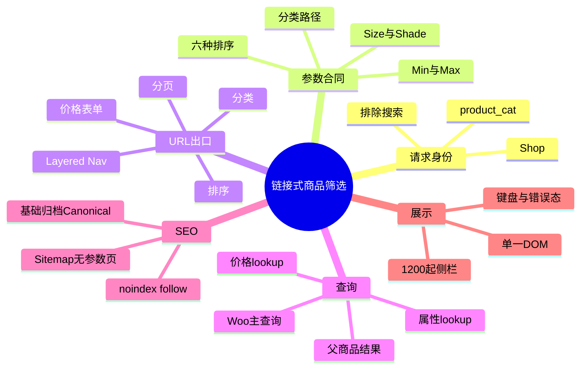
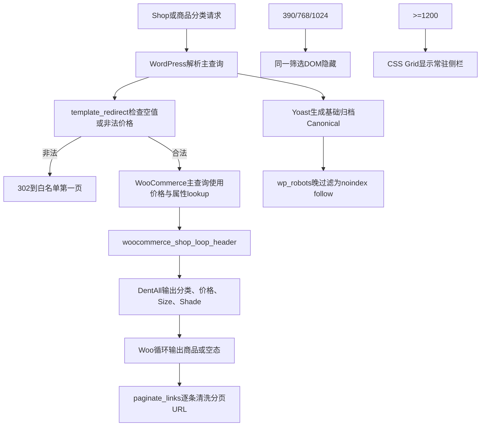

# Day50 WordPress实战：WooCommerce链接式筛选与参数治理

## 相关笔记

- 学习索引：[[WordPress实战笔记索引]]
- 对应项目笔记：[[../Day50-PC商品筛选与参数页索引收口]]
- 前置学习笔记：[[Day49-WooCommerce属性查询表与商品级筛选]]
- 同主题知识：[[Day45-WooCommerce排序Hook与参数URL]]、[[Day46-WooCommerce分页链接与Canonical边界]]、[[Day48-WooCommerce分类描述与SEO模板边界]]
- 后续学习笔记：[[Day51-原生Dialog与单一筛选DOM]]

## 今日学习成果

- [x] 我能解释为什么链接式筛选必须让分类、属性、价格、排序和分页共享一个URL白名单。
- [x] 我能沿真实Hook追踪Woo Layered Nav、主查询、`wp_robots`与Yoast Canonical各自负责什么。
- [x] 我能在Local验证正常、非法、空结果、键盘、四端和回滚，并区分UI正确与查询/SEO正确。

## 真实项目场景

### 今天解决了什么问题

Day49已经证明WooCommerce能按分类、价格、Size与Shade筛选父商品，但没有站内入口，而且参数页仍可索引。Day50需要建立最小PC侧栏，同时避免三类常见后果：未知GET参数被排序或分页继续复制、非法价格被界面和Woo主查询用不同规则解释、筛选组合被搜索页或其他taxonomy误继承。

### 学习范围

- 本篇掌握：无JavaScript链接式筛选、GET白名单、Woo Widget渲染窗口、分页最终链接过滤、参数页robots和响应式显示边界。
- 本篇不展开：移动抽屉、AJAX、Chips、计数、品牌、严格同Variation、Production缓存与正式内容。
- 真实入口：`themes/dentall/inc/catalog-filters.php`、`assets/css/catalog.css`、`dentall-core/includes/seo-compatibility.php`。
- 验证范围：仅Local；Shop与`product_cat`；当前2个TEST父商品及3个Variations。

## 先建立整体模型

### 一句话模型

一次筛选请求只有在“每个链接出口都生成同一份可信参数、Woo主查询按同一合同取数、参数页统一不索引”时才完整；侧栏看起来正确只是最后一层。

### 记忆宫殿：机场转机大厅

把商品归档想成机场转机大厅：

1. 安检台只允许分类、价格、Size、Shade和合法排序进入登机牌。
2. 分类门、属性门、价格柜台、排序柜台和转机通道都会重新打印登机牌。
3. WooCommerce调度台根据登机牌安排同一班“主查询”，不是另开一架飞机。
4. SEO边检看到筛选印章就允许用户和链接继续走，但不让搜索引擎把每张组合票当独立目的地收录。

### 比喻对应回真实机制

| 记忆对象 | 真实技术对象 | 不能混淆的边界 |
|---|---|---|
| 安检白名单 | `dentall_catalog_filter_sanitize_query_args()` | 清洗后续URL不自动改变本次Woo查询，非法输入还需归一化 |
| 多个打印柜台 | 分类链接、Layered Nav、价格GET、排序模板、分页链接 | 漏掉任一出口，未知参数仍会传播 |
| 同一班飞机 | WooCommerce主`WP_Query` | 没有第二查询；父商品级语义沿用D49 |
| 临时交接窗口 | 渲染Widget/排序模板时替换`$_GET`并在`finally`恢复 | 全局变量不是局部参数，必须恢复 |
| SEO边检 | `wp_robots`与Yoast Canonical | Canonical不是noindex，两项要分别验证 |

> [!warning] 比喻边界
> 机场安检发生在出发前；Day50的非法价格302位于`template_redirect`，Woo主查询已经执行。它保证公开响应和后续URL一致，但不等于节省了本次数据库查询。

## 思维导图



最重要的主干是：身份判断限定作用域，白名单统一所有URL出口，主查询和SEO再分别验证。

## 请求与生命周期调用链



- 触发条件：非搜索且`is_shop()`或`is_product_category()`。
- 加载入口：子主题`functions.php`加载模块；插件入口加载SEO兼容模块。
- 输入数据：当前`$_GET`、商品分类、Global Attribute term、Woo主查询与当前货币配置。
- 输出或副作用：HTML与链接、必要的302、robots指令；没有业务数据写入。
- 可观察证据：URL、响应头、Head、DOM、主查询ID/SQL、断点样式、键盘Focus和数据快照。

## 核心概念卡

| 概念 | 准确定义 | DentAll真实例子 | 常见误区 | 如何验证 |
|---|---|---|---|---|
| URL白名单 | 只允许已冻结、有效且规范化的状态进入新URL | `min_price`、Size/Shade、六种`orderby` | 只清理表单就够了 | 检查分类、排序、分页和移除链接 |
| Layered Nav | Woo根据当前集合和Global Attribute生成链接式筛选 | `WC_Widget_Layered_Nav`输出Size/Shade | Widget等于第二商品查询 | 对照主查询ID与DOM商品ID |
| 渲染窗口 | 仅在第三方模板读取全局输入时提供受控值 | 临时替换`$_GET`后恢复 | 改完全局变量无需还原 | 渲染后比较`$_GET`和Filter状态 |
| 参数页noindex | 告诉抓取器不要将组合页纳入索引 | 任意价格、`filter_*`、`query_type_*`键 | 有Canonical就自然不会索引 | 独立读robots与Canonical |
| Mobile First隐藏 | DOM保持一份，小屏先不提供交互 | 1199隐藏、1200显示 | `display:none`等于移动功能完成 | 键盘与计算样式检查 |
| 非法输入归一化 | 公开响应转到可解释的安全状态 | `1e2`或负数302并移除该键 | UI错误提示会改变Woo的`floatval` | 真实Header与目标URL |

## 项目实战代码

> [!important] 代码真实性
> 下列片段来自当前DentAll代码，只保留理解调用关系所需部分；WordPress、WooCommerce、Storefront和Yoast核心均未修改。

### 涉及文件

- `app/public/wp-content/themes/dentall/inc/catalog-filters.php`：筛选结构、白名单、Widget适配、URL及302。
- `app/public/wp-content/themes/dentall/assets/css/catalog.css`：单一DOM的Mobile First显示、侧栏和状态样式。
- `app/public/wp-content/plugins/dentall-core/includes/seo-compatibility.php`：跨主题参数页robots规则。
- `app/public/wp-content/themes/dentall/inc/storefront-hooks.php`：D45排序与D46分页既有合同；D50必须兼容而不是覆盖。

### 从入口开始追踪

1. `functions.php`加载`catalog-filters.php`，函数只注册Hook，不立刻输出。
2. `template_redirect`识别非法价格；需要归一化时302到基础归档加有效白名单。
3. Woo主查询读取合法价格和属性参数，沿D49 lookup合同得到父商品集合。
4. `woocommerce_shop_loop_header`打开侧栏＋结果区，分类用WordPress taxonomy API，属性用Woo Widget。
5. 排序与Widget渲染时只临时暴露白名单`$_GET`，结束后恢复。
6. WordPress产生每条分页URL时，`paginate_links`回调移除未知参数并补回规范状态。
7. Head阶段Yoast输出Canonical，WordPress的`wp_robots`在晚优先级将筛选请求设为noindex/follow。

### 关键代码片段一：请求身份与白名单

源文件：`inc/catalog-filters.php`。

```php
function dentall_is_catalog_filter_archive() {
    return function_exists( 'is_shop' )
        && function_exists( 'is_product_category' )
        && ! is_search()
        && ( is_shop() || is_product_category() );
}
```

身份判断是所有输出和URL过滤的第一道边界。它故意不使用更宽的`is_product_taxonomy()`，所以属性归档或未来品牌taxonomy不会自动获得D50侧栏。

### 关键代码片段二：第三方渲染后的状态恢复

源文件：`inc/catalog-filters.php`，节选。

```php
$original_get = $_GET;
$_GET = dentall_catalog_filter_current_query_args();

try {
    the_widget( 'WC_Widget_Layered_Nav', $instance, $widget_args );
} finally {
    remove_filter( 'woocommerce_widget_get_current_page_url', 'dentall_catalog_filter_widget_base_url', 20 );
    $_GET = $original_get;
}
```

Woo Widget会直接读取`$_GET`。这里把不可信全局输入缩小成白名单，但只限渲染窗口；`finally`确保即使Widget抛错，也不会让后续模板看到被替换的请求状态。

### 关键代码片段三：robots与Canonical分工

源文件：`dentall-core/includes/seo-compatibility.php`，节选。

```php
unset( $robots['index'], $robots['nofollow'] );
$robots['noindex'] = true;
$robots['follow']  = true;
```

该回调在`PHP_INT_MAX`执行，只改WordPress robots数组；不改Yoast presentation，所以筛选页可以同时得到`noindex, follow`和基础归档Canonical。

### 运行证据

- 真实组合请求返回#46，SQL分别使用属性与价格lookup；DOM商品ID与主查询一致。
- `foo`、非法排序、数组参数和旧分页不会进入分类、属性、排序或分页新链接。
- `1e2`、负数、空值、数组及超过Woo有效小数精度的价格返回302；额外尾随0允许并由后续链接规范化，合法反向区间保留0结果与可访问错误。
- Size、组合、非法term、价格错误和分类筛选均为`noindex, follow`；Canonical回对应基础归档。
- 390/768/1024侧栏隐藏，1440显示；1199/1200边界、44px、Focus与0横溢出通过。
- 证据不能证明：Production缓存键、大目录性能、正式长term、非Local抓取或移动抽屉。

## 职责边界

| 层级 | 本主题中负责什么 | 不应该负责什么 |
|---|---|---|
| WordPress Core | 请求、taxonomy、`paginate_links`、`wp_robots`与转义API | 不修改核心文件 |
| WooCommerce | 主商品查询、价格/属性lookup、Layered Nav和原生空态 | 不用自定义SQL替代公开能力 |
| Storefront父主题 | 归档结构、Hook位置和既有Sidebar输出 | 不直接修改父主题文件 |
| DentAll子主题 | Shop/分类筛选HTML、URL适配与响应式CSS | 不承担跨主题robots政策 |
| `dentall-core` | 参数页站点级索引政策 | 不承载筛选布局和颜色 |
| 数据库 | 提供D49已冻结商品、term与lookup | D50不写商品或索引表 |
| 浏览器 | 提交GET、显示状态、键盘与CSS结果 | 页面外观不能证明SQL/SEO正确 |

## Hook、API或模板机制详解

| 机制 | 名称/时机 | 输入与返回 | Day50作用 |
|---|---|---|---|
| Action | `template_redirect`优先级2 | 读取请求；必要时发302并结束 | 移除空值或非法价格 |
| Action | `woocommerce_shop_loop_header`优先级20 | 无返回；输出HTML | 在归档标题后打开筛选布局 |
| Action | `woocommerce_after_main_content`优先级5 | 无返回；输出闭合标签 | 在Storefront关闭主内容前闭合布局 |
| Filter | `category_list_link_attributes` | 返回链接属性数组 | 分类切换保留有效筛选并回第一页 |
| Filter | `woocommerce_layered_nav_*` | 返回Widget URL、HTML或计数 | 白名单入口、移除孤立query type、补ARIA、隐藏计数 |
| Action | `woocommerce_before/after_template_part` | 模板名 | 排序模板窗口内替换并恢复`$_GET` |
| Filter | `paginate_links` | 返回每条最终分页URL | 清除未知参数，兼容D46第一页路径 |
| Filter | `wp_robots`晚优先级 | 返回robots数组 | 参数键存在即noindex/follow |

## 安全、数据与站点影响

| 检查面 | 本次结论 | 证据或待验证项 |
|---|---|---|
| 输入清洗与验证 | 不超过Woo当前有效小数精度的普通非负十进制、存在的Size/Shade slug及六种排序白名单 | 数组、超长、科学计数、超精度与非法term已验 |
| Capability | 前台只读请求不需要登录能力 | 本轮没有后台动作 |
| Nonce | GET筛选不写数据，因此不使用nonce | nonce不能代替后台capability，但本轮不适用 |
| 输出转义 | URL、属性、文本分别使用`esc_url`、`esc_attr`、`esc_html`/`wp_kses_post` | DOM静态检查通过 |
| 数据库写入 | 无 | 商品、Variation、Trash、Option、lookup回读不变 |
| URL与SEO | 参数页noindex/follow，Canonical回基础归档，未知参数不复制 | 非Local抓取未验 |
| 缓存 | 未改配置 | Production必须按参数区分或绕过 |
| 支付、物流与订单 | 无影响 | 未触发交易流程 |
| 部署与回滚 | 仅Local；删除加载/CSS/robots回调即可回滚 | 非Local需重新授权和验证 |

## 动手练习

### 练习一：只读观察

- 目标：证明侧栏没有建立第二商品结果集。
- 操作：对同一URL记录Woo主查询ID、SQL表名和DOM商品ID。
- 预期：三者指向同一父商品集合，属性/价格分别使用对应lookup。
- 实际证据：Small＋Light＋35～45的主查询与DOM均为#46。

### 练习二：Local最小改动

- 改动：给URL白名单临时加入一个无业务意义参数，再用分页链接观察传播；练习时只在独立分支/临时补丁进行。
- 风险边界：不改商品、核心、数据库或非Local。
- 验证：原请求可以含该键，但新分类、排序、筛选和分页链接均应移除。
- 回滚：删除临时参数并恢复白名单，运行PHP lint、URL矩阵和`git diff --check`。

### 练习三：故障推演

- 假设症状：侧栏链接不含`foo`，但第2页又出现`foo`。
- 可能原因：D46让Woo Pagination回退到WordPress默认基址，`paginate_links()`又从当前URL合并查询参数。
- 第一项检查：真实分页`href`，再看`woocommerce_pagination_args`是否unset了`base/format`。
- 为什么先查：现象发生在URL生成阶段，先验证链接链路比修改商品查询更小、更安全。

## 常见误区与排错顺序

| 现象或误区 | 可能原因 | 推荐检查顺序 | 最小验证方法 |
|---|---|---|---|
| 侧栏正确就认为URL安全 | 排序或分页仍复制原始GET | 1.五类出口；2.完整href；3.回调优先级 | 给请求加`foo`再逐项点击 |
| 非法价格提示正确但商品不一致 | Woo仍用原始`floatval`查询 | 1.HTTP状态；2.主查询ID；3.价格解析 | 比较`1e2`、`abc`、负数 |
| 移除最后term后仍有参数 | 留下孤立`query_type_*` | 1.取消href；2.解析query；3.Widget filter | 单选后再取消 |
| robots noindex后Canonical消失 | 修改了Yoast presentation而非WordPress robots | 1.Head；2.Hook；3.Yoast路径 | 同时断言唯一robots与Canonical |
| 小屏看不到就算移动完成 | `display:none`没有开关、焦点和返回 | 1.DOM；2.Tab序列；3.需求范围 | 1199确认无可聚焦控件 |
| 空分类缺少Size/Shade是Bug | Woo隐藏当前集合无可用term的Widget | 1.集合商品；2.term；3.Widget输出 | 对照正常与空分类 |

## 掌握标准

- [ ] 不看笔记，能在2分钟内讲清身份→白名单→主查询→URL→SEO→浏览器的因果链。
- [x] 能指出子主题、Woo Widget、WordPress分页和`dentall-core`的职责。
- [x] 能解释为什么所有URL出口都要清洗，且全局`$_GET`必须恢复。
- [x] 能区分非法价格302与合法反向区间错误态。
- [x] 能用Local检查四宽、Focus、robots、Canonical、SQL和数据不变量。
- [x] 能说明回滚、缓存与非Local边界。

当前掌握度：初识；真实实现、排错和回归已完成，待费曼自测后评估“能解释/能排错”。

## 费曼测试题（7道）

1. 不使用Hook术语，怎样解释为什么一个筛选器需要五个URL出口共享同一白名单？
2. 机场比喻中的安检、打印柜台、调度台和SEO边检分别对应什么；比喻在哪里失效？
3. 从`filter_size=small-98-mm`请求开始，按顺序说明主查询、Widget链接、分页和Head输出。
4. 为什么只过滤`woocommerce_pagination_args`没有关闭`foo`传播；D46的既有逻辑怎样影响它？
5. 为什么`1e2`不能只显示错误后继续让Woo查询；302和反向区间空态的边界是什么？
6. `wp_robots`与Yoast Canonical分别解决什么，为什么不能互相替代？
7. 迁移到移动抽屉或其他平台时，哪些合同保持不变，哪些实现必须重新验证？

### 我的费曼答案与纠正

待首次复习时完成。当前7题均标记“含糊/未作答”；若把Canonical当noindex、把父商品命中当同Variation可购，或认为隐藏DOM就是移动完成，回到调用链与职责表修正。

### 自测评分

总分：待填写 / 14；存在未作答题，掌握度保持“初识”。

## 间隔复习记录

| 复习节点 | 计划日期 | 完成 | 暴露的问题 | 修正位置 |
|---|---|---|---|---|
| D+1 | 2026-09-04 | [ ] | 待填写 | 待填写 |
| D+3 | 2026-09-06 | [ ] | 待填写 | 待填写 |
| D+7 | 2026-09-10 | [ ] | 待填写 | 待填写 |
| D+14 | 2026-09-17 | [ ] | 待填写 | 待填写 |

## 收尾总结

- 我今天真正理解了：筛选的正确性横跨请求身份、查询、URL生成、索引和浏览器状态，不能只验某一个复选框。
- 我仍然容易混淆：清洗“下一条链接”与约束“当前主查询”是两个时点；非法输入必须检查实际Woo解释或直接归一化响应。
- 下次遇到类似问题，我会先检查：完整请求和响应头，再比较主查询与DOM，随后逐个检查URL出口，最后核对robots/Canonical与缓存。
- 下一篇直接相关学习笔记：[[Day51-原生Dialog与单一筛选DOM]]。

## 后续如何向AI高效提问

### 提问公式

`版本与页面身份 + 完整URL + 参数白名单 + 主查询/SQL与DOM结果 + 链接出口 + robots/Canonical + 断点/键盘状态 + 禁止改动范围`

```text
这是WooCommerce目录筛选问题，仅限Local。
环境：[WordPress/Woo/PHP/父子主题/SEO版本]
页面与URL：[完整请求]
合同：[允许参数、AND/OR、父商品或Variation语义]
实际证据：[状态码、结果ID、SQL、href、robots、Canonical、DOM]
现象：[哪个出口或状态不一致]
边界：[不改核心、不改商品、不装插件、不碰非Local]
请按请求身份、主查询、URL生成、SEO和浏览器五层定位，给最小修复、验证和回滚。
```

> [!warning] AI验证边界
> Widget内部读取、Hook优先级、模板参数和SEO插件行为会随版本变化。AI建议必须回到当前源码、真实Header、DOM、SQL和Local数据验证；不要用示例代码代替项目证据。

## 变种应用到其他项目

| 新场景 | 保持不变的原则 | 可能变化的实现 | 必须重新确认 | 最小验证 |
|---|---|---|---|---|
| 另一个Storefront子主题 | 单一主查询、参数白名单、索引合同 | 属性名称、样式Token与Hook冲突 | Woo/主题版本、商品规模 | 正常/组合/非法/分页/Head |
| 其他经典WordPress主题 | 查询和URL语义不由外观改变 | 布局Hook、Sidebar与模板结构 | 主题是否覆盖Woo模板 | 源码＋真实四宽页面 |
| WordPress区块主题 | 数据、URL、SEO与可访问性边界 | Product Collection区块与Interactivity API | 当前区块过滤能力 | 编辑器/前台/Head对照 |
| 独立筛选插件 | URL出口、缓存和停用回滚仍需合同 | AJAX、REST、自有索引与前端资源 | 许可证、更新、数据、卸载 | 启停前后查询/SEO/性能 |
| Shopify或其他平台 | 集合、变体、参数、索引与缓存必须一致 | 平台模板、Search & Discovery或应用，待验证 | 商品级/变体级语义、URL和发布模型 | 官方资料＋沙盒组合测试 |

## 可复用核心思想

### 跨平台不变量

筛选系统必须让请求身份、参数语法、组合语义、所有URL出口、索引政策、缓存键和恢复路径保持一致。验证应从完整HTTP请求走到查询、DOM和Head；任何单层正确都不能代表整条链正确。

### WordPress/WooCommerce当前实现

DentAll在WooCommerce 11.0.0中复用主查询和Layered Nav；子主题用Action/Filter输出结构、限制`$_GET`窗口并清洗最终链接，`dentall-core`用晚优先级`wp_robots`治理参数页。`paginate_links`会从当前URL再次合并参数，Hook组合与优先级必须结合现有D46代码验证，不能只读一个回调名。

### Shopify或其他平台的对应机制

Shopify或其他平台也必须处理集合、价格/选项、变体可用性、参数URL、Canonical/robots和缓存，但不存在WordPress的`$_GET`、Woo Widget与PHP Hook一一对应。具体过滤API、URL形式和索引规则在DentAll未实际验证，均标记为待验证，不扩大当前项目范围。
