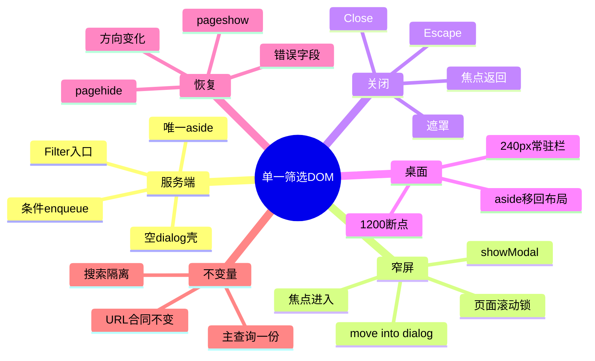
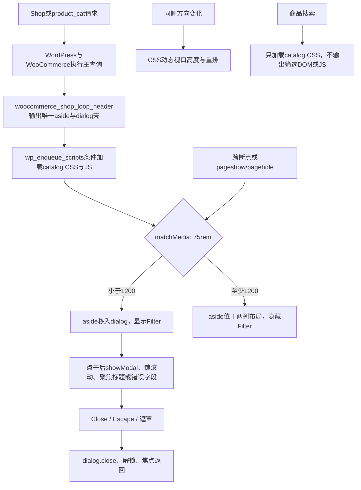

# Day51 WordPress实战：原生Dialog与单一筛选DOM

## 相关笔记

- 学习索引：[[WordPress实战笔记索引]]
- 对应项目笔记：[[../Day51-手机与平板筛选抽屉]]
- 前置学习笔记：[[Day50-WooCommerce链接式筛选与参数治理]]
- 同主题知识：[[Day34-响应式导航状态与断点收敛]]、[[Day49-WooCommerce属性查询表与商品级筛选]]
- 后续学习笔记：[[Day52-WooCommerce原生品牌taxonomy与筛选URL]]

## 今日学习成果

- [x] 我能解释为什么手机抽屉和PC侧栏应复用一份筛选DOM，而不是复制两套WooCommerce控件。
- [x] 我能沿PHP Hook、条件enqueue、原生dialog和断点同步追踪一次打开、关闭与恢复。
- [x] 我能在Local验证焦点、Escape、遮罩、滚动锁、错误/空态、方向变化、BFCache和回滚边界。

## 真实项目场景

### 今天解决了什么问题

Day50已经有可工作的Categories、Price、Size、Shade筛选，但只在1200px以上显示。若直接给手机复制一份控件，Woo选中状态、反向价格错误、URL白名单和可访问名称就会出现两份；若只用CSS把同一侧栏覆盖到页面上，又缺少模态焦点、Escape、遮罩和生命周期清理。Day51因此保留同一aside，用原生`<dialog>`提供窄屏模态容器，并在桌面断点恢复D50侧栏。

### 学习范围

- 本篇要掌握：单一DOM、原生dialog、焦点生命周期、滚动锁、断点/方向/BFCache恢复、WordPress条件enqueue。
- 本篇明确不展开：D50参数清洗内部、品牌模型、AJAX筛选、动画框架、polyfill、严格同Variation查询和Production缓存。
- 项目中的真实入口：`themes/dentall/inc/catalog-filters.php`、`inc/setup.php`、`assets/js/catalog-filters.js`、`assets/css/catalog.css`。
- 验证版本与环境：上方YAML所列Local版本；Staging/Production、真实移动设备和旧浏览器未验证。

## 先建立整体模型

### 一句话模型

服务端只造一个筛选柜，浏览器在窄屏把它推入模态检查间、在桌面把它推回固定展位，并在每次开关或页面生命周期变化后把焦点和滚动状态复原。

### 记忆宫殿：一只商品柜与两个展位

想象商场只有一只装着四组样品的商品柜：PC大厅有固定展位，手机入口旁有一间带门的检查室。工作人员不会复印另一柜商品，而是按大厅宽度移动原柜；顾客进检查室后，大门暂时禁止背景通行，离开时回到入口。停电、旋转楼层图或从历史入口返回时，工作人员必须重新确认柜子、门和入口的状态。

### 比喻对应回真实机制

| 记忆对象 | 真实技术对象 | 不能混淆的边界 |
|---|---|---|
| 唯一商品柜 | `aside#dentall-catalog-filters` | 只是移动DOM，不复制查询、字段或Widget |
| PC固定展位 | `.dentall-catalog-layout`的第一列 | 只在`min-width:75rem`显示为240px列 |
| 检查室 | 原生`dialog.showModal()` | 模态语义来自浏览器，业务状态仍要由脚本维护 |
| 入口和返回点 | `Filter`按钮与焦点返回 | `aria-expanded`必须和实际dialog状态一致 |
| 暂停背景通行 | dialog top layer＋`html/body`滚动锁 | 滚动锁不是焦点约束，二者要分别验证 |
| 重新巡检 | `matchMedia`、动态视口CSS、`pageshow/pagehide` | 同侧方向变化不需要重复JS监听，不能假设页面只经历一次初始加载 |

> [!warning] 比喻边界
> 真实DOM移动会改变父节点和CSS匹配，不是物理复制；原生dialog提供模态树和top layer，但不会替项目自动维护所有`aria-expanded`、跨断点位置、错误字段焦点或BFCache清理。

## 思维导图



最重要的主干是：先保证唯一服务端筛选结构，再让浏览器只改变容器和交互状态，不能让响应式外观反过来复制数据链。

## 请求与生命周期调用链



- 触发条件：非搜索且`is_shop()`或`is_product_category()`。
- 加载入口：子主题`inc/setup.php`的`wp_enqueue_scripts`优先级45。
- 执行顺序：服务端输出唯一结构；浏览器脚本定位五个必需节点；能力检测通过后执行`syncLayout()`。
- 输入数据：当前页面身份、75rem媒体查询、dialog开关状态、当前焦点及价格错误ARIA。
- 输出或副作用：移动现有DOM、显示/关闭dialog、更新ARIA、焦点和CSS锁类；没有业务数据写入。
- 可观察证据：DOM数量与父节点、计算样式、焦点、`aria-expanded`、滚动类、URL、Head、Console和资源请求。

## 核心概念卡

| 概念 | 准确定义 | DentAll真实例子 | 常见误区 | 如何验证 |
|---|---|---|---|---|
| 单一DOM | 一个语义对象只有一份活动节点 | Categories/Price/Size/Shade只在一个aside | 两份HTML绑定同一URL就等价 | 统计ID、aside和四组筛选数量 |
| 原生模态dialog | `showModal()`把dialog置于top layer并让页面其余区域失活 | 小于1200px的筛选面板 | 只加`position:fixed`就是模态 | 检查`dialog.open`、键盘与背景焦点 |
| 焦点生命周期 | 打开、操作、关闭和断点变化中有可预测焦点目标 | 标题/错误字段→关闭→Filter | 浏览器会自动满足所有业务要求 | 逐路径读取`document.activeElement` |
| 滚动锁 | 模态打开时阻止页面根滚动 | 给`html/body`加同一open类 | `overflow:hidden`会自动约束焦点 | 分别验证滚动和Tab |
| 断点同步 | DOM位置、可见入口和模态状态随媒体查询一致变化 | 1199抽屉，1200侧栏 | CSS隐藏按钮就完成状态迁移 | 打开后跨1200并读父节点/锁/焦点 |
| BFCache恢复 | 页面从浏览历史缓存恢复时重新同步运行态 | `pageshow/pagehide`清理dialog | 返回页面一定重新执行整段JS | 打开→离页→返回验证状态 |
| 渐进增强 | 能力不可用时不暴露失效交互并保留核心内容 | 不支持dialog时Filter保持hidden | 必须为所有旧环境复制自定义模态 | 模拟无`showModal`并查按钮/桌面侧栏 |

## 项目实战代码

> [!important] 代码真实性
> 下列均为当前DentAll源码的最小节选；WordPress、WooCommerce、Storefront和第三方插件核心没有修改。

### 涉及文件

- `app/public/wp-content/themes/dentall/inc/catalog-filters.php`：一次性入口、唯一aside、抽屉头和dialog壳。
- `app/public/wp-content/themes/dentall/inc/setup.php`：目录CSS及筛选JS的页面身份加载。
- `app/public/wp-content/themes/dentall/assets/js/catalog-filters.js`：dialog、焦点、断点和页面生命周期。
- `app/public/wp-content/themes/dentall/assets/css/catalog.css`：按钮、面板、遮罩、滚动锁与桌面两列布局。

### 从入口开始追踪

1. `functions.php`沿D50既有加载进入`catalog-filters.php`，注册Woo Hook。
2. `woocommerce_shop_loop_header`输出唯一筛选aside和空dialog；顶部/空结果Hook各可尝试输出入口，但静态变量确保只出现一次。
3. `wp_enqueue_scripts`只在真实目录筛选归档加载脚本，商品搜索不会下载无用交互资源。
4. 脚本先能力检测，再由`syncLayout()`决定aside父节点和入口可见性。
5. 用户打开时调用`showModal()`；关闭事件统一复原ARIA、滚动与焦点。
6. 跨断点或历史缓存变化时再次同步；同侧方向变化交给动态视口CSS；删除脚本后，小屏入口仍因服务端`hidden`而不会失效暴露。

### 关键代码片段一：服务端只输出一次入口

源文件：`inc/catalog-filters.php`，节选。

```php
function dentall_catalog_filter_toggle() {
    static $rendered = false;

    if ( $rendered || ! dentall_is_catalog_filter_archive() ) {
        return;
    }

    $rendered = true;
    // 输出hidden按钮；能力检测通过后再由JS显示。
}
```

正常列表和Woo空结果使用不同Hook，但`static $rendered`让一个请求最多输出一个入口。`hidden`是渐进增强闸门：脚本确认所有节点及`showModal`可用后才展示。

### 关键代码片段二：按页面身份加载脚本

源文件：`inc/setup.php`，真实节选。

```php
if ( function_exists( 'dentall_is_catalog_filter_archive' ) && dentall_is_catalog_filter_archive() ) {
    wp_enqueue_script(
        'dentall-catalog-filters',
        get_stylesheet_directory_uri() . '/assets/js/catalog-filters.js',
        array(),
        $theme->get( 'Version' ),
        true
    );
}
```

脚本无依赖并在页脚加载。版本直接使用子主题0.27.0，所以部署新文件时缓存键同步变化；这不等于页面缓存策略已验证。

### 关键代码片段三：只移动当前aside

源文件：`assets/js/catalog-filters.js`，节选。

```js
if (desktop.matches) {
    closeDrawer(false);

    if (filters.parentNode === dialog) {
        dialog.parentNode.insertBefore(filters, dialog);
    }

    header.hidden = true;
    trigger.hidden = true;
    return;
}

trigger.hidden = false;

if (filters.parentNode !== dialog) {
    dialog.append(filters);
}
```

父节点判断同时防止重复移动和意外复制。桌面恢复位置依赖PHP让dialog紧跟在aside后面：把aside插到dialog之前即可回到布局第一列。

### 关键代码片段四：关闭统一复原状态

源文件：`assets/js/catalog-filters.js`，节选。

```js
const closeDrawer = (shouldReturnFocus = true) => {
    if (dialog.open) {
        dialog.close();
    }
    trigger.setAttribute('aria-expanded', 'false');
    setScrollLock(false);

    if (shouldReturnFocus && !desktop.matches && !trigger.hidden) {
        window.requestAnimationFrame(() => {
            if (!dialog.open && !desktop.matches && !trigger.hidden) {
                trigger.focus({preventScroll: true});
            }
        });
    }
};

dialog.addEventListener('keydown', (event) => {
	if (event.key === 'Escape') {
		event.preventDefault();
		closeDrawer();
	}
});

dialog.addEventListener('cancel', (event) => {
	event.preventDefault();
	closeDrawer();
});
```

Close按钮、Escape和遮罩最终都进入`closeDrawer()`，在调用`dialog.close()`后同步收口ARIA与滚动状态。Escape优先沿用原生`cancel`语义，同时保留仅匹配Escape的`keydown`兼容兜底；这是因为独立UX自动化所在的嵌入环境未派发`cancel`，而不是用通用键盘处理替代原生事件。独立Review还指出原先监听异步排队的`close`事件可能在快速跨断点或BFCache恢复后清理一次新打开状态；删除共享`returnFocus`并改为同步清理，既减少状态又关闭竞态。`requestAnimationFrame`中的条件会再次确认dialog仍关闭且仍在窄屏，避免延迟焦点污染下一状态。

### 运行证据

- 390/768/1024均只有1个Filter、1个dialog、1个aside；1440同一aside回到布局且为240px。
- 390打开后标题获得焦点；反向价格时第一个无效字段获得焦点；Escape、Close和遮罩均返回入口。
- Tab/Shift+Tab没有进入背景页面；dialog打开时`html/body`锁定，关闭或跨1200后清除。
- 844×390方向变化保持可用且无动画；打开后跨到1440自动关闭并恢复桌面结构。
- 空分类仍有Categories/Price和Woo空态；商品搜索脚本数为0。
- 证据不能证明真实移动操作系统辅助技术、旧浏览器polyfill、Production缓存/CWV或正式目录规模性能。

## 职责边界

| 层级 | 本主题中负责什么 | 不应该负责什么 |
|---|---|---|
| WordPress Core | 页面身份、Hook注册与enqueue管线 | 不修改核心文件，也不让全站无条件加载页面脚本 |
| WooCommerce | 主查询、归档Hook、Layered Nav、价格错误与空态内容 | 不复制模板或绕过查询API |
| Storefront父主题 | 归档容器和既有响应式/Focus基线 | 不直接改父主题CSS/JS |
| DentAll子主题PHP | 输出一次筛选结构并限定脚本页面 | 不管理品牌字段、站点级SEO或业务数据 |
| DentAll子主题JS | 只管理DOM容器、dialog、焦点和生命周期 | 不查询商品、不构造筛选URL、不持久化状态 |
| DentAll子主题CSS | 抽屉外观、滚动面与75rem桌面布局 | 不用视觉隐藏替代请求身份或ARIA |
| 浏览器 | 执行原生dialog、媒体查询、焦点与历史缓存 | 不能用外观证明数据库和SEO事实 |

## Hook、API或浏览器机制详解

| 机制 | 名称/时机 | 输入与输出 | Day51作用 |
|---|---|---|---|
| Action | `woocommerce_before_shop_loop`优先级10 | 输出Filter按钮 | 正常结果工具栏前入口 |
| Action | `woocommerce_no_products_found`优先级5 | 输出同一函数 | 空结果仍有入口；静态变量防重复 |
| Action | `woocommerce_shop_loop_header`优先级20 | 输出aside、dialog和结果容器 | 保持单一服务端结构 |
| Action | `wp_enqueue_scripts`优先级45 | 根据查询身份登记CSS/JS | 搜索隔离与缓存版本 |
| Browser API | `HTMLDialogElement.showModal()` | 打开top-layer模态dialog | 提供原生模态基础 |
| Browser API | `matchMedia('(min-width: 75rem)')` | 布尔匹配和change事件 | 1199/1200布局切换 |
| Browser Event | `cancel`、Escape专用`keydown`与pointer事件 | Escape与遮罩输入 | 原生路径与兼容兜底统一同步恢复，并避免拖动误关 |
| Page lifecycle | `pageshow/pagehide` | 历史缓存进出 | 清除陈旧open/锁状态 |

## 安全、数据与站点影响

| 检查面 | 本次结论 | 证据或待验证项 |
|---|---|---|
| 输入清洗与验证 | D51不新增输入；筛选值继续走D50白名单 | 正常、Size和反向价格请求实测 |
| Capability | 前台只读交互不要求后台能力 | 没有后台动作 |
| Nonce | 不写数据，因此不适用 | nonce不能替代capability，但本轮两者均无写入场景 |
| 输出转义 | PHP文案与ARIA继续用WordPress转义/国际化函数 | 静态源码检查 |
| DOM注入 | 无`innerHTML`或字符串HTML注入 | JS只移动已存在节点 |
| 数据库写入 | 无 | 无AJAX、REST、表单写操作或配置命令 |
| URL与SEO | 不新增参数；D50 noindex/Canonical合同保持 | Local代表参数页Head通过，非Local未验 |
| 缓存 | 主题版本更新JS/CSS缓存键 | 页面缓存/CDN和BFCache是不同层，前者未验 |
| 支付、物流与订单 | 无影响 | 未进入交易链 |
| 部署与回滚 | 仅Local；移除enqueue/JS/壳层/CSS即可回D50 | Staging/Production需另行授权 |

## 动手练习

### 练习一：只读观察

- 目标：证明窄屏和桌面不是两份筛选。
- 操作：在390和1440分别查询`#dentall-catalog-filters`数量、父节点及四组筛选数量。
- 预期：始终只有1个aside；父节点在dialog与页面布局间变化。
- 实际证据：390父节点为dialog，1440父节点为布局；数量均为1。

### 练习二：Local最小改动

- 改动：临时在DevTools把视口从1199改为1200，不修改源码。
- 风险边界：只观察Local运行态，不保存配置或数据。
- 验证：dialog关闭、锁清除、入口隐藏、aside恢复240px桌面列。
- 回滚：恢复视口即可；DevTools临时状态不替代源码。

### 练习三：故障推演

- 假设症状：关闭抽屉后页面仍不能滚动。
- 可能原因：关闭路径没有进入`closeDrawer()`、跨断点分支提前退出、`html/body`某一方仍保留锁类。
- 第一项检查：同时读取`dialog.open`、两处classList和`aria-expanded`。
- 为什么先查它：它能先区分“dialog没关”与“dialog已关但清理遗漏”，再决定追关闭路径还是CSS。

## 常见误区与排错顺序

| 现象或误区 | 可能原因 | 推荐检查顺序 | 最小验证方法 |
|---|---|---|---|
| 页面出现两套筛选 | PHP重复输出或JS clone | 1. 统计ID；2. 查父节点与Hook次数 | `querySelectorAll('#dentall-catalog-filters').length`应为1 |
| Filter可见但点击无效 | JS未加载、能力检测失败或节点缺失 | 1. Network；2. Console；3. 五个必需节点 | 搜索页脚本0是正确，归档页应为1 |
| Escape后仍锁滚动 | 环境未派发`cancel`、兼容兜底缺失或关闭函数遗漏清理 | 1. dialog.open；2. 锁类；3. keydown/cancel与closeDrawer | 按Escape后检查三个状态 |
| 跨1200后侧栏消失 | aside仍留在关闭dialog中 | 1. media匹配；2. aside.parentNode；3. CSS display | 打开后从768改1440 |
| 返回历史页自动重开 | BFCache保留旧open与类 | 1. pageshow；2. dialog.open；3. expanded/锁 | 打开→离页→浏览器返回 |
| 把无动画当无交互 | Reduced Motion与功能被混淆 | 1. 检查实际动画；2. 验证状态立即变化 | 本实现`animation:none`、`transition:0s`但功能完整 |

## 掌握标准

- [ ] 不看笔记，能在2分钟内讲清唯一DOM、dialog与断点恢复的因果链。
- [ ] 能指出四个项目入口文件和三个关键Woo/WordPress Hook。
- [ ] 能区分原生dialog提供的能力与项目仍要维护的ARIA、焦点和滚动状态。
- [ ] 能说明正常关闭、跨断点和BFCache三个恢复路径。
- [ ] 能在Local复演390→1440、错误字段自动打开和搜索资源隔离。
- [ ] 能说明本次对数据、URL、SEO、缓存、交易和部署的真实影响。

当前掌握度：初识；实现和第一轮排错已完成，待费曼自测后评估“能解释/能排错”。

## 费曼测试题（7道）

1. 不使用“DOM”和“模态”术语，怎样解释为什么手机和PC不能各造一套筛选？
2. 商品柜比喻中的柜子、展位、检查室、入口和巡检分别对应什么；比喻在哪一点会失效？
3. 从打开390px Shop开始，按顺序说明PHP输出、enqueue、`syncLayout()`、`showModal()`和关闭事件。
4. 原生dialog已经会模态化，为什么还要维护`aria-expanded`、焦点返回与`html/body`锁？
5. 为什么桌面恢复前要判断`filters.parentNode === dialog`；删除该判断可能带来什么无收益行为？
6. 如何用三组证据区分“脚本没加载”“dialog没关闭”和“已关闭但滚动锁没清理”？
7. 若迁移到Shopify或区块主题，哪些交互不变量应保留，哪些实现不能机械复制？

### 我的费曼答案与纠正

待首次复习时完成。当前7题均标记“含糊/未作答”；若把滚动锁当焦点约束、把两份控件当同一状态或把BFCache当普通刷新，回到生命周期图和概念卡修正。

### 自测评分

总分：待填写 / 14；存在未作答题，掌握度保持“初识”。

## 间隔复习记录

| 复习节点 | 计划日期 | 完成 | 暴露的问题 | 修正位置 |
|---|---|---|---|---|
| D+1 | 2026-09-04 | [ ] | 待填写 | 待填写 |
| D+3 | 2026-09-06 | [ ] | 待填写 | 待填写 |
| D+7 | 2026-09-10 | [ ] | 待填写 | 待填写 |
| D+14 | 2026-09-17 | [ ] | 待填写 | 待填写 |

## 收尾总结

- 我今天真正理解了：响应式抽屉的核心是同一业务对象在不同展示容器间保持身份、状态与恢复路径，而不是画一个固定面板。
- 我仍然容易混淆：浏览器原生模态能力、项目ARIA状态、CSS滚动锁和页面缓存恢复是四个相邻但独立的责任。
- 下次遇到类似问题，我会先统计DOM和资源，再查dialog/焦点/锁状态，随后跨断点与历史返回，最后回归URL、SEO和数据不变量。
- 下一篇直接相关学习笔记：[[Day52-WooCommerce原生品牌taxonomy与筛选URL]]。

## 后续如何向AI高效提问

### 提问公式

`平台/版本 + 页面身份 + 唯一DOM合同 + 断点 + 打开/关闭路径 + 焦点/滚动/BFCache证据 + URL/SEO不变量 + 禁止改动范围`

```text
这是WooCommerce窄屏筛选dialog问题，仅限Local。
环境：[WordPress/Woo/PHP/父子主题版本]
页面与宽度：[Shop或分类，当前视口和断点]
DOM合同：[aside/dialog/trigger数量和父节点]
现象：[打开、Escape、遮罩、焦点、滚动或返回哪里不一致]
证据：[dialog.open、activeElement、aria-expanded、html/body类、Console]
不变量：[D50 URL/主查询/robots/Canonical不能改变]
边界：[不改核心、不复制筛选、不写商品、不装插件、不碰非Local]
请按服务端输出、条件加载、dialog生命周期、CSS和页面恢复顺序给最小修复与回滚。
```

> [!warning] AI验证边界
> `dialog`、焦点和BFCache行为会受浏览器版本、自动化方式与页面脚本影响。AI建议必须回到当前真实DOM、事件、计算样式和Local页面复演；不能用一张打开态截图证明键盘、URL或数据正确。

## 变种应用到其他项目

| 新场景 | 保持不变的原则 | 可能变化的实现 | 必须重新确认 | 最小验证 |
|---|---|---|---|---|
| 另一个经典Woo主题 | 单一筛选状态、焦点返回和断点恢复 | 归档Hook与容器位置 | 主题DOM和Sidebar时机 | 唯一DOM＋开关＋跨断点 |
| WordPress区块主题 | 查询/URL与可访问生命周期不变 | Interactivity API或区块状态 | Product Collection过滤能力 | 编辑器、前台、Head三层 |
| AJAX筛选插件 | 单一状态与恢复仍需明确 | REST/AJAX、History和加载态 | 缓存、取消请求、卸载、许可证 | 网络、URL、结果、焦点、回退 |
| 非原生dialog旧环境 | 不暴露失效入口 | polyfill或非模态降级 | 浏览器支持目标与维护成本 | 键盘、背景失活和关闭路径 |
| Shopify或其他平台 | 同一集合状态、焦点、URL和断点合同 | 主题drawer、平台过滤API，待验证 | 商品/变体语义、发布和索引 | 官方资料＋沙盒真实组合 |

## 可复用核心思想

### 跨平台不变量

同一业务状态应尽量只有一个交互真相源。窄屏抽屉和桌面侧栏需要共同验证打开、关闭、焦点、滚动、断点、方向与历史返回；视觉一致只是其中一层，URL、查询、SEO和数据不变量必须单独证明。

### WordPress/WooCommerce当前实现

DentAll由Woo Hook输出一次筛选aside，`wp_enqueue_scripts`按页面身份加载4077字节原生脚本。脚本使用`HTMLDialogElement`与`matchMedia`移动现有节点并清理生命周期，同侧方向变化由CSS动态视口高度承接；Woo主查询、Layered Nav、参数白名单和`dentall-core` robots政策保持D50职责，不因前端容器变化而重写。

### Shopify或其他平台的对应机制

Shopify或其他平台可能用主题Section、平台过滤API或应用管理筛选与drawer，但依然要回答“状态有几份、URL谁生成、焦点如何返回、缓存返回如何恢复”。DentAll没有验证Shopify具体API和默认索引行为，因此所有一一对应均标记为待验证，不扩展当前实施范围。
