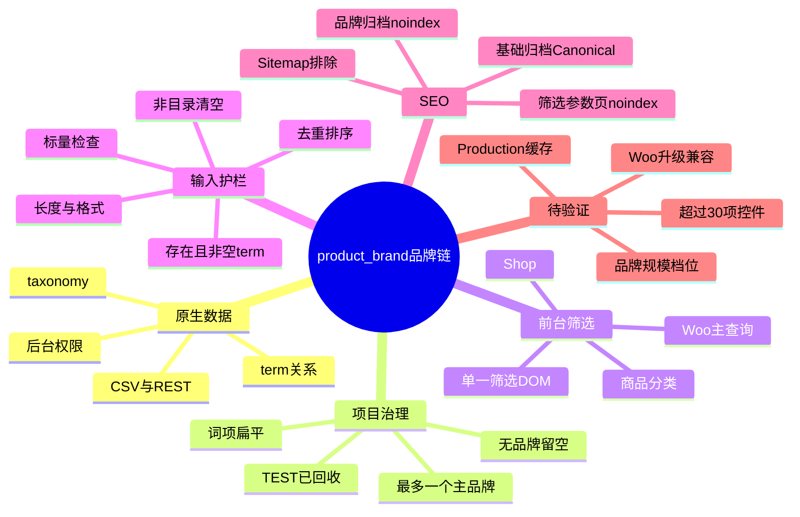
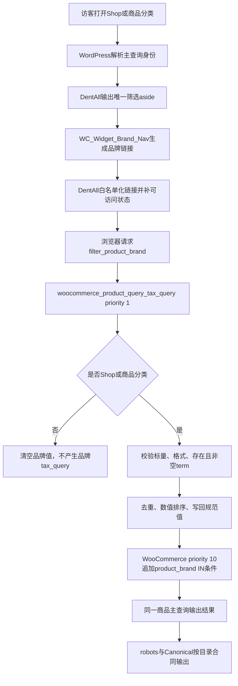

# Day52 WordPress实战：WooCommerce原生品牌taxonomy与筛选URL

## 相关笔记

- 学习索引：[[WordPress实战笔记索引]]
- 对应项目笔记：[[../Day52-品牌数据与筛选基线]]
- 前置学习笔记：[[Day51-原生Dialog与单一筛选DOM]]
- 后续学习笔记：[[Day53-分面计数与筛选状态恢复]]
- 同主题知识：[[Day49-WooCommerce属性查询表与商品级筛选]]、[[Day50-WooCommerce链接式筛选与参数治理]]

## 今日学习成果

- [x] 我能解释为什么品牌应复用WooCommerce 11.0.0原生`product_brand` taxonomy，而不是再建`pa_brand`、CPT或ACF字段。
- [x] 我能沿`filter_product_brand`、DentAll优先级1输入护栏和WooCommerce优先级10处理器，追踪品牌条件如何进入Shop/商品分类主查询。
- [x] 我能验证有效、数组、畸形、空品牌和非目录上下文，并区分筛选参数页与品牌归档的SEO合同及回滚边界。

## 真实项目场景

### 今天解决了什么问题

Day49到Day51已经完成分类、价格、Size、Shade的商品发现链，但品牌仍没有正式数据载体。WooCommerce 11.0.0本身已注册`product_brand`、后台词项界面、商品关系、归档、REST/CSV、商品详情输出、Schema和品牌筛选查询。Day52因此不复制品牌模型，只把原生品牌接入D50/D51现有单一筛选DOM，并补上项目级数据治理、输入边界、URL白名单和SEO规则。

实现过程中发现一个高风险边界：WooCommerce原生查询处理器会直接读取公开`$_GET['filter_product_brand']`。如果请求把该参数构造成数组，或把有效品牌参数带到商品搜索等未开放筛选的上下文，只在“输出品牌UI”处判断页面身份并不够。DentAll最终把护栏注册在同一个Woo查询Filter上，并以更早优先级规范化输入；UI仍只出现在Shop与商品分类，但输入保护覆盖Woo Hook可能运行的上下文。

### 学习范围

- 本篇要掌握：原生`product_brand` taxonomy、项目治理与平台能力的区别、品牌筛选Hook顺序、GET输入清洗、白名单URL、空品牌语义、可访问选中态和SEO边界。
- 本篇明确不展开：品牌Logo墙、商品卡品牌行、D57商品详情视觉重排、AJAX、计数、Chips、Reset、严格同Variation查询、可索引品牌内容运营和Production缓存。
- 项目中的真实入口：`themes/dentall/inc/catalog-filters.php`、`plugins/dentall-core/includes/seo-compatibility.php`、`project-docs/tests/day52-brand-audit.php`，以及只读核对的WooCommerce `includes/class-wc-brands.php`和`includes/admin/class-wc-admin-brands.php`。
- 验证版本与环境：上方YAML所列Local版本；Staging/Production、正式品牌数据、真实目录规模和生产缓存未验证。

## 先建立整体模型

### 一句话模型

WooCommerce提供一套品牌户籍与查询引擎，DentAll只规定谁能登记、哪些品牌可进入当前目录请求、URL怎样规范化，以及这些页面能否被搜索引擎收录。

### 记忆宫殿：商场品牌登记处、门禁和导购牌

把商城想成一座商场。WooCommerce的品牌登记处维护品牌档案和商品所属关系；Shop与商品分类旁的导购牌允许顾客勾选品牌；门禁先检查导购牌上的编号是不是标量、格式正确、真实存在且有商品，再把合法编号交给商场查询系统。没有品牌的商品保持“未登记”，不会虚构一个`Unknown`柜台。品牌专厅虽然有`/brand/{slug}/`门牌，但第一版暂不让搜索引擎收录。

### 比喻对应回真实机制

| 记忆对象 | 真实技术对象 | 不能混淆的边界 |
|---|---|---|
| 品牌登记处 | WooCommerce注册的`product_brand` taxonomy | taxonomy允许层级和多词项，不等于项目已允许多品牌或层级品牌 |
| 商品所属卡 | Product与`product_brand` term relationship | “最多一个主品牌”是当前治理规则，不是新增的保存时硬约束 |
| 导购牌 | `WC_Widget_Brand_Nav`输出的文字列表 | 本版只在Shop/商品分类输出；它是Woo内部经典Widget兼容点，不是永久稳定承诺 |
| 门禁 | `dentall_catalog_filter_prepare_brand_query()`与集中清洗函数 | 不能只保护页面UI；手写URL也会进入Woo查询Hook |
| 编号串 | `filter_product_brand=12,34` | 值是term ID列表，不是slug、品牌名或自由文本 |
| 空白所属卡 | 商品没有分配`product_brand` | 不创建`Unknown`或`Unbranded`伪品牌，也不让空品牌成为筛选项 |
| 品牌专厅门牌 | `/brand/{slug}/` | URL存在不代表允许索引；第一版为noindex且不进Sitemap |

> [!warning] 准确性检查
> WooCommerce原生taxonomy技术上是`hierarchical=true`，也能给一个商品分配多个品牌；DentAll当前只通过治理和审计保持“词项扁平、已发布商品最多一个主品牌”，没有增加保存阻断。不能把当前数据通过误写为平台强制约束。

## 思维导图



最重要的主干是：平台能力只提供“能做什么”，项目还必须单独冻结数据语义、允许上下文、输入合同和索引政策。

## 请求与生命周期调用链



- 触发条件：请求包含`filter_product_brand`，或Shop/商品分类正在输出品牌Widget。
- 加载入口：子主题`functions.php`加载`inc/catalog-filters.php`；其中在`woocommerce_product_query_tax_query`注册优先级1护栏。
- 执行顺序：DentAll先判断页面身份和规范化GET，WooCommerce原生`WC_Brands::update_product_query_tax_query()`随后在优先级10消费该值。
- 输入数据：公开GET中的品牌term ID串，以及当前数据库中`hide_empty=true`的`product_brand` term集合。
- 输出或副作用：合法目录请求得到规范化参数并由Woo主查询追加`product_brand`的`IN`条件；非法、数组、空品牌或非目录上下文不产生品牌条件。函数会在本次请求内改写该GET键，不写数据库。
- 可观察证据：URL参数、最终tax query、商品结果、选中链接ARIA、robots、Canonical、Sitemap，以及清理前19/19正向只读审计和清理后恢复态审计。

## 核心概念卡

| 概念 | 准确定义 | DentAll真实例子 | 常见误区 | 如何验证 |
|---|---|---|---|---|
| taxonomy | WordPress对对象进行可查询分组的注册体系，由term与relationship承载数据 | `product_brand`附着在`product` | 把品牌再建成Product Attribute或CPT | `get_taxonomy('product_brand')`和`wp_get_post_terms()` |
| 项目治理 | 在平台允许范围内约定业务语义与数据质量 | term扁平、已发布商品最多一个主品牌、无品牌留空 | 以为taxonomy注册参数会自动强制这些规则 | 只读审计当前term父级和商品品牌数量 |
| 输入护栏 | 在下游读取前把公开输入限制为安全、可预测合同 | 优先级1校验数组、格式、长度、真实非空term及上下文 | 只清洗UI生成的链接，忽略手写请求 | 直接向Hook传数组、畸形和非目录上下文 |
| 空品牌 | 商品没有品牌term关系 | 未分配品牌的商品照常存在，但不产生“无品牌”筛选项 | 创建`Unknown`来填满必填项 | 检查term关系与`hide_empty=true`集合 |
| 筛选参数URL | 基础归档加非索引查询状态 | `/shop/?filter_product_brand={term_id}` | 把参数页当品牌内容页索引 | 检查robots与基础归档Canonical |
| 品牌归档 | taxonomy term的独立归档URL | `/brand/{slug}/` | URL能访问就等于SEO已批准 | 检查noindex、Canonical和Sitemap |

## 项目实战代码

> [!important] 代码真实性
> 下列片段来自DentAll当前运行源码；WooCommerce文件只作只读机制核对，未修改核心或第三方文件。

### 涉及文件

- `app/public/wp-content/themes/dentall/inc/catalog-filters.php`：页面身份、集中参数清洗、品牌Hook护栏、Widget输出、链接与ARIA适配。
- `app/public/wp-content/plugins/dentall-core/includes/seo-compatibility.php`：Shop/商品分类筛选参数页的站点级robots政策。
- `project-docs/tests/day52-brand-audit.php`：Local环境门禁及19项品牌数据、权限、URL、查询、CSV与治理只读审计。
- `app/public/wp-content/plugins/woocommerce/includes/class-wc-brands.php`：只读核对原生taxonomy、商品详情、Schema、Widget和查询处理器。
- `app/public/wp-content/plugins/woocommerce/includes/admin/class-wc-admin-brands.php`：只读核对后台及原生CSV列映射。

### 从入口开始追踪

1. 入口在哪里：`catalog-filters.php`末尾把`dentall_catalog_filter_prepare_brand_query()`挂到`woocommerce_product_query_tax_query`优先级1。
2. 为什么此时加载：WooCommerce正在形成商品主查询的taxonomy条件，且其原生品牌处理器会在同一Filter优先级10读取GET。
3. 调用了哪个API或Hook：WordPress条件标签、`get_terms()`、`wp_unslash()`、`absint()`，以及WooCommerce的查询Filter和`WC_Widget_Brand_Nav`。
4. 最终影响哪个页面、数据或资源：品牌UI只影响Shop/商品分类；查询护栏在Hook层覆盖其他Woo上下文并把品牌值清空；不写商品、term或选项。
5. 如果移除这段代码：Woo原生处理器仍可能读取手写的数组/畸形参数；非目录请求也可能被品牌条件改变，D47搜索隔离和错误安全边界失效。

### 关键代码片段

源文件：`app/public/wp-content/themes/dentall/inc/catalog-filters.php`。先限制页面身份，再在Woo读取GET前处理。下方明确为简化示例：省略PHPCS行内说明，并把源码的等价`if/else`赋值压成一行；项目现状仍以真实文件为准。

```php
function dentall_catalog_filter_prepare_brand_query( $tax_query ) {
	if ( ! array_key_exists( 'filter_product_brand', $_GET ) ) {
		return $tax_query;
	}

	if ( ! dentall_is_catalog_filter_archive() ) {
		$_GET['filter_product_brand'] = '';
		return $tax_query;
	}

	$clean = dentall_catalog_filter_sanitize_query_args(
		array( 'filter_product_brand' => $_GET['filter_product_brand'] )
	);
	$_GET['filter_product_brand'] = $clean['filter_product_brand'] ?? '';

	return $tax_query;
}

add_filter(
	'woocommerce_product_query_tax_query',
	'dentall_catalog_filter_prepare_brand_query',
	1
);
```

上面为便于学习省略了源码中的PHPCS说明注释，控制流与真实代码一致。

源文件：同上。品牌参数只接受由数字和逗号组成的有限长度字符串，并只保留当前有商品的真实term ID。

```php
if (
	isset( $source['filter_product_brand'] )
	&& is_string( $source['filter_product_brand'] )
) {
	$value = trim( wp_unslash( $source['filter_product_brand'] ) );

	if ( strlen( $value ) <= 512 && 1 === preg_match( '/^\d+(?:,\d+)*$/D', $value ) ) {
		// 读取hide_empty=true的ID，随后求交集、去重并按数值排序。
	}
}
```

| 代码 | 表面动作 | WordPress/WooCommerce中的真实作用 | 为什么这样写 |
|---|---|---|---|
| `array_key_exists()` | 检查参数键 | 区分“没有筛选参数”和“键存在但值非法/为空” | 后者仍需保持参数页noindex边界 |
| `is_string()` | 拒绝数组 | 避免数组流入Woo原生字符串处理链 | 关闭本日发现的P1输入风险 |
| `hide_empty => true` | 只取有商品term | 空品牌term不能形成可点击或可执行筛选 | 空品牌不应得到伪结果合同 |
| 去重＋`SORT_NUMERIC` | 规范ID顺序 | 相同品牌集合生成唯一、稳定的URL状态 | 降低重复URL和缓存键分裂 |
| 优先级`1` | 提前执行 | 先于WooCommerce优先级10品牌处理器 | 保护真正消费输入的位置 |
| 非目录写空字符串 | 禁止条件进入查询 | Widget虽不输出，手写参数也不能改变搜索等上下文 | UI范围和请求安全边界必须分开设计 |

### 运行证据

- 使用的命令：`php -l app/public/wp-content/themes/dentall/inc/catalog-filters.php`、`php -l project-docs/tests/day52-brand-audit.php`、`php -d mysqli.default_port=10011 C:\wp-cli\wp-cli.phar eval-file project-docs/tests/day52-brand-audit.php --path=app/public`。
- 清理前正向审计：两个PHP文件语法通过；2个TEST品牌已关联商品时，只读审计19/19 PASS，运行摘要为`brands=2 published_products=2 assigned_products=2`，并与浏览器中的筛选结果、选中态和移除链接相互印证。
- 清理前关键通过项：原生taxonomy与权限、CSV列合同/导出关系、有效ID去重排序、Widget白名单、选中项`aria-current`与移除标签、Shop主查询接收规范值、非目录忽略、空品牌不筛选、品牌term扁平及已发布商品最多一个品牌。
- 清理前失败或边界结果：数组、畸形、不存在ID被清空且不生成品牌tax query；Shop参数键仍触发`noindex, follow`；商品搜索等非目录上下文即使收到有效ID也忽略品牌条件。
- 真实零组合证据：将临时term 32关联到商品#44后，分类#18＋品牌term 32＋`Large`（仅商品#46具备）得到0个结果；Brand选中态的移除链接仍然可见并可用键盘操作。验证后已删除term 32并清理品牌计数transient。
- SEO证据：品牌筛选参数页保持基础归档Canonical；`/brand/{slug}/`第一版为noindex，当前无Canonical且从Sitemap排除。
- 清理后恢复态审计：term 29、30及临时term 31、32均已删除，商品#44与#46的品牌关联均为0，品牌计数transient已删除；恢复态摘要为`brands=0 assigned_products=0`并输出19项PASS。由于无品牌时正向分支会按条件跳过，这组结果只证明Local已回到干净基线及无条件检查仍成立，不能单独称为完整正向覆盖。
- 证据能证明什么：清理前正向审计与浏览器证据证明WooCommerce 11.0.0当前品牌代码合同成立；真实零组合证明无结果时仍保留可访问的已选Brand移除入口；清理后恢复态审计证明TEST数据已精确回收。品牌接入没有另建商品查询或第二套筛选DOM。
- 证据不能证明什么：正式品牌名称/归属、31个以上品牌的控件体验、Production缓存与抓取、未来Woo版本兼容，以及真实编辑的大批量录入效率。

> [!warning] TEST数据已回收
> 清理前的2个已关联TEST品牌以及临时零组合term只用于Local验收。term 29、30、31、32现均已删除，商品#44与#46的品牌关联均为0，品牌计数transient亦已删除；这些历史TEST数据不是正式品牌目录，不能部署、导入Production或作为业务归属证据。

## 职责边界

| 层级 | 本主题中负责什么 | 不应该负责什么 |
|---|---|---|
| WordPress Core | taxonomy、term、relationship、条件标签、Hook与转义API | 不修改核心文件，不替业务判断品牌归属 |
| WooCommerce | 注册`product_brand`，提供后台、关系、归档、Widget、主查询、详情、Schema、REST/CSV | 不假设其内部Widget类永远不变，不绕过公开数据API |
| Storefront父主题 | 提供经典商品归档与商品详情Hook结构 | 不直接修改父主题，不在父主题保存DentAll规则 |
| DentAll子主题 | 在Shop/分类输出品牌筛选，清洗参数、白名单化链接并补ARIA | 不新建跨主题品牌数据模型，不承担品牌正式内容 |
| `dentall-core` | 维护跨主题的筛选参数robots政策 | 不堆放纯展示HTML或Widget样式 |
| 数据库与媒体 | 保存term关系及Local TEST样本 | 不把TEST、Logo占位或推测归属当正式数据 |
| 浏览器 | 发起GET、展示单一筛选DOM与选中态 | 不把可见列表当成权限、数据或SEO已正确的证明 |

## Hook、API或模板机制详解

| 项目 | 说明 |
|---|---|
| 机制类型 | Filter＋taxonomy＋经典Widget |
| 名称或入口 | `woocommerce_product_query_tax_query`、`woocommerce_layered_nav_link`、`WC_Widget_Brand_Nav` |
| 注册位置 | DentAll子主题`inc/catalog-filters.php`；Woo原生处理器位于`includes/class-wc-brands.php` |
| 默认优先级或查找顺序 | DentAll护栏优先级1；Woo原生品牌tax query处理器优先级10 |
| 回调输入 | 当前tax query数组，以及请求中的`filter_product_brand` |
| 必须返回内容 | 两个Filter回调都必须返回tax query；DentAll只规范GET，不直接重复添加品牌条件 |
| 副作用 | 仅本次请求内把品牌GET规范为排序后的真实term ID串或空字符串 |
| 影响范围 | UI仅Shop/商品分类；护栏覆盖该Woo Filter触发的上下文，并在非目录上下文禁用品牌条件 |
| 移除或覆盖方式 | 移除DentAll优先级1回调及品牌Widget输出即可回退，但必须重测数组参数、搜索隔离、URL与SEO |

### 为什么不直接自己写`tax_query`

WooCommerce已经在优先级10把合法品牌ID转为`product_brand`、`operator=IN`的查询条件。DentAll若再追加一份，会产生重复条件、计数与未来兼容负担。项目代码只负责先把输入变成Woo可以安全消费的规范值，让结果继续来自同一原生主查询。

### 为什么Widget兼容仍记P3

`WC_Widget_Brand_Nav`在WooCommerce 11.0.0真实存在且已通过Local验证，但它是Woo插件内部的经典Widget类，不是DentAll拥有的稳定接口。未来Woo升级可能调整类名、HTML、Hook或Blocks方向；升级回归至少要检查类是否存在、链接格式、选中class、ARIA补丁、查询结果和空输出。当前可用不等于永久兼容。

## 安全、数据与站点影响

| 检查面 | 本次结论 | 证据或待验证项 |
|---|---|---|
| 输入清洗与验证 | 已覆盖标量、长度、格式、存在、非空、去重、排序和页面上下文 | 数组与畸形参数审计通过；未来Woo升级须复测 |
| Capability | 复用原生商品term能力；Website Manager可管理/分配，Content Editor只可分配已有品牌 | 清理前19/19正向审计通过；未新增角色或capability |
| Nonce | 前台GET筛选不写数据，不需要nonce；后台品牌写入继续由WordPress/Woo原生表单负责 | nonce不能替代后台capability；本轮未重写保存动作 |
| 输出转义 | 品牌链接经`esc_url()`，标签经解码后用`esc_html()`，ARIA用`esc_attr()` | 特殊字符选中标签审计通过 |
| 数据库写入 | 实施期使用可逆Local TEST term/关系；审计脚本本身只读 | TEST term、商品关系与品牌计数transient均已回收；无正式商品或Production写入 |
| URL与SEO | 筛选参数页noindex/follow＋基础归档Canonical；品牌归档noindex、无Canonical且不进Sitemap | 非Local抓取、正式内容和缓存未验 |
| 缓存 | 规范ID顺序减少等价URL分裂；未改缓存策略 | Production查询参数缓存键留部署前验证 |
| 支付、物流与订单 | 不适用，无变更 | 未进入购物车、结账、库存扣减或订单流程 |
| 部署与回滚 | 仅Local；TEST数据已恢复到变更前空基线，代码仍可独立回滚 | Staging/Production未部署 |

## 动手练习

### 练习一：只读观察

- 目标：看清“平台允许”与“项目治理”不是一回事。
- 操作：用WP-CLI读取`get_taxonomy('product_brand')`，再运行Day52只读审计。
- 预期：taxonomy显示`hierarchical`、后台与REST能力；项目数据仍满足term扁平、商品最多一个品牌。
- 实际证据：清理前2个TEST品牌已关联商品时19/19正向审计PASS，term无父级，2个已发布TEST商品各不超过一个品牌；清理后恢复态为`brands=0 assigned_products=0`，其正向分支因无品牌而条件跳过，不能替代前述正向证据。

### 练习二：Local最小改动

- 改动：仅对明确TEST商品分配可逆TEST品牌，再观察Shop品牌筛选、商品详情和Schema。
- 风险边界：仅Local；不创建`Unknown`，不修改正式内容、核心、真实支付或Production数据。
- 验证：商品关系、筛选结果、选中态ARIA、详情品牌和Schema保持同一term事实。
- 回滚结果：已按变更前快照解除关系并删除term 29、30、31、32，商品#44与#46的品牌关联均为0，品牌计数transient已删除；随后恢复态审计输出19项PASS，但此结果不替代清理前的正向覆盖证据。

### 练习三：故障推演

- 假设症状：`?filter_product_brand[]=1`导致商品页报错，或商品搜索被品牌参数意外缩小。
- 可能原因：护栏晚于Woo执行、只在UI上下文注册，或非目录分支没有清空GET。
- 第一项检查：用`has_filter()`确认回调优先级1，再直接对`woocommerce_product_query_tax_query`应用数组和非目录夹具。
- 为什么先查它：问题发生在模板输出前的主查询阶段，先证明Hook顺序比先调CSS或Widget模板更接近根因。

## 常见误区与排错顺序

| 现象或误区 | 可能原因 | 推荐检查顺序 | 最小验证方法 |
|---|---|---|---|
| 品牌链接可见但结果未筛选 | term为空、ID被护栏丢弃、页面不是允许目录、Woo Hook未运行 | 1. 查URL值；2. 查term与count；3. 查Hook/tax query | 运行审计中的有效Shop夹具 |
| 数组参数触发错误 | 输入在Woo字符串处理前未转为空值 | 1. 查优先级1；2. 查`is_string()`；3. 查最终tax query | 传`filter_product_brand[]=1`并确认无品牌条件 |
| 搜索页被品牌缩小 | 只隐藏UI，没有保护手写GET | 1. 查请求身份；2. 查非目录分支；3. 查Woo最终tax query | 非目录夹具应把GET置空 |
| 空品牌仍出现在列表 | 使用`hide_empty=false`或伪造`Unknown`term | 1. 查term关系；2. 查Widget数据源；3. 查业务数据 | 空term ID必须被清洗函数拒绝 |
| 同一品牌集合出现多种URL | ID未去重排序，Widget辅助参数或未知键被传播 | 1. 查清洗输出；2. 查Widget链接Filter；3. 查分页/排序链接 | 反序＋重复ID应输出同一规范串 |
| 归档noindex却仍进Sitemap | Yoast taxonomy设置、缓存或环境配置未一致 | 1. 查option；2. 查Head；3. 查Sitemap；4. 清缓存复测 | 同一term交叉验证三层输出 |

## 掌握标准

- [ ] 不看笔记，能在2分钟内讲清整体因果链。
- [x] 能指出项目中的真实入口文件、Hook和Woo原生处理器。
- [x] 能区分Woo原生taxonomy能力与DentAll数据治理。
- [x] 能说明正常路径、数组P1、空品牌和搜索隔离的检查顺序。
- [x] 能在Local运行只读审计，并说清TEST数据和代码回滚方法。
- [x] 能判断本主题影响数据、URL、SEO、缓存和部署，但不影响支付、物流或订单。

当前掌握度：初识。代码与证据已经可以追踪；2分钟脱稿讲解和开发者本人费曼自测尚未完成，因此不提升等级。

## 费曼测试题（7道）

1. 为什么`product_brand`适合当品牌真相源，而`pa_brand`、Product Tag或品牌CPT会制造重复职责？
2. WooCommerce允许层级和多品牌，DentAll为什么仍能采用“扁平＋最多一个主品牌”，这条规则目前由什么保证？
3. 从点击品牌链接开始，按优先级讲出参数怎样进入Woo主查询；DentAll为什么不自己再追加一份`tax_query`？
4. 为什么只在Shop/分类显示UI还不够？数组参数和商品搜索分别可能暴露什么问题？
5. 无品牌商品留空、空品牌term不筛选、非法参数保留空键供noindex判断，这三件事有什么区别？
6. 品牌筛选参数页与`/brand/{slug}/`在Canonical、robots和Sitemap上分别采用什么合同？
7. 若品牌实际规模超过30或WooCommerce升级，你会先检查哪些证据，为什么不能直接沿用当前文字列表？

### 我的费曼答案与纠正

待开发者按题作答。每题需要同时给出通俗解释、准确术语和DentAll证据；重点回看“请求与生命周期调用链”“Hook机制详解”和“安全、数据与站点影响”。任何一题只能背术语时标记为`含糊`，不要因19/19自动把掌握度提升为“能解释”。

### 自测评分

| 分数 | 标准 |
|---:|---|
| 0 | 无法解释，或把治理规则误说成Woo硬约束 |
| 1 | 能说定义，但说不清Hook顺序、SEO差异或证据边界 |
| 2 | 能用通俗语言解释，并准确对应代码、请求和Local证据 |

总分：待自测 / 14。存在0分题时不提升掌握度。

## 间隔复习记录

| 复习节点 | 计划日期 | 完成 | 暴露的问题 | 修正位置 |
|---|---|---|---|---|
| D+1 | 2026-09-05 | [ ] | 尚未到期 | — |
| D+3 | 2026-09-07 | [ ] | 尚未到期 | — |
| D+7 | 2026-09-11 | [ ] | 尚未到期 | — |
| D+14 | 2026-09-18 | [ ] | 尚未到期 | — |

## 收尾总结

- 我今天真正理解了：复用原生品牌不是“少写一个字段”，而是让后台、商品关系、查询、CSV、详情和Schema继续共享一个真相源，再把项目规则放在最小扩展点上。
- 我仍然容易混淆：Woo技术上允许的层级/多品牌，与DentAll当前通过治理和审计维持的扁平/单主品牌。
- 下次遇到类似问题，我会先检查：平台是否已有完整数据模型，以及公开输入在哪个Hook、什么优先级被真正消费。
- 下一篇直接相关学习笔记：[[Day53-分面计数与筛选状态恢复]]；已完成双向回填。

> [!warning] 规模决策的时间边界
> D52收尾时，用户尚未在`≤30`、`31～100`、`>100`三个互斥品牌规模档位中选定一个；当时清理前2个TEST品牌只能证明最小文字列表成立，随后恢复为0品牌。D53已确认首版预计30个有效品牌，并用30品牌/30商品Local夹具验证完整文字列表、动态计数、冷暖缓存和四端交互；TEST最终再次回收为0品牌。该证据仍不外推到超过30项的目录。

## 后续如何向AI高效提问

### 提问公式

`真实Woo版本 + 请求上下文 + 品牌term与商品关系 + 最小Hook代码 + 原始/规范化GET + tax query/Head证据 + 不可触碰边界`

### 提问前准备

- WordPress、WooCommerce、PHP、主题和Yoast版本，以及Local/Staging/Production身份。
- 页面是Shop、商品分类、品牌归档、商品搜索还是其他Woo查询上下文。
- 原始`filter_product_brand`、护栏后的值、term是否存在且非空。
- `has_filter()`优先级、最终tax query、页面结果、robots、Canonical和Sitemap证据。
- 删除Cookie、密钥、真实客户资料及未经授权的正式品牌清单。

### 可复制的代码理解提示词

```text
你是我的WooCommerce实战教练。请只基于下面的真实版本、源码和证据解释品牌查询，不要假设插件或字段。

环境：[WordPress/WooCommerce/PHP/主题/Yoast版本，Local或Staging]
页面身份：[Shop/商品分类/品牌归档/商品搜索]
真实入口：[catalog-filters.php中的函数与Hook]
输入：[原始filter_product_brand及term状态]
证据：[Hook优先级、最终GET、tax query、结果、robots、Canonical]

请按“WordPress解析页面 → DentAll优先级1护栏 → Woo优先级10处理 → 主查询 → SEO输出”解释，区分平台能力、项目治理、已验证事实和待验证项，并给最小只读复演与回滚。边界：不改核心、不写Production、不创造正式品牌事实。
```

### 可复制的排错提示词

```text
这是WooCommerce product_brand筛选排错。

预期：[哪些页面允许筛选]
实际：[错误、未筛选或错误筛选]
请求参数：[含数组/畸形/空值等原始形态]
term与商品关系：[只给TEST或脱敏事实]
Hook证据：[priority 1与priority 10]
SEO证据：[robots/Canonical/Sitemap]
已尝试：[最小步骤]

请先判断问题属于页面身份、输入清洗、Widget链接、Woo tax query、数据关系还是SEO输出；按风险和概率给只读检查，不先建议重写查询或安装插件。
```

> [!warning] AI验证边界
> `WC_Widget_Brand_Nav`和Woo内部品牌实现会随版本变化。AI解释不能代替当前插件源码、Hook优先级、Local审计和浏览器Head证据；涉及正式品牌归属时必须由业务方确认。

## 变种应用到其他项目

| 新场景 | 保持不变的原则 | 可能变化的实现 | 必须重新确认 | 最小验证 |
|---|---|---|---|---|
| 另一个Storefront子主题 | 单一品牌真相源、先护栏后查询、URL/SEO分层 | 筛选容器、样式和已有Hook组合 | Woo版本、品牌是否启用、现有数据 | taxonomy＋有效/非法请求＋Head |
| 使用其他经典主题的Woo商城 | 原生主查询和公开输入边界不变 | 归档输出Hook、Sidebar与CSS | 主题模板、Widget兼容 | Shop/分类/搜索三页 |
| WordPress区块主题 | 数据治理和请求合同不变 | Product Collection、Filter区块或Interactivity API | 当前Woo Blocks对品牌的支持 | 编辑器与前台请求交叉验证 |
| 独立插件中的相似功能 | 站点级数据模型与主题展示解耦 | 插件注册taxonomy及查询适配 | 是否真的缺少平台原生能力 | 停用、迁移、权限、SEO回归 |
| Shopify或其他平台 | 规范品牌值、空值语义、集合与索引政策 | Vendor、metafield、Search & Discovery或应用，待验证 | 官方能力、URL、权限、过滤语义 | 官方资料＋沙盒代表数据 |

### 变种练习

选择WordPress区块主题场景，不写代码，先回答：

1. 原业务问题仍是让品牌只有一个数据真相源，并安全参与商品发现。
2. 可直接迁移的原则是品牌语义先冻结、公开输入先验证、筛选URL与品牌内容页分开治理。
3. 必须丢弃或替换的是Storefront经典Hook、`WC_Widget_Brand_Nav` HTML和DentAll当前aside/dialog容器。
4. 最小查证是当前Woo版本的Product Collection品牌过滤支持、请求参数和SEO输出。
5. 通过真实term、正常/空/非法请求和Head证据验证，避免因界面相似就假设查询语义一致。

## 可复用核心思想

### 跨平台不变量

品牌不是一段展示文字，而是“规范身份＋商品关系＋发现入口＋内容URL＋索引政策”的组合。先冻结业务语义与空值，再选择平台字段；输入验证必须放在真正消费参数的边界之前，不能依赖界面只生成正确链接。

### WordPress/WooCommerce当前实现

DentAll在WooCommerce 11.0.0 Local复用`product_brand` taxonomy、原生后台/CSV/详情/Schema及主查询。子主题用优先级1护栏限制`filter_product_brand`为Shop/商品分类中的真实非空term ID，并复用原生优先级10的`IN`条件；链接统一进入D50白名单和D51单一DOM。筛选参数页保持noindex/follow与基础归档Canonical，品牌归档单独noindex且不进Sitemap。

### Shopify或其他平台的对应机制

Shopify可能使用Vendor、metafield、集合过滤或Search & Discovery能力，但具体字段唯一性、URL、索引和主题过滤API尚未在DentAll验证，必须标记为待验证。可迁移的是品牌规范化、空值策略、过滤状态和SEO边界，不是`product_brand`名称、Woo Hook或term ID参数。
