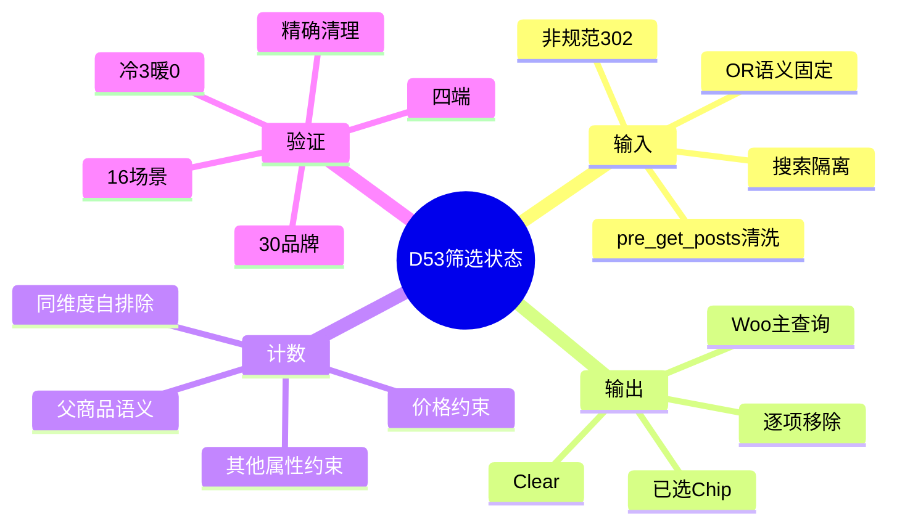
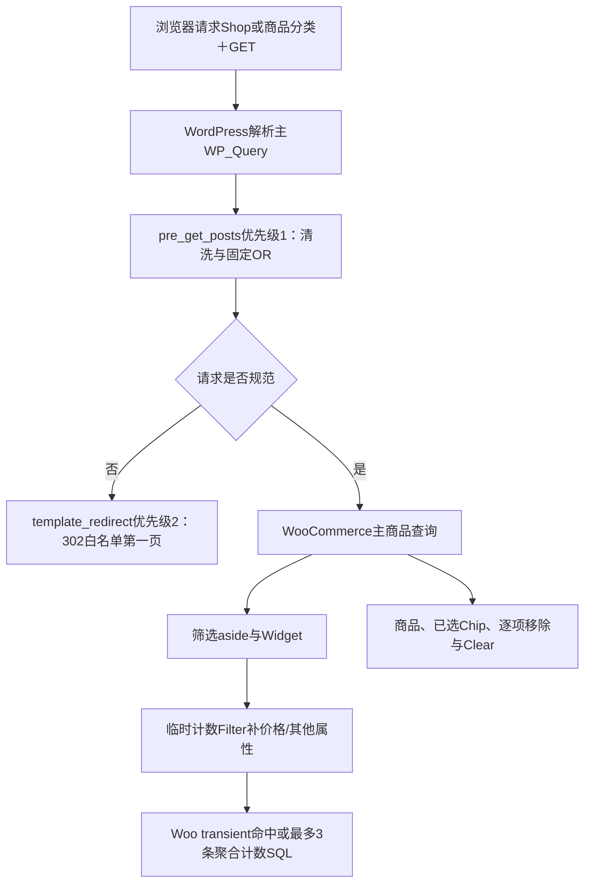

# Day53 WordPress实战：分面计数与筛选状态恢复

## 相关笔记

- 学习索引：[[WordPress实战笔记索引]]
- 对应项目笔记：[[../Day53-已选条件计数与重置]]
- 前置学习笔记：[[Day52-WooCommerce原生品牌taxonomy与筛选URL]]
- 后续学习笔记：[[Day54-WooCommerce商品发现链路回归与证据复用]]
- 同主题知识：[[Day49-WooCommerce属性查询表与商品级筛选]]、[[Day50-WooCommerce链接式筛选与参数治理]]、[[Day51-原生Dialog与单一筛选DOM]]

## 今日学习成果

- [x] 我能解释“商品结果、已选状态、移除URL和分面计数”为什么必须共享一个筛选合同。
- [x] 我能沿`pre_get_posts`、Woo主查询、Widget计数Filter和模板Hook追踪一次Shop筛选请求。
- [x] 我能在Local验证30品牌、冷/暖缓存、非规范302、搜索隔离、零结果恢复并安全清理TEST夹具。

## 真实项目场景

### 今天解决了什么问题

D50～D52已经能筛选分类、价格、Size、Shade和Brand，但访客无法在结果区集中看见所有条件，也没有统一Clear；Woo原生属性/品牌Widget显示的数字还不会自动完整继承DentAll当前价格与其他lookup属性约束。这样会出现“结果已经缩小，但某个候选数字仍按更宽集合计算”的认知冲突。

D53在不增加AJAX或第二商品查询的前提下，把公开GET先归一化，让主查询、已选Chip、移除/Clear链接和三组动态计数共享同一语义；再用30品牌/30商品Local夹具验证列表、查询上限、缓存和恢复态。

### 学习范围

- 本篇要掌握：公开GET消费时机、规范URL、facet自排除、父商品计数、Woo查询哈希transient、零结果恢复和搜索隔离。
- 本篇明确不展开：品牌搜索/折叠、AJAX、第二查询、Category/Price计数、严格同Variation组合、Production页面缓存/CDN和可索引筛选落地页。
- 真实入口：`app/public/wp-content/themes/dentall/inc/catalog-filters.php`、`assets/css/catalog.css`和`project-docs/tests/day53-*.{php,mjs}`。
- 验证环境：上方YAML所列Local；30品牌均为TEST，正式数据、真实设备、辅助技术和非Local未验。

## 先建立整体模型

### 一句话模型

先把一次请求的筛选状态规范成唯一清单，再让商品主查询、已选项、撤销链接和每个分面计数从这份清单派生，才能保证所见、所得和可恢复路径一致。

### 记忆宫殿：仓库分拣台

把Shop想成仓库分拣台：入口登记员先把手写筛选单改成标准格式；主传送带只运一次商品；墙上的已选标签显示当前条件；撕掉标签或按Clear会生成一张新标准单；三个盘点员分别统计Size、Shade、Brand，但轮到某位盘点时要暂时忽略自己这一栏，并保留其他栏。

### 比喻对应回真实机制

| 记忆对象 | 真实技术对象 | 不能混淆的边界 |
|---|---|---|
| 入口登记员 | `pre_get_posts`中的`dentall_catalog_filter_prepare_query_args()` | 不是权限/nonce流程；它只治理前台公开GET |
| 主传送带 | WooCommerce主`WP_Query` | 不额外创建第二商品结果查询 |
| 已选标签/撕除 | 服务端Chip、逐项移除和Clear URL | 普通链接会发起新请求，不是前端本地状态 |
| 三个盘点员 | Size、Shade、Brand Widget计数SQL | 计数查询不是商品卡查询；同维度需自排除 |
| 盘点账本 | Woo按查询哈希管理的transient | 不是DentAll自定义缓存，也不代表页面缓存 |

## 思维导图



最重要的主干是：同一份规范筛选状态必须同时约束结果、状态、恢复URL与计数。

## 请求与生命周期调用链



- 触发条件：非搜索的Shop或`product_cat`主查询。
- 加载入口：主题`functions.php`已加载的`inc/catalog-filters.php`。
- 输入：允许的价格、Size、Shade、Brand和`orderby`公开GET。
- 输出：规范200页或302；唯一商品循环、筛选DOM、已选区和链接。
- 副作用：无正式数据写入；测试期间只创建并清理有标记夹具和Woo计数transient。

## 核心概念卡

| 概念 | 准确定义 | DentAll真实例子 | 常见误区 | 如何验证 |
|---|---|---|---|---|
| 规范请求 | 同一语义只有项目批准的一种参数形态 | 多Size必须带`query_type_size=or` | 认为缺失/AND只是另一种等价写法 | 看首跳302和目标URL |
| Facet自排除 | 计算某维候选时不应用该维当前条件，仍保留其他维度 | 数Size时保留Price、Shade、Brand | 把最终结果总数复制到每个term | 独立oracle比较各term |
| 父商品语义 | 属性lookup按`product_or_parent_id`聚合到可展示父商品 | Variable #46的Variation属性计到#46 | 把Variation行数当商品数 | 查lookup与结果父ID |
| 搜索隔离 | 未开放筛选UI的搜索不消费隐藏筛选键 | 搜索＋价格/Size/Brand仍30件 | 只隐藏aside就以为没有过滤 | 比较结果数与最终GET |
| 暖计数缓存 | 相同查询哈希复用Woo transient，不再发计数SQL | matrix冷3、暖0 | 误称整页或商品查询已缓存 | 记录计数SQL而非只看TTFB |

## 项目实战代码

### 涉及文件

- `app/public/wp-content/themes/dentall/inc/catalog-filters.php`：GET边界、已选状态、计数约束、重定向与Woo Hook。
- `app/public/wp-content/themes/dentall/assets/css/catalog.css`：已选区、Chip、Clear、计数、换行与44px交互。
- `project-docs/tests/day53-brand-fixture.php`：Local 30品牌/30商品显式setup/cleanup和外部关系护栏。
- `project-docs/tests/day53-catalog-filter-audit.php`、`day53-responsive-audit.mjs`：查询oracle、HTTP、四端和交互证据。

### 从入口开始追踪

1. WordPress先解析请求身份并建立主`WP_Query`。
2. `pre_get_posts`优先级1让DentAll在Woo消费公开GET前完成清洗、OR语义与搜索隔离。
3. Woo主查询决定商品集合；模板Hook在正常和零结果路径输出一次已选区。
4. Widget请求计数时，DentAll临时挂接计数Filter，补齐价格与其他属性约束，之后在`finally`移除。
5. 非规范请求在`template_redirect`302到当前分类或Shop的白名单第一页。

### 关键代码片段

源文件`inc/catalog-filters.php`：只在目录主查询消费筛选，其他上下文移除隐藏条件。

```php
$is_catalog = ! $query->is_search()
	&& ( $query->is_post_type_archive( 'product' ) || $query->is_tax( 'product_cat' ) );

if ( ! $is_catalog ) {
	// 移除价格、filter_*、query_type_*，再重置Woo已选属性缓存。
	WC_Query::reset_chosen_attributes();
	return;
}
```

源文件同上：仅在计数期挂接约束，并保证退出时恢复全局状态。

```php
add_filter( 'woocommerce_get_filtered_term_product_counts_query', 'dentall_catalog_filter_count_query_constraints', 20 );

try {
	// 依次渲染Size与Shade；Brand使用同样的临时计数边界。
} finally {
	remove_filter( 'woocommerce_get_filtered_term_product_counts_query', 'dentall_catalog_filter_count_query_constraints', 20 );
}
```

| 代码 | 表面动作 | WordPress中的真实作用 | 为什么这样写 |
|---|---|---|---|
| `pre_get_posts`优先级1 | 修改GET | 在Woo解析已选属性前统一输入合同 | 输出层清洗太晚 |
| `reset_chosen_attributes()` | 清缓存 | 防止Woo静态已选属性保留旧GET | 仅`unset($_GET)`不够 |
| 临时计数Filter | 改SQL片段 | 只补Widget计数，不改商品主查询 | 限制生命周期和副作用 |
| `finally` | 总是清理 | 即使Widget异常也移除Filter/全局值 | 避免后续Widget或页面被污染 |

### 运行证据

- 命令/入口：三个Day53测试文件、真实Local Shop/分类/搜索和现有Chrome。
- 正常：16场景PASS；30品牌完整列表；四端2/2/3/4列；冷最多3、暖0条计数SQL。
- 边界：缺失/AND query type与非法筛选302；搜索隐藏参数不改变30件结果；lookup关闭回退通过；外部关系使cleanup拒绝。
- 能证明：当前版本、Local、30项代表数据下的查询/UI/恢复合同。
- 不能证明：正式品牌事实、>30规模、Production缓存/CDN、真实设备或Woo未来版本。

## 职责边界

| 层级 | 本主题中负责什么 | 不应该负责什么 |
|---|---|---|
| WordPress Core | 解析请求、`WP_Query`、Hook与302响应 | 不修改核心文件 |
| WooCommerce | 商品主查询、属性/品牌Widget、lookup与计数transient | 不依赖其私有表结构作为唯一回退路径 |
| Storefront父主题 | 归档模板与公开展示Hook | 不直接修改父主题 |
| DentAll子主题 | 目录展示、公开输入边界、链接和最小计数适配 | 不写正式品牌内容或交易数据 |
| `dentall-core` | 既有筛选参数页SEO规则 | 不承载本次纯目录展示代码 |
| 数据库 | Woo原生商品、term、lookup和transient | TEST夹具不当正式事实 |
| 浏览器 | CSS、dialog、焦点、History与截图 | UI隐藏不等于服务端没有筛选 |

## Hook、API或模板机制详解

| 项目 | 说明 |
|---|---|
| 机制类型 | Action＋Filter＋Woo Widget计数SQL片段 |
| 名称或入口 | `pre_get_posts`、`template_redirect`、`woocommerce_get_filtered_term_product_counts_query`、正常/零结果Woo模板Hook |
| 优先级 | GET边界1；302为2；计数Filter只在Widget渲染期以20挂接 |
| 回调输入 | 主`WP_Query`，或Woo计数SQL的`join/where`片段 |
| 返回内容 | Action不靠返回值改数据；计数Filter必须返回完整SQL片段数组 |
| 副作用 | 规范当前请求GET/静态缓存；非规范时302；无正式数据库写入 |
| 影响范围 | 非搜索Shop/商品分类；搜索与其他上下文被隔离 |
| 移除方式 | 删除对应Action/Filter注册与D53输出/CSS，并恢复主题0.28.0 |

## 安全、数据与站点影响

| 检查面 | 本次结论 | 证据或待验证项 |
|---|---|---|
| 输入清洗与验证 | 标量、长度、term白名单、固定OR与未知键拒绝 | 16场景＋HTTP 302矩阵 |
| Capability / Nonce | 前台只读GET不适用 | 不把nonce用于公开筛选；无后台写动作 |
| 输出转义 | 标签、URL和ARIA按上下文转义 | 特殊字符品牌在四端输出正确 |
| 数据库写入 | 运行功能无正式写入；测试夹具用Woo/WordPress API并清理 | 外部关系护栏、最终0残留 |
| URL与SEO | 非规范302；参数页noindex/follow与基础Canonical | 非Local抓取未验 |
| 缓存 | 复用Woo transient，无自定义缓存 | 冷≤3、暖0；Production待验 |
| 支付、物流与订单 | 无影响 | 未进入交易流程 |
| 部署与回滚 | 仅Local，代码可回退到0.28.0 | Staging/Production未部署 |

独立安全审查P0=P1=P2=0；保留3项不阻塞P3：属性筛选未来可补512字节纵深上限、出现嵌套Widget时保存/恢复计数taxonomy旧全局值、测试夹具在相关代码再改时检查`delete(true)`返回并增强极端部分失败恢复。D54已在运行代码0改动的回归中复评，三项均未触发并继续按对应条件监控。

## 动手练习

### 练习一：只读观察

- 目标：分清商品主查询和分面计数查询。
- 操作：分别请求同一组合的冷、暖页面，按测试脚本分类记录SQL。
- 预期/证据：商品仍来自一条主查询；计数冷最多3、同URL暖0。

### 练习二：Local最小改动

- 改动：在URL中把`query_type_size=or`改为`and`。
- 风险边界：只发Local GET，不改核心、数据库或Production。
- 验证/回滚：确认首跳302至OR URL；关闭测试标签页即可回滚请求状态。

### 练习三：故障推演

- 症状：搜索结果突然从30件降到少数，但页面没有筛选UI。
- 可能原因：价格/属性/品牌GET在非目录上下文仍被Woo消费，或静态chosen attributes未重置。
- 第一项检查：记录搜索请求原始GET、`pre_get_posts`后GET和结果总数。
- 原因：先确认服务端集合是否已被隐藏条件改变，再查CSS/UI没有意义。

## 常见误区与排错顺序

| 现象或误区 | 可能原因 | 推荐检查顺序 | 最小验证方法 |
|---|---|---|---|
| 数字与点击后结果不一致 | 计数未继承价格/其他维度或自我收窄 | GET合同→主结果oracle→计数SQL→transient | 清精确计数缓存后跑matrix |
| Clear后仍停留旧分类外页面 | 使用Shop固定URL或传播分页 | base URL→白名单args→响应Location | 分类＋排序＋筛选点Clear |
| 搜索无UI但结果被过滤 | 只限制输出，没有限制输入消费 | 请求身份→GET→chosen attributes→结果 | `search_filters`场景 |
| 暖请求仍有3条计数SQL | 查询哈希变化、缓存被清理或未写入 | 参数排序→transient key→TTL→SQL | 同一URL连续请求两次 |

## 掌握标准

- [ ] 能在2分钟内讲清“规范输入→主查询→状态/恢复→分面计数”。
- [ ] 能指出真实入口、Hook优先级和计数Filter生命周期。
- [ ] 能区分商品主查询、Widget计数查询和页面缓存。
- [ ] 能解释零结果、搜索隔离、lookup关闭和cleanup拒绝四条失败路径。
- [ ] 能在Local复演并说清代码/TEST数据回滚。
- [ ] 能说明数据、URL、SEO、缓存和部署影响。

当前掌握度：初识，待费曼自测。

## 费曼测试题（7道）

1. 为什么只在结果上方显示几个Chip，仍不能说明筛选状态已经闭环？
2. “统计Size时忽略Size自己”是什么意思？为什么仍要保留Shade、Brand和Price？
3. 从一个带`filter_size`的请求开始，按顺序讲出`pre_get_posts`、Woo主查询、Widget计数和模板输出。
4. 为什么`unset($_GET)`后还要调用`WC_Query::reset_chosen_attributes()`？
5. 为什么冷最多3、暖0不等于“页面只做3个查询”或“Production性能已经通过”？
6. 如果搜索页面没有筛选UI却少了商品，你会先收集哪三项证据？
7. 迁移到Shopify时，哪些筛选原则能保留，哪些Woo Hook/lookup/transient必须丢弃？

### 我的费曼答案与纠正

待第一次复习填写；逐题标记通过、含糊或答错，并链接回本篇对应章节。

### 自测评分

总分：未自测 / 14；存在0分题时不提升掌握度。

## 间隔复习记录

| 复习节点 | 计划日期 | 完成 | 暴露的问题 | 修正位置 |
|---|---|---|---|---|
| D+1 | 2026-09-05 | [ ] | 尚未复习 | — |
| D+3 | 2026-09-07 | [ ] | 尚未复习 | — |
| D+7 | 2026-09-11 | [ ] | 尚未复习 | — |
| D+14 | 2026-09-18 | [ ] | 尚未复习 | — |

## 收尾总结

- 我今天真正理解了：分面计数不是装饰数字，而是与主结果共享合同、但对当前维度自排除的派生查询。
- 我仍然容易混淆：Woo计数transient、页面缓存与商品主查询缓存是三件不同的事。
- 下次遇到类似问题，我会先检查：请求身份、规范GET、结果oracle、计数SQL和缓存键。
- 下一篇直接相关学习笔记：[[Day54-WooCommerce商品发现链路回归与证据复用]]。

## 后续如何向AI高效提问

### 提问公式

`版本与页面身份 + 原始/规范GET + 主结果oracle + 当前计数SQL/缓存证据 + 失败场景 + Local边界`

### 提问前准备

- WordPress/WooCommerce/主题版本、Shop/分类/搜索身份和完整URL。
- 原始GET、清洗后GET、结果父商品ID和每个term预期计数。
- 冷/暖请求、transient和SQL分类证据；移除密码、Cookie和客户数据。

### 可复制的代码理解提示词

```text
请基于DentAll当前Local代码解释一次WooCommerce分面筛选请求：
版本：[填写]
页面与URL：[填写]
真实入口：catalog-filters.php
证据：[主结果ID、各term计数、冷/暖SQL]

按“pre_get_posts规范输入→Woo主查询→已选状态/恢复URL→Widget计数Filter→transient”说明，区分主查询与计数查询，并指出lookup关闭时的回退。不要假设Production缓存已验证。
```

### 可复制的排错提示词

```text
这是WooCommerce筛选结果与计数不一致问题。
页面身份/完整URL：[填写]
预期父商品ID与计数：[填写]
实际结果与计数：[填写]
冷/暖SQL与transient：[填写]
lookup/hide OOS设置：[填写]

请先判断输入规范、主查询、facet自排除、价格约束、属性lookup、库存政策或缓存键哪一层不一致；给只读检查和Local最小复演，不先建议AJAX、插件或重写商品查询。
```

> [!warning] AI验证边界
> SQL与Woo内部Widget会随版本变化。AI解释必须回到当前源码、Local查询证据、独立oracle和恢复态；不得把TEST品牌或推断的Shopify机制写成正式事实。

## 变种应用到其他项目

| 新场景 | 保持不变的原则 | 可能变化的实现 | 必须重新确认 | 最小验证 |
|---|---|---|---|---|
| 另一个Storefront子主题 | 单一筛选合同、可逆URL、计数与结果一致 | Hook优先级、现有CSS与字段 | Woo版本和数据规模 | 正常/零结果/冷暖组合 |
| 其他经典Woo主题 | 主查询与输入边界 | aside与模板Hook | 主题输出顺序 | Shop/分类/搜索交叉测 |
| WordPress区块主题 | facet语义和恢复路径 | Product Collection/Filter区块 | 当前Blocks API | 编辑器＋前台请求 |
| 独立插件 | 生命周期受控、无第二真相源 | 查询适配放插件 | 跨主题必要性 | 停用、缓存与回滚 |
| Shopify或其他平台 | 规范URL、facet自排除、可恢复状态 | Search & Discovery、Storefront API或应用，待验证 | 过滤字段、计数、缓存、索引 | 官方资料＋沙盒代表数据 |

### 变种练习

选择Shopify场景：先写出不可变的筛选语义与恢复规则，再查官方过滤、计数和URL能力；不要把Woo的`pre_get_posts`、taxonomy ID、lookup表或transient名称当作对应实现。

## 可复用核心思想

### 跨平台不变量

商品集合、已选状态、撤销URL和facet计数必须由一份规范筛选状态派生；某个facet计数应排除自身条件、保留其他条件，并始终提供从零结果恢复的可操作路径。缓存只能改变计算成本，不能改变这套语义。

### WordPress/WooCommerce当前实现

DentAll在WordPress 7.0.4、WooCommerce 11.0.0 Local用`pre_get_posts`优先级1规范公开GET和隔离搜索，继续由Woo主`WP_Query`输出商品；Size/Shade/Brand Widget计数期临时使用`woocommerce_get_filtered_term_product_counts_query`补价格与其他lookup属性约束，并沿用Woo查询哈希transient。30品牌代表数据验证冷最多3、暖0条计数SQL和0品牌递归子项SQL；不使用AJAX、自定义缓存或第二商品查询。

### Shopify或其他平台的对应机制

Shopify可能通过Search & Discovery过滤器、Storefront API或第三方应用提供选中状态与计数，但其同维度语义、URL、缓存、产品/Variant聚合及SEO行为尚未在DentAll验证，必须标记为待验证。可以迁移查询合同、可逆状态和证据方法，不能迁移Woo Hook、taxonomy、lookup表或transient实现。
