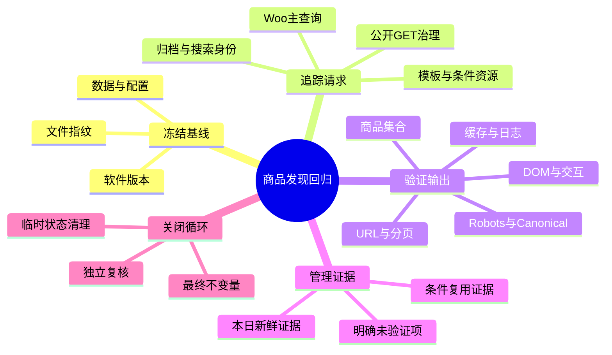
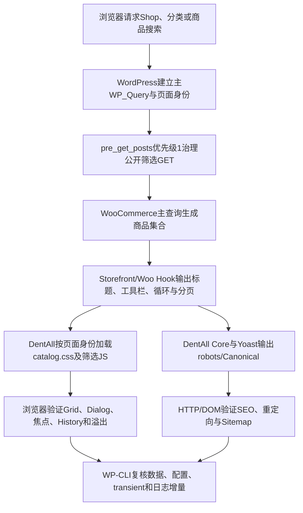

# Day54 WordPress实战：WooCommerce商品发现链路回归与证据复用

## 相关笔记

- 学习索引：[[WordPress实战笔记索引]]
- 对应项目笔记：[[../Day54-商品发现链路回归与W9收口]]
- 前置学习笔记：[[Day53-分面计数与筛选状态恢复]]
- 后续学习笔记：[[Day55-WooCommerce单品模板Hook与条件样式]]
- 同主题知识：[[Day46-WooCommerce分页链接与Canonical边界]]、[[Day47-WooCommerce商品搜索请求与模板复用]]、[[Day50-WooCommerce链接式筛选与参数治理]]、[[Day51-原生Dialog与单一筛选DOM]]

## 今日学习成果

- [x] 我能解释为什么一次可信回归必须同时冻结环境、数据、请求、输出和恢复态。
- [x] 我能沿“WordPress请求身份→Woo主查询→主题Hook/资源→SEO输出→浏览器交互”追踪商品发现链路。
- [x] 我能区分新鲜证据、可复用证据与未验证项，并能识别测试工具错误而不误报运行时缺陷。

## 真实项目场景

### 今天解决了什么问题

D43～D53连续加入归档骨架、Grid、排序、分页、商品搜索、分类内容、属性查询表、PC/移动筛选、品牌、已选状态和动态计数。每一天单点通过并不自动证明它们组合后仍然成立：搜索可能误加载筛选脚本，排序可能破坏分页URL，筛选可能改变Canonical，Dialog可能在断点切换后留下页面锁，测试夹具也可能没有恢复。

D54没有新增功能，而是在恢复态2商品/0品牌上把整条链路重新走通，并把D53的大数据证据按可复用条件引用。核心知识不是“再点一次页面”，而是建立一张可审计的证据图。

### 学习范围

- 本篇要掌握：回归oracle、不变量、证据新鲜度、请求身份、条件资源、非持久化夹具、日志归因和恢复态。
- 本篇明确不展开：E2E框架选型、Production负载测试、真实设备实验室、视觉回归平台、支付/订单测试和新运行代码。
- 真实入口：`app/public/wp-content/themes/dentall/inc/setup.php`、`inc/catalog-filters.php`、`assets/js/catalog-filters.js`、`app/public/wp-content/plugins/dentall-core/includes/seo-compatibility.php`及`project-docs/tests/`中的既有审计。
- 验证环境：上方YAML所列Local；最终为2件发布商品、0品牌、11件Trash，非Local未验。

## 先建立整体模型

### 一句话模型

先冻结可比较的基线，再让每条高风险用户路径产生可观察断言，最后证明临时状态全部恢复；这样“页面看起来没坏”才升级为可复演的回归证据。

### 记忆宫殿：机场转机质检线

把商品发现链路想成机场转机：值机柜台确认乘客和航班版本；安检检查公开输入；行李主传送带对应Woo主查询；转机指示牌对应排序、分页和筛选URL；登机屏对应DOM、SEO与资源；临时开通的测试闸口必须在结束时关闭。旧报告可以复用，但只有飞机型号、航线和关键设备没变时才有效。

### 比喻对应回真实机制

| 记忆对象 | 真实技术对象 | 不能混淆的边界 |
|---|---|---|
| 值机柜台 | WordPress/WooCommerce/主题版本、数据库基线、文件SHA-256 | 版本相同不代表正式内容或非Local配置相同 |
| 安检 | `pre_get_posts`公开GET规范化与302 | 公开GET不是后台写操作，不使用nonce替代输入验证 |
| 行李主传送带 | WooCommerce主`WP_Query` | 分面计数查询不是第二条商品卡主查询 |
| 转机指示牌 | 排序、筛选、分页、Chip/Clear链接 | URL可点击不等于Canonical或robots正确 |
| 登机屏 | HTML、CSS/JS条件加载、ARIA、Yoast输出 | 浏览器截图不能证明数据库没有漂移 |
| 临时测试闸口 | 请求内`loop_shop_per_page=1`、暂时关闭Coming Soon、缓存清理 | 临时状态若未恢复，会污染后续测试 |
| 旧质检报告 | D53的30品牌、SQL、lookup回退与cleanup证据 | 未重跑就必须标为复用，不能写成D54新鲜结果 |

## 思维导图



最重要的主干是：基线决定能否比较，请求链决定该观察什么，恢复态决定测试是否可信地结束。

## 请求与生命周期调用链



- 触发条件：前台Shop、`product_cat`或明确的商品搜索请求。
- 加载入口：主题`functions.php`加载`inc/setup.php`与`inc/catalog-filters.php`；插件主入口加载SEO兼容模块。
- 输入数据：路由、公开GET、Woo商品/Variation/taxonomy/lookup和站点配置。
- 输出或副作用：HTML、响应状态/头、CSS/JS请求、robots/Canonical、Woo transient；普通页面请求不应写商品数据。
- 可观察证据：商品ID、状态码/Location、DOM数量、Computed Style、ARIA/焦点、Sitemap、SQL/transient、文件哈希与最终数据库快照。

## 核心概念卡

| 概念 | 准确定义 | DentAll真实例子 | 常见误区 | 如何验证 |
|---|---|---|---|---|
| 回归oracle | 对给定前置与输入，独立写出的预期结果 | `price-desc`应为#46→#44 | 只确认页面返回200 | 核对具体商品ID、URL、DOM和SEO |
| 不变量 | 测试前后必须保持相同的状态 | 发布商品2、Trash 11、品牌0、lookup 7行 | 只清理新建post，不查配置/transient | 开工与收尾快照逐项比较 |
| 新鲜证据 | 本轮实际执行并观察到的结果 | 四端、7类302、请求内分页 | 把历史结果改日期后当本轮结果 | 保留本轮命令、输出和截图 |
| 可复用证据 | 前置未变且直接覆盖当前断言的历史证据 | D53冷最多3/暖0条计数SQL | “代码没改”就复用所有证据 | 校验版本、相关文件指纹与适用边界 |
| 证据边界 | 当前证据不能支持的结论 | Local TTFB不能证明Production CWV | 用一次快速响应宣传性能提升 | 明确环境、数据量和未测项 |
| 恢复态 | 临时测试状态被撤销后的可验证终态 | Coming Soon=yes、facet transient=0 | `finally`执行过就假设恢复成功 | 再次读取Option、term、post与缓存 |

## 项目实战代码

### 涉及文件

- `app/public/wp-content/themes/dentall/inc/setup.php`：按归档/搜索身份加载目录CSS，并只为可筛选归档加载JS。
- `app/public/wp-content/themes/dentall/inc/catalog-filters.php`：在Woo消费GET前规范筛选输入，注册筛选输出、计数和分页Hook。
- `app/public/wp-content/plugins/dentall-core/includes/seo-compatibility.php`：站点级筛选参数页robots规则。
- `project-docs/tests/day47-product-search-audit.php`与`day52-brand-audit.php`：既有安全只读/恢复态审计入口。

### 从入口开始追踪

1. WordPress先识别这是Shop、商品taxonomy还是搜索，并建立主查询。
2. `pre_get_posts`优先级1在Woo读取公开筛选GET前规范Size/Shade/Brand，并在非目录上下文移除隐藏筛选键。
3. WooCommerce只用主查询输出商品；Storefront/Woo Hook负责标题、结果/排序、循环和分页。
4. 主题根据页面身份加载`catalog.css`；只有Shop/商品分类才加载Dialog脚本。
5. DentAll Core在`wp_robots`最后阶段将筛选参数页设为`noindex, follow`，Canonical继续由Yoast回到基础归档。
6. 测试从HTTP、DOM、浏览器、数据库和日志五个观察面交叉核对，并在结束后复核恢复态。

### 关键代码片段一：条件资源

源文件`inc/setup.php`节选：

```php
$is_catalog_archive = ! is_search() && ( is_shop() || is_product_taxonomy() );
$is_product_search  = is_search()
	&& is_post_type_archive( 'product' )
	&& 'product' === get_query_var( 'post_type' );

if ( ! $is_catalog_archive && ! $is_product_search ) {
	return;
}
```

这段先区分“目录归档”和“明确商品搜索”。两者都需要目录CSS，但后续只有`dentall_is_catalog_filter_archive()`为真时才加载筛选JS，所以D54观察到搜索CSS=1、筛选JS=0。

### 关键代码片段二：主查询边界

源文件`inc/catalog-filters.php`节选：

```php
function dentall_catalog_filter_prepare_query_args( $query ) {
	if ( is_admin() || ! $query instanceof WP_Query || ! $query->is_main_query() ) {
		return;
	}

	$is_catalog = ! $query->is_search()
		&& ( $query->is_post_type_archive( 'product' ) || $query->is_tax( 'product_cat' ) );
```

这里的三个门槛分别排除后台、非`WP_Query`对象和非主查询；再排除搜索。测试必须覆盖Shop、分类和搜索，才能证明条件没有写得过宽或过窄。

### 关键代码片段三：参数页robots

源文件`dentall-core/includes/seo-compatibility.php`节选：

```php
foreach ( array_keys( $_GET ) as $key ) {
	if (
		! is_string( $key )
		|| (
			'min_price' !== $key
			&& 'max_price' !== $key
			&& 0 !== strpos( $key, 'filter_' )
			&& 0 !== strpos( $key, 'query_type_' )
		)
	) {
		continue;
	}

	unset( $robots['index'], $robots['nofollow'] );
	$robots['noindex'] = true;
	$robots['follow']  = true;
	break;
}
```

键存在即触发防御性`noindex`，即使值稍后被判非法。这与Canonical是两个职责：robots由Core保护，Canonical由Yoast维持基础归档。

### 运行证据

- 现有审计：D52恢复态脚本连续19/19；D47商品搜索的正常、空结果和降价排序均通过。
- 新鲜HTTP：Shop、分类、搜索、正常筛选与7类302；600字节Size值可安全回到Shop，没有414/Fatal。
- 新鲜分页：请求内每页1项形成Shop/分类两页，验证商品、链接、Canonical、`rel`和越界404，持久化每页配置不变。
- 新鲜浏览器：390/768/1024/1440的基础/筛选/零结果及1199/1200交互通过，Console/Page Error为0。
- 新鲜恢复：运行文件指纹未变；Coming Soon、Woo选项、商品/Trash/品牌/lookup和三类transient回到开工值。
- 不能证明：600字节样本不等于明确长度上限；自动化不等于真实辅助技术；Local TTFB不等于Production性能。

## 职责边界

| 层级 | 本主题中负责什么 | 不应该负责什么 |
|---|---|---|
| WordPress Core | 建立请求身份、主`WP_Query`、Hook和响应生命周期 | 不修改核心文件，不把测试脚本错误当核心缺陷 |
| WooCommerce | 商品主查询、排序、分页、Layered Nav、lookup与计数transient | 不绕过CRUD/API改商品内部表；不让第二查询成为商品真相源 |
| Storefront | 归档模板和公开Hook的基础HTML | 不直接修改父主题文件 |
| DentAll子主题 | 页面身份、筛选展示、条件资源、Dialog和URL衔接 | 不承载跨主题SEO政策或正式业务数据 |
| `dentall-core` | 跨主题长期存在的筛选参数页robots政策 | 不堆放目录布局CSS/JS |
| 数据库 | 保存商品、term、Option、lookup和transient | TEST状态不能遗留或冒充正式事实 |
| 浏览器 | 验证布局、焦点、History、ARIA和资源加载 | 截图不能替代服务端状态、SEO头或数据核对 |

## Hook与机制详解

| 机制 | 注册位置/时机 | 本次关注点 | 移除或回滚 |
|---|---|---|---|
| `pre_get_posts` | `catalog-filters.php`，优先级1 | Woo消费公开GET前规范输入；只作用主查询 | 移除Action会丢失当前参数治理与搜索隔离 |
| `wp_enqueue_scripts` | `setup.php`，优先级45 | 目录/搜索CSS共享，筛选JS只在归档 | 移除条件会造成漏载或全站多载 |
| `paginate_links` | `catalog-filters.php`，优先级20 | 分页只传播白名单状态并保持路径 | 移除后参数/第一页归一化可能回退 |
| `wp_robots` | Core SEO模块，`PHP_INT_MAX` | 筛选键存在即`noindex, follow` | 停用插件或移除Filter后需重新验证Yoast默认输出 |
| 请求内`loop_shop_per_page` | 只在测试进程临时注册 | 制造两页而不写Option或恢复Trash | 请求结束自动消失；仍须复核持久化设置 |

## 安全、数据与站点影响

| 检查面 | 本次结论 | 证据或待验证项 |
|---|---|---|
| 输入清洗与验证 | 既有7类非法/非规范GET均安全302 | 明确属性长度早停仍是P3 |
| Capability/Nonce | 前台公开GET不适用；测试状态写入只限Local脚本 | nonce不能替代后台capability；本轮未新增后台动作 |
| 输出转义 | 静态Review未发现新增问题，且本轮运行代码0改动 | Woo内部品牌markup升级后仍需回归 |
| 数据库写入 | 没有正式内容写入；临时Option/transient均恢复 | D53夹具极端失败恢复仍是P3 |
| URL与SEO | 排序Canonical合并；筛选noindex；搜索无Canonical；参数不进Sitemap | 非Local抓取与缓存未验 |
| 缓存 | Woo分面transient内容稳定并精确清除 | 页面缓存/CDN键和失效时延未验 |
| 支付、物流与订单 | 无影响 | 本篇证据不能外推交易流程 |
| 部署与回滚 | 仅Local，运行代码0改动 | D43～D54稳定Git基线未形成，不能部署 |

## 动手练习

### 练习一：只读观察请求身份

- 目标：解释为什么商品搜索加载目录CSS但不加载筛选JS。
- 操作：分别打开Shop和`?s=TEST&post_type=product`，查看HTML中的资源句柄与筛选DOM。
- 预期：两页都有`dentall-catalog` CSS；只有Shop有筛选JS/aside/dialog/toggle。
- D54实际：Shop CSS/JS=1/1，搜索CSS/JS=1/0且筛选UI为0。

### 练习二：Local非持久化分页

- 改动：只在单次WP-CLI请求进程中给`loop_shop_per_page`返回1，抓取Page 1～3输出。
- 风险边界：不改Woo选项、不恢复Trash、不写主题源码。
- 验证：检查每页商品ID、prev/next、Canonical、robots和Page 3状态。
- 回滚：请求结束Filter消失，再读取`posts_per_page=10`及商品/Trash总数。

### 练习三：故障推演

- 假设症状：从1199px打开筛选后拉宽到1200px，页面仍不能滚动。
- 可能原因：`matchMedia`切换时dialog未关闭，或`dentall-catalog-filter-open`类没有清除。
- 第一项检查：DevTools Elements同时检查dialog `open`、`aria-expanded`和`html/body`锁类。
- 为什么先查它：这是同一UI状态机的三个可见结果，比先改CSS更能定位生命周期遗漏。

## 常见误区与排错顺序

| 现象或误区 | 可能原因 | 推荐检查顺序 | 最小验证方法 |
|---|---|---|---|
| “200就是通过” | 商品集合、Canonical或脚本加载可能已错 | 状态码→商品ID→URL/SEO→DOM/资源 | 对一个固定oracle输出完整断言 |
| “旧测试通过可直接引用” | 版本、代码、数据或范围已经变化 | 版本→相关文件哈希→数据前置→旧用例边界 | 任一前置不同就重跑或降级结论 |
| 浏览器Fatal被误报为站点缺陷 | 测试包装器引号/端口错误 | 时间戳→触发命令→有效HTTP复现→恢复态 | 用纠正后的最小命令复演并看日志增量 |
| 测试后页面行为异常 | Coming Soon、Option、transient或DOM锁未恢复 | 持久化设置→缓存→页面类/ARIA→文件哈希 | 与开工快照逐项比较 |
| Local很快就称性能通过 | 数据太少、无CDN/页面缓存、机器单一 | 数据规模→冷暖SQL→TTFB样本→目标环境 | 明确只记录Local样本，不做提升宣称 |

## 掌握标准

- [ ] 不看笔记，能在2分钟内讲清“基线—请求链—证据—恢复态”。
- [ ] 能指出`setup.php`、`catalog-filters.php`与SEO模块各自职责。
- [ ] 能为一个回归断言选择HTTP、DOM、数据库、日志或文件指纹证据。
- [ ] 能区分新鲜、复用和未验证证据，不把未运行写成通过。
- [ ] 能设计一个请求内临时状态并说明最终恢复检查。
- [ ] 能说明本轮对数据、URL、SEO、缓存、交易和部署的边界。

当前掌握度：初识，待完成费曼自测后更新。

## 费曼测试题（6道）

1. 为什么D43～D53每天都通过，D54仍要做整链路回归？
2. D54为什么没有重建30品牌夹具？复用D53证据需要满足哪些条件？
3. 从Shop请求开始，按顺序说明公开GET、Woo主查询、模板、条件资源和SEO输出由谁负责。
4. 为什么“600字节Size值安全302”不能证明已经实现512字节长度上限？
5. 如何区分测试工具Fatal和网站运行时缺陷？至少列出三项证据。
6. 如何证明一次临时分页或Coming Soon切换没有污染后续状态？

### 参考答案与自测状态

1. 组合改动会产生跨模块回归，单日证据不覆盖最终集成状态；需在同一基线验证链路。状态：待自测。
2. 相关版本和文件指纹未变，旧用例直接覆盖规模/SQL/回退断言，且重建会增加数据风险；引用时必须标注为复用。状态：待自测。
3. WordPress建主查询，主题在`pre_get_posts`治理GET，Woo生成结果并用模板Hook输出，子主题条件加载资源，Core/Yoast输出robots与Canonical。状态：待自测。
4. 单一样本只证明该输入在当前环境安全返回；它没有证明代码在指定阈值前短路，也未覆盖更长输入和资源消耗。状态：待自测。
5. 对照时间戳与触发命令、在有效HTTP复现、检查纠正后的请求与日志增量、核对最终恢复态。状态：待自测。
6. 用`try/finally`或请求生命周期控制临时状态，再独立读取Option、商品/term、transient、DOM锁和文件哈希与开工快照比较。状态：待自测。

### 自测评分

总分：尚未自测 / 12。存在0分题时不提升掌握度。

## 间隔复习记录

| 复习节点 | 计划日期 | 完成 | 暴露的问题 | 修正位置 |
|---|---|---|---|---|
| D+1 | 2026-09-06 | [ ] | 尚未复习 | 复习后记录 |
| D+3 | 2026-09-08 | [ ] | 尚未复习 | 复习后记录 |
| D+7 | 2026-09-12 | [ ] | 尚未复习 | 复习后记录 |
| D+14 | 2026-09-19 | [ ] | 尚未复习 | 复习后记录 |

## 收尾总结

- 我今天真正理解了：回归测试的交付物是可复演的证据链和已验证恢复态，而不是截图数量或“看起来正常”。
- 我仍然容易混淆：Woo分面transient命中、页面缓存命中和Production性能是三类不同结论。
- 下次遇到类似问题，我会先检查：环境/数据/文件基线是否足以比较，再决定哪些证据必须新跑。
- 下一篇直接相关学习笔记：[[Day55-WooCommerce单品模板Hook与条件样式]]。

## 后续如何向AI高效提问

### 提问公式

`环境与版本 + 固定数据基线 + 用户路径 + 独立oracle + 已有/本轮证据 + 临时状态与恢复要求 + 明确不可外推边界`

### 可复制的回归设计提示词

```text
请为下面的WooCommerce功能设计一次最小、可逆的Local回归，不先修改运行代码。

环境与版本：[填写]
当前数据/配置基线：[填写]
涉及请求与真实文件：[填写]
历史证据：[填写日期、用例、版本]
本轮必须重新证明：[填写]
禁止改变：[正式数据、支付、非Local、其他]

请输出：
1. 最多3项验收结果；
2. 新鲜证据、可复用证据、不可外推项；
3. 正常/错误/边界矩阵及独立oracle；
4. 临时状态的建立、finally清理与收尾不变量；
5. 发现缺陷后的最小确认单，不直接给大改方案。
```

### 可复制的证据归因提示词

```text
这是一次WordPress/WooCommerce回归中的异常，请先判断站点缺陷、测试工具错误还是环境入口错误。

触发命令/URL：[填写]
发生时间：[填写]
HTTP/DOM结果：[填写]
debug.log增量：[填写]
纠正后的最小复现：[填写]
测试前后数据与配置：[填写]

请把事实、推断和待验证分开，给出最小只读检查；未确认前不要修改运行代码或清空历史日志。
```

## 变种应用到其他项目

| 新场景 | 保持不变的原则 | 可能变化的实现 | 必须重新确认 | 最小验证 |
|---|---|---|---|---|
| 另一个Storefront子主题 | 基线、oracle、恢复态和证据分层 | 主题模块与Hook优先级 | Woo/主题版本、已有覆盖 | Shop/分类/搜索交叉测 |
| 其他经典Woo主题 | 主查询与URL/SEO合同 | 模板Hook、DOM、CSS/JS入口 | 主题兼容层与资源依赖 | HTTP＋DOM＋数据快照 |
| WordPress区块主题 | 用户路径和证据图 | Product Collection区块、模板与Interactivity API | 当前Blocks版本和缓存 | 编辑器/前台双路径 |
| 独立插件 | 可逆测试和部署可复现性 | 插件生命周期、测试入口 | 数据所有权与停用行为 | 激活/停用/恢复态 |
| Shopify或其他平台 | Collection/Search、筛选、分页、SEO和恢复态合同 | Search & Discovery、Liquid/Storefront API与平台缓存，待验证 | 官方能力、URL和发布模型 | 官方文档＋沙盒代表数据 |

## 可复用核心思想

### 跨平台不变量

可信回归由四部分组成：可比较的开工基线、针对风险的独立oracle、多观察面证据、以及测试后的精确恢复态。历史证据只有在前置条件可证明未变时才能复用，并且必须保留原日期与适用边界。

### WordPress/WooCommerce当前实现

DentAll在WordPress 7.0.4、WooCommerce 11.0.0 Local通过主`WP_Query`、`pre_get_posts`、Storefront/Woo Hook、条件enqueue、Yoast/`wp_robots`、Woo transient和WP-CLI状态快照构成回归观察面；请求内Filter和`try/finally`用于避免持久化测试污染，SHA-256用于证明D54运行文件未变。

### Shopify或其他平台的对应机制

Shopify同样需要验证Collection/Search结果、筛选状态、分页、Canonical/robots、条件资源、缓存和发布恢复，但具体的Search & Discovery、Liquid、Storefront API与平台缓存行为在DentAll未实测，均为待验证。能迁移的是证据方法，不能迁移WordPress Hook、Woo taxonomy/lookup/transient名称。
