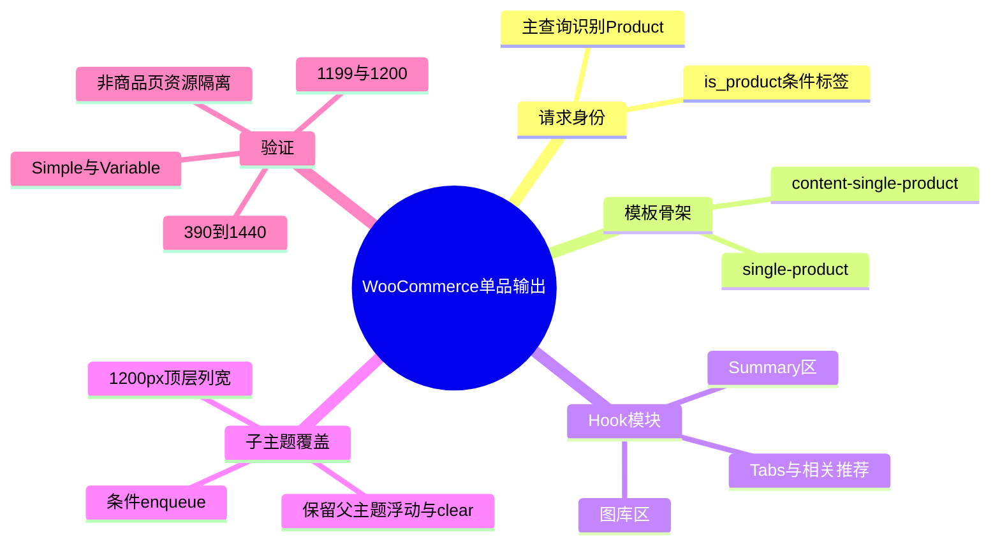
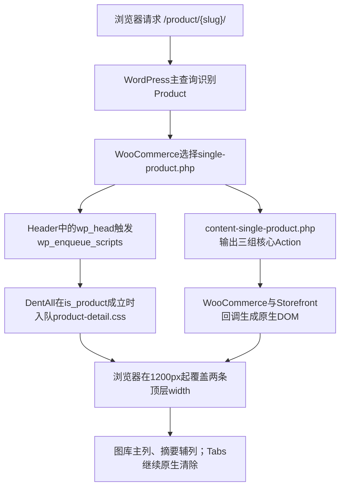

# Day55 WordPress实战：WooCommerce单品模板Hook与条件样式

## 相关笔记

- 学习索引：[[WordPress实战笔记索引]]
- 对应项目笔记：[[../Day55-商品详情字段与PC骨架]]
- 前置学习笔记：[[Day54-WooCommerce商品发现链路回归与证据复用]]
- 后续学习笔记：[[Day56-WooCommerce原生商品图库与响应式图片]]
- 同主题知识：[[Day26-子主题继承与Hook加载机制]]、[[Day28-基础控件状态与CSS级联]]、[[Day43-WooCommerce归档主查询与条件资源]]

## 今日学习成果

- [x] 我能解释WooCommerce如何用单品模板和三组核心Action组装商品详情，而不把页面误认为一份固定HTML。
- [x] 我能从商品请求身份追到`wp_enqueue_scripts`，说明为什么详情CSS只在`is_product()`成立时加载。
- [x] 我能在不复制模板、不改Hook顺序的前提下，只覆盖Storefront顶层列宽，并用四端和断点证据验证回滚边界。

## 真实项目场景

### 今天解决了什么问题

DentAll从D55进入商品详情阶段。现有Storefront已经能输出图库、标题、价格、摘要、购买表单、元数据和Tabs，但PC默认把图库分成约39%、摘要分成约57%，与已选B级设计参考中“图库主列、信息辅列”的方向相反。若为了调整两列就复制WooCommerce模板，后续Woo升级和D56～D59迭代都会背上不必要的模板维护成本。

D55因此先冻结字段与Hook职责，再保留原生DOM、浮动和清除机制，只在1200px起交换两列宽度。图库内部、字段视觉、购买区和移动适配仍归后续Day，不用今天的CSS假装全部完成。

### 学习范围

- 本篇要掌握：经典WooCommerce单品模板、Action组装、WordPress条件资源加载、父子主题CSS级联和最小覆盖判断。
- 本篇明确不展开：D56图库交互、D57字段视觉、D58简单商品购买区、D59移动/平板购买区、D61变体联动、D64相关商品和D65 SEO细化。
- 项目真实入口：`app/public/wp-content/plugins/woocommerce/templates/content-single-product.php`、`app/public/wp-content/themes/storefront/inc/woocommerce/storefront-woocommerce-template-hooks.php`、`app/public/wp-content/themes/dentall/inc/setup.php`、`app/public/wp-content/themes/dentall/assets/css/product-detail.css`。
- 验证版本与环境：WordPress 7.0.4、WooCommerce 11.0.0、Storefront 4.6.2、DentAll 0.30.0，仅Local登录态；未部署Staging或Production。

## 先建立整体模型

### 一句话模型

商品详情不是子主题一次性写出的整页，而是WooCommerce模板提供骨架、多个Hook按优先级填入模块、子主题再按请求身份加载最小展示覆盖的组合结果。

### 记忆宫殿：商场展厅

把商品详情想成一个商场展厅：WooCommerce模板是带预留展位的平面图，Action是标有进场时刻的展位编号，标题、价格、图库和购买表单是按编号进场的展品；Storefront提供现成的展位尺寸和动线，DentAll子主题只在PC展厅把“主展品区”和“说明台”的宽度互换。

### 比喻对应回真实机制

| 记忆对象 | 真实技术对象 | 不能混淆的边界 |
|---|---|---|
| 展厅平面图 | `content-single-product.php`模板 | 模板只确定结构和Action位置，不是商品事实源 |
| 展位编号 | Action名称、回调优先级 | 优先级决定同一Action中的先后，不代表数据库字段优先级 |
| 展品 | Woo模板回调生成的图库、标题、价格、表单等DOM | 数据仍来自`WC_Product`和WordPress内容，不来自CSS |
| 现成动线 | Storefront浮动、列宽、clear与间距 | 父主题可升级，不能把当前选择器当永久平台标准 |
| 可拆隔板 | `product-detail.css`的两条列宽覆盖 | CSS只能改变展示，不能创造Buy Now、库存或Variation业务逻辑 |

> [!warning] 准确性边界
> 这个比喻只帮助记忆职责。真实请求中，主查询先确定`is_product()`；资源在`wp_head`阶段入队，商品模板随后输出DOM。不是浏览器先看到DOM后PHP才决定是否加载CSS。

## 思维导图



最重要的主干是：先确认请求和原生输出责任，再决定是否真的需要模板或Hook改动；只改布局时，最小CSS通常已经足够。

## 请求与生命周期调用链



- 触发条件：前台主查询是WooCommerce单个Product。
- 加载入口：`wp_enqueue_scripts`，DentAll站点壳层优先级40、目录资源45、详情资源50。
- 执行顺序：主查询可用后判断`is_product()`；CSS依赖`dentall-site-shell`，从而排在全站壳层之后。
- 输入数据：只读取请求身份和子主题Version；不接收用户表单输入。
- 输出或副作用：向商品详情响应增加一个407字节CSS请求；不写数据库。
- 可观察证据：商品页存在`product-detail.css?ver=0.30.0`，Shop不存在；1200px起列宽改变，1199px保持Storefront原值。

## 核心概念卡

| 概念 | 准确定义 | DentAll真实例子 | 常见误区 | 如何验证 |
|---|---|---|---|---|
| Template | PHP结构文件，提供页面骨架和Hook调用点 | Woo `content-single-product.php` | 为改两列宽度就复制整个模板 | 核对子主题无`woocommerce/`覆盖目录 |
| Action | 在确定位置按优先级调用回调，不要求过滤返回值 | `woocommerce_single_product_summary` | 把Action当成字段或CSS类 | 查`wc-template-hooks.php`与实际DOM |
| Conditional tag | 基于当前主查询判断请求身份的函数 | `is_product()` | 在主查询建立前调用并相信结果 | 在`wp_enqueue_scripts`与真实商品/Shop页对照 |
| Enqueue dependency | WordPress用于组织资源顺序的句柄依赖 | 详情CSS依赖`dentall-site-shell` | 手写`<link>`或靠文件名猜顺序 | 检查页面`link`顺序和唯一数量 |
| CSS级联 | 由来源、特异性和顺序共同决定最终声明 | 后加载、同特异性的两条`width`覆盖Storefront | 默认使用`!important` | DevTools看Matched CSS与计算列宽 |

## 项目实战代码

### 涉及文件

- `app/public/wp-content/themes/dentall/inc/setup.php`：判断商品详情请求并入队详情CSS。
- `app/public/wp-content/themes/dentall/assets/css/product-detail.css`：只保存详情页顶层PC列宽职责。
- `app/public/wp-content/themes/dentall/style.css`：提供子主题Version 0.30.0作为资源缓存键。
- `app/public/wp-content/plugins/woocommerce/templates/content-single-product.php`：只读追踪原生模板和三组Action；未修改。

### 从入口开始追踪

1. 入口在`wp_enqueue_scripts`，不是在商品模板内硬写`<link>`。
2. 主查询已经可以让`is_product()`正确识别当前页面，因此非商品请求会立即返回。
3. `wp_enqueue_style()`用稳定句柄、URL、依赖和主题Version登记资源。
4. Woo原生模板继续输出图库、Summary和Tabs；CSS只影响1200px起两个直接子元素的宽度。
5. 删除该入队函数和CSS后，页面会退回Storefront的图库39%/摘要57%默认比例，商品数据和购买能力不受影响。

### 关键代码片段

以下节选自`inc/setup.php`：

```php
function dentall_enqueue_product_detail_assets() {
	if ( ! function_exists( 'is_product' ) || ! is_product() ) {
		return;
	}

	$theme = wp_get_theme( get_stylesheet() );

	wp_enqueue_style(
		'dentall-product-detail',
		get_stylesheet_directory_uri() . '/assets/css/product-detail.css',
		array( 'dentall-site-shell' ),
		$theme->get( 'Version' )
	);
}
```

以下是`product-detail.css`的全部有效布局规则：

```css
@media (min-width: 75rem) {
	.storefront-full-width-content.single-product div.product > .woocommerce-product-gallery {
		width: 56.5217391304%;
	}

	.storefront-full-width-content.single-product div.product > .summary {
		width: 39.1304347826%;
	}
}
```

| 代码 | 表面动作 | WordPress/WooCommerce中的真实作用 | 为什么这样写 |
|---|---|---|---|
| `function_exists()` | 检查函数 | WooCommerce未加载时安全短路 | 不让主题因可选插件缺失Fatal |
| `is_product()` | 判断商品详情 | 把资源生命周期限定到单品请求 | Shop、搜索、文章等页面不下载无用CSS |
| `array( 'dentall-site-shell' )` | 声明依赖 | 保证详情样式在项目基础层之后输出 | 不手工重复父/子主题依赖链 |
| `75rem` | 设置断点 | 与DentAll现有PC边界1200px一致 | 不在D55提前改写D59移动/平板策略 |
| 两条`width` | 交换列宽 | 继续继承Storefront的float、gutter、margin与clear | 删除重复方向声明，降低RTL和升级风险 |

### 运行证据

- 页面：`/product/test-d12-simple-fixed-pack/`、`/product/test-d12-variable-size-shade/`与`/shop/`。
- 正常结果：商品页各加载1份0.30.0详情CSS；Shop加载0份；1440px #44图库/摘要为710/491px，Tabs在两列后清除。
- 边界结果：1199px为438/633px，1200px切换为634/439px；390、768、1024、1440均无页面级横向溢出。
- 状态结果：#44 Simple保留原生价格、库存、数量和加购；#46 Variable保留2个选择器及3个Variation，其中#52为Out of stock。
- 证据能证明：当前版本、当前DOM和Local样本下，条件加载与PC顶层布局成立。
- 证据不能证明：正式素材、缺图图库细节、全部购买交互、真实设备、Production缓存或未来Woo/Storefront版本兼容已经完成。

## 职责边界

| 层级 | 本主题中负责什么 | 不应该负责什么 |
|---|---|---|
| WordPress Core | 主查询、条件标签生命周期、资源队列 | 不修改核心文件 |
| WooCommerce | Product数据、单品模板、图库/Summary/Tabs回调、购买和库存语义 | 不由CSS伪造价格、库存或交易状态 |
| Storefront父主题 | 页面包装、Breadcrumb、默认两列、浮动/clear及部分详情增强 | 不直接修改父主题源码 |
| DentAll子主题 | 当前商品页条件CSS和项目视觉覆盖 | 不承载跨主题交易规则或复制整套模板 |
| `dentall-core` | 本日不参与；保留站点级跨主题业务规则 | 不接收纯展示列宽代码 |
| 数据库与媒体 | 保存商品字段、Variation和附件关系 | D55不新增字段、不改样本制造证据 |
| 浏览器 | 应用级联并呈现原生DOM | 视觉显示不能替代服务端库存和订单事实 |

## Hook、API与模板机制详解

| 位置 | 当前回调/输出 | 优先级 | D55处理 |
|---|---|---:|---|
| `storefront_before_content` | Storefront Breadcrumb | 10 | 保留 |
| `woocommerce_before_single_product_summary` | Sale flash、商品图库 | 10、20 | 保留 |
| `woocommerce_single_product_summary` | 标题；评分/价格；短描述；购买表单；SKU/分类/标签；分享；结构化数据 | 5；10；20；30；40；50；60 | 全部保留 |
| `woocommerce_after_single_product_summary` | Tabs；Storefront Upsells；Related；Storefront相邻商品导航 | 10；15；20；30 | 保留，后续Day再评估视觉和规则 |
| `wp_enqueue_scripts` | `dentall_enqueue_product_detail_assets()` | 50 | 仅`is_product()`时加入详情CSS |

Storefront若启用对应品牌集成，会在Summary优先级4输出品牌；当前#44/#46没有正式品牌关系，因此真实页面不出现品牌行。D55只记录这一可选输出位置，不创建或推测品牌。

## 安全、数据与站点影响

| 检查面 | 本次结论 | 证据或边界 |
|---|---|---|
| 输入清洗与验证 | 不适用 | 函数不消费GET、POST或用户字段 |
| Capability | 不适用 | 只读前台资源加载，不执行后台动作 |
| Nonce | 不适用 | 没有表单处理或状态变更 |
| 输出转义 | 不新增输出 | CSS URL由主题目录API生成，无自写HTML |
| 数据库写入 | 无 | 仅WP-CLI只读和浏览器读取样本 |
| URL与SEO | 无语义变化 | Product URL、Canonical、robots、Schema和Breadcrumb未改 |
| 缓存 | 主题版本升至0.30.0 | 既有子主题资源缓存键更新；商品页新增1个407字节CSS请求 |
| 支付、物流与订单 | 无影响 | 未加购、下单、改库存、改运费或接入支付 |
| 部署与回滚 | 仅Local | 回滚三个主题文件即可恢复0.29.0显示；未部署非Local |

## 动手练习

### 练习一：只读观察

- 目标：说清标题、价格和购买表单为什么不在`content-single-product.php`中逐项硬写。
- 操作：查看该模板中的三组`do_action()`，再到`includes/wc-template-hooks.php`核对回调与优先级。
- 预期：能把每个DOM区域对应到Hook，而不是只记CSS类名。
- 实际证据：#44真实DOM中标题、价格、短描述、Cart form和Tabs各1份。

### 练习二：Local最小改动

- 改动：在DevTools临时取消两条DentAll `width`，观察PC列宽退回Storefront默认，再恢复源码状态。
- 风险边界：仅Local；不修改核心、商品数据、真实支付或Production。
- 验证：1200px前后比较计算宽度，并确认Shop不下载详情CSS。
- 回滚：移除详情enqueue函数、新CSS和0.30.0版本替换即可。

### 练习三：故障推演

- 假设症状：部署后商品页仍是旧列宽。
- 可能原因：CSS未入队、请求不是经典Product详情、缓存仍提供旧版本、选择器未命中或父主题/插件更晚覆盖。
- 第一项检查：Network/页面`link`中是否存在唯一`product-detail.css?ver=0.30.0`。
- 为什么先查它：先区分“资源根本没加载”和“加载后级联失效”，能最快缩小排错范围。

## 常见误区与排错顺序

| 现象或误区 | 可能原因 | 推荐检查顺序 | 最小验证方法 |
|---|---|---|---|
| 为两列布局复制Woo模板 | 把视觉问题误判为结构问题 | 1. 核对原生DOM；2. 查父主题CSS；3. 再判断Hook/模板 | 临时两条CSS能否完成目标 |
| 商品页没有详情CSS | `is_product()`为false、函数未加载或缓存版本错误 | 1. body请求身份；2. link句柄；3. PHP加载链 | Product与Shop各查一次link数量 |
| 规则存在但宽度不变 | 特异性不足、加载顺序更早、断点未到 | 1. 当前viewport；2. Matched CSS；3. 计算宽度 | 比较1199/1200px |
| Tabs跑进两列中 | 父主题clear被覆盖或DOM层级改变 | 1. `.woocommerce-tabs`计算clear；2. product clearfix；3. 模板版本 | 测量Tabs的y与两列底部 |
| RTL出现双侧间距 | 子主题重复写物理方向margin | 1. 查重复margin；2. 查RTL父主题规则 | 本日已删除两条冗余`margin-right` |

## 掌握标准

- [ ] 不看笔记，能在2分钟内讲清整体因果链。
- [x] 能指出项目中的真实入口文件、Hook和模板。
- [x] 能区分WooCommerce、Storefront与DentAll子主题职责。
- [x] 能说明Product正常路径和非Product资源短路路径。
- [x] 能在Local完成最小验证，并说清回滚方法。
- [x] 能判断本次不改变数据、URL、SEO、支付、物流和订单，只影响资源缓存与布局。

当前掌握度：初识；待完成费曼自测后再提升。

## 费曼测试题

1. 不使用专业术语，怎样解释“模板提供骨架、Hook填内容、CSS只改展位尺寸”？
2. 为什么`is_product()`放在`wp_enqueue_scripts`中可用，而不是任意更早阶段都可靠？
3. 从请求`/product/test-d12-simple-fixed-pack/`开始，按顺序讲出模板、资源和DOM怎样形成。
4. 为什么D55只保留两条`width`，而删除两条看似更明确的`margin-right`？
5. Hook调整、模板覆盖和CSS覆盖各适合解决什么问题？DentAll本日为何选择最后一种？
6. 如果1200px规则失效，先收集哪三项证据，为什么按这个顺序？
7. 换成另一个Woo主题或Shopify时，哪些原则能迁移，哪些名称必须丢弃？

### 我的费曼答案与纠正

尚未逐题作答，因此保持“初识”。复习时每题应同时包含通俗解释、准确术语和DentAll证据；答不出的问题回链到“请求与生命周期调用链”或“常见误区与排错顺序”。

### 自测评分

当前未评分 / 14；存在未作答题，不提升掌握度。

## 间隔复习记录

| 复习节点 | 计划日期 | 完成 | 暴露的问题 | 修正位置 |
|---|---|---|---|---|
| D+1 | 2026-09-06 | [ ] | 尚未复习 | 完成后填写 |
| D+3 | 2026-09-08 | [ ] | 尚未复习 | 完成后填写 |
| D+7 | 2026-09-12 | [ ] | 尚未复习 | 完成后填写 |
| D+14 | 2026-09-19 | [ ] | 尚未复习 | 完成后填写 |

## 收尾总结

- 我今天真正理解了：在经典WooCommerce详情页中，页面结构、业务数据、Hook顺序和CSS展示是四个不同层级。
- 我仍然容易混淆：模板选择发生在请求生命周期中，但资源入队与正文DOM输出的具体先后需要按WordPress真实执行链判断。
- 下次遇到类似问题，我会先检查：请求身份、原生DOM/Hook和父主题已有能力，再选择最小扩展点。
- 下一篇直接相关学习笔记：[[Day56-WooCommerce原生商品图库与响应式图片]]。

## 后续如何向AI高效提问

```text
环境：WordPress 7.0.4、WooCommerce 11.0.0、Storefront 4.6.2、DentAll子主题，Local。
目标：理解或调整商品详情的某一原生模块。
真实入口：给出模板路径、Hook、当前DOM和最小CSS/PHP。
已观察证据：给出商品类型、viewport、计算样式、资源URL和Console/PHP日志增量。
边界：不改核心、不复制模板、不写数据库、不碰支付/Production；超出范围先确认。

请先区分数据、结构、Hook和展示职责，再给最小只读检查、候选方案、验证与回滚；不要假设不存在的字段或插件。
```

> [!warning] AI验证边界
> AI给出的Hook名称和优先级必须回到当前WooCommerce/Storefront源码或Local运行态核对；页面截图不能证明库存、价格、Schema或订单事实。

## 变种应用到其他项目

| 新场景 | 保持不变的原则 | 可能变化的实现 | 必须重新确认 | 最小验证 |
|---|---|---|---|---|
| 另一个Storefront子主题 | 先复用父主题，再做最小条件覆盖 | 品牌Token、容器和断点 | Storefront/Woo版本、已有覆盖 | Product/非Product资源与断点 |
| 其他经典Woo主题 | 数据、结构、行为、展示分层 | Hook优先级、DOM和父主题布局 | 主题公开扩展点、模板版本 | Simple/Variable与Tabs清除 |
| WordPress区块主题 | 请求范围和职责边界 | Product Template、区块与`theme.json` | 当前Woo Blocks兼容机制 | 编辑器/前台双路径 |
| 独立插件 | 条件加载与可回滚原则 | 插件生命周期和跨主题样式隔离 | 功能是否真需跨主题 | 激活/停用及多主题回归 |
| Shopify或其他平台 | 商品事实与展示分层、条件资源、响应式验证 | Liquid/JSON模板、Section和资产管线，待验证 | 官方扩展点、URL/缓存与发布模型 | 沙盒商品＋多视口＋资源审计 |

### 变种练习

若迁移到其他经典Woo主题，先只读回答：该主题的单品模板是否仍调用三组Woo Action；其父主题是否重排回调；DOM与断点在哪里定义；两条CSS能否解决目标；停用子主题后能否自然回滚。不要先复制DentAll的选择器。

## 可复用核心思想

### 跨平台不变量

先把商品事实、页面结构、交互行为和视觉布局分层，再选择最窄的扩展点。改动层级越接近真实问题，耦合越少，回滚和升级验证越清楚；视觉问题不应自动升级为模板或数据问题。

### WordPress/WooCommerce当前实现

DentAll在WordPress 7.0.4、WooCommerce 11.0.0和Storefront 4.6.2中复用经典单品模板与原生Action；子主题通过`wp_enqueue_scripts`、`is_product()`、样式依赖和两条1200px列宽覆盖完成D55。当前版本与DOM已在Local验证，Woo/Storefront升级后必须重跑。

### Shopify或其他平台的对应机制

可迁移的是“商品模型由平台负责、模板/Section组装页面、主题资产只承担展示、按页面条件减少无用资源”的原则。Shopify的Liquid/JSON Template、Section、App Block和资产加载细节在DentAll未实测，均为待验证；它们不属于本项目第一版实施范围。
