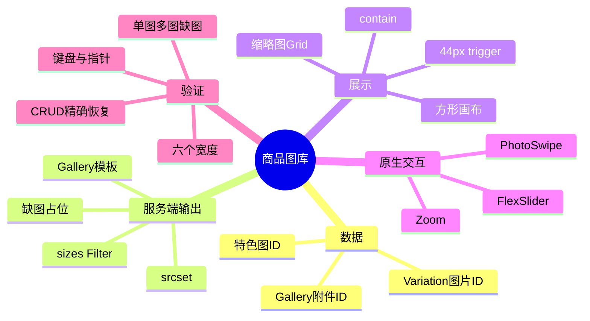
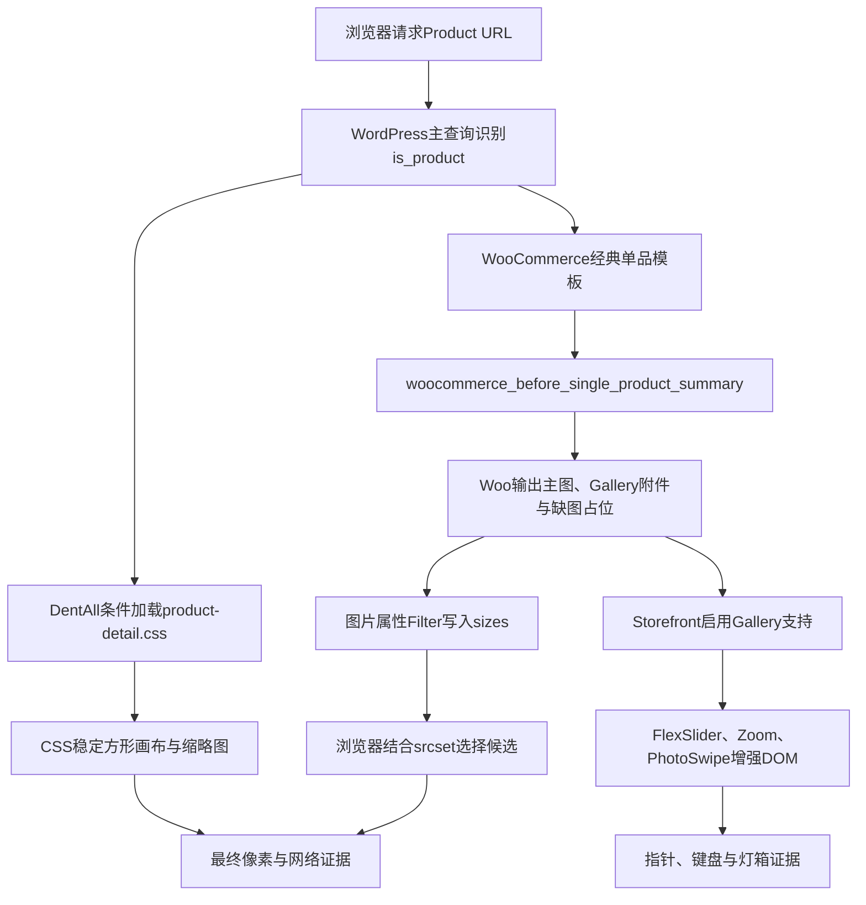

# Day56 WordPress实战：WooCommerce原生商品图库与响应式图片

## 相关笔记

- 学习索引：[[WordPress实战笔记索引]]
- 对应项目笔记：[[../Day56-商品图库与响应式图片]]
- 前置学习笔记：[[Day55-WooCommerce单品模板Hook与条件样式]]
- 后续学习笔记：D57完成后回填
- 同主题知识：[[Day38-Grid叠层与响应式图片sizes]]

## 今日学习成果

- [x] 我能解释Product特色图、Gallery附件、WordPress响应式图片与WooCommerce Gallery脚本如何分工，而不会把它们误认为一项功能。
- [x] 我能从原生Gallery输出追踪到四参数图片属性Filter，再说明浏览器怎样用`srcset`和`sizes`选择候选图。
- [x] 我能在Local用WooCommerce CRUD建立单图、多图和缺图夹具，验证后通过新进程精确恢复，并说清证据不能外推到网络404或Production。

## 真实项目场景

### 今天解决了什么问题

D55把PC商品详情调整成图库主列后，1440px Gallery约710px宽，但WooCommerce原始HTML仍告诉浏览器这张图最多只显示416px，导致新页面请求选择416×416候选，放大后清晰度不足。同时，单图样本不能证明FlexSlider缩略图、Zoom、PhotoSwipe和无主图占位在当前Woo/Storefront版本中仍稳定。

D56没有重新开发图库。项目继续让WooCommerce管理图片关系和HTML，让Storefront启用原生交互，只在DentAll子主题补方形画布、缩略图视觉、44px灯箱入口和更符合真实列宽的`sizes`。测试用#44临时形成多图及缺图状态，结束后精确恢复。

### 学习范围

- 本篇要掌握：WooCommerce经典商品图库输出、WordPress响应式图片提示、FlexSlider/Zoom/PhotoSwipe职责、CSS稳定画布与Woo CRUD可逆测试。
- 本篇明确不展开：网络图片404自动替换、移动端精确圆点、D57 Summary信息视觉、D59顶层平板布局、D61 Variation动态媒体优化、正式素材与Production性能。
- 项目真实入口：`app/public/wp-content/themes/dentall/inc/storefront-hooks.php`、`app/public/wp-content/themes/dentall/assets/css/product-detail.css`、WooCommerce `wc_get_gallery_image_html()`与Storefront Gallery支持声明。
- 验证版本与环境：仅Local登录态；WordPress 7.0.4、WooCommerce 11.0.0、Storefront 4.6.2、DentAll 0.31.0。

## 先建立整体模型

### 一句话模型

商品图库的可靠结果来自“Woo保存媒体关系 → PHP输出候选与交互数据 → CSS稳定画布 → 浏览器选图 → 原生脚本增强交互”，任何一层都不能替代其他层的证据。

### 记忆宫殿：照相馆取片台

把商品图库想成照相馆：档案柜记录一件商品有哪些底片；取片员按档案把主图和副图摆上柜台；尺寸标签告诉运输员每个展示位大约多宽；相框保证不同照片不会把柜台撑高或裁掉；放大镜、翻页册和全屏查看器则分别对应Zoom、FlexSlider和PhotoSwipe。

### 比喻对应回真实机制

| 记忆对象 | 真实技术对象 | 不能混淆的边界 |
|---|---|---|
| 底片档案柜 | Product主图ID与Gallery附件ID | 这是持久化数据；CSS不能新增或排序附件 |
| 取片员 | WooCommerce Gallery模板与`wc_get_gallery_image_html()` | 它输出HTML和数据属性，不负责DentAll视觉Token |
| 尺寸标签 | 图片`sizes`属性 | 它是浏览器候选选择提示，不会修改原文件或强制固定下载字节 |
| 候选底片 | WordPress生成的`srcset`及派生尺寸 | 候选是否存在取决于媒体文件与站点图片尺寸生成状态 |
| 方形相框 | `aspect-ratio`、Grid和`object-fit: contain` | 只稳定布局和完整显示，不等于网络错误回退 |
| 翻页册/放大镜/全屏查看器 | FlexSlider、jQuery Zoom、PhotoSwipe | 原生脚本负责行为；本日没有自定义JavaScript |

> [!warning] 准确性边界
> 浏览器最终选择哪个`srcset`候选还受视口、设备像素比、缓存和已加载候选影响。测试响应式图片时应使用全新导航或重新请求，不能只在同一页面从大到小拖动后读取`currentSrc`。

## 思维导图



最重要的主干是：先确认数据和原生输出，再分别验证浏览器候选、画布几何和交互，不用一张截图替代整条链路。

## 请求与生命周期调用链



- 触发条件：前台主查询是单个WooCommerce Product。
- 加载入口：D55已有`dentall_enqueue_product_detail_assets()`；D56不增加第二个CSS请求。
- 服务端输出：Woo从Product主图和Gallery ID生成图片、`srcset`、灯箱原图尺寸和缺图占位。
- Filter时机：`woocommerce_gallery_image_html_attachment_image_params`在附件图片HTML属性形成时接收四个参数并必须返回数组。
- 浏览器阶段：先解析`sizes`估算槽位，再结合设备像素比从`srcset`选择合适候选。
- 原生脚本阶段：多图初始化FlexSlider；可缩放图片初始化Zoom；trigger打开PhotoSwipe。
- 副作用：运行代码不写数据；只有测试夹具通过明确授权临时写#44并在结束时恢复。

## 核心概念卡

| 概念 | 准确定义 | DentAll真实例子 | 常见误区 | 如何验证 |
|---|---|---|---|---|
| Featured image | Product当前主图附件ID | #44原始主图45 | 把第一张Gallery附件当主图 | Woo CRUD读取`get_image_id()` |
| Gallery IDs | Product附加图库附件ID的有序数组 | #44临时为47～50 | 直接改postmeta或把Variation图自动算入 | Woo CRUD读写`get_gallery_image_ids()` |
| `srcset` | 同一图片的多个宽度候选及描述符 | 416、768、1254等候选 | 认为浏览器一定选择最大图 | 全新导航读取`currentSrc` |
| `sizes` | 告诉浏览器图片在不同媒体条件下预计占多宽 | 1440px提示约44.37rem | 把它当CSS宽度或强制请求 | 比较元素实际宽度、`sizes`和网络候选 |
| `object-fit: contain` | 在固定内容框内保持比例完整放入图片 | 1254方图进入708px画布 | 认为它会修复缺图或HTTP 404 | 查看计算样式与画布/图片矩形 |
| Woo Gallery增强 | Woo/主题声明支持后加载的原生交互 | FlexSlider、Zoom、PhotoSwipe | 为已有能力再写一套JS | 核对页面脚本、DOM和真实交互 |

## 项目实战代码

### 涉及文件

- `app/public/wp-content/themes/dentall/inc/storefront-hooks.php`：在Woo图片属性形成时修正初始Gallery的`sizes`。
- `app/public/wp-content/themes/dentall/assets/css/product-detail.css`：稳定单图、多图、缺图画布，调整缩略图与灯箱入口。
- `app/public/wp-content/themes/dentall/inc/setup.php`：沿用D55商品页条件CSS入队，不重复建立资源链。
- `app/public/wp-content/themes/dentall/style.css`：0.31.0缓存键。

### 从入口开始追踪

1. Product请求进入WordPress主查询，`is_product()`成立。
2. D55条件加载函数把详情CSS加入队列；Shop请求会在条件处返回。
3. Woo原生Gallery函数读取`WC_Product`的主图和Gallery附件，不经过DentAll自定义查询。
4. 每张初始Gallery图片生成HTML时，DentAll Filter替换`sizes`提示但保留其他属性。
5. 浏览器按真实断点选候选；CSS把活动slide固定成方形并使用`contain`。
6. Woo原生脚本建立缩略图、Zoom和PhotoSwipe；DentAll只调整点击面积和视觉状态。
7. Variation选择后的图片来自另一条动态数据路径，当前会恢复Woo默认`sizes`，所以留D61而不宣称全覆盖。

### 关键PHP片段

以下节选自`inc/storefront-hooks.php`：

```php
function dentall_product_gallery_image_attributes( $image_attributes, $attachment_id, $image_size, $main_image ) {
	if ( ! function_exists( 'is_product' ) || ! is_product() ) {
		return $image_attributes;
	}

	$image_attributes['sizes'] = '(min-width: 82.5rem) 44.37rem, (min-width: 75rem) calc(56.521739vw - 2.26087rem), (min-width: 48rem) calc(39.130435vw - 1.565217rem), calc(100vw - 2.5rem)';

	return $image_attributes;
}
add_filter( 'woocommerce_gallery_image_html_attachment_image_params', 'dentall_product_gallery_image_attributes', 10, 4 );
```

| 代码 | 表面动作 | 真实作用 | 为什么这样写 |
|---|---|---|---|
| 四个回调参数 | 接收Woo当前契约 | 与WooCommerce 11.0.0实际Filter签名一致 | 不假设只有主图参数 |
| `is_product()`短路 | 限制请求范围 | 防止相同Filter在非Product上下文意外改变图片提示 | 与详情CSS资源边界一致 |
| 覆盖全部Gallery图 | 不判断`$main_image` | 副图切到主画布后也占相同槽位 | 只修首图会让切换后退回错误提示 |
| 返回属性数组 | 完成Filter合同 | Woo继续转义并输出图片HTML | Filter不返回会破坏后续链路 |

### 关键CSS片段

以下节选自`product-detail.css`：

```css
.single-product div.product .woocommerce-product-gallery__image > a {
	display: grid;
	place-items: center;
	aspect-ratio: 1;
	overflow: hidden;
}

.single-product div.product .woocommerce-product-gallery__image > a > img:not(.zoomImg) {
	inline-size: 100%;
	block-size: 100%;
	object-fit: contain;
}
```

- 方形比例放在画布，不要求图片文件本身一定方形。
- `.zoomImg`是原生jQuery Zoom生成的放大图，必须排除，否则100%宽高会破坏1254×1254放大层。
- 缩略图边框始终占2px，只改变颜色和透明度，避免激活时产生布局跳动。
- `li:nth-child(n)`使用足够权重覆盖Storefront按列数生成的浮动规则；源码已有中文注释解释这一非直观选择。

### 运行证据

- 单图：#44在390/1440均为方形，0缩略图、1个44px trigger。
- 多图：#44临时5图在六个宽度下活动slide误差不超过1px，5个缩略图、唯一激活项，无横向溢出。
- 缺图：主图ID清空后输出`Awaiting product image`，方形占位、无空缩略图和无效trigger。
- 图片候选：全新1440请求从D56前416候选改为768候选；图片框约708px。
- Zoom：`.zoomImg`为1254×1254，指针进入opacity 0→1，移出1→0。
- PhotoSwipe：Enter/Space打开，ArrowRight切换并可环回，Escape关闭且焦点返回trigger。
- Shop隔离：详情CSS、FlexSlider、Zoom、PhotoSwipe、single-product脚本和Gallery DOM均为0。
- 证据能证明：当前版本、当前经典模板和Local样本下，数据、候选、布局与原生交互链成立。
- 证据不能证明：真实网络故障会自动占位、正式图片达到质量标准、真实设备/Production缓存/CWV或未来版本仍相同。

## 职责边界

| 层级 | 本主题中负责什么 | 不应该负责什么 |
|---|---|---|
| WordPress Core | 附件元数据、派生尺寸、`srcset`与基础图片HTML | 不修改核心文件或用CSS重建媒体数据 |
| WooCommerce | Product图片关系、Gallery模板、缺图占位、Variation媒体数据、原生脚本参数 | 不绕过CRUD直接依赖postmeta内部结构 |
| Storefront父主题 | 声明Gallery Zoom/Lightbox/Slider支持及默认布局 | 不直接修改父主题代码 |
| DentAll子主题 | `sizes`提示、方形画布、缩略图和trigger视觉 | 不承载商品图片事实或交易规则 |
| `dentall-core` | 本日不参与 | 不把纯主题展示塞入跨主题业务插件 |
| 数据库与uploads | 保存附件和商品关系、提供真实文件 | TEST关系不当正式事实；uploads不进源码Git |
| 浏览器 | 根据候选与设备条件下载图片，执行CSS和原生脚本 | `currentSrc`不能单独证明服务器数据或所有设备性能 |

## Hook、API与模板机制详解

| 项目 | 说明 |
|---|---|
| 机制类型 | WooCommerce Filter＋WordPress媒体响应式图片＋主题Gallery支持 |
| Filter名称 | `woocommerce_gallery_image_html_attachment_image_params` |
| 注册位置 | DentAll `inc/storefront-hooks.php`，优先级10，接受4个参数 |
| 回调输入 | 图片HTML属性数组、附件ID、请求尺寸、是否主图 |
| 必须返回 | 修改后的图片属性数组 |
| 副作用 | 只改变初始Product Gallery HTML的`sizes`；不写附件、Product或缓存 |
| 影响范围 | 经典单品页初始主图和图库副图；缺图模板与Variation动态换图路径不在同一覆盖内 |
| 移除方式 | 删除Filter注册与函数即可恢复Woo默认`sizes`；同时将主题版本回滚以刷新CSS缓存 |

### 为什么Variation换图是另一条路径

初始HTML在PHP生成时经过当前Filter；用户选择Variation后，WooCommerce前端从Variation数据对象取新的图片URL、`srcset`和`sizes`再替换现有元素。D56实测#51图片正确替换，但`sizes`恢复`(max-width: 416px) 100vw, 416px`。这不是画布失效，而是两条输出链不同；修正它需要D61重新核对Variation数据Filter、版本契约和回归面。

## 安全、数据与站点影响

| 检查面 | 本次结论 | 证据或边界 |
|---|---|---|
| 输入清洗与验证 | 运行代码不消费用户输入 | Filter只接收Woo内部图片属性 |
| Capability | 运行代码不适用；测试命令由Local管理员上下文执行 | 未新增后台动作或前台写入入口 |
| Nonce | 不适用 | 没有自定义表单或HTTP状态变更 |
| 输出转义 | 不直接输出HTML | 属性数组交回Woo/WordPress原生输出链 |
| 数据库写入 | 运行代码无；测试期间有可逆#44媒体关系写入 | 全程使用`WC_Product` CRUD并以新进程精确恢复 |
| URL与SEO | 无URL或语义变更 | Canonical和Product JSON-LD仍在；只改变图片`sizes` |
| 缓存 | 主题版本0.31.0刷新静态资源键 | 未清除页面缓存/CDN；非Local未验 |
| 支付、物流与订单 | 无影响 | 未加购、下单、扣库存或计算物流 |
| 部署与回滚 | 仅Local | 回滚PHP Filter、D56 CSS增量和版本号即可；商品数据已先恢复 |

## 动手练习

### 练习一：只读观察

- 目标：区分画布宽度、`sizes`提示和实际下载候选。
- 操作：在全新1440商品请求中查看主图矩形、`sizes`、`srcset`与`currentSrc`。
- 预期：约708px画布使用768px候选，而不是把`sizes`误当图片CSS宽度。
- 实际证据：#44全新请求命中`test-simple-product-front-768x768.webp`。

### 练习二：Local最小改动

- 改动：DevTools临时取消主图画布的`aspect-ratio`或图片的`object-fit`，观察布局与裁切，再恢复页面。
- 风险边界：只做浏览器临时实验，不修改核心、数据库或Production。
- 验证：390与1440重新测主图宽高和溢出。
- 回滚：刷新页面即可撤销DevTools临时改动；正式源码只在子主题中维护。

### 练习三：故障推演

- 假设症状：PC主图仍模糊，但布局尺寸正确。
- 可能原因：`sizes`未输出、页面/HTML缓存仍旧、派生768图不存在、浏览器复用旧候选、Variation动态路径覆盖。
- 第一项检查：全新导航读取图片的`sizes`、`srcset`和`currentSrc`三项。
- 为什么先查它：可先区分服务端提示错误、候选缺失和浏览器选择问题，再决定是否查CSS或媒体再生。

## 常见误区与排错顺序

| 现象或误区 | 可能原因 | 推荐检查顺序 | 最小验证方法 |
|---|---|---|---|
| Gallery总高度不是正方形 | 多图下总容器还包含缩略图 | 1. 测活动slide；2. 测Flex viewport；3. 再看总块 | 比较slide宽高而非Gallery总高 |
| 缩略图Grid出现空行 | Storefront clearfix伪元素成为Grid item | 1. 看Grid children；2. 查`::before/::after`；3. 关闭其content | DevTools检查伪元素与网格行 |
| 多图窄屏被裁切 | 固定100px轨道超过Gallery宽度 | 1. 计算轨道总宽；2. 看父层overflow；3. 改为`minmax(0,1fr)` | 390/768测每个缩略图和scrollWidth |
| 主图Zoom失效 | 把`.zoomImg`也强制成100%尺寸或脚本没加载 | 1. 查zoom脚本；2. 查`.zoomImg`；3. 看计算样式 | 指针进入前后读opacity与矩形 |
| Variation图又取416候选 | 动态换图不经过初始Gallery Filter | 1. 比较初始与选中后的`sizes`；2. 查Variation对象；3. 留对应Day处理 | 选择#51并读取图片属性 |
| 缺图占位正常却宣称404已修 | 把“无附件”与“网络请求失败”混为一谈 | 1. 区分数据状态；2. 查Network状态码；3. 核对是否有error处理 | 本日只把主图ID设0，不作404结论 |

## 掌握标准

- [ ] 不看笔记，能在2分钟内讲清数据、HTML、CSS、浏览器和脚本五层因果链。
- [x] 能指出项目中的真实Filter、CSS和原生Gallery入口。
- [x] 能区分WordPress媒体、WooCommerce、Storefront与DentAll子主题职责。
- [x] 能说明单图、多图、缺图、Variation动态换图与网络404的不同边界。
- [x] 能在Local完成Woo CRUD快照、临时验证和新进程恢复。
- [x] 能判断本次对数据、SEO、缓存、性能和非Local部署的影响。

当前掌握度：初识；待完成费曼自测后再提升。

## 费曼测试题

1. 不使用专业术语，怎样解释为什么710px宽的画布却可能只下载416px图片？
2. 把照相馆中的档案柜、尺寸标签、相框和放大镜逐一对应回WordPress/WooCommerce；比喻在哪里失效？
3. 从请求#44商品页开始，按顺序讲出Product数据、Gallery模板、Filter、浏览器选图和原生脚本怎样形成最终页面。
4. 为什么`sizes`应该覆盖初始Gallery全部图片，而不能只判断`$main_image`？
5. 为什么必须排除`.zoomImg`，以及如何用真实浏览器证明Zoom没有被CSS破坏？
6. 若Variation图片切换后又出现416px提示，你会先收集哪三项证据，为什么不在D56直接加JS？
7. 怎样证明一次临时商品媒体测试没有留下数据漂移？仅看页面为什么不够？

### 我的费曼答案与纠正

尚未逐题作答，因此保持“初识”。复习时每题必须同时包含通俗解释、准确术语和DentAll证据；答不出的内容回链到“请求与生命周期调用链”“Variation换图”或“常见误区与排错顺序”。

### 自测评分

当前未评分 / 14；存在未作答题，不提升掌握度。

## 间隔复习记录

| 复习节点 | 计划日期 | 完成 | 暴露的问题 | 修正位置 |
|---|---|---|---|---|
| D+1 | 2026-09-06 | [ ] | 尚未复习 | 完成后填写 |
| D+3 | 2026-09-08 | [ ] | 尚未复习 | 完成后填写 |
| D+7 | 2026-09-12 | [ ] | 尚未复习 | 完成后填写 |
| D+14 | 2026-09-19 | [ ] | 尚未复习 | 完成后填写 |

## 收尾总结

- 我今天真正理解了：商品图库不是一个组件黑盒，而是媒体数据、服务端属性、浏览器选图、CSS画布和原生脚本共同形成的管线。
- 我仍然容易混淆：浏览器缓存后的`currentSrc`可能受之前已加载候选影响，响应式图片验证需要新请求和多项证据交叉判断。
- 下次遇到类似问题，我会先检查：商品媒体关系、初始HTML的`srcset/sizes`、实际画布宽度、当前请求候选和原生脚本状态。
- 下一篇直接相关学习笔记：D57商品基础信息输出，完成后补成Wiki链接并双向回填。

## 后续如何向AI高效提问

```text
环境：WordPress 7.0.4、WooCommerce 11.0.0、Storefront 4.6.2、DentAll子主题，Local。
目标：排查商品图库清晰度、布局或原生交互。
真实入口：给出Product ID、图片ID、Gallery DOM、相关Hook与最小CSS。
已观察证据：给出viewport、元素矩形、srcset、sizes、currentSrc、Console/PHP日志和复现步骤。
边界：不改核心、不直接写postmeta、不先加模板/JS、不碰Production；临时数据必须快照和恢复。

请先区分媒体数据、PHP输出、浏览器候选、CSS画布和原生脚本，再给最小只读检查、确认后的最小修复、状态矩阵及回滚。不要把缺附件占位等同于网络404回退。
```

> [!warning] AI验证边界
> Hook参数、模板路径、Variation媒体数据和浏览器候选算法都与版本相关。AI解释必须回到当前源码、HTML、网络和Local实验核对；截图不能证明数据库已恢复。

## 变种应用到其他项目

| 新场景 | 保持不变的原则 | 可能变化的实现 | 必须重新确认 | 最小验证 |
|---|---|---|---|---|
| 另一个Storefront子主题 | 原生Gallery优先、固定画布、状态矩阵 | Token、列宽和`sizes`公式 | Storefront/Woo版本与容器 | 单/多/缺图＋Zoom/灯箱 |
| 其他经典Woo主题 | Product媒体和WordPress候选机制 | 主题是否声明Gallery支持、DOM与脚本 | 父主题Hook和CSS权重 | 初始HTML、资源与六宽 |
| WordPress区块主题 | 媒体数据、响应式候选和可逆测试原则 | Product Gallery Block及Interactivity API | 当前Woo Blocks版本 | 编辑器/前台和Variation路径 |
| 独立插件 | 数据正确性和扩展点回滚 | Filter生命周期与跨主题兼容 | 是否真应跨主题存在 | 激活/停用、多主题与数据不变量 |
| Shopify或其他平台 | 媒体顺序、槽位提示、稳定画布、状态/设备验证 | Liquid/JSON模板、Section、平台CDN图片参数，待验证 | 官方媒体与变体机制、缓存/发布模型 | 测试商品、多视口、网络候选 |

### 变种练习

若迁移到另一个Woo经典主题，先不复制DentAll选择器，回答：该主题是否启用Woo Gallery三项支持；主图实际列宽怎样变化；图片候选由谁生成；缺图DOM是什么；Variation换图是否沿用同一属性链；如何建立可逆商品夹具。

## 可复用核心思想

### 跨平台不变量

媒体数据、响应式传输、稳定布局和交互可用性必须分层验证。平台能输出图片不代表候选合适，画布方形不代表请求失败可恢复，鼠标可操作也不代表键盘路径成立；每项结论都要对应可观察证据。

### WordPress/WooCommerce当前实现

DentAll在当前版本复用Woo Product图片关系、WordPress`srcset`、Woo Gallery模板和Storefront的FlexSlider/Zoom/PhotoSwipe；子主题通过四参数图片属性Filter与页面专用CSS最小扩展。测试数据使用`WC_Product` CRUD，不直接依赖postmeta，并用新进程核对精确恢复。

### Shopify或其他平台的对应机制

可迁移的是“平台媒体模型作为事实源、CDN/浏览器按槽位选候选、主题稳定画布、原生图库优先、状态与设备矩阵验证”的原则。Shopify的Liquid图片URL/过滤器、Product media、Section与Variant media具体合同在DentAll未实测，均标记待验证，不自动扩大本项目范围。
