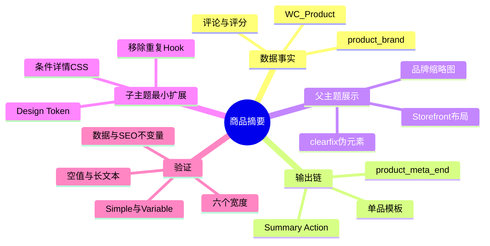
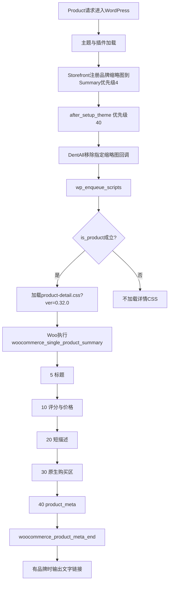

# Day57 WordPress实战：WooCommerce商品摘要Hook与状态驱动样式

## 相关笔记

- 后续并行推荐区实践：[[Day64-WooCommerce关联商品与原生循环边界]]
- 学习索引：[[WordPress实战笔记索引]]
- 对应项目笔记：[[../Day57-商品基础信息与原生品牌输出]]
- 前置学习笔记：[[Day56-WooCommerce原生商品图库与响应式图片]]
- 后续学习笔记：[[Day58-WooCommerce原生加购与测试隔离]]
- 同主题项目决定：[[../../DECISIONS#ADR-035：商品详情保留原生文字品牌并移除Storefront重复缩略图|ADR-035]]

## 今日学习成果

- [x] 我能从`woocommerce_single_product_summary`的优先级解释标题、评分、价格、摘要、购买区和Meta的输出顺序，并知道CSS不是业务事实源。
- [x] 我能区分Storefront品牌缩略图与WooCommerce `product_meta`品牌文字的两条输出链，并只移除重复的前者。
- [x] 我能用状态矩阵验证Regular/Sale/Variation价格、库存、空评分、空品牌和长文本，同时明确没有真实数据时哪些结论只能到源码/Hook合同层。

## 真实项目场景

### 今天解决了什么问题

D55已经确认DentAll使用WooCommerce经典单品结构，D56完成原生图库。D57面对的不是“缺少商品字段”，而是同一组原生字段缺少稳定的视觉层级：Storefront的Sale标签仍占据普通文档流，导致#44摘要比图库低约43px；标题和价格尺寸过大；摘要、库存和Meta的间距缺少统一节奏。

当前WooCommerce还同时提供两条品牌展示链：Storefront在摘要优先级4输出品牌缩略图，WooCommerce在`product_meta`末尾输出文字品牌链接。两者都读取同一个`product_brand`事实，商品有品牌时会重复表达。因此D57只把Storefront缩略图从Hook上摘下，保留原生Meta文字链接和Product Schema，不改品牌关系、归档或筛选。

### 学习范围

- 本篇要掌握：经典单品Summary Action、模板条件输出、回调身份与优先级、状态驱动CSS、父主题clearfix残留和只读证据分层。
- 本篇不覆盖：购买区重构、Variation价格/图片联动优化、移动/平板顶层堆叠、评价录入、品牌数据创建、区块单品模板或非Local部署。
- 下次遇到类似问题，我会先问：事实存在于哪里、谁输出HTML、是否有两条重复输出链、空状态由谁决定、CSS选择器会命中哪些动态节点。

## 先建立整体模型

### 一句话模型

WooCommerce保存商品事实并通过模板回调输出语义HTML，父主题安排默认展示，子主题只在明确的Hook和CSS边界内删掉重复展示、建立视觉层级。

### 记忆宫殿或实体比喻

把商品详情想成超市货架：

- WooCommerce商品对象是仓库账本，记录价格、库存、SKU、分类、品牌和评价事实。
- `woocommerce_single_product_summary`是带编号的货架轨道，优先级5、10、20、30、40代表标签依次挂入的位置。
- WooCommerce模板是标签打印机，决定有数据时打印什么HTML、没有数据时是否完全不打印。
- Storefront是默认陈列员，会在轨道优先级4额外挂一张品牌海报。
- DentAll CSS是门店视觉规范，只改变字号、间距、颜色与位置，不得把不存在的价格、库存或评价画出来。
- `remove_action()`像把重复海报从指定卡扣上摘下；它不会涂改仓库账本，也不会拆掉后面的文字品牌标签。

### 比喻对应回真实机制

| 比喻 | 真实机制 | D57边界 |
|---|---|---|
| 仓库账本 | `WC_Product`、taxonomy关系、评价数据 | 只读，不保存或更新 |
| 编号轨道 | `woocommerce_single_product_summary` Action及优先级 | 不重排Woo核心字段 |
| 标签打印机 | `templates/single-product/*.php` | 不做模板覆盖 |
| 重复品牌海报 | `storefront_woocommerce_brands_single`，优先级4 | 精确移除 |
| 文字品牌标签 | `WC_Brands::show_brand`挂在`woocommerce_product_meta_end` | 保留 |
| 门店视觉规范 | `assets/css/product-detail.css` | 只改展示，不伪造状态 |

## 思维导图



## 请求与生命周期调用链



关键点是“移除时机”和“回调身份”必须同时正确。`remove_action()`需要与注册时完全相同的Hook名、回调名和优先级；D57在`after_setup_theme`优先级40执行时，Storefront的回调已经注册，而WooCommerce的Meta品牌回调是另一条Hook，不会被误删。

## 核心概念卡

| 概念 | 要点 | 常见误判 |
|---|---|---|
| 事实、输出、样式三层 | 数据决定内容，模板决定DOM，CSS决定视觉 | 用CSS `content`伪造库存或评价 |
| Action优先级 | 数字越小越早输出；相同优先级按注册次序 | 只看模板文件，忽略Hook注册 |
| 条件输出 | `rating.php`在0评分时不输出；短描述为空时提前返回 | 把“DOM不存在”当成CSS隐藏 |
| 空价格 | `price.php`仍输出`.price`容器，内容可为空 | 笼统说所有空字段都不输出 |
| 双品牌链 | Storefront缩略图与Woo Meta文字是独立回调 | 删除taxonomy或隐藏整个Meta |
| clearfix残留 | 父主题的`::before/::after`在Flex/Grid中会成为项目 | 只看真实子元素数量，不看伪元素 |
| 动态Variation库存 | JS把`availability_html`插入Variation区域；仍使用`.stock` | 把统一展示样式误写成购买逻辑 |

## 项目实战代码

### 涉及文件

| 文件 | 职责 | 为什么放这里 |
|---|---|---|
| `inc/storefront-hooks.php` | 移除Storefront重复品牌缩略图 | 这是父主题Hook适配，不是模板内容 |
| `assets/css/product-detail.css` | 商品详情字段的局部视觉层级 | 已由D55按`is_product()`条件加载 |
| `inc/setup.php` | 详情CSS加载入口与职责注释 | 不新增请求，只更新准确说明 |
| `style.css` | 子主题版本0.32.0 | 刷新现有资源缓存键 |

### 从入口开始追踪

WooCommerce当前注册顺序位于`includes/wc-template-hooks.php`：标题优先级5，评分与价格10，摘要20，购买区30，Meta 40。对应的HTML来自`templates/single-product/`下的`title.php`、`rating.php`、`price.php`、`short-description.php`和`meta.php`。

Storefront 4.6.2在`inc/woocommerce/storefront-woocommerce-template-hooks.php`把`storefront_woocommerce_brands_single`挂到Summary优先级4。WooCommerce 11.0.0的`WC_Brands`则把`show_brand()`挂到`woocommerce_product_meta_end`，并用另一条`woocommerce_structured_data_product` Filter维护Schema。

### 关键代码片段

```php
function dentall_remove_storefront_product_brand_thumbnail() {
	if ( function_exists( 'storefront_woocommerce_brands_single' ) ) {
		remove_action( 'woocommerce_single_product_summary', 'storefront_woocommerce_brands_single', 4 );
	}
}
add_action( 'after_setup_theme', 'dentall_remove_storefront_product_brand_thumbnail', 40 );
```

这里检查父主题函数是否存在，避免父主题或集成能力变化时直接调用不存在的符号。它只删除一个指定回调，不删除`product_brand`、不隐藏`.product_meta`，也不接触Schema Filter。

```css
.single-product div.product .summary .woocommerce-product-rating {
	display: flex;
	align-items: center;
	flex-wrap: wrap;
	gap: var(--dentall-space-8);
}

.single-product div.product .summary .woocommerce-product-rating::before,
.single-product div.product .summary .woocommerce-product-rating::after {
	content: none;
}
```

第二组不是装饰。Storefront原本用两个伪元素做浮动清除；容器改成Flex后，它们会变成额外Flex item并产生空白`gap`，所以必须在同一局部作用域关闭。

```css
.single-product div.product > .onsale {
	position: absolute;
	inset: var(--dentall-space-12) auto auto var(--dentall-space-12);
}
```

商品根容器已由Storefront设为`position: relative`。因此Sale标签可进入图库左上角而不再推低Summary；文字`Sale!`仍由WooCommerce根据真实促销状态输出。

```css
.single-product div.product .summary > .price del ~ ins {
	margin-inline-start: var(--dentall-space-8);
}
```

WooCommerce 11会在`del`与`ins`之间插入原价的`.screen-reader-text`，所以相邻兄弟`del + ins`无法命中。一般兄弟`~`可跨过该无障碍节点；完整作用域又把它限制在Summary顶层价格，不会误改Variation动态价格。

### 运行证据

- #44 Simple：Regular `$29.99`、Sale `$24.99`、库存8、SKU和分类保持原值；Sale标签位于图库内部且不覆盖Summary。
- #46 Variable：初始价格区间`$39.99–$49.99`、两个原生Select和Variation form保持；51/52/53的库存HTML分别为`5 in stock`、`Out of stock`、`3 in stock`。
- 390/768/1024/1199/1200/1440px均无页面横向溢出；1199/1200断点两侧保持D55列宽合同。
- 当前两件商品评分数与品牌关系均为0，因此前台正确不输出评分和品牌；正向非空视觉只完成源码/Hook合同复核，没有制造数据冒充实页证据。
- Hook审计结果：Summary品牌缩略图回调不存在，`woocommerce_product_meta_end`仍保留`WC_Brands::show_brand@10`。

## 职责边界

| 责任 | WooCommerce | Storefront | DentAll D57 |
|---|---|---|---|
| 价格/库存/SKU事实 | 保存并通过CRUD/API读取 | 不拥有 | 不修改 |
| 字段HTML | 原生模板与回调 | 提供默认样式/布局 | 不复制模板 |
| 品牌关系/归档/筛选 | `product_brand` | 可追加缩略图展示 | 只移除重复缩略图 |
| Product Schema | Woo结构化数据与Brands Filter | 不作为事实源 | 不改 |
| 商品详情视觉 | 提供基础样式 | 默认主题外观 | 使用局部CSS和既有Token |
| Variation选择与购买 | Woo原生JS和表单 | 默认布局 | D57不改逻辑；D61仍负责动态媒体/价格优化 |

## Hook、API或模板机制详解

### 为什么不覆盖模板

当前需求只需要调整视觉与删除一个父主题回调。模板覆盖会复制WooCommerce文件，未来升级时必须持续比较模板版本，还容易误删价格的无障碍文字、Variation表单数据或Meta扩展Hook。公开Action和局部CSS已经能完成任务，因此模板覆盖没有收益。

### 为什么保留`product_meta`品牌文字

Meta文字链接与SKU、分类属于同一信息区，能保持文本可读、键盘可达和taxonomy链接语义。Storefront缩略图是在标题前新增的第二份视觉表达。移除后者既消除重复，也避免在有品牌商品上额外请求缩略图资源；但真实节省量要等有品牌样本和网络测量，不能写成已证实的性能提升。

### 空状态是谁决定的

- `rating.php`：评价功能关闭或`rating_count=0`时不输出容器。
- `short-description.php`：过滤后的摘要为空时直接返回。
- `price.php`：始终输出`.price`段落，内部价格HTML可能为空。
- `meta.php`：SKU、分类、标签分别按原生条件输出，最后开放`woocommerce_product_meta_end`扩展点。
- Variation库存：Woo前端脚本按匹配Variation的`availability_html`动态插入；D57的`.stock`规则只改变间距与字重。

## 安全、数据与站点影响

| 领域 | 结论 |
|---|---|
| 输入/权限/nonce | 没有新输入、后台动作或写入端点，因此没有新增nonce/capability路径 |
| 数据 | 只读检查；商品、价格、库存、评价、品牌关系均未保存或更新 |
| URL/SEO | Product URL、Canonical、robots、Title、Sitemap不变；Schema品牌Filter保留 |
| 性能 | CSS文件增大并由版本键刷新；无新请求、查询、远程调用、Cron或JS |
| 缓存 | 主题版本0.32.0改变现有子主题静态资源查询键；未清页面/CDN缓存 |
| 交易 | 加购、Variation匹配、库存扣减、结账、支付、物流和订单均未改 |
| 部署 | 仅Local工作树；未推送或部署Staging/Production |

## 动手练习

### 练习一：只读观察

1. 打开WooCommerce的`includes/wc-template-hooks.php`，列出Summary优先级5、10、20、30、40的回调。
2. 对照`rating.php`、`short-description.php`和`price.php`，分别回答空值时DOM是否存在。
3. 在浏览器DevTools Elements中搜索`.storefront-wc-brands-single-product`与`.product_meta .posted_in`，不要只看可见文字。

验收：能说明“没有元素”“元素为空”“元素被CSS隐藏”是三种不同状态。

### 练习二：Local最小改动

在DevTools临时修改标题或价格的一个Token值，然后判断它属于全局Token、详情共用规则还是单一状态规则。回到源码只修改最小职责处，重载390/768/1024/1440，不把DevTools临时值当成交付。

验收：能指出实际命中的规则、继承来源和为什么没有创建新文件。

### 练习三：故障推演

假设有评分商品的星级和评价链接之间突然多出两段空白：

1. 检查容器的真实子元素和`::before/::after`。
2. 查看父主题是否仍给clearfix伪元素`display: table`。
3. 确认Flex容器中伪元素是否成为item并参与`gap`。
4. 只在该评分容器作用域将伪元素`content`设为`none`。

验收：不通过全局关闭所有clearfix来“修复”一个局部问题。

## 常见误区与排错顺序

| 现象或误区 | 原因 | 排错顺序 |
|---|---|---|
| 品牌仍重复 | 移除时机太早、回调名或优先级不一致 | 查注册源码→查运行Hook→查DOM |
| 品牌文字也消失 | 错删`woocommerce_product_meta_end`或隐藏整个Meta | 分开检查两条输出链 |
| 0评分看不到星级 | 原生模板不输出，不是CSS故障 | 查`rating_count`→模板条件→DOM |
| Sale标签推低摘要 | 仍在普通流或定位上下文错误 | 查根容器定位→badge矩形→遮挡 |
| 星级出现额外间隙 | clearfix伪元素成为Flex item | 查伪元素→Flex items→局部关闭 |
| 选Variation后库存样式不同 | 动态HTML位置/选择器作用域不一致 | 查`availability_html`→插入DOM→计算样式 |
| 用伪元素补“Out of stock” | CSS伪造业务事实且可能与真实数据冲突 | 回到`WC_Product`库存状态和原生模板 |

推荐顺序是：数据对象 → Hook注册 → 模板条件 → 实际DOM → 计算样式 → 多视口 → Console/PHP日志。不要从截图直接猜数据库或Hook。

## 掌握标准

- [ ] 能不看笔记画出Summary优先级5～40的主要回调。
- [ ] 能解释为什么删除Storefront缩略图不会删除Meta品牌或Schema品牌。
- [ ] 能分别说明0评分、空摘要和空价格的DOM行为。
- [ ] 能在DevTools发现伪元素参与Flex/Grid的布局问题。
- [ ] 能设计Simple Sale、Variable区间、动态库存、无品牌/评分和六宽验证矩阵。
- [ ] 能说清Local证据为何不能外推到真实品牌、辅助技术或Production缓存。

当前自评：初识。虽然已跟随真实改动完成Hook、CSS和证据链，但尚未独立复演正向评分/品牌夹具和真实辅助技术。

## 费曼测试题（保留5～7道）

1. 为什么`remove_action()`必须同时写对Hook、回调和优先级？
2. 评分数为0时，为什么增加`.woocommerce-product-rating { display:flex }`不会让星星出现？
3. Storefront品牌缩略图与Woo Meta品牌文字分别从哪里输出？
4. 为什么Sale价格要保留`del`、`ins`和屏幕阅读器文本，而不能拼成普通字符串？
5. 为什么`.stock`样式会命中Variation动态库存，却不等于修改购买逻辑？
6. 为什么把父主题clearfix伪元素留在Flex容器中可能出现“幽灵间隙”？
7. 当前无品牌/无评价样本时，可以安全宣称什么，不能宣称什么？

### 我的费曼答案与纠正

1. WordPress按三者共同识别要移除的注册；任一不一致都不会命中原回调。
2. 模板在`rating_count=0`时已经提前不输出DOM，CSS不能创建真实评价数据。
3. 前者来自Summary优先级4的Storefront函数；后者来自`product_meta_end`上的`WC_Brands::show_brand`。
4. 这些语义元素保留原价/现价关系和可访问文字，普通拼接会损失结构与平台格式化。
5. 它只作用于Woo已经生成的`.stock`节点，Variation匹配、价格、库存事实和按钮状态仍由Woo控制。
6. `::before/::after`生成盒后会成为Flex item，参与`gap`、换行与对齐。
7. 可确认空状态和源码/Hook合同；不能把正向品牌图、星级视觉或真实数据质量写成已实页验收。

### 自测评分

- 当前：0/7（待离开笔记后独立复述）。
- 达到6/7且能在Local独立定位一次Hook或伪元素问题后，可把掌握度更新为“能解释”。

## 间隔复习记录

| 节点 | 日期 | 任务 | 结果 |
|---|---|---|---|
| 当天 | 2026-09-07 | 对照源码画出Summary与品牌双链 | 已完成 |
| +1天 | 待填写 | 不看答案回答7道费曼题 | 待复习 |
| +7天 | 待填写 | 用DevTools复演一个空状态和clearfix问题 | 待复习 |
| +30天 | 待填写 | 比较经典模板与区块单品机制 | 待复习 |

## 收尾总结

- 今天真正掌握的核心：同一商品事实可以有多条展示链；最小改动应删除重复展示回调，而不是破坏数据或复制模板。
- 今天最容易忘记的边界：空状态不都一样；0评分和空摘要会不输出，空价格容器仍可能存在。
- 下次最先检查：Hook身份/优先级、模板条件、实际DOM和伪元素，再看CSS。
- 下一篇直接相关学习笔记：D58购买区完成后回填，并建立双向链接。

## 后续如何向AI高效提问

### 提问公式

```text
环境：WordPress/WooCommerce/父主题/子主题准确版本与页面类型。
目标：说明要调整的原生字段或重复输出，不先指定模板覆盖。
事实：Product ID、类型、价格/库存/评分/品牌状态和当前DOM。
Hook：给出回调名、Hook名、优先级与源码位置。
证据：视口、计算样式、元素矩形、Console/PHP日志、数据只读结果。
边界：不改核心、不伪造业务数据、不碰购买逻辑/非Local，超范围先确认。

请先分离数据、模板、Hook和CSS职责，再给最小方案、状态矩阵、回滚及不能外推的证据边界。
```

### 提问前准备

- 准确记录页面是Simple、Variable还是某个已选Variation。
- 列出元素是服务端初始HTML还是Woo脚本动态插入。
- 记录父主题和WooCommerce版本，因为回调与模板可能变化。
- 用DevTools复制实际选择器与计算值，不凭设计稿猜DOM。
- 若需要正向品牌/评价数据，先单独确认可逆夹具与恢复方案。

### 可复制的代码理解提示词

```text
请按“请求生命周期→Hook注册→模板条件→DOM→CSS级联”解释这段WooCommerce商品详情代码。
重点回答：每个字段的事实源、空状态、回调优先级、父主题责任、子主题最小覆盖、升级风险。
不要把截图当数据库证据，也不要建议修改WooCommerce或父主题核心文件。
```

### 可复制的排错提示词

```text
现象：商品详情中的标题/评分/价格/库存/Meta或品牌重复、错位或空白。
已知：提供Product ID、类型、当前数据、实际DOM、Hook列表、计算样式、viewport和日志增量。
请依次排查数据、Hook、模板条件、动态Variation HTML、伪元素、CSS权重和缓存版本；
每一步给一个最小可观察证据，并区分修复与范围外增强。
```

## 变种应用到其他项目

| 新场景 | 保持不变的原则 | 可能变化的实现 | 必须重新确认 | 最小验证 |
|---|---|---|---|---|
| 另一个Storefront子主题 | 数据/输出/样式分层 | Token和选择器 | Storefront版本及品牌集成 | Hook列表＋有/无品牌 |
| 其他经典Woo主题 | 原生模板优先 | 父主题回调与clearfix | Summary注册顺序 | Simple/Variable＋空态 |
| Woo区块主题 | 不伪造事实、保留可访问语义 | Blocks与Interactivity API | 当前Block合同 | 编辑器/前台/动态状态 |
| 独立插件 | 回调精确、停用可回滚 | 跨主题Hook保护 | 是否真需跨主题生命周期 | 多主题激活/停用 |
| Shopify或其他平台 | 商品事实与展示组件分离 | Liquid/JSON/Section，待验证 | 平台的Product/Variant/SEO合同 | 测试商品＋多视口 |

### 变种练习

如果另一个主题也重复显示品牌，不要复制D57函数名后直接移除。先查该主题实际注册的Hook、回调和优先级，再确认另一条品牌文字与Schema是否独立；只有责任关系一致时才采用同类方案。

## 可复用核心思想

### 跨平台不变量

商品事实、语义输出和视觉呈现必须分层。移除重复展示不等于删除数据；状态样式必须消费真实状态而非创造状态；空值、长文本和动态状态都要明确谁负责。

### WordPress/WooCommerce当前实现

DentAll在WooCommerce 11.0.0与Storefront 4.6.2中复用经典单品模板和Summary Action，只在子主题`after_setup_theme`移除一个重复品牌缩略图回调，并用条件详情CSS建立标题、评分、价格、摘要、库存和Meta层级。Hook列表、模板条件、DOM、六宽和CRUD只读结果共同构成证据。

### Shopify或其他平台的对应机制

可迁移的是“平台商品模型为事实源、主题组件负责输出、局部样式消费状态、重复展示在扩展点解除”的原则。Shopify Product/Variant、Liquid或JSON模板、Theme Section、Metafield及结构化数据的具体对应关系在DentAll未实测，全部待验证，不自动进入本项目范围。
