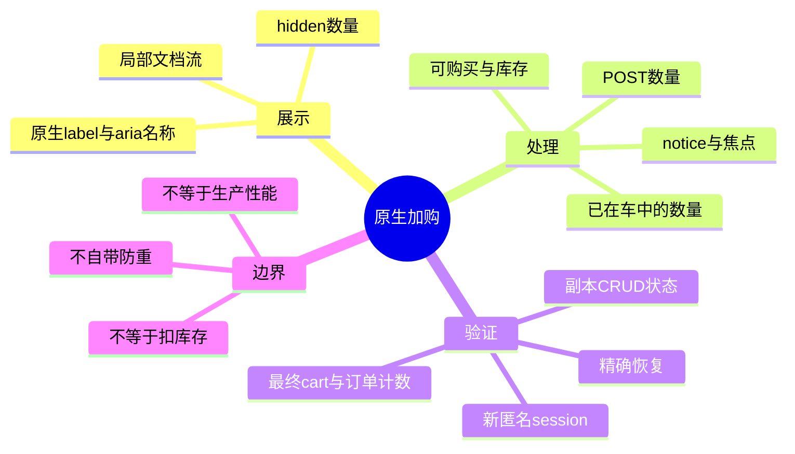
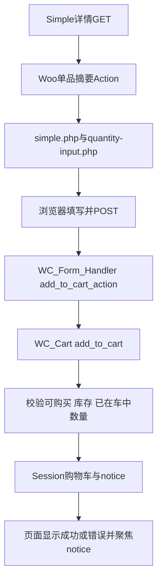

# Day58 WordPress实战：WooCommerce原生加购与测试隔离

## 相关笔记

- 学习索引：[[WordPress实战笔记索引]]
- 对应项目笔记：[[../Day58-简单商品购买区与隔离购物车验证]]
- 前置学习笔记：[[Day57-WooCommerce商品摘要Hook与状态驱动样式]]
- 后续学习笔记：[[Day59-响应式单品布局与主题配置边界]]。
- Variable购买续接：[[Day61-变体生命周期与展示语义]]。

## 今日学习成果

- [x] 能沿Simple模板、Form Handler、Cart、notice追踪一次原生POST加购，区分请求、购物车和订单。
- [x] 能用实页DOM、computed CSS与AX解释标签重叠和accessible name不一致的原因及最小修复。
- [x] 能解释为什么Git worktree不能独立隔离Woo数据库、session和持久购物车；在副本执行验证不等于操作主Local。

以上是本篇有证据的内容覆盖，不代表用户已独立完成费曼测试。

## 真实项目场景

### 今天解决了什么问题

D57已有商品信息和Gallery，D58需要让Simple购买区更清楚。现有Woo已经提供数量、加购、库存判断和反馈，因此最小工作是展示和验证，不能把完整交易再写一遍。危险点恰好藏在看起来简单的动作中：同用户的新标签仍可能共享持久购物车，反复提交POST会累计数量，显示label也可能被`aria-label`和上游CSS影响。

### 学习范围

- 掌握原生Classic Simple表单、局部CSS、可访问名称、HTTP/CRUD验证和环境隔离。
- 不展开真实结账/支付/退款，不新增防重/AJAX，不实现D59顶层响应式或D61 Variation联动。
- 实际入口：`inc/setup.php`按页资源、`assets/css/product-detail.css`、Woo `templates/single-product/add-to-cart/simple.php`与`includes/class-wc-form-handler.php`。

## 先建立整体模型

### 一句话模型

浏览器提交的是购买意图，WooCommerce依据商品与当前购物车判断能否接受；CSS只改变意图输入的呈现方式。

### 记忆宫殿或实体比喻

把购物车想成顾客的取货清单：柜台上的标签与输入框负责让顾客写清数量，工作人员核对商品和现有清单，再把结果写回清单。库存货架和正式结算单是另外两个对象，不能因为清单多了一项就说库存已扣或交易已完成。

| 比喻 | 真实机制 | 边界 |
|---|---|---|
| 柜台表格 | Simple POST form与quantity input | HTML min/max不能代替服务端校验 |
| 核对人员 | `WC_Form_Handler`与`WC_Cart` | 接受重复请求不等于幂等 |
| 顾客清单 | WC session购物车、登录用户持久购物车 | 不同标签不自动成为不同用户 |
| 货架/结算单 | Product库存/Order | 加购不是下单，也不是本日库存预占证据 |
| 练习柜台 | 独立文件、DB、地址、身份副本 | 仅Git分支隔离不够 |

## 思维导图



主干是“显示、处理、最终状态分别取证”，不要用一张成功截图替代全部判断。

## 请求与生命周期调用链



- 输入：`add-to-cart`商品ID和`quantity`；浏览器number验证与服务端数量归一化是两层。
- Simple模板在商品不可购买时提前返回；缺货、空价格和Draft不是同一种状态。
- 同商品已在cart中时，成功请求会累加数量；没有新的交易ID或自定义防重键。
- 页面普通POST与目录`.add_to_cart_button` AJAX绑定不同，不能把目录loading类的行为套到Simple按钮上。
- 当前配置是否redirect要查实际处理与选项，不能假设POST必有完整PRG保障。

## 核心概念卡

| 概念 | 准确定义与项目例子 | 常见误区 | 验证 |
|---|---|---|---|
| 可购买 | Product类型/发布状态/价格等共同决定 | `in stock`就一定有购买按钮 | 读`is_purchasable`及真实匿名页 |
| 可见性 | catalog hidden影响目录发现 | hidden等于直链禁购 | 目录与直链分别测 |
| 库存上限 | 还要考虑cart已有数量 | 输入max8就总能再加8 | 先加2再加7，检查拒绝与cart |
| accessible name | 输入`aria-label`会优先于关联label | 有`for`就代表名称一致 | 同时读DOM与AX |
| 恢复 | 被改业务字段及日期按基线恢复 | 改回价格就算精确恢复 | 新进程CRUD JSON对比 |

## 项目实战代码

### 涉及文件与入口

- `app/public/wp-content/themes/dentall/inc/setup.php`：在`is_product()`时enqueue现有详情CSS。
- `app/public/wp-content/themes/dentall/assets/css/product-detail.css`：Simple购买区普通文档流、标签增强。
- `app/public/wp-content/themes/dentall/inc/storefront-hooks.php`：只为当前Simple主商品缩短数量标签展示参数。
- Local副本Woo `templates/global/quantity-input.php`：原生关联label和`aria-label="Product quantity"`，保留核心不改。

### 关键代码片段

下列代码来自本日详情CSS，不是替代Woo模板的示例：

```css
.single-product div.product.product-type-simple .summary form.cart .quantity {
	float: none;
	margin: 0;
}

.single-product div.product.product-type-simple .summary .quantity:has(input:not([type="hidden"])) {
	margin-bottom: var(--dentall-space-16);
}
```

第一条取消父主题数量浮动，使数量与后续按钮沿文档流排列；第二条只给可见数量留间距。Woo在独售或min=max且大于0时输出hidden input，本规则不会把该状态强行显示。

展示Filter只改变Woo数量模板收到的`product_name`，让模板回退到自身可翻译的`Quantity`；其他数量参数和交易处理保持原样：

```php
function dentall_simple_quantity_input_args( $args, $product ) {
	if (
		is_product()
		&& $product instanceof WC_Product
		&& $product->get_id() === get_queried_object_id()
		&& $product->is_type( 'simple' )
	) {
		$args['product_name'] = '';
	}

	return $args;
}
add_filter( 'woocommerce_quantity_input_args', 'dentall_simple_quantity_input_args', 10, 2 );
```

四个条件把作用域限制在商品详情、有效商品对象、当前主商品和Simple类型。Variable主商品、关联商品及非商品页都保持Woo默认参数。

恢复label可见时还需要`position:static !important`：实页computed证明WooCommerce CSS保留了`position:absolute!important`。只写普通`position:static`会使标签与输入占据同一位置。这里的重要声明有明确上游原因，不能推导为“以后所有规则都加!important”。

### 运行证据

- 独立地址`http://127.0.0.1:10558/product/test-d12-simple-fixed-pack/`。
- 数量2、Tab到Add to cart、Enter后，cart显示2件/$49.98，商品库存仍8；notice为`role=alert`且自动获取焦点。
- 六宽DOM量测：页面横溢出0，输入/按钮44px，修复后可见标签为`Quantity`、输入可访问名称为`Product quantity`，标签与输入间距8px。
- 这些证据证明本版本本机流程，不证明真实辅助技术、所有浏览器、生产缓存或高并发。

## 职责边界

| 层级 | 本日职责 | 不承担 |
|---|---|---|
| WordPress | 请求、Hook、资源生命周期 | 不为展示修改核心 |
| WooCommerce | 商品API、数量、加购、cart、notice | 不重新实现一套交易 |
| Storefront | 经典单品父主题结构 | 不直接改父文件 |
| DentAll主题 | 局部展示与可访问增强 | 不写订单/库存/永久业务配置 |
| `dentall-core` | 保持既有站点级规则 | 不收纳纯CSS需求 |
| 临时副本 | 承载可逆TEST与取证 | 不当作生产部署或长期工具产品 |
| 浏览器 | 表单校验、焦点、视觉 | 不决定服务端最终库存事实 |

## Hook、API或模板机制详解

| 机制 | 本日事实 |
|---|---|
| `woocommerce_single_product_summary` | 原生摘要链输出购买区，未重排 |
| `woocommerce_quantity_input_args` | 只为当前Simple主商品清空展示用`product_name`，保留其他数量参数 |
| `wc_get_quantity_input_args` | 由Product生成min/max/step；min=max时可转hidden |
| `WC_Form_Handler::add_to_cart_handler_simple` | 读取并归一化POST数量，调用cart逻辑 |
| `WC_Cart::add_to_cart` | 判断可购买、库存及购物车累计数量；同商品成功请求合并 |
| `wc_add_to_cart_message` / notices模板 | 原生结果文案及alert语义，已有Woo脚本负责焦点 |

## 安全、数据与站点影响

| 检查面 | 结论与证据边界 |
|---|---|
| 输入 | 沿用原生POST；0/空/负数/小数要分别检查浏览器和服务端归一化，不假定统一错误 |
| Capability/Nonce | 不新增后台写入口；不能把缺少自定义nonce直接当作原生访客加购漏洞，按Woo合同评估 |
| 输出 | 沿用Woo模板转义和国际化，不用CSS伪造业务文案 |
| 数据 | 仅副本TEST CRUD/session；共享源库不写入 |
| URL/SEO | 运行显示不改变Slug/Canonical/Schema；副本地址替换是环境适配且noindex |
| 缓存 | 沿用Woo会话/响应规则；生产页面缓存与性能另验 |
| 支付/物流/订单 | 本日不结账，副本阻断结账、网关、邮件与外部WP HTTP |
| 部署/回滚 | 交付代码增量；副本绝不整库导回源；临时服务身份校验后停止 |

## 动手练习

### 练习一：只读观察

DevTools选中`.summary form.cart`，核对method、quantity min/max和label/aria-label；在Computed中查position并展开来源。实际已发现上游important造成重叠，这比盲目增加margin更能定位原因。

### 练习二：Local最小改动

先在DevTools临时试验局部规则，再判断属于Token、公共控件还是Simple局部规则；回到子主题源码修改、同步副本、六宽回归。DevTools修改不会自动进入Git。恢复用源码提交反向变更，数据实验另外按CRUD基线恢复。

### 练习三：故障推演

症状：点击两次后cart数量变成2。第一项查请求和最终cart，确认是否发出两次成功POST；不能先把按钮变disabled就宣布解决服务端重复提交。若需要幂等，必须另定业务合同、状态与失败恢复，不能偷偷扩充本日CSS任务。

## 常见误区与排错顺序

| 现象 | 首先检查 | 最小验证 |
|---|---|---|
| label压住输入 | computed position及!important来源 | 确认label.bottom不大于input.top |
| 语音名称对不上文字 | visible text、aria-label、AX | accessible name是否包含可见标签 |
| 数量消失 | input type、min/max、独售状态 | stock1/独售分别测，不强制显示 |
| 加购报超库存但max仍8 | 当前session已有数量 | 读取cart真实累计值 |
| 换分支测试改了主站 | URL/DB/文件路径/身份 | 副本账号应无法读取源库 |
| 恢复后JSON不一致 | dates、状态、price、stock等字段差异 | 新进程比对，不能只看页面价格 |

## 掌握标准

- [ ] 两分钟说清意图输入→平台判断→购物车→notice的因果链。
- [ ] 指出真实模板、Handler、Cart和CSS入口。
- [ ] 区分浏览器验证、可购买、目录可见性和库存。
- [ ] 解释正常、超限和重复POST至少三个路径。
- [ ] 在独立副本验证并精确恢复，不误用共享用户cart。
- [ ] 说明本日对数据、SEO、缓存、支付、物流和部署的边界。

用户掌握度尚未自测，保持“初识”。

## 费曼测试题

1. 为什么数量输入合法，服务器仍可能拒绝加购？请用已有cart数量说明。
2. 把柜台、清单、货架和结算单逐一对应到实际API或对象，并指出比喻边界。
3. 一次Simple POST由谁处理，为什么不能直接套目录AJAX loading规则？
4. 为什么`label[for]`存在仍可能有名称问题，为什么增加选择器权重仍无法修复定位？
5. Git worktree、新浏览器标签、新用户和独立DB分别隔离了什么？
6. 加购成功后库存还是8，能证明什么、不能证明什么？
7. 换一个Woo主题或其他平台时，哪些原则保留，哪些模板/API合同需重新验证？

### 我的费曼答案与纠正

尚未由用户作答。后续逐题标记通过/含糊/答错，把错误链接回“核心概念卡”“职责边界”或“排错顺序”。

### 自测评分

每题0分（猜测）、1分（只有定义）、2分（因果、术语、项目证据都清楚）；当前未评分 / 14，不代用户填满分。

## 间隔复习记录

| 节点 | 计划日期 | 完成 | 重点 |
|---|---|---|---|
| D+1 | 2026-09-08 | [ ] | 表单与CSS/AX |
| D+3 | 2026-09-10 | [ ] | 归一化与累计库存 |
| D+7 | 2026-09-14 | [ ] | 隔离及恢复 |
| D+14 | 2026-09-21 | [ ] | 新场景迁移 |

## 收尾总结

本日最有价值的发现是平台已解决大部分购买流程，而展示增强仍需真实状态验证。下一篇直接相关内容为D59顶层响应式；具体链接在新笔记完成后双向回填。

## 后续如何向AI高效提问

采用“版本＋环境＋最小入口＋真实请求与DOM/AX证据＋已尝试＋不能触碰的边界”。不要提交密码、cookie、数据库备份或真实客户资料。

```text
环境：独立Local、Woo 11、Storefront 4.6.2；当前Simple库存8。
预期：数量2成功，已有2时再加7拒绝。
证据：贴脱敏POST字段、notice、cart数量及相关CSS。
已尝试：浏览器约束与服务端绕过约束分别测试。
边界：不修改核心/源库/支付，不新增防重或AJAX。
请先区分已确认事实与推断，指出最小验证和恢复步骤。
```

## 变种应用到其他项目

| 场景 | 不变量 | 必须重新核实 |
|---|---|---|
| 另一Storefront子主题 | 复用原生交易，局部展示增强 | 上游版本、CSS important、数量模板 |
| 另一Classic主题 | 真实DOM和状态决定选择器 | 父主题购买区布局与脚本 |
| Woo区块单品 | 意图与服务端真相分离 | Blocks/Store API及组件状态，不沿用本页模板假设 |
| 独立业务插件 | 高内聚与独立生命周期 | 是否真正跨主题；纯CSS不应搬进插件 |
| Shopify/其他平台 | 独立测试身份、最终cart核验、平台库存合同 | 加购接口、库存预占、幂等/重试、发布与恢复；待验证 |

变种练习：只选一个新平台，先列出能迁移的三条原则和必须重新查证的三个机制，再决定最小实验；不直接复制Woo函数或CSS类名。

## 可复用核心思想

### 跨平台不变量

输入界面、服务端规则、最终业务状态是不同证据层。隔离也需要覆盖全部可写边界，不能以分支名字、新标签或localhost字样代替验证。

### WordPress/WooCommerce当前实现

经典Simple用原生模板/POST/Cart/notice链；可见label还受ARIA名称优先级和Woo CSS影响。本日用局部样式与独立副本状态矩阵验证，不改变商品模型或交易算法。

### Shopify或其他平台的对应机制

可以迁移“平台负责交易事实、展示最小增强、测试使用隔离数据并验证最终状态”的判断方法；具体表单、API、session和库存合同待查证，不宣称一一对应，也不自动扩展项目范围。
