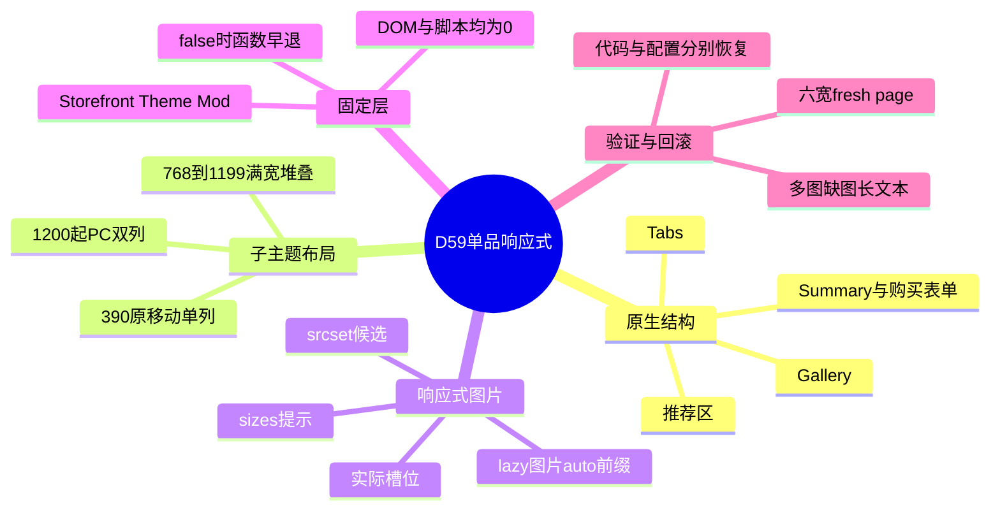
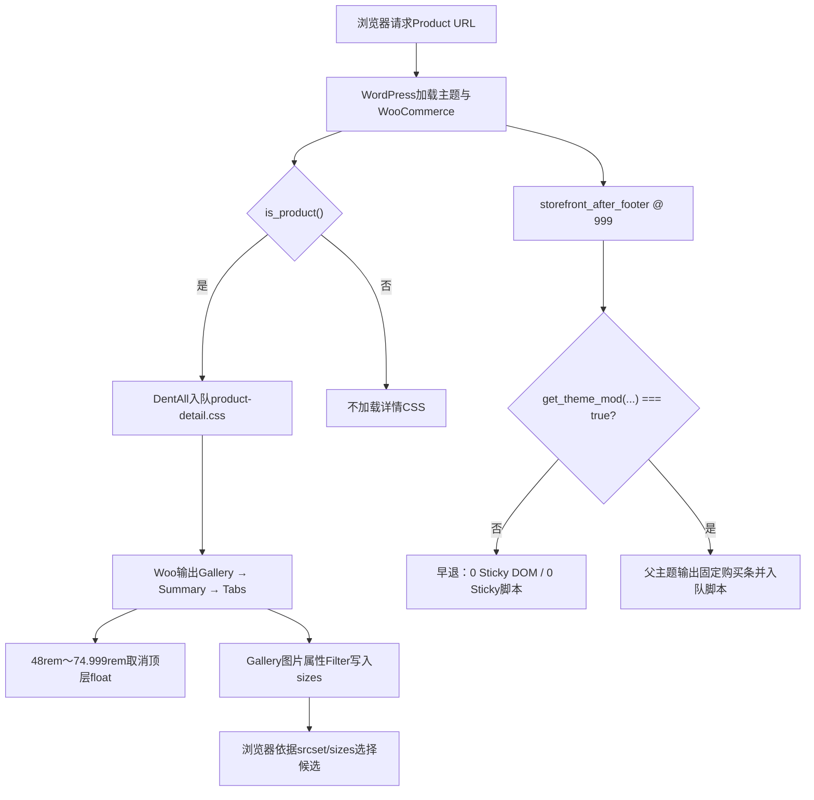

# Day59 WordPress实战：响应式单品布局与主题配置边界

## 相关笔记

- 学习索引：[[WordPress实战笔记索引]]
- 对应项目笔记：[[../Day59-商品详情四端购买区与Sticky收口]]
- 结构前置：[[Day55-WooCommerce单品模板Hook与条件样式]]
- 图片前置：[[Day56-WooCommerce原生商品图库与响应式图片]]
- 购买区前置：[[Day58-WooCommerce原生加购与测试隔离]]
- 推荐区相邻知识：[[Day64-WooCommerce关联商品与原生循环边界]]
- 后续学习笔记：[[Day60-代表内容压力测试与可逆验收]]。

## 今日学习成果

- [x] 我能从WooCommerce经典单品DOM和Storefront float规则解释为什么768～1199px可以只用一个局部媒体查询改为上下堆叠。
- [x] 我能把实际Gallery宽度换算成`sizes`提示，并区分主图公式、WordPress为懒加载图片增加的`auto, `前缀与浏览器最终候选。
- [x] 我能区分版本控制内的主题代码和数据库中的Theme Mod，使用原生开关关闭Local Sticky，并分别说明部署、验证和回滚。

## 真实项目场景

### 今天解决了什么问题

D55已在1200px以上建立Gallery主列、Summary辅列；D56完成Gallery画布和响应式图片；D58保留原生Simple购买区。可是Storefront在768～1199px仍把Gallery与Summary浮动成两列：Gallery较窄，阅读顺序与平板竖屏参考的“图库→商品信息与购买→描述”不一致。D64/D65还证明Storefront原生Sticky Add-To-Cart在1440px滚动到底部时会固定覆盖推荐图片顶部约91px。

D59没有复制单品模板，也没有做新的固定购买栏。子主题只在平板范围取消两个顶层元素的float并设为满宽，同时修正图片槽位提示；Local再通过Storefront自带Theme Mod关闭Sticky输出。这样保留WooCommerce原生字段、表单、Tabs和推荐区生命周期。

### 学习范围

- 本篇要掌握：经典单品顶层DOM、父子主题CSS级联、Mobile First断点、逻辑方向属性、`srcset/sizes`槽位合同、Storefront Theme Mod和Sticky早退路径。
- 本篇明确不展开：D61 Variation选择后的动态图片/价格/库存、重新设计Tabs、定制固定购买条、区块单品模板、正式内容或Production性能。
- 项目真实入口：`app/public/wp-content/themes/dentall/assets/css/product-detail.css`、`inc/setup.php`、`inc/storefront-hooks.php`；父主题只读入口为Storefront的WooCommerce Customizer、template hooks及template functions。
- 验证版本与环境：共享Local只保存Sticky=false；可逆状态和浏览器矩阵在回环地址的独立文件/数据库副本执行，不外推到Staging/Production。

## 先建立整体模型

### 一句话模型

WooCommerce负责输出一套有顺序的商品语义结构，Storefront提供默认排布和可选增强，DentAll按真实槽位做最小覆盖；代码和环境配置必须各自形成可验证、可回滚的交付。

### 记忆宫殿：商场里的样品区、说明台和移动广告牌

把商品页想成商场的一条参观路线：样品区是Gallery，说明与收银台是Summary，后面的资料室是Tabs，推荐货架是Related/Upsells。WooCommerce决定这些区域和内容顺序，Storefront在宽屏摆成左右两排，并在顾客走远后升起一块固定广告牌。DentAll只在平板时把前两区改回前后排队，并把“照片运输标签”改成当前展台宽度；Local管理员再关掉会挡住推荐货架的广告牌开关。

### 比喻对应回真实机制

| 记忆对象 | 真实技术对象 | 不能混淆的边界 |
|---|---|---|
| 样品区 | `.woocommerce-product-gallery` | 图片关系来自Product，不由CSS创建 |
| 说明与收银台 | `.summary`及原生购买表单 | 布局改变不改变价格、库存或POST处理 |
| 资料室 | `.woocommerce-tabs` | 继续位于顶层Gallery/Summary之后，不复制到平板专用DOM |
| 照片运输标签 | `sizes`，配合WordPress `srcset` | 它是候选选择提示，不是强制下载尺寸或CSS宽度 |
| 固定广告牌 | Storefront Sticky DOM与脚本 | CSS隐藏不等于停止脚本；Theme Mod=false使父主题函数早退 |
| 商场分店开关 | 当前子主题的Theme Mod数据库值 | 不在Git内，Local保存不会自动传播到其他环境 |

> [!warning] 准确性边界
> float、Grid或Flex只是浏览器排布机制；商品数据和可购买判断仍由WooCommerce负责。Theme Mod属于当前主题的持久化配置，切换主题、克隆数据库或部署纯代码时都要重新核对，不能把它当成PHP常量。

## 思维导图



最重要的主干是：先确认原生DOM与实际计算宽度，再同步布局、图片提示和固定层证据，不能只看一张截图。

## 请求与生命周期调用链



- 触发条件：Product请求；布局媒体查询再由视口宽度决定是否命中。
- 加载入口：`inc/setup.php`中的`wp_enqueue_scripts`优先级50；图片属性来自既有四参数Filter；Sticky来自父主题After Footer回调。
- 执行顺序：PHP先输出HTML和资源属性，浏览器再计算媒体查询与图片候选；Sticky开关在父主题输出函数开头判断。
- 输入数据：当前请求类型、Gallery附件、浏览器视口、当前主题的Theme Mod。
- 输出或副作用：HTML/CSS计算与图片请求；共享Local额外持久化一个Theme Mod布尔值。商品、URL和订单不变。
- 可观察证据：资源URL/版本、DOM计数与顺序、计算样式矩形、`sizes/currentSrc`、Sticky DOM/脚本计数、Theme Mod读回。

## 核心概念卡

| 概念 | 准确定义 | DentAll真实例子 | 常见误区 | 如何验证 |
|---|---|---|---|---|
| Mobile First | 基础规则服务小屏，再用`min-width`渐进增强 | 390沿用基础单列；48rem平板覆盖；75rem PC两列 | 为每端复制一份HTML | 看同一DOM计数与媒体查询命中 |
| CSS级联 | 来源顺序、特异性、重要性共同决定计算值 | 子主题同等特异性且后加载，覆盖Storefront的float/width | 只看源码中最后一条或盲加`!important` | DevTools查看Matched/Computed |
| 逻辑方向属性 | 按书写方向表达行内起止，而非固定左右 | `margin-inline-end: 0`清除LTR右边距和RTL左边距 | 用`margin-right`后宣称支持RTL | 切换方向或静态核对父主题RTL规则 |
| `sizes` | 告诉浏览器当前条件下图片预计占据的CSS槽位 | 平板为`calc(100vw - 4rem)` | 把它当成图片显示宽度或固定下载文件 | fresh page读取矩形、`sizes`与候选描述符 |
| `auto, sizes` | WordPress可为符合条件的懒加载图片增加auto-sizes前缀 | 多图副图可能输出`auto, `加D59公式 | 逐字不同就判定子主题Filter失效 | 去掉合法前缀后比较公式，并查图片loading状态 |
| Theme Mod | 与当前主题关联的WordPress配置值 | `storefront_sticky_add_to_cart=false` | 认为Git提交会同步数据库配置 | 读`theme_mods_dentall`和`get_theme_mod()` |

## 项目实战代码

### 涉及文件

- `app/public/wp-content/themes/dentall/inc/setup.php`：只在Product请求加载详情CSS，以主题版本作为缓存键。
- `app/public/wp-content/themes/dentall/assets/css/product-detail.css`：负责Gallery/Summary顶层布局、Gallery画布与缩略图、Summary和推荐展示。
- `app/public/wp-content/themes/dentall/inc/storefront-hooks.php`：在既有Gallery图片属性Filter中提供真实槽位公式。
- `app/public/wp-content/themes/dentall/style.css`：主题元数据版本0.34.0。
- `D:/LocalWP/dentall/app/public/wp-content/themes/storefront/inc/woocommerce/`：只读核对父主题Customizer、Hook和Sticky输出函数；不得修改。

### 从入口开始追踪

1. `dentall_enqueue_product_detail_assets()`在`wp_enqueue_scripts`执行，非Product立即返回。
2. Product请求加载`product-detail.css?ver=0.34.0`，依赖`dentall-site-shell`，保证子主题详情规则位于基础资源之后。
3. WooCommerce经典模板输出同一套Gallery、Summary和Tabs；D59没有模板覆盖或Hook重排。
4. 浏览器在768～1199px命中新增媒体查询，把两个浮动元素恢复普通文档流；1200px该规则退出，D55宽屏列宽继续生效。
5. 父主题After Footer回调读取Theme Mod；Local为false时在入队Sticky脚本和输出section之前返回。

### 关键代码片段

源文件`assets/css/product-detail.css`，以下为D59真实顶层规则：

```css
@media (min-width: 48rem) and (max-width: 74.999rem) {
	.storefront-full-width-content.single-product div.product > :is(.woocommerce-product-gallery, .summary) {
		float: none;
		width: 100%;
		margin-inline-end: 0;
	}
}
```

源文件`inc/storefront-hooks.php`，以下为真实`sizes`赋值：

```php
$image_attributes['sizes'] = '(min-width: 82.5rem) 44.37rem, (min-width: 75rem) calc(56.521739vw - 2.26087rem), (min-width: 48rem) calc(100vw - 4rem), calc(100vw - 2.5rem)';
```

父主题只读源码中的关键判断可概括为：只有`get_theme_mod( 'storefront_sticky_add_to_cart' )`严格等于`true`，函数才继续入队脚本并输出Sticky section。DentAll没有复制或修改这段父主题代码。

| 代码 | 表面动作 | WordPress/Woo中的真实作用 | 为什么这样写 |
|---|---|---|---|
| `48rem`～`74.999rem` | 限制媒体查询 | 与现有768/1200断点合同相邻，不影响390或PC | 只改真实缺口，避免四套页面 |
| `float: none` | 取消浮动 | 让Gallery/Summary按原DOM先后进入普通流 | 仅设宽度不足以可靠恢复流 |
| `width: 100%` | 满内容区 | 使用`.col-full`扣除gutter后的真实宽度 | 与B级平板阅读顺序一致 |
| `margin-inline-end: 0` | 清父主题列间距 | 不让旧双列gutter残留在满宽元素 | 保留书写方向语义 |
| Gallery Filter | 改图片属性 | 让WordPress生成的`srcset`被浏览器按新槽位解释 | 布局变宽后避免继续报旧39%槽位 |

### 运行证据

- 页面：#44 Simple和#46 Variable，各用390/768/1024/1199/1200/1440新浏览器上下文；不提交加购、不选择Variation。
- 状态：#44单图、临时五图、缺主图和长文本；临时写入只发生在隔离副本，完成后恢复。
- 正常结果：768～1199两个顶层元素均为`float:none`和内容区满宽；1200/1440恢复左右列；Tabs位于两者下方；Sticky DOM/脚本为0。
- 图片结果：390/768/1024/1199/1200/1440槽位分别约348/702/958/1133/640/708px；fresh page候选描述符不小于槽位。五图从768起100px封顶且无横溢出。
- 边界结果：懒加载副图会在同一D59公式前出现WordPress合法`auto, `前缀；不能因此误报Filter失败。
- 证据不能证明：真实网络LCP/CWV、设备像素密度全集、iOS/Android、RTL实页、D61动态Variation图片、非Local缓存或正式内容视觉。

## 职责边界

| 层级 | 本主题中负责什么 | 不应该负责什么 |
|---|---|---|
| WordPress Core | Enqueue、Theme Mod、响应式图片属性处理 | 不修改核心文件，不把Theme Mod当代码部署 |
| WooCommerce | Product媒体关系、经典单品DOM、表单、Tabs与商品状态 | 不绕过CRUD，不因布局测试改价格/库存 |
| Storefront父主题 | 默认float/gutter、Customizer开关、Sticky函数与脚本 | 不直接修改父主题源码 |
| DentAll子主题 | 条件详情CSS、顶层响应式、真实`sizes`提示 | 不承载交易规则或复制单品模板 |
| `dentall-core` | 当前继续负责跨主题站点业务与SEO协调 | 本次纯展示/主题配置不进入Core |
| 数据库与媒体 | Theme Mod和Product/附件关系 | TEST媒体关系不升级为正式内容 |
| 浏览器 | 计算媒体查询、选`srcset`候选、执行父主题脚本 | 一张截图不能证明数据恢复或服务端事实 |

## Hook、API与主题机制详解

| 项目 | 说明 |
|---|---|
| 详情CSS机制 | `wp_enqueue_scripts` Action，`dentall_enqueue_product_detail_assets()`优先级50；非Product早退 |
| 图片机制 | `woocommerce_gallery_image_html_attachment_image_params` Filter，优先级10、四参数；必须返回过滤后的属性数组 |
| Filter输入 | 图片属性、附件ID、Woo请求尺寸、是否主图；D59只修改属性中的`sizes` |
| Sticky机制 | Storefront在`storefront_after_footer`优先级999调用输出函数，先读`get_theme_mod()`，再决定是否入队脚本/输出HTML |
| Theme Mod注册 | Storefront Single Product Page Customizer中的checkbox；默认true，清洗回调为`wp_validate_boolean` |
| 影响范围 | 详情CSS/Filter只影响Product；Sticky=false与当前DentAll主题配置关联，作用于该环境可购买商品页 |
| 移除或覆盖 | 代码通过逆向Day59提交回滚；Local配置另行勾回或移除Theme Mod键。不能只做其中一步就声称完全恢复 |

## 安全、数据与站点影响

| 检查面 | 本次结论 | 证据或待验证项 |
|---|---|---|
| 输入清洗与验证 | 运行代码没有新公开输入 | 媒体查询与已有Filter只消费可信运行上下文 |
| Capability | 新运行代码不做后台动作 | 共享Local配置由Administrator通过原生API保存 |
| Nonce | 新运行代码不适用 | 若走Customizer UI由WordPress处理；Nonce不能替代Capability |
| 输出转义 | 没有新增HTML输出 | 保留Woo/Storefront现有转义路径 |
| 数据库写入 | 商品0；共享Local新增一个Theme Mod布尔值 | 测试副本商品通过Woo CRUD恢复 |
| URL与SEO | 不改路由、Canonical、robots或Schema | 用D65 DOM/JSON-LD合同回归；公开环境未验 |
| 缓存 | 主题版本更新现有静态资源键 | Theme Mod和页面缓存需按环境复核；未测CWV |
| 支付、物流与订单 | 不适用且未改变 | 测试不加购、不建订单/退款 |
| 部署与回滚 | 代码与配置分开 | 非Local未部署；未来需逐环境重放决定与证据 |

## 动手练习

### 练习一：只读观察

- 目标：用DevTools证明当前布局来自父主题float加子主题媒体查询，而不是两份模板。
- 操作：在768、1199和1200px检查Gallery/Summary的DOM顺序、Matched CSS、`float`、`width`、margin和矩形。
- 预期：768/1199为同宽上下流；1200为左/右双列；三个宽度都只有一组Gallery/Summary/Tabs。
- 实际证据：隔离浏览器矩阵达到上述结果，页面级横向溢出0。

### 练习二：Local最小改动

- 改动：只在DevTools临时取消D59媒体查询，观察768px回到Storefront双列；随后刷新确认源码未变。
- 风险边界：仅Local临时样式；不保存商品、不改核心、不提交加购。
- 验证：比较两个顶层元素的计算宽度、float与Tabs顶点，不只看肉眼。
- 回滚：关闭临时声明或刷新页面；正式源码变更必须回到子主题并重跑六宽。

### 练习三：故障推演

- 假设症状：代码部署后Staging仍出现Sticky遮挡。
- 可能原因：Theme Mod未随Git部署、页面缓存仍是旧HTML、当前活动主题不同，或父主题版本改变输出合同。
- 第一项检查：读Staging活动主题和`get_theme_mod()`，再检查HTML是否存在Sticky DOM/脚本。
- 为什么先查它：这是最接近输出分支的可证伪条件，比先加CSS隐藏更能区分配置、缓存与代码问题。

## 常见误区与排错顺序

| 现象或误区 | 可能原因 | 推荐检查顺序 | 最小验证方法 |
|---|---|---|---|
| 平板仍是窄双列 | CSS未加载、缓存版本旧、选择器未命中或断点单位不同 | 1. 资源URL；2. DOM body class；3. Matched/Computed；4. 视口 | fresh page读取版本与float/width |
| 只设`width:100%`仍错位 | 父主题float和物理margin还在 | 1. float；2. margin；3. clearfix/Tabs | 临时取消float并读矩形 |
| 图片发虚或取太小 | `sizes`仍描述旧列宽，或不是fresh page | 1. 实际槽位；2. `sizes`；3. `srcset`；4. currentSrc/缓存 | 新上下文逐宽测试，比较候选描述符 |
| 副图`sizes`多出`auto, ` | WordPress对懒加载图片启用auto-sizes | 1. loading属性；2. 公式后缀；3. Core版本 | 接受合法前缀，不删除Core行为 |
| Sticky视觉不见但脚本仍加载 | 只做了CSS隐藏 | 1. Theme Mod；2. DOM；3. script；4. hit-test | 计数DOM/脚本并在推荐区点击命中 |
| Local正确、Staging错误 | 数据库Theme Mod未同步或活动主题/版本不同 | 1. 环境身份；2. theme mod；3. 代码版本；4. 缓存 | 每环境独立读回，不假定Git覆盖配置 |

## 掌握标准

- [ ] 不看笔记，能在2分钟内讲清DOM、CSS、图片提示和Theme Mod四条责任链。
- [ ] 能指出项目中的真实入口文件、Filter和父主题Sticky回调。
- [ ] 能用DevTools解释1199与1200px为什么不同，而不是只背断点数字。
- [ ] 能区分`sizes`槽位、`srcset`候选、currentSrc和CSS显示宽度。
- [ ] 能在Local验证Sticky的配置、DOM、脚本与遮挡，并分别回滚代码和配置。
- [ ] 能说明本次对数据、URL、SEO、缓存、支付、物流和部署的实际影响。

当前掌握度：初识；技术实现和证据已完成不等于开发者本人已通过费曼自测。

## 费曼测试题（7道）

1. 不用专业术语解释：为什么平板商品页不需要复制一份HTML也能改成上下布局？
2. 商场比喻中的样品区、说明台、资料室、照片标签和广告牌分别对应什么？比喻在哪些边界失效？
3. 从Product请求开始，按顺序讲出详情CSS、Woo DOM、媒体查询、图片Filter和Sticky Theme Mod如何产生最终页面。
4. 为什么D59同时写`float:none`、`width:100%`和`margin-inline-end:0`？删掉每一项可能出现什么？
5. `sizes`、`srcset`、currentSrc、naturalWidth和CSS矩形有什么区别？为什么测试要用fresh page？
6. 页面仍被固定条遮挡时，最先收集哪三项证据？为什么不能先写`display:none`？
7. 把方案迁移到另一个主题或Shopify时，哪些判断不变，哪些实现必须重新查证？

### 参考答案要点与自我纠正

1. Woo原来就按Gallery→Summary→Tabs输出一套结构；子主题只改变前两个区域在某段宽度中的排队方式。
2. 分别对应Gallery、Summary、Tabs、`sizes`和Storefront Sticky；比喻不能替代真实Hook顺序、购买规则、浏览器选图或数据库配置。
3. WordPress加载子主题→Product条件入队CSS和Filter→Woo输出DOM/图片属性→浏览器计算断点与候选；After Footer回调读取Theme Mod，false则不输出Sticky。
4. 三项分别解除浮动、恢复满宽、清除旧列间距；只改一项可能仍浮动、保留窄宽或留下方向性空隙。
5. `sizes`描述槽位，`srcset`列候选，currentSrc是已选URL，naturalWidth会受候选密度解释，矩形是当前显示结果；旧页面可能复用已下载的大候选。
6. 先看Theme Mod、Sticky DOM/脚本、实际hit-test/计算位置；CSS隐藏可能保留脚本、请求和错误配置，也不能证明其他环境会一致。
7. 不变的是单一语义结构、真实槽位驱动图片、固定层完整验证、配置分环境；主题Hook、类名、图片CDN/模板、配置与发布机制必须重查。

自测记录：未进行；满分14，当前不计分，不因参考答案存在而提升掌握度。实际自测时为每题标记`通过`、`含糊`或`答错`，并回到对应章节纠正。

## 间隔复习记录

| 复习节点 | 计划日期 | 完成 | 复习重点 | 修正位置 |
|---|---|---|---|---|
| D+1 | 2026-09-08 | [ ] | 断点与CSS级联 | 完成后记录 |
| D+3 | 2026-09-10 | [ ] | `sizes/srcset/currentSrc` | 完成后记录 |
| D+7 | 2026-09-14 | [ ] | Theme Mod与双重回滚 | 完成后记录 |
| D+14 | 2026-09-21 | [ ] | 迁移到另一主题的判断 | 完成后记录 |

## 收尾总结

- 我今天真正理解了：页面结构、视觉布局、图片传输提示和环境配置是相邻但独立的系统，最小实现必须同步验证它们的接口。
- 我仍然容易混淆：WordPress给懒加载图片增加的`auto, `前缀与DentAll提供的槽位公式；排错时要先拆开两层。
- 下次遇到类似问题，我会先检查：真实DOM/Hook、计算样式、实际槽位与图片属性、固定层DOM/脚本、当前环境配置。
- 下一篇直接相关学习笔记：[[Day60-代表内容压力测试与可逆验收]]。

## 后续如何向AI高效提问

### 提问公式

`真实版本与环境 + Product类型 + DOM顺序 + 视口/计算矩形 + Matched CSS + sizes/srcset/currentSrc + Theme Mod/脚本 + 不可触碰边界`

### 可复制的代码理解提示词

```text
环境：WordPress 7.0.4、WooCommerce 11.0.0、Storefront 4.6.2、DentAll子主题，Local。
目标：理解商品详情在1199/1200px的布局和响应式图片选择。
证据：提供Gallery/Summary/Tabs DOM、计算float/width/margin、图片sizes/srcset/currentSrc及相关子主题规则。
边界：不改核心、不复制模板、不改商品事实、不提前实现Variation动态逻辑。

请按“Woo输出结构→父主题默认CSS→子主题级联→浏览器选图”解释，区分已确认事实、推断和待验证项；最后给最小DevTools验证与回滚。
```

### 可复制的排错提示词

```text
现象：商品详情在某个宽度仍双列/溢出/图片发虚，或Sticky继续遮挡内容。
环境和版本：[填写]
实际视口与DPR：[填写]
DOM/计算样式：[粘贴最小证据]
图片属性与currentSrc：[填写]
当前主题、Theme Mod与Sticky DOM/脚本计数：[填写]
已尝试：[填写]
边界：不改WordPress/Woo/父主题核心，不先加插件或模板，不碰Production。

请先按数据、输出、CSS级联、浏览器候选、主题配置和缓存排序原因；每项给只读检查，确认后再给最小修复、六宽回归和双重回滚。
```

> [!warning] AI验证边界
> AI给出的父主题默认值、Hook、断点或浏览器候选结论都可能随版本变化。必须回到当前源码、Theme Mod读回、fresh page DOM/网络与实际计算矩形；不得把建议直接写进Production。

## 变种应用到其他项目

| 新场景 | 保持不变的原则 | 可能变化的实现 | 必须重新确认 | 最小验证 |
|---|---|---|---|---|
| 另一个Storefront子主题 | 一套DOM、局部覆盖、代码/配置分离 | Token、内容宽度与已改过的父主题规则 | Storefront/Woo版本、Theme Mod现值 | 390/768/1199/1200/1440及DOM/脚本 |
| 其他经典Woo主题 | 商品事实与展示分层 | 父主题可能用Grid/Flex而非float | 模板、Hook、资源顺序、Sticky来源 | Simple/Variable、Tabs邻接、多图 |
| WordPress区块主题 | 不复制内容、槽位与候选同步 | Product Gallery Block、`theme.json`、Interactivity API | 当前Blocks合同和编辑器输出 | 编辑器/前台、状态与断点 |
| 独立插件中的相似功能 | 配置可回滚、生命周期清晰 | 只在真正跨主题时使用插件 | 是否应强制所有主题/环境 | 激活/停用、多主题、无数据损失 |
| Shopify或其他平台 | 单一语义结构、响应式图片、固定层完整验证 | Liquid/JSON Section、CDN图片参数、Theme Setting，待验证 | 官方媒体、Variant与发布模型 | 测试商品、多视口、配置/发布回滚 |

### 变种练习

选择一个非Storefront Woo主题，先只读回答：它的Gallery、Summary和Tabs由谁输出；顶层使用float、Grid还是Flex；图片槽位如何传给浏览器；固定购买栏由主题、插件还是自定义代码产生；配置是否随代码部署。没有这些事实前，不复制D59选择器或Theme Mod名称。

## 可复用核心思想

### 跨平台不变量

响应式改动必须从语义结构、实际槽位和覆盖层三方面同时闭环。布局看起来正确不代表图片候选合适；固定层不可见不代表DOM和脚本不存在；代码可回滚也不代表环境配置会随之恢复。

### WordPress/WooCommerce当前实现

在WordPress 7.0.4、WooCommerce 11.0.0和Storefront 4.6.2的Local中，DentAll 0.34.0复用经典单品DOM、条件Enqueue和Gallery图片属性Filter，以一个48rem～74.999rem媒体查询形成平板堆叠；Storefront原生Theme Mod=false使After Footer Sticky函数早退。六宽、状态矩阵与恢复证据只证明当前Local代表路径。

### Shopify或其他平台的对应机制

可迁移的是“平台事实源与主题展示分离、同一结构渐进重排、图片请求跟随真实槽位、固定层完整关闭、配置逐环境审计”。Shopify Theme Setting、Liquid/JSON模板、CDN图片URL和Variant媒体的具体合同在本项目尚未验证，均标记为待验证，不自动扩大DentAll第一版范围。
