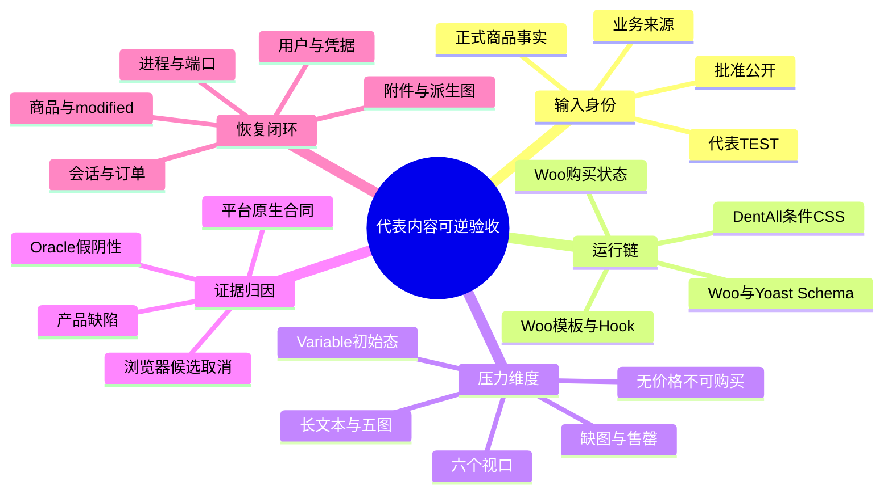
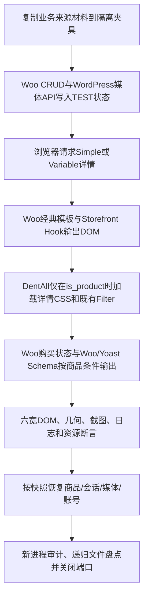

# Day60 WordPress实战：代表内容压力测试与可逆验收

## 相关笔记

- 学习索引：[[WordPress实战笔记索引]]
- 对应项目笔记：[[../Day60-商品详情代表内容回归与W10收口]]
- 前置学习笔记：[[Day59-响应式单品布局与主题配置边界]]
- 后续学习笔记：D61完成后回填。

## 今日学习成果

以下三项是本篇的自测目标，不因笔记已生成而自动视为掌握：

- [ ] 我能区分业务来源、代表TEST、批准公开和正式商品事实，并解释为什么业务来源材料仍不能直接发布。
- [ ] 我能沿WooCommerce经典单品输出、条件CSS与Schema分支解释30页回归结果，并识别产品缺陷、平台原生行为和测试Oracle错误。
- [ ] 我能设计一个同时恢复商品数据、修改时间、会话、附件记录、原图、派生图、测试账号和服务进程的可逆Local验收。

## 真实项目场景

### 今天解决了什么问题

D55～D59已经分别完成商品详情骨架、图库、基础信息、Simple购买区和四端排布，但此前主要使用既有TEST商品。D60把接近业务复杂度的长英文名称、长描述和多张来源图片放入一次性隔离副本，验证现有实现是否会因真实长度、图片比例或异常状态而溢出、丢失购买状态、污染推荐/SEO，或者只能在理想样本下工作。

最终没有发现需要改运行代码的问题，但测试本身暴露了三个更有学习价值的点：Woo原生状态与脚本Oracle不一致、浏览器取消响应式图片候选不等于资源失败，以及删除附件记录后仍可能留下派生缩略图。

### 学习范围

- 本篇要掌握：内容身份分层、经典单品输出链、六宽/多状态测试矩阵、Oracle归因、Woo CRUD快照恢复、WordPress媒体派生文件清理和证据边界。
- 本篇明确不展开：D61 Variation选择后的动态图片/价格/库存/默认值/非法组合/加购，正式内容审核，网络404图片替换，Production缓存/Core Web Vitals和公开搜索引擎验证。
- 项目中的真实入口：`app/public/wp-content/themes/dentall/inc/setup.php`、`inc/storefront-hooks.php`、`assets/css/product-detail.css`、`app/public/wp-content/plugins/dentall-core/includes/seo-compatibility.php`。
- 验证范围：一次性隔离Local；业务来源文件只作内部代表样本，所有商品事实带TEST边界，不进入共享Local、Git或正式素材登记。

## 先建立整体模型

### 一句话模型

代表内容验收把接近业务复杂度、但未获发布授权的输入送入隔离副本，让既有平台输出链承受压力；只有页面合同通过且所有临时数据与文件可证明恢复，才算技术回归完成。

### 记忆宫殿：仓库试装线

把商品详情想成一条已经搭好的仓库试装线。货架结构是WooCommerce模板与Hook，标签和间距是DentAll CSS，箱子是名称、图片、价格和库存。业务方送来的箱子可以用来测试货架是否承重，但没有“批准出库”印章，就只能留在隔离试装间，不能进入正式门店。

试装前先抄一份货架和库存清单；试装后不只要搬走箱子，还要清点包装碎屑、临时通行证和叉车钥匙。WordPress自动生成的缩略图正像切下来的包装边角：数据库里的附件记录删了，不代表磁盘碎屑也一定消失。

### 比喻对应回真实机制

| 记忆对象 | 真实技术对象 | 不能混淆的边界 |
|---|---|---|
| 货架 | WooCommerce经典单品模板、Hook、Storefront布局 | 货架结构不是商品内容，不能因换样本就重写模板 |
| 箱子 | 商品名称、描述、图片、价格、库存和属性 | 来源真实不等于事实已批准公开 |
| 隔离试装间 | 独立文件、数据库、账号和回环端口的Local副本 | 不能把共享Local或Staging当一次性夹具 |
| 出库印章 | 业务审核、素材授权与正式发布状态 | 技术测试通过不能替代业务批准 |
| 包装碎屑 | WordPress生成的多尺寸媒体文件 | 附件记录或原图清理不代表派生图为0 |
| 盘点清单 | 快照、manifest、哈希与最终审计 | “脚本执行成功”不能替代结果逐项相等 |

## 思维导图



最重要的主干是：输入身份决定能否发布，平台合同决定如何断言，恢复证据决定测试是否真正可逆。

## 请求与生命周期调用链



- 触发条件：访问WooCommerce经典单品URL；Home与Shop必须走条件资源退出分支。
- 输入数据：隔离副本中的Simple/Variable商品、业务来源代表展示材料与既有TEST商品事实。
- 输出：Gallery、Summary、Tabs、购买表单/库存提示、推荐区、JSON-LD和响应式图片请求。
- 可观察证据：HTTP状态、唯一DOM数量、布局矩形、横向溢出、图片解码、表单状态、Schema节点、Console/Page Error、数据库相等性、文件残留和端口监听。
- 副作用：一次Simple加购会写Woo session；媒体导入会写附件、原图和派生尺寸；因此“只浏览页面”也不能假定数据库与磁盘绝对无变化。

## 核心概念卡

| 概念 | 准确定义 | DentAll真实例子 | 常见误区 | 如何验证 |
|---|---|---|---|---|
| 业务来源代表样本 | 来自业务资料、仅用于模拟复杂度且未批准公开的内容 | 长英文商品名、五张来源图 | “来自业务”自动等于“正式” | TEST前缀、授权原文、未登记公开、隔离路径 |
| 测试Oracle | 把页面实际值判定为通过/失败的规则 | Variable初始`variation_id` | 脚本报红就一定是产品Bug | 对照当前Woo源码、DOM全状态和用户动作 |
| 假阴性 | 实现符合合同，但Oracle错误判失败 | Woo用`"0"`表示未选Variation | 直接改产品代码迎合错误断言 | 修正派生口径并保留原始报告 |
| 可逆夹具 | 能按预先快照恢复数据和外部副作用的测试状态 | #44/#46及Variation、会话、附件 | 只恢复标题/价格就算完成 | 比较完整`get_data()`、modified、会话、文件和账号 |
| 媒体派生尺寸 | WordPress上传时按注册尺寸生成的额外文件 | 10张图生成69张WEBP缩略图 | 删附件记录或原图就一定全删 | 对uploads递归匹配manifest基名并计数0 |
| 条件资源 | 只在目标请求入队的CSS/JS | `product-detail.css`只在Product加载 | Product页正常就代表没有污染其他页 | Home/Shop检查资源0、Gallery 0、overflow 0 |
| Schema条件输出 | 结构化数据节点会随商品可提供信息变化 | 无价且无评分/评价时Woo不生成Product | 每个Product URL都必须强制有Product节点 | 对照Woo生成条件，检查节点唯一性与悬空引用 |

## 项目实战代码

> [!important]
> 以下片段均来自当前仓库；D60没有修改它们。学习重点是理解为什么代表内容回归可以在零运行代码的前提下验证现有职责。

### 涉及文件

- `app/public/wp-content/themes/dentall/inc/setup.php`：商品详情条件入队。
- `app/public/wp-content/themes/dentall/inc/storefront-hooks.php`：图库图片提示、Simple数量标签和Upsells上限。
- `app/public/wp-content/themes/dentall/assets/css/product-detail.css`：同一原生DOM的图库、信息、购买区、推荐区和四端布局。
- `app/public/wp-content/plugins/dentall-core/includes/seo-compatibility.php`：经典商品页Woo/Yoast面包屑Schema责任协调。

### 条件加载详情样式

源文件：`app/public/wp-content/themes/dentall/inc/setup.php`

```php
function dentall_enqueue_product_detail_assets() {
	if ( ! function_exists( 'is_product' ) || ! is_product() ) {
		return;
	}

	$theme = wp_get_theme( get_stylesheet() );

	wp_enqueue_style(
		'dentall-product-detail',
		get_stylesheet_directory_uri() . '/assets/css/product-detail.css',
		array( 'dentall-site-shell' ),
		$theme->get( 'Version' )
	);
}
add_action( 'wp_enqueue_scripts', 'dentall_enqueue_product_detail_assets', 50 );
```

因果链是：WordPress进入前台资源入队阶段 → 回调先确认Woo条件函数存在且当前确为Product → 只给详情页增加现有CSS。D60因此同时请求Home与Shop，证明退出分支仍为0详情资源，而不是只盯着目标页。

### 图片槽位提示保持现有职责

源文件：`app/public/wp-content/themes/dentall/inc/storefront-hooks.php`

```php
function dentall_product_gallery_image_attributes( $image_attributes, $attachment_id, $image_size, $main_image ) {
	if ( ! function_exists( 'is_product' ) || ! is_product() ) {
		return $image_attributes;
	}

	$image_attributes['sizes'] = '(min-width: 82.5rem) 44.37rem, (min-width: 75rem) calc(56.521739vw - 2.26087rem), (min-width: 48rem) calc(100vw - 4rem), calc(100vw - 2.5rem)';

	return $image_attributes;
}
add_filter( 'woocommerce_gallery_image_html_attachment_image_params', 'dentall_product_gallery_image_attributes', 10, 4 );
```

Filter只提示预期显示槽位；`srcset`候选、浏览器选择和最终`currentSrc`仍由WordPress/WooCommerce/浏览器共同完成。D60看到17条`ERR_ABORTED`时，必须结合所有目标图片已解码来判断：这是浏览器换候选后取消多余请求，不是缺图。

### 同一DOM渐进重排

源文件：`app/public/wp-content/themes/dentall/assets/css/product-detail.css`

```css
@media (min-width: 48rem) and (max-width: 74.999rem) {
	.storefront-full-width-content.single-product div.product > :is(.woocommerce-product-gallery, .summary) {
		float: none;
		width: 100%;
		margin-inline-end: 0;
	}
}

@media (min-width: 75rem) {
	.storefront-full-width-content.single-product div.product > .woocommerce-product-gallery {
		width: 56.5217391304%;
	}

	.storefront-full-width-content.single-product div.product > .summary {
		width: 39.1304347826%;
	}
}
```

768～1199px取消父主题float并满宽堆叠，1200px起恢复双列。390px沿用Mobile First基线。代表长标题和五图不需要新断点，说明现有职责边界足够；若本次只因某一张图写特例，反而会把内容偶然性固化到组件代码。

### Schema责任按真实渲染分支判断

源文件：`app/public/wp-content/plugins/dentall-core/includes/seo-compatibility.php`

```php
function dentall_core_remove_yoast_breadcrumb_reference( $data ) {
	unset( $data['breadcrumb'] );
	return $data;
}
```

DentAll Core移除的是已取消Yoast面包屑节点对应的WebPage引用，不负责伪造Woo Product节点。无价格、无评分、无评价的Simple商品由Woo原生条件省略Product时，正确断言是“没有重复或悬空节点”，不是强迫每个URL都输出1个Product。

### 运行证据

- 六宽与四类场景共30页、30张截图；原始401/419，保留原报告后通过Woo 11源码与多维DOM状态归一为419/419。
- 主Agent抽查业务Simple/Variable、缺图、售罄和无价格状态的390/1440px共10张整页截图。
- 5个商品/Variation完整数据与modified相等；订单/退款0、pending actions 14、session回到原1条。
- 10个附件/原图、69个派生尺寸、10个夹具副本、临时用户和凭据均清理；端口16060/16061停止。
- 12个项目PHP文件lint、1个JavaScript文件语法检查和Git差异检查通过；D60运行代码0改动。

## 职责边界

| 参与者 | 本日职责 | 明确不负责 |
|---|---|---|
| WordPress Core | 媒体附件、响应式图片属性与派生尺寸 | 判断业务图片能否公开 |
| WooCommerce | 商品对象、经典模板、购买状态、session和Product Schema条件 | 替业务方确定价格、库存或Variation合法组合 |
| Storefront | 单品基础布局、Gallery脚本和原生初始交互 | DentAll正式视觉与内容审核 |
| DentAll子主题/Core | 条件CSS、局部显示Filter、推荐上限和Schema去重边界 | 复制Woo交易链或伪造无价Product节点 |
| 隔离测试夹具 | 建立/恢复代表状态，保留原始与归一证据 | 把TEST状态回放到共享Local或非Local |
| Website Manager/业务方 | 正式名称、SKU、分类、价格、库存、组合、文案和素材授权 | 设计测试隔离或修复代码 |

## Hook、API或模板机制详解

| 机制 | 触发/输入 | 本项目用途 | 验证重点 |
|---|---|---|---|
| `wp_enqueue_scripts` | 前台资源阶段 | 调用详情CSS条件入队函数 | Home/Shop退出，Product恰好1份 |
| `is_product()` | 当前主查询条件 | 限定详情CSS和图库属性Filter | 函数存在性、Coming Soon/模板变化 |
| `wp_enqueue_style()` | handle、URL、依赖、版本 | 复用主题版本形成缓存键 | 句柄唯一、依赖顺序、非Product为0 |
| `woocommerce_gallery_image_html_attachment_image_params` | 每张Gallery图属性 | 只改`sizes`提示 | 不接管`srcset`、动态图或浏览器候选 |
| `woocommerce_quantity_input_args` | 数量输入参数与商品对象 | 既有Simple可见标签调整 | 只命中当前Simple主商品，不改数量规则 |
| `woocommerce_upsells_total` | 原生Upsells总数 | 既有详情上限3 | Related来源、空态和角色可见性仍由Woo负责 |
| `WC_Product::get_data()` / `save()` | 完整产品对象状态 | 夹具快照、施加与恢复TEST状态 | 业务字段和`date_modified`都相等 |
| `wp_insert_attachment()` / `wp_generate_attachment_metadata()` | 上传文件与附件元数据 | 隔离导入并生成响应式尺寸 | 记录、原图、所有派生尺寸都纳入清理 |
| `wp_delete_attachment()` | 附件ID与强制删除 | 初始清理入口 | 不能只信返回值，仍须递归文件审计 |
| `get_header`与Yoast Schema Filters | 经典商品实际渲染 | 保留Woo面包屑、移除Yoast重复节点/引用 | 有价/无价分支、Coming Soon与悬空`@id` |

## 测试Oracle为什么会错

### Variable初始态

测试原先把“未选择Variation”写成隐藏`variation_id === ""`。WooCommerce 11.0实际使用`"0"`，同时两个Select为空，按钮带`disabled wc-variation-selection-needed`类。单看一个字段会误报；正确Oracle应联合观察：

1. 两个Select是否仍为空；
2. `variation_id`是否没有合法Variation ID；
3. 按钮是否处于原生未选类状态；
4. 测试是否确实没有选择或提交组合。

原生按钮此时没有HTML `disabled`属性。D60只证明没有执行D61交互，不能顺便宣称辅助技术禁用语义已经完成；这要在D61按功能确认单单独评估。

### 无价格Simple与Product Schema

测试原先认为每个商品URL都应有一个Product JSON-LD。WooCommerce 11.0在商品既无有效Offer、也无Rating/Review时会省略Product节点；价格模板仍可输出空`.price`段落，但购买表单不存在。正确判断要同时核对：

- 页面是否仍有唯一H1、Gallery/Summary/Tabs和BreadcrumbList；
- 是否没有购买表单或可提交按钮；
- 是否没有重复Product、悬空WebPage引用或伪造价格；
- 这一分支是否与当前Woo源码一致。

如果为了让断言变绿而强行生成带空Offer的Product，反而可能制造无效或误导的结构化数据。

## 可逆测试的完整恢复面

### 数据库对象

- 商品与Variation：完整`WC_Product::get_data()`，不是只比标题、价格和库存。
- 修改时间：`date_modified`也是可观察状态；测试保存后要按快照恢复。
- 订单/退款：即使本轮只加购物车，也要证明仍为0或与基线相等。
- Woo session：GET Store API或一次加购都可能创建会话；要识别新增行并保留原基线行哈希。
- Action Scheduler：确认待处理数量没有因Cron/异步任务漂移。
- 用户：临时Review账号必须删除，不能只撤销角色。

### 文件系统对象

- 夹具复制的业务来源文件；
- WordPress uploads中的原始上传文件；
- 附件元数据记录的各尺寸文件；
- 可能未被初始清理函数覆盖、但仍匹配manifest基名的派生文件；
- 私有凭据文件、Cookie和HTTP认证材料。

D60首轮检查只验证原始上传路径不存在，漏掉69张派生WEBP，形成清理Oracle假阴性。最终修正不是扩大到清空整个uploads，而是把目标限定为隔离副本、固定年月目录、测试前缀和manifest基名，逐文件哈希登记后删除，再递归确认计数为0。

## 安全边界与故障分级

- P1：Web启动前发现测试助手硬编码临时口令。必须在任何HTTP暴露前改为密码学随机值、轮换账号、限制凭据ACL并扫描明文；最终账号和凭据都删除。
- P2：权威浏览器前还需逐项验证继承ACL、复制进来的旧日志/xdebug文件、`blog_public`和PHP router分支；“端口只在本机”不能替代最小文件权限、noindex和请求阻断。
- P2：附件记录/原图虽清理，但69张自动派生缩略图残留。它们只在隔离副本，没有公开或进入Git，但“恢复完成”的断言不成立，必须关闭后才能Done。
- 测试副作用：安全探针访问Store API也会创建Woo session。所谓只读HTTP不一定对应用状态无副作用，因此最终以数据库差异为准。
- 边界保护：只监听回环地址，源库账号SELECT返回1142，阻断邮件、外部HTTP、Cron、支付和危险函数；这些是多层防护，不等于操作系统级完全断网。

## 安全、数据与站点影响

| 领域 | D60真实影响 | 验证/回滚口径 |
|---|---|---|
| 数据 | 只写一次性隔离库中的TEST商品状态、附件、用户和session | 完整产品/modified、订单/退款/pending/session与基线相等 |
| 文件 | 只复制业务来源材料并生成隔离uploads文件 | 夹具副本、原图、派生图、凭据均为0；不触碰源资料 |
| 权限 | 临时管理员只用于隔离截图与页面访问 | HTTP前CSPRNG轮换，ACL最小化，收尾删除用户/凭据 |
| URL/SEO | 不改项目URL或SEO实现；只观察不同商品状态输出 | 有价/无价Schema分支分开，Coming Soon不外推公开Canonical |
| 缓存/性能 | 没有新缓存或前端资源 | 只区分响应式候选取消；未测CDN/CWV |
| 交易 | 一次Simple数量2加购，只产生隔离session | 不结账；订单/退款0，session精确恢复 |
| 部署 | 运行代码0改动 | 不推送、不部署，不在共享Local重放TEST内容 |

## DevTools与浏览器验证路径

1. 在Elements确认页面只有一个`.woocommerce-product-gallery`、`.summary`和`.woocommerce-tabs`，顺序为Gallery → Summary → Tabs。
2. 在Computed检查390/768/1024/1199/1200/1440px的宽度、float、margin和页面`scrollWidth - clientWidth`。
3. 在Network按图片筛选：记录最终解码图片和`currentSrc`；把候选切换产生的`ERR_ABORTED`与真实404/500分开。
4. 在Console确认没有错误或Warning；在页面错误监听中单独记录脚本异常。
5. 在Application/Cookies之外，再从Woo session表做快照比较；浏览器“清空购物车”不自动证明数据库回到原样。
6. 对无价格与Variable初始态，同时观察DOM、类、隐藏字段、Schema和是否发生提交，不用单一属性决定通过/失败。

安全微调路径仍是：DevTools临时试验 → 判断应改Token、公共组件或局部规则 → 回到子主题源码 → 六宽及相邻页面回归。D60没有发现需要回写源码的缺陷，因此正确结果是0代码，而不是为了“当天有产出”制造改动。

## 排错矩阵

| 现象 | 先检查 | 可能归因 | 处理 |
|---|---|---|---|
| 测试报Variable未选失败 | Select值、variation ID、按钮类、是否提交 | Oracle只接受空字符串 | 对照Woo版本合同，归一口径；不先改产品代码 |
| Network出现`ERR_ABORTED` | 对应图片是否decode、最终`currentSrc`、HTTP失败类型 | 浏览器取消未选响应式候选 | 单列记录；只有目标图未解码或真实4xx/5xx才报资源缺陷 |
| 无价格页没有Product Schema | Offer/Rating/Review、Woo生成条件、悬空引用 | 平台合法省略节点 | 验证唯一性和引用完整性，不伪造价格 |
| 附件记录为0但磁盘仍有图 | `_wp_attachment_metadata`、uploads递归文件名 | 派生缩略图未被清理 | 仅按隔离manifest基名删除并再次计数 |
| “只读”探针后session增加 | Woo session表前后差异 | Store API/购物车初始化副作用 | 精确删除新增行，证明基线行哈希不变 |
| 首页也加载详情CSS | `is_product()`条件与enqueue句柄 | 条件资源污染 | 检查Home/Shop资源0并回到`setup.php`修复 |
| 长标题挤坏PC两列 | 1199/1200边界、`min-width`、换行和父主题float | 内容压力暴露布局缺陷 | 先找最小公共规则，不能按商品名写选择器 |

## 动手练习

1. 不看正文，画出“素材复制 → Woo/WordPress写入 → 浏览器渲染 → 快照恢复 → 递归文件审计”的五段流程，并标出每段可能产生的副作用。
2. 在DevTools把视口从1199改到1200px，解释Gallery与Summary哪三个计算样式改变、哪些DOM没有改变。
3. 写一个只读检查清单，证明无价格商品没有被错误标为“Schema缺失”，同时也没有悬空Breadcrumb引用。
4. 假设导入3张图片，每张生成7个尺寸：列出仅调用`wp_delete_attachment()`之后仍必须验证的文件系统证据。
5. 设计D61的最小Oracle，但只写断言名称，不实施：默认组合、合法选择、无效组合、缺货Variation、动态图片、价格、库存、按钮语义和一次加购。

## 掌握标准

- [ ] 不看笔记能画出代表材料从复制到彻底清理的完整调用链。
- [ ] 能用当前WooCommerce源码或实页证据纠正一个错误Oracle，而不是为测试器修改产品代码。
- [ ] 能解释1199/1200、Variable `variation_id=0`、无价Product Schema 0和响应式候选取消四个关键边界。
- [ ] 能写出数据库、媒体文件、账号、凭据、日志和端口六类终态断言。
- [ ] 能明确说出D60完成了什么，以及为什么正式内容、D61与Production仍未完成。

## 费曼自测题

1. 为什么“业务来源”不能自动推导为“已批准公开”？
2. D60为什么同时测1199和1200px，而不是只测常见的1024和1440px？
3. Variable初始`variation_id="0"`为什么可以是合法未选状态？还需要联合看哪些证据？
4. 什么时候`ERR_ABORTED`是响应式图片正常取消，什么时候应升级为资源缺陷？
5. 无价格Simple没有Product JSON-LD时，怎样判断这是平台合同而不是D65回归？
6. 为什么完整商品恢复还必须比较`date_modified`、session和Action Scheduler？
7. 删除附件记录和原图后，为什么还要递归查派生缩略图？怎样限制删除范围避免伤及正式媒体？

### 我的费曼答案与纠正

尚未作答。实际复习时先口述或手写，再与下列要点比较；把含糊或错误部分回填到本节，不直接复制参考答案冒充掌握。

### 参考答案要点

1. 来源描述材料从哪里来；发布授权还需要权利、事实、审核和目标环境确认。
2. 1199/1200是D59单列与PC双列的实际边界，最容易出现断点缝隙。
3. 当前Woo用0代表尚无合法Variation；还要看Select为空、按钮原生未选类、没有提交和没有合法ID。
4. 目标图片已解码且最终候选成功时多为取消；目标资源404/500、decode失败或页面缺图才是缺陷。
5. 对照Woo 11生成条件，并验证Breadcrumb唯一、无重复/悬空引用、购买表单缺失与商品确实无有效Offer/Rating/Review。
6. 保存商品会改变修改时间，HTTP可能创建session，异步系统可能产生任务；只比业务字段会漏掉可观察漂移。
7. WordPress会生成多尺寸文件；删除必须限定隔离根、年月目录、测试前缀和manifest基名，删后递归计数0。

### 自测评分

自测记录：未进行；满分14，当前不计分，不因参考答案存在而提升掌握度。实际自测时每题标记`通过`、`含糊`或`答错`，并回到对应章节修正。

## 间隔复习记录

| 复习节点 | 计划日期 | 完成 | 复习重点 | 修正位置 |
|---|---|---|---|---|
| D+1 | 2026-09-08 | [ ] | 内容身份四层与六宽矩阵 | 完成后记录 |
| D+3 | 2026-09-10 | [ ] | Oracle假阴性与响应式候选取消 | 完成后记录 |
| D+7 | 2026-09-14 | [ ] | Woo CRUD、session和媒体恢复面 | 完成后记录 |
| D+14 | 2026-09-21 | [ ] | 把方法迁移到另一电商平台 | 完成后记录 |

## 收尾总结

- 本篇建立的关键模型：内容真实性、技术代表性和公开授权是三条不同轴；页面通过与环境恢复也是两个独立完成条件。
- 最容易混淆的点：自动化红灯可能来自产品、平台合同或Oracle；必须保留原始报告，再用源码与多维证据归因。
- 下次遇到类似任务先检查：授权范围、隔离边界、完整状态快照、平台版本合同、异常状态矩阵、媒体派生清单和最终端口/文件残留。
- 下一篇直接相关学习笔记：D61完成后回填。

## 后续如何向AI高效提问

### 提问公式

`环境与版本 + 内容身份/授权 + Product类型与状态 + 视口矩阵 + 现有模板/Hook/CSS职责 + 数据/文件副作用 + 恢复不变量 + 不可触碰范围`

### 提问前准备

- 明确材料属于业务来源、代表TEST、批准公开还是正式商品事实。
- 提供WordPress/WooCommerce/主题版本与目标Product类型，不写“最新版”。
- 列出允许产生的数据库/文件副作用、禁止触碰的环境和必须恢复的对象。
- 附上原始断言、DOM实际值、Console/Network分类和相关源码入口，不只给一张截图。
- 说明任务是只读诊断、提出确认单，还是已经获得最小实施授权。

### 可复制提示词

```text
请先只读分析WooCommerce Variable商品的动态选择链。环境为WordPress 7.0.4、WooCommerce 11.0.0、Storefront 4.6.2、DentAll 0.34.0，只允许隔离Local可逆TEST。
请列出默认未选、合法组合、无效组合、缺货Variation、不可购买、动态图片、价格、库存和一次加购的最小Oracle；区分Woo原生合同、当前DentAll职责和可能需要新增的能力。不要修改代码、商品或数据库，先给功能确认单与恢复方案。
```

### 可复制的排错提示词

```text
一个隔离WooCommerce商品详情测试出现红灯。请先把每项分成：运行缺陷、Woo/WordPress原生合同、测试Oracle错误、浏览器候选取消或测试设施副作用。
输入包括：完整DOM状态、商品类型/价格/库存、Schema节点、Network失败原因、图片decode结果、测试前后商品get_data/modified、session/订单/pending、附件记录与uploads递归文件清单。
只做只读归因；若确需改运行代码，先说明最小改动、职责文件、数据/URL/SEO/性能/缓存/部署影响和回滚，再等确认。
```

## 变种应用到其他项目

这套方法也适用于文章模板、分类归档、会员资料和结账之外的低风险展示模块：先选接近业务复杂度但身份明确的代表输入，再用独立环境观察平台原生分支，最后跨数据库、文件和后台任务证明恢复。涉及订单、支付、客户隐私或生产部署时，风险等级和独立测试要求必须另行提高，不能直接照搬D60的展示范围。

### 变种练习

选一个有特色图、长标题、嵌套列表和空摘要的文章模板，设计四层内容身份、四端状态矩阵与媒体派生清理清单；只写测试计划，不创建文章。再说明如果换成Shopify测试店，哪些结论可以迁移，哪些API和媒体生命周期必须查官方机制后才能确定。

## 可复用核心思想

### 跨平台不变量

可靠的代表内容验收要同时回答五个问题：输入能否公开、系统如何渲染、异常如何分支、证据如何归因、测试如何恢复。任何一个答案缺失，都不能仅凭漂亮截图标记Done。

### WordPress/WooCommerce当前实现

WooCommerce用产品对象、经典模板与Hook决定购买DOM和商品Schema；DentAll通过条件enqueue、局部Filter和Mobile First CSS调整展示。WordPress媒体导入同时产生数据库附件、原图与多个派生尺寸，Woo请求还可能产生session，所以恢复必须跨数据库、文件系统和进程三层验证。

### Shopify或其他平台的对应机制

同样应使用未公开测试店、代表产品、变体状态矩阵、结构化数据检查和资源manifest清理。Shopify的派生媒体生命周期、变体选择事件、Product JSON-LD生成条件、测试订单/会话恢复接口均属待验证，不能把WooCommerce的Hook、CRUD或uploads目录直接类比成一一对应实现。
