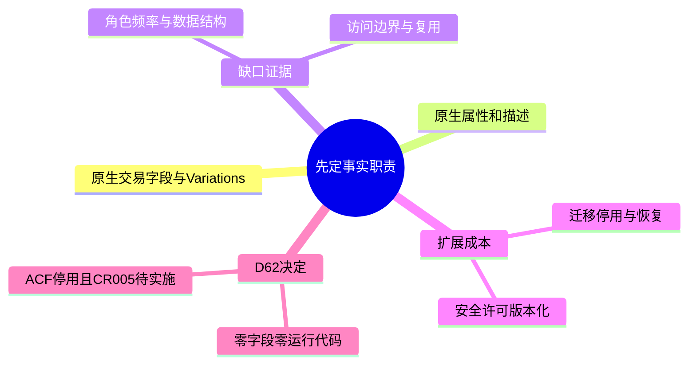
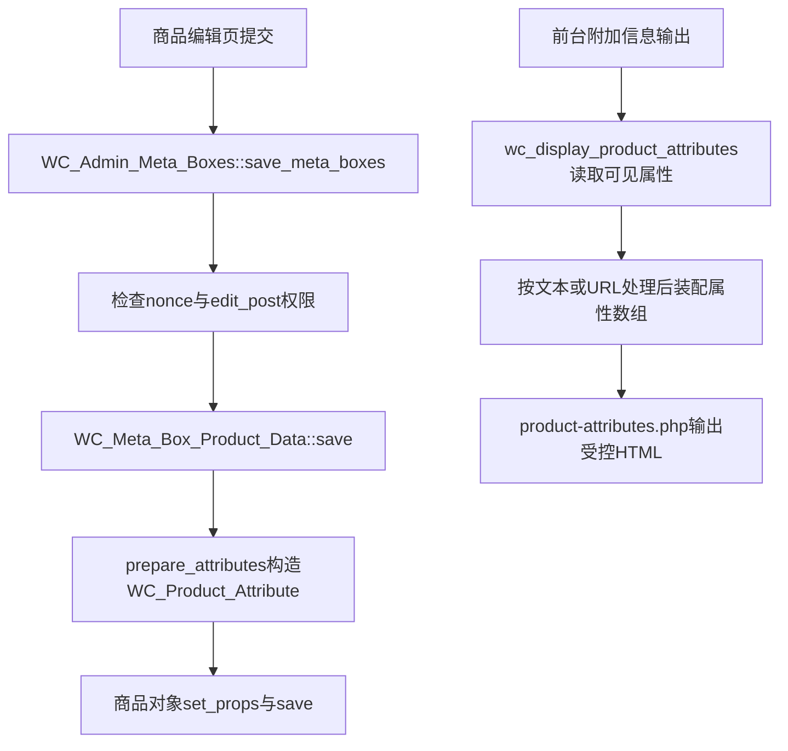

# Day62 WordPress实战：WooCommerce原生字段与ACF启用边界

## 相关笔记

- 学习索引：[[WordPress实战笔记索引]]
- 对应项目笔记：[[../Day62-原生字段复核与零扩展收口]]
- 前置与同主题学习：[[Day55-WooCommerce单品模板Hook与条件样式]]
- 后续学习：[[Day63-WooCommerce附加信息与公开文件边界]]（原生Tab、匿名公开资料和缺字段空状态）。

## 今日学习成果

- [ ] 我能根据事实职责区分交易字段、属性、变体、描述与结构化展示缺口。
- [ ] 我能从原生商品保存入口追到属性对象，再指出前台的输出转义位置。
- [ ] 我能用代码、插件包与只读状态判断ACF依赖，并说明文档回滚与数据恢复的区别。

以上是用户自测目标。文档已生成和代码已阅读不代表用户已掌握，当前均未勾选。

## 真实项目场景

D62要判断原生字段是否存在真实缺口。现有代表样本尚未证明技术参数、认证或资料必须用ACF，所以用户明确批准“零字段、零运行代码”文档收口。零新增是当前证据下的范围决定，不是永久禁止扩展，也不代表真实商品内容已经验收。

本轮还纠正了插件身份：Local实际是停用的免费版ACF 6.8.7，不能沿用旧清单中的“ACF Pro已安装”。CR-005定制展示商品仍是已确认业务方案、尚未实现，不能因本日结论撤销或标记完成。

- 本篇掌握字段职责、原生保存与展示链、插件事实核验和启用前的生命周期成本。
- 本篇不实施D63前台展示、ACF字段、插件启停、PDF开放、数据迁移或购买逻辑。
- 使用者是Website Manager；参数、认证、文件数量及更新频率仍由真实录入需求证明，开发者不编造业务事实。
- Local两个TEST商品、历史Staging五个样本与约970条仓库物料口径不同，不能相加为正式商品规模。
- 运行源码只读来源为`D:/LocalWP/dentall/app/public/`；自有代码读取本任务工作树。PHP版本为CLI实测，不冒充Web SAPI版本；本篇不外推到Staging或Production。

## 先建立整体模型

先确认一项事实由谁使用、是否参与交易、是否复用，再选择平台原生载体；只有原生载体无法承载的真实结构，才值得增加字段依赖。

### 记忆宫殿：商品档案室

把商品想成一份档案：交易台账记价格和库存，规格目录记可比较属性，销售组合卡记可购买变体，说明页写普通介绍。增加ACF相当于设计一份新表单，需要同时维护表样、填写规则和实际内容；表单越多，重复事实发生冲突的机会越多。

| 记忆对象 | 真实技术对象 | 不能混淆的边界 |
|---|---|---|
| 交易台账 | WooCommerce价格、SKU、库存及Shipping字段 | 不复制到ACF当第二份真相源 |
| 规格目录 | 商品级属性或Global Attributes | 可展示不等于可筛选；全局复用也不自动开放归档 |
| 销售组合卡 | Variations | 属性值的理论组合不自动成为合法可售组合 |
| 说明页 | 商品描述、简短描述 | 普通文案不必拆成大量字段 |
| 新表样与填好的表 | ACF字段定义与字段值 | JSON定义不是内容或媒体备份；比喻不表示它们存储在同一位置 |

## 思维导图



主干是“业务职责→原生承载→缺口证据→扩展成本”，插件清单不能反过来决定业务模型。

## 请求与生命周期调用链



- 后台链来自WooCommerce 11.0.0源码阅读：输入是商品表单，属性名称和值按类型处理，再交给商品对象保存。没有在本日发送保存请求。
- 前台链中，`wc_display_product_attributes()`读取可见属性；taxonomy值文本使用`esc_html()`，允许的term链接使用`esc_url()`；商品级值先按文本处理。
- `single-product/product-attributes.php`最终用`wp_kses_post()`输出标签和值，并对HTML属性使用相应转义。本日没有复制或覆盖模板。
- 这说明已有处理链可复用；不能据此声称所有插件Filter、恶意输入和角色组合都已通过安全实测。

## 核心概念卡

| 概念 | 准确定义与DentAll用法 | 常见误区 | 最小检查 |
|---|---|---|---|
| 原生交易字段 | 价格、SKU、库存、物流重量尺寸等由Woo对象维护 | 把展示用参考范围写进成交价 | 先确认字段是否改变购买或物流 |
| 商品级属性 | 仅某个商品需要的普通规格可使用本地属性 | 所有参数都创建全局属性 | 检查跨商品复用、筛选需求 |
| Global Attributes | 统一规格定义与term，支持跨商品复用及筛选场景 | 创建后自动拥有需要的前台筛选或索引策略 | 检查属性、筛选实现、归档开关 |
| Variations | 原生可售组合对象，可有独立SKU、价格和库存 | 把下拉选项或ACF字段当作库存模型 | 核对合法组合与库存真相源 |
| ACF字段 | 原生不足时的结构化信息候选 | 有字段插件就必须用；字段越多越专业 | 用代表样本证明不可替代的结构 |
| 插件与许可 | 安装包、激活状态、商业账户权益是不同事实 | 本机无许可记录等于公司没有许可 | 分别核对包、状态和公司账户 |

## 项目实战代码

`app/public/wp-content/plugins/dentall-core/dentall-core.php`通过`require_once`加载`includes/media-policy.php`和`includes/product-governance.php`，职责是跨主题的业务角色边界；本日均未修改。

前者在`upload_mimes`过滤器收敛上传类型，后者在`add_meta_boxes_product`隐藏Website Manager的`postcustom`面板。隐藏面板降低误操作风险，本身不是拦截恶意请求的服务端授权检查。

以下摘自`app/public/wp-content/plugins/dentall-core/includes/media-policy.php`的`dentall_core_limit_content_editor_mime_types()`；此前已有“非受限角色直接返回”的分支，片段不代表完整函数。

```php
$allowed_keys       = array( 'jpg|jpeg|jpe', 'png', 'webp' );
$allowed_mime_types = array_intersect_key( $mime_types, array_flip( $allowed_keys ) );

if ( current_user_can( DENTALL_WEBSITE_MANAGER_MARKER ) ) {
	$allowed_mime_types['csv'] = 'text/csv';
}

return $allowed_mime_types;
```

白名单先保留安全位图类型，Website Manager再额外获得CSV。这里没有PDF，因此“建一个ACF File字段”不能替代现有上传政策；更不能证明附件URL具有访问控制。若移除整个过滤器，允许列表将重新由WordPress及其他过滤器决定，需另行实测，不能预言所有文件都能上传。

### 运行与只读证据

- 实际读取上述两个自有模块及WooCommerce的`class-wc-admin-meta-boxes.php`、`class-wc-meta-box-product-data.php`、`wc-template-functions.php`和属性模板；用`rg --no-ignore -n`定位保存、nonce、capability及转义调用。
- 本轮主任务只读核验：自有代码未查到ACF API依赖，也没有`acf-json`目录；Local `advanced-custom-fields/acf.php`标记免费ACF 6.8.7，`pro/acf-pro.php`与独立Pro包不存在。
- 主任务只读状态：`active_plugins`无ACF，`acf-%`字段定义计数为0，许可option计数为0且未发现对应配置常量。它只限定已检查的Local状态，公司许可证仍未知。
- 证据不能证明后台保存、XSS/越权、启停、迁移/恢复、性能或390/768/1024/1440px浏览器回归通过；上述测试本日均未执行。

## 职责边界

| 层级或角色 | 负责什么 | 边界 |
|---|---|---|
| WordPress与WooCommerce | 权限、nonce、媒体、商品CRUD与属性保存展示 | 使用公开API；不改核心或直写内部表 |
| Storefront与DentAll子主题 | 承接详情HTML与样式 | D62不新增D63展示实现 |
| `dentall-core` | 当前角色、上传及商品治理规则 | 不因候选字段创建空模块或备用函数 |
| Website Manager与业务方 | 录入维护；批准认证事实、公开资料及授权 | TEST不转为正式事实，开发者不代编内容 |
| 数据库、媒体与浏览器 | 保存内容与文件，呈现最终输出 | 隐藏链接不等于保护文件；视觉检查不代替写入权限检查 |

## Hook、API或模板机制详解

| 机制 | 已读到的真实行为 | 保留理由 |
|---|---|---|
| `upload_mimes` Filter | `media-policy.php`以`PHP_INT_MAX`注册，接收并返回MIME数组 | 复用现有角色白名单；未因ACF候选放宽 |
| `add_meta_boxes_product` Action | `product-governance.php`移除WM的原始自定义字段框 | 减少绕开原生字段的误操作；安全仍依赖服务端 |
| `WC_Product_Attribute`与商品CRUD | 原生保存过程组装属性对象，再保存商品 | 不额外维护价格、SKU、库存或属性副本 |
| `get_field()`候选API | 返回值依字段类型而异，默认`$escape_html=false` | 本项目当前未调用；未来仍须按输出上下文转义 |

`get_field()`的格式化与输出安全不能混为一谈；即使选择其HTML安全参数，也要核对最终是文本、属性还是URL上下文。[ACF官方API说明](https://www.advancedcustomfields.com/resources/get_field/)

## 安全、数据与站点影响

| 检查面 | D62结论与后续边界 |
|---|---|
| 清洗、验证、capability、nonce | 仅阅读原生实现；未新增写入口，也未执行攻击或越权测试 |
| 输出转义 | 原生属性输出链已定位；未来任何自定义渲染仍逐上下文检查 |
| 数据和媒体 | 零字段、零写入、零迁移；公开资料与购买后下载需分别确认访问规则 |
| 版本化与恢复 | 文档进入Git；未来字段定义须版本化，字段值与媒体独立备份和恢复验证 |
| 许可和停用 | ACF保持停用；Pro启用前核对公司账户、有效许可、环境激活条件及维护责任 |
| URL、SEO、缓存 | 本日不修改URL、索引输出、缓存策略或前台资源；不宣称性能提升或零影响测量结论 |
| 支付、物流、订单与部署 | 不改交易或物流配置，不部署Staging/Production；文档通过Git回退 |

Local JSON保存字段组等定义设置，不能代替字段值及媒体备份。[ACF Local JSON说明](https://www.advancedcustomfields.com/resources/local-json/) Pro的安装、插件激活与许可证激活要分别核验；未激活有效许可和曾激活后过期的限制也不同，不能概括为“无有效许可就不能读取任何内容”。[ACF Pro激活说明](https://www.advancedcustomfields.com/resources/how-to-activate/)

## 动手练习

**练习一：只读观察。**读取字段字典，再查自有代码ACF调用、插件Header和已启用列表。本轮已观察到“无自有依赖、免费版停用”；用户尚未独立重复，不把观察记录当作自测成绩。

**练习二：最小文档改动。**本日替换Local写站点练习：为“一个仅展示的单商品参数”记录职责、原生候选及重新评估触发条件，不新增字段或伪造正式值。验证三者是否一致；在独立草稿中进行，回滚只撤回该草稿增量，不覆盖并行工作。用户尚未执行。

**练习三：故障推演。**假设WM选择不了PDF，先读媒体白名单和角色，再查错误提示与文件访问要求。“被明确禁止”与“插件故障”需要不同处理；没有权限调整授权时不尝试启用ACF绕过限制。本题仅推演，未上传文件。

## 常见误区与排错顺序

| 现象或误区 | 推荐检查顺序 | 最小验证 |
|---|---|---|
| 文档写Pro但后台能力不足 | 安装包Header→Pro文件→激活状态→公司许可 | 只读列出证据，不输出许可值 |
| 参数没有出现在附加信息 | 原生属性值→可见标记→输出Hook/Filter与模板 | 先读已有TEST状态，另获授权才改值 |
| JSON在仓库就无需备份 | 定义范围→字段值→媒体→恢复流程 | 比较定义内容与实际需恢复对象 |
| 零ACF意味着需求完成 | D62范围→真实样本缺口→CR-005/D63状态 | 核对项目笔记，保持未实施项独立 |

## 掌握标准

- [ ] 两分钟说明“事实职责→原生载体→必要扩展”的因果链，并指出保存和展示入口。
- [ ] 能区分隐藏UI、权限检查、nonce、输出转义以及文件访问控制。
- [ ] 能解释原生不足的触发条件，并区分文档回退、字段定义回退和数据恢复。
- [ ] 能说明正常路径、失败路径及其未验证项，判断数据、SEO、缓存、交易和部署影响。

当前掌握度：初识；用户未自测。完成笔记不自动提升等级。

## 费曼测试题

1. 用档案室比喻说明为什么参数多不必然需要ACF，并说出比喻失效的一个边界。
2. 商品级属性、全局属性和Variations分别解决什么问题？以TEST组合说明不能互相替代的原因。
3. 从商品保存入口讲到属性对象，再讲到前台模板；哪一步查权限，哪一步处理输出？
4. 为什么隐藏`postcustom`不构成安全边界，建立File字段也不代表WM可以上传PDF？
5. 本机没查到Pro包和许可记录能证明什么？字段JSON又不能恢复哪些东西？
6. 换一个商城时，你会先收集哪三项业务证据，再决定是否加字段？CR-005为何仍需独立推进？

### 我的费曼答案与纠正

用户尚未作答。逐题作答后再标记“通过／含糊／答错”，把知识缺口链接回对应章节；不预填标准答案充当用户答案。

### 自测评分

每题0分表示不能解释，1分表示只有术语，2分表示能讲清因果、边界和DentAll证据。当前总分：未评分／12；存在0分题不提升掌握度。

## 间隔复习记录

| 节点 | 计划日期 | 完成 | 暴露的问题与修正位置 |
|---|---|---|---|
| D+1 | 2026-09-08 | [ ] | 未复习 |
| D+3 | 2026-09-10 | [ ] | 未复习 |
| D+7 | 2026-09-14 | [ ] | 未复习 |
| D+14 | 2026-09-21 | [ ] | 未复习 |

## 收尾总结

本日记录了“不新增字段”的依据、原生安全处理链和插件事实差异。用户仍需自行验证是否能解释这些边界；下一次遇到类似需求先查字段职责和真实维护流程。D62收尾当时要求D63按实际授权生成后续学习笔记；D63现已按零运行代码范围另行收口，本篇仍不替它验收。

## 后续如何向AI高效提问

提问前准备版本、环境、角色、频率、数据量、代表样本和最小源码；删除账户密钥与敏感值。优先要求区分事实、推断和待验证项。

```text
环境：Local，WordPress 7.0.4、WooCommerce 11.0.0；ACF免费版6.8.7停用。
目标：判断[具体内容]是否需要独立字段；角色、频率、数量：[真实资料]。
证据：现有原生载体、样本、相关Hook/源码；我的理解：[自己先解释]。
请先说明职责和最小原生方案，再列缺口触发条件、只读验证与后续回滚候选。
若现象是字段不显示，请按数据、可见状态、Hook/模板顺序缩小原因。
边界：不编造业务值，不改核心，不写站点或数据库，不启用插件；先出确认单。
```

## 变种应用到其他项目

| 场景 | 不变原则 | 必须重新核验 |
|---|---|---|
| 另一Storefront或经典主题商城 | 原生数据职责优先，展示与业务规则分离 | Woo版本、模板覆盖、属性Filter和编辑角色 |
| WordPress区块主题 | 字段定义与内容备份分开 | 实际区块输出、字段绑定和可用扩展点 |
| 独立业务插件 | 生命周期、替换与故障隔离决定模块边界 | 依赖、角色、启停、导出和恢复契约 |
| Shopify或其他平台 | 一份事实一处维护，先有需求再扩展 | 原生字段、自定义信息、变体、权限与部署能力均待验证 |

变种练习：先选一个场景，写出原问题是否存在、可迁移的三条原则、必须替换的WordPress机制及最小查证证据；不把名称相近的能力视为一一对应。用户尚未练习。

## 可复用核心思想

### 跨平台不变量

字段会产生持续维护责任。先确认事实职责、使用者、复用与访问边界，才能避免重复数据和过早建模；证据支持零新增时，可以完成当前检查点，同时明确保留尚未实现的业务需求。

### WordPress/WooCommerce当前实现

在本次Local版本下，商品交易信息、属性和变体继续交给WooCommerce原生对象与API，媒体限制复用`dentall-core`。ACF免费版保持停用；源码阅读支持复用判断，不能替代后台写入、角色攻击、启停与恢复实测。

### Shopify或其他平台的对应机制

可迁移的是原生优先、数据真相源、最小权限和定义/内容分开恢复的原则。Shopify的具体原生字段、自定义信息、变体限制及文件访问机制均待验证；没有实测不建立机械映射，也不扩大DentAll第一版实施范围。
