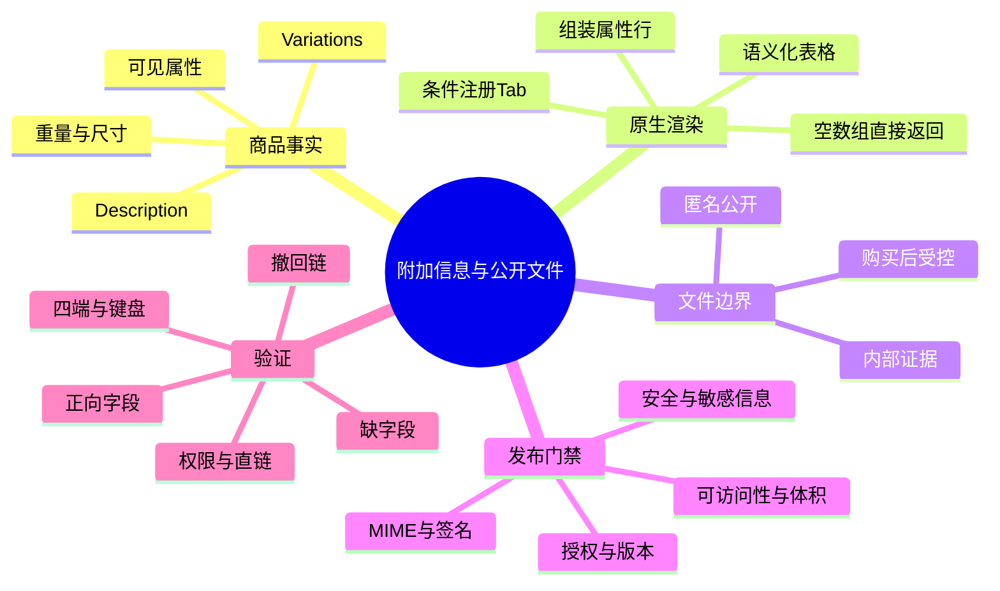
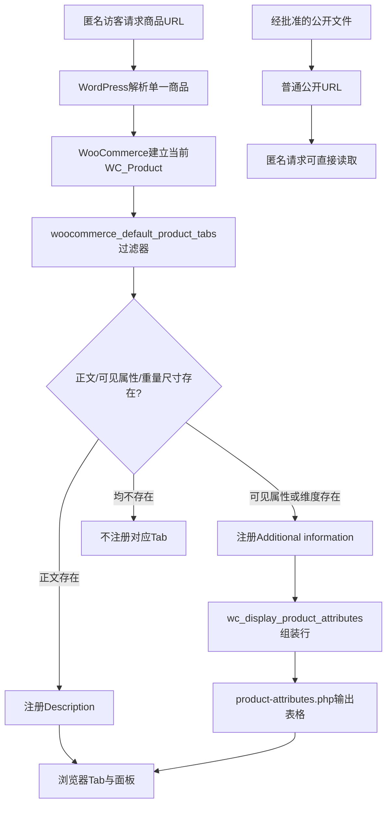

# Day63 WordPress实战：WooCommerce附加信息与公开文件边界

## 相关笔记

- 学习索引：[[WordPress实战笔记索引]]。
- 对应项目笔记：[[../Day63-原生扩展信息与公开资料空状态]]。
- 字段边界前置：[[Day62-WooCommerce原生字段与ACF启用边界]]。
- 商品Tab与Hook前置：[[Day55-WooCommerce单品模板Hook与条件样式]]。
- 文件治理项目笔记：[[../Day11-商品图片与资料文件规范]]。
- 相邻学习检查点：[[Day64-WooCommerce关联商品与原生循环边界]]。

> [!check] 双向链接状态
> 本篇已链接对应项目笔记；对应项目笔记、D55、D62、D64直接相关笔记及[[WordPress实战笔记索引]]均回填入口。链接完成不等于用户已经掌握。

## 今日学习成果

- [ ] 我能区分可见属性、重量/尺寸、Variations、Description、匿名公开附件和购买后文件各自承担的事实。
- [ ] 我能从`woocommerce_default_product_tabs()`追到`WC_Product::has_attributes()`与属性模板，解释为什么缺字段时不需要自定义空态代码。
- [ ] 我能说明普通uploads URL为什么不是访问控制，并为首份公开PDF列出发布、验证和撤回门槛。

以上是用户自测目标。源码已阅读、证据已复核不代表用户已掌握，当前不代勾。

## 真实项目场景

### 今天解决了什么问题

D62已经证明当前代表商品不需要新增ACF字段。D63继续回答两个更靠近访客的问题：已有参数怎样进入商品详情，以及没有合格PDF时页面应该呈现什么。最小答案不是先造“Downloads”模块，而是验证WooCommerce原生Description和Additional Information能承载当前事实，并让缺失内容保持不输出。

同时，DentAll的普通媒体URL可以匿名读取。若把页面密码、隐藏链接或`noindex`误当成文件权限，内部价格表、客户文件或购买后内容就可能被公开。因此“显示链接”和“允许访问文件”必须分开建模。

### 学习范围

- 本篇要掌握：经典单品Tab注册条件、属性可见性、属性表格输出、公开媒体URL、MIME/体积白名单及文件生命周期。
- 本篇明确不展开：新字段、模板覆盖、购买后下载、恶意文件扫描实现、CR-005、Variation动态购买逻辑、Staging/Production发布。
- 项目中的真实入口：WooCommerce `includes/wc-template-functions.php`、`includes/abstracts/abstract-wc-product.php`、`templates/single-product/product-attributes.php`；DentAll Core `includes/media-policy.php`；#44/#46保存HTML。
- 验证版本与环境：WooCommerce 11.0.0、Storefront 4.6.2、DentAll 0.33.0、DentAll Core 0.2.8；当前自有23个运行文件与D65隔离副本一致。本篇不外推到非Local。

## 先建立整体模型

### 一句话模型

先由商品事实决定哪些原生Tab存在，再由模板安全输出可见值；附件只有通过独立的公开授权与文件门禁后才出现，缺少合格附件时页面保持沉默。

### 记忆宫殿：公开展厅与档案室

把商品详情想成一间公开展厅：墙上的参数牌是Additional Information，产品说明册文字是Description。门口的访客无需登录就能阅读这些公开内容。公开PDF像展厅里摆出的可带走手册——一旦放上公开架，任何拿到位置的人都能取走；购买者专属文件和内部合同则必须留在有门禁的档案室。

展厅管理员不会为尚不存在的手册摆一个空架子。WooCommerce的Tab注册条件就是这个“有内容才摆牌”的机制；DentAll角色MIME白名单则是“哪些材料可以进入公开制作流程”的入口检查。但白名单本身不完成授权、安全扫描或撤回治理。

### 比喻对应回真实机制

| 记忆对象 | 真实技术对象 | 不能混淆的边界 |
|---|---|---|
| 参数牌 | WooCommerce可见属性、重量/尺寸及`Additional information` | 可见参数不等于购买选项；影响交易的组合仍由Variation负责 |
| 展厅说明 | Product `post_content`与Description Tab | 说明文字不能代替价格、库存、SKU或Variation事实 |
| 公开手册架 | 普通媒体URL与页面中的公开链接 | 没展示链接不等于文件私有；知道URL仍可能访问 |
| 档案室门禁 | 购买后下载、私有对象存储或企业文档权限 | 页面密码、`noindex`和隐藏导航都不是文件级授权 |
| 入库检查单 | MIME、真实签名、体积、授权、安全、可访问性和版本检查 | 只通过扩展名或MIME白名单不等于文件已安全、合法、适合公开 |

> [!warning] 准确性检查
> WordPress普通uploads通常由Web服务器直接提供，未必经过每次PHP权限判断；因此“展厅管理员”只帮助记忆发布流程，不能误解为每次下载都会调用WordPress角色检查。

## 思维导图



最重要的主干是：字段是否输出由商品事实决定，文件是否可公开由独立治理决定，两条链不能用一个“下载按钮”混在一起。

## 请求与生命周期调用链



- 触发条件：单一商品前台请求进入经典WooCommerce商品模板。
- 加载入口：默认Tabs Filter准备Description、Additional Information和Reviews定义。
- 执行顺序：先根据商品对象决定是否注册Tab，再在对应回调中组装属性行并输出模板。
- 输入数据：商品正文、可见属性、重量、尺寸及WooCommerce显示Filter。
- 输出或副作用：默认Tab/属性回调负责输出HTML面板；D63没有执行商品、附件、角色或设置的显式写操作。完整WordPress请求是否触发session、Cron、transient或插件写入，需要另以前后哈希或查询日志验证；普通媒体请求可能由Web服务器直接返回文件。
- 可观察证据：保存HTML的Tab和表格、浏览器ARIA/焦点/面板状态、角色允许MIME、上传预检结果及匿名`HEAD`状态。

## 核心概念卡

| 概念 | 准确定义 | DentAll真实例子 | 常见误区 | 如何验证 |
|---|---|---|---|---|
| 可见属性 | `WC_Product_Attribute::get_visible()`为真的商品属性 | #44 Package Quantity；#46 Size、Shade | 所有属性都会出现在附加信息 | 检查商品属性可见标志、`has_attributes()`和最终HTML |
| Variation属性 | 参与选择和变体匹配的属性 | #46 Size×Shade选择 | 只要显示在表格里就已经控制价格/库存 | 检查Variation对象、可售组合与购买表单 |
| Description条件 | 商品正文非空时注册的默认Tab | #44/#46均有Description | 空正文也需要前端CSS隐藏空面板 | 读取默认Tabs函数并检查空正文页面 |
| 公开媒体 | 获得URL即可匿名读取的Web资源 | 现有uploads图片匿名`HEAD`为200 | 页面未链接、加密码或noindex后文件就私有 | 无Cookie直接请求精确文件URL |
| MIME白名单 | 限制特定角色可提交的文件类型 | WM允许图片与CSV，不允许PDF | 白名单通过等于授权、安全和可访问性均通过 | 角色上下文读取`upload_mimes`并走完整上传预检 |
| 受控下载 | 根据购买、身份、期限或次数决定访问的交付链 | D63未实施 | 用普通媒体库URL加一个按钮即可实现 | 测试未授权/授权、过期、撤销、直链和日志 |

## 项目实战代码

### 涉及文件

- `D:/LocalWP/dentall/app/public/wp-content/plugins/woocommerce/includes/wc-template-functions.php`：默认Tabs注册与属性行组装。
- `D:/LocalWP/dentall/app/public/wp-content/plugins/woocommerce/includes/abstracts/abstract-wc-product.php`：`has_attributes()`只认定可见属性。
- `D:/LocalWP/dentall/app/public/wp-content/plugins/woocommerce/templates/single-product/product-attributes.php`：空数组提前返回并输出语义化表格。
- `app/public/wp-content/plugins/dentall-core/includes/media-policy.php`：DentAll业务角色的MIME与5MB限制。
- `D:/LocalWP/dentall/.codex-tmp/day65-runtime/integration/simple.html`、`variable.html`：与当前23/23自有运行文件一致的保存HTML证据。

### 从入口开始追踪

1. 商品请求进入WooCommerce经典单品模板，Tabs回调读取全局`$product`和当前`$post`。
2. `woocommerce_default_product_tabs()`不是无条件输出所有Tab，而是先判断正文、可见属性、重量和尺寸。
3. Additional Information回调调用`wc_display_product_attributes()`，把物流维度与可见属性组装成行。
4. 属性模板收到非空行才输出`table.shop_attributes`；当前浏览器脚本负责Tab选择和面板显隐。
5. DentAll没有覆盖这条链，只限制业务角色上传类型和大小；因此删除DentAll媒体Filter会扩大上传入口，却不会改变商品属性Tab的注册逻辑。

### 关键代码片段

WooCommerce 11.0.0默认Tab注册条件（摘录最小判断）：

```php
if ( $post->post_content ) {
	$tabs['description'] = array( /* ... */ );
}

if ( $product && ( $product->has_attributes() || apply_filters(
	'wc_product_enable_dimensions_display',
	$product->has_weight() || $product->has_dimensions()
) ) ) {
	$tabs['additional_information'] = array( /* ... */ );
}
```

DentAll Core当前角色白名单：

```php
$allowed_keys = array( 'jpg|jpeg|jpe', 'png', 'webp' );

if ( current_user_can( DENTALL_WEBSITE_MANAGER_MARKER ) ) {
	$allowed_mime_types['csv'] = 'text/csv';
}
```

| 代码 | 表面动作 | WordPress/WooCommerce中的真实作用 | 为什么这样保留 |
|---|---|---|---|
| `$post->post_content`判断 | 检查正文 | 决定Description Tab是否注册 | 空值从结构源头消失，不依赖CSS隐藏 |
| `has_attributes()` | 检查属性 | 只要存在至少一个可见属性就允许附加信息Tab | 隐藏的后台属性不应单独制造访客面板 |
| 重量/尺寸Filter | 检查物流字段 | 允许主题/插件协调维度显示 | D63没有证据需要改默认值 |
| `$allowed_keys` | 收窄上传类型 | 对受限业务角色返回最小MIME集合 | 当前无合格PDF，保持关闭比预开放更安全 |
| Website Manager CSV分支 | 增加CSV | 支持既有Woo原生商品导入职责 | CSV是已验收业务能力，不能因D63误删 |

### 运行证据

- 只读命令：对当前主题/Core与D65隔离副本的23个Git跟踪运行文件统一换行后逐文件比较，结果23/23相同。
- 正常结果：#44输出Weight、Dimensions、Package Quantity；#46输出Weight、Dimensions、Size、Shade；两者均有Description。
- 空与失败边界：两商品Description/Additional Information面板内PDF提及、资料链接和`download`属性均为0；业务角色PDF拒绝，5MB+1预检拒绝。
- 四端结果：复用同运行代码的390/768/1024/1440八张页面视口截图与`visual-audit.json`；两商品页面横向溢出0、坏图0、H1为1，重复ID只在#44 390及#46四宽记录为0。保存HTML证明Tab结构；#46单一路径的Additional information键盘激活与3px焦点通过，未做四宽逐一Tab交互/截图。
- 数据边界：D65的`source-verification.json`只证明D65那次25个非空源表前后哈希不变；D63未执行显式业务/配置写入，但没有当前数据库全表前后哈希。
- 证据能证明：当前版本原生字段和无资料空态满足批准范围，DentAll不需要新增运行代码。
- 证据不能证明：真实认证/PDF内容正确、PDF安全/可访问、撤回有效、实体设备/屏幕阅读器或非Local可用。

## 职责边界

| 层级 | 本主题中负责什么 | 不应该负责什么 |
|---|---|---|
| WordPress Core | 媒体附件、角色能力、上传预检与公开URL基础 | 不修改核心；不把普通uploads承诺为私有存储 |
| WooCommerce | 商品对象、属性、Variation、默认Tabs和属性模板 | 不用PDF或Description替代交易字段；不直接依赖内部订单表 |
| Storefront父主题 | 经典商品结构和Woo样式/脚本集成 | 不直接修改第三方主题文件 |
| DentAll子主题 | 保留D55～D58的商品视觉，不改本轮Tab事实 | 不为无内容预建空模块或重复模板 |
| `dentall-core` | 业务角色MIME与5MB安全边界 | 不承载纯展示代码；不在未授权时开放PDF |
| Website Manager | 维护已批准商品事实，未来按SOP发布公开资料 | 不自行认定文件授权、认证有效性或内部资料可公开 |
| 业务方 | 批准认证、文件用途、版本、期限与公开范围 | 不把内部来源文件直接丢进媒体库 |
| 数据库与媒体 | 保存商品事实与公开文件 | 不把TEST值、推测认证或未授权资料当正式内容 |
| 浏览器/Web服务器 | 呈现Tab、处理键盘交互并返回公开文件 | 前端隐藏不等于服务端访问控制 |

## Hook、API与模板机制详解

| 项目 | 说明 |
|---|---|
| 机制类型 | Filter＋模板回调＋商品对象API |
| 名称或入口 | `woocommerce_product_tabs`上的`woocommerce_default_product_tabs()` |
| 默认优先级 | 10；D63没有移除、重排或替换 |
| 主要输入 | 当前`WP_Post`正文与`WC_Product`的可见属性、重量、尺寸 |
| 必须返回 | Filter必须返回Tabs数组；回调随后输出对应面板 |
| 属性输出 | `wc_display_product_attributes()`组装行，`single-product/product-attributes.php`输出 |
| 副作用 | 默认回调输出前台HTML；D63未执行显式业务/配置写入，完整请求的session/Cron/transient/插件副作用须另验 |
| 影响范围 | 匿名和登录访客的经典单一商品页 |
| 扩展风险 | 第三方Filter可能重排/删除Tab或在注册后改变最终属性；升级后需复验 |

媒体策略使用`upload_mimes`、`upload_size_limit`、`wp_handle_upload_prefilter`与`wp_handle_sideload_prefilter`，优先级为`PHP_INT_MAX`。它限制进入路径，但不替代Capability、nonce、真实文件签名、安全扫描、授权审批或已公开文件撤回。

## 安全、数据与站点影响

| 检查面 | 本次结论 | 证据或待验证项 |
|---|---|---|
| 输入清洗与验证 | 本轮无新输入；现有上传预检保持 | 首份PDF须重新验扩展名、MIME、签名、安全与敏感信息 |
| Capability | PDF没有加入业务角色允许集合；`unfiltered_upload=no` | 两角色独立只读复核通过 |
| Nonce | 本轮无后台动作，不适用 | 未来上传/保存仍不能用nonce代替Capability |
| 输出转义 | 沿用WooCommerce原生属性输出链 | 读取`wc_display_product_attributes()`和模板；未加自定义HTML |
| D63业务/配置写入 | 未执行 | 没有保存商品、属性、附件、角色、选项或ACF；未做本轮全表前后哈希，不断言完整GET绝对无数据库副作用 |
| URL与SEO | 无新URL或SEO输出 | 未来公开文件URL的索引和撤回需验；RSK-036跟踪（集成时避免重号） |
| 缓存 | 无配置或资源变化 | 未来撤回需同时核对页面、对象/CDN和搜索引擎缓存 |
| 支付、物流与订单 | 无变更 | 购买后下载未实施；重量/尺寸仍沿既有商品事实 |
| 部署与回滚 | 仅Markdown，未部署非Local | 回滚文档提交即可；运行和数据无需回退 |

## 动手练习

### 练习一：只读观察Tab条件

- 目标：不用改代码，说明#44和#46为什么出现Additional Information。
- 操作：在保存HTML找到属性行，再回到`woocommerce_default_product_tabs()`、`has_attributes()`和属性模板追踪条件。
- 预期：能指出每一行来自重量/尺寸还是可见属性；隐藏属性不自动进入表格。
- 实际证据：#44三行、#46四类输出均已解析；源码空态条件已复核。

### 练习二：DevTools临时验证语义与键盘

- 改动：不改源码、不写数据库；在Local商品页用Elements查看`role="tab"`、`aria-selected`、`aria-controls`和表格`scope="row"`，用键盘切换Additional information。
- 风险边界：DevTools变化只存在当前浏览器；不得上传真实文件或保存商品。
- 验证：焦点仍可见、活动Tab唯一、面板显示且Console无错误。
- 回滚：刷新页面即可；临时修改不能替代源码或证据。

### 练习三：公开文件故障推演

- 假设症状：页面已经删除PDF链接，但知道旧URL的人仍能打开文件。
- 可能原因：文件仍在公开uploads、页面/CDN缓存仍含链接、搜索引擎仍索引旧URL，或删除动作没有定义HTTP状态/替代资源。
- 第一项检查：无Cookie直接请求精确旧文件URL并记录状态、响应头和内容身份。
- 为什么先查它：先判断资源本身是否仍公开，再处理页面、缓存和搜索发现性，避免只修按钮外观。

## 常见误区与排错顺序

| 现象或误区 | 可能原因 | 推荐检查顺序 | 最小验证方法 |
|---|---|---|---|
| Additional Information为空或缺失 | 无可见属性/重量尺寸；taxonomy异常；第三方Filter改变最终数组 | 1. 商品对象事实；2. 属性`visible`；3. 默认Tab条件；4. 最终Filter/HTML | WP-CLI只读查看商品对象＋保存HTML＋源码/Hook检查 |
| 隐藏属性仍显示 | 商品级/全局属性配置误解，或第三方输出绕过原生模板 | 1. 后台属性配置；2. `get_visible()`；3. 模板/Filter来源 | 比较对象属性与最终表格行 |
| 删除页面链接后文件仍可访问 | 普通uploads直链仍公开 | 1. 精确文件URL；2.页面/站内链接；3.缓存；4.索引 | 无Cookie `HEAD/GET`请求，不以导航可见性判断 |
| PDF上传失败 | 当前角色白名单明确拒绝；体积超限；真实MIME不匹配 | 1. 角色；2. 允许MIME；3. 体积；4. 文件签名/错误信息 | 使用无敏感TEST文件走完整预检；本轮不开放正向权限 |
| “下载按钮”出现但没有文件 | 预建占位DOM、数据为空或模板逻辑错误 | 1. 事实源；2. 条件渲染；3. HTML；4. CSS | 禁用CSS仍不应存在空链接或不可用控件 |

## 掌握标准

- [ ] 不看笔记，能在2分钟内讲清字段渲染与文件授权两条因果链。
- [ ] 能指出WooCommerce默认Tabs、`has_attributes()`、属性模板和DentAll媒体策略文件。
- [ ] 能区分可见属性、Variation、Description、公开附件和受控下载。
- [ ] 能说明正常、缺字段和旧文件仍可访问三条路径的检查顺序。
- [ ] 能在Local完成只读DOM/键盘/直链验证，并说明为什么本轮不需要代码回滚。
- [ ] 能判断资料变化对数据、URL/SEO、缓存、支付、物流和部署的影响。

当前掌握度：初识。

## 费曼测试题

1. 不使用专业术语，怎样解释“没有PDF时不输出”为什么比先放一个灰色下载按钮更可靠？
2. 把公开展厅、参数牌、手册架和档案室逐一对应到WordPress/WooCommerce对象；比喻在哪一点会失效？
3. 从匿名访客请求#46开始，按顺序讲出Additional Information如何决定存在、如何组装行、怎样进入浏览器。
4. 为什么属性出现在Additional Information，不代表它已经控制价格、库存和合法购买组合？请用Size/Shade举例。
5. 为什么页面密码、隐藏链接和`noindex`都不能保护普通uploads文件？第一项只读验证是什么？
6. 首份真实公开PDF到来时，发布前和撤回时分别需要哪些证据？谁负责业务批准，谁负责技术边界？
7. 如果升级WooCommerce后出现空Additional Information面板，你会先收集哪三类证据，为什么不先写守卫代码？

### 我的费曼答案与纠正

待用户自测。每题按`通过`、`含糊`或`答错`记录，并把知识缺口链接回“调用链”“职责边界”或“排错顺序”；AI不代答后直接提升掌握度。

### 自测评分

| 分数 | 标准 |
|---:|---|
| 0 | 无法解释，或把公开链接、角色权限和受控下载混为一谈 |
| 1 | 能说术语，但说不清调用顺序、责任和证据 |
| 2 | 能用通俗语言解释，并准确对应真实机制、DentAll证据与未验证边界 |

总分：待用户填写 / 14；存在0分题时不提升掌握度。

## 间隔复习记录

| 复习节点 | 计划日期 | 完成 | 暴露的问题 | 修正位置 |
|---|---|---|---|---|
| D+1 | 2026-09-08 | [ ] | 复习后记录 | 复习后记录 |
| D+3 | 2026-09-10 | [ ] | 复习后记录 | 复习后记录 |
| D+7 | 2026-09-14 | [ ] | 复习后记录 | 复习后记录 |
| D+14 | 2026-09-21 | [ ] | 复习后记录 | 复习后记录 |

## 收尾总结

- 今天应真正理解：原生条件渲染已经覆盖当前空态；不新增代码也是有源码、数据和浏览器证据支撑的工程决定。
- 仍容易混淆：参数展示与Variation交易职责、媒体上传许可与文件公开授权、撤掉页面链接与撤回文件访问。
- 下次遇到类似问题，先查事实源、注册条件和精确资源URL，再决定是否需要扩展。
- 下一篇顺序主线学习笔记仍由D59真实实施生成；D64/D65是独立并行知识，不表示D59～D61已完成。

## 后续如何向AI高效提问

可以使用：`环境版本 + 商品ID/字段事实 + 预期Tab/文件权限 + 当前HTML/HTTP证据 + 明确只读或可写范围 + 希望得到的最小检查顺序`。

示例：

```text
这是WooCommerce商品详情与公开文件边界问题。
环境：WordPress 7.0.4、WooCommerce 11.0.0、Storefront 4.6.2，Local。
商品事实：[正文、可见属性、重量尺寸、Variation、附件状态]
预期：[哪些Tab或链接应出现/不出现]
实际证据：[保存HTML、HTTP状态、角色、错误信息]
边界：先只读，不改核心、不写数据库、不开放PDF、不碰Production。

请先追踪默认Tabs、属性对象和模板，再区分字段空态、第三方Filter、公开URL和受控下载。列出事实、推断、最小验证；只有确认原生能力不足时才提出最小实现候选。
```

> [!warning] AI验证边界
> AI解释不是运行证据。版本相关结论要核对当前源码；公开性要用无Cookie精确URL请求验证；任何上传、角色、商品或文件写入都必须重新确认范围并准备回滚。

## 变种应用到其他项目

| 新场景 | 保持不变的原则 | 可能变化的实现 | 必须重新确认 | 最小验证 |
|---|---|---|---|---|
| 另一个Storefront子主题 | 有内容才输出；公开与受控分流 | 子主题Filter和样式 | Woo/Storefront版本、已有模板覆盖和插件 | 对象事实、Tabs HTML、无Cookie文件请求 |
| 其他经典WordPress商城主题 | 单一事实源、条件渲染、文件生命周期 | 父主题Hook、Tab DOM和CSS | 主题是否覆盖Woo模板 | 正常/空态商品与键盘回归 |
| WordPress区块主题 | 同一数据/授权边界 | Product Collection/区块模板与Interactivity API | 当前Woo区块能力、模板和扩展点 | 编辑器预览、前台DOM、升级回归 |
| 独立文件插件 | 上传入口不等于访问授权 | 私有存储、签名URL、日志和撤回机制 | 身份、期限、审计、缓存与供应商锁定 | 未授权/授权/过期/撤销矩阵 |
| Shopify或其他平台 | 字段事实、公开附件、客户文件和内部证据分流 | Metafield、Files、主题区块或数字交付应用 | 官方权限、URL公开性、缓存和撤回模型 | 仅在沙盒按官方文档与真实请求验证，当前待验证 |

### 变种练习

选择“WordPress区块主题”或“独立文件插件”，先回答业务事实和访问对象是否变化，再列出三条可迁移原则、必须替换的Woo专有机制、要查证的官方资料及最小正反向测试。不要从界面相似推导权限等价。

## 可复用核心思想

### 跨平台不变量

- 渲染结构应由事实存在性驱动：缺少内容时不制造空控件，既减少误导，也减少可访问性、状态和缓存测试面。
- 公开、客户专属和内部文件必须从存储、授权、URL、缓存与撤回生命周期分流；按钮样式和页面可见性不能代替访问控制。
- 关键交易、安全、兼容和合规事实应同时存在于可访问页面内容；附件是补充载体，不是唯一事实源。

### WordPress/WooCommerce当前实现

- WooCommerce 11.0.0根据`post_content`、可见属性和重量/尺寸决定默认Tab，再由`wc_display_product_attributes()`与属性模板输出。DentAll保持原生链，因此本轮运行代码净增为0。
- WordPress普通uploads可被匿名直链；DentAll Core 0.2.8为业务角色保留图片/CSV白名单与5MB上限，PDF继续关闭。首份真实PDF需要新的授权与正向/撤回验收。

### Shopify或其他平台的对应机制

- Shopify也需要区分结构化商品事实、主题展示、公开文件、客户授权文件和内部证据，但具体Metafield、Files URL、应用代理或数字下载能力尚未在DentAll实测，统一标记为“待验证”。
- 迁移时只复用事实职责、最小权限、条件输出和生命周期测试，不复制WooCommerce的Tab名称、Hook或WordPress媒体路径，也不把知识对照扩大为DentAll第一版实施。
