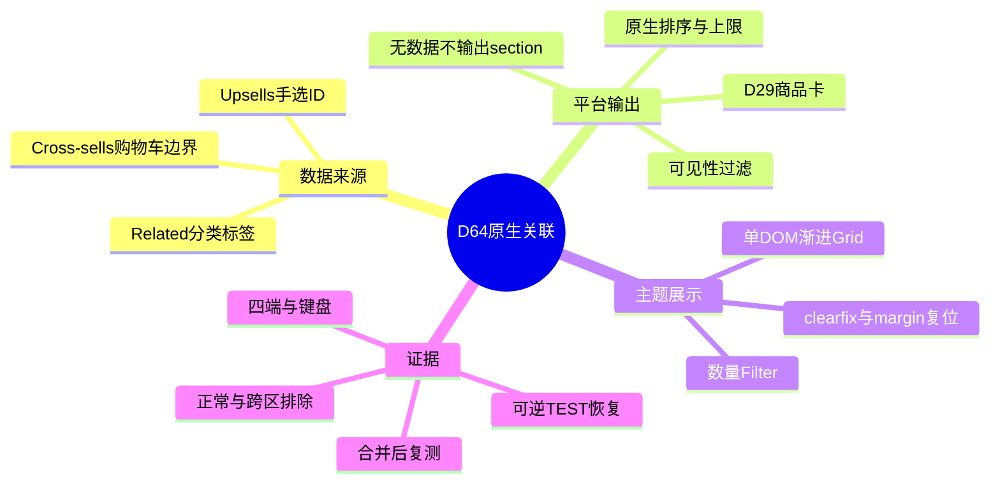
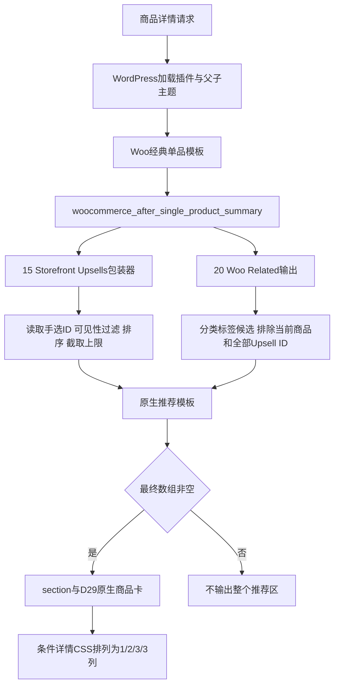

# Day64 WordPress实战：WooCommerce关联商品与原生循环边界

## 相关笔记

- 学习索引：[[WordPress实战笔记索引]]
- 对应项目笔记：[[../Day64-原生关联商品与推荐空状态]]
- 卡片内部契约：[[Day29-原生循环与卡片展示契约]]
- 单品Action与资源入口：[[Day55-WooCommerce单品模板Hook与条件样式]]
- 相邻信息与文件边界：[[Day63-WooCommerce附加信息与公开文件边界]]
- 继承的信息展示基线：[[Day57-WooCommerce商品摘要Hook与状态驱动样式]]
- Sticky遮挡与命中测试：[[Day59-响应式单品布局与主题配置边界]]
- 后续学习：D65或D66形成实际相关笔记后补双向链接。

## 今日学习成果

- [ ] 能解释Related、Upsells、Cross-sells的事实源与页面位置，并区分自动相关和人工关联。
- [ ] 能从After Summary追到原生模板、D29卡片、数量Filter及CSS Grid，解释“不足不补位”。
- [ ] 能用隔离TEST验证重复、空态与四端布局，分开验证数据恢复与代码回退。

代码、动态矩阵、业务字段恢复、独立复核和隔离服务关闭均已有证据；下文正式环境与后续集成待验项不作为已完成证据。掌握度需由开发者实际自测，不能由AI代勾。

## 真实项目场景

### 今天解决了什么问题

D29已经统一商品卡内部展示，D55确认商品详情使用经典模板和After Summary Action。D64的任务是把原生关联结果放进可维护的推荐区，而不是再建立一套商品数据或推荐服务。需要解决的具体问题是：三种“关联”名称容易混用、手选推荐数量可能失控、默认浮动列表与详情四端网格不一致，以及没有候选时是否应留空壳。

### 学习范围

- 掌握原生候选与手选ID、可见性过滤、上限和排序、模板空态、卡片与页面网格职责。
- 不展开算法推荐、个性化、购物车交叉销售、交易计算、插件选型或生产部署。
- 真实入口：`inc/storefront-hooks.php`中的`dentall_product_upsells_limit()`；`assets/css/product-detail.css`；WooCommerce `wc-template-functions.php`、`wc-product-functions.php`及`single-product/related.php`、`single-product/up-sells.php`。
- 所有项目运行路径均相对`app/public/wp-content/themes/dentall/`；上游源码路径相对`app/public/wp-content/plugins/woocommerce/`。不修改上游文件。
- 环境为隔离Local副本，版本见页首；不能据此宣称主Local、Staging或Production已同步。

## 先建立整体模型

### 一句话模型

平台决定哪些商品成为候选并输出真实卡片，主题限制显示数量和排列方式；候选不足或不可见时，正确的结果可以是少卡片或整区不输出。

### 记忆宫殿或实体比喻

把详情页想成书店的主题展台。分类与标签是书架索引，Related根据索引找同类书；Upsells是店员为某一本书手写的推荐清单；Cross-sells是到收银台后才使用的搭配清单。模板决定是否摆出整块展台，ProductCard负责单本书的标签，CSS负责展台有几列。三列空位不构成再找三本无关书的理由。

### 比喻对应回真实机制

| 记忆对象 | 真实技术对象 | 不能混淆的边界 |
|---|---|---|
| 书架索引 | `product_cat`、`product_tag` | 默认Related不把品牌或Variation属性当同一数据源 |
| 店员推荐清单 | `WC_Product::get_upsell_ids()` | 人工关联不保证按录入顺序展示；当前沿用随机排序 |
| 收银台搭配清单 | Cross-sell商品ID和购物车输出链 | D64不把它搬到详情，也不扩展Cart Blocks |
| 整块展台 | 原生Related/Upsells section模板 | 空态应看最终可见结果，不能只看原始ID是否有值 |
| 单本标签和展台格子 | D29 ProductCard与D64 Grid | 卡片数量是PHP合同，列数是CSS合同 |

比喻不包含库存共享、医学兼容或替代关系；真实商品关系需要业务依据，不能从“同类”推断这些事实。

## 思维导图



主干是先确认结果来源，再判断输出条件，最后调整布局；不能从截图中的空位倒推商品查询。

## 请求与生命周期调用链



- 触发条件：经典单品页面及其原生Action，不是首页或Shop归档查询。
- 加载入口：子主题`functions.php`加载已有Hook模块；`inc/setup.php`已有Product条件enqueue加载详情CSS。
- 执行顺序：Tabs优先级10；Storefront Upsells优先级15；Woo Related优先级20；相邻商品导航优先级30。D64不重排这些Action。
- 输入数据：当前`WC_Product`、分类/标签、手选关联ID和上游参数。
- 输出或副作用：运行代码只影响展示上限与网格；Woo原有商品读取和Related transient仍会运行，不能写成整个请求不查询或不写缓存。
- 可观察证据：HTML的section、每区商品ID、卡片数量、图片与链接、CSS计算值，以及最终数据快照。

## 核心概念卡

| 概念 | 准确定义 | DentAll例子 | 常见误区 | 验证方法 |
|---|---|---|---|---|
| Related | 平台从分类/标签选择相关商品 | 保留Storefront当前最多3项合同 | 把品牌相同理解为必定相关 | 只改变隔离夹具关联条件后读ID |
| Upsells | 当前商品保存的一组人工关联ID | 详情最多显示3项 | 把上限理解为必须填满 | 比对0/1/多项可见输出 |
| Cross-sells | 原生购物车搭配关联数据 | D64只盘点，不扩展页面 | 名称翻译相近就把两字段混写 | 核对字段API与页面Hook |
| 可见与可购买 | 平台分别判断目录展示与购买条件 | 售罄卡仍可有详情链接 | 不可购买就必须不存在 | 同时核对卡片与动作文案 |
| 数量上限与列数 | 服务端结果上限与浏览器轨道数量 | 最多3项，四端1/2/3/3列 | CSS三列就会查询三项 | 分别数DOM和看Computed |
| 空态 | 最终数组无可见产品时无section | 无空标题或骨架 | 有原始ID就必有卡片 | 检查模板条件和最终HTML |

## 项目实战代码

### 涉及文件

- `app/public/wp-content/themes/dentall/inc/storefront-hooks.php`：原生数量Filter。
- `app/public/wp-content/themes/dentall/assets/css/product-detail.css`：推荐网格与相邻区段间距。
- `app/public/wp-content/themes/dentall/style.css`：分支资源版本；不承载新推荐逻辑。

### 从入口开始追踪

1. Storefront在After Summary优先级15调用`storefront_upsell_display()`，继续交给Woo的`woocommerce_upsell_display()`。
2. Woo读取`woocommerce_upsells_total`的过滤结果；DentAll只在`is_product()`成立时把上限设为3，其他请求保留传入值。
3. Woo从全部手选ID读取产品，执行原生可见性过滤、排序与截取，再交原生模板。
4. 模板使用`wc_get_template_part( 'content', 'product' )`复用D29卡片；CSS只排列它们。
5. 移除DentAll Filter会恢复上游上限；删除Grid会回到父主题列表布局。两者都不应改商品关联字段。

### 关键代码片段

以下节选来自`inc/storefront-hooks.php`，没有为教学改写逻辑：

```php
function dentall_product_upsells_limit( $limit ) {
    if ( function_exists( 'is_product' ) && is_product() ) {
        return 3;
    }

    return $limit;
}
add_filter( 'woocommerce_upsells_total', 'dentall_product_upsells_limit' );
```

| 代码 | 表面动作 | 真实作用 | 为什么保留 |
|---|---|---|---|
| `function_exists()` | 检查函数存在 | Woo不可用时不直接调用缺失函数 | 兼容插件生命周期 |
| `is_product()` | 检查请求身份 | 把展示约束限定在单品页 | 不影响其他原生调用上下文 |
| `return 3` | 返回整数 | 交给Woo的既有截取流程 | 不创建第二商品查询 |
| `return $limit` | 返回原值 | 让非目标场景保留上游合同 | 不能无条件覆盖所有调用 |

`product-detail.css`最小Grid节选如下；媒体查询在48rem和64rem分别增加到2、3列：

```css
.single-product div.product > :is(.related, .upsells) > ul.products {
    display: grid;
    grid-template-columns: minmax(0, 1fr);
    gap: var(--dentall-space-16);
    margin-block-end: var(--dentall-space-48);
}
```

Grid容器内父主题`::before/::after`的clearfix会成为布局项目，因此在该局部取消。卡片原有百分比宽度和margin也必须复位，但不能丢掉推荐区之间需要的垂直间距。本轮独立测试实际发现1440px时Upsells网格底部与Related标题顶部相同；补入上述`margin-block-end`后，独立四宽复测间距均48px、overflow均0，P2关闭。

### 运行证据

- 已完成：真实源码追踪、3文件差异、PHP lint、`git diff --check`、首轮独立静态审查。
- 动态：cap得到Upsells 3/Related 2，Related排除全部4个配置Upsell；one四端1/0、empty四端0/0、related-only为3、tag-only返回#159/#160/#161，证明上限、空态、全量排除和单独标签来源。
- 角色：`roles-audit.json`中guest仅显示#162，草稿不可编辑/不可见、隐藏商品不可见；Website Manager显示#164/#162，草稿可编辑/可见、隐藏商品仍不可见。不能把匿名Draft URL 404推导成所有角色都不显示草稿推荐。
- 浏览器：`mixed-browser.json`11行通过，四端1/2/3/3、errors为空、图片全部解码；响应式图片ERR_ABORTED为取消请求，已单独记录。推荐链接6条200、Draft匿名404。
- 已关闭P2：推荐区间距由0修复到独立四宽均48px，overflow 0。D64当时发现原生Storefront Sticky在1440px局部遮住4个大链接图片顶部，标题/价格/按钮仍可见且无完全遮挡焦点；D58/D65集成复现后，D59关闭Local原生配置并以0 DOM、0脚本和图片命中回归关闭该P3。D64未单独回放D57，不能断言相同现象已在D57存在。
- 查询：`baseline-query-audit.json`与`d64-query-audit.json`在全新PHP 8.2.29 CLI进程测得原生推荐回调冷/暖均32/0条，不能据此声称整页、生产或大目录性能已验。
- 恢复：`restore.json`中`restored=true`，5个原对象快照业务字段一致、6个TEST商品remaining为空；`restored-terms.json`中本次2分类/1标签均不存在。快照覆盖SKU/类型、价格、库存状态/数量、主图/图库、分类/标签、Upsells/Cross-sells；不含modified时间或缓存的逐字节还原。
- 恢复页：`restored-browser.json`的5页1440px均200、1个H1、overflow 0，无JS错误或非取消请求错误；Simple/Variable各Related 1并各1份详情CSS，Shop/Home/Cart不加载详情CSS。
- SEO现状：恢复页均noindex/nofollow且Canonical缺失；商品有Product Schema和两份BreadcrumbList（Yoast/Woo），交D65合成核对，不写成SEO全验通过或前后完全一致。
- 静态与关闭：`final-static-check.json`为PHP lint exit 0、PHP错误匹配0、业务快照恢复true；扩大检索另有2条MySQL初始化警告，见`final-log-check.json`及项目笔记，不能写所有日志无警告。`runtime-stop.json`为16464/16411监听0、文件保留。代码与数据可恢复不等于测试服务应该长期开放。
- 最终复核：`final-code-review.md`确认无未关闭P0/P1/P2。独立浏览器实际重跑mixed四宽、48次Tab、链接/匿名Draft与间距；主执行矩阵的其他场景由独立Code Reviewer复核已有证据，没有全部再次执行。
- 当前证据不能证明生产性能、真实目录质量、用户掌握度或全交易闭环。

实际命令节选：PHP 8.2.29执行`php -l app/public/wp-content/themes/dentall/inc/storefront-hooks.php`；主浏览器使用`node .codex-tmp/day64/browser.cjs mixed`及分别执行的其他场景；独立浏览器使用`node outputs/day64/independent-check.cjs`；隔离`wp.ps1 eval-file .codex-tmp/day64/fixture.php restore`执行恢复。完整命令与执行顺序见对应项目笔记，所有写命令只针对隔离副本，不能套用到源站。

## 职责边界

| 层级 | 本主题负责 | 不应承担 |
|---|---|---|
| WordPress Core | 加载生命周期、模板上下文、资源与文章数据 | 不修改核心来修推荐布局 |
| WooCommerce | 商品对象、关联ID、可见性、排序、原生模板与缓存 | 不绕过API另造价格或库存事实 |
| Storefront | After Summary包装器与默认列表展示 | 不直接编辑父主题 |
| DentAll子主题 | 显示上限、局部Grid、间距和版本 | 不新增推荐算法或关联模型 |
| `dentall-core` | 本轮保持原状 | 不塞入纯展示数量规则 |
| 数据库与媒体 | 保存业务关联及授权图片；隔离副本承载TEST | 不把TEST关系升级为正式推荐 |
| 浏览器 | 实现Grid、图片、Focus与键盘表现 | 不把DOM模拟当持久化数据证据 |

## Hook、API或模板机制详解

| 项目 | 说明 |
|---|---|
| 机制 | `woocommerce_upsells_total` Filter |
| 注册 | 子主题已有`inc/storefront-hooks.php`，默认优先级10 |
| 输入与返回 | 原生数量值；目标单品请求返回3，其他返回原值 |
| 调用位置 | Woo `woocommerce_upsell_display()`在读取可见Upsells和截取前读取上限 |
| 副作用 | 改变最多输出数量，不保存关联ID、不重排After Summary Action |
| 兼容 | 上游回调、经典模板和CSS结构升级后要复查；区块单品模板不自动继承该验收 |
| 回滚 | 回退D64独立提交并统一主题版本；已配置关联数据无需随展示规则删除 |

Related调用`wc_get_related_products()`时传入全部`get_upsell_ids()`作为排除集，并追加当前商品ID。即使只显示3个Upsell，未显示的手选ID也不会回到Related补位。Related候选ID截取后还会执行可见性过滤；过滤后不足不再补查询。原生`wc_related_{product_id}` transient仍运行，D64既未替代它，也不保证每次请求零查询或顺序稳定。

可见性必须注明访问角色。本次隔离样本实测，有编辑草稿权限的Website Manager可通过原生Upsells看到Draft #164，访客只看到#162；目录隐藏#163两者都看不到。因此数据审计、匿名URL和后台权限必须一起解释，不能用管理员截图证明访客页面内容。

## 安全、数据与站点影响

| 检查面 | 本次结论 | 待验边界 |
|---|---|---|
| 输入、Capability、Nonce | 新运行Filter无用户输入、后台动作或写端点 | 原生后台权限保持，不新增可写API |
| 输出转义 | 不新增HTML字符串，复用平台模板 | 升级模板需重验 |
| 数据写入 | 运行逻辑不写商品；隔离TEST已清理、5对象快照业务字段恢复 | modified/缓存有变化，不宣称整库逐字节恢复 |
| URL与SEO | 不创建路由、SEO Filter或Schema；5页noindex/nofollow且无Canonical | 商品有Product及两份BreadcrumbList，交D65合成核对；正式环境另验 |
| 缓存 | 原生缓存保留，分支0.33.0刷新静态资源键 | 不能宣称生产命中或性能零影响 |
| 交易与外发 | 不扩展购买动作；隔离副本阻断外发与真实支付 | 不把推荐链接检查写成订单验收 |
| 部署与回滚 | D64独立提交供主任务选择合并 | D57快照不重复cherry-pick，非Local未部署 |

## 动手练习

### 练习一：只读观察

- 在商品页Elements找到`.upsells`与`.related`，数每区`li.product`并检查商品链接。
- 在Computed查看`grid-template-columns`，分别切换390、768、1024、1440。
- 预期数量最多3，列数1/2/3/3；两件卡片不会因为三列而出现第三件假商品。
- 当前动态矩阵与恢复态都有证据，开发者是否亲自完成本练习仍由本人记录。

### 练习二：Local最小改动

- 仅在隔离副本使用原生后台Linked Products调整一条TEST Upsell，先记录原值。
- 检查Upsell输出与Related排除，不改价格、库存、Slug、业务权限或源库。
- 恢复原ID列表并重新加载，分别确认字段读回和HTML；只删CSS不能恢复数据。

### 练习三：故障推演

- 症状：两个推荐区挤在一起。
- 先量测上一Grid底部和下一标题顶部，查看卡片margin与section/ul margin的最终Computed值。
- 原因可能是从float改Grid时清除卡片margin，连同原先提供垂直间距的规则一并消失。
- 先修局部网格外间距；不要为这一现象重写卡片、插空DOM或扩大全局Section Token。

## 常见误区与排错顺序

| 现象或误区 | 可能原因 | 推荐顺序 | 最小验证 |
|---|---|---|---|
| Related少于3张 | 排除集或可见性过滤后不足 | ID来源→全部Upsell排除→可见性→最终模板 | 输出ID集合与DOM数量对照 |
| 空标题没有消失 | 自定义壳层绕过原生空态 | 找section输出者→检查数组→看模板 | 原生空结果0 section |
| Grid第一格空白 | clearfix伪元素成了Grid item | Elements伪元素→Computed content→局部复位 | 关闭伪元素后轨道正常 |
| 只在详情卡片过窄 | 父主题百分比宽度残留 | 命中选择器→width/margin→Grid轨道 | 不改Shop规则验证详情 |
| 非Product也被限制为3 | Filter没有上下文边界 | 请求身份→回调返回值 | 非Product传入值不变 |
| 清理后仍有旧结果 | 原生缓存或对象未恢复 | 原值→候选/关联缓存→实际HTML | 新请求读回；不盲目全站清缓存 |

## 掌握标准

- [ ] 能在2分钟解释来源、过滤、模板与Grid的因果链。
- [ ] 能指出真实Filter、Action、模板与条件资源入口。
- [ ] 能区分核心、Woo、父主题、子主题和业务数据职责。
- [ ] 能说明正常、无数据和跨区排除路径。
- [ ] 能在隔离Local完成最小验证并分别恢复代码与数据。
- [ ] 能判断URL、SEO、缓存、交易与部署影响。

当前掌握度：初识；尚未记录开发者实际自测。

## 费曼测试题（7道）

1. 用书店比喻解释Related、Upsells、Cross-sells，分别对应哪些真实数据？
2. 从商品请求开始，谁调用After Summary，谁最后输出ProductCard？
3. 为什么三列并不保证三张卡？Related在哪一步可能减少结果？
4. 只显示3个Upsell时，其余手选ID是否还能进入Related，为什么？
5. 为什么取消clearfix和卡片margin后仍可能出现新的间距问题？
6. 验证“已恢复”至少需要哪些数据与浏览器证据？
7. 换成其他主题或平台时，哪些原则保留，哪些Hook和模板必须重新查证？

### 我的费曼答案与纠正

开发者尚未作答；后续逐题标记通过、含糊或答错，并链接对应章节。AI提供的示范不能替代自测。

### 自测评分

每题0分为无法解释、1分为只有定义、2分为能说明因果与项目证据。当前未评分，满分14分；存在0分题时不提高掌握度。

## 间隔复习记录

| 节点 | 计划日期 | 完成 | 问题与修正 |
|---|---|---|---|
| D+1 | 2026-09-08 | [ ] | 尚未复习 |
| D+3 | 2026-09-10 | [ ] | 尚未复习 |
| D+7 | 2026-09-14 | [ ] | 尚未复习 |
| D+14 | 2026-09-21 | [ ] | 尚未复习 |

这些日期只是笔记中的复习建议，没有创建提醒或自动化。

## 收尾总结

- 本日重点：把原生商品来源、结果上限与CSS轨道分开，保持空态和现有卡片职责。
- 容易混淆：随机结果与缓存、可见与可购买、已执行清理与已证明恢复。
- 下次先查：Action/模板来源、最终ID集合、Computed宽度/margin/伪元素。
- 下一篇：D65或D66真实实现后的SEO/整体回归笔记，创建后回填。

## 后续如何向AI高效提问

### 提问公式与准备

`真实版本和页面 + 期望结果 + 原生Hook/模板 + 最小代码 + ID/DOM/Computed证据 + 允许范围`。先准备WordPress/WooCommerce/父子主题版本、请求身份、实际商品状态与关联ID、最短复现及恢复边界；删除个人目录、Cookie、密码、密钥与客户资料。

### 可复制的代码理解提示词

```text
请按WooCommerce 11.0.0与Storefront 4.6.2的真实源码，解释After Summary、woocommerce_upsells_total及Related排除集如何组成推荐区。
我提供当前Filter、推荐DOM和四端Computed结果。请先画责任链，再解释来源、过滤、上限、空态与Grid的区别，给出隔离Local最小验证和回滚方法，最后出5道费曼题。
不要新增推荐查询、字段、插件或购物车功能；不要把未运行场景写成已验证。
```

### 可复制的排错提示词

```text
隔离Local商品页预期两区各最多3项，实际出现：[症状]。
版本：[版本]；当前商品与关联ID：[脱敏结果]；相关模板/Filter：[代码]；DOM与Computed：[证据]；已尝试：[步骤]。
请先列只读检查，再给最小修复与复测。不得修改源数据库、真实支付、生产配置或核心文件；数据恢复与代码回退分开说明。
```

AI解释不是验收证据；版本相关机制以当前源码、官方资料和可复演实验为准。

## 变种应用到其他项目

| 场景 | 不变原则 | 变化与待确认 | 最小验证 |
|---|---|---|---|
| 另一Storefront子主题 | 先原生来源后展示 | 版本、覆盖模板、现有Filter | 正常/空态/上限与四端 |
| 其他经典WordPress主题 | 卡片与页面网格分责 | Hook重排、父样式、默认数量 | 实际模板与Computed |
| WordPress区块主题 | 平台商品事实为源 | 区块模板和查询机制，待验证 | 区块HTML与结果合同 |
| 独立插件 | 跨主题业务规则才独立 | 是否有真正独立生命周期 | 停用、启用与数据恢复 |
| Shopify或其他平台 | 关联依据、上限、空态和隔离验证 | 推荐服务、主题组件及手选配置均待验证 | 官方能力核对与隔离样本 |

### 变种练习

选择一个平台，先写出同一业务问题、三条不变原则、必须替换的WordPress机制、要查的官方入口以及最小实验；不要仅因界面同名就建立一一对应。

## 可复用核心思想

### 跨平台不变量

显示不足不是错误的充分证据。业务来源、筛选、上限与排版各自正确时，少量和空结果反而能避免错误关联；验收同时覆盖正向结果、排除结果和恢复后的基线。

### WordPress/WooCommerce当前实现

WooCommerce 11.0.0负责关联数据、候选与可见性、排序、Related缓存和模板空态，Storefront 4.6.2提供After Summary包装器；DentAll只用一个Filter与局部Grid收敛展示。float转Grid时必须同时检查伪元素、宽度、卡片margin和区块间距。

### Shopify或其他平台的对应机制

可以迁移“平台事实源＋最小展示扩展＋可逆验收”的方法。具体推荐API、主题Section、人工关联后台和缓存策略没有在本项目验证，均待验证，不自动增加实施范围。
