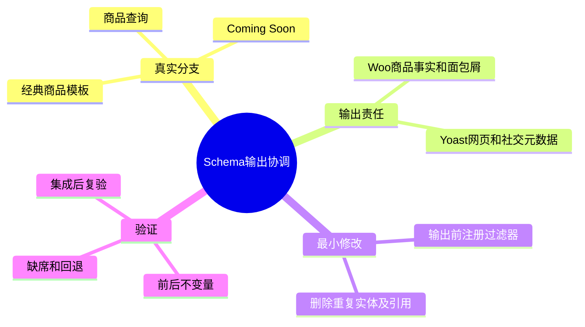
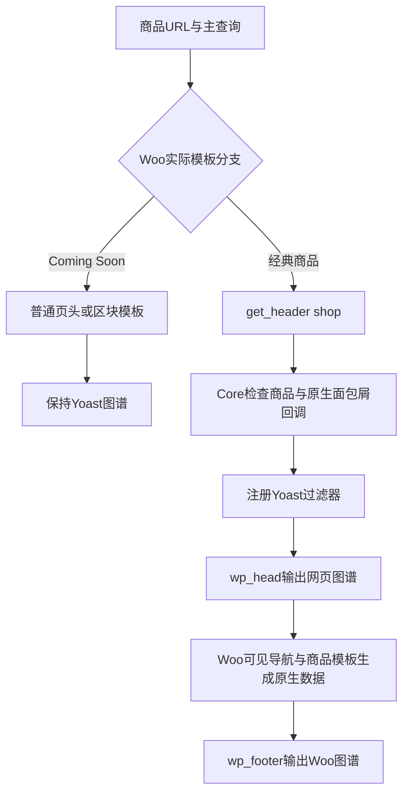

# Day65 WordPress实战：渲染生命周期与结构化数据去重

## 相关笔记

- 后续证据整合：[[Day66-集成基线与商品全链路回归]]；不自动提升本人的掌握度。

- 学习索引：[[WordPress实战笔记索引]]
- 对应项目笔记：[[../Day65-商品详情结构化数据与SEO边界]]
- 前置学习笔记：[[Day55-WooCommerce单品模板Hook与条件样式]]
- 同主题项目笔记：[[../Day16-商品SEO规则]]、[[../Day52-品牌数据与筛选基线]]
- 后续学习：D62/D64集成复验后，按实际新增知识回填，不预造笔记。

## 今日学习成果

- 能区分“查询识别为商品”与“实际返回商品模板”。
- 能追踪Woo与Yoast的Schema生成时机，并同步删除被移除节点的引用。
- 能在隔离Local比较修复前后的输出，区分代码正确、业务内容充分与可公开索引三个结论。

以上是本篇学习目标，不代表开发者已经完成费曼自测。

## 真实项目场景

登录态商品详情出现两条BreadcrumbList：Yoast走`Home → Products → 商品`，Woo走`Home → TEST D12 Products → 商品`。页面可见导航采用后者。匿名访问同一商品URL却返回Coming Soon，只剩Yoast图谱。若仅在`is_product()`成立时删除Yoast节点，匿名分支会丢失唯一面包屑。

学习范围是输出责任和执行顺序；不展开付费SEO扩展、Product自研、真实内容录入或分享按钮。当前使用两个TEST商品，不将缺失品牌、评价或Meta Description自动补成虚假事实。

## 先建立整体模型

一句话模型：先确认当前页面进入了哪条输出流水线，再协调各个生成器的责任。

把URL想成商场地址。查询告诉你“这是某家商品柜台”，但商场施工时，访客真正看到的是围挡；只有进入柜台的那条通道，才能撤掉重复的柜台指路牌。

| 比喻 | 真实机制 | 边界 |
|---|---|---|
| 柜台地址 | WordPress主查询与`is_product()` | 不保证商品正文会渲染 |
| 施工围挡 | Woo Coming Soon模板分支 | 可能继续输出Yoast head |
| 进入柜台 | 当前经典`single-product.php`调用`get_header('shop')` | 不是所有主题的通用约定 |
| 指路牌和索引 | BreadcrumbList实体及WebPage引用 | 删除实体也要检查引用 |

比喻不能代替源码：`get_header`是WordPress Action，不是授权检查；Coming Soon访问权限仍由Woo原生处理，本修复没有复制该权限逻辑。

## 思维导图



主干是“分支决定责任，责任决定最小修改”，不是按JSON字段数量决定删哪一份。

## 请求与生命周期调用链



Core由插件入口加载SEO模块，先注册`get_header`监听；只有实际进入目标页头时才注册两个Yoast Filter。输入是页头名称和已建立的查询/Hook状态，副作用只存在于该次PHP请求。没有数据库迁移或跨请求开关。

## 核心概念卡

| 概念 | 定义与DentAll例子 | 常见误区 | 验证 |
|---|---|---|---|
| Action | `get_header`通知即将加载页头 | 把返回值当模板替换 | 看Filter注册是否早于`wp_head` |
| Filter | `wpseo_schema_webpage`接收并返回数组 | 修改后忘记return | 检查其他WebPage字段仍在 |
| `@id`引用 | WebPage的breadcrumb指向图谱节点 | 只删节点不删引用 | 遍历图谱中的ID与引用 |
| Product/Offer | Woo按商品及合法变体事实生成 | 把前端展示参考价当交易价格 | 对比原生CRUD快照与JSON |
| Canonical | 指定规范页面身份 | 当成用户选择状态或访问保护 | 独立检查URL、正文、Canonical |

## 项目实战代码

真实来源：`app/public/wp-content/plugins/dentall-core/includes/seo-compatibility.php`。以下是当前函数节选，前面的条件还检查Yoast、商品身份及两条原生面包屑Action。

```php
add_filter( 'wpseo_schema_needs_breadcrumb', '__return_false' );
add_filter( 'wpseo_schema_webpage', 'dentall_core_remove_yoast_breadcrumb_reference' );
```

同文件中的真实引用清理函数：

```php
function dentall_core_remove_yoast_breadcrumb_reference( $data ) {
	unset( $data['breadcrumb'] );
	return $data;
}
```

第一条Filter只撤去Yoast的面包屑piece，不关闭整个图谱；第二条使剩余WebPage自洽。`unset`处理不存在的键是幂等操作。函数返回数组给Yoast继续序列化，不直接拼接HTML或JSON。若只去掉第一条，重复会恢复；若只去掉第二条，WebPage会引用不存在的Yoast面包屑ID。

`false === has_action(...)`也有意义：回调优先级可以是0，不能用简单的真假判断把它当作未注册。

### 运行证据

当前源码定向验证：PHP 8.2.29语法检查和10项独立stub分支测试通过，覆盖插件/条件缺席、普通页头、非商品、原生导航缺席、两种导航入口、优先级0和引用清理。真实HTTP前后12页及4页退出分支169/169断言通过，Chrome两商品四端无页面横向溢出，键盘切换保留3px focus；完整证据见[[../Day65-商品详情结构化数据与SEO边界]]。stub证明分支逻辑，实页证明当前Hook时序；均不能证明搜索平台一定展示富结果，也不替代D62/D64最终集成与屏幕阅读器验收。

## 职责边界

| 层级 | 本次责任 | 不越过的边界 |
|---|---|---|
| WordPress | 查询、Action、模板加载 | 不改核心 |
| WooCommerce | 商品/变体事实、可见面包屑、商品Schema、Coming Soon | 不绕过原生访问规则和CRUD |
| Storefront与DentAll子主题 | 当前经典页面结构、样式与导航位置 | 本次没有主题改动 |
| Yoast | 网页、组织、Canonical与社交元数据 | 没有代填正式SEO文案 |
| DentAll Core | 协调两个生成器的重复输出 | 不承担整个Product Schema引擎 |
| 数据库与媒体 | 现有TEST事实 | 不将占位组织图/账号当正式资料 |
| 浏览器 | 可见内容、交互和DOM证据 | 客户端选择不自动重写服务端JSON-LD |

## Hook、API或模板机制详解

| 入口 | 默认优先级/输入 | 返回与效果 |
|---|---|---|
| `get_header` | 10；页头名称 | Action不靠返回值；条件注册两个Filter |
| `wpseo_schema_needs_breadcrumb` | 10；是否需要piece | 返回false，Yoast跳过BreadcrumbList |
| `wpseo_schema_webpage` | 10；WebPage数组 | 返回清理breadcrumb后的原数组 |
| `woocommerce_breadcrumb` | 原生模板调用 | 同一导航流程供可见HTML与Woo Schema使用 |

当前代码依赖已验证的经典模板和原生生成器。若新主题不执行这些Hook，或未来集成删除Woo Schema生成回调，必须重新确认输出责任；不能用当前两商品通过外推所有主题。

## 安全、数据与站点影响

没有新增请求参数、后台动作或数据库写入，Capability/Nonce不是此次只读内存过滤的新增需求；最终JSON编码仍由Yoast负责。代码不新增SQL、Cron、远程请求、CSS/JS或缓存。唯一预期SEO变化是目标商品响应减少重复BreadcrumbList和引用。价格、库存、URL、Canonical、robots、支付、物流与订单不变。

仅在独立副本验证；上线时必须复验缓存后的HTML。回滚只撤回本次Core差异，不停用整个Core，也不复制测试数据库覆盖真实环境。

## 动手练习

1. **只读观察**：在DevTools的Elements或页面源码中搜索`application/ld+json`和`BreadcrumbList`，分别记下登录商品与匿名Coming Soon的生成器、数量和路径；不要只看插件“已启用”。
2. **Local最小改动**：仅在隔离副本比较本次SEO模块前后。预期Woo Product完全相同，Yoast少一个BreadcrumbList且WebPage少breadcrumb。回滚后重复应复现；不触碰源Local。
3. **故障推演**：如果去重后一个面包屑也没有，先检查实际模板、原生生成回调和JSON脚本，而不是立即新增第三份Schema。

## 常见误区与排错顺序

| 现象 | 首要检查顺序 | 最小证据 |
|---|---|---|
| 商品URL却没有Product | 实际正文 → Coming Soon分支 → Woo页尾输出 | 不带Cookie的HTML |
| 去重后存在悬空引用 | 图谱实体 → WebPage breadcrumb → Filter时机 | JSON解析后的ID |
| 浏览器价格变化而Schema不变 | 客户端选择 →完整变体参数URL → 服务端原生回退 | 两次独立HTTP响应 |
| 社交预览“不完整” | 可见内容与原生字段 → OG/Twitter输出 → 平台缓存 | 不擅造账号或描述 |
| 更新后重复恢复 | 主题/插件版本 → 实际Hook → 缓存 | 禁用缓存副本前后输出 |

## 掌握标准

- [ ] 两分钟解释为何`is_product()`不足以作为本次删除条件。
- [ ] 找到真实模板、Core入口、两个Filter和最终JSON输出。
- [ ] 区分代码修复、正式内容、可索引与富结果资格。
- [ ] 在隔离Local复演正常/Coming Soon/Yoast退出路径并回滚。
- [ ] 更换主题或Schema扩展前说明必须重新验证的边界。

当前掌握度为初识；自动测试通过不替代本人学习验收。

## 费曼测试题

1. 为什么同一个商品地址可能不返回商品详情？请用比喻、术语和本次证据解释。
2. `is_product()`、`get_header('shop')`分别证明什么，又不能证明什么？
3. 为什么必须同时修改BreadcrumbList和WebPage，删除全部Yoast图谱会损失什么？
4. 如何证明售价、缺货变体和Canonical没被本次修复改变？
5. 把这段代码搬到区块主题或另一平台前，最少要重新核对哪三项？

### 我的费曼答案与纠正

尚未作答，不由AI代填。每题按0分（无法解释）、1分（只会定义）、2分（因果与真实证据完整）记录；当前未评分，满分10分。

## 间隔复习记录

| 节点 | 计划日期 | 完成 | 问题与修正 |
|---|---|---|---|
| D+1 | 2026-09-08 | [ ] | 待实际自测 |
| D+3 | 2026-09-10 | [ ] | 待实际自测 |
| D+7 | 2026-09-14 | [ ] | 待实际自测 |
| D+14 | 2026-09-21 | [ ] | 待实际自测 |

## 收尾总结

本篇建立的是查询与真实渲染分支的区分，以及实体/引用同步修改方法。容易混淆的是“语法可解析”和“内容合规、搜索平台会展示”；下次先收集真实HTML、生成器版本与当前模板路径。D62/D64集成后的新增结论要用新证据回填。

## 后续如何向AI高效提问

可使用：`当前WP/Woo/主题/Yoast版本 + 实际访问身份/页面正文 + JSON-LD最小片段 + 预期唯一输出责任 + 已验证Hook + 不改数据/索引/购买逻辑边界`。要求先区分事实和推断，再给最小验证；提交证据前移除Cookie、密码、私钥和客户资料。

## 变种应用到其他项目

| 场景 | 保持的原则 | 必须重验 |
|---|---|---|
| 其他经典主题 | 基于实际输出分支、同步实体与引用 | 页头名称、可见导航Hook、Schema生成器 |
| WordPress区块主题 | 先核实谁生成当前响应 | 区块模板与head/footer时序，不能直接复制本门槛 |
| SEO扩展替换 | 一个明确的数据责任来源 | 扩展是否已接管Product/Breadcrumb、停用回退 |
| Shopify或其他平台 | 真实内容、结构化数据与页面身份一致 | 模板/应用扩展机制待验证，不推测一一对应 |

变种练习：只选一个场景，先列出业务问题、三个不变量、失效的WordPress专有假设和最小证据，再决定是否写代码。

## 可复用核心思想

### 跨平台不变量

控制输出应基于真实生命周期，而非仅依据URL或对象类型。任何图谱变更都要同时核查实体与引用；前后对比时明确哪些输出应变、哪些必须不变。

### WordPress/WooCommerce当前实现

当前经典商品在`get_header('shop')`后进入head输出，Core在该Action中注册Yoast Filter；Woo继续从原生商品和面包屑生成事实。Coming Soon仍走原模板，不复制其私有权限判定。

### Shopify或其他平台的对应机制

“响应分支—数据来源—输出责任—验证与回滚”可以迁移；WordPress函数、主题名称和Yoast Filter不能迁移为行业通则。Shopify具体映射待验证，不扩大本项目实施范围。
