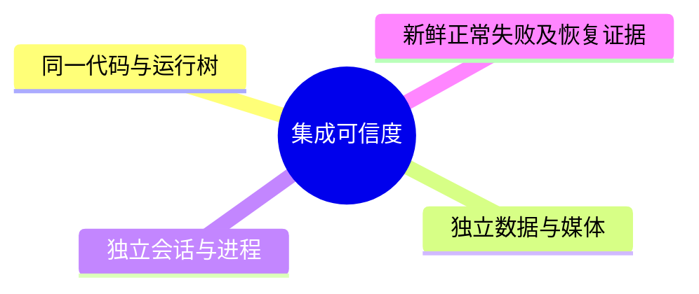

# Day66 WordPress实战：集成基线与商品全链路回归

## 相关笔记

- 学习索引：[[WordPress实战笔记索引]]；对应项目笔记：[[../Day66-商品浏览闭环集成回归]]。
- 前置学习：[[Day54-WooCommerce商品发现链路回归与证据复用]]、[[Day61-变体生命周期与展示语义]]。
- 同主题知识：[[Day63-WooCommerce附加信息与公开文件边界]]、[[Day65-渲染生命周期与结构化数据去重]]。
- 后续学习：[[Day68-Cart-Block响应式布局与状态证据]]已记录D67之上的候选响应式验证；这不关闭本篇三项P2，也不提前视为D67/D68/M5完成。

> [!important] 阶段边界
> 本篇记录已核对的集成、源码及D66动态回归证据。RSK-035旧展示、RSK-037平板局部遮挡与RSK-038长参数裁切仍开放；笔记生成不代表M5通过、用户接受延期或非Local可上线。索引与直接关联笔记已显式互链，用户掌握度仍待本人自测。

## 今日学习成果

- [ ] 能区分“提交已合成”“远端可恢复”“数据已隔离”“集成版已验收”四种证据。
- [ ] 能沿真实条件加载与Woo事件，解释按钮语义为何不能代替交易校验。
- [ ] 能判断旧报告哪些部分可复用、哪些必须在当前基线上重跑，并说明恢复边界。

## 真实项目场景

**今天的问题：** D60、D61、D63分别形成过交付，但单日完成不等于同一运行树已通过整链路。D66把D60 `c99126d`、D61 `6b51620`、D63 `0e5b428`的历史与运行代码汇入`278d20d818f07edcd8c2cd693314f82038db12dc`，再检查列表到详情、变体选择到加购，以及资源、SEO和异常状态能否共同成立。

- 掌握：Git集成、数据库/媒体/会话隔离、历史证据复用、RSK-035分层判定；不展开新错误状态系统、CR-005实施、订单支付或部署。
- 真实入口：下文`setup.php`、`product-variation.js`；商品发现、Simple/Variable详情与隔离购物车。
- 源码核查基于WooCommerce 11.0.0、DentAll 0.35.0；D61报告环境为WordPress 7.0.4、PHP 8.2.29、Storefront 4.6.2。不能将历史版本表自动当作本次进程证明。

## 先建立整体模型

**一句话模型：** 可靠回归必须同时固定代码、运行数据和验证方法；只合并Git，不能证明同一套商品与会话已经在新代码上正确运行。

**记忆宫殿：** 把商城看作餐厅：Git保存厨房操作手册，数据库是订单与库存台账，媒体是菜品照片，浏览器会话是客人的桌号。合并手册不会自动换掉台账，也不会清空客人的点菜单。

| 记忆对象 | 真实技术对象 | 不能混淆的边界 |
|---|---|---|
| 操作手册 | Git提交、受控主题/插件 | worktree隔离的是文件检出，不自动创建数据库 |
| 台账与照片 | Woo商品数据、uploads文件及附件记录 | 数据库回滚不自动删除生成的图片文件 |
| 桌号与点菜单 | Cookie、Woo会话与购物车 | 新浏览器上下文不等于服务端数据已恢复 |
| 菜单上的售罄牌 | DOM、CSS类与ARIA | 显示状态不是最终价格、库存或交易许可 |

## 思维导图



主干是“固定基线→隔离运行→验证结果与恢复”，不能从第一步直接跳到验收完成。

## 请求与生命周期调用链

商品详情请求→`wp_enqueue_scripts`→Variable条件加载→Woo匹配与展示事件→DentAll映射ARIA；用户提交后另走Woo服务端复核，不把前端事件当放行凭证。

- 触发与加载：商品详情进入`dentall_enqueue_product_detail_assets()`；仅Variable额外加载语义脚本。
- 顺序与输入：先按依赖加载Woo脚本，再由原生属性选择逻辑处理预载数据或`get_variation`响应。
- 输出与副作用：Woo更新图片、价格、库存、隐藏ID和按钮类；DentAll只映射ARIA。提交后是否写入购物车由服务端判断。
- 可观察证据：资源清单、属性值、`variation_id`、按钮类/ARIA、网络响应、购物车商品与金额应分别记录。

## 核心概念卡

| 概念 | 准确定义与DentAll例子 | 常见误区 | 如何验证 |
|---|---|---|---|
| 集成基线 | `278d20d`的父提交为`6b51620`与`0e5b428` | 合并成功等于动态验收成功 | 提交图、运行差异及新报告分别核对 |
| 历史证据复用 | 旧报告提供已测前提与预期 | 把旧通过数写成本日结果 | 核对代码、版本、数据、角色、配置与方法 |
| Oracle | 判断结果正确与否的规则 | 只数卡片，不核对商品或排序 | 同时断言ID、顺序、目标URL与环境条件 |
| 交易事实 | 服务端对当前请求的复核结果 | 按钮亮起就能买到 | 检查POST响应及购物车最终内容 |

## 项目实战代码

### 涉及文件

- [setup.php](D:/LocalWP/dentall/app/public/wp-content/themes/dentall/inc/setup.php:96)：详情样式与Variable脚本的条件加载；链接指向长期主检出目录。
- [product-variation.js](D:/LocalWP/dentall/app/public/wp-content/themes/dentall/assets/js/product-variation.js:5)：Woo禁用类到ARIA的薄适配，不发请求、不计算价格。

### 从入口开始追踪

`wp_enqueue_scripts`以优先级50调用详情资源函数。它先判断`is_product()`，再取得当前商品；因此不是所有带商品卡的页面都加载变体脚本。删除这个脚本不会移除Woo原生变体机制，但会失去DentAll增加的ARIA映射；这仍需浏览器证据验证，不能仅凭源码宣称可访问性全部合格。

### 关键代码片段

以下为`setup.php`真实截取；前文已取得当前`$product`与`$theme`：

```php
if ( $product instanceof WC_Product && $product->is_type( 'variable' ) ) {
	wp_enqueue_script(
		'dentall-product-variation',
		get_stylesheet_directory_uri() . '/assets/js/product-variation.js',
		array( 'wc-add-to-cart-variation' ),
		$theme->get( 'Version' ),
		true
	);
}
```

以下为`product-variation.js`真实最小片段：

```js
const syncButtonState = ( $form ) => {
	const $button = $form.find( '.single_add_to_cart_button' );
	$button.attr( 'aria-disabled', $button.hasClass( 'disabled' ) ? 'true' : 'false' );
};
```

| 代码点 | 真实作用 | 为什么保留这一边界 |
|---|---|---|
| `wc-add-to-cart-variation`依赖 | WordPress先加载Woo已注册的原生脚本 | 不复制原生匹配逻辑，不另引入框架 |
| `hasClass('disabled')` | 把当前原生类映射给辅助技术 | 不制造购买事实，也不能修复原生类本身残留 |
| `hide_variation` / `show_variation`监听 | 原生展示事件后同步当前表单 | 初始先设`aria-disabled=true`；不自行计算价格或拦截POST |

### 运行证据

- 已执行`git show --no-patch --format=fuller 278d20d`确认实际合并父提交；`git diff --quiet 278d20d 6b51620 -- app/public`退出码0，证明合成运行树与D61相同，不证明动态通过。
- 集成阶段PHP/JS语法及冲突检查记录在[[../Day66-商品浏览闭环集成回归]]；静态检查不能证明页面、金额或恢复正确。
- D61历史失败证据：先选可购变体，再切换另一组合并令查询返回503，可残留旧可见状态；键盘提交被服务端要求重新选择，购物车为空。它证明该次请求被拒绝，不证明所有异常均安全或体验已修复。
- **D66动态证据**：集成`278d20d`在独立环回副本执行；Variable inline363/363、AJAX121/121及独立交易12/12、Simple16/16、Coming Soon10/10。内容自动80/80，但长参数视觉QA发现RSK-038；发现回归原始458/462与定向15/15分开保留，4项金额格式Oracle已纠偏；品牌原始12/14按既定无Canonical合同复核，不虚写成重跑。RSK-035复现≠修复，768px导航遮挡另记RSK-037。安全新进程17/17＋5/5＋11/11、完整首快照恢复及停机通过；完整目录与边界见[[../Day66-商品浏览闭环集成回归]]，不把报告汇总当作M5通过。

## 职责边界

| 层级 | 本主题负责什么 | 不应混入什么 |
|---|---|---|
| WordPress Core | 请求生命周期与资源依赖 | 不修改核心来迁就测试 |
| WooCommerce | 商品/变体匹配与服务端购物车校验 | 不让前端标记代替交易规则 |
| Storefront父主题 | 原生布局与模板支撑 | 不直接改第三方文件 |
| DentAll子主题 | 条件资源、布局、展示语义 | 不自行建立新变体交易系统 |
| dentall-core | 既有站点级规则与SEO职责 | 不放入纯展示脚本 |
| 数据库、媒体、浏览器 | 各自保存业务记录、文件、会话与界面状态 | 不把TEST当正式内容，不把其中一层恢复当全部恢复 |

## Hook、API或模板机制详解

| 项目 | 本次准确机制 |
|---|---|
| 类型与注册 | `setup.php`注册`wp_enqueue_scripts` Action，回调为`dentall_enqueue_product_detail_assets`，优先级50 |
| 输入与返回 | 回调无Hook参数；通过查询上下文读取当前商品；Action不靠返回值改页面 |
| 副作用与范围 | 商品详情加载CSS，Variable详情额外enqueue脚本；不直接写商品数据 |
| 前端事件 | 原生`hide_variation` / `show_variation`触发当前表单ARIA同步；`.dentall`为监听命名空间 |
| 回滚思路 | 在授权Local验证后恢复受控版本并复核资源；Git回退不自动恢复会话、数据库或媒体 |

## 安全、数据与站点影响

| 检查面 | 本次结论与验证边界 |
|---|---|
| 输入、Capability、Nonce、转义 | 两段摘录无新增业务输入、后台写入口或HTML文本输出；不能推导整条加购链因此无需验证。Nonce不能代替权限检查 |
| 数据库与媒体 | 集成本身不写商品；动态TEST可能改变隔离数据、会话或文件，必须独立快照、核对与恢复 |
| URL、SEO与缓存 | 无新增运行SEO逻辑；仍需验证Canonical、robots、Schema及跳转。Local禁止索引会影响输出预期，不能套用公开环境Oracle |
| 支付、物流与订单 | 不做真实支付、结账订单或物流配置；加购通过不代表后续交易链通过 |
| 部署与回滚 | 远端代码可恢复不等于已部署；删除工作树前还需归档Git忽略的必要证据，保护其中私密信息 |

## 动手练习

**练习一·只读观察：** 运行上述两条Git命令，解释为什么运行树一致却仍需要D66。实际证据是合并父提交与差异退出码；预期不能包括“商品测试全部通过”。

**练习二·Local最小改动：** 仅在已批准的隔离窗口，通过DevTools临时观察/改变按钮ARIA，比较其与`disabled`类、隐藏ID的关系；本篇未把此练习记作已执行。不得改共享数据、核心或真实支付；刷新可清除临时DOM修改，若发生加购还要单独清理隔离会话。

**练习三·故障推演：** 症状是变体查询失败后仍显示旧价格。先看请求状态与隐藏ID，再看按钮类/ARIA，最后核对提交和购物车：必须区分503、超时、断网与快速切换产生的主动`abort`，不能统称“503”。

## 常见误区与排错顺序

| 现象或误区 | 推荐检查顺序与最小验证 |
|---|---|
| 旧报告全绿，可以直接复用 | 比较相关代码/版本→数据与配置→测试Oracle；页面数和通过数不能替代相同前提 |
| 点击后等待networkidle就证明跳转成功 | 等目标URL及目标DOM→核对商品ID；旧页也可能已空闲 |
| 默认预载无错误，RSK-035已修复 | 查是否真正进入AJAX→先可购再503→分开记录界面与POST；绕开触发路径不是修复 |
| 换工作树或浏览器就完成隔离 | 查实际数据库、uploads、服务端会话、端口与进程→核对恢复快照；不能只看目录名称 |
| Tab中心可点击，因此没有遮挡 | 查看实视口和文字/焦点边缘→比较矩形。D66的768px原生相邻导航露出45px，Tab从32px开始，13px重叠是真实P2；不是Sticky，也不是截图残影 |
| 页面没有横向滚动，因此长值可读 | 先看内容本身→测表格/面板/单元格边界。D66的234字符值让表格四宽均2328.53125px，外层裁掉超出部分；DOM全文存在与页面overflow为0都不能证明用户能读完 |

### RSK-035与上游核查的适用范围

截至2026-09-08，对比本地Woo 11.0.0与官方11.0.1、11.1.0及当时trunk的经典`onFindVariation`：该段去空白后相同，存在成功和完成处理，未见错误回调或超时选项；只能说未找到适用修复，不能泛化为所有Woo组件都有同一问题。[官方11.1.0源码](https://github.com/woocommerce/woocommerce/blob/11.1.0/plugins/woocommerce/client/legacy/js/frontend/add-to-cart-variation.js)、[11.0.1源码](https://raw.githubusercontent.com/woocommerce/woocommerce/11.0.1/plugins/woocommerce/client/legacy/js/frontend/add-to-cart-variation.js)、[trunk源码](https://raw.githubusercontent.com/woocommerce/woocommerce/refs/heads/trunk/plugins/woocommerce/client/legacy/js/frontend/add-to-cart-variation.js)；trunk会变化，升级时须重新核对。

原生在选择变化时清空隐藏变体ID；失败可留下旧展示，[Woo 11.0.0表单处理](https://github.com/woocommerce/woocommerce/blob/11.0.0/plugins/woocommerce/includes/class-wc-form-handler.php)会拒绝缺少有效变体选择的该类提交。当前D61适配仅映射ARIA，不能修补这条失败路径。默认30个变体阈值以内通常使用预载；提高阈值会改变数据传输与浏览器处理成本，并非整体修复。[Woo官方Variable说明](https://woocommerce.com/document/variable-product/)。

RSK-035为既有P2，开发者负责D66复审、最晚非Local部署前处理；维持原生、等待上游、增加最小主题错误适配是不同候选。新增提示/恢复行为超出D61薄映射范围，须说明验收与工时并重新确认；不能借学习笔记自动批准。

## 掌握标准

- [ ] 两分钟说明代码、数据、媒体、会话为何需要分别核验；指出真实入口与Hook。
- [ ] 区分核心、父/子主题与插件职责；解释至少一个正常路径和失败路径。
- [ ] 说清Local验证及恢复方法，判断数据、URL、SEO、缓存、支付、物流与部署影响。

当前掌握度：初识，未替学习者完成自测。

## 费曼测试题（6道）

1. 用餐厅比喻解释“已合并”为什么不等于“已验收”，并指出比喻的局限。
2. 给出本次合并父提交和运行树证据；哪一项仍需浏览器与服务端结果？
3. 从商品详情请求到ARIA变化，谁加载谁？为什么Simple和列表不应额外加载此脚本？
4. 为什么旧价格、空隐藏ID、按钮可聚焦和服务端拒绝可以同时出现？
5. 一份历史报告复用前要核对哪些条件？只计卡片数或等待networkidle分别漏掉什么？
6. 迁移到另一商城平台，哪些原则保留，哪些Hook、会话与恢复机制必须重新查证？

### 我的费曼答案与纠正

自测尚未进行。逐题记录“通过/含糊/答错”，将纠正链接回本篇相应章节；不能以AI代答替代掌握证据。

### 自测评分

每题0分：无法解释；1分：仅会定义；2分：能准确说明因果、边界与DentAll证据。总分未测/12，存在0分题不提升掌握度。

## 间隔复习记录

| 节点 | 计划日期 | 完成 | 检查重点与修正位置 |
|---|---|---|---|
| D+1 | 2026-09-09 | [ ] | 四层隔离；整体模型 |
| D+3 | 2026-09-11 | [ ] | 条件加载；实战代码 |
| D+7 | 2026-09-15 | [ ] | UI与服务端事实；RSK-035 |
| D+14 | 2026-09-22 | [ ] | 证据复用与平台迁移；核心思想 |

## 收尾总结

今天确认了集成来源、隔离回归与证据分层：原生金额格式和禁索引保护可使错误Oracle报红，而中心hit-test、DOM全文与页面overflow全绿也可能漏掉遮挡/裁切。RSK-035/037/038须先确认最小处置；下一篇D67只能在当前门槛满足后承接，不预填交付结论。

## 后续如何向AI高效提问

公式：`真实版本与基线 + 目标 + 最小代码 + 复现和结果 + 已排除项 + 风险边界 + 输出格式`。先准备页面、角色、请求、报告位置与恢复范围，删除Cookie、密码、私密配置及客户数据。

**代码理解提示词：**“基于278d20d的setup.php与product-variation.js，解释条件加载、依赖、事件与服务端边界。先画调用链，再指出删除一行会影响什么；区分源码事实与待运行验证，不写新实现。”

**排错提示词：**“隔离Local中先选可购变体，再切换组合，网络结果为【真实状态】，隐藏ID为【值】，按钮类/ARIA为【值】，POST和购物车为【结果】。请给最小只读检查、修复候选及恢复要求；不改核心、不写共享数据库、不将主动abort视为503。”

AI解释不是验证证据；请求具体版本的官方源码依据，实际结果由受控运行与报告证明。

## 变种应用到其他项目

| 场景 | 不变原则 | 必须重查的实现与最小验证 |
|---|---|---|
| 另一个Storefront/经典主题商城 | 固定基线，展示与交易分层 | 主题Hook、覆盖、插件版本；同一正常/失败请求链 |
| WordPress区块主题 | 不以外观推断交易事实 | 区块机制与经典脚本不等同；确认实际加载入口后再设计用例 |
| 独立插件 | 职责与生命周期一致 | 是否确需跨主题存在、启停与依赖；最小页面资源及恢复检查 |
| Shopify或其他平台 | 代码、业务数据、会话与证据分开治理 | 官方主题/扩展与测试环境机制待验证；不照搬Woo事件或表结构 |

变种练习：选一行，先解释原问题是否存在、三条可迁移原则、必须替换的WordPress机制、所需官方资料和最小实验；没有证据时不要声称机制一一对应。

## 可复用核心思想

### 跨平台不变量

集成、恢复、验收是不同命题，需要不同证据；历史报告只有在相关前提成立时才可支持当前判断。前端展示、请求结果和服务端最终状态必须分层，才能既不漏掉体验缺陷，也不夸大交易后果。

### WordPress/WooCommerce当前实现

本项目以受控子主题/插件代码、独立数据库/媒体/会话和新运行报告固定上下文；通过WordPress条件enqueue与Woo原生事件进行薄展示适配。Woo 11.0.0的经典变体失败边界仍需明确处置，不能用默认预载或ARIA映射替代修复与验收。

### Shopify或其他平台的对应机制

迁移的是基线、职责、证据与恢复原则，不是Woo的Hook、变体阈值或会话实现。具体主题发布、变体查询和测试店恢复能力待官方核查与实验；知识对照不扩大DentAll第一版实施范围。
