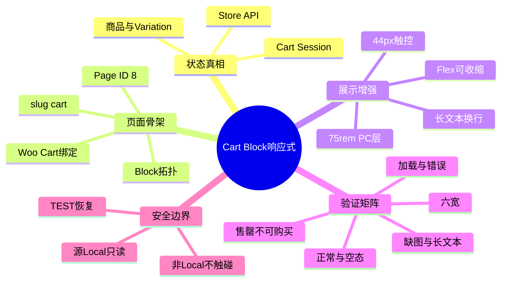
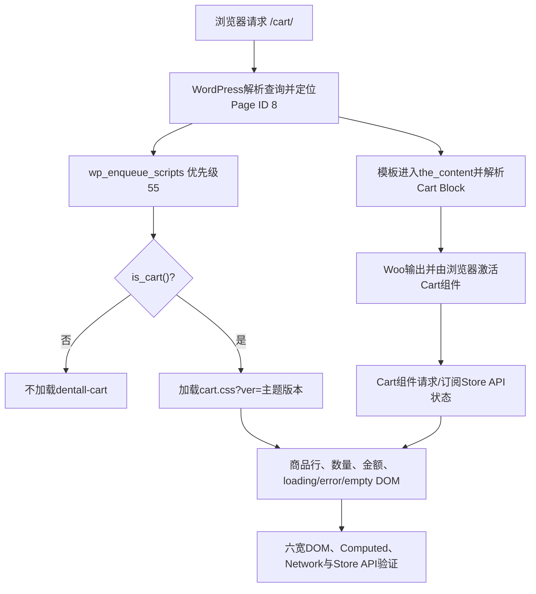

# Day68 WordPress实战：Cart Block响应式布局与状态证据

## 相关笔记

- 学习索引：[[WordPress实战笔记索引]]。
- 对应项目笔记：[[../Day68-手机与平板响应式购物车候选验证]]。
- 前置学习：[[Day61-变体生命周期与展示语义]]。
- 集成边界：[[Day66-集成基线与商品全链路回归]]。
- 后续学习：D71已形成[[Day71-WooCommerce运费税费与金额真相]]；D69 Header/Mini Cart、D70优惠码与D72集成仍以各自确定提交和实际证据为准。

> [!important] 证据边界
> 本篇来自D68实际候选代码和独立Local回放。198/198表示批准的候选矩阵没有断言失败，不等于D66三项P2已关闭，也不等于D67、D68、M5、Staging或Production通过。学习笔记生成不代表用户已经掌握。

## 今日学习成果

- [ ] 我能用自己的话解释Page中的Cart Block、浏览器中的动态DOM和Store API购物车状态为何是三层对象。
- [ ] 我能沿`wp_enqueue_scripts`→`is_cart()`→`cart.css`追踪条件加载，并说明Mobile First基础层与75rem增强层的分工。
- [ ] 我能在Local用DevTools定位Flex收缩、连续字符串和触控尺寸问题，并用六宽及正常/异常状态验证和回滚。

## 真实项目场景

### 今天解决了什么问题

D67已给出PC购物车候选，但窄屏不是把PC卡片等比例缩小：商品名、Variation属性、金额、数量按钮和错误提示会争夺同一行空间。D68需要在不改WooCommerce交易逻辑、不复制手机DOM、不自建金额状态的前提下，让原生Cart Block从390px渐进到1440px，并证明正常、加载、错误、空、缺图、长文本和不可购买状态都可用。

### 学习范围

- 本篇要掌握：Cart Block的数据与渲染分层、Flex最小尺寸、Mobile First增强、条件加载、状态矩阵、可逆测试和证据边界。
- 本篇明确不展开：Classic Cart、Checkout/订单、Header/Mini Cart、优惠码业务规则、配送/税费、自定义Store API或React组件开发。
- 项目真实入口：`app/public/wp-content/themes/dentall/inc/setup.php`、`app/public/wp-content/themes/dentall/assets/css/cart.css`、Page ID 8的WooCommerce Cart Block、`/wp-json/wc/store/v1/cart`。
- 验证版本与环境：WordPress 7.0.4、WooCommerce 11.0.0、Storefront 4.6.2、PHP 8.2.29；仅全新独立Local副本。

## 先建立整体模型

### 一句话模型

WordPress保存并解析购物车页面骨架，WooCommerce以Store API状态驱动Cart Block，DentAll子主题只在Cart请求为现有语义DOM增加可收缩、可换行、可触控的响应式外观。

### 记忆宫殿：机场行李转盘

把购物车想成机场行李系统：Page ID 8是写着“行李提取处”的建筑平面图；Store API是后台行李数据库和传送控制；Cart Block是根据实时行李状态更新的电子转盘；DentAll CSS是通道宽度、指示牌和按钮尺寸。CSS可以让通道更好走，却不能凭空增加行李、改旅客归属或重算重量。

### 比喻对应回真实机制

| 记忆对象 | 真实技术对象 | 不能混淆的边界 |
|---|---|---|
| 建筑平面图 | Page ID 8的Block注释、slug和页面绑定 | 保存内容不是当前购物车商品数据 |
| 后台行李系统 | WooCommerce Cart Session与Store API | 不由主题CSS计算数量、库存或金额 |
| 电子转盘 | Cart Block服务端输出/浏览器组件与动态DOM | DOM会随状态改变，不能只看一张静态HTML |
| 通道与指示牌 | DentAll `cart.css` | 只负责布局、文字换行、触控和视觉层级 |
| 安检封闭测试区 | 独立Local、外部请求/支付/Checkout护栏、恢复脚本 | 不能把TEST状态带回源Local或Production |

比喻失效处：WooCommerce真实渲染包含PHP、Block注册、前端JavaScript、Store API与session等生命周期，并非一条机械传送带；具体顺序要以源码、Network和实际DOM为准。

## 思维导图



最重要的主干是：Store API提供状态真相，Cart Block表达状态，子主题CSS只增强现有表达，测试必须同时核对这三层。

## 请求与生命周期调用链



- 触发条件：前台WooCommerce购物车页，`is_cart()`为真。
- 加载入口：`dentall_enqueue_cart_assets()`，`wp_enqueue_scripts`优先级55。
- 执行顺序：WordPress解析查询→`wp_enqueue_scripts`条件入队CSS→模板正文解析Cart Block→浏览器激活组件并读取Store API→现有DOM匹配CSS。
- 输入数据：Page区块内容、当前Cart Session、商品/Variation、Woo设置与视口宽度。
- 输出或副作用：一个条件加载的CSS资源与浏览器视觉变化；D68运行代码本身没有数据库写入。
- 可观察证据：HTML/Block拓扑、Network中的资源和Store API、Elements/Computed、控件矩形、焦点/命中、截图与清理终态。

## 核心概念卡

| 概念 | 准确定义 | DentAll真实例子 | 常见误区 | 如何验证 |
|---|---|---|---|---|
| Store API状态 | WooCommerce Blocks面向前端的购物车数据合同 | Variation #51数量1/2对应总额3999/7998 USD | 从可见文字反推数据库真相 | Network或页面内fetch核对ID、数量、金额、币种 |
| Flex最小尺寸 | Flex item默认`min-width:auto`可能拒绝缩小到内容以下 | Cart主区、商品wrap、metadata加`min-width:0` | 有`flex-wrap`就一定不溢出 | 比较元素client/scroll width和页面根overflow |
| `overflow-wrap:anywhere` | 连续字符串必要时可在任意位置断行 | 长产品名、属性值和96字符错误码 | 对整个页面全局强制断词 | 只对Cart内容叶子与通用错误span作用域验证 |
| Mobile First | 基础规则覆盖最窄及全部宽度，再按最小宽度增强 | 基础层可用；75rem起加PC摘要卡片 | 写四套页面或只做媒体查询修补 | 看DOM是否单一、CSS是否从基础层向上增强 |
| 断点边界 | 同一规则切换点的前后像素均须验证 | 1199与1200同时回放 | 只测1024和1440即可 | DevTools切换准确宽度，核对匹配媒体规则 |
| 可逆TEST | 写入前绑定精确目标和前态，结束后验证恢复 | Page 8英文候选后回到中文hash | “Local”天然安全，可以随便改 | DB/URL/ABSPATH/hash守卫、快照、finally和端口终态 |

## 项目实战代码

### 涉及文件

- `app/public/wp-content/themes/dentall/inc/setup.php`：只在Cart页加载样式。
- `app/public/wp-content/themes/dentall/assets/css/cart.css`：Mobile First基础层与75rem PC增强层。
- `app/public/wp-content/themes/dentall/style.css`：候选版本0.37.0，作为资源版本参数。
- Page ID 8：原生Cart Block、Cross-sell与空态静态标题；不是运行代码文件。

### 从入口开始追踪

1. WordPress执行`wp_enqueue_scripts`，调用`dentall_enqueue_cart_assets()`。
2. `is_cart()`为假立即返回，避免Shop、Product等页面加载Cart样式。
3. 主题版本通过`wp_get_theme()`取得，`wp_enqueue_style()`把`cart.css`依赖在`dentall-site-shell`之后。
4. WooCommerce负责Cart Block DOM和Store API状态；CSS命中已存在的语义类。
5. 删除条件加载函数会让D68样式消失；删除基础层`min-width:0`/换行规则会在长内容和窄屏重新暴露裁切风险，但不会改变服务端金额。

### 关键代码片段

源自`inc/setup.php`，只展示真实最小入口：

```php
if ( ! function_exists( 'is_cart' ) || ! is_cart() ) {
	return;
}

wp_enqueue_style(
	'dentall-cart',
	get_stylesheet_directory_uri() . '/assets/css/cart.css',
	array( 'dentall-site-shell' ),
	$theme->get( 'Version' )
);
```

源自`cart.css`，展示Flex收缩与错误断行：

```css
.wp-block-woocommerce-cart :where(
	.wc-block-cart__main,
	.wc-block-cart__sidebar,
	.wc-block-cart-item__product,
	.wc-block-cart-item__wrap,
	.wc-block-components-product-metadata
) {
	min-width: 0;
}

.wp-block-woocommerce-cart .wc-block-components-validation-error > p > span {
	min-inline-size: 0;
	overflow-wrap: anywhere;
}
```

| 代码 | 表面动作 | WordPress/Woo中的真实作用 | 为什么这样写 |
|---|---|---|---|
| `is_cart()` | 判断页面 | 把主题资源限制到Woo Cart请求 | 减少作用域和非Cart回归面 |
| 主题`Version` | 生成查询参数 | 资源URL随候选版本变化 | 部署时可使旧CSS缓存失效，但不是缓存系统 |
| `:where()` | 组合选择器 | 保持选择器权重低 | 便于Woo/主题正常层叠和后续微调 |
| `min-width:0` | 允许收缩 | 解除Flex item的内容最小宽度限制 | 让长内容能进入换行算法 |
| `overflow-wrap:anywhere` | 必要时断词 | 防止连续token撑宽Cart叶子 | 不修改原始文本和Store API值 |

### 运行证据

- 页面与命令：六宽浏览器回放、Store API读取、键盘/命中测试、Page 8哈希与Block拓扑、PHP/Node/PowerShell静态检查。
- 正常结果：最终198/198；Simple和Variation的数量、金额与Remove通过，Checkout按钮48px及焦点/命中通过；未点击或访问Checkout。
- 失败或边界结果：loading、update error、售罄/不可购买、96字符错误、空态、长标题/属性、缺图通过；`Add coupons`仅20px高留D70/P2。
- 证据能证明：当前隔离版本和TEST代表输入下，批准的D68候选矩阵成立，恢复与停机成立。
- 证据不能证明：实体设备/读屏器、正式数据规模、公开Canonical、CDN/CWV、支付订单或非Local可上线。

198/198动态报告先生成；其后的测试工具身份、锁、失败恢复与清理加固只通过静态安全复审及PHP/Node/PowerShell语法检查，没有重新运行浏览器矩阵。两类证据必须分开描述。

## 用Chrome DevTools定位与安全微调

1. 在Elements选中`.wp-block-woocommerce-cart`，确认目标节点属于Cart Block而不是父主题通用表格。
2. 在Computed查看`display`、`min-width`、`inline-size`、`overflow-wrap`、实际矩形和规则来源；勾选/取消声明验证因果。
3. 在Layout或Console比较`document.documentElement.scrollWidth`与`clientWidth`；页面根无溢出后仍继续检查文字叶子的`scrollWidth`和遮挡。
4. 在Network确认`cart.css`只加载一次且版本为0.37.0，Store API返回的item ID、quantity和totals不因CSS变化而改变。
5. 判断改动层级：公共间距/颜色改Design Token；所有Cart宽度共同问题改基础层；只属于PC视觉层级的改75rem块；不要用更高权重或`!important`掩盖来源。
6. 回到子主题源码保存，重跑390/768/1024/1199/1200/1440及正常、空、加载、错误、缺图、长文本、售罄/不可购买状态。

## 职责边界

| 层级 | 本主题中负责什么 | 不应该负责什么 |
|---|---|---|
| WordPress Core | Page、Block解析、主题加载与enqueue生命周期 | 不修改核心文件 |
| WooCommerce | Product/Variation、Cart Session、Store API、数量/库存/金额与Cart Block状态 | 不由CSS或直接表写入替代CRUD/API |
| Storefront父主题 | 页面外壳和父主题基础样式 | 不直接修改父主题文件 |
| DentAll子主题 | Cart条件资源和展示增强 | 不承载订单、库存、优惠码或自定义Cart真相 |
| `dentall-core` | 本轮无职责变化 | 不为纯展示规则新增模块 |
| Page与数据库 | 保存Block骨架及配置绑定 | 不把TEST/候选英文当正式内容 |
| 浏览器 | 呈现动态DOM、焦点、响应式和Store API客户端状态 | 不把可见文字当服务端唯一事实 |

## Hook、API或模板机制详解

| 项目 | 说明 |
|---|---|
| 机制类型 | Action＋Conditional Tag＋Enqueue；动态状态另由Woo Store API负责 |
| 名称或入口 | `wp_enqueue_scripts`、`is_cart()`、`wp_enqueue_style()`、`/wp-json/wc/store/v1/cart` |
| 注册位置 | 子主题`inc/setup.php`，优先级55 |
| 回调输入 | Action没有业务参数；回调读取当前查询上下文与主题版本 |
| 必须返回内容 | Action回调不返回过滤值；非Cart直接结束 |
| 副作用 | Cart页增加一个CSS请求；不写数据库 |
| 影响范围 | 前台Cart；CSS再以`.wp-block-woocommerce-cart`限定 |
| 移除或覆盖方式 | 从子主题源码调整Hook或CSS；不改Woo/Storefront核心。移除时须回归Cart全部状态与非Cart资源隔离 |

## 安全、数据与站点影响

| 检查面 | 本次结论 | 证据或待验证项 |
|---|---|---|
| 输入清洗与验证 | 运行代码不接收新输入 | TEST工具绑定DB、URL、环境、ABSPATH、ID和hash；不作为发布代码 |
| Capability | 不适用前台CSS | 没有新增后台动作 |
| Nonce | 不适用前台CSS | Cart安全继续由WooCommerce现有接口负责；nonce不能替代capability |
| 输出转义 | 无新增PHP输出 | Page英文只使用固定批准字符串并已回滚 |
| 数据库写入 | tracked运行代码无写入 | 隔离TEST购物车、term和Page写入均恢复；源Local只读 |
| URL与SEO | slug、绑定和SEO逻辑不变 | Local全站noindex；Production Canonical待验证 |
| 缓存 | 无自定义缓存 | 主题版本参数未来会刷新资源URL；CDN/真实页面缓存未验 |
| 支付、物流与订单 | 未进入 | Checkout被隔离护栏阻断，订单/退款不变 |
| 部署与回滚 | 未合并/推送/部署 | 代码回滚为撤销3文件候选增量；内容/TEST以整库基线恢复 |

## 动手练习

### 练习一：只读观察

- 目标：区分Page骨架、动态DOM与Store API数据。
- 操作：在隔离Local只读打开Page编辑内容、前台Elements和Network Store API，各记录一个证据。
- 预期：Page内容不列出当前商品；前台DOM有商品行；Store API返回item/quantity/totals。
- 实际证据：D68 Page拓扑不变、Variation #51与3999/7998金额合同已记录。

### 练习二：Local最小改动

- 改动：仅在DevTools临时取消某个Flex子项的`min-width:0`，观察连续长属性；不保存。
- 风险边界：仅独立Local；不修改核心、源Local、支付或Production数据。
- 验证：比较叶子和页面根scroll width，并在恢复声明后重新测390/768。
- 回滚：关闭DevTools临时修改；若进入源码实验，用Git仅撤销自己明确的局部候选并重新静态检查。

### 练习三：故障推演

- 假设症状：390px下金额没有重叠，但长错误码右侧不可读。
- 可能原因：Flex父子项拒绝收缩、真正撑宽的是内部span、断行规则作用域错误。
- 第一项检查：用Elements逐层比较error、p、span的Computed `min-width`及client/scroll width。
- 为什么先查它：页面根overflow为0或中心按钮可点都不能定位文字叶子裁切，逐层尺寸能先确认责任节点。

## 常见误区与排错顺序

| 现象或误区 | 可能原因 | 推荐检查顺序 | 最小验证方法 |
|---|---|---|---|
| 页面根无横向滚动，所以所有内容都可读 | 内层裁切、遮挡或overflow容器吸收了宽度 | 1. 页面根；2. 叶子scroll/client；3. 可见矩形与命中 | 构造连续长token并在六宽逐层测量 |
| 数量按钮看起来大就符合44px | 可见图标大，但真实button盒或命中区小 | 1. getBoundingClientRect；2. elementFromPoint；3. focus | 测宽高、中心命中与键盘焦点 |
| CSS显示$79.98就证明金额正确 | 文本格式、旧DOM或假Oracle都可能误导 | 1. Store API minor unit；2. DOM；3. 可见文本 | Variation数量1→2核对3999→7998 USD |
| 多加一个断点能修复窄屏 | 根因可能是Flex最小尺寸或重复DOM | 1. DOM语义；2. 基础收缩；3. 才看断点 | 先在基础层试`min-width:0`，再测1199/1200 |
| 截图中Cross-sell图片空白就是资源失败 | lazy load/滚动/截图时序 | 1. request status；2. img.complete；3. natural size | 滚入视口并等待自然尺寸大于0 |
| Local验证后可以直接改源站内容 | 环境身份或恢复失败会污染共享事实 | 1. DB/URL/path；2. exact hash；3. finally恢复 | 只在新副本写入，结束核对源快照与端口 |

## 掌握标准

- [ ] 不看笔记，能在2分钟内讲清Page、Block DOM、Store API和主题CSS的因果链。
- [ ] 能指出`inc/setup.php`、`cart.css`、Page ID 8和Store API四个真实入口。
- [ ] 能区分WordPress、WooCommerce、Storefront、子主题和浏览器职责。
- [ ] 能说明正常路径、长token错误路径及检查顺序。
- [ ] 能在独立Local完成六宽最小验证，并说明数据库与代码回滚。
- [ ] 能判断本主题对数据、URL/SEO、缓存、支付、物流与部署的实际影响。

当前掌握度：初识，待费曼自测。

## 费曼测试题（7道）

1. 不使用专业术语，怎样解释为什么“购物车页面内容”和“购物车里当前商品”不是同一份数据？
2. 用机场比喻逐项对应Page、Store API、Cart Block和CSS；这个比喻在哪些真实生命周期处失效？
3. 从请求`/cart/`开始，按顺序说出WordPress、WooCommerce、子主题和浏览器分别做什么。
4. 为什么Flex场景中的`min-width:0`常比再加一个手机断点更接近根因？`overflow-wrap:anywhere`又解决哪一层问题？
5. 为什么数量1→2必须同时看Store API、DOM与可见金额，而不能只截一张图？
6. 遇到“页面不滚动但文字不可读”，你会先收集哪三项证据，顺序为什么如此？
7. 迁移到另一个WordPress主题或Shopify时，哪些验证原则不变，哪些Hook/API/模板机制必须重新查证？

### 我的费曼答案与纠正

尚未由用户自测。每题后续标记`通过`、`含糊`或`答错`，并把知识缺口回链到“整体模型”“生命周期”“DevTools”或“影响边界”；不以本笔记自动生成代替回答。

### 自测评分

| 分数 | 标准 |
|---:|---|
| 0 | 只能猜词，无法解释数据真相与展示层 |
| 1 | 能说定义，但说不清调用链、边界或项目证据 |
| 2 | 能用通俗语言解释，并准确对应技术机制、DentAll证据和待验证项 |

总分：尚未自测 / 14；存在0分题时不提升掌握度。

## 间隔复习记录

| 复习节点 | 计划日期 | 完成 | 暴露的问题 | 修正位置 |
|---|---|---|---|---|
| D+1 | 2026-09-09 | [ ] | 尚未自测 | 自测后记录 |
| D+3 | 2026-09-11 | [ ] | 尚未自测 | 自测后记录 |
| D+7 | 2026-09-15 | [ ] | 尚未自测 | 自测后记录 |
| D+14 | 2026-09-22 | [ ] | 尚未自测 | 自测后记录 |

## 收尾总结

- 我今天真正理解了：购物车的状态真相、Block表达和主题展示必须分层，CSS只能增强最后一层。
- 我仍然容易混淆：页面根无溢出与所有文字可读、可见金额与Store API合同、候选测试通过与主线里程碑Done。
- 下次遇到类似问题，我会先检查：当前运行树和环境身份、真实DOM/Store API、Flex叶子尺寸，再决定是Token、公共基础层还是局部断点。
- 下一篇直接相关学习笔记：[[Day71-WooCommerce运费税费与金额真相]]；中间并行D69/D70内容由D72合成时补齐关系。

## 后续如何向AI高效提问

### 提问公式

`实际版本与环境 + Cart状态 + 精确视口 + 真实DOM/Computed/Store API证据 + 已尝试局部规则 + 数据与部署边界 + 期望最小修复`

### 提问前准备

- 提供WordPress、WooCommerce、父/子主题版本和Local/Staging范围。
- 提供最短复现、视口、商品类型、Cart状态、DOM选择器、Computed与Network证据。
- 明确是否允许写TEST购物车、页面内容或数据库，以及必须恢复的前态。
- 删除Cookie、Nonce、Cart Token、凭据、真实客户与支付信息。

### 可复制的代码理解提示词

```text
请基于WordPress 7.0.4、WooCommerce 11.0.0和以下真实Cart Block代码，解释Page骨架、Store API状态与主题CSS的职责。先画调用链，再逐段解释输入、输出、副作用和选择器权重；区分已确认事实、推断与待验证项，并给出390/768/1024/1199/1200/1440的只读验证方法。不要建议修改WordPress、WooCommerce或父主题核心。
```

### 可复制的排错提示词

```text
预期：Cart Block在[视口]显示[状态]且无裁切。
实际：[现象]。
证据：[DOM、Computed、client/scroll width、Store API、Console/Network]。
已尝试：[最小临时CSS及结果]。
边界：只允许子主题展示层；不改交易、源Local或非Local。
请按概率和风险排序原因，先给最小只读检查，再给确认后的最小修复、六宽回归和回滚方法。
```

> [!warning] AI验证边界
> AI建议不是项目证据。版本相关机制优先核对当前源码/官方文档；选择器先在DevTools验证，再回到子主题并重跑状态矩阵。不得把AI生成的商品、价格、税费或SEO事实直接发布。

## 变种应用到其他项目

| 新场景 | 保持不变的原则 | 可能变化的实现 | 必须重新确认 | 最小验证 |
|---|---|---|---|---|
| 另一个Storefront子主题 | 数据/展示分层、Mobile First、状态矩阵 | 现有覆盖顺序、Token、Cart插件 | 版本、插件、模板覆盖 | Cart与非Cart资源、六宽、Store API |
| 其他经典WordPress主题 | 不改核心、作用域最小、恢复TEST | 页面外壳、表格/Flex选择器、Hook优先级 | 主题扩展点与CSS合同 | 正常/异常DOM和断点前后 |
| WordPress区块主题 | 保留语义DOM和平台状态源 | `theme.json`、Block模板、Site Editor | 当前Cart Block模板和样式加载方式 | 模板导出、前台Store API与样式层叠 |
| 独立插件实现 | 交易规则与主题展示分离 | 插件enqueue、独立生命周期 | 是否跨主题存在、停用/卸载 | 插件关闭后数据与Cart行为 |
| Shopify或其他平台 | 状态真相、可访问触控、异常矩阵、可逆预览 | Liquid/Section、Cart API、主题发布 | 官方API、权限、市场/货币和发布模型 | 官方沙盒的加购、数量、金额、空/错态 |

### 变种练习

选择Shopify场景，先不写代码：列出三个跨平台不变量；标出WordPress专有的`wp_enqueue_scripts`、`is_cart()`和Woo Store API不能直接迁移；再查目标平台官方Cart API、主题资源和预览回滚机制，最后设计同样的六宽/状态验证矩阵。

## 可复用核心思想

### 跨平台不变量

购物车必须有单一可信状态源；展示层不能重算或覆盖交易事实。响应式先修复语义结构的收缩、换行、触控和状态可读性，再增加宽屏装饰。断点两侧、数据合同、可见DOM、输入命中与恢复终态必须形成证据链，单一截图或“页面无滚动”都不够。

### WordPress/WooCommerce当前实现

DentAll在WordPress 7.0.4、WooCommerce 11.0.0、Storefront 4.6.2的独立Local中，由Page ID 8承载Cart Block，WooCommerce Cart/Store API负责动态状态，子主题用`wp_enqueue_scripts`＋`is_cart()`条件加载`cart.css`。Mobile First基础层处理Flex收缩、长token和触控，75rem起保留PC视觉增强；无模板覆盖和自定义交易JavaScript。

### Shopify或其他平台的对应机制

可可靠迁移的是“平台Cart API为状态真相、主题只增强展示、预览环境可逆、异常状态必须实测”四项原则。Shopify的Liquid/Section、Cart API、Theme Preview及市场/货币机制与WordPress Hook、Page Block和Woo Store API不是一一对应；具体资源加载、异步状态与发布回滚仍待目标版本官方文档和沙盒验证，不属于DentAll第一版范围。
