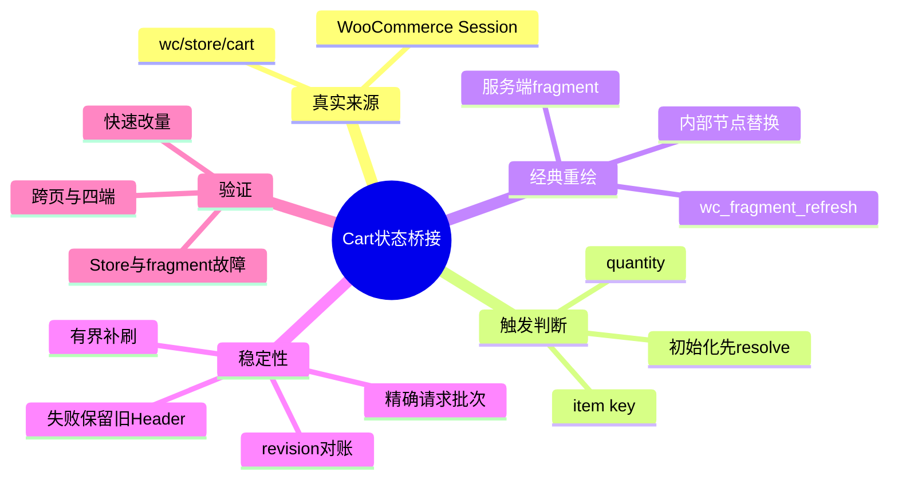
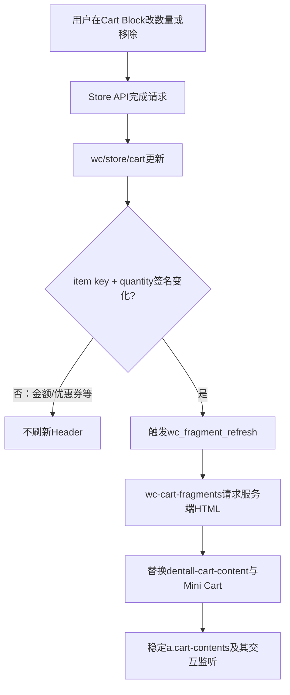

# Day69 WordPress实战：Cart Store与经典Fragments桥接

## 相关笔记

- 学习索引：[[WordPress实战笔记索引]]
- 对应项目笔记：[[../Day69-Header Cart与Mini Cart状态联动|Day69-Header Cart与Mini Cart状态联动]]
- 前置学习笔记：[[Day33-单一导航DOM与购物车Fragment]]、[[Day66-集成基线与商品全链路回归]]
- 后续学习笔记：暂无；W12集成后按真实工作回填
- 同主题知识：[[Day58-WooCommerce原生加购与测试隔离]]、[[Day61-变体生命周期与展示语义]]

> [!check] 双向链接
> 本笔记、Day69项目笔记、学习索引及直接相关的Day33/Day66学习笔记均显式互链；“初识”不等于用户已经完成费曼自测。

## 今日学习成果

- [ ] 我能解释为什么Cart Block中的商品数量已经改变，经典Header Cart仍可能显示旧数量。
- [ ] 我能从`wc/store/cart`追踪到`wc_fragment_refresh`、fragment响应及Header内部节点替换。
- [ ] 我能在隔离Local验证成功、失败、快速连续变更、跨标签页和四端布局，并说清回滚边界。

## 真实项目场景

### 今天解决了什么问题

D33的Header数量由服务端`WC()->cart`首屏输出，并由经典`wc-cart-fragments`负责传统AJAX刷新；当前Cart页面却是WooCommerce Cart Block，它通过Store API更新`wc/store/cart`。两套机制共享同一个WooCommerce Session，但浏览器内没有天然的反向通知，因此用户在Cart页改数量或移除商品后，商品列表已经正确，Header徽标和Mini Cart仍可能保留旧状态，直到刷新或导航。

### 学习范围

- 本篇要掌握：单一真实状态源、Store订阅、经典fragment重绘、初始化竞态、连续变更串行化、失败保底和DOM监听器保留。
- 本篇明确不展开：重写Cart/Mini Cart、优惠券和金额语义、结账/订单/支付、跨标签页主动广播、自定义接口或第二购物车Store。
- 项目中的真实入口：`inc/setup.php`、`assets/js/cart-header-sync.js`、`inc/storefront-hooks.php`、Cart Block页面与WooCommerce公开脚本依赖。
- 验证版本与环境：隔离Local，WordPress 7.0.4、WooCommerce 11.0.0、Storefront 4.6.2、PHP 8.2.29；不外推到Staging、Production或未来版本。

## 先建立整体模型

### 一句话模型

Cart Block继续掌握购物车事实，DentAll只在商品键或数量改变后敲响经典fragment的“重绘铃”，让服务端重新输出Header与Mini Cart，而不复制或修改交易数据。

### 记忆宫殿或实体比喻

把商城想成仓库和门店共用一本库存总账：仓库扫描台是Cart Store，实时知道购物篮里的每件商品；门店门口的电子牌是经典Header Cart；`wc_fragment_refresh`是要求后台重新打印电子牌内容的呼叫铃。DentAll桥接脚本不是第二本总账，它只观察“货物身份或件数是否变了”，变化时按一次铃。若打印机暂时失败，旧牌保留，不能凭空写一个猜测数字。

### 比喻对应回真实机制

| 记忆对象 | 真实技术对象 | 不能混淆的边界 |
|---|---|---|
| 仓库总账 | WooCommerce `wc/store/cart`数据Store与服务端Session | DentAll不复制商品、价格、库存或金额事实 |
| 呼叫铃 | jQuery事件`wc_fragment_refresh` | 事件只请求经典fragment刷新，不直接写购物车 |
| 打印机 | `wc-cart-fragments`调用WooCommerce fragment端点 | 失败时没有新HTML，不应清空或猜测Header |
| 电子牌内芯 | `span.dentall-cart-content` | 只替换动态内芯，稳定的`a.cart-contents`继续持有父主题监听器 |
| 调度牌 | 精确fragment请求集合、Cart revision和一次纠正预算 | 等旧请求全部落地再决定，不是通用任务队列或无限重试器 |

> [!warning] 准确性检查
> Store数据与服务端Session最终相关，但浏览器Store、fragment HTML和DOM不是同一个对象；成功更新其中一个，不能推断另外两个已经同步。

## 思维导图



最重要的主干是“Store只负责事实，桥接只负责通知，fragment只负责服务端重绘”；任何一层都不越权成为第二购物车系统。

## 请求与生命周期调用链



- 触发条件：当前请求是包含`woocommerce/cart`区块的WooCommerce Cart页面，且官方Cart Store中商品键或数量改变。
- 加载入口：`wp_enqueue_scripts`优先级55。
- 执行顺序：依赖加载 → `resolveSelect().getCartData()`完成初始化 → Store订阅 → 变化签名比较 → 经典fragment刷新。
- 输入数据：Store返回的`items[].key`与`items[].quantity`。
- 输出或副作用：发起既有fragment请求并更新页面片段；不新增数据库表、接口、Cookie或持久状态。
- 可观察证据：Header数量、Mini Cart行项/小计、Network中的单并发fragment请求及DOM节点是否保持同一引用。

## 核心概念卡

| 概念 | 准确定义 | DentAll真实例子 | 常见误区 | 如何验证 |
|---|---|---|---|---|
| 单一真实状态源 | 业务事实只有一个权威来源，派生视图不反向自建事实 | Cart Store与服务端Session仍由Woo管理 | 把Header数字存成第二份状态 | 搜索自定义storage、接口和数据写入应为0 |
| Store初始化屏障 | 订阅前等待当前Store数据解析完成 | `resolveSelect(cartStore).getCartData()` | 把初始空壳→水合误判为用户改量 | 首屏不产生多余fragment请求 |
| 最小签名 | 只比较影响目标视图的稳定字段 | 排序后的`[item.key, quantity]` | 对整个Cart对象序列化，优惠券/总额变化也刷新 | 优惠券单独变化时fragment请求为0 |
| Fragment | 服务端返回、由客户端按CSS选择器替换的HTML片段 | `span.dentall-cart-content`与Mini Cart | 认为fragment就是购物车事实或REST Store | 对照响应、DOM和Session三层 |
| 批次收敛 | 先跟踪Woo已在途的同端点请求，全部落地后按Cart revision判断是否需要一次刷新 | `activeFragmentRequests`、`cartRevision`和有界预算 | 任意成功事件都被误当作本次请求完成 | 延迟旧响应后最终Header必须追平Store |
| 节点身份 | 同一个DOM对象可持有父主题运行时绑定 | 保留`a.cart-contents`，只换内部内容 | 替换出相同HTML就等于保留监听器 | 刷新前后比较锚点对象并测试触控/键盘 |

## 项目实战代码

### 涉及文件

- `app/public/wp-content/themes/dentall/inc/setup.php`：按Cart Block身份条件加载桥接及官方依赖。
- `app/public/wp-content/themes/dentall/assets/js/cart-header-sync.js`：订阅Cart Store、比较签名并按精确fragment请求批次有界收敛。
- `app/public/wp-content/themes/dentall/inc/storefront-hooks.php`：服务端输出稳定链接和可替换的动态内芯。
- `app/public/wp-content/themes/dentall/assets/css/site-shell.css`：Mini Cart在焦点进入面板后保持可见。

### 从入口开始追踪

1. WordPress执行`wp_enqueue_scripts`，主题先确认`is_cart()`和`has_block( 'woocommerce/cart' )`。
2. 只有Cart Block页面登记`dentall-cart-header-sync`，依赖`jquery`、`wp-data`、`wc-blocks-data-store`和`wc-cart-fragments`。
3. JavaScript先等待`getCartData()`解析，记录商品签名后才开始订阅，避免把Store水合当成用户修改。
4. 签名变化时触发Woo已有事件，不直接调用内部REST端点，也不直接改Header数字。
5. 服务端fragment只替换链接内部`span`；若移除桥接，同页改量会重新出现“Cart正确、Header旧值”，刷新页面后才恢复。

### 关键代码片段

`inc/setup.php`中的真实条件加载节选：

```php
if ( ! is_cart() || ! has_block( 'woocommerce/cart' ) ) {
	return;
}

wp_enqueue_script(
	'dentall-cart-header-sync',
	get_stylesheet_directory_uri() . '/assets/js/cart-header-sync.js',
	array( 'jquery', 'wp-data', 'wc-blocks-data-store', 'wc-cart-fragments' ),
	$theme->get( 'Version' ),
	true
);
```

`cart-header-sync.js`中的真实变化判断节选：

```javascript
wpData.resolveSelect(cartStore).getCartData().then((initialCartData) => {
	let previousItemSignature = getItemSignature(initialCartData);

	wpData.subscribe(() => {
		const nextItemSignature = getItemSignature(
			wpData.select(cartStore).getCartData()
		);

		if (nextItemSignature !== previousItemSignature) {
			previousItemSignature = nextItemSignature;
			requestFragmentRefresh();
		}
	}, cartStore);
});
```

`storefront-hooks.php`中的真实fragment选择器节选：

```php
ob_start();
dentall_cart_link_content();
$fragments['span.dentall-cart-content'] = ob_get_clean();
```

| 代码 | 表面动作 | WordPress/WooCommerce中的真实作用 | 为什么这样写 |
|---|---|---|---|
| `has_block()` | 查页面内容 | 区分Block Cart与经典Cart页面 | 避免无关页面下载和执行桥接 |
| `resolveSelect()` | 读取Store | 等当前resolver完成后建立基线 | 阻断初始化假变化 |
| 排序签名 | 拼一个字符串 | 只捕获商品身份和数量的最终集合 | 顺序或总额变化不制造重绘 |
| `wc_fragment_refresh` | 触发事件 | 复用Woo公开的经典刷新路径 | 不复制端点、nonce或响应处理 |
| 内部`span` selector | 局部换HTML | 保留父主题已绑定的锚点 | 维持Mini Cart焦点和触控行为 |

### 运行证据

- 页面：隔离Local的Block Cart、Home、Shop、Simple Product、My Account，以及匿名和Customer会话。
- 正常结果：数量1→2时Header 1→2；刷新后仍为2；移除后Header为0。Variable商品数量2和移除同样通过。
- 失败与边界：fragment失败或HTTP 200但缺目标fragment时保留旧Header并释放状态，下一次有效商品变化恢复；Store API失败不触发fragment；快速连续变化最大fragment并发为1；优惠券单独变化不触发Header重绘。
- 竞态结果：首次缓存请求的旧响应被延迟时，桥接等待该批次结束后再刷新，最终Header与Store一致；BFCache恢复后继续改量仍能刷新。
- 已知P2：浏览器完全禁用Web Storage时，Woo 11.0不会消费`wc_fragment_refresh`；两个标签页极端错序且来源页关闭时，另一页可能暂显旧Header。两者都不改变服务端Cart，导航或后续变化可恢复，最晚在W12集成/非Local浏览器矩阵复审。
- 交互结果：非空Mini Cart展示商品、`1 × $24.99`与`Subtotal: $24.99`；鼠标、键盘及模拟触屏入口通过，移除后为空态且Header为0。
- 四端结果：390、768、1024、1440px的Header Cart均在视口内；脚本只在Block Cart出现一次，五个对照页面为0。
- 证据不能证明：真实手机/屏幕阅读器、Production缓存/CWV、未来Woo/Storefront版本、D70优惠券金额呈现或非Local部署。

## 职责边界

| 层级 | 本主题中负责什么 | 不应该负责什么 |
|---|---|---|
| WordPress Core | enqueue、依赖排序、区块检测和Data Store基础 | 不修改核心文件 |
| WooCommerce | Store API、Cart Store、Session、fragment请求、Mini Cart事实 | 不由子主题重写交易与库存 |
| Storefront父主题 | Header Cart/Mini Cart结构习惯及桌面/触控监听 | 不直接修改父主题源码 |
| DentAll子主题 | 条件桥接、稳定Header标记、展示与可访问状态 | 不成为第二购物车或跨主题业务系统 |
| `dentall-core` | 本次无职责 | 不把主题专属DOM桥接塞入站点核心插件 |
| 数据库与Session | Woo按原生机制保存购物车会话 | 不写TEST商品、订单或自定义持久状态 |
| 浏览器 | 订阅Store、发事件、替换片段和呈现交互 | 不把DOM旧值当服务端最终事实 |

## Hook、API或模板机制详解

| 项目 | 说明 |
|---|---|
| Enqueue Action | `wp_enqueue_scripts`，主题优先级55 |
| 页面条件 | `is_cart()`且正文包含`woocommerce/cart`区块 |
| Store descriptor | `window.wc.wcBlocksData.cartStore`，对应`wc/store/cart` |
| 初始化读取 | `wp.data.resolveSelect(cartStore).getCartData()` |
| 定向订阅 | `wp.data.subscribe(callback, cartStore)` |
| 经典事件 | `wc_fragment_refresh`；Woo内部完成/失败事件保留，但D69用公开`ajaxSend/ajaxComplete`按精确官方端点识别请求身份 |
| Fragment Filter | `woocommerce_add_to_cart_fragments`，返回加入内部选择器后的数组 |
| 缓存键 Filter | `woocommerce_cart_fragment_name`，D69升级为`_dentall_header_v2` |
| 副作用 | 仅在有效商品变更后新增一次fragment HTTP请求；旧响应批次末态冲突时最多有界纠正一次 |
| 移除方式 | 回退D69提交即可恢复D33首屏/经典行为；旧v2浏览器键自然失效，不手动删全站storage |

## 安全、数据与站点影响

| 检查面 | 本次结论 | 证据或待验证项 |
|---|---|---|
| 输入清洗与验证 | 不接收自定义输入；只读取官方Store已规范化的key/quantity | JS不构造交易请求参数 |
| Capability | 不适用 | 匿名购物车仍按Woo Session权限边界工作 |
| Nonce | 不新增 | Store API与fragment安全机制继续由Woo负责 |
| 输出转义 | 动态数量和可访问文案使用`esc_html()`，URL使用`esc_url()` | PHP静态复核与实际HTML通过 |
| 数据库写入 | D69代码不新增写入；测试购物车只写隔离Session | 隔离数据恢复后复核 |
| URL与SEO | Slug、Canonical、robots、Schema、Sitemap均不改 | 对照页资源作用域与HTML检查 |
| 缓存 | fragment浏览器键v1→v2，触发一次新结构获取；Web Storage禁用态为已登记P2 | 未改变页面缓存/CDN；Production未验 |
| 支付、物流与订单 | 不涉及 | 没有进入Checkout、创建订单或启用真实支付 |
| 部署与回滚 | 当前仅分支和隔离Local候选 | 未合并、未推送、未部署非Local |

## 动手练习

### 练习一：只读观察

- 目标：区分Cart Store、Header DOM和服务端fragment三层状态。
- 操作：在DevTools中记录`select(cartStore).getCartData().items`、Header count和fragment网络请求，再改一次数量。
- 预期：Store先完成变更，随后一个fragment请求使Header与Mini Cart追平。
- 实际证据：隔离Local的1→2→0探针符合该顺序。

### 练习二：Local最小改动

- 改动：临时在DevTools中阻止`cart-header-sync.js`，不修改源码。
- 风险边界：只在隔离Local和当前浏览器会话；不改核心、数据库、支付或Production。
- 验证：Cart Store数量变为2而Header保持1，重新加载后Header恢复2。
- 回滚：取消请求阻止并刷新页面。

### 练习三：故障推演

- 假设症状：Cart数量正确，但Header持续是旧值。
- 可能原因：桥接未加载、Store未通知、签名未变、fragment请求失败，或旧缓存仍替换整个锚点。
- 第一项检查：Network中脚本是否只在Cart Block加载且依赖是否成功。
- 为什么先查它：入口或依赖缺失会让后续Store和fragment推理全部失去前提。

## 常见误区与排错顺序

| 现象或误区 | 可能原因 | 推荐检查顺序 | 最小验证方法 |
|---|---|---|---|
| 首屏自动多刷一次 | 订阅早于Store水合 | 1. 看首屏请求；2. 看resolver完成时机 | 空操作加载Cart并计数fragment请求 |
| 改优惠券也刷新Header | 比较了整个Cart对象 | 1. 看签名字段；2. 看请求触发 | 只应用/移除优惠券，期望0次 |
| 快速改量并发多请求 | 没有识别Woo已有fragment批次 | 1. 看精确端点Network；2. 对照revision和在途集合 | 连续两次变更并记录请求数与最大并发 |
| 旧响应晚到覆盖新Header | 只监听通用完成事件，无法识别请求身份 | 1. 延迟首次fragment；2. 改Store；3. 最后放行旧响应 | 最终Header应追平Store且不无限请求 |
| 刷新后触屏直接跳Cart | fragment替换了整个锚点 | 1. 比较节点身份；2. 查父主题监听 | 前后保存锚点引用并执行首次触摸 |
| fragment失败后数字被清空 | 客户端猜测或主动覆盖 | 1. 看响应；2. 看DOM写入 | 中止一次fragment，旧Header应保留 |

## 掌握标准

- [ ] 不看笔记，能在2分钟内讲清整体因果链。
- [ ] 能指出项目中的真实入口文件、Hook、Store descriptor和事件。
- [ ] 能区分Cart事实、fragment HTML、DOM节点与浏览器缓存。
- [ ] 能说明初始化、快速变更、Store失败和fragment失败四条路径。
- [ ] 能在Local完成最小验证，并说清回滚方法。
- [ ] 能判断本改动对数据、URL、SEO、缓存、支付、物流和部署的影响。

当前掌握度：**初识，待费曼自测**。

## 费曼测试题

1. 不使用专业术语，解释为什么购物车列表已经是2，Header还可能显示1。
2. “仓库总账、呼叫铃、打印机、电子牌内芯”分别对应什么真实对象？比喻在哪里失效？
3. 从点击Cart数量加号开始，按顺序讲出Store API、Cart Store、订阅、fragment和DOM发生了什么。
4. 为什么必须先`resolveSelect()`再建立签名？删掉这个屏障会有什么可观察现象？
5. 为什么签名只含商品key和quantity，而不含优惠券、总额或运费？
6. 为什么替换相同HTML的整个`a.cart-contents`仍可能破坏交互？如何证明节点是否保留？
7. 若fragment请求失败，为什么保留旧Header并等下次真实变更，比客户端猜数量或无限重试更安全？

### 我的费曼答案与纠正

待用户自测。每题标记`通过`、`含糊`或`答错`，并把知识缺口链接到本篇对应章节。

### 自测评分

| 分数 | 标准 |
|---:|---|
| 0 | 无法解释，或只能猜术语 |
| 1 | 能说定义，但说不清因果、边界和证据 |
| 2 | 能用通俗语言解释，并准确对应技术机制与项目证据 |

总分：待填写 / 14；存在0分题时不提升掌握度。

## 间隔复习记录

| 复习节点 | 计划日期 | 完成 | 暴露的问题 | 修正位置 |
|---|---|---|---|---|
| D+1 | 2026-09-09 | [ ] | 待复习 | 待填写 |
| D+3 | 2026-09-11 | [ ] | 待复习 | 待填写 |
| D+7 | 2026-09-15 | [ ] | 待复习 | 待填写 |
| D+14 | 2026-09-22 | [ ] | 待复习 | 待填写 |

## 收尾总结

- 我今天真正理解了：现代Cart Store与经典fragment可以共享Session却不自动共享浏览器刷新事件，桥接应只传递最小通知。
- 我仍然容易混淆：一次HTTP成功、Store已更新、DOM已更新和交互监听仍存活是四个不同断言。
- 下次遇到类似问题，我会先检查：真实状态源、初始化时机、触发字段、请求并发、替换选择器和失败保底。
- 下一篇直接相关学习笔记：W12集成或WooCommerce升级复验时按真实工作创建并双向回填。

## 后续如何向AI高效提问

### 提问公式

`版本与页面类型 + 真实状态源 + 最小代码 + Store/Network/DOM三层证据 + 已测失败路径 + 不可触碰边界`

示例：

```text
WooCommerce 11.0.0的Block Cart通过wc/store/cart更新，但Storefront经典Header仍显示旧数量。
请基于公开Store descriptor和wc-cart-fragments分析，不新增接口或第二状态Store。
我已提供：enqueue依赖、Store变更前后、fragment Network记录、DOM替换选择器与失败复现。
请区分事实、推断和待验证项，并给出仅Local的最小验证与回滚步骤。
```

> [!warning] AI验证边界
> API名称、脚本handle和父主题监听方式都可能随版本变化；AI解释必须回到当前WooCommerce/Storefront源码和Local运行证据复核。

## 变种应用到其他项目

| 新场景 | 保持不变的原则 | 可能变化的实现 | 必须重新确认 | 最小验证 |
|---|---|---|---|---|
| 另一个Storefront子主题 | 单一事实源、最小通知、失败保底 | Header选择器和自定义标记 | 主题版本及既有fragment Filter | 数量、移除、键盘和触控 |
| 其他经典WordPress主题 | 不复制Cart业务数据 | Mini Cart Hook与事件绑定 | 主题是否使用Woo标准fragment | DOM身份与四端交互 |
| WordPress区块主题 | 状态与视图职责分离 | Header也可能是Cart区块，无需经典桥 | Header实际Store与渲染机制 | 同页更新和导航恢复 |
| 独立插件实现 | 按生命周期和复用边界归属 | 条件加载和兼容层位置 | 是否跨主题、是否需故障隔离 | 多主题启停与回滚 |
| Shopify或其他平台 | 真实Cart为唯一来源，派生Header可恢复 | Cart API、Section Rendering或主题事件，待验证 | 官方接口、缓存、权限与发布模型 | 改量、失败、并发和跨页 |

### 变种练习

选择“WordPress区块主题”，先回答：Header是否已经消费同一Store；若是，桥接是否应删除；若否，官方区块或主题扩展点是什么。未查当前版本源码前，不把DentAll的jQuery事件照搬过去。

## 可复用核心思想

### 跨平台不变量

- 状态同步应先确定唯一事实源，再给派生视图发送最小失效通知；不要复制交易事实来追求“看起来即时”。
- 正常更新只是第一层证据；初始化、快速连续变更、旧响应错序、请求失败、导航恢复和交互监听存活共同决定同步是否可靠。
- 局部HTML替换不仅改变内容，也可能改变DOM对象身份；任何依赖运行时监听器的外层节点都应尽量稳定。

### WordPress/WooCommerce当前实现

- DentAll在WooCommerce 11.0.0的Block Cart页订阅公开`wc/store/cart` descriptor，只比较商品key与quantity，并触发已有`wc_fragment_refresh`；同时用公开jQuery AJAX生命周期和localized endpoint等待Woo自己的fragment批次落地。
- 服务端通过`woocommerce_add_to_cart_fragments`只返回`span.dentall-cart-content`，同时升级`woocommerce_cart_fragment_name`结构键；Mini Cart继续由Woo原生fragment输出。
- 依赖由WordPress enqueue声明，脚本仅在`is_cart()`且存在`woocommerce/cart`区块时加载；没有模板覆盖、自定义REST/AJAX、数据库字段或第二Store。

### Shopify或其他平台的对应机制

- 可迁移的是“Cart API/Store为事实源、Header为派生视图、失败时保留上次服务端事实、只失效必要区域”的原则。
- Shopify Cart API、Section Rendering和具体主题事件可能承担相似职责，但本日未实际验证，标记为**待验证**，不进入DentAll第一版实施范围。
